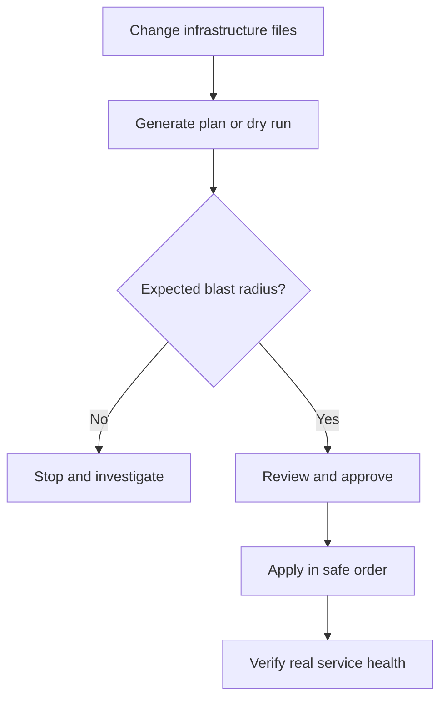
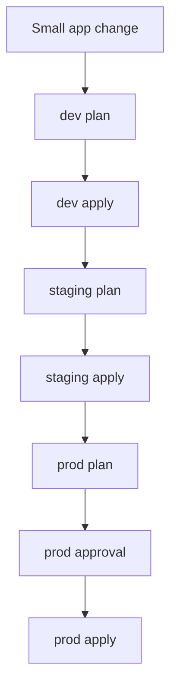

## Table of Contents

1. [What a Safe Change Looks Like](#what-a-safe-change-looks-like)
2. [Plans: Preview Before Apply](#plans-preview-before-apply)
3. [Drift: When Reality Stops Matching Code](#drift-when-reality-stops-matching-code)
4. [Blast Radius: Limit What Can Change](#blast-radius-limit-what-can-change)
5. [Reading a Plan Like a Reviewer](#reading-a-plan-like-a-reviewer)
6. [CI Checks for Infrastructure Changes](#ci-checks-for-infrastructure-changes)
7. [Import, Recreate, or Leave Alone](#import-recreate-or-leave-alone)
8. [A Practical Change Routine](#a-practical-change-routine)

## What a Safe Change Looks Like

An infrastructure change is safest when the team can answer three questions before the real system changes. What is expected to change? What could be damaged if the change is wrong? How will we know the result is healthy afterward? IaC gives you files and tool output that help answer those questions, but the team still has to read them carefully.

The most important preview is usually called a plan. In Terraform and OpenTofu, a plan is the proposed set of actions the tool will take: create, update, replace, delete, or do nothing. In Ansible, check mode and diff mode play a similar role for supported modules: they show what the playbook expects to change before it changes hosts. Different tools use different names, but the habit is the same. Preview first, apply second.

This habit exists because infrastructure changes often affect shared systems. If an application bug reaches production, you can usually deploy a fix. If an infrastructure change deletes a storage bucket, removes a network route, rotates a certificate incorrectly, or opens a private service to the internet, the recovery path may be slower and more stressful. Previewing does not remove all risk, but it catches many mistakes while they are still text on a screen.

In this article, the `devpolaris-orders` team wants to add invoice storage and tighten network access. The work looks small: one bucket, one role, one security rule. The safe-change question is whether the plan really matches that story. If the plan also replaces a load balancer or destroys a database, the team should stop before apply.



The decision point is the heart of the workflow. A plan is not a decoration. It is the evidence the team uses to decide whether the change should continue.

## Plans: Preview Before Apply

A plan compares the desired state in your files with the managed state and the real provider view. The output is a proposal. It tells you what the tool believes it must do to make reality match the files.

Here is a simple plan summary:

```text
Plan: 2 to add, 0 to change, 0 to destroy.
```

That summary is easy to approve if the pull request says "add bucket and app write policy." The count matches the story. It still deserves inspection, but nothing in the summary conflicts with the expected change.

Now compare it with this summary:

```text
Plan: 2 to add, 1 to change, 1 to destroy.
```

This is a different conversation. The two additions may still be correct, but the destroy needs a reason. Maybe an old test rule is being removed. Maybe a resource is being replaced because its name changed. Maybe a production resource moved to a different module address by accident. The plan is asking the reviewer to slow down.

Terraform-style plans use symbols to show action types. A simplified version looks like this:

```text
  # aws_s3_bucket.orders_invoices will be created
  + resource "aws_s3_bucket" "orders_invoices" {
      + bucket = "dp-orders-invoices-prod"
    }

  # aws_security_group_rule.admin_ssh will be destroyed
  - resource "aws_security_group_rule" "admin_ssh" {
      - from_port   = 22
      - to_port     = 22
      - cidr_blocks = ["0.0.0.0/0"]
    }
```

The `+` lines are additions. The `-` lines are removals. In this example, creating the invoice bucket matches the pull request. Removing the open SSH rule may also be good. The important part is that the reviewer can see both actions before they happen.

Ansible check mode has a different shape. A run might say:

```text
TASK [Render nginx site config] ****************************************
changed: [orders-web-01]

TASK [Restart nginx] ***************************************************
skipping: [orders-web-01]

PLAY RECAP *************************************************************
orders-web-01 : ok=4 changed=1 unreachable=0 failed=0 skipped=1
```

For Ansible, the reviewer asks which hosts would change, which files would differ, and whether any handlers or service restarts would run during the real apply. Check mode is only as good as the modules and tasks involved, so it should be paired with small target groups and service verification.

## Drift: When Reality Stops Matching Code

Drift means the real system has changed away from the code. It usually happens when someone changes infrastructure manually, when another automation modifies the same resource, or when a provider changes a computed setting. Drift is not always an emergency, but it is always a signal that the code no longer tells the whole truth.

For example, the IaC file says the orders API bucket should block public access:

```text
bucket: dp-orders-invoices-prod
public_access: blocked
retention_days: 90
```

During a support investigation, someone opens the console and temporarily changes public access so they can download a test object. They intend to change it back. They forget. The real bucket is now different from the file.

On the next plan, the tool may show:

```text
  # aws_s3_bucket_public_access_block.orders_invoices will be updated in-place
  ~ resource "aws_s3_bucket_public_access_block" "orders_invoices" {
      ~ block_public_acls       = false -> true
      ~ block_public_policy     = false -> true
      ~ ignore_public_acls      = false -> true
      ~ restrict_public_buckets = false -> true
    }

Plan: 0 to add, 1 to change, 0 to destroy.
```

The plan is correcting drift. The file says public access should be blocked. The real system says it is not blocked. The proposed change returns reality to the file.

Drift can also reveal that the file is stale. Maybe the manual change was a legitimate emergency fix. In that case, the team should update the IaC files to capture the new intended state, then review that change properly. The important thing is to avoid leaving the system in a split-brain state where production depends on settings that exist only in the console.

Use this table when reading drift:

| Drift Shape | Likely Meaning | Good Next Step |
|-------------|----------------|----------------|
| Tool wants to undo a manual console change | Someone changed reality outside the code | Decide whether to revert reality or update code. |
| Tool wants to change a provider default every run | Configuration may be missing an explicit value | Add the value intentionally or understand the provider behavior. |
| Tool wants to replace a resource after a rename | Code address or identity may have changed | Consider move/import workflow before apply. |
| Tool shows no drift but service is broken | Problem may be outside managed IaC | Check logs, health checks, DNS, data, and dependencies. |

Drift checks are useful because they turn hidden differences into visible work. The work may be "fix production back to the file" or "fix the file to describe production." Either way, the team stops pretending both shapes are the same.

## Blast Radius: Limit What Can Change

Blast radius means the amount of damage a bad change can cause. A typo in a development bucket tag has a small blast radius. A mistaken production database replacement has a large blast radius. Safe infrastructure work tries to make each change small enough that humans can understand it and recover from it.

The first way to reduce blast radius is to separate environments. Development, staging, and production should not all live in one huge apply target unless the team has a strong reason. If a pull request changes only development, the plan should not include production resources. If it does, the structure is telling you something is too coupled.

The second way is to separate ownership boundaries. Networking foundations, shared identity, application infrastructure, and monitoring may deserve separate root modules or playbooks because they change at different speeds and affect different teams. A routine application bucket change should not be able to replace the shared VPC by accident.

The third way is to use staged application. Apply to development first. Then staging. Then production after review. This sounds obvious, but many infrastructure mistakes happen because a team treats `terraform apply` or `ansible-playbook` as one big button that points at the most important environment.



Each environment gets its own preview because each environment has its own real state. A plan generated for development does not prove production is safe. Production may have extra resources, different names, more data, older dependencies, or manual drift that development does not have.

Blast radius also applies to Ansible. A playbook that targets `all` hosts can break every server at once. A safer run might target one canary host, then one availability zone, then the rest:

```bash
$ ansible-playbook -i prod.ini site.yml --limit orders-web-01 --check --diff
$ ansible-playbook -i prod.ini site.yml --limit orders-web-01
$ ansible-playbook -i prod.ini site.yml --limit orders-web
```

The first command previews one host. The second applies one host. The third expands only after the team has evidence that the change behaves correctly. The exact grouping depends on your infrastructure, but the habit is stable: prove the change on a small target before widening it.

## Reading a Plan Like a Reviewer

A good reviewer reads a plan with a different mindset than the author. The author often reads for confirmation: "does this show the change I meant?" The reviewer reads for contradiction: "does this show anything the pull request did not explain?"

Start with the summary:

```text
Plan: 3 to add, 2 to change, 0 to destroy.
```

Then compare it with the pull request description. If the description says "add one invoice bucket", the summary already disagrees. Why are there three additions and two changes? They may be supporting resources, such as a policy and public access block, but the author should name them.

Next, scan destructive actions. In Terraform-style output, replacement often appears as a destroy and create pair, or as an action marker that means replace. Replacements are not always bad. Some fields cannot be updated in place because the provider or platform requires recreation. The reviewer should ask what happens during that replacement. Will DNS change? Will data be lost? Will traffic drain? Will the service have downtime?

Then scan security-sensitive fields:

| Field Type | What To Watch |
|------------|---------------|
| CIDR blocks | `0.0.0.0/0` and `::/0` expose access broadly. |
| IAM actions | Wildcards such as `*` may grant more than needed. |
| Public access flags | Buckets, databases, queues, and dashboards can leak data. |
| Secrets | Sensitive values should not appear in plain plan output or committed files. |
| Encryption and retention | Removing protection can affect recovery and compliance. |
| Deletion protection | Turning it off may be valid, but needs a reason. |

For Ansible, scan host targeting and changed tasks. If the playbook touches `all` hosts, confirm the change is safe for every group. If a template changes, inspect the diff. If a service restarts, confirm the application can tolerate the restart. If a task uses `shell`, ask whether it is idempotent and what happens on the second run.

A plan review should end with a short plain-English match between intent and output:

```text
Expected:
- Add invoice bucket.
- Add role policy for orders-api writes.
- No existing resources destroyed.

Plan shows:
- 2 additions: bucket and role policy.
- 0 changes.
- 0 destroys.
```

That tiny summary helps everyone. It forces the author to explain the plan, gives the reviewer a checklist, and leaves future readers a record of why the apply was considered safe.

## CI Checks for Infrastructure Changes

CI checks make infrastructure review easier by catching mechanical mistakes before humans spend attention on judgment. A CI job can format files, validate syntax, run static checks, generate plans, and post the plan summary to a pull request. The human reviewer can then focus on risk, ownership, and whether the change matches the system design.

A simple Terraform CI flow might do this:

```text
1. Check formatting.
2. Initialize providers in a read-only validation context.
3. Validate configuration.
4. Generate a plan for the target environment.
5. Publish the plan summary to the pull request.
```

An Ansible CI flow may do this:

```text
1. Check YAML formatting.
2. Run ansible-lint.
3. Parse inventories.
4. Run syntax check.
5. Run targeted check mode against a safe test host or container when available.
```

The details vary by team and tool, but the purpose is stable. CI should make unsafe or unclear infrastructure changes harder to merge by accident.

Here is a simplified pull request status table:

| Check | Result | Why It Matters |
|-------|--------|----------------|
| Format | Passed | Keeps diffs readable. |
| Validate | Passed | Confirms the tool can parse the files. |
| Policy | Failed | Public bucket access detected. |
| Plan | Skipped | Plan does not run when policy fails. |

This is a useful failure. The policy check stopped the plan because the proposed file allowed public bucket access. The author can fix the file before any real infrastructure changes.

CI has limits. A validation job can prove syntax is valid. It cannot prove the architecture is right. A policy check can catch known risky patterns. It cannot understand every business exception. A plan can show proposed changes. It cannot guarantee the application will be healthy afterward. The CI system gives evidence, and the team decides what the evidence means.

## Import, Recreate, or Leave Alone

Sooner or later, you will find infrastructure that exists outside the IaC files. Maybe it was created manually before the team adopted IaC. Maybe another team owns it. Maybe it is a vendor-managed resource that should only be referenced. The team has three broad choices: import it, recreate it, or leave it alone.

Import means bringing an existing real resource under IaC management. The resource keeps existing, but the tool records it in state and connects it to a resource block in code. Import is useful when the resource is important, long-lived, and should be managed by this repository going forward.

Recreate means making a new managed replacement and moving traffic or usage over to it. This is useful when the old resource is disposable, badly configured, or safer to replace than to adopt. Recreate can be dangerous for stateful resources such as databases and storage. It needs migration and verification work.

Leave alone means the IaC configuration references the resource without managing its lifecycle, or does not touch it at all. This is common for shared networks, organization-level identity, DNS zones owned by another team, or resources that are intentionally managed by a different system.

| Situation | Better Choice | Reason |
|-----------|---------------|--------|
| Existing production database with customer data | Import or leave alone | Recreating risks data loss. |
| Old development bucket with no useful data | Recreate | Replacement may be simpler and cleaner. |
| Shared VPC owned by platform team | Leave alone or reference | App team should not manage the lifecycle. |
| Manually created app role now owned by the app team | Import | Future permission changes should be reviewed in code. |
| Resource with unknown usage | Investigate first | The right choice depends on who uses it. |

This decision is a source of many beginner mistakes. Writing a resource block for something that already exists does not automatically mean the tool manages that existing object. Without import or a proper data-source/reference pattern, the tool may try to create a duplicate or fail because the name is already taken.

For `devpolaris-orders`, suppose the invoice bucket already exists because someone created it manually last month. The team should not casually add a new resource block and apply. They should decide whether to import the existing bucket into state, reference it as external, or create a new bucket and migrate data. The right answer depends on ownership, data, and future maintenance.

## A Practical Change Routine

A safe IaC routine should be simple enough that the team will actually follow it. The routine below works for a small service team and scales into more formal platform workflows later.

Start with intent. Write one or two sentences before changing files:

```text
I am adding invoice storage for orders-api in production.
Expected infrastructure changes:
- create one private bucket
- attach one write-only app policy
- destroy nothing
```

Then edit the files. Keep the pull request focused. A bucket change, a role refactor, a provider upgrade, and a network restructure should usually be separate changes. Mixed pull requests make plans harder to read and recovery harder to reason about.

Run local checks before review:

```bash
$ terraform fmt
$ terraform validate
$ terraform plan
```

For Ansible:

```bash
$ ansible-playbook -i staging.ini site.yml --syntax-check
$ ansible-playbook -i staging.ini site.yml --check --diff
```

Then compare output with intent. If the plan shows unexpected changes, do not explain them away quickly. Find the cause. It may be drift, a provider default, a module input you forgot, a wrong workspace, a wrong inventory, or a resource address change.

During review, answer the practical questions:

```text
Does the plan match the pull request?
Which environment changes?
Are any resources destroyed or replaced?
Are any public access or IAM permissions widened?
What verification will prove the service still works?
```

After apply, verify the real service, not only the tool output. For the invoice bucket, the team might upload a test invoice through the application, confirm the object lands in the bucket, confirm public access is still blocked, and confirm logs show the app role rather than a human credential.

```text
Verification:
- orders-api health endpoint returns 200
- test invoice upload succeeds
- bucket public access block remains enabled
- application logs show role-based write
- follow-up plan shows no changes
```

The follow-up plan matters. It confirms the apply reached a stable state from the tool's point of view. The application verification matters too. It confirms the infrastructure change actually supports the user-facing behavior.

Plans, drift checks, and blast-radius habits are not paperwork. They are how infrastructure teams slow the risky part down before speeding the routine part up. When you reach Terraform and Ansible, the syntax will be new, but this operating model should already feel familiar: preview the change, read the evidence, apply narrowly, and verify the real service.

---

**References**

- [Terraform plan command](https://developer.hashicorp.com/terraform/cli/commands/plan) - Describes how Terraform creates an execution plan before making infrastructure changes.
- [Terraform workflow for provisioning infrastructure](https://developer.hashicorp.com/terraform/cli/run) - Places plan and apply in the standard Terraform workflow.
- [Terraform state](https://developer.hashicorp.com/terraform/language/state) - Explains why Terraform needs state when comparing configuration with managed resources.
- [OpenTofu state commands](https://opentofu.org/docs/cli/state/) - Covers state operations and the care required when manipulating state.
- [Ansible check mode and diff mode](https://docs.ansible.com/ansible/latest/playbook_guide/playbooks_checkmode.html) - Explains how Ansible can preview supported changes before applying them.
