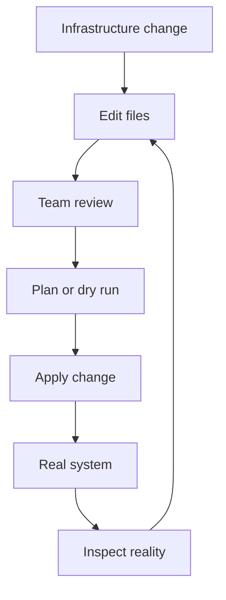

## Table of Contents

1. [The Problem](#the-problem)
2. [What Is IaC](#what-is-iac)
3. [Console Memory](#console-memory)
4. [Files](#files)
5. [Review](#review)
6. [Repeatability](#repeatability)
7. [History](#history)
8. [Boundaries](#boundaries)
9. [Sample Workflow](#sample-workflow)
10. [Putting It All Together](#putting-it-all-together)
11. [What's Next](#whats-next)

## The Problem

A team builds the first version of an orders API quickly. Staging works because one engineer clicked through the cloud console, created a network, added a server, opened the load balancer, made a bucket for invoice exports, and gave the app a role that can write to the bucket.

Then production needs to be created, and the team cannot prove what "same as staging" means.

- The database exists, but nobody can say which subnet and backup settings were chosen on purpose.
- The invoice bucket blocks public access today, but the rule was clicked after creation and is not visible in a pull request.
- The app role works, but the team cannot tell whether it has only invoice-write permission or a broader policy copied from another project.
- A new region might be needed later, and the only rebuild plan is "ask the person who made staging."

Infrastructure as Code, usually shortened to IaC, exists for that moment. It moves infrastructure changes out of private memory and into files that a team can review, run, compare, and recover from.

The working mental model is simple: the cloud console can show what exists, but IaC files explain what the team intended to exist.

## What Is IaC

Infrastructure as Code means describing infrastructure in text files and using a tool to apply those files to real systems. The files might describe cloud resources such as networks, buckets, databases, queues, load balancers, DNS records, and identity roles. They might describe server configuration such as packages, files, users, templates, services, and permissions.

The word "code" can make the idea sound bigger than it is. The first value is not clever programming. The first value is that infrastructure choices become written down before they change a shared environment.

Terraform and OpenTofu usually provision infrastructure by calling provider APIs. Ansible usually configures machines by connecting to hosts and running modules. Other tools have their own shapes. The shared habit is the same: a change starts as a file edit, not as an unreviewed click in a production console.



The loop matters. IaC is not only a way to create the first version of an environment. It is the operating habit for later changes too. The files stay close to the system, and the system keeps being compared back to the files.

## Console Memory

Most teams do not start with IaC. They start by getting the application running. Someone opens a console wizard, chooses a region, picks a network, accepts a few defaults, pastes a startup script, opens a port, and tests the health endpoint.

That is a reasonable way to learn a provider. It becomes risky when those choices become the only source of truth for a shared environment.

The first risk is missing steps. A console form may have many screens. An engineer may remember the instance size and forget the log retention setting. Another may remember the retention setting and choose a different subnet. The two environments look similar enough to ship, but they fail differently later.

The second risk is hidden defaults. Cloud providers choose defaults so forms can be completed quickly. Some defaults are harmless. Others decide whether a storage account is public, whether deletion protection is enabled, whether logs are kept for seven days or ninety days, or whether a database backup policy matches production recovery needs.

The third risk is review after the fact. If the real system changes first, reviewers are left comparing screenshots, console pages, and memory. That is weaker than reviewing the proposed infrastructure before it exists.

| Manual habit | What it hides | IaC habit |
| --- | --- | --- |
| Click through a console | Exact options and defaults | Put the intended settings in files |
| Copy settings by memory | Missing or different choices | Reuse reviewed modules or templates |
| Fix production directly | Reason and approval trail | Make a change proposal first |
| Rebuild from notes | Dependencies and ordering | Re-run the same declared system |

The console still matters. Engineers use it to inspect, debug, and sometimes respond to incidents. IaC changes the default place where routine infrastructure decisions begin.

## Files

IaC files are plain text. That makes them reviewable, searchable, diffable, and easy to keep in version control. A storage bucket can become a small resource block. A server package can become a task. A network rule can become a line that reviewers can question.

For a provisioning tool, the file usually describes resources:

```hcl
resource "aws_s3_bucket" "invoice_exports" {
  bucket = "dp-orders-invoices-prod"

  tags = {
    service     = "orders-api"
    environment = "prod"
  }
}
```

The useful part is not the exact syntax. The useful part is that the bucket name, purpose, and environment tag are visible before the bucket changes production.

For a configuration tool, the file might describe the desired state of a host:

```yaml
- name: Install nginx
  ansible.builtin.package:
    name: nginx
    state: present

- name: Keep nginx running
  ansible.builtin.service:
    name: nginx
    state: started
    enabled: true
```

Again, the value is not that YAML is magical. The value is that the package and service intent are written down in a place the team can read.

Files also make ownership clearer. If the orders team owns `orders-api`, the infrastructure files can sit near that service or in a platform repository with clear ownership. Either layout can work. The unhealthy layout is when production depends on settings that live only in one person's memory.

## Review

IaC turns infrastructure into something a team can review before it changes. A pull request can show the resource being added, the permission being narrowed, the database size being increased, or the network rule being removed.

Good review is not only "does the syntax pass?" Reviewers ask whether the infrastructure change matches the story:

| Pull request story | Reviewer question |
| --- | --- |
| Add invoice export storage | Does the bucket block public access and carry the right ownership tags? |
| Give the app write access | Is the role limited to the invoice bucket instead of all storage? |
| Open HTTPS to users | Is only the public entry point exposed, not the app server or database? |
| Shorten log retention in development | Is the change limited to development and not production? |

This is where IaC connects to security and operations. The reviewer is not reading a console transcript after production changed. They are reading a proposed system. That gives the team a chance to catch a broad permission, a public network path, a missing tag, or an expensive resource size while the mistake is still text.

Plans and dry runs make this stronger, but the habit starts with the files. A change that cannot be reviewed before it lands is harder to trust.

## Repeatability

Repeatability is the reason IaC feels ordinary at first and powerful later. A team can create staging, production, a temporary test environment, or a replacement region from the same declared shape.

Repeatability does not mean every environment is identical. Production may have larger databases, longer retention, stronger deletion protection, and more instances than development. The point is that the differences are deliberate inputs, not accidental console choices.

Think of repeatability at three levels:

| Level | Healthy question |
| --- | --- |
| Resource | Can the tool create the same bucket, role, network rule, or server config again? |
| Environment | Can the team build staging and production from the same pattern with intentional differences? |
| Recovery | If an environment disappears or a region must be rebuilt, is there a known path besides memory? |

This is why IaC often becomes more valuable after the first incident, migration, or audit. The team stops asking "who remembers how production was built?" and starts asking "what do the files say, and did reality drift away from them?"

## History

Version control gives infrastructure a memory. It shows who changed a file, when the change happened, what review approved it, and what the previous version looked like.

That history is useful in ordinary work. If a database setting changed last Tuesday, the team can read the pull request instead of guessing from console timestamps. If a permission became broader, reviewers can find the exact diff. If a setting needs to be rolled back, the old value is visible.

History is also useful during recovery. A backup can restore data, but the application also needs the surrounding infrastructure: network paths, roles, storage, DNS, certificates, log retention, alarms, and service settings. IaC files give the team a rebuild recipe for those surrounding parts.

There is a subtle security benefit too. IaC makes infrastructure change feel less like private administration and more like normal engineering work. That does not remove the need for cloud audit logs, access control, or approval gates. It gives those controls a written change record to connect to.

## Boundaries

IaC does not remove the need to understand the platform. A file can describe a public subnet, but the engineer still needs to know what makes a subnet public. A policy can be written in code, but the reviewer still needs to understand what actions and resources it allows.

IaC also does not make stateful resources casual. Databases, buckets, queues, disks, and DNS records often hold business value or external dependencies. A bad file change can still delete, replace, expose, or disconnect something important if the team approves it blindly.

There are a few boundaries to keep clear:

| Boundary | Why it matters |
| --- | --- |
| Secrets | IaC should reference secrets safely, not commit secret values into the repository. |
| Emergency fixes | Incident response may require a console change, but the fix should be captured back into files. |
| Existing resources | A tool may need import or adoption before it can safely manage resources that already exist. |
| Provider behavior | IaC tools call real APIs, and those APIs still have quotas, defaults, replacement rules, and failure modes. |

The healthy version of IaC is not blind automation. It is reviewed intent plus careful execution.

## Sample Workflow

A simple IaC workflow for the orders API might look like this:


Each stage answers a different question. The file diff asks, "what did the engineer intend to change?" Validation asks, "can the tool understand the files?" The plan asks, "what does the tool think it will change in reality?" Verification asks, "did the service still work after the change?"

Small teams often begin with a local version of this workflow. Mature teams usually move the checks and plan into CI so every infrastructure pull request produces the same evidence. The shape is the same either way.

## Putting It All Together

The orders team started with a staging environment that worked but could not be explained. IaC gives the team a better operating model.

- The database placement, bucket settings, and app role move from console memory into files.
- Production review happens before the real system changes.
- Staging and production can share a pattern while still allowing deliberate differences.
- Version control gives the team a history of why infrastructure changed.
- Emergency console fixes can be brought back into the file model instead of becoming permanent drift.

The key idea is not "use Terraform" or "use Ansible" yet. The key idea is that infrastructure becomes a proposed, reviewable system before it becomes a real one.

## What's Next

The next article explains the mental model behind most IaC tools: desired state. Once infrastructure intent lives in files, the tool needs a way to compare those files with reality and decide what, if anything, should change.

---

**References**

- [Terraform: Infrastructure as Code](https://developer.hashicorp.com/terraform/intro)
- [OpenTofu: Core workflow](https://opentofu.org/docs/intro/core-workflow/)
- [Ansible playbooks](https://docs.ansible.com/ansible/latest/playbook_guide/playbooks_intro.html)
