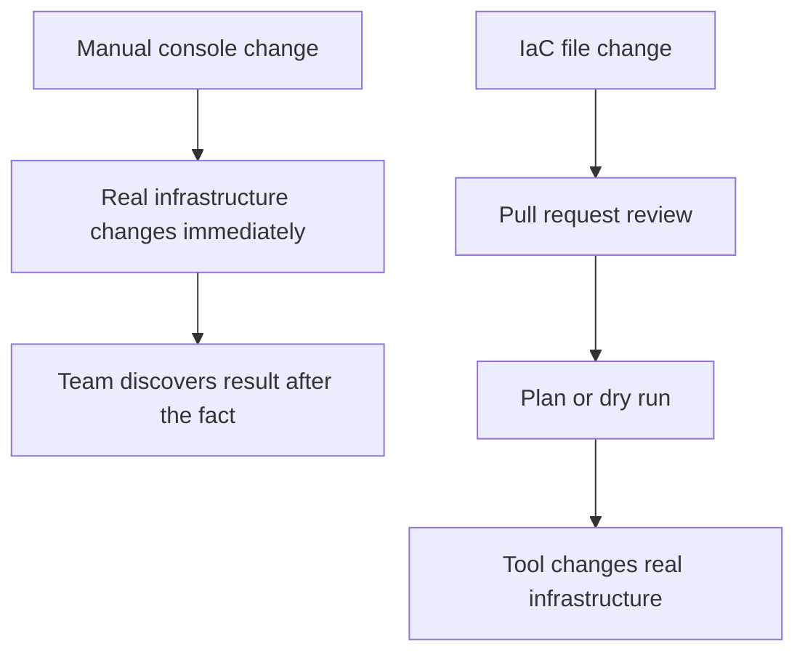
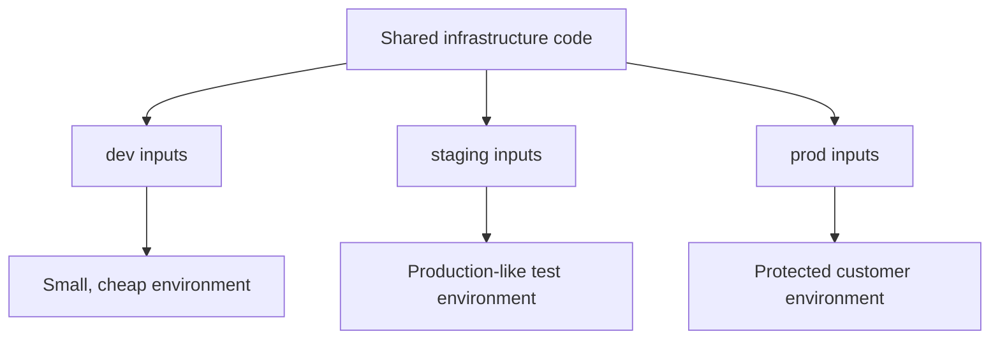
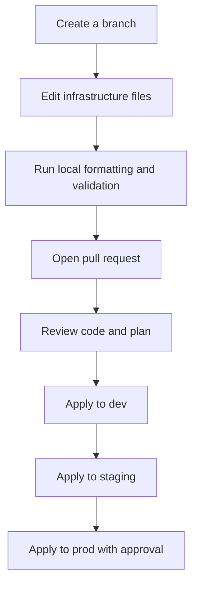

## Table of Contents

1. [What Changes When Infrastructure Becomes Code?](#what-changes-when-infrastructure-becomes-code)
2. [The Problem With Console Memory](#the-problem-with-console-memory)
3. [The Files That Represent Real Systems](#the-files-that-represent-real-systems)
4. [Review Turns Infrastructure Into Team Knowledge](#review-turns-infrastructure-into-team-knowledge)
5. [Repeatability Across Environments](#repeatability-across-environments)
6. [History, Recovery, and Accountability](#history-recovery-and-accountability)
7. [Where IaC Stops and Other Tools Begin](#where-iac-stops-and-other-tools-begin)
8. [A First Team Workflow](#a-first-team-workflow)

## What Changes When Infrastructure Becomes Code?

A server changed by hand remembers only its current shape. It does not remember why a port was opened, who changed a timeout, which ticket approved a new database, or whether staging received the same change as production. The cloud console shows the result, but it rarely tells the full story behind the result.

Infrastructure as Code, often shortened to IaC, means describing infrastructure in files and using a tool to apply those files to real systems. The files might describe cloud resources such as networks, load balancers, databases, queues, buckets, and IAM roles. They might also describe server configuration such as packages, files, users, services, and templates. The important shift is that the desired infrastructure lives in a repository before it lives in the cloud account or on the server.

IaC exists because manual infrastructure changes are difficult to repeat safely. One engineer can click through a console and create a working staging environment, but a second engineer may not remember every option when production needs the same thing. A tool can read the reviewed files and make the same choices again. That gives the team a repeatable path instead of a set of memories.

In the larger DevOps system, IaC sits between cloud knowledge and delivery automation. The Cloud Providers section teaches what resources are: accounts, regions, networks, compute, storage, identity, observability, and cost controls. IaC teaches how teams change those resources through files. CI/CD then teaches how those changes move through review, validation, and release.

We will use a small `devpolaris-orders` API as the running example. The team needs one production environment with a private network, an application server, an object storage bucket for invoices, and a restricted role that lets the app write only to that bucket. The details could be AWS, Azure, or GCP. The operational problem is the same: the team needs to create and change infrastructure without relying on one person's console session.

## The Problem With Console Memory

Most teams do not start with IaC. They start by making the smallest change that gets the application running. Someone opens the cloud console, creates a virtual machine, selects a network, opens port `443`, pastes a startup script, and checks whether the health endpoint responds. That is a reasonable way to learn a cloud provider, but it becomes risky when the same pattern is used for shared environments.

The first risk is missing steps. A console wizard may have twelve screens. An engineer might remember the instance size and region but forget the logging option. Another engineer might remember the logging option but choose a different subnet. Both environments look similar enough at a glance, but they behave differently under load or during an incident.

The second risk is hidden defaults. Cloud consoles often pick defaults to help users finish the form. Some defaults are harmless. Others decide whether storage is encrypted, whether public access is allowed, whether logs are retained for seven days or ninety days, or whether a resource can be deleted without protection. If those choices live only in a browser form, reviewers cannot inspect them before the change happens.

The third risk is no easy rebuild. If a development environment is deleted, the team can recreate it manually. If production is accidentally deleted or a new region must be built quickly, manual recreation becomes stressful work. You need an exact list of resources, settings, dependencies, secrets, DNS records, and network rules. The console can show what exists now, but it does not provide a clean recipe for building it again.

Here is a realistic example from the `devpolaris-orders` team:

```text
Resource: orders-api-prod
Region: eu-west-2
Public access: yes
TLS: enabled at load balancer
Storage: dp-orders-invoices-prod
App role: orders-api-prod-role
Log retention: 14 days
```

That short note is better than nothing, but it is not an operating model. It does not say which security group rules exist, whether the bucket blocks public access, which policy actions the role allows, or whether log retention was intentionally set to `14` days. A future engineer must open the console and compare several screens by hand.

IaC changes the note into a reviewed set of files. The files become the recipe, the reviewable change, and the rebuild path. The console still matters for inspection and emergency diagnosis, but it stops being the main place where routine infrastructure decisions are made.



The diagram is intentionally simple. The key difference is timing. In the manual flow, the real system changes before the team can review the full shape. In the IaC flow, the proposed shape is written down first, then reviewed, then applied.

## The Files That Represent Real Systems

IaC files are plain text, usually stored beside application code or in a separate infrastructure repository. A Terraform file might describe cloud resources. An Ansible playbook might describe server configuration. Both are infrastructure code because both let the team express an intended system state in version-controlled files.

For a provisioning tool such as Terraform or OpenTofu, a small file might say that an object storage bucket should exist:

```hcl
resource "aws_s3_bucket" "orders_invoices" {
  bucket = "dp-orders-invoices-prod"

  tags = {
    service     = "orders-api"
    environment = "prod"
    owner       = "platform"
  }
}
```

You do not need to know Terraform syntax yet. Read the file like a structured description. The team is saying, "there should be a bucket with this name and these tags." Later articles will explain providers, resources, arguments, state, and plans. For now, notice that the choice is visible. A reviewer can see the bucket name, the environment tag, and the ownership tag before the bucket is created.

For a configuration management tool such as Ansible, a small file might say that Nginx should be installed and running on a server:

```yaml
- name: Configure web entry point
  hosts: web
  become: true
  tasks:
    - name: Install nginx
      ansible.builtin.apt:
        name: nginx
        state: present

    - name: Keep nginx running
      ansible.builtin.service:
        name: nginx
        state: started
        enabled: true
```

Again, do not focus on every field yet. The important idea is that the desired result is captured in a file. The server should have Nginx installed. The service should be started. The service should be enabled at boot. The tool checks the server and changes only what is needed.

The file does not replace engineering judgment. Someone still has to decide whether the bucket name is right, whether the tags are useful, whether Nginx belongs on that host, and whether this should happen in production today. IaC gives that judgment a durable place to live.

| Manual Work | IaC Work |
|-------------|----------|
| Click through forms in the console | Edit files in a repository |
| Remember why choices were made | Review commit history and pull requests |
| Compare environments by inspection | Compare files, plans, and outputs |
| Rebuild from notes and screenshots | Re-run the same reviewed configuration |
| Discover risky defaults after creation | Discuss risky defaults before apply |

The table is not saying the console is bad. The console is useful for learning, inspection, and emergency visibility. The problem starts when the console becomes the only record of how production was created.

## Review Turns Infrastructure Into Team Knowledge

Code review is familiar for application changes. If someone changes a payment calculation, another engineer checks the diff, asks questions, and makes sure tests cover the behavior. Infrastructure deserves the same habit because infrastructure mistakes can be just as serious as application bugs.

For `devpolaris-orders`, a pull request might add a new security group rule:

```diff
+ ingress {
+   description = "Temporary admin access"
+   from_port   = 22
+   to_port     = 22
+   protocol    = "tcp"
+   cidr_blocks = ["0.0.0.0/0"]
+ }
```

A reviewer does not need to be a Terraform expert to notice the risk. Port `22` is SSH. `0.0.0.0/0` means any IPv4 address on the internet. The description says "Temporary", but the file has no expiration date, ticket link, source office IP, or safer access path. This change deserves a conversation before it reaches production.

Without IaC, the same change might happen in the console during a debugging session. The engineer opens SSH to the world, fixes the server, and intends to close the rule later. If they are interrupted, the rule stays. The system now has a security exposure that may not appear in application logs or deployment notes.

Review also spreads knowledge. A junior engineer sees how the platform team names resources, tags ownership, restricts access, and separates environments. A senior engineer sees where the current patterns are confusing. A security engineer can comment on risky permissions before they become real permissions. The pull request becomes a classroom and a control point at the same time.

Good infrastructure review usually asks practical questions:

| Review Question | Why It Matters |
|-----------------|----------------|
| Which environment changes? | Prevents a development fix from touching production by mistake. |
| Which resources are created, changed, or destroyed? | Shows the actual blast radius of the change. |
| Does the change expose anything publicly? | Catches accidental internet access before apply. |
| Does it add permissions? | Helps keep roles narrow and auditable. |
| Is there a rollback or recovery path? | Gives the team a plan if the apply does the wrong thing. |

These questions are easier to answer when the infrastructure lives in files and the tool can produce a plan or dry run. The next two fundamentals articles will go deeper on desired state, idempotency, plans, drift, and safe changes.

## Repeatability Across Environments

Most application teams need more than one environment. A small team might have `dev`, `staging`, and `prod`. A larger team might also have preview environments for pull requests, shared test accounts, disaster recovery regions, or per-team sandboxes. The more environments you have, the more painful manual setup becomes.

Repeatability does not mean every environment is identical. Production may use larger instances, stricter network access, longer log retention, and stronger deletion protection. Development may use smaller resources and shorter retention to save money. Repeatability means those differences are intentional and visible.

For example, the `devpolaris-orders` team may want this shape:

```text
dev:
  instance_size: small
  log_retention_days: 7
  deletion_protection: false

staging:
  instance_size: medium
  log_retention_days: 14
  deletion_protection: false

prod:
  instance_size: large
  log_retention_days: 90
  deletion_protection: true
```

Those differences make sense. Development is cheap and replaceable. Staging is closer to production but still disposable. Production protects customer data and needs longer evidence during incidents. IaC lets the team encode those differences as inputs, variables, inventories, or environment files rather than as undocumented console choices.



This pattern is one reason IaC is important for learners. You are not just learning another syntax. You are learning how teams keep development, staging, and production similar enough to trust, while still giving each environment the size and protections it needs.

Repeatability also helps with disaster recovery. If a region has an outage or an account must be rebuilt, a team with IaC has a known starting point. They still need backups, secrets, DNS decisions, data restoration, and careful testing. IaC does not solve the whole recovery problem. It does remove the question, "how did we create the infrastructure last time?"

## History, Recovery, and Accountability

Git history is one of the quiet benefits of IaC. Application teams already use history to answer questions like "when did this API behavior change?" Infrastructure teams need the same ability for networks, permissions, databases, and deployment targets.

Imagine a production API starts returning `502` responses after a deployment. The application logs show that the process is healthy, but the load balancer cannot reach it. The infrastructure repository shows a pull request merged thirty minutes earlier:

```diff
- health_check_path = "/health"
+ health_check_path = "/ready"
```

That diff is useful evidence. It shows that the health check path changed. It gives the team a specific thing to verify. Does the application expose `/ready`? Does it return `200` before the service receives traffic? Did staging pass because it was still using the old load balancer target group? The history narrows the investigation.

History also helps with recovery. If a change created a bad firewall rule, the team can revert the commit, run a plan, and apply the correction. Reverting infrastructure is not always as simple as reverting application code because real resources may have data, dependencies, and provider constraints. Still, a reviewed previous state is much better than trying to remember every old console setting.

Accountability does not mean blame. It means the team can connect changes to reasons. A good infrastructure pull request says what changed, why it changed, which environments are affected, and how the reviewer can verify the result. During an incident, that trail reduces guessing.

Here is a healthier change record:

```text
Change: increase orders-api log retention from 14 to 90 days
Reason: production incident review needs longer search window
Environment: prod only
Verification: log group retention shows 90 days after apply
Risk: small cost increase
Rollback: return retention_days to 14 if storage cost is too high
```

That record gives future engineers context. Six months later, someone will know why logs cost more and why reducing retention might affect incident reviews.

## Where IaC Stops and Other Tools Begin

IaC is a broad phrase, but the root has a simple shape in this roadmap. The fundamentals module teaches the shared ideas. Terraform teaches provisioning: creating and changing infrastructure resources such as networks, servers, databases, queues, buckets, identities, and load balancers. Ansible teaches configuration management: changing the inside of existing machines by installing packages, writing files, managing users, and controlling services.

The boundary matters because different tools have different operating models.

| Question | Terraform or OpenTofu | Ansible |
|----------|------------------------|---------|
| What does it usually manage? | Cloud resources and infrastructure services | Existing hosts and operating system configuration |
| How does it know what exists? | State plus provider APIs | Connects to hosts and checks them directly |
| Common file style | Declarative resource configuration | YAML playbooks with ordered tasks |
| Common safety preview | `plan` | `--check` and `--diff` |
| Common risk | State mistakes and broad resource changes | Non-idempotent tasks and unsafe host targeting |

Some teams use both. Terraform creates the virtual machine, network, storage bucket, IAM role, DNS record, and load balancer. Ansible connects to the virtual machine and installs packages, writes configuration files, and restarts services. Other teams use images, containers, managed services, or Kubernetes and need less Ansible. The right split depends on how the system is operated.

IaC also does not replace CI/CD. A pull request can review infrastructure code. A CI job can format it, validate it, run policy checks, and produce a plan. A deployment process can decide when to apply it. The IaC tool changes infrastructure, but the delivery process decides how that change is proposed, approved, and rolled out.

IaC does not replace cloud knowledge either. A tool can create a public bucket if the file asks for one. It can attach an administrator policy if the file asks for one. It can delete a database if the plan says deletion is required and the operator approves it. You still need to understand the resources you are describing.

That is why this root comes after cloud fundamentals. You first learn what the cloud pieces mean. Then you learn how to change them through code.

## A First Team Workflow

A useful beginner workflow has only a few steps. You do not need a large platform team to benefit from IaC. You need a repository, review, a preview step, and a careful apply habit.

Here is a first workflow for `devpolaris-orders`:



Each step has a job. The branch gives the change a workspace. Formatting and validation catch simple mistakes before review. The pull request lets teammates inspect intent. The plan or dry run shows what the tool believes it will change. Applying to development first gives the team fast feedback. Staging checks the production-like path. Production waits until the team understands the result.

For a tiny side project, this may feel like a lot. For a shared service with customer data, this is the minimum habit that keeps infrastructure changes from becoming surprises. The goal is not ceremony. The goal is to make the risky parts visible before they affect users.

A first pull request might include a short checklist:

```text
Change summary:
- Add invoice storage bucket for orders-api.
- Add app role permission for PutObject on that bucket only.
- Add tags for service, owner, and environment.

Checked:
- Plan creates 2 resources and destroys 0 resources.
- Bucket public access remains blocked.
- Dev apply completed successfully.
- Staging smoke test uploaded one test invoice.
```

That checklist is useful because it records the engineering reasoning in plain language. A reviewer can compare the checklist with the plan. If the checklist says "destroys 0 resources" but the plan shows a database replacement, the review stops immediately.

If the team does nothing else at first, it should keep this small loop honest. The pull request should describe the intended infrastructure result. The preview should match that description. The apply should happen in the least risky environment that can prove the change. The verification should check the real service, not only the IaC tool's success message.

That may sound like a process detail, but it changes the team's daily work. A junior engineer can ask useful review questions because the plan is visible. A senior engineer can spot a risky default before it becomes production reality. A future teammate can read the history and understand why the environment looks the way it does.

This is the heart of IaC. The tool syntax matters, but the operating habit matters more. Write the intended shape down. Preview the change. Review it with someone else. Apply it in the safest environment first. Keep the history so future engineers can understand why the system looks the way it does.

---

**References**

- [Terraform workflow for provisioning infrastructure](https://developer.hashicorp.com/terraform/cli/run) - Explains the `init`, `plan`, and `apply` workflow that many IaC teams use for provisioning.
- [Terraform state](https://developer.hashicorp.com/terraform/language/state) - Describes why Terraform stores state when it manages real infrastructure.
- [OpenTofu state commands](https://opentofu.org/docs/cli/state/) - Shows how OpenTofu treats state as operational data that should be handled carefully.
- [Ansible playbooks](https://docs.ansible.com/ansible/latest/playbook_guide/playbooks_intro.html) - Introduces playbooks as YAML automation instructions for configuring managed nodes.
