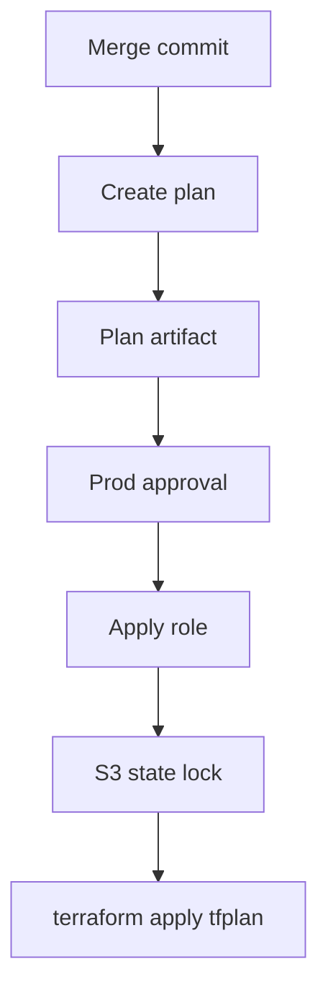

## Table of Contents

1. [Why Apply Boundaries Matter](#why-apply-boundaries-matter)
2. [Plan And Apply](#plan-and-apply)
3. [Environment Boundaries](#environment-boundaries)
4. [Identity Boundaries](#identity-boundaries)
5. [Saved Plan Boundaries](#saved-plan-boundaries)
6. [Approval Boundary](#approval-boundary)
7. [Production Apply Workflow](#production-apply-workflow)
8. [Failure And Replan](#failure-and-replan)
9. [Common First Mistakes](#common-first-mistakes)
10. [Putting It All Together](#putting-it-all-together)

## Why Apply Boundaries Matter

The CI plan for the orders production stack is clean. It adds an S3 lifecycle rule, updates an ECS task environment variable, and leaves the database untouched. The reviewer approves the pull request. Now the team has a second question: what has to be true before CI is allowed to run `terraform apply` against production?

That question is where many Terraform pipelines become risky.

- The plan job ran on a pull request, but the apply job might run after the branch has changed.
- The saved plan artifact might be from a different commit than the one being applied.
- The apply role might have access to every environment instead of one state path and one AWS account.
- The approval might say "deploy" without showing which root module, plan, and role it approves.

An apply boundary is the line between reviewed evidence and real infrastructure change. The boundary is made from triggers, artifacts, roles, state locks, and approval rules. Each part should answer a plain question: who can apply, from which commit, to which environment, using which plan?

## Plan And Apply

Terraform has two apply shapes.

The first shape is automatic plan mode:

```bash
terraform apply
```

In this mode, Terraform creates a new plan, asks for confirmation, and then applies it. In an interactive terminal, that can be useful because the human sees the plan immediately before typing approval. In CI, interactive prompts do not work well, so teams often add `-auto-approve`:

```bash
terraform apply -input=false -auto-approve
```

That command can be reasonable in a protected development environment where the team accepts automatic changes after merge. In production, it needs a strong surrounding process because the apply job creates a fresh plan inside the job and immediately applies it. Reviewers approve the workflow, but they may not have inspected the exact plan that Terraform just created.

The second shape is saved plan mode:

```bash
terraform plan -input=false -out=tfplan
terraform apply -input=false tfplan
```

In saved plan mode, Terraform applies the operations already stored in `tfplan`. The saved plan becomes the object under review. This is why plan artifacts matter: they connect human review to the later apply step.

Saved plan mode also has a sharp edge. Passing a saved plan file to `terraform apply` counts as approval for that plan. Terraform does not ask again. The pipeline has to protect the artifact, prove where it came from, and place approval before the apply job can use it.

## Environment Boundaries

Different environments deserve different apply rules. A development stack can often absorb fast automatic applies. Production usually needs stronger controls because a mistake can affect customers, compliance evidence, or incident response.

For the orders service, the environments might look like this:

| Environment | Plan trigger | Apply trigger | Apply boundary |
| --- | --- | --- | --- |
| Dev | Pull request or merge | Automatic after merge | Dev role and dev state only |
| Staging | Pull request or merge | Manual deployment | Staging role and release branch |
| Prod | Pull request or merge | Protected approval | Prod role, prod state, reviewed plan |

The important detail is that each environment has its own root module, backend key, AWS role, and approval path. A production apply should not reuse a dev job with a different variable file at the last step. That makes it too easy for one script to point at the wrong account or state path.

A root module boundary is easy to see in the filesystem:

```text
infra/live/dev
infra/live/staging
infra/live/prod
```

A state boundary is easy to see in backend keys:

```hcl
key = "orders/prod/terraform.tfstate"
```

An identity boundary is easy to see in role names:

```text
orders-dev-terraform-apply
orders-staging-terraform-apply
orders-prod-terraform-apply
```

Keep those boundaries boring and explicit. The apply job should say which one it is using before it changes anything.

## Identity Boundaries

The AWS role used for planning should usually be different from the role used for applying. Planning needs to read state, acquire the lock, and refresh provider data. Applying needs the permissions to create, update, and delete the resources managed by the root module.

For production, the GitHub OIDC subject can be tied to a protected environment:

```json
{
  "Version": "2012-10-17",
  "Statement": [
    {
      "Effect": "Allow",
      "Principal": {
        "Federated": "arn:aws:iam::123456789012:oidc-provider/token.actions.githubusercontent.com"
      },
      "Action": "sts:AssumeRoleWithWebIdentity",
      "Condition": {
        "StringEquals": {
          "token.actions.githubusercontent.com:aud": "sts.amazonaws.com",
          "token.actions.githubusercontent.com:sub": "repo:dp-example/orders-infra:environment:production"
        }
      }
    }
  ]
}
```

This policy says the production apply role can be assumed only by workflow jobs associated with the `production` environment in that repository. GitHub environment protection rules then become part of the AWS boundary. If the job has not reached the protected environment, its OIDC token does not match the role trust policy.

The role's permission policy should still be scoped. A trust policy controls who can assume the role. A permission policy controls what the role can do after it is assumed. The production orders apply role should be able to manage the orders resources and the production state path. It should not be a general administrator role for every AWS account.

## Saved Plan Boundaries

A saved plan is a bridge between review and apply. It should carry enough information to prove what Terraform will do, and it should be protected because it can contain sensitive data.

The bridge has three parts:

| Part | What it proves |
| --- | --- |
| Commit SHA | Which code produced the plan |
| Artifact name | Which plan the apply job downloaded |
| Text plan | What reviewers inspected before approval |

The plan job can upload an artifact named with the commit SHA:

```yaml
- name: Upload plan artifact
  uses: actions/upload-artifact@v7
  with:
    name: orders-prod-plan-${{ github.sha }}
    path: |
      infra/live/prod/tfplan
      infra/live/prod/plan.txt
    retention-days: 7
```

The apply job can download the artifact by the same name:

```yaml
- name: Download plan artifact
  uses: actions/download-artifact@v8
  with:
    name: orders-prod-plan-${{ github.sha }}
    path: infra/live/prod
```

This pattern keeps the plan tied to the commit being applied. It also makes the artifact name visible in logs. A stronger pipeline can add checksums, signed artifacts, or an external release record, but the basic principle stays the same: the apply job should use the plan that reviewers approved.

Saved plans are time-sensitive. Terraform creates the plan from configuration, variables, state, and provider data at one moment. If the main branch changes, a variable changes, state moves, or someone edits AWS outside Terraform, the plan is no longer the evidence reviewers saw. Generate a new plan when the inputs change.

## Approval Boundary

Approval should sit as close as possible to the apply job. In GitHub Actions, a production environment can require reviewers before a job runs. The job declares the environment:

```yaml
environment: production
```

That single line connects the job to GitHub environment protection rules. The environment can require reviewers, prevent self-review, hold environment-scoped secrets, and pause the job until the configured rules pass.

The approval screen should be backed by clear job output. Before a reviewer approves, they should know:

- The commit SHA.
- The root module path.
- The AWS account and role.
- The artifact name.
- The plan summary.
- The person or process that requested the apply.

Approval is stronger when it approves a named thing. "Approve production apply for `orders-prod-plan-abc123` from `infra/live/prod`" is clearer than "approve deploy."



The approval gate comes after the plan artifact exists and before the apply role is assumed. That order matters. Reviewers approve a concrete plan, and the strongest AWS credentials appear only after approval.

## Production Apply Workflow

Here is a compact production apply job that expects a saved plan artifact from the same commit. It uses a protected GitHub environment and a separate AWS apply role.

```yaml
name: terraform-apply

on:
  workflow_dispatch:
    inputs:
      commit_sha:
        description: "Commit SHA with an approved production plan"
        required: true

jobs:
  apply-prod:
    runs-on: ubuntu-latest
    environment: production
    permissions:
      contents: read
      id-token: write

    steps:
      - uses: actions/checkout@v6
        with:
          ref: ${{ inputs.commit_sha }}

      - uses: hashicorp/setup-terraform@v4
        with:
          terraform_version: "1.14.6"

      - name: Download plan artifact
        uses: actions/download-artifact@v8
        with:
          name: orders-prod-plan-${{ inputs.commit_sha }}
          path: infra/live/prod

      - name: Configure AWS credentials
        uses: aws-actions/configure-aws-credentials@v6.1.0
        with:
          role-to-assume: arn:aws:iam::123456789012:role/orders-prod-terraform-apply
          aws-region: us-east-1

      - name: Show caller identity
        run: aws sts get-caller-identity

      - name: Terraform init
        working-directory: infra/live/prod
        run: terraform init -input=false

      - name: Show saved plan summary
        working-directory: infra/live/prod
        run: terraform show -no-color tfplan | sed -n '1,80p'

      - name: Terraform apply saved plan
        working-directory: infra/live/prod
        run: terraform apply -input=false tfplan
```

The workflow is manual because `workflow_dispatch` requires an operator to choose the commit SHA. The `environment: production` line pauses the job until the production environment rules pass. The checkout step uses the requested commit so the filesystem layout matches the plan. The apply step passes `tfplan`, so Terraform applies the saved plan instead of creating a new unreviewed plan.

The `Show saved plan summary` step is a final visibility check. It should not replace full review, but it helps reviewers and operators see what artifact reached the apply job.

Some teams prefer an apply workflow that runs automatically after merge and waits only at the protected environment gate. That can work when the merge commit is the source of the saved plan and the artifact handling is reliable. The same boundary questions still apply: which commit, which root module, which plan, which role, which approval?

## Failure And Replan

An apply can fail even when the plan was reviewed. AWS APIs can reject a change, a quota can be reached, a dependency can be deleted, or state can change between plan and apply. The right response is usually to read the error, refresh the evidence, and create a new plan.

Three failures deserve special care.

**The artifact is missing.** The apply job should stop. A missing plan means the workflow cannot prove what reviewers approved.

**The state lock is held.** The apply job should wait or fail according to the team's lock timeout. A lock usually means another Terraform run is active or a previous run ended badly. Force-unlock should be a deliberate recovery action after checking that no run is still changing infrastructure.

**The saved plan no longer matches the working directory.** The apply job should stop and create a new plan from the current commit. Saved plans can depend on filesystem paths, module contents, variables, provider selections, and state. Treat mismatch errors as a signal that the review evidence is stale.

A production pipeline should make replan cheap. If the team has to hand-edit artifacts or rerun half the workflow manually, people will be tempted to use `terraform apply -auto-approve` from a laptop. The clean path should also be the easy path.

## Common First Mistakes

**Approving an apply without naming the plan.** Approval should point at a commit, root module, and artifact. A vague approval makes audit and incident review harder.

**Letting the apply job create a fresh plan in production.** A fresh plan inside the apply job can differ from the plan reviewed in the pull request. Use saved plan mode when exact review-to-apply linkage matters.

**Using the plan role for apply.** Planning and applying have different permissions. Separate roles reduce the chance that a pull request job can make real infrastructure changes.

**Sharing one state key across environments.** Dev, staging, and prod should have distinct backend keys or distinct backend configuration. The apply boundary is weak if environments can overwrite each other's state.

**Keeping plan artifacts too long.** Plan files can contain sensitive data. Use short retention, private storage, and access controls that match the environment.

**Treating approval as a substitute for state locking.** Approval decides whether a change may proceed. Locking protects Terraform's view of state while the change proceeds. The pipeline needs both.

## Putting It All Together

The orders team began with an approved production plan and one practical question: what has to be true before CI can apply it?

The answer is a set of boundaries. The apply job uses the production root module, downloads the saved plan for the approved commit, waits at a protected production environment, assumes a production-only OIDC role, initializes the S3 backend with locking, shows the saved plan summary, and runs `terraform apply tfplan`.

Each boundary removes ambiguity. The trigger says when apply can start. The artifact says what Terraform will apply. The role says which AWS permissions the job receives. The backend says which state file records the change. The approval says which human or release process accepted the risk.

That is the end of the Terraform automation path for this module. CI gives reviewers a repeatable plan, and apply boundaries make the production change deliberate.

---

**References**

- [Running Terraform in automation](https://developer.hashicorp.com/terraform/tutorials/automation/automate-terraform) - HashiCorp guidance for automated plan and apply workflows, saved plans, stale plans, and production review.
- [terraform plan command](https://developer.hashicorp.com/terraform/cli/commands/plan) - Terraform CLI reference for saved plan files, plan options, and plan file sensitivity.
- [terraform apply command](https://developer.hashicorp.com/terraform/cli/commands/apply) - Terraform CLI reference for automatic plan mode, saved plan mode, and apply approval behavior.
- [S3 backend](https://developer.hashicorp.com/terraform/language/backend/s3) - Terraform backend reference for S3 state storage, S3 lockfiles, and backend IAM permissions.
- [Configuring OpenID Connect in Amazon Web Services](https://docs.github.com/en/actions/how-tos/secure-your-work/security-harden-deployments/oidc-in-aws) - GitHub documentation for AWS OIDC trust conditions, audience values, and environment-based subjects.
- [Managing environments for deployment](https://docs.github.com/en/actions/how-tos/deploy/configure-and-manage-deployments/manage-environments) - GitHub documentation for protected environments, required reviewers, wait timers, and environment secrets.
- [configure-aws-credentials](https://github.com/aws-actions/configure-aws-credentials) - AWS GitHub Action for assuming AWS roles from workflow jobs.
- [download-artifact](https://github.com/actions/download-artifact) - GitHub Action documentation for downloading a named artifact into a workflow job.
