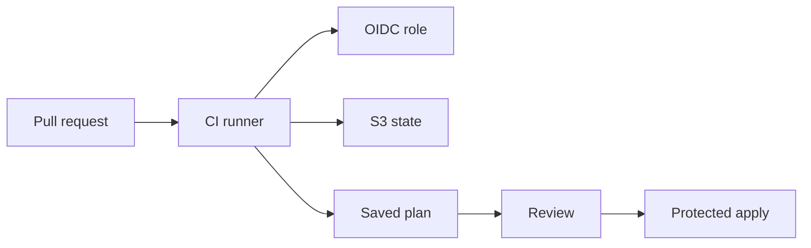

## Table of Contents

1. [Why CI Matters](#why-ci-matters)
2. [What CI Adds](#what-ci-adds)
3. [Pull Request Checks](#pull-request-checks)
4. [AWS Identity](#aws-identity)
5. [Backend Access](#backend-access)
6. [Plan Artifacts](#plan-artifacts)
7. [GitHub Actions Workflow](#github-actions-workflow)
8. [Apply Boundaries](#apply-boundaries)
9. [Reading The Result](#reading-the-result)
10. [Common First Mistakes](#common-first-mistakes)
11. [Putting It All Together](#putting-it-all-together)
12. [What's Next](#whats-next)

## Why CI Matters

A teammate opens a pull request that changes the production orders service. The diff looks small: one subnet tag, a new S3 bucket lifecycle rule, and a wider IAM policy for a deployment role. The reviewer can read the HCL, but the real question is sharper: what will Terraform do in AWS if this merge goes through?

That question is hard to answer from the pull request alone.

- The plan on one engineer's laptop used their local AWS profile.
- The backend key might have pointed at dev state instead of prod state.
- The reviewer saw a pasted plan summary, but the full plan was never saved.
- A later apply might run from a different commit, with different variables, after state has changed.

Terraform in CI exists to make that review loop repeatable. The runner checks out the pull request, installs a pinned Terraform version, assumes a known AWS role, initializes the same backend, creates a plan, and saves the evidence where reviewers can inspect it. Production apply then becomes a separate protected step instead of an accidental side effect of opening a pull request.

## What CI Adds

A Terraform plan is only useful when the inputs are clear. Terraform reads configuration, variable values, provider data, and state before it proposes any changes. A local plan can be correct, but the reviewer has to trust the local machine that produced it. CI gives the team a known place to produce the plan.

For the orders service, imagine this root module:

```text
infra/
  live/
    dev/
      main.tf
      backend.tf
      terraform.tfvars
    prod/
      main.tf
      backend.tf
      terraform.tfvars
```

The `prod` directory is the production root module. Its backend points at the production state object, its variables describe production names and sizes, and its provider configuration targets the production AWS account. CI should make those facts visible every time it runs.

The plan job should answer four review questions:

| Question | What CI makes visible |
| --- | --- |
| Which code was planned? | Commit SHA and checked-out pull request head |
| Which root module was used? | `infra/live/prod` or another explicit working directory |
| Which AWS identity ran the plan? | Account ID and assumed role ARN |
| Which change did Terraform propose? | Plan summary, text plan, and saved plan artifact |

This does not make review automatic. It gives reviewers the same starting evidence on every pull request. They can still reject a risky IAM change, ask why a database replacement appears, or require a smaller rollout.



The important shape is the split between review evidence and apply authority. The pull request job creates evidence. A protected apply job later uses stronger controls.

## Pull Request Checks

A beginner-friendly plan job starts with the same Terraform commands an engineer would run locally, with automation flags added.

```bash
terraform init -input=false
terraform fmt -check
terraform validate -no-color
terraform plan -input=false -no-color -out=tfplan
terraform show -no-color tfplan > plan.txt
```

`terraform init` prepares the working directory. In a CI runner that means downloading providers, reading the backend configuration, and preparing `.terraform/` for this run. `-input=false` tells Terraform to fail instead of waiting for an interactive answer that CI cannot provide.

`terraform fmt -check` checks formatting without rewriting files. The pull request should carry formatting fixes as code changes, not as invisible runner mutations.

`terraform validate` checks whether the configuration is internally consistent. It can catch a misspelled argument, an invalid reference, or a module input mismatch before the plan reaches AWS.

`terraform plan -out=tfplan` creates a saved plan file. The saved plan is Terraform's machine-readable proposal. `terraform show -no-color tfplan > plan.txt` turns that proposal into a plain text file that humans can read in the pull request UI or downloaded artifact.

The plan job should usually run from one explicit root module directory. When a repository has many root modules, use path filters or a small wrapper script to decide which directories changed. A job that accidentally runs from the repository root will initialize the wrong module or fail in a way that teaches reviewers nothing.

## AWS Identity

CI needs AWS credentials because Terraform plan refreshes data from AWS and reads remote state. The safer pattern is short-lived credentials from OpenID Connect (OIDC), where GitHub Actions asks AWS Security Token Service for temporary credentials during the job. The repository stores no long-lived AWS access key.

The CI role should match the action. For the orders service, the plan role might be named `orders-prod-terraform-plan`. It needs access to read production state, acquire the state lock, and read AWS resources that the provider refreshes. It should not be the same broad role used by a human administrator.

A trust policy is the first boundary. This example lets one repository assume a role only when the GitHub OIDC token comes from pull request runs for that repository.

```json
{
  "Version": "2012-10-17",
  "Statement": [
    {
      "Effect": "Allow",
      "Principal": {
        "Federated": "arn:aws:iam::123456789012:oidc-provider/token.actions.githubusercontent.com"
      },
      "Action": "sts:AssumeRoleWithWebIdentity",
      "Condition": {
        "StringEquals": {
          "token.actions.githubusercontent.com:aud": "sts.amazonaws.com",
          "token.actions.githubusercontent.com:sub": "repo:dp-example/orders-infra:pull_request"
        }
      }
    }
  ]
}
```

The `aud` condition says the token is meant for AWS STS. The `sub` condition says which GitHub subject can use the role. A production apply role usually uses a different subject, often tied to a protected environment such as `repo:dp-example/orders-infra:environment:production`.

Inside the workflow, the job must allow GitHub to request the OIDC token:

```yaml
permissions:
  contents: read
  id-token: write
```

`contents: read` lets the job check out the repository. `id-token: write` lets the job request an OIDC token. It does not grant AWS access by itself. AWS access appears only when the token matches the IAM role trust policy and the workflow calls the credentials action.

## Backend Access

Terraform state is shared infrastructure data. CI has to use the same backend as the root module it plans, and it has to participate in state locking so two Terraform runs do not make decisions against the same state at the same time.

For the orders production root module, the backend might look like this:

```hcl
terraform {
  backend "s3" {
    bucket       = "dp-terraform-state-prod"
    key          = "orders/prod/terraform.tfstate"
    region       = "us-east-1"
    use_lockfile = true
  }
}
```

The `bucket` is where the state object lives. The `key` is the path to the state object inside that bucket. The `region` tells Terraform where to reach the bucket. `use_lockfile = true` tells Terraform to use the S3 backend's lockfile behavior for state locking.

Those four lines imply IAM permissions. The runner needs to list the relevant bucket prefix, read the state object, and create and remove the lock object. Apply jobs also need to write updated state. If the plan role can read `orders/prod/terraform.tfstate` and the apply role writes `orders/dev/terraform.tfstate`, the pipeline has a serious environment mismatch.

Backend access also affects artifacts. Backend credentials should come from the runner environment or OIDC role, not from hardcoded backend configuration. Values passed through backend config can end up in the working directory and plan-related files.

## Plan Artifacts

The saved plan file and the text plan have different audiences.

| Artifact | Audience | Purpose |
| --- | --- | --- |
| `tfplan` | Terraform | Apply the exact saved proposal later |
| `plan.txt` | Reviewers | Read the proposed creates, updates, deletes, and replacements |

The saved plan file can contain configuration, state-derived values, input variables, and planned values. Treat it as sensitive. A plan that looks harmless in terminal output can still carry values that should not be posted into a public pull request comment.

A common CI pattern is to upload both files as a short-lived artifact and place a concise summary in the job summary. The full artifact remains available to reviewers with repository access, while the pull request stays readable.

```yaml
- name: Create readable plan
  working-directory: infra/live/prod
  run: terraform show -no-color tfplan > plan.txt

- name: Upload plan artifact
  uses: actions/upload-artifact@v7
  with:
    name: orders-prod-plan-${{ github.sha }}
    path: |
      infra/live/prod/tfplan
      infra/live/prod/plan.txt
    retention-days: 7
```

The artifact name includes the commit SHA so reviewers can connect the artifact to the code that produced it. The short retention window reduces how long sensitive plan data stays available. A team with stricter controls can store plan artifacts in a private artifact system with audit logs and tighter retention.

## GitHub Actions Workflow

Here is a compact GitHub Actions workflow for a production plan job. It plans the `infra/live/prod` root module for pull requests that touch infrastructure files.

```yaml
name: terraform-plan

on:
  pull_request:
    paths:
      - "infra/**"

jobs:
  plan-prod:
    runs-on: ubuntu-latest
    permissions:
      contents: read
      id-token: write

    steps:
      - uses: actions/checkout@v6

      - uses: hashicorp/setup-terraform@v4
        with:
          terraform_version: "1.14.6"

      - name: Configure AWS credentials
        uses: aws-actions/configure-aws-credentials@v6.1.0
        with:
          role-to-assume: arn:aws:iam::123456789012:role/orders-prod-terraform-plan
          aws-region: us-east-1

      - name: Show caller identity
        run: aws sts get-caller-identity

      - name: Terraform init
        working-directory: infra/live/prod
        run: terraform init -input=false

      - name: Terraform fmt
        working-directory: infra/live/prod
        run: terraform fmt -check

      - name: Terraform validate
        working-directory: infra/live/prod
        run: terraform validate -no-color

      - name: Terraform plan
        working-directory: infra/live/prod
        run: terraform plan -input=false -no-color -out=tfplan

      - name: Create readable plan
        working-directory: infra/live/prod
        run: terraform show -no-color tfplan > plan.txt

      - name: Upload plan artifact
        uses: actions/upload-artifact@v7
        with:
          name: orders-prod-plan-${{ github.sha }}
          path: |
            infra/live/prod/tfplan
            infra/live/prod/plan.txt
          retention-days: 7
```

The workflow has three boundaries worth noticing. The trigger is `pull_request`, so the job creates review evidence. The AWS role name contains `plan`, so the IAM policy can stay narrower than an apply role. The working directory is `infra/live/prod`, so Terraform reads the production root module and production backend configuration.

The `Show caller identity` step is small, but it is useful. Reviewers can see the AWS account and role ARN in the logs. When a plan claims it is for production, the runner should prove which AWS identity it used.

## Apply Boundaries

The pull request job should stop at review evidence. Production apply belongs behind a separate boundary: a protected branch, an environment approval, a release workflow, or another control that makes the final step visible.

That boundary should answer four questions before AWS changes:

- Which saved plan or commit is being applied?
- Which root module and backend key will the job use?
- Which AWS role will the job assume?
- Who approved the apply?

The next article focuses on apply boundaries in detail. For CI planning, the key point is that a plan job and an apply job should be separate decisions unless the environment is intentionally low risk.

## Reading The Result

CI output should make the review path boring in a good way. A reviewer should be able to open the workflow run and answer the same questions every time.

Start with the metadata. Confirm the commit SHA, root module directory, Terraform version, AWS account, AWS role, and region. Then read the validation result. Validation passing means Terraform understood the configuration, although it says nothing about whether the proposed change is safe.

The plan itself deserves slower reading. Look first at the summary line:

```text
Plan: 2 to add, 1 to change, 0 to destroy.
```

That line tells you the shape of the change. It does not tell you whether the change is good. Open the text plan and read the resources. A new S3 lifecycle rule has a different risk profile from replacing a database subnet group. A new IAM statement that allows `s3:GetObject` on one bucket prefix is different from a wildcard action on every bucket.

The saved `tfplan` matters later if the team applies exactly what CI planned. The text `plan.txt` matters now because it lets humans review the proposal. Keep both tied to the commit that produced them.

## Common First Mistakes

**Running apply from the pull request job.** The pull request job should create review evidence. Applying unmerged code to shared AWS accounts turns review into a race.

**Using one AWS role for every environment.** Dev planning, prod planning, and prod applying have different blast radii. Separate roles make those differences visible in IAM and in CI logs.

**Skipping backend locks in CI.** A plan job that bypasses the shared backend or lock can make decisions against stale or local state. The runner should use the same backend path as the root module it is reviewing.

**Posting the whole plan into a public comment.** Plan files and plan text can expose resource names, ARNs, state-derived values, and sometimes sensitive values. Store artifacts according to the repository's privacy and retention rules.

**Forgetting untrusted pull requests.** Pull request workflows can run code supplied by a contributor. Be careful with events and repository settings that expose credentials to forked or external pull requests.

**Leaving the Terraform version floating.** A runner that installs whatever Terraform version is latest can produce different behavior over time. Pin a version and update it deliberately.

## Putting It All Together

The orders service started with a simple review question: what will Terraform do in AWS if this pull request merges?

The CI plan job gives that question a repeatable answer. It checks out the pull request, installs a pinned Terraform CLI, assumes a short-lived AWS role through OIDC, initializes the S3 backend with locking, runs formatting and validation checks, creates a saved plan, and uploads both machine-readable and human-readable plan artifacts.

That workflow does not remove human judgment. It gives human judgment better evidence. Reviewers can see the exact root module, AWS role, backend, commit, and proposed infrastructure change before production apply enters the conversation.

## What's Next

The next article looks at the boundary between planning and applying. The same saved plan that helps reviewers can also create a dangerous shortcut if the apply job uses the wrong trigger, role, state path, or approval process. Apply boundaries make that final step explicit.

---

**References**

- [Running Terraform in automation](https://developer.hashicorp.com/terraform/tutorials/automation/automate-terraform) - HashiCorp guidance for non-interactive Terraform runs, saved plans, pull request planning, and automation workflows.
- [terraform plan command](https://developer.hashicorp.com/terraform/cli/commands/plan) - Terraform CLI reference for `plan`, `-out`, `-input=false`, and saved plan sensitivity.
- [terraform apply command](https://developer.hashicorp.com/terraform/cli/commands/apply) - Terraform CLI reference for automatic plan mode, saved plan mode, and `-auto-approve`.
- [S3 backend](https://developer.hashicorp.com/terraform/language/backend/s3) - Terraform backend reference for S3 state storage, lockfiles, and required S3 permissions.
- [Configuring OpenID Connect in Amazon Web Services](https://docs.github.com/en/actions/how-tos/secure-your-work/security-harden-deployments/oidc-in-aws) - GitHub documentation for OIDC trust conditions and `id-token: write` in AWS workflows.
- [configure-aws-credentials](https://github.com/aws-actions/configure-aws-credentials) - AWS GitHub Action for assuming roles and exposing short-lived AWS credentials to workflow steps.
- [setup-terraform](https://github.com/hashicorp/setup-terraform) - HashiCorp GitHub Action for installing a pinned Terraform CLI version in workflow runs.
- [upload-artifact](https://github.com/actions/upload-artifact) - GitHub Action documentation for uploading workflow artifacts with names, paths, and retention settings.
