## Table of Contents

1. [The Reader's Problem: Connecting to Shared Infrastructure](#the-readers-problem-connecting-to-shared-infrastructure)
2. [Anatomy of a Data Source Block](#anatomy-of-a-data-source-block)
3. [Systems Engineering Mechanics: Read-Only API Interactions](#systems-engineering-mechanics-read-only-api-interactions)
4. [Dynamic Filtering and Search Constraints](#dynamic-filtering-and-search-constraints)
5. [The Lifecycle Gap: Handling Unknown and Computed Attributes](#the-lifecycle-gap-handling-unknown-and-computed-attributes)
6. [Putting It All Together: The Analytics Processor Deployment](#putting-it-all-together-the-analytics-processor-deployment)
7. [What's Next](#whats-next)

## The Reader's Problem: Connecting to Shared Infrastructure

A Terraform data source is a read-only lookup that lets configuration reference existing infrastructure without taking ownership of that infrastructure's lifecycle.

A data source is a read-only query that allows Terraform to retrieve information from external APIs or existing infrastructure that is not managed by the current configuration. To understand why this capability is essential, consider a large-scale analytics data processing pipeline. This pipeline consists of cluster compute nodes that consume raw telemetry streams, aggregate system metrics, and write summaries to a centralized data warehouse. This processor cannot sit in isolation. It requires physical network attachment to route traffic to relational databases, in-memory cache clusters, and message queues.

However, the network infrastructure is not owned by the analytics team. A centralized core platform engineering team builds, maintains, and secures the primary virtual networks, the subnet partitions, the internet gateways, and the corporate security groups using a separate deployment pipeline or a completely different orchestration platform.

If we were to declare these network components inside our own Terraform configuration using standard resource blocks, Terraform would normally try to create new subnets and virtual networks. A resource block does not automatically adopt an existing cloud object just because the arguments look similar. Terraform manages existing infrastructure only after that object is imported into state or already tracked by the current configuration. That boundary is important: the analytics team should not create duplicate shared networks, and it should not import the platform team's network into its own state unless both teams intentionally agree to transfer lifecycle responsibility.

This is the exact problem that data sources solve. They establish a clean read-only boundary. They tell Terraform's execution engine to query the cloud provider's API to fetch the current configuration of these existing resources, make their values available inside our memory space, but never touch their lifecycle.

```hcl
data "aws_vpc" "shared_network" {
  filter {
    name   = "tag:Team"
    values = ["CorePlatform"]
  }
}

data "aws_subnets" "private_subnets" {
  filter {
    name   = "vpc-id"
    values = [data.aws_vpc.shared_network.id]
  }

  filter {
    name   = "tag:Tier"
    values = ["Private"]
  }
}

data "aws_security_group" "database_access" {
  vpc_id = data.aws_vpc.shared_network.id

  filter {
    name   = "group-name"
    values = ["*-rds-shared-access"]
  }
}
```

The HCL block configuration above demonstrates how this dynamic query pattern functions. By defining these queries, we instruct our local Terraform workspace to discover the existing networking topology dynamically. The returned attributes can then be referenced directly by our analytics worker resources, bridging the two separate infrastructure environments without duplicating ownership.

## Anatomy of a Data Source Block

A data source block is the Terraform syntax for one read-only lookup. It names the kind of thing to find, gives the lookup a local name, and provides enough search criteria for the provider to return the right object. Example: `data "aws_vpc" "shared_network"` asks AWS for an existing VPC, while `data.aws_vpc.shared_network.id` lets later resources use the VPC ID without creating or owning that VPC.

Unlike managed resource declarations that begin with the `resource` keyword, a data query begins with the `data` keyword. The block configuration requires exactly three components to establish its identity: the `data` keyword, the specific data source type provided by the cloud provider, and the local identifier that names the block inside your configuration file. Together, the type and local identifier form a unique address in Terraform's evaluation model.

The address format is constructed as data followed by the type and the local identifier. In our example, the first query block is addressed as data.aws_vpc.shared_network. This prefix is the critical mechanism that tells Terraform's parser that this block represents a query rather than a target for resource creation. When other resources reference this address, they read directly from the map of attributes returned by the cloud provider API.

Inside the block, the arguments represent the filter constraints or search criteria. These constraints can be highly specific or broad depending on the provider implementation. If the exact physical identifier of a resource is already known, we can supply it directly. But because physical IDs are generated dynamically by cloud hypervisors and change when resources are rebuilt, we favor dynamic search attributes like metadata tags or naming conventions.

Every data block returns a comprehensive map of attributes once evaluated. For example, data.aws_vpc.shared_network returns the core virtual network identifier, the classless inter-domain routing block, the associated route table identifiers, and the enablement status of local domain name resolution. These attributes populate our execution state, allowing subsequent resource blocks to map their configurations directly to the topology of the cloud environment.

## Systems Engineering Mechanics: Read-Only API Interactions

A data source read is a provider API request that returns information without creating or changing the object being read. Terraform Core asks the provider plugin to perform the lookup, and the provider turns the HCL filters into the cloud service's read API call.

Example: `data "aws_vpc"` becomes an AWS `DescribeVpcs` request. The result gives Terraform a VPC ID it can pass into later resources, while the VPC itself stays owned by the team or configuration that created it.


*Data sources read existing infrastructure so new resources can connect to it without managing it.*

Before any query is transmitted, the provider plugin initiates its authentication resolver. For the AWS provider, that resolver can search in-memory environment variables, local configuration files, container credential endpoints, and EC2 instance metadata credentials. The EC2 metadata address `169.254.169.254` is link-local, not loopback: it is reachable only from the local instance network path, not from the public internet. Once valid credentials are resolved, the client calculates the AWS Signature Version 4 HMAC hash. This cryptographic signature binds the request headers, the HTTP method, the query URI, and the hashed payload to a timestamped key, preventing replay attacks and verifying the caller's identity before the cloud API evaluates the query filters.

The transport client establishes a Transport Layer Security handshake with the service endpoint and serializes the HCL filters into an HTTP request payload. For example, a query for a VPC translates directly to a DescribeVpcs API call, while a query for subnet groups maps to a DescribeSubnets API call. These network calls represent read-only operations that do not modify cloud state. The cloud provider's API layer validates the authentication signatures, parses the query parameters, searches the provider's resource inventory, and returns a structured JSON response.

When the HTTP client receives the response payload, the plugin initiates its schema mapping layer. The engine decodes the raw JSON bytes into an intermediate representation based on the cty library, which enforces strong type checking against the schema defined by the provider. Every parsed attribute, such as the VPC identifier string, the CIDR block configuration, and the map of user tags, is validated for type safety. If the response contains unexpected null values or type mismatches, the mapper generates a validation error, halting execution. Once verified, these attributes are written directly to the active state database file under the resources collection. Unlike managed resources, data source resources are serialized with the mode key set to `data`, indicating to the engine that the lifecycle of the physical resource is managed independently.

To understand how these mappings align, we can examine the relationship between HCL types, the underlying cloud API operations, and the key response fields that populate our configuration workspace:

| HCL Data Source Type | Cloud Provider API Action | HTTP Method | Key Response Payload Field |
|---|---|---|---|
| aws_vpc | DescribeVpcs | POST | Vpcs.VpcId |
| aws_subnets | DescribeSubnets | POST | Subnets.SubnetId |
| aws_security_group | DescribeSecurityGroups | POST | SecurityGroups.GroupId |
| aws_ami | DescribeImages | POST | Images.ImageId |

This mapping pipeline ensures that the physical configuration of the cloud is reflected in Terraform's state for the current run. Once the data is successfully mapped, Terraform serializes the retrieved attributes into state like other state entries. On later plans with refresh enabled, Terraform asks the provider to read the data source again. If refresh is disabled or skipped, Terraform may reuse values already present in state, so the result can be stale until a normal refresh occurs.

## Dynamic Filtering and Search Constraints

A filter is a search rule for a data source. It tells the provider which existing objects are acceptable matches, usually by tag, name, parent resource, region, or another attribute the cloud API can search. Example: instead of hardcoding `vpc-0abcd1234efgh5678`, a configuration can search for a VPC where `Team = CorePlatform` and then use whichever current VPC ID the platform team owns.

Dynamic filtering keeps configuration tied to stable labels instead of fragile generated identifiers. Cloud providers assign physical IDs when resources are created, and those IDs can change when a shared network is rebuilt. Tags and naming conventions are usually the durable contract between teams.

When we define a filter block inside a data source, the provider plugin compiles these blocks into the filter arrays of the API request. For instance, in our shared network scenario, we search for a VPC tagged with Team and CorePlatform. This search becomes an API query. The cloud service looks up resources in its metadata database, excludes any networks that do not match the tag intersection, and returns only the matching structures.

This design introduces a crucial resiliency boundary. If the core platform team performs a disaster recovery drill, destroys the existing VPC, and recreates it from template scripts, the physical identifier changes from its old value to a new randomized string. If our configuration hardcoded the old physical ID, our entire analytics deployment pipeline would break. By utilizing dynamic filters, our configuration remains unchanged. The next planning run automatically queries the new physical ID because the logical tag remains identical.

In large enterprise deployments with hundreds of developer workspaces, running plans concurrently can lead to API request exhaustion. AWS enforces strict request quotas on read actions using a Token Bucket rate-limiting algorithm. Frequent calls to DescribeVpcs or DescribeSubnets can deplete these tokens, causing the cloud API to reject queries with a RequestLimitExceeded error. To mitigate this throttling, the provider client implements a backoff mechanism. It intercepts HTTP status 400 errors, calculates a delay using an exponential backoff algorithm with randomized jitter, and retries the API request. This prevents the system from overloading the cloud endpoints while ensuring that plan operations eventually succeed under high-frequency conditions.

However, dynamic filtering introduces strict operational constraints. Singular data sources, such as `aws_vpc`, `aws_security_group`, and `aws_subnet`, are expected to resolve to exactly one object. If the search criteria are too broad and return multiple resources, or if they are too narrow and return zero resources, the provider plugin raises a validation exception and aborts the execution run. Plural data sources, such as `aws_subnets`, intentionally return a collection. The table below describes the singular lookup case:

| Query Result | Engine Behavior | System Rationale |
|---|---|---|
| Zero Matches | Fatal Exception | Downstream attributes cannot resolve to empty structures, preventing deterministic plan generation. |
| Multiple Matches | Fatal Exception | The engine cannot make assumptions about which resource is the intended target, avoiding configuration drift. |
| Exactly One Match | Success | The unique resource attributes are mapped directly into the configuration memory space. |

To prevent these failure states, filters must be constructed with high specificity. For example, instead of searching globally for private subnets, we first query the specific VPC, and then nest the VPC identifier as an input filter inside the subnet query. This structural nesting ensures that our search space is restricted to a single parent network, neutralizing the risk of retrieving duplicate subnets from other development environments.

## The Lifecycle Gap: Handling Unknown and Computed Attributes

An unknown value is a value Terraform cannot know until an apply creates or reads something. Data sources can run early only when their search inputs are already known. Example: a data source can look up a VPC by the fixed tag `Team = CorePlatform` during plan, but it cannot look up a database endpoint by an ID that will be generated by a database resource later in the same apply.

A common challenge appears when a data source depends on a resource that is being created in the same execution run. If you are provisioning a database instance with a resource block and declare a data source in the same configuration to query the database's endpoint address, you create a lifecycle dependency. This dependency is represented inside Terraform's engine as a node connection in the Directed Acyclic Graph.


*Data source values are only safe to use when Terraform can resolve them at the right point in the plan.*

During compilation of the dependency graph, the Terraform core engine constructs a Directed Acyclic Graph containing all configuration blocks. The engine applies a topological sorting algorithm, similar to Kahn's algorithm or a Depth-First Search traversal, to determine the exact execution sequence. Each node in the graph represents a resource, a data source, a provider, or a variable, while the edges represent dependencies. If the topological sort detects a circular path, where a data source depends on a resource that simultaneously references the data source's output, the engine aborts the run with a dependency cycle error. This validation occurs before a single network call is initiated, protecting the active workspace from deadlock states.

If the graph is valid but contains inputs that depend on outputs of a managed resource that does not exist yet, the engine cannot evaluate the query immediately. The database has not been created, meaning its physical network interface and domain name endpoints are not registered in the cloud provider's databases. To handle this temporal gap, Terraform implements a lazy evaluation pattern. The engine detects that the query parameters contain unknown values. Instead of throwing an error, the engine marks the data source's output attributes with a special sentinel value. In the console output, these deferred attributes are displayed as known after apply, indicating that their real values cannot be determined until the physical write operations occur.

Any downstream resource that references these deferred data source attributes is also marked as computed. During the planning run, no API calls are sent for the deferred data source. The engine compiles the plan using these placeholder sentinels, verifying the schema validation of the configuration without asserting the physical presence of the queried values.

```mermaid
flowchart TD
    subgraph PlanPhase["1. Plan Phase Evaluation"]
        StaticQuery["Static Data Source with static inputs"]
        EarlyAPI["Early API Call to DescribeVpcs"]
        InState["Resolved in State and available downstream"]

        StaticQuery --> EarlyAPI
        EarlyAPI --> InState
    end

    subgraph PlanPhaseComputed["2. Computed Dependency Path"]
        NewDB["New Database Resource with create pending"]
        DepQuery["Dependent Data Source relying on database output"]
        UnknownVal["Unknown Value known after apply"]

        NewDB --> DepQuery
        DepQuery --> UnknownVal
    end

    subgraph ApplyPhase["3. Apply Phase Execution"]
        CreateDB["Create Database via API Write"]
        LateQuery["Deferred Data Query via API Read"]
        BindTask["Bind Compute Node and launch task"]

        CreateDB --> LateQuery
        LateQuery --> BindTask
    end
```



The flowchart diagram above visualizes this execution lifecycle. The plan phase handles static queries immediately, saving their resolved states, while computed dependencies are deferred. Once the execution transition occurs during the apply phase, Terraform executes the API write operations to create the upstream database. The database controller returns the concrete physical attributes upon completion.

With the upstream resource provisioned, Terraform immediately executes the deferred data source query. The provider plugin sends the API read request using the newly generated database attributes, retrieves the resolved connection endpoint, and writes it to the local state database. Finally, the downstream compute nodes are provisioned using these concrete connection strings, resolving the configuration gap deterministically.

## Putting It All Together: The Analytics Processor Deployment

In the analytics processor deployment, data sources let one Terraform configuration attach new compute resources to a network owned by another team. The processor needs a VPC ID, a private subnet ID, and a database access security group ID, but it should not create or delete any of those shared objects. Example: the analytics team can create `aws_instance.analytics_worker` while reading `data.aws_vpc.shared_network.id` from the platform team's existing network.

To see how these concepts function in a unified configuration, we can examine the deployment architecture of the analytics data processor. In this deployment, we query the pre-existing shared network maintained by the platform team. We discover the VPC, retrieve the array of private subnets, and locate the database access security group.

To understand how the data source cache is persisted in the local workspace, we can inspect a segment of the generated state database file. The state database stores the retrieved metadata under a schema that mirrors the cloud provider's API structure. The configuration segment below shows the serialized state of a resolved VPC query, illustrating the cache fields that are referenced by downstream resources during subsequent execution phases.

```json
{
  "mode": "data",
  "type": "aws_vpc",
  "name": "shared_network",
  "provider": "provider[\"registry.terraform.io/hashicorp/aws\"]",
  "instances": [
    {
      "schema_version": 0,
      "attributes": {
        "arn": "arn:aws:ec2:us-east-1:123456789012:vpc/vpc-0abcd1234efgh5678",
        "cidr_block": "10.0.0.0/16",
        "id": "vpc-0abcd1234efgh5678",
        "tags": {
          "Environment": "Production",
          "Team": "CorePlatform"
        }
      }
    }
  ]
}
```

This JSON record is stored within the local terraform.tfstate file. During a normal refreshed plan, Terraform can ask the provider to read the VPC data source again and then update this state entry. During the rest of that run, references such as data.aws_vpc.shared_network.cidr_block read the resolved value from Terraform's evaluation memory and state model rather than repeating the same expression work.

Using these retrieved attributes, we construct our managed resources. We declare a dedicated security group for our analytics processor and use the queried database security group as a source boundary for our egress rules. This approach secures the database access path without requiring our team to manage the database's firewall directly. Finally, we launch our compute worker node in a specifically tagged private subnet.

```hcl
data "aws_vpc" "shared_network" {
  filter {
    name   = "tag:Team"
    values = ["CorePlatform"]
  }
}

data "aws_subnets" "private_subnets" {
  filter {
    name   = "vpc-id"
    values = [data.aws_vpc.shared_network.id]
  }

  filter {
    name   = "tag:Tier"
    values = ["Private"]
  }
}

data "aws_subnet" "analytics_worker" {
  vpc_id = data.aws_vpc.shared_network.id

  filter {
    name   = "tag:Tier"
    values = ["Private"]
  }

  filter {
    name   = "tag:Workload"
    values = ["AnalyticsWorker"]
  }
}

data "aws_security_group" "shared_rds_access" {
  vpc_id = data.aws_vpc.shared_network.id

  filter {
    name   = "group-name"
    values = ["*-rds-shared-access"]
  }
}

resource "aws_security_group" "analytics_processor" {
  name        = "analytics-processor-sg"
  description = "Security group for the analytics batch processor"
  vpc_id      = data.aws_vpc.shared_network.id
}

resource "aws_vpc_security_group_ingress_rule" "processor_self" {
  security_group_id            = aws_security_group.analytics_processor.id
  referenced_security_group_id = aws_security_group.analytics_processor.id
  ip_protocol                  = "-1"
}

resource "aws_vpc_security_group_egress_rule" "processor_to_database" {
  security_group_id            = aws_security_group.analytics_processor.id
  referenced_security_group_id = data.aws_security_group.shared_rds_access.id
  ip_protocol                  = "tcp"
  from_port                    = 3306
  to_port                      = 3306
}

resource "aws_instance" "analytics_worker" {
  ami           = "ami-0c55b159cbfafe1f0"
  instance_type = "c5.xlarge"
  subnet_id     = data.aws_subnet.analytics_worker.id

  vpc_security_group_ids = [
    aws_security_group.analytics_processor.id
  ]

  tags = {
    Name = "analytics-worker-node"
    Role = "DataProcessor"
  }
}
```

This configuration highlights the elegant interaction between queried data and managed resources. By using data.aws_vpc.shared_network.id as the vpc_id argument in our new security group, we ensure that our processor's firewall rules are bound to the correct network boundary. The database egress rule dynamically targets the physical ID of the core platform's database access group, maintaining security isolation.

The analytics worker node uses a singular subnet lookup with a workload-specific tag instead of taking `ids[0]` from a plural subnet query. That matters because provider APIs do not promise that a list of matching IDs will always arrive in the operational order you meant. If a workload must land in a specific subnet, make that subnet uniquely discoverable with a tag, name, or availability-zone constraint. The entire lifecycle is resolved safely, avoiding the duplication of network infrastructure ownership and protecting the shared corporate network from accidental deletion.

## What's Next

Understanding how to query pre-existing infrastructure dynamically is a critical step in building modular, enterprise-grade cloud deployments. However, relying purely on runtime API filtering is only one way to cross administrative boundaries. As systems scale, querying every resource via the cloud provider's search APIs can lead to rate-limiting and performance bottlenecks.

To address these scaling challenges, we must explore alternative decoupling mechanisms. In the next article, we will examine how to read data directly from the state files of other configurations using the remote state data source. This pattern allows teams to expose specific, controlled outputs from their configurations, establishing a contract-based API between independent engineering pipelines.


*Use this summary as the quick data-source checklist before connecting to shared infrastructure.*


---

**References**

- [Data Sources Documentation](https://developer.hashicorp.com/terraform/language/data-sources) - Official reference on declaring and referencing data blocks in HashiCorp Configuration Language.
- [Resources Documentation](https://developer.hashicorp.com/terraform/language/resources) - Official distinction between managed resources and read-only data sources.
- [AWS Provider EC2 Data Sources](https://registry.terraform.io/providers/hashicorp/aws/latest/docs/data-sources/vpc) - Technical reference for querying virtual networks and subnets using the AWS translation provider.
- [AWS VPC Security Group Egress Rule Resource](https://registry.terraform.io/providers/hashicorp/aws/latest/docs/resources/vpc_security_group_egress_rule) - Current AWS provider pattern for standalone security group rules.
- [DescribeVpcs API Reference](https://docs.aws.amazon.com/AWSEC2/latest/APIReference/API_DescribeVpcs.html) - First-party AWS documentation on the service-level operations and query parameters for virtual networks.
- [Terraform Core Execution Graph](https://developer.hashicorp.com/terraform/internals/graph) - Technical description of the internal dependency graph mechanics and topological evaluation order.
