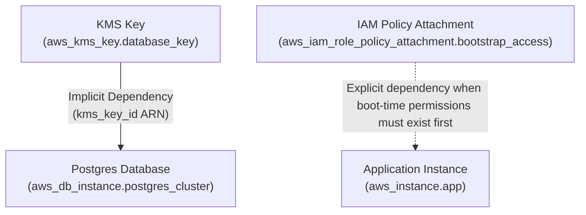

## Table of Contents

1. [Understanding Resource Dependencies](#understanding-resource-dependencies)
2. [The Core Provisioning Scenario](#the-core-provisioning-scenario)
3. [How Terraform Builds the Dependency Graph](#how-terraform-builds-the-dependency-graph)
4. [Cycle Detection and Topological Sorting Algorithms](#cycle-detection-and-topological-sorting-algorithms)
5. [Implicit Dependencies and Reference Resolution](#implicit-dependencies-and-reference-resolution)
6. [Explicit Dependencies and Serialization Locks](#explicit-dependencies-and-serialization-locks)
7. [The Thread Execution Model and Scheduler Internals](#the-thread-execution-model-and-scheduler-internals)
8. [Visualizing and Debugging the Dependency Tree](#visualizing-and-debugging-the-dependency-tree)
9. [Architectural Gotchas and Circular References](#architectural-gotchas-and-circular-references)
10. [Decomposing Network Security Cycles](#decomposing-network-security-cycles)
11. [Module-Level Dependencies and Serialization Bloat](#module-level-dependencies-and-serialization-bloat)
12. [Dynamic Edge Inversion with Create Before Destroy](#dynamic-edge-inversion-with-create-before-destroy)
13. [Putting It All Together](#putting-it-all-together)
14. [What's Next](#whats-next)

## Understanding Resource Dependencies

A resource dependency is the logical link that tells a cloud provisioning system which parts of your infrastructure must be created before others can exist. In the realm of declarative infrastructure-as-code, software engineers do not write procedural execution scripts that manually dial APIs in a specific, brittle sequence. Instead, engineers define a target state using configuration files, and the underlying provisioning engine determines the most efficient path to realize that state. As infrastructure environments scale, the relationships between individual components grow increasingly complex, making the automated management of resource order one of the most critical responsibilities of the modern orchestration engine.

When you configure and deploy physical infrastructure in the cloud, individual components rarely stand alone. A secure virtual network must exist before you can launch an elastic compute instance inside it, and a domain name service record cannot point to an application load balancer until the load balancer's physical IP address or public DNS endpoint has been dynamically generated by the cloud provider's network control plane. Attempting to build infrastructure without a reliable, system-wide dependency management engine leads to race conditions, partial deployments, and orphaned cloud resources that must be cleaned up manually.

Managing these relationships requires a highly sophisticated control plane that parses configuration files, identifies interactions, and schedules tasks. The provisioning engine must determine which resources can be built simultaneously in parallel threads to minimize deployment times, and which resources must wait for their upstream prerequisites to complete. By automating this scheduling, the engine insulates developers from the operational complexity of cloud platform APIs, ensuring that complex, multi-tiered architectures can be provisioned, updated, and destroyed safely and reliably in a single execution sweep.

## The Core Provisioning Scenario

To understand the practical mechanics of dependencies, consider a relational database cluster that uses a customer-managed key management key to encrypt its storage volume at rest. That key is a normal implicit dependency because the database resource directly references the key ARN.

For explicit dependencies, use a separate rule of thumb: only add `depends_on` when there is a real ordering requirement that is not visible in any argument. A common example is a compute resource whose boot script needs an IAM policy attachment to be active before the instance starts. The instance references the instance profile, but it may not directly reference the policy attachment that grants the boot-time permission.

```hcl
resource "aws_kms_key" "database_key" {
  description             = "KMS Key for RDS encryption"
  deletion_window_in_days = 7
}

resource "aws_db_instance" "postgres_cluster" {
  allocated_storage   = 20
  engine              = "postgres"
  engine_version      = "15.4"
  instance_class      = "db.t3.micro"
  db_name             = "production_db"
  username            = "postgres"
  manage_master_user_password = true
  skip_final_snapshot = true

  kms_key_id        = aws_kms_key.database_key.arn
  storage_encrypted = true
}
```

The configuration snippet above demonstrates an implicit dependency. The database key must be successfully provisioned and registered before the database server is constructed because the database passes `aws_kms_key.database_key.arn` directly into `kms_key_id`. Terraform can see that reference and schedule the key first without extra instructions.

The IAM policy attachment is a different shape. If an EC2 instance boot script needs that attachment to be active before startup, and the instance does not directly reference the attachment, you may need an explicit `depends_on` on the instance resource. The important beginner lesson is that `depends_on` should model a documented side effect or platform ordering requirement, not a vague feeling that two resources are related.

## How Terraform Builds the Dependency Graph

Unlike traditional procedural programming languages that execute source code top-to-bottom in a linear sequence, HashiCorp Configuration Language is completely declarative. The order in which resource blocks appear inside your configuration files does not influence the order in which those resources are provisioned in the cloud. You can define the database cluster on the very first line of your configuration file and declare the encryption key hundreds of lines later at the end of the file. To coordinate this out-of-order configuration, the execution engine translates the set of declared resources into a mathematical model known as a Directed Acyclic Graph.


*Terraform schedules resources from graph edges, not from the order blocks appear in a file.*

The construction of the Directed Acyclic Graph occurs during the initialization and planning phases of the execution engine. Under the hood, the compiler's parser reads the configuration files and builds an Abstract Syntax Tree. The compiler's lexer first tokenizes the text stream, and the parser group decodes these tokens into structured AST nodes. The graph compiler then walks the AST and creates a graph vertex for every resource, data source, provider, and variable block. Directed lines, called edges, are then drawn between these vertices. Each edge represents a dependency relationship, pointing from a dependent resource back to the resource it relies upon. The term "directed" indicates that the relationship flows in a single direction, from consumer to producer, while "acyclic" guarantees the graph contains no closed loops.



The Directed Acyclic Graph represents the absolute source of truth for the execution engine. It decouples the human-readable configuration from the machine-level provisioning steps, allowing the engine to calculate a complete map of the infrastructure before a single API request is sent. Every resource is evaluated within the context of the entire graph, ensuring that all upstream changes cascade correctly and all downstream impacts are accounted for. This graph-centric architecture is what allows the provisioning engine to manage thousands of resources across multiple cloud providers with absolute precision and consistency.

## Cycle Detection and Topological Sorting Algorithms

Before attempting any infrastructure modifications, the graph engine runs cycle detection algorithms to ensure the graph is mathematically valid and contains no infinite loops. The validation phase conducts a depth-first search traversal across the nodes, tracking the traversal state of each node using a three-color marking scheme. Nodes are initially marked as unvisited. When the traversal enters a node, the engine marks it as actively visiting in the current execution stack. When all downstream neighbors of that node have been fully explored, the node is marked as fully processed. If the depth-first search encounters a node that is already marked as actively visiting, the compiler detects a circular dependency cycle.

Alternatively, the compiler can run Tarjan's strongly connected components algorithm to group and isolate recursive loops within the graph. Tarjan's algorithm uses a single pass of a depth-first search to identify strongly connected components, which are subgraphs where every vertex is reachable from every other vertex in the subgraph. If any strongly connected component contains more than a single vertex, it mathematically proves the existence of a dependency cycle. When a cycle is detected, the engine halts compilation, aborts the run, and outputs a detailed graph cycle error to standard error, pointing out the exact sequence of resources that formed the loop so the developer can break the recursion.

Once the graph successfully passes the cycle detection checks, the engine performs a topological sort on the Directed Acyclic Graph to determine a valid linear execution order. The sorting process typically relies on Kahn's algorithm or a depth-first search post-order traversal to arrange the vertices. Under Kahn's algorithm, the engine calculates the in-degree of every vertex, which represents the number of incoming edges pointing to that node. Vertices with an in-degree of zero are placed into a processing queue. The engine pops a vertex from the queue, appends it to the sorted list, and removes all its outgoing edges from the graph, decrementing the in-degree of its neighboring vertices. Any neighbors whose in-degree drops to zero are pushed into the queue. This process repeats until the queue is empty, resulting in a perfectly ordered list where every parent node appears before its children.

## Implicit Dependencies and Reference Resolution

An implicit dependency is created automatically whenever the configuration of one resource references an exported attribute of another resource. In the database configuration scenario, the database resource assigns its key parameter by referencing the Amazon Resource Name attribute of the encryption key. The compiler's parser scans the resource configuration block, identifies the dynamic reference expression, and automatically registers an implicit dependency edge between the key management node and the database instance node in the dependency graph.


*References explain real data flow; explicit dependencies should be reserved for hidden ordering needs.*

This reference resolution mechanism is essential for resolving dynamic attributes that are only calculated by the cloud provider's API during the actual creation of a resource. Many critical values, such as internal IP addresses, database endpoints, public network interfaces, and cryptographically generated security identifiers, are completely unknown during the planning phase. These values are marked in the execution plan as "known after apply." By linking resources through implicit references, the graph engine understands that it must completely finish provisioning the upstream resource, capture the dynamically generated attributes returned in the cloud provider's API response, write those values into the local or remote state file, and then inject those resolved values into the downstream resource's creation request.

Relying on implicit references is the most robust and self-documenting method of structuring infrastructure-as-code. If a systems engineer attempts to bypass the implicit reference system by hardcoding a physical network ID, a subnet CIDR block, or a key identifier as a raw string literal, the graph engine will fail to detect the relationship. The engine will assume that the resources are completely independent and will attempt to provision them concurrently. This concurrency causes the downstream resource creation request to reach the cloud provider's API endpoint before the prerequisite resource is fully initialized, resulting in immediate API rejection errors, aborted runs, and orphaned infrastructure states.

## Explicit Dependencies and Serialization Locks

There are architectural scenarios where a real-world dependency exists between two infrastructure components, but no direct attribute reference or data interpolation is visible within the declarative code blocks. For example, an EC2 instance may run boot-time software that immediately calls an AWS API. The instance references its IAM instance profile, but the configuration might not directly reference the policy attachment that grants the specific permission the boot script needs. Because there is no HCL attribute reference linking the instance resource block to that policy attachment, the implicit dependency parser cannot detect that hidden ordering requirement.

To handle these hidden gaps, you can use the `depends_on` meta-argument to declare an explicit dependency:

```hcl
resource "aws_instance" "app" {
  ami                  = var.ami_id
  instance_type        = "t3.micro"
  iam_instance_profile = aws_iam_instance_profile.app.name

  depends_on = [
    aws_iam_role_policy_attachment.bootstrap_access
  ]
}
```

This explicit edge informs the execution scheduler that the instance must wait for the policy attachment before it starts. If no real hidden dependency exists, do not add `depends_on`; an unnecessary explicit dependency only makes the plan more conservative.

| Dependency Type | Detection Mechanism | Primary Use Case | Execution Flow Impact |
|-----------------|---------------------|------------------|-----------------------|
| Implicit Dependency | Automatically parsed via HCL attribute reference expressions | Passing IDs, ARNs, endpoints, or CIDRs between resources | Blocks downstream creation until upstream attributes are resolved and populated |
| Explicit Dependency | Manually declared using the `depends_on` meta-argument | Coordinating order when no direct code interpolation exists | Enforces a serialization lock that blocks downstream creation until the target resource is active |

While explicit dependencies are powerful, they should be used sparingly and only as a last resort. Because an explicit dependency forces a serialization lock, it acts as a barrier that prevents the execution engine from utilizing parallel threads. Overusing explicit dependencies creates artificial sequential bottlenecks, turning a fast, highly parallelized provisioning plan into a slow, sequential execution queue. Furthermore, because the execution engine cannot determine which specific attributes are needed when a dependency is explicit, it must assume that more values may be unknown until the dependency is complete. This often leads to over-conservative plans where Terraform shows more `(known after apply)` values than necessary.

## The Thread Execution Model and Scheduler Internals

Under the hood, the execution engine manages resource provisioning using a highly concurrent scheduler backed by the Go runtime's concurrency primitives. Each resource node in the topological sort is wrapped inside an independent task routine. The scheduling coordinator manages these routines using channels, mutexes, and synchronization wait groups to coordinate state transitions safely across multiple threads. This architecture allows the engine to maximize performance by running independent tasks in parallel while strictly enforcing order constraints for dependent nodes.

When the execution engine starts, the scheduler spawns a pool of worker routines and begins walking the sorted graph. Resources with an in-degree of zero are dispatched immediately. The default maximum concurrency limit of the engine is set to ten concurrent operations, though this can be configured at runtime using the parallelism flag. For blocked resources, the scheduler places a strict serialization lock on their execution routines. The task routine for a blocked resource waits on a coordination channel, blocking on a wait group. Each upstream parent node, upon successful completion of its provisioning lifecycle, sends a completion signal through the channel, decrementing the waiting resource's lock counter.

Only when the wait counter reaches zero does the scheduler release the serialization lock, allowing the dependent task to execute its provider's creation or modification functions. If an upstream resource fails to provision due to an API timeout, network error, or validation failure, the scheduler automatically aborts the downstream chain. The coordination channel broadcasts a cancel signal, marking all downstream nodes in the dependency tree as skipped. This cascading skip prevents the engine from entering a corrupt state where half-built dependencies are left in an invalid configuration, ensuring that the local or remote state file remains clean and reflective of the actual cloud state.

## Visualizing and Debugging the Dependency Tree

To assist systems engineers in auditing complex, multi-tier environments, the provisioning engine provides built-in tools to inspect and export the calculated Directed Acyclic Graph. The primary interface for this is the `terraform graph` command, which traverses the internal dependency tree and outputs the entire structure as a text stream formatted in the standard DOT graph description language. This output maps out every resource node, provider configuration, module boundary, and execution relationship calculated by the compiler.

```bash
$ terraform graph
digraph {
  compound = "true"
  newrank = "true"
  subgraph "root" {
    "[root] aws_db_instance.postgres_cluster (expand)" [label = "aws_db_instance.postgres_cluster", shape = "box"]
    "[root] aws_kms_key.database_key (expand)" [label = "aws_kms_key.database_key", shape = "box"]
    "[root] aws_s3_bucket.backup_bucket (expand)" [label = "aws_s3_bucket.backup_bucket", shape = "box"]
    "[root] aws_db_instance.postgres_cluster (expand)" -> "[root] aws_kms_key.database_key (expand)"
    "[root] aws_db_instance.postgres_cluster (expand)" -> "[root] aws_s3_bucket.backup_bucket (expand)"
  }
}
```

The exported DOT stream can be piped directly into visualization utilities such as Graphviz, which parses the node relations and renders them as standard visual formats including Scalable Vector Graphics or Portable Network Graphics. Inspecting this visual tree is an invaluable debugging step when analyzing unexpected execution ordering or diagnosing complex cycle errors in large configurations. It allows you to trace the exact edges that the compiler is using to build its execution plan, making it easy to identify redundant explicit dependencies or accidental circular references that may be slowing down or blocking your deployments.

Using these visualization tools helps developers verify that the logical graph matches their mental model of the infrastructure. In massive production systems with hundreds of resources, the graph can quickly grow overwhelming. Developers can filter the graph output by specifying target resources or excluding external providers, allowing them to focus on critical paths and ensure that parallel processing limits are optimized. By routinely auditing the dependency tree, platform engineering teams can eliminate sequential bottlenecks, optimize CI/CD runner efficiency, and guarantee clean deployments.

## Architectural Gotchas and Circular References

One of the most common structural failures in infrastructure-as-code is the circular reference. As discussed during cycle detection, a circular reference occurs when two or more resources directly or indirectly depend on one another, preventing the topological sort algorithm from resolving a valid execution sequence. When this occurs, the compiler cannot determine which resource must be created first, as each component requires the pre-existence of the other to initialize. The graph validation phase immediately flags this condition, halting the execution plan before any cloud resources are modified.

A classic systems engineering example of this problem occurs when configuring security groups for mutually communicating microservices, such as an application server and a memory cache cluster. If you attempt to define the security group rules inline within the security group resources, a circular reference is inevitable. The application server's security group needs to allow outbound traffic to the cache cluster's security group, creating a dependency on the cache security group. Simultaneously, the cache cluster's security group needs to allow inbound traffic from the application server's security group, creating a dependency on the application security group. Because neither security group can be fully initialized without referencing the other, the graph compiler identifies a cycle and aborts the deployment.

Circular references also frequently occur in network topology design, such as when connecting virtual private networks. If a developer attempts to peer two networks and write static route tables inside both network blocks simultaneously, the parser will trace a closed loop. The route table in Network A references the gateway in Network B, while the route table in Network B references the gateway in Network A. To avoid these traps, developers must follow clean decoupling patterns that split container resources from their internal configuration rules, allowing the compiler to resolve the graph in distinct, non-overlapping phases.

## Decomposing Network Security Cycles

To resolve circular dependencies under the hood, you must decompose the configuration by separating the container resources from their internal rules. In the case of network security groups, this means declaring the security group shells as empty containers first, removing the initial dependencies. You then use separate security group rule resources that reference the parent containers. This architectural decomposition breaks the cycle in the Directed Acyclic Graph, allowing the compiler to successfully sequence the creation of the security group containers in parallel, followed by the simultaneous application of the individual rules.

```hcl
resource "aws_security_group" "app_server" {
  name        = "app-server-sg"
  vpc_id      = "vpc-12345"
}

resource "aws_security_group" "cache_cluster" {
  name        = "cache-cluster-sg"
  vpc_id      = "vpc-12345"
}

resource "aws_security_group_rule" "app_to_cache" {
  type                     = "egress"
  from_port                = 6379
  to_port                  = 6379
  protocol                 = "tcp"
  security_group_id        = aws_security_group.app_server.id
  source_security_group_id = aws_security_group.cache_cluster.id
}

resource "aws_security_group_rule" "cache_from_app" {
  type                     = "ingress"
  from_port                = 6379
  to_port                  = 6379
  protocol                 = "tcp"
  security_group_id        = aws_security_group.cache_cluster.id
  source_security_group_id = aws_security_group.app_server.id
}
```

The decoupled configuration above solves the circular dependency problem completely. The two security group resources contain no inline rule declarations, meaning they have no dependencies on each other. The graph compiler compiles them as independent nodes, allowing them to be provisioned concurrently in parallel worker threads. The security group rule resources, which are declared as separate blocks, reference the security group IDs implicitly. This creates a clean, two-tier dependency tree where the rules depend on the security groups, but the security groups have no dependencies on the rules or on each other.

This decomposition pattern is a fundamental best practice in infrastructure engineering. It applies not only to security groups, but also to network route tables, database subnet groups, IAM roles and policies, and DNS zone associations. By separating the container from the content, you give the graph compiler the logical flexibility it needs to schedule operations efficiently, ensuring that your infrastructure remains modular, dry, and free of circular bottlenecks.

## Module-Level Dependencies and Serialization Bloat

Another critical architectural gotcha occurs when developers declare explicit dependencies on entire module blocks rather than on individual resources within those modules. When building reusable infrastructure, modules are used to group related resources together, such as a complete network stack or a Kubernetes cluster. While it is possible to add the `depends_on` meta-argument to a module block, doing so has major under-the-hood consequences for the dependency graph and deployment performance.

When you apply `depends_on` to a module, the graph compiler is forced to draw dependency edges from every single resource inside the dependent module to every single resource inside the target module. This massive expansion of graph edges triggers serialization bloat, disabling the execution engine's ability to run operations in parallel. If Module B depends on Module A, no resource in Module B can begin creation until every single resource in Module A has finished provisioning, even if the actual dependency only exists between a single subnet in Module A and a single compute instance in Module B.

To prevent this performance degradation, platform engineers should avoid module-level dependencies entirely. Instead, modules should expose specific resource attributes as output variables. The downstream module can then reference these output variables as inputs, allowing the implicit dependency engine to trace exact, fine-grained relationships between individual resources across the module boundaries. This fine-grained mapping ensures that independent resources across both modules can still be provisioned concurrently, maintaining high concurrency and preventing thread starvation on the orchestration runners.

## Dynamic Edge Inversion with Create Before Destroy

A second major gotcha involves the interaction between resource dependencies and dynamic resource destruction. When a configuration change requires an existing resource to be replaced, the default behavior of the execution engine is to destroy the old resource before creating the new one. However, if other active resources depend on that component, this default order can trigger a cascading failure, as the engine cannot safely delete a resource while active downstream dependencies are still bound to it.

```hcl
lifecycle {
  create_before_destroy = true
}
```

To reduce these replacement failures, you can use the `create_before_destroy` lifecycle meta-argument. This setting tells Terraform to create the replacement before destroying the old object when a replacement is required. When using this technique, systems engineers must ensure that any physical resource names or identifiers are not hardcoded, as attempting to provision the new resource before deleting the old one can trigger naming collision errors at the cloud provider's API gateway.

`create_before_destroy` changes Terraform's ordering, but it does not prove application health or safely shift live traffic by itself. For example, if a virtual machine is attached to a security group, Terraform can create a replacement and update references where the provider supports it, but health checks, load balancer registration, and traffic draining must still be modeled with the appropriate platform resources.

## Putting It All Together

Understanding how the declarative execution engine parses configuration files and maps relationships into a Directed Acyclic Graph is crucial for designing stable, predictable, and performant cloud environments. By leveraging implicit dependencies, you allow the engine to automatically determine the optimal execution sequence, capture dynamically generated cloud attributes, and parallelize operations safely. When implicit dependencies are not visible within the HCL syntax, explicit dependencies declared via the `depends_on` meta-argument provide a reliable fallback mechanism to enforce sequential execution boundaries.

To visualize the execution steps calculated by the graph compiler for the encrypted database and boot-time policy examples, we can inspect the state transitions of the resources during a deployment. The execution coordinator ensures that each component moves through its lifecycle phases in a coordinated sequence, utilizing parallel threads where possible and enforcing serialization locks where required.

| Execution Order | Resource Address | Dependency Type | Lifecycle Action | Engine Execution Details |
|-----------------|------------------|-----------------|------------------|--------------------------|
| Step 1 (Parallel) | `aws_kms_key.database_key` | None | Create | Provisioned in parallel thread; generates encryption key and writes ARN to state file |
| Step 1 (Parallel) | `aws_iam_role_policy_attachment.bootstrap_access` | None | Create | Attaches the boot-time policy before dependent compute starts |
| Step 2 (Serialized) | `aws_db_instance.postgres_cluster` | Implicit | Create | Execution waits for the KMS ARN to resolve, then provisions the database |
| Step 2 (Serialized) | `aws_instance.app` | Explicit | Create | Execution waits for the boot-time policy attachment because `depends_on` declares that hidden ordering requirement |

By structuring your infrastructure configurations to align with the graph engine's design, you avoid common architectural traps such as circular references and cascading deletion blocks. The result is a resilient, self-documenting deployment pipeline that provisions complex, secure systems in the minimum time possible, maintaining a clean state record and ensuring that all system dependencies are mathematically verified and safely coordinated.

## What's Next

Now that you have mastered how the execution engine coordinates resource creation order through the dependency graph, the next step is to explore how to dynamically configure these resources using input variables, local values, and output values. In the next article, we will examine how variables allow you to parameterize your configurations, making your infrastructure code reusable across development, staging, and production environments without duplicating your resource declarations.


*Use this summary as the quick dependency checklist before debugging graph ordering.*


---

**References**

- [Meta-Argument: depends_on](https://developer.hashicorp.com/terraform/language/meta-arguments/depends_on) - Official HashiCorp guide on declaring explicit dependencies and using depends_on blocks.
- [The Dependency Graph](https://developer.hashicorp.com/terraform/cli/commands/graph) - Comprehensive documentation on the terraform graph command and DOT-format visualization.
- [Resource Lifecycle: create_before_destroy](https://developer.hashicorp.com/terraform/language/meta-arguments/lifecycle#create_before_destroy) - Official reference on managing resource replacement order and inverting graph edges.
