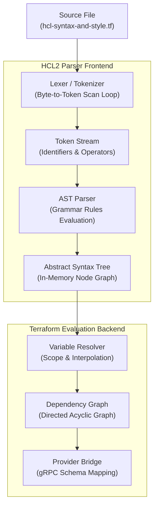

## Table of Contents

1. [Understanding HashiCorp Configuration Language](#understanding-hashicorp-configuration-language)
2. [HCL2 Lexing and Tokenization Mechanics](#hcl2-lexing-and-tokenization-mechanics)
3. [Structural Anatomy: Blocks vs Arguments](#structural-anatomy-blocks-vs-arguments)
4. [The HCL2 Type System: Scalars, Collections, and Structural Types](#the-hcl2-type-system-scalars-collections-and-structural-types)
5. [Syntax Constraints and AST Normalization with `terraform fmt`](#syntax-constraints-and-ast-normalization-with-terraform-fmt)
6. [Gotchas and Common Syntax Pitfalls](#gotchas-and-common-syntax-pitfalls)
7. [Putting It All Together](#putting-it-all-together)

## Understanding HashiCorp Configuration Language

HCL is Terraform's configuration language: a structured file format for declaring blocks, arguments, expressions, and values that Terraform can parse into an infrastructure graph.

HashiCorp Configuration Language is a clear and readable way to write down instructions that describe how computer servers, databases, and network wires should be set up in the cloud. Unlike general-purpose programming languages that specify the precise step-by-step actions to build an application, this configuration language is declarative. You write a configuration file describing what the final infrastructure must look like, and the underlying deployment engine determines the optimal sequence of actions to reach that target state. The design of the language balances human readability with machine parseability, solving the structural limitations of formats like JSON and the whitespace sensitivity issues common to YAML.

To see the language in action, consider a link-shortening redirect service. The system accepts shortened key requests, uses Route 53 to map a public domain name to a CloudFront distribution, and uses an Amazon Simple Storage Service (S3) website endpoint as a redirect origin. This is a useful syntax example, but it is not the same as a private S3 origin. S3 website endpoints do not support HTTPS directly and are treated as custom origins by CloudFront. In production, you would choose the S3 and CloudFront origin pattern deliberately based on whether you need website redirect behavior or private object access.

This infrastructure is modeled in files ending with the `.tf` extension. The following configuration defines the core S3 bucket and website redirection rules that make this link-shortening system possible.

```hcl
resource "aws_s3_bucket" "redirector" {
  bucket = "lnk-sh-redirects-prod"
}

resource "aws_s3_bucket_website_configuration" "redirector_config" {
  bucket = aws_s3_bucket.redirector.id

  index_document {
    suffix = "index.html"
  }

  routing_rule {
    condition {
      key_prefix_equals = "r/"
    }
    redirect {
      host_name               = "api.lnk-sh.internal"
      http_redirect_code      = "307"
      protocol                = "https"
      replace_key_prefix_with = "resolve?key="
    }
  }
}
```

This configuration illustrates the clean, structural nature of the language. Instead of writing verbose API request payloads or maintaining fragile scripts, you declare resources, specify their configurations, and nest properties to model complex operational behaviors like website redirection. The deployment engine parses this text file, compiles it into an execution plan, and calls the appropriate cloud APIs on your behalf.

## HCL2 Lexing and Tokenization Mechanics

Lexing and tokenization are parser steps that turn characters in `.tf` files into structured tokens before Terraform validates blocks and expressions.

To understand how the configuration is processed, you must look at the parsing engine under the hood. The current version of the language is powered by the HCL2 engine, a parsing library written in the Go programming language. When you run a command to initialize, validate, or apply your infrastructure, the engine reads the raw `.tf` text files from the local disk as a stream of UTF-8 encoded bytes.


*Terraform can format and evaluate HCL because the text becomes structured data before planning.*

The first step in the parsing pipeline is tokenization, which is performed by the lexer. The lexer scans the raw characters from left to right, matching them against predefined regular patterns to emit a continuous stream of tokens. A token is the smallest syntactic unit that carries meaning within the grammar of the language. The lexer categorizes characters into identifiers, operators, keywords, string literals, and punctuation. The following table illustrates how the lexer tokenizes the first line of our S3 bucket resource definition:

| Raw Character Sequence | Token Type | Semantic Role in Grammar |
| :--- | :--- | :--- |
| `resource` | Keyword | Identifies a block declaration type |
| `"aws_s3_bucket"` | String Literal | Specifies the first block label |
| `"redirector"` | String Literal | Specifies the second block label |
| `{` | Punctuation | Opens the structural body of the block |

Once the lexer completes the tokenization phase, it hands the token stream to the syntax parser. The parser evaluates the stream against a formal context-free grammar to construct an Abstract Syntax Tree (AST). The AST is an in-memory hierarchical tree structure composed of nodes that represent the syntactic relationships of the configuration. The engine uses this AST to perform syntax validation, verify brace matching, and check that every parameter is correctly formatted.

The next diagram illustrates the complete data pipeline from the raw text file on disk down to the active dependency graph constructed by the deployment engine.



During AST construction, the engine maps nodes directly to core syntax structures. If a syntax error is encountered, such as a missing closing brace or a stray assignment operator, the parser generates a diagnostic object containing the precise byte offsets, line numbers, and file paths. This metadata is returned to your terminal, allowing you to locate and fix syntax issues before any API calls are made.

## Structural Anatomy: Blocks vs Arguments

A block is a container in HCL, and an argument is a setting inside a container. Blocks describe the things or sub-things Terraform should understand, while arguments assign values to named settings. Example: `resource "aws_s3_bucket" "redirector"` is a block, and `bucket = "lnk-sh-redirects-prod"` is an argument inside that block.

The grammar of the HashiCorp Configuration Language separates structural layout from data assignment. Every configuration file is composed of these two primary syntactic concepts. Understanding the practical distinction between them is crucial for writing valid, maintainable configurations.


*HCL is readable because blocks describe objects and arguments describe their settings.*

A block is a structural container that represents an object or a distinct system scope. Blocks are defined by a block type, zero or more labels, and a body wrapped in opening and closing curly braces. The block type is an unquoted keyword that informs the parser how to interpret the container. Labels are quoted string literals that qualify the block type. The number of labels required is strictly determined by the block type schema. For example, a `provider` block requires exactly one label (the provider name), a `resource` block requires exactly two labels (the resource type and the local resource name), and a `locals` block requires no labels at all.

Inside the block body, arguments assign values to named attributes. An argument is composed of an identifier on the left, an assignment operator in the middle, and an expression on the right. Arguments are strictly evaluation-based; they represent properties that will be resolved to concrete values at runtime. In the S3 website redirector example, the configuration uses a clear hierarchy to define the bucket properties:

```hcl
# The resource block defines a structural node in the dependency graph.
resource "aws_s3_bucket" "redirector" {
  # The bucket argument assigns a string value to the S3 bucket name.
  bucket = "lnk-sh-redirects-prod"
}
```

Blocks can be nested inside other blocks to define complex, multi-layered resource configurations. Nested blocks represent sub-objects that have their own schema and validation rules. It is important to distinguish between a nested block and a map argument that holds key-value pairs. A nested block is defined by the provider schema and parsed structurally during AST compilation, whereas a map argument is a single value expression that is evaluated dynamically.

The differences between these configurations are detailed below:

* **Nested Block Approach**: Nested blocks use no assignment operator between the identifier and the opening curly brace. They are verified against the provider schema during validation. If you write `routing_rule = { ... }` instead of `routing_rule { ... }`, Terraform parses it as an argument value and then rejects it during schema validation because the provider expects a structural sub-object rather than a value expression.
* **Map Argument Approach**: Map arguments use an assignment operator to bind a key-value structure to a single variable name. The contents of a map are treated as dynamic data at runtime, and the parser does not validate individual map keys against a static schema during the initial parsing phase.

The structural hierarchy formed by nested blocks allows cloud architects to model highly complex systems. In the link-shortening backend, the S3 website configuration resource nests the `routing_rule` block inside the website configuration block. The `routing_rule` block further nests the `condition` and `redirect` blocks. This nesting reflects the logical topology of the AWS S3 website routing schema, ensuring that the relationships between redirect conditions and target hosts are structurally explicit.

## The HCL2 Type System: Scalars, Collections, and Structural Types

A type tells Terraform what shape of value is allowed. A value might be one string, a list of strings, a map of tags, or an object with several named fields. Example: `instance_count = 3` is a number, while `subnet_ids = ["subnet-a", "subnet-b"]` is a list of strings.

The language uses a type system to catch configuration errors before Terraform sends requests to cloud APIs. Every variable, argument, and attribute must conform to a specific type schema. The HCL2 type system is built on top of a low-level type representation library named `cty`. This library defines how types are validated, coerced, and matched during the compilation process. The type system is organized into three distinct categories: scalar types, collection types, and structural types.

Scalar types represent a single primitive value. The language supports three scalar types:

* **String**: A sequence of UTF-8 characters wrapped in double quotes. It is used to represent names, descriptions, IDs, and raw text payloads.
* **Number**: An arbitrary-precision decimal value. Under the hood, HCL2 represents numbers using Go's big decimal packages rather than floating-point primitives. This mathematical precision prevents rounding errors when dealing with large numeric constraints, port numbers, or system limits.
* **Bool**: A boolean value representing either `true` or `false`. Boolean values must be written as unquoted literals.

Collection types group multiple values of the same underlying type. The compiler enforces type uniformity within collections, meaning that every element in a collection must share the exact same type schema:

* **List**: An ordered sequence of values indexed by integers starting at zero. Lists are declared using square brackets, such as `["us-east-1a", "us-east-1b"]`. The compiler represents a list internally as `list(T)`, where `T` is the uniform type of the elements.
* **Map**: A lookup table of key-value pairs where the keys are always strings and the values must share a uniform type. Maps are declared using curly braces and assignment operators, such as `{ env = "prod", tier = "routing" }`.
* **Set**: An unordered collection of unique values. Duplicate values are automatically discarded by the compiler. Sets are represented as `set(T)` and are ideal for defining collections of unique resources, like security group IDs or subnets, where ordering does not affect execution.

Structural types can group values of different types within the same structure. The exact schema of a structural type is defined by its keys and their corresponding types:

* **Object**: A structural type containing named attributes, each with its own specific type. Objects are declared using curly braces, but unlike maps, their values do not need to share a uniform type. An object might contain a string, a number, and a list of booleans within the same structure.
* **Tuple**: An ordered sequence of values where each position has a specific type. A tuple is represented as `tuple([T1, T2, ...])` and is declared using square brackets.

To illustrate how these types are represented, the following table details their schemas and runtime properties:

| HCL Type | Declaration Syntax | Compiler Type Representation | Type Homogeneity Requirement |
| :--- | :--- | :--- | :--- |
| String | `"production"` | `cty.String` | Yes (Single Primitive) |
| Number | `307` | `cty.Number` | Yes (Single Primitive) |
| List | `["a", "b"]` | `cty.List(cty.String)` | Yes (All elements must match type `T`) |
| Map | `{ k = "v" }` | `cty.Map(cty.String)` | Yes (All values must match type `T`) |
| Object | `{ a = 1, b = "x" }` | `cty.Object(map[string]cty.Type)` | No (Attributes can have different types) |

The compiler includes built-in type coercion rules that attempt to convert values from one type to another when safe. For example, if a provider expects a string argument but you pass the number `307`, the compiler automatically coerces the number into the string `"307"` before validating the schema. However, if you attempt to pass a list of strings to an argument expecting a boolean, the compiler will halt execution and emit a type mismatch diagnostic. The type `any` is a wildcard placeholder during initial parsing, letting variables accept any schema until the evaluation engine resolves them to a concrete type.

## Syntax Constraints and AST Normalization with `terraform fmt`

`terraform fmt` is Terraform's built-in formatter for `.tf` files. It rewrites spacing, indentation, and alignment so the code has one consistent style across a team. Example: if one engineer writes `bucket="prod-logs"` and another writes `bucket = "prod-logs"`, `terraform fmt` normalizes the layout so review diffs focus on infrastructure changes instead of spacing choices.

Writing configuration code across large engineering teams requires stylistic consistency. Because HCL2 does not enforce strict whitespace rules like YAML, files can easily diverge in indentation, spacing, and alignment. To address this, Terraform includes a built-in code formatting command that operates as an AST-based code rewriter.

Unlike simple text-replacement tools or regular-expression formatters, the formatter parses your configuration files directly into an in-memory Abstract Syntax Tree. It then walks the syntax tree, applies a rigid set of layout rules, and outputs the formatted code back to disk. This approach guarantees that the formatting process is safe and cannot alter the logical behavior of your infrastructure.

The formatter applies several AST normalization constraints to ensure a clean and readable style:

* **Two-Space Indentation**: The formatter replaces all tab characters with spaces and enforces a strict two-space indentation level for every nested block and argument definition.
* **Vertical Alignment of Assignment Operators**: Within a contiguous block of arguments, the formatter calculates the length of the longest argument identifier. It then pads the other argument identifiers in that group with trailing spaces so that their assignment operators align vertically. This group alignment is broken by empty lines, nested blocks, or comments, which resets the padding calculation.
* **Whitespace and Empty Line Compression**: The formatter discards consecutive blank lines, compressing them into a single empty line to keep files compact. It also removes trailing whitespace from the end of every line.
* **Standard Block Label Quoting**: The formatter ensures that all block labels are wrapped in double quotes. In older specifications of HCL, unquoted labels were occasionally tolerated, but the parser now normalizes all labels to quoted string literals.

The following example demonstrates the transformation applied by the formatter to a poorly styled S3 bucket definition. The raw configuration contains inconsistent indentation, misplaced spaces, and unaligned assignment operators:

```hcl
# Raw Configuration Before AST Normalization
resource    "aws_s3_bucket"   "redirector" {
bucket="lnk-sh-redirects-prod"
  tags={environment="prod"}
  force_destroy = true
}
```

When you run the formatting command in your terminal, the AST parser reads this configuration, restructures the syntax tree, and writes the standardized code back to the file:

```hcl
# Normalized Configuration After Running Command
resource "aws_s3_bucket" "redirector" {
  bucket        = "lnk-sh-redirects-prod"
  force_destroy = true
  tags = {
    environment = "prod"
  }
}
```

Enforcing these style conventions is vital for collaborative infrastructure engineering. Standardized files ensure that version control diffs remain exceptionally clean. If an engineer adds a single argument to an existing resource block, only that line will show up in the pull request diff, rather than a cascade of unrelated whitespace adjustments. Most engineering teams enforce this command automatically in their continuous integration pipelines to prevent style drift.

## Gotchas and Common Syntax Pitfalls

Most HCL syntax mistakes come from writing a value where Terraform expected a block, or writing a block where Terraform expected a value. The two forms can look similar because both often use braces. Example: `tags = { env = "prod" }` is a map argument, but `routing_rule { ... }` is a nested block defined by the provider schema.

Even experienced software engineers run into subtle HCL2 syntax behaviors that can lead to unexpected parsing errors or runtime failures. Understanding these quirks requires a deeper grasp of how the parser and compiler interpret text files under the hood.

One of the most common pitfalls is the missing assignment operator when declaring map attributes versus nested blocks. Because both use curly braces, developers often write `tags { env = "prod" }` when they intend to declare a map argument, or write `routing_rule = { ... }` when the provider schema expects a nested block.

The differences between these declarations are detailed below:

* **Argument Map Syntax Error**: If you declare `tags { ... }` without the assignment operator `=`, the parser interprets this as a nested block declaration. Because the provider schema defines `tags` as a map attribute rather than a block, the compiler throws an error stating that the block type is invalid.
* **Nested Block Syntax Error**: If you write `routing_rule = { ... }`, the parser evaluates the map expression and attempts to assign it to an attribute. The compiler rejects this because `routing_rule` is a structural sub-object defined by the provider schema, and it cannot be populated by a dynamic map expression.

Another significant gotcha involves multiline string blocks, known as heredocs. The language supports two heredoc operators: `<<EOF` and `<<-EOF`. The difference lies in how the parser handles leading indentation:

* **Standard Heredoc (`<<EOF`)**: The standard operator preserves all leading whitespace exactly as written in the file. If you indent the content to match the resource block style, those indentations will be included in the final string value, which can corrupt configuration payloads or scripts.
* **Indented Heredoc (`<<-EOF`)**: The indented operator allows the closing marker to be indented and removes matching leading indentation from the content. This allows you to keep the configuration visually aligned with the surrounding block structure without injecting unwanted spaces into the actual string value.

The following example demonstrates how the indented heredoc maintains alignment while keeping the output string clean:

```hcl
resource "aws_s3_bucket_policy" "allow_public" {
  bucket = aws_s3_bucket.redirector.id

  # Using <<-EOF allows the JSON payload to align with the resource block.
  policy = <<-EOF
  {
    "Version": "2012-10-17",
    "Statement": [
      {
        "Sid": "PublicReadGetObject",
        "Effect": "Allow",
        "Principal": "*",
        "Action": "s3:GetObject",
        "Resource": "arn:aws:s3:::${aws_s3_bucket.redirector.bucket}/*"
      }
    ]
  }
  EOF
}
```

A third pitfall involves implicit type coercion within collection variables. If you declare a variable as `map(string)` but initialize it with mixed scalar types, such as `{ name = "redirect", code = 307 }`, the compiler automatically coerces the number `307` into the string `"307"` to satisfy the homogeneity requirement of maps. If you pass this map to a resource argument that strictly expects a numeric type, the configuration will fail during the validation phase. To avoid this, you should declare complex schemas using the `object` structural type, which preserves the distinct types of individual attributes.

## Putting It All Together

The link-shortening backend uses HCL's core syntax pieces together: resource blocks for cloud objects, nested blocks for resource sub-objects, arguments for settings, and references for connections between resources. Example: the CloudFront distribution reads the S3 website endpoint from `aws_s3_bucket_website_configuration.redirector_config.website_endpoint`, so Terraform can connect the two resources without a hardcoded endpoint string.

To build the secure link-shortening backend server, we combine the S3 redirector configuration with CloudFront and Route 53 resources. The syntax elements we have explored, block structure, nested blocks, arguments, and type systems, are the building blocks that tie these distinct cloud services together.

Terraform uses implicit dependencies to automatically discover the relationships between resources. By referencing attributes of one resource within the arguments of another, you inform the compiler how to construct the Directed Acyclic Graph (DAG) that guides execution. In the complete configuration below, the CloudFront distribution references the S3 bucket website endpoint, and the Route 53 DNS record references the CloudFront distribution's domain name:

```hcl
resource "aws_s3_bucket" "redirector" {
  bucket = "lnk-sh-redirects-prod"
}

resource "aws_s3_bucket_website_configuration" "redirector_config" {
  bucket = aws_s3_bucket.redirector.id

  index_document {
    suffix = "index.html"
  }

  routing_rule {
    condition {
      key_prefix_equals = "r/"
    }
    redirect {
      host_name               = "api.lnk-sh.internal"
      http_redirect_code      = "307"
      protocol                = "https"
      replace_key_prefix_with = "resolve?key="
    }
  }
}

resource "aws_cloudfront_distribution" "s3_distribution" {
  origin {
    domain_name = aws_s3_bucket_website_configuration.redirector_config.website_endpoint
    origin_id   = "S3-Website-Origin"

    custom_origin_config {
      http_port              = 80
      https_port             = 443
      origin_protocol_policy = "http-only"
      origin_ssl_protocols   = ["TLSv1.2"]
    }
  }

  enabled         = true
  is_ipv6_enabled = true

  default_cache_behavior {
    allowed_methods  = ["GET", "HEAD"]
    cached_methods   = ["GET", "HEAD"]
    target_origin_id = "S3-Website-Origin"

    viewer_protocol_policy = "redirect-to-https"
    min_ttl                = 0
    default_ttl            = 3600
    max_ttl                = 86400

    cache_policy_id = "658327ea-f89d-4fab-a63d-7e88639e58f6"
  }

  restrictions {
    geo_restriction {
      restriction_type = "none"
    }
  }

  viewer_certificate {
    cloudfront_default_certificate = true
  }
}

resource "aws_route53_record" "dns_redirect" {
  zone_id = "Z0123456789ABCDEF"
  name    = "lnk.sh"
  type    = "A"

  alias {
    name                   = aws_cloudfront_distribution.s3_distribution.domain_name
    zone_id                = aws_cloudfront_distribution.s3_distribution.hosted_zone_id
    evaluate_target_health = false
  }
}
```

When you save this configuration and initiate a run, the HCL2 engine executes the following steps:

1. **Syntax Verification**: The lexer tokenizes the source code and the parser builds the AST, validating braces, quotes, and structural syntax rules.
2. **Schema Validation**: The engine queries the active AWS provider via gRPC and maps the resource attributes to the provider's schemas, validating type safety and ensuring required arguments are present.
3. **Graph Construction**: The compiler analyzes attribute references (such as mapping `aws_s3_bucket.redirector.id` to the website configuration) to construct the logical Directed Acyclic Graph.
4. **Execution Planning**: The engine evaluates the graph to determine which resources can be built in parallel and which must wait for dependencies. It then executes the target API calls in a highly deterministic, secure, and ordered sequence.


*Use this summary as the quick syntax checklist before reading or reviewing Terraform configuration.*


---

**References**

- [HCL Syntax Specification](https://github.com/hashicorp/hcl/blob/main/hclsyntax/spec.md) - Formal grammar and lexing specifications for the HCL2 parsing engine.
- [Terraform HCL Syntax Guide](https://developer.hashicorp.com/terraform/language/syntax/configuration) - The official guide detailing blocks, arguments, identifiers, and comments.
- [Amazon S3 Website Endpoints](https://docs.aws.amazon.com/AmazonS3/latest/userguide/WebsiteEndpoints.html) - AWS guidance on S3 static website endpoint behavior and HTTPS limitations.
- [AWS CloudFront Distribution Resource](https://registry.terraform.io/providers/hashicorp/aws/latest/docs/resources/cloudfront_distribution) - Current AWS provider reference for CloudFront cache behavior arguments.
- [HCL Type System and cty](https://github.com/zclconf/go-cty) - Deep documentation for the type system and dynamic type representation.
- [terraform fmt Command Reference](https://developer.hashicorp.com/terraform/cli/commands/fmt) - Official usage guidelines and configuration parameters for formatting standard HCL files.
