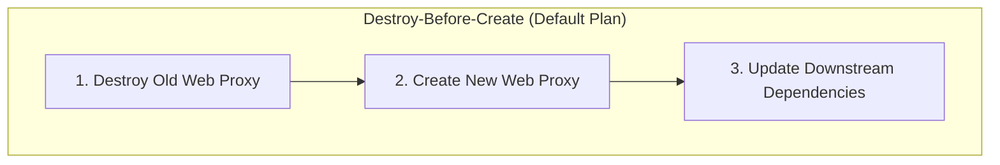
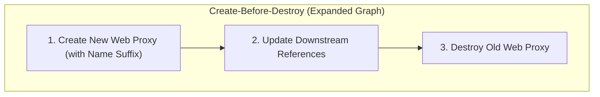

## Table of Contents

1. [The Role of Meta-Arguments](#the-role-of-meta-arguments)
2. [Declarative Configuration Preview](#declarative-configuration-preview)
3. [Provider Alias Bindings and Multi-Region Compilation](#provider-alias-bindings-and-multi-region-compilation)
    - [Default Provider Resolution Mechanics](#default-provider-resolution-mechanics)
    - [Aliased Providers and Multi-Region Architectures](#aliased-providers-and-multi-region-architectures)
4. [Systems Depth: Graph Theory and Graph Expansion under create_before_destroy](#systems-depth-graph-theory-and-graph-expansion-under-create_before_destroy)
    - [Directed Acyclic Graphs in Terraform Core](#directed-acyclic-graphs-in-terraform-core)
    - [The Mechanics of Reversing Dependency Edges](#the-mechanics-of-reversing-dependency-edges)
    - [Dynamic Subgraph Expansion and Topological Ordering](#dynamic-subgraph-expansion-and-topological-ordering)
    - [Mitigating Provider-Level Resource Collisions](#mitigating-provider-level-resource-collisions)
5. [Systems Depth: gRPC Communications and State Diffing under ignore_changes](#systems-depth-grpc-communications-and-state-diffing-under-ignore_changes)
    - [The gRPC Control Plane Architecture](#the-grpc-control-plane-architecture)
    - [The Three-Way Diff Synthesis in the Refresh-Plan Lifecycle](#the-three-way-diff-synthesis-in-the-refresh-plan-lifecycle)
    - [Dynamic Attribute Masking and Value Coercion](#dynamic-attribute-masking-and-value-coercion)
    - [Wildcards and Schema Path Edge Cases](#wildcards-and-schema-path-edge-cases)
6. [State Preservation Mechanics under prevent_destroy](#state-preservation-mechanics-under-prevent_destroy)
    - [Compile-Time Assertion Engines](#compile-time-assertion-engines)
    - [Bypassing Safety Gates and Pipeline Hardening](#bypassing-safety-gates-and-pipeline-hardening)
7. [Looping Mechanisms: Array Shifts versus Stable Keys](#looping-mechanisms-array-shifts-versus-stable-keys)
    - [State Addresses under the Hood](#state-addresses-under-the-hood)
    - [The Array-Shifting Gotcha of count](#the-array-shifting-gotcha-of-count)
    - [String Key Stability of for_each](#string-key-stability-of-for_each)
    - [Looping Operations Comparison Matrix](#looping-operations-comparison-matrix)
8. [Putting It All Together](#putting-it-all-together)
9. [What's Next](#whats-next)

## The Role of Meta-Arguments

Meta-arguments are special configuration instructions written inside Terraform blocks that tell the infrastructure engine how to manage resources rather than defining what those resources look like. When you configure standard resources in Terraform, the majority of the attributes you define are passed directly to the cloud provider's API. For instance, when you define the size of a virtual machine or the storage capacity of a database, Terraform acts as a translator, packaging these attributes into API requests that it transmits over the network. However, some arguments belong entirely to Terraform Core. These arguments, known as meta-arguments, are not sent to the cloud provider. Instead, they instruct the Terraform engine itself on how to build, order, scale, or destroy the resources. Because these meta-arguments are handled directly by the compiler and execution planner of Terraform Core, you can write them inside any resource block, regardless of which cloud provider you are configuring.

To understand the practical necessity of meta-arguments, consider a highly resilient multi-tier application representing an online payment transaction processing system. This architecture consists of three distinct tiers. The first tier is a stateless high-concurrency web proxy layer responsible for receiving user requests and routing them to internal servers. The second tier is a group of microservices exposing application APIs, which are deployed across multiple geographical regions (specifically a primary region in us-east-1 and a secondary disaster recovery region in us-west-2). The third tier is a critical production database that stores financial ledgers and payment logs. Each of these tiers requires a different type of structural management. The web proxy tier requires rolling updates with zero downtime, meaning a new virtual machine must be fully functional before the old one is terminated. The api tier relies on automated cloud policies that dynamically scale computing capacity based on live load, which means Terraform must ignore certain drift differences between the written configuration and the active system. Finally, the database tier holds irreplaceable transaction records and must be protected by absolute safeguards that prevent accidental deletion. Standard resource declarations cannot handle these behaviors by themselves. You must use meta-arguments to instruct Terraform Core how to manage their distinct lifecycles.

## Declarative Configuration Preview

A unified Terraform configuration block illustrates how these meta-arguments are declared in practice. This preview defines the primary and secondary cloud providers, coordinates the web proxies with zero-downtime instructions, configures the microservice APIs to bind to a secondary geographical region while bypassing auto-scaling updates, and hardens the database against accidental termination.

```hcl
provider "aws" {
  region = "us-east-1"
}

provider "aws" {
  alias  = "secondary"
  region = "us-west-2"
}

resource "aws_security_group" "web_sg" {
  name_prefix = "web-tier-security-group-"
}

resource "aws_instance" "web_server" {
  ami           = "ami-0c55b159cbfafe1f0"
  instance_type = "t3.medium"

  lifecycle {
    create_before_destroy = true
  }
}

resource "aws_instance" "api_server" {
  provider      = aws.secondary
  ami           = "ami-0cb5137f86541f487"
  instance_type = "t3.micro"

  lifecycle {
    ignore_changes = [
      tags,
      instance_type,
    ]
  }
}

resource "aws_db_instance" "database" {
  allocated_storage           = 100
  engine                      = "postgres"
  instance_class              = "db.r6g.large"
  db_name                     = "payments"
  username                    = "payments_admin"
  manage_master_user_password = true

  lifecycle {
    prevent_destroy = true
  }
}
```

The configuration utilizes three core meta-arguments: provider, create_before_destroy, and prevent_destroy. The provider meta-argument explicitly overrides the default regional binding, routing the API server deployment to the secondary region. Inside the lifecycle block, the nested create_before_destroy argument changes the sequence of resource replacement, while prevent_destroy creates a compiler-level safeguard. To fully appreciate how these instructions govern the execution plan, you must look under the hood at how the engine compiles and parses these files.

## Provider Alias Bindings and Multi-Region Compilation

### Default Provider Resolution Mechanics

By default, when Terraform parses your configuration files, it maps every resource to a default provider instance based on the prefix of the resource type. For example, any resource beginning with the prefix aws is automatically associated with the default aws provider block defined in your root module. When Terraform Core executes, it loads the corresponding provider plugin binaries and instantiates a default schema mapping for each unique provider type. If a resource block does not contain a provider meta-argument, Terraform Core assumes this default mapping. This implicit resolution simplifies configuration for single-account or single-region architectures, but it fails to scale when resources must span diverse network boundaries or distinct geographical sectors.

### Aliased Providers and Multi-Region Architectures

Deploying a modern, high-availability system often requires distributing infrastructure across multiple physical regions or cloud accounts to ensure disaster recovery and minimize geographical network latency. To achieve this, you configure multiple instances of the same provider and distinguish them using an alias argument. When you specify an alias in a provider configuration, you create an alternative, independent instantiation of that provider's plugin.

The provider meta-argument within a resource block then acts as a router, directing Terraform Core to assign that resource to a specific aliased plugin instance rather than the default one. Under the hood, this binding occurs during the compilation phase. When Terraform builds its internal resource catalog, it inspects the provider meta-argument of each resource block. If it finds a value such as aws.secondary, it maps the resource's execution nodes to the gRPC connection channel established with that specific provider instance. This ensures that when the plan or apply phases execute, all API requests for that resource (such as creating virtual machines, configuring subnets, or updating routing tables) are sent to the correct regional endpoints. This regional separation is entirely invisible to the resources themselves, allowing you to copy identical configurations and target different geographical locations simply by modifying the provider binding.

## Systems Depth: Graph Theory and Graph Expansion under create_before_destroy

### Directed Acyclic Graphs in Terraform Core

To understand how create_before_destroy alters the lifecycle of a resource, you must examine how Terraform compiles its Directed Acyclic Graph (DAG). The Directed Acyclic Graph is the core data structure that Terraform uses to model infrastructure dependencies and determine the parallel execution paths of your configuration. Every resource block represents a node in this graph, and the dependencies between resources (either declared implicitly using attribute references or explicitly using the depends_on meta-argument) are represented as directed edges.

Before executing any action, Terraform Core performs a topological sort on this graph using algorithms such as Kahn's algorithm or depth-first search traversal. This sorting establishes a strict linear ordering of execution nodes. By mapping dependencies as directed edges, the orchestrator determines which resources can be built concurrently and which must wait for parent resources to settle. If node B depends on node A, an edge is drawn from A to B, ensuring that the creation of A is fully complete before the engine initiates the creation of B.



### The Mechanics of Reversing Dependency Edges

By default, when you modify an attribute of a resource that cannot be updated in-place (such as changing the subnet association of a virtual machine or the engine version of a database), the cloud provider requires the existing resource to be destroyed before a new one can be created. In the DAG, Terraform models this using a Destroy-Before-Create sequence. It splits the resource node into two distinct operations: a destroy node and a create node. The engine inserts a dependency edge directing that the create node must wait until the destroy node has successfully completed.

If downstream resources depend on this resource, Terraform may need to update or replace those relationships as part of the same plan. During the destroy-first window, the service can experience downtime because the old resource is gone and the replacement is not yet active. When you set create_before_destroy = true, you instruct Terraform to create the replacement before destroying the old object. This removes the Terraform destroy-before-create gap, but it does not automatically prove application health or move live traffic safely.



### Dynamic Subgraph Expansion and Topological Ordering

Reversing the dependency edge requires Terraform to plan separate create and destroy operations for the same logical resource address. If resource B depends on resource A, and A has create_before_destroy enabled, Terraform must keep the old A available while creating the new A, then update references where the provider schema allows it, and only then destroy the old A.

This ordering is powerful, but it is not a full deployment strategy. Terraform can order resource operations and update modeled references; it does not know whether a web server is warmed up, whether a load balancer target is healthy, or whether existing user connections have drained unless those behaviors are represented by provider resources and platform health checks.

### Mitigating Provider-Level Resource Collisions

Name collisions are a frequent failure point in cloud APIs when reversing the creation sequence. Many cloud services require resources (such as virtual networks, load balancer target groups, or DNS zones) to have unique names within an account or region. If Terraform attempts to create a replacement resource before destroying the old one, and both configurations specify the exact same human-readable name, the cloud API will reject the creation request with a conflict error.

To solve this, you must avoid hardcoding exact names in your configurations. Instead, use name prefix attributes when the provider supports them, such as `name_prefix` instead of `name`. The provider appends a generated unique suffix to the prefix. This lets the new resource coexist alongside the old resource during the transition phase without triggering API namespace collisions.

## Systems Depth: gRPC Communications and State Diffing under ignore_changes

### The gRPC Control Plane Architecture

The ignore_changes meta-argument operates during a highly specific phase of the Terraform execution lifecycle: the transition between state refresh and plan evaluation. To understand how this works, you must look at the communication protocol between Terraform Core and the individual provider plugins. Terraform Core does not communicate with cloud providers directly. Instead, it acts as an orchestrator that launches provider plugins as separate background processes.

These processes communicate with Core over local gRPC socket channels, exchanging structured protocol buffer messages that represent resources and their current states. Every schema definition, resource attribute map, and API response is serialized into protobuf messages. These messages are sent across the local loopback interface. When Core requests an operation, the provider plugin compiles the real-world JSON maps and executes the necessary API handshakes over HTTPS. It then serializes the results and transmits them back to Core.

### The Three-Way Diff Synthesis in the Refresh-Plan Lifecycle

When you run terraform plan, the engine initiates the refresh phase. During this phase, Terraform Core sends a request over the gRPC channel asking the provider plugin to inspect the real-world infrastructure. The plugin translates this request into HTTPS calls to the cloud provider's API, parses the returned JSON or XML responses, and maps the hardware attributes back into a structured JSON state payload. This refreshed state represents the literal truth of what exists in the cloud at that exact microsecond.

Once the refresh phase is complete, Terraform Core enters the planning phase. It synthesizes a three-way diff using three distinct datasets:
1. The active HCL configuration written by the developer on the local filesystem.
2. The refreshed state returned by the provider plugins via the gRPC loopback socket.
3. The prior state recorded in the local or remote terraform.tfstate file.

Normally, if the refreshed state differs from your HCL configuration (a condition known as infrastructure drift), Terraform Core compiles a plan diff. For example, if a developer manually added metadata tags or modified a virtual machine's instance class via the cloud web console, Terraform detects this discrepancy. It generates a plan proposing an update or replacement to force the remote infrastructure to match the written HCL code.

### Dynamic Attribute Masking and Value Coercion

However, when you declare ignore_changes inside a resource's lifecycle block, you instruct the compiler to override this comparison engine. During the diff generation stage, the planning compiler reads the list of ignored attributes. It intercepts the refreshed state payload and the HCL configuration representation. For any attribute key matching the ignore list, the engine copies the refreshed state value directly into the target configuration state before performing the comparison.

Because the values are programmatically forced to match, the diff compiler computes a change difference of zero. The proposed plan remains completely silent on those attributes, preserving the drift without attempting to overwrite it. This process represents a semantic mask applied to the JSON state maps during memory allocation, ensuring that external modifications do not trigger unnecessary cloud provider updates.

### Wildcards and Schema Path Edge Cases

Despite its power, ignore_changes has important edge cases. You must specify attributes as direct paths within the resource schema. If you are managing nested blocks or complex maps, ignoring a parent key (such as tags) will ignore all changes to any elements within that map. However, if you attempt to ignore a specific index in a list (such as subnet_ids[0]), Terraform Core may struggle to track changes if the order of the list shifts during a refresh, as the engine matches by index position rather than content.

Additionally, developers can use the special wildcard keyword all (written as ignore_changes = all) to instruct Terraform to ignore drift on every single attribute of a resource after its initial creation. This wildcard effectively turns the resource block into a one-time provisioning template, completely separating it from subsequent configuration updates. It is highly useful for boot resources or legacy virtual machines where the initial configuration must be declared once, but all subsequent management is completely offloaded to external configuration management engines or runtime orchestrators.

## State Preservation Mechanics under prevent_destroy

### Compile-Time Assertion Engines


*Lifecycle rules change how Terraform applies a diff, so they should be used as explicit safety controls.*

In any production system, certain resources are completely irreplaceable or carry immense destruction costs. In our multi-tier scenario, the relational database tier holds financial ledgers and transaction histories. If a developer accidentally renames this database resource block or executes a destructive upgrade, the default behavior of Terraform is to issue a delete request to the cloud API, resulting in catastrophic data loss. The prevent_destroy meta-argument acts as a safety latch built directly into the execution compiler to prevent this scenario.

Unlike other meta-arguments that modify execution order or filter state diffs, prevent_destroy is evaluated at the very beginning of the planning compiler's execution loop. When Terraform compiles the dependency graph and begins calculating resource actions, it checks if any node marked for destruction has prevent_destroy set to true in its lifecycle configuration. The compiler runs an assertion sweep. If a resource marked for deletion possesses this active flag, the compiler flags a validation exception. It halts the entire execution plan and throws a compiler error. No API requests are sent, no state is modified, and the system remains locked in its current safe state.

### Bypassing Safety Gates and Pipeline Hardening

To actually destroy a resource protected by this safeguard, you must perform a deliberate code change. Remove or disable the `prevent_destroy` setting, review the new plan that includes the destruction, and then apply that plan only if the deletion is intentional. This multi-step process introduces a review boundary that prevents automated pipelines or distracted engineers from executing catastrophic deletions with a single command.

This safeguard is particularly valuable in automated Continuous Integration and Continuous Deployment (CI/CD) environments. In these headless environments, pipelines run non-interactively, applying configurations based on git merges. If a pull request accidentally deletes a critical resource file or modifies an immutable variable, the prevent_destroy check will fail the pipeline run during the plan verification phase. This stops the execution before any destructive operations are applied to your production database, acting as an automated gatekeeper.

## Looping Mechanisms: Array Shifts versus Stable Keys

### State Addresses under the Hood


*Repeated resources are safest when instance identity stays stable across list changes.*

The most powerful meta-arguments that modify resource quantity are count and for_each. In a standard declarative language, resource blocks are 1-to-1 mappings: one block in code creates exactly one resource in the cloud. However, when building scalable systems like our multi-tier payment platform, you often need to provision multiple identical or slightly varied resources (such as three web proxy servers or a set of regional network subnets). The count and for_each meta-arguments solve this by introducing compiler-driven loops into the configuration.

Under the hood, these looping mechanisms modify how Terraform addresses resources in its state file. Every resource in Terraform has a unique logical address (such as `aws_instance.web_server`). When you apply loops, the address is extended to include an index key. This index key is the unique identifier that the compiler uses to map HCL blocks to real-world resources. The structure of this index determines how resilient the configuration is to future architectural changes.

### The Array-Shifting Gotcha of count

The count meta-argument accepts a whole number and instructs Terraform Core to create that exact number of resources. The engine registers these resources in the state file using a zero-indexed integer array (such as aws_instance.web_server[0], aws_instance.web_server[1], and aws_instance.web_server[2]). While this is simple to configure, it introduces a dangerous operational gotcha if you need to remove an item from the middle of the list.

If you have three servers and you delete the configuration for the middle server (index 1), Terraform does not simply delete index 1. Because the state is stored as a sequential array, the engine shifts the remaining resource (index 2) down to index 1 to maintain a continuous sequence. Under the hood, the planning engine interprets this index shift as a deletion of the resource at index 2 and an in-place update or replacement of the resource at index 1, leading to unexpected destructions of perfectly healthy servers. The following sequence demonstrates how this shift corrupts resource identities:
- State before modification: `[0: server-a, 1: server-b, 2: server-c]`
- Action: Remove server-b from the HCL input list.
- State transformation during plan: The engine shifts server-c into index 1.
- Consequence: Terraform proposes destroying server-c and re-provisioning it with index 1 parameters, causing unexpected downtime.

### String Key Stability of for_each

To avoid this array-shifting behavior, the for_each meta-argument should be used for complex resource sets. Instead of a simple integer, for_each accepts a map or a set of strings. The engine registers these resources in the state file using string-based keys (such as aws_instance.api_server["primary"] or aws_instance.api_server["secondary"]). Because each resource is bound to a unique, immutable string key, you can add, remove, or modify items in the set without affecting any other resource in the collection.

Terraform Core simply compares the keys in your active HCL configuration with the keys in your refreshed state, proposing creations for new keys and destructions for removed keys while leaving existing keys completely untouched. This key-based routing makes for_each the industry standard for managing dynamic, production-grade cloud infrastructure. It completely isolates individual resource lifecycles from changes to adjacent resources in the same loop definition.

### Looping Operations Comparison Matrix

The following table summarizes the operational differences and systems behaviors of the looping meta-arguments:

| Feature | count Meta-Argument | for_each Meta-Argument |
| :--- | :--- | :--- |
| **Input Data Type** | Whole integer (e.g. 3) | Map or set of strings |
| **State File Address** | Numeric array index (e.g. `[0]`, `[1]`) | String key address (e.g. `["primary"]`) |
| **Middle Item Removal** | Triggers sequential index shifting and accidental recreation of remaining resources | Removes only the target key; remaining resources remain completely unaffected |
| **Ideal Use Case** | Identical scaling pools where individual names and identities do not matter | Distinct resources with unique names, configuration variations, or stable identifiers |

## Putting It All Together

Returning to our multi-tier payment transaction processing platform, we can now see how meta-arguments serve as the invisible framework that coordinates complex systems behaviors. By combining region routing, safer replacement ordering, state protection, and selected drift tolerance, we built a more resilient multi-region architecture. The web proxy tier can create replacements before deleting old instances, but traffic safety still depends on load balancer and health-check design. The database tier stands shielded from accidental destruction. The API tier can let an external autoscaler change selected fields without Terraform constantly trying to revert them.

Without these compile-time controls, managing a multi-tier, multi-region platform in a purely declarative language would be incredibly fragile. Terraform Core would be forced to treat every infrastructure change as a simple, synchronous sequence of destroys and creates, leading to persistent outages, catastrophic data loss, and endless state synchronization fights. Meta-arguments bridge the gap between static code declarations and the dynamic, high-availability demands of real-world systems engineering.

## What's Next

Now that you understand the fundamental meta-arguments and how Terraform Core compiles them into dependency graphs and state addresses, you are ready to explore advanced configuration patterns. In the next article, we will go deep into control flow structures, exploring how to write dynamic configuration blocks and utilize complex functions to build highly adaptive, reusable infrastructure modules.


*Use this summary as the quick meta-argument checklist before adding repetition or lifecycle controls.*


---

**References**

- [The provider Meta-Argument](https://developer.hashicorp.com/terraform/language/meta-arguments/provider) - Technical guide on routing resources to explicit aliased provider configurations.
- [The lifecycle Meta-Argument](https://developer.hashicorp.com/terraform/language/meta-arguments/lifecycle) - Authoritative documentation on altering resource creation, update, and destruction behaviors.
- [Resources Loop: count](https://developer.hashicorp.com/terraform/language/meta-arguments/count) - Official reference for scaling resources using integer-based indexing loops.
- [Resources Loop: for_each](https://developer.hashicorp.com/terraform/language/meta-arguments/for_each) - Official reference for managing distinct resource maps using stable string keys.
