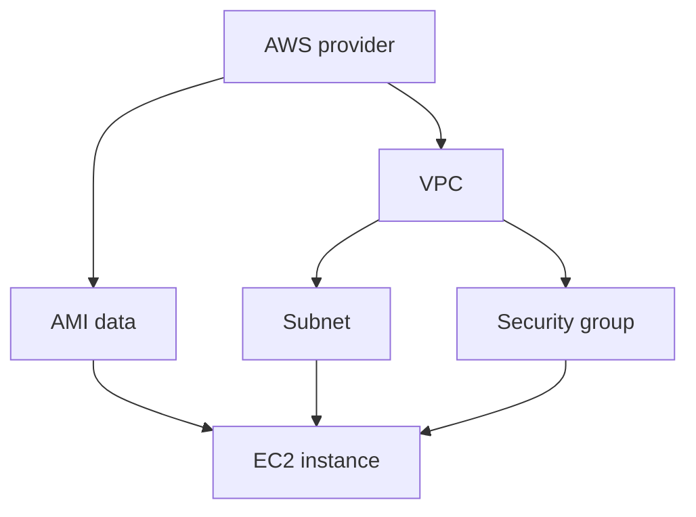

## Table of Contents

1. [Why Dependencies Matter](#why-dependencies-matter)
2. [Resource References](#resource-references)
3. [The Dependency Graph](#the-dependency-graph)
4. [Unknown Values](#unknown-values)
5. [Security Group References](#security-group-references)
6. [Explicit Dependencies](#explicit-dependencies)
7. [Common First Mistakes](#common-first-mistakes)
8. [Putting It All Together](#putting-it-all-together)
9. [What's Next](#whats-next)

## Why Dependencies Matter

The orders AWS environment now has several resource blocks. The VPC must exist before the subnet can be created. The subnet and security group must exist before the EC2 instance can launch. The instance can use an AMI ID only after Terraform has read the AMI data source.

There is a tempting beginner question here: should the files be ordered so Terraform creates the VPC first, then the subnet, then the instance?

Terraform does not use file order as the main signal. It reads all configuration files in a root module, finds expressions that refer to other blocks, and builds a dependency graph. The graph is how Terraform decides what can be created in parallel, what must wait, what can be destroyed first, and which values are still unknown during planning.

References are the visible lines in that graph. When a subnet says `vpc_id = aws_vpc.main.id`, Terraform learns that the subnet depends on the VPC. When an instance says `subnet_id = aws_subnet.public.id`, Terraform learns that the instance depends on the subnet. The code reads like data flow, and Terraform turns that data flow into operation order.

## Resource References

A resource reference starts with the resource type and local name:

```hcl
aws_vpc.main
```

Most useful references then select an attribute:

```hcl
aws_vpc.main.id
```

The VPC resource exposes an `id` attribute after AWS creates or reads the VPC. A subnet can use that value:

```hcl
resource "aws_subnet" "public" {
  vpc_id                  = aws_vpc.main.id
  cidr_block              = "10.0.1.0/24"
  availability_zone       = "us-east-1a"
  map_public_ip_on_launch = true

  tags = {
    Name        = "orders-dev-public"
    Environment = "dev"
  }
}
```

This block does two things at once. It tells AWS which VPC the subnet belongs to, and it tells Terraform that the subnet needs the VPC. The reader does not have to look for a separate "create before" instruction.

The EC2 instance continues the chain:

```hcl
resource "aws_instance" "web" {
  ami                    = data.aws_ami.amazon_linux.id
  instance_type          = "t3.micro"
  subnet_id              = aws_subnet.public.id
  vpc_security_group_ids = [aws_security_group.web.id]
}
```

This instance depends on three values: an AMI ID from a data source, a subnet ID from a subnet resource, and a security group ID from a security group resource. Terraform can read those expressions and place the instance after the values it needs.

## The Dependency Graph

The dependency graph for the orders environment is small enough to draw:



The provider must be configured before Terraform can read AWS data or manage AWS resources. The VPC feeds both the subnet and security group. The AMI lookup, subnet, and security group all feed the instance.

This graph explains why file names do not control creation order. You could put the instance block in `compute.tf` and the VPC block in `network.tf`, or put them in the opposite files. Terraform reads both files, sees the references, and builds the same graph.

The graph also explains parallel work. The subnet and security group both depend on the VPC, but they do not depend on each other. Terraform can often create them in parallel after the VPC exists. The instance waits because it needs values from both.

## Unknown Values

Some references point to values Terraform cannot know until apply. AWS assigns a VPC ID when it creates the VPC. Terraform can still plan the subnet because it understands that the VPC ID will exist later.

A plan might show:

```text
  # aws_subnet.public will be created
  + resource "aws_subnet" "public" {
      + vpc_id     = (known after apply)
      + cidr_block = "10.0.1.0/24"
    }
```

The unknown value is not a failure. It is Terraform being honest about timing. It knows where the value will come from. It does not know the final string yet.

Unknown values become a problem when a choice must be known before Terraform can build the graph. For example, `count` and `for_each` decide how many resource instances exist. They must be based on values Terraform can know before remote resource operations. If the number of EC2 instances depends on an ID that AWS will assign during apply, Terraform cannot build a stable resource graph for the plan.

The practical habit is simple: use references freely for resource arguments such as `vpc_id`, `subnet_id`, and `vpc_security_group_ids`. Be more careful when a reference controls how many blocks exist or which provider configuration a block selects.

## Security Group References

References also make network rules less fragile. Imagine the orders service later gets an application load balancer. The instance security group should allow HTTP from the load balancer security group, not from every private IP range that the load balancer might use.

```hcl
resource "aws_security_group" "alb" {
  name   = "orders-dev-alb"
  vpc_id = aws_vpc.main.id
}

resource "aws_security_group" "web" {
  name   = "orders-dev-web"
  vpc_id = aws_vpc.main.id
}

resource "aws_security_group_rule" "web_from_alb" {
  type                     = "ingress"
  security_group_id        = aws_security_group.web.id
  source_security_group_id = aws_security_group.alb.id
  from_port                = 80
  to_port                  = 80
  protocol                 = "tcp"
}
```

The rule references both security groups by ID. Terraform learns the dependency, and AWS receives a rule that follows the security group identity instead of a copied CIDR range.

This matters when cloud details change. Load balancers can use multiple network interfaces and addresses. Subnets can be resized or replaced. Security group references express the relationship between workloads more directly: traffic from the ALB group may reach the web group on port 80.

The same habit applies outside networking. A bucket policy can reference a bucket ARN. An IAM role attachment can reference a role name. An instance profile can reference a role. If Terraform already manages or reads a value, pass the reference instead of pasting a string.

## Explicit Dependencies

Most Terraform dependencies should come from references. They carry both the value and the ordering relationship. The `depends_on` meta-argument exists for cases where the relationship affects behavior but no argument naturally carries the value.

For example, suppose the orders EC2 instance uses `user_data` to install packages during boot and the public subnet needs a route table association for internet access. The instance references the subnet, but it may not directly reference the route table association.

```hcl
resource "aws_instance" "web" {
  ami                    = data.aws_ami.amazon_linux.id
  instance_type          = "t3.micro"
  subnet_id              = aws_subnet.public.id
  vpc_security_group_ids = [aws_security_group.web.id]

  depends_on = [aws_route_table_association.public]
}
```

This tells Terraform to create the route table association before creating the instance. It does not prove the instance boot script will succeed, and it does not wait for an application health check. It only adds an operation-order edge to Terraform's graph.

Use `depends_on` sparingly. It is useful when the provider cannot see a behavioral relationship through normal arguments. Overusing it makes the graph harder to understand and can make plans more conservative because Terraform has to assume more objects are connected.

## Common First Mistakes

**Relying on file order.** Terraform reads the root module as one configuration. References and meta-arguments create graph edges, not the order of files in the directory.

**Copying IDs by hand.** If Terraform manages or reads a VPC, subnet, security group, bucket, or role, use a reference to its attribute instead of pasting the current ID.

**Using `depends_on` before trying a reference.** A direct reference usually communicates both the value and the dependency. `depends_on` is for hidden behavioral dependencies.

**Expecting `depends_on` to wait for readiness.** It orders Terraform operations. It does not mean an EC2 application is healthy, a web server has started, or DNS caches have updated.

**Building instance counts from apply-time IDs.** Meta-arguments that decide how many resource instances exist need values Terraform can know before remote operations.

## Putting It All Together

The orders module becomes readable when you follow value flow:

- `aws_vpc.main.id` flows into `aws_subnet.public.vpc_id`.
- `aws_vpc.main.id` also flows into `aws_security_group.web.vpc_id`.
- `aws_subnet.public.id` flows into `aws_instance.web.subnet_id`.
- `aws_security_group.web.id` flows into `aws_instance.web.vpc_security_group_ids`.
- `data.aws_ami.amazon_linux.id` flows into `aws_instance.web.ami`.

Those references let Terraform build a graph. The graph lets Terraform create the VPC before the subnet, create the subnet and security group before the instance, and show unknown values honestly during plan.

The review habit is to trace references before approving a plan. If values are pasted by hand, relationships can drift. If references are clear, Terraform and the human reviewer can see the same infrastructure shape.

## What's Next

The next article focuses on read-only blocks. Data sources let a Terraform module query existing AWS facts, such as the current account or the latest approved Amazon Linux AMI, without claiming ownership of those objects.

---

**References**

- [References to named values](https://developer.hashicorp.com/terraform/language/expressions/references) - Terraform language reference for resource, data source, variable, local, and module references.
- [Resource block reference](https://developer.hashicorp.com/terraform/language/block/resource) - Terraform language reference for resource addresses, attributes, and operation behavior.
- [depends_on meta-argument](https://developer.hashicorp.com/terraform/language/meta-arguments/depends_on) - Terraform language reference for declaring explicit dependency edges.
- [AWS security group rule resource](https://registry.terraform.io/providers/hashicorp/aws/latest/docs/resources/security_group_rule) - AWS provider reference for managing standalone security group rules.
