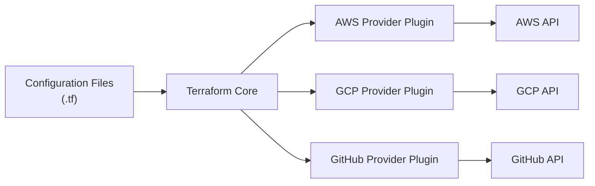

## Table of Contents

1. [What Terraform Actually Is](#what-terraform-actually-is)
2. [The Two Parts: Core and Providers](#the-two-parts-core-and-providers)
3. [The Three Commands You Use Every Time](#the-three-commands-you-use-every-time)
4. [What Happens During terraform init](#what-happens-during-terraform-init)
5. [What Happens During terraform plan](#what-happens-during-terraform-plan)
6. [What Happens During terraform apply](#what-happens-during-terraform-apply)
7. [Reading the Plan Output](#reading-the-plan-output)
8. [How Terraform Knows What Already Exists](#how-terraform-knows-what-already-exists)
9. [Terraform Supports Many Cloud Providers](#terraform-supports-many-cloud-providers)
10. [Putting It All Together](#putting-it-all-together)
11. [What's Next](#whats-next)

## What Terraform Actually Is

Terraform is a command-line tool that reads infrastructure files, compares them with what already exists, and then asks cloud APIs to create, update, or delete resources.

Terraform is a command-line tool that reads configuration files and creates, updates, or deletes cloud resources to match what those files describe. You write a file that says "I want an EC2 instance, a VPC, and a security group." You run Terraform. It talks to AWS and makes those things exist.


*Terraform compares desired configuration, remembered state, and provider reality before changing infrastructure.*

That is the core of it. The rest of this article fills in the details: how Terraform is structured internally, what each command does, and why understanding the sequence matters for using it correctly.

Terraform was created by HashiCorp and released in 2014. The Terraform CLI is free to download and use, and its current releases are published under HashiCorp's Business Source License. HashiCorp also offers managed and enterprise platforms around the workflow. For a beginner, the practical point is simple: you download the CLI as a single binary, put it somewhere on your PATH, and it is ready to use.

The configuration language it uses is called HCL, which stands for HashiCorp Configuration Language. It is designed specifically to be readable by humans. The syntax looks like a cross between JSON and a simplified programming language, with blocks for defining resources, variables, and outputs. You will get comfortable with it quickly because it is intentionally straightforward.

## The Two Parts: Core and Providers

Terraform Core is the planner and graph engine; providers are plugin processes that translate resource types into provider-specific API operations.

When you install Terraform, you get one program. But Terraform's architecture is divided into two logically separate pieces that work together: Core and Providers.

**Core** is the program you download and run. It reads your configuration files, builds a picture of what you want, compares it to what currently exists, generates a plan of what needs to change, and then executes that plan. Core is the same regardless of whether you are working with AWS, Google Cloud, Azure, or any other service.

**Providers** are separate programs, also called plugins, that Core downloads and manages automatically. Each provider knows how to talk to a specific service. The AWS provider knows how to make API calls to create EC2 instances, S3 buckets, VPCs, and hundreds of other AWS resources. The Google Cloud provider knows how to create Compute Engine instances, Cloud Storage buckets, and GKE clusters. The GitHub provider knows how to manage repositories and teams.

When you need to use AWS, you declare the AWS provider in your configuration. When you run `terraform init`, Core downloads the AWS provider plugin automatically. From that point on, whenever Terraform needs to create or update an AWS resource, Core sends instructions to the AWS provider plugin, which translates those instructions into actual AWS API calls.

This separation is why Terraform can support so many different platforms. HashiCorp builds and maintains Core. Individual teams, HashiCorp themselves, cloud providers like AWS and Google, and the open-source community, build and maintain providers. There are providers for hundreds of services. If you need to manage a resource type that does not have a provider, you can write your own.



## The Three Commands You Use Every Time

There are many Terraform commands, but three form the core workflow you use for every infrastructure change.


*Plan explains what Terraform intends to do; apply is the point where infrastructure changes.*

`terraform init` prepares the working directory for use. It reads your configuration files, figures out which providers you need, and downloads those provider plugins. You run this once when setting up a new project or when adding a new provider to an existing project.

`terraform plan` shows you exactly what Terraform would do if you ran apply, without actually doing anything. It reads your configuration, reads the current state of your infrastructure (from the state file and from the cloud provider's API), and produces a human-readable diff. Green lines with a `+` are resources that would be created. Red lines with a `-` are resources that would be deleted. Lines with `~` are resources that would be modified in place.

`terraform apply` runs the plan for real. By default, it generates a fresh plan and asks you to confirm before proceeding. You type `yes` and it starts making the changes. When it finishes, it prints a summary of what was created, modified, and destroyed.

The typical flow for any change is:

```
1. Edit your .tf files
2. terraform plan   # review what will change
3. terraform apply  # make the changes
```

You repeat this cycle for every change: edit, plan, apply. The plan step is where you catch mistakes. If the plan shows you something unexpected, a resource being destroyed that you did not mean to destroy, an attribute being modified that should have stayed the same, you stop, fix the configuration, and plan again.

## What Happens During terraform init

When you run `terraform init`, Terraform does three things.

First, it reads all the `.tf` files in the current directory and looks for `terraform` blocks that declare which providers are needed and which backend should be used for storing state. If you have declared `provider "aws"`, Terraform knows it needs the AWS provider.

Second, it contacts the Terraform Registry (at `registry.terraform.io`) to find a provider version that satisfies your version constraints. On the first init, that is usually the newest matching version. After a `.terraform.lock.hcl` file exists, Terraform reuses the locked provider version unless you intentionally run init with upgrade behavior. It downloads the provider plugin binary and stores it in a hidden directory called `.terraform/providers/` inside your working directory.

Third, it initializes the backend, the place where the state file will be stored. If you have not configured a remote backend, Terraform uses the local backend by default, which stores the state file on disk in the same directory.

After `init` finishes, the `.terraform/` directory contains everything Terraform needs to run. The `.terraform.lock.hcl` file records the exact provider versions that were downloaded. Committing this lock file to version control ensures every member of your team uses the same provider versions.

You do not need to run `terraform init` again unless you add a new provider, change the backend configuration, or delete the `.terraform/` directory. It is not part of the regular plan/apply cycle.

## What Happens During terraform plan

`terraform plan` is where Terraform figures out what it needs to do. The process has three steps.

**Step one: Read configuration.** Terraform reads all the `.tf` files in the working directory. It parses the resource blocks, variable definitions, local values, and outputs. It builds an in-memory graph of all the resources and the dependencies between them.

**Step two: Read current state.** Terraform reads the state file to see what resources it has created before. It then contacts the cloud provider's API to check whether those resources still exist and what their current attributes are. If a resource in the state file no longer exists in the cloud (because someone deleted it manually), Terraform notes the discrepancy.

**Step three: Compute the diff.** Terraform compares what the configuration says should exist against what the state and the cloud provider say currently exists. For each resource in the configuration, it determines whether to create it (does not exist yet), update it (exists but attributes differ), replace it (exists but a required attribute changed that cannot be modified in place), or leave it alone (exists and matches the configuration exactly). It then prints this diff as the plan.

The plan also shows the values of computed attributes, things that will only be assigned when the resource is actually created, like an EC2 instance's IP address or a security group's ID. These appear as `(known after apply)` in the plan output.

## What Happens During terraform apply

When you run `terraform apply`, one of two things happens depending on how you invoke it.

If you run `terraform apply` with no arguments, Terraform generates a fresh plan and shows it to you. You type `yes` to confirm, and Terraform executes the plan.

If you run `terraform plan -out=myplan.tfplan` first and save the plan to a file, then run `terraform apply myplan.tfplan`, Terraform executes the saved plan without generating a new one. This is important in automated pipelines because the approved operations are the operations Terraform attempts to apply. The apply can still fail if credentials expire, the provider API rejects a change, or the outside world changes in a way that makes the saved plan no longer valid.

During apply, Terraform walks the dependency graph and creates, updates, or deletes resources in the correct order. Resources that do not depend on each other can be created in parallel, which speeds up large deployments. Resources that depend on each other are created in sequence, the VPC first, then the subnet (which needs the VPC's ID), then the server (which needs the subnet's ID).

As each resource is created, updated, or deleted, Terraform writes the result to the state file. If the apply is interrupted, a network timeout, a provider API error, a crash, the state file reflects what completed successfully. When you run apply again, Terraform reads the state file and knows which resources were already created, picking up from where it left off.

## Reading the Plan Output

Understanding the plan output is essential for using Terraform safely. Here is what to look for.

At the top, Terraform shows any data sources it refreshed and any resources it will change. Each resource change begins with the resource type and name:

```
# aws_instance.app will be created
+ resource "aws_instance" "app" {
    + ami           = "ami-0c55b159cbfafe1f0"
    + instance_type = "t3.small"
    + id            = (known after apply)
    + private_ip    = (known after apply)
    + public_ip     = (known after apply)
  }
```

The `+` at the start of each line means the attribute will be set when the resource is created. `(known after apply)` means the value will be assigned by AWS after creation, you cannot know it in advance.

For an update, you see a `~`:

```
# aws_instance.app will be updated in-place
~ resource "aws_instance" "app" {
      id            = "i-0a1b2c3d4e5f6789"
    ~ instance_type = "t3.small" -> "t3.medium"
  }
```

The `~` shows the attribute is changing. The `->` shows the old value on the left and the new value on the right.

For a replacement (destroy the old resource and create a new one), you see both `-/+`:

```
# aws_instance.app must be replaced
-/+ resource "aws_instance" "app" {
    ~ ami = "ami-0c55b159cbfafe1f0" -> "ami-0987654321abcdef0" # forces replacement
  }
```

The phrase `# forces replacement` tells you which attribute change triggered the replacement. Replacements are the most impactful changes because they cause brief downtime for the old resource. Pay careful attention to any `-/+` lines in the plan.

At the bottom, the plan summarizes the total number of changes:

```
Plan: 3 to add, 1 to change, 0 to destroy.
```

## How Terraform Knows What Already Exists

Terraform uses a state file to track what it has created. After every successful apply, the state file is updated to record every resource that exists and its current attributes.

When you run `terraform plan`, Terraform reads the state file to find the list of resources it previously created. It then contacts the cloud provider's API to verify those resources still exist and to get their current attributes. If you changed a setting in the console without going through Terraform, this API check will catch the discrepancy.

Without the state file, Terraform would have no memory of what it created. Every `terraform plan` would think all resources are new and propose to create them all over again. The state file is what makes Terraform idempotent, running it multiple times without any configuration changes produces no further changes, because Terraform can see that reality already matches the configuration.

This is why the state file is so important. Losing it means Terraform loses all memory of what it created. Getting it back requires manually telling Terraform about each existing resource using `terraform import`. Protecting the state file, by storing it in a remote backend with backups, is a critical practice for any team using Terraform.

## Terraform Supports Many Cloud Providers

One of Terraform's major strengths is that it works the same way regardless of which cloud provider you are using. The commands are the same. The workflow is the same. The language is the same. Only the resource types in your configuration files differ.

For AWS, you write `resource "aws_instance"` and `resource "aws_s3_bucket"`. For Google Cloud, you write `resource "google_compute_instance"` and `resource "google_storage_bucket"`. For Azure, you commonly write resources such as `azurerm_linux_virtual_machine`, `azurerm_resource_group`, and `azurerm_storage_account`.

This consistency means skills transfer. An engineer who knows how to use Terraform with AWS can pick up Terraform for Google Cloud very quickly, the concepts, commands, and workflow are identical. Only the specific resource types and attribute names are different.

It also means Terraform can manage resources across multiple cloud providers in the same configuration. A configuration might create an AWS VPC and RDS database, a Cloudflare DNS record pointing at the load balancer, and a GitHub repository with the infrastructure code, all in one `terraform apply`.

There are over 3,000 providers available in the Terraform Registry. HashiCorp maintains several widely used providers such as AWS, AzureRM, Google Cloud, and Kubernetes. Other providers are maintained by cloud vendors, software companies, or community organizations. For example, the GitHub provider is published under the `integrations/github` namespace. If you need to manage a resource type that exists somewhere in the digital world, there is a good chance a provider exists for it.

## Putting It All Together

Terraform is a command-line tool split into two parts: Core, which handles the planning and state logic, and Providers, which handle the API communication with each specific service. You write configuration files that describe what you want to exist. Terraform compares those files against what currently exists and proposes a plan. You review the plan, confirm it, and Terraform makes the changes.

The workflow is always the same: `terraform init` to set up the providers, `terraform plan` to see what will change, `terraform apply` to make the changes. The state file records what Terraform created, which is what allows Terraform to detect changes and avoid creating duplicates.

The consistency of this workflow across hundreds of cloud providers is why Terraform has become the standard tool for infrastructure management. Learn it once with AWS, and the knowledge transfers directly to every other platform it supports.

## What's Next

Now that you understand what Terraform is and how it works, the next article goes deeper into providers: how to configure them, how to use multiple providers in the same configuration, and what happens when you need to deploy to multiple regions or accounts simultaneously.


*Use this summary as the quick Terraform mental checklist before reading a plan or running apply.*


---

**References**

- [Terraform Introduction (HashiCorp Documentation)](https://developer.hashicorp.com/terraform/intro), Official introduction to Terraform, its use cases, and the core workflow.
- [How Terraform Works with Plugins (HashiCorp Documentation)](https://developer.hashicorp.com/terraform/plugin/how-terraform-works), A more detailed explanation of the Core/Provider architecture.
- [Provider Requirements (HashiCorp Documentation)](https://developer.hashicorp.com/terraform/language/providers/requirements), Official reference for provider source addresses and namespaces.
- [GitHub Provider (Terraform Registry)](https://registry.terraform.io/providers/integrations/github/latest), Current Terraform Registry page for the GitHub provider namespace.
- [Terraform CLI Commands (HashiCorp Documentation)](https://developer.hashicorp.com/terraform/cli/commands), Complete reference for all Terraform CLI commands, including init, plan, apply, and destroy.
- [Terraform on Azure Overview (Microsoft Learn)](https://learn.microsoft.com/en-us/azure/developer/terraform/overview), Microsoft's overview of using Terraform with Azure.
- [Create an Azure Resource Group with Terraform (Microsoft Learn)](https://learn.microsoft.com/en-us/azure/developer/terraform/azurerm/create-resource-group), Beginner AzureRM example using Terraform.
