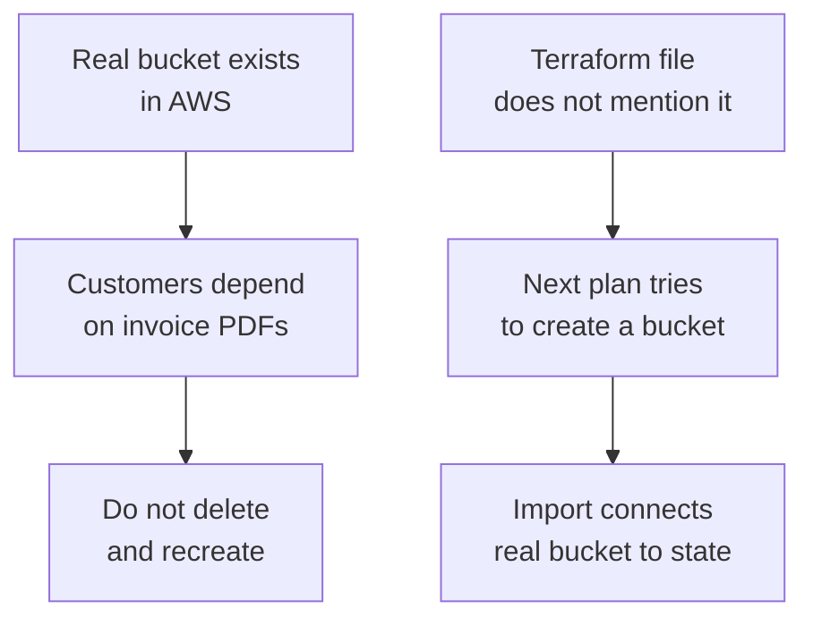

## Table of Contents

1. [The Adoption Problem](#the-adoption-problem)
2. [What Import Actually Connects](#what-import-actually-connects)
3. [Import, Recreate, or Reference](#import-recreate-or-reference)
4. [Write the Resource Block First](#write-the-resource-block-first)
5. [Import Blocks in Review](#import-blocks-in-review)
6. [CLI Import for One-Time Repairs](#cli-import-for-one-time-repairs)
7. [Reading the First Plan After Import](#reading-the-first-plan-after-import)
8. [Common Import Failure Modes](#common-import-failure-modes)
9. [Operating Imported Resources Afterward](#operating-imported-resources-afterward)

## The Adoption Problem

Some infrastructure exists before your repository knows about it. A team may have created it in a cloud console during the first week of a project. Another team may have built it with a script. A vendor setup guide may have asked someone to click through a dashboard. The resource is real, users may depend on it, and deleting it so Terraform can recreate it would be careless.

Import is the Terraform and OpenTofu workflow for adopting an existing resource. It creates a connection between three things: a real object in the provider, a resource address in your configuration, and a state entry. State is Terraform's record of which real object belongs to which resource address. Without that state entry, Terraform sees the resource block as a request to create something new.

Import exists because infrastructure adoption rarely starts from an empty account. Teams often move toward Infrastructure as Code after they already have buckets, DNS zones, databases, IAM roles, log groups, or networks. The import workflow lets the team bring those objects under review without first destroying working infrastructure.

In the larger Terraform workflow, import sits between discovery and normal plan review. You inspect the real object, write a resource block that describes the object as it should be managed, import the real object into state, then run a plan to find any mismatch. After that, the resource behaves like any other managed resource.

The running example is `devpolaris-orders`. The service already has a production S3 bucket named `dp-orders-invoices-prod`. The orders API writes invoice PDFs there. The bucket was created by hand during an early launch week, and now the team wants Terraform to manage it alongside the rest of the service infrastructure.

Here is the problem in one small picture:



The safest path is to adopt the resource, not pretend it is new. The rest of this article shows the decision work around that adoption, because the command is the easy part. The engineering judgment is deciding whether this repository should own the resource and whether the resource block accurately describes reality.

## What Import Actually Connects

Terraform manages resources by address. In the first workflow article, you saw an address like `aws_s3_bucket.orders_invoices`. That address is the name Terraform uses in plans and state. The real provider object has its own identity too. For an S3 bucket, the import ID is usually the bucket name. For other resources, it might be an ARN, a resource group path, a database instance ID, or a provider-specific string.

Import joins those identities. It tells Terraform, "the resource block at this address should point at that real object." It does not create the object. It does not automatically make the configuration perfect. It does not prove the object is safe. It records ownership in state so the next plan can compare the resource block with the real system.

Think of state like a small internal catalog. Before import, the catalog has no row for the invoice bucket:

```text
Terraform state before import:

Address                         Real object
------------------------------  ---------------------------
aws_iam_role.orders_api         arn:aws:iam::123456789012:role/orders-api-prod
aws_cloudwatch_log_group.api    /aws/app/devpolaris-orders-prod
```

After import, the catalog gains a row:

```text
Terraform state after import:

Address                         Real object
------------------------------  ---------------------------
aws_iam_role.orders_api         arn:aws:iam::123456789012:role/orders-api-prod
aws_cloudwatch_log_group.api    /aws/app/devpolaris-orders-prod
aws_s3_bucket.orders_invoices   dp-orders-invoices-prod
```

That state row is why the next plan can reason about the bucket. Without it, Terraform sees a resource block for `aws_s3_bucket.orders_invoices` and assumes it needs to create the bucket. With it, Terraform reads the existing bucket and checks whether the configuration matches.

The first plan after import is often noisy because the existing resource may not match your ideal Terraform block. That is useful noise. It shows the team which settings are already correct, which settings are missing from the code, and which settings Terraform would change if you applied immediately.

The important beginner idea is that import is not a shortcut around configuration. You still need a resource block. You still need review. You still need a plan. The command only connects identities. The team still decides what the managed resource should look like from now on.

OpenTofu follows the same broad model. You connect an existing provider object to an address in state, then use the normal plan workflow to inspect what the configuration would change.

## Import, Recreate, or Reference

Not every existing object should be imported. Some resources should be recreated because they are disposable. Some should be referenced as data because another team owns them. Some should be left alone because Terraform is not the right owner. A careful import starts with ownership, not syntax.

For `devpolaris-orders`, the invoice bucket stores production invoice PDFs. It has data that matters. Recreating it would require copying objects, preserving access behavior, updating any applications that reference it, and proving old links still work. Import is likely safer than replacement.

Compare that with a development bucket created during a local experiment. If it contains no data and no service depends on it, recreating it through Terraform may be cleaner than importing a messy manual setup. The old resource can be deleted after confirming there is no dependency.

A shared DNS hosted zone is a different case. The orders service may need to create one record inside `devpolaris.internal`, but the platform team may own the zone. The orders repository should probably use a data source to read the hosted zone, then manage only its own record. Importing the whole zone into the orders repo would give the wrong team ownership over shared infrastructure.

Use this decision table before importing:

| Situation | Better Choice | Reason |
|-----------|---------------|--------|
| Long-lived resource with important data | Import | Keeps the object and brings future changes under review. |
| Disposable test resource | Recreate | A clean managed replacement is easier than adopting old mistakes. |
| Shared resource owned by another team | Reference | Your code can read it without claiming ownership. |
| Vendor-managed resource | Reference or leave alone | Terraform should not manage what the vendor lifecycle controls. |
| Resource with unknown dependencies | Investigate first | Importing ownership too early can hide a larger migration problem. |

For the invoice bucket, the team writes down the ownership decision before touching state:

```text
Resource: dp-orders-invoices-prod
Current owner: devpolaris-orders team
Data sensitivity: production invoices
Desired future owner: Terraform root module infra/orders/prod
Chosen path: import, then plan review
Verification: list tags, public access block, encryption, app write test
```

That record matters because import changes responsibility. After the bucket is imported, future Terraform plans may update or destroy it if the configuration asks for that. The team needs to be ready to treat the `.tf` files as the source of intended behavior.

## Write the Resource Block First

Terraform import needs an address to attach the real object to. That address comes from a resource block. The safest beginner workflow is to write the resource block first, keep it small, and use plan output to decide what details to add.

Start by inspecting the existing bucket. The exact command depends on the provider. For AWS S3, a few read-only checks can establish the basics:

```bash
$ aws s3api get-bucket-location --bucket dp-orders-invoices-prod
{
  "LocationConstraint": "eu-west-2"
}

$ aws s3api get-bucket-tagging --bucket dp-orders-invoices-prod
{
  "TagSet": [
    { "Key": "service", "Value": "orders-api" },
    { "Key": "environment", "Value": "prod" },
    { "Key": "owner", "Value": "platform" }
  ]
}
```

The first command confirms the region. The second confirms tags. These checks do not cover every safety setting, but they give you enough to avoid writing a resource block in the wrong region or with the wrong identity.

The first resource block can be small:

```hcl
resource "aws_s3_bucket" "orders_invoices" {
  bucket = "dp-orders-invoices-prod"

  tags = {
    service     = "orders-api"
    environment = "prod"
    owner       = "platform"
  }
}
```

This block describes the bucket name and tags. It does not yet describe public access settings, encryption, lifecycle rules, or bucket policy. Many providers split those settings into separate resource types. For AWS S3, you often manage the bucket itself in one resource and related controls in separate resources such as public access block, encryption configuration, ownership controls, and lifecycle configuration.

That separation can surprise beginners. The cloud console shows one bucket screen. The Terraform provider may model several API surfaces as separate resource types. That design makes each API behavior explicit, but it means importing a real bucket may require more than one resource block if your team wants Terraform to manage the full setup.

For the first import, avoid guessing every possible related resource. Start with the core resource, import it, and read the plan. Then add related resource blocks deliberately when the team knows which settings should be owned by Terraform.

Before running import, format and validate the configuration:

```bash
$ terraform fmt
$ terraform validate
Success! The configuration is valid.
```

Validation does not prove the import ID is correct. It proves Terraform can understand the configuration and the resource address exists. That is enough to move into the import step.

OpenTofu uses the same preparation:

```bash
$ tofu fmt
$ tofu validate
```

The key is to keep the file reviewable before state changes. If a teammate cannot tell which real object you are about to adopt, slow down and make the resource address and name clearer.

## Import Blocks in Review

Modern Terraform supports import blocks in configuration. An import block lets the import intent live in the pull request next to the resource block. That is useful for team review because the reviewer can see both the desired address and the real provider ID before anyone runs apply.

For the invoice bucket, the import block looks like this:

```hcl
import {
  to = aws_s3_bucket.orders_invoices
  id = "dp-orders-invoices-prod"
}
```

Read it as a small mapping. `to` is the Terraform address. `id` is the provider-specific import ID for the existing object. For this S3 bucket, the ID is the bucket name. For another resource type, the provider documentation decides the ID format.

With the resource block and import block in the same branch, the pull request can explain the adoption:

```text
Change summary:
- Adopt existing production invoice bucket.
- Do not create or recreate the bucket.
- Keep current tags visible in Terraform.

Import mapping:
- aws_s3_bucket.orders_invoices -> dp-orders-invoices-prod

Expected first plan:
- 1 resource to import.
- 0 resources to create.
- Follow-up drift may appear for unmanaged bucket settings.
```

The plan should show the import action as part of the proposed change:

```text
Terraform will perform the following actions:

  # aws_s3_bucket.orders_invoices will be imported
    resource "aws_s3_bucket" "orders_invoices" {
        bucket = "dp-orders-invoices-prod"
        tags   = {
            "environment" = "prod"
            "owner"       = "platform"
            "service"     = "orders-api"
        }
    }

Plan: 1 to import, 0 to add, 0 to change, 0 to destroy.
```

That summary is the shape you want for a clean adoption. It says Terraform is connecting the real bucket to state, not creating a new bucket or deleting anything.

After the import is applied, the import block has done its job. Many teams remove it in a follow-up commit once the state entry exists, because leaving old import instructions in the configuration can confuse future readers. The resource block stays. The state entry stays in the backend. The import block was the reviewed instruction that created the connection.

OpenTofu also documents import blocks and the traditional import command. Check the OpenTofu documentation for the exact behavior your team relies on, especially if you are using generated configuration features or provider-specific import details.

## CLI Import for One-Time Repairs

You will also see the older CLI workflow:

```bash
$ terraform import aws_s3_bucket.orders_invoices dp-orders-invoices-prod
```

This command immediately updates state by connecting the address to the provider ID. It does not add an import block to the configuration. It is useful for one-time repair work, local learning, and older repositories that have not adopted import blocks.

The tradeoff is review visibility. A CLI import changes state outside the pull request unless the team has a careful runbook and shared backend history. The configuration review can show the resource block, but it does not show the exact import mapping as code. That makes the command operator responsible for recording what happened.

A beginner-safe CLI import run should leave evidence:

```bash
$ terraform import aws_s3_bucket.orders_invoices dp-orders-invoices-prod
aws_s3_bucket.orders_invoices: Importing from ID "dp-orders-invoices-prod"...
aws_s3_bucket.orders_invoices: Import prepared!
  Prepared aws_s3_bucket for import
aws_s3_bucket.orders_invoices: Refreshing state... [id=dp-orders-invoices-prod]

Import successful!

The resources that were imported are shown above. These resources are now in
your Terraform state and will henceforth be managed by Terraform.
```

Afterward, verify the state entry:

```bash
$ terraform state list
aws_cloudwatch_log_group.api
aws_iam_role.orders_api
aws_s3_bucket.orders_invoices
```

That output proves Terraform knows about the address. It still does not prove the configuration is complete. The next command should be a plan:

```bash
$ terraform plan
```

OpenTofu has the equivalent command:

```bash
$ tofu import aws_s3_bucket.orders_invoices dp-orders-invoices-prod
```

Use whichever tool your repository has chosen. Do not mix Terraform and OpenTofu against the same state backend casually. The workflow is similar, but state, lock files, provider selections, and team support should be handled deliberately.

CLI import is a good fit when you are repairing one state entry under a controlled change window. Import blocks are often better when the adoption itself should be reviewed as code.

## Reading the First Plan After Import

The first plan after import is the real review moment. Terraform can now compare three things: the resource block, the imported state entry, and the real provider object. Any mismatch appears as a proposed change.

For the invoice bucket, a healthy first follow-up might be quiet:

```text
aws_s3_bucket.orders_invoices: Refreshing state... [id=dp-orders-invoices-prod]

No changes. Your infrastructure matches the configuration.
```

That is possible when the resource block matches the provider's view for the fields Terraform manages in that resource. More often, the plan shows a small update because the configuration and real object disagree.

Here is a realistic tag mismatch:

```text
  # aws_s3_bucket.orders_invoices will be updated in-place
  ~ resource "aws_s3_bucket" "orders_invoices" {
        bucket = "dp-orders-invoices-prod"
      ~ tags   = {
          ~ "owner" = "legacy-ops" -> "platform"
            "environment" = "prod"
            "service"     = "orders-api"
        }
    }

Plan: 0 to add, 1 to change, 0 to destroy.
```

The plan is saying the real bucket or state has `owner = legacy-ops`, while the file asks for `owner = platform`. That may be exactly the cleanup the team wants. It may also mean the file was written with the wrong owner. The plan does not make that judgment for you. It gives you the evidence.

A more serious plan might propose replacement:

```text
  # aws_s3_bucket.orders_invoices must be replaced
-/+ resource "aws_s3_bucket" "orders_invoices" {
      ~ bucket = "dp-orders-invoices-prod" -> "dp-orders-invoices-production"
    }

Plan: 1 to add, 0 to change, 1 to destroy.
```

For a production bucket with invoices, that is a stop sign. Bucket names identify real storage locations, and replacement may affect data, permissions, app configuration, and customer access. The fix direction is not to approve the replacement quickly. The team should decide whether the name in code is wrong, whether a migration is needed, or whether the resource should keep its current name.

After import, review destructive and replacement actions with extra care. A resource that was safe to adopt can become dangerous if the first apply tries to reshape it too aggressively.

## Common Import Failure Modes

Import failures usually fall into a few patterns. The error message often points at the missing piece if you know which layer Terraform was trying to connect.

The first pattern is importing to an address that has no resource block:

```text
Error: resource address "aws_s3_bucket.orders_invoices" does not exist in the configuration.

Before importing this resource, please create its resource configuration in the root module.
```

The fix is to add the resource block first, then retry. Terraform needs an address in the configuration because import attaches the real object to that address.

The second pattern is a wrong provider ID:

```text
Error: Cannot import non-existent remote object

While attempting to import an existing object to
"aws_s3_bucket.orders_invoices", the provider detected that no object exists
with the given id.
```

For an S3 bucket, check the bucket name and region. For other resources, read the provider documentation for the import ID format. Do not assume the ID is always the friendly name shown in the console.

The third pattern is missing credentials or wrong account:

```text
Error: No valid credential sources found
```

This means Terraform could not authenticate to the provider. It may also mean you are authenticated to the wrong account or subscription. Before importing production resources, confirm the account identity with the provider CLI your team uses. For AWS, that might be `aws sts get-caller-identity`.

The fourth pattern appears when Terraform still tries to create a duplicate after import work. The plan or apply may show:

```text
Error: creating S3 Bucket (dp-orders-invoices-prod): BucketAlreadyOwnedByYou
```

That usually means the state connection is missing, the resource address differs from the imported address, or the import happened in a different workspace or backend. Check `terraform state list`, confirm the current workspace, and confirm the backend used by `terraform init`.

The fifth pattern is importing the wrong object. This can happen when names look similar:

```text
aws_s3_bucket.orders_invoices: Refreshing state... [id=dp-orders-invoice-prod]
```

That missing `s` in `invoice` may point to a different bucket. If the plan shows unexpected tags, region, lifecycle rules, or policies, verify the real ID before applying any changes. Removing the wrong state entry with `terraform state rm` may be safer than trying to edit around a mistaken import, but treat state commands as operational changes and follow your team's runbook.

Import is a precision task. The resource address, provider ID, backend, workspace, and credentials all need to point at the same intended target.

## Operating Imported Resources Afterward

Once the invoice bucket is imported and the follow-up plan is understood, the resource joins the normal Terraform workflow. Future changes should happen through pull requests, plans, applies, and verification. The team should avoid changing the bucket manually in the console unless there is an emergency and a follow-up IaC change captures the intended result.

The first useful cleanup is often to add the related controls that make ownership complete. For an S3 bucket, the team might add public access block, encryption configuration, lifecycle rules, ownership controls, and bucket policy resources. Add them in small reviewed steps so each plan stays readable.

For example, the next pull request might manage public access protection:

```hcl
resource "aws_s3_bucket_public_access_block" "orders_invoices" {
  bucket = aws_s3_bucket.orders_invoices.id

  block_public_acls       = true
  block_public_policy     = true
  ignore_public_acls      = true
  restrict_public_buckets = true
}
```

The plan should show one new control resource, not a bucket replacement:

```text
Plan: 1 to add, 0 to change, 0 to destroy.
```

After apply, verify the real setting:

```bash
$ aws s3api get-public-access-block --bucket dp-orders-invoices-prod
{
  "PublicAccessBlockConfiguration": {
    "BlockPublicAcls": true,
    "IgnorePublicAcls": true,
    "BlockPublicPolicy": true,
    "RestrictPublicBuckets": true
  }
}
```

The imported bucket is now no longer a mysterious manual object. It has a resource address, review history, state, and verification commands. That is the practical goal of import: take something real and important, bring it under a safer operating loop, and avoid a risky rebuild just to satisfy the tool.

---

**References**

- [Terraform import existing resources](https://developer.hashicorp.com/terraform/language/import) - Explains Terraform import blocks and the workflow for adopting existing infrastructure.
- [Terraform import command](https://developer.hashicorp.com/terraform/cli/commands/import) - Documents the CLI import command and how it connects an existing remote object to a resource address.
- [Terraform state command](https://developer.hashicorp.com/terraform/cli/commands/state) - Describes state inspection and modification commands used when checking imported resources.
- [Terraform plan command](https://developer.hashicorp.com/terraform/cli/commands/plan) - Shows how plans reveal the changes Terraform proposes after an import.
- [OpenTofu import documentation](https://opentofu.org/docs/language/import/) - Covers the OpenTofu import workflow and equivalent concepts.
