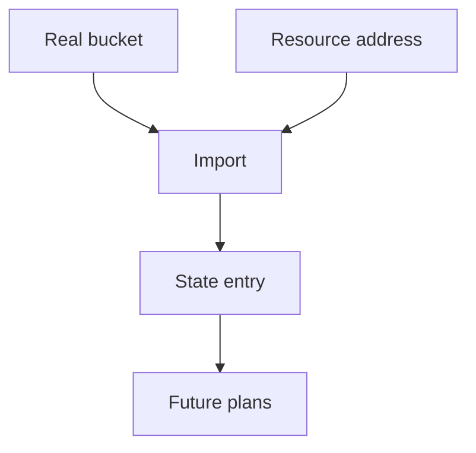

## Table of Contents

1. [The Problem](#the-problem)
2. [Import](#import)
3. [Resource Block First](#resource-block-first)
4. [Import Blocks](#import-blocks)
5. [CLI Import](#cli-import)
6. [First Plan](#first-plan)
7. [Import or Reference](#import-or-reference)
8. [Failure Modes](#failure-modes)
9. [Putting It All Together](#putting-it-all-together)
10. [What's Next](#whats-next)

## The Problem

The orders service existed before the Terraform module. During launch week, someone created the production invoice bucket by hand. The bucket now contains real invoice PDFs, and the application depends on it.

The team wants Terraform to manage the bucket from now on. They cannot simply add a resource block and apply.

- Terraform may try to create a bucket that already exists.
- A careless replacement could destroy production data.
- The manual bucket may have settings the team does not understand yet.
- Another team may own a related object, such as a shared DNS zone or KMS key.

Import is the workflow for adopting existing infrastructure. It connects an existing real object to Terraform state so future plans can manage it through code.

## Import

Import connects three things: a real provider object, a Terraform resource address, and a state entry.



For the invoice bucket, the real object is `dp-orders-invoices-prod`. The resource address might be `aws_s3_bucket.orders_invoices`. The state entry records that these two belong together.

Import does not make the resource safe by itself. It does not automatically prove the resource block is complete. It does not mean Terraform created the object. It only records ownership so the next plan can compare the file with reality.

That comparison is the point. After import, Terraform can tell the team whether the resource block matches the real bucket or whether applying would change it.

## Resource Block First

Terraform needs a destination address for the imported object. That address comes from a resource block.

Start small:

```hcl
resource "aws_s3_bucket" "orders_invoices" {
  bucket = "dp-orders-invoices-prod"

  tags = {
    service     = "orders-api"
    environment = "prod"
    owner       = "platform"
  }
}
```

This block says how the team wants Terraform to manage the bucket address. It may not capture every current bucket setting yet. That is okay. The first plan after import will show what differs.

The important habit is to inspect before adoption. Read the existing resource in the provider. Find its name, account, region, tags, access controls, encryption posture, lifecycle rules, and dependencies. Then write the resource block intentionally.

Do not import a resource just because it exists. Import means this Terraform root module is taking lifecycle responsibility.

## Import Blocks

Terraform supports import blocks in configuration. An import block lets the import operation appear in the same reviewable files as the resource block.

```hcl
import {
  to = aws_s3_bucket.orders_invoices
  id = "dp-orders-invoices-prod"
}
```

The `to` argument points at the resource address. The `id` is the provider-specific identity of the real object. For an S3 bucket, the ID is commonly the bucket name, though provider documentation should always be checked for the resource being imported.

Import blocks are useful because they make adoption reviewable. A pull request can show both the desired resource block and the import mapping. Reviewers can ask whether the ID belongs to the correct account and whether the target address is right.

After a successful import and clean follow-up plan, teams often remove the import block so the configuration describes ongoing management rather than repeating the adoption step forever. The state entry remains.

## CLI Import

Terraform also has a CLI import command:

```bash
$ terraform import aws_s3_bucket.orders_invoices dp-orders-invoices-prod
```

The CLI command imports the object into state. HashiCorp documents that before running `terraform import`, you must manually write the destination resource configuration. CLI import does not generate the configuration by itself.

CLI import can be useful for one-time repairs, small local adoptions, or older workflows. The tradeoff is review visibility. A command run in a terminal can be harder to audit than an import block in a pull request.

The healthy team habit is to record the adoption decision somewhere reviewable, even when using CLI import. Future maintainers need to know why this root module owns the resource.

## First Plan

The first plan after import is the most important step. It tells the team whether the resource block and the real object match.

A clean adoption might show:

```text
No changes. Your infrastructure matches the configuration.
```

That means the resource block describes the imported object closely enough for Terraform's managed view.

A normal first import plan may show small differences:

```text
  # aws_s3_bucket.orders_invoices will be updated in-place
  ~ tags = {
      + managed_by = "terraform"
    }
```

This may be acceptable if the team intends to add the tag. A scary first import plan looks different:

```text
  # aws_s3_bucket.orders_invoices must be replaced
```

Replacement after import is a stop sign, especially for stateful resources. It may mean the resource block is wrong, the address points to the wrong object, the provider identity is incomplete, or the team is trying to manage a field that cannot be changed in place.

Do not celebrate import until the first plan makes sense.

## Import or Reference

Not every existing object should be imported. Import is an ownership decision.

| Existing object | Better path | Reason |
| --- | --- | --- |
| Orders invoice bucket | Import | The service owns it and future changes belong in this root module. |
| Shared DNS zone owned by platform | Data source | The service may read it but should not own the zone lifecycle. |
| Disposable test bucket | Recreate | A clean managed object may be simpler than adopting old mistakes. |
| Vendor-managed object | Reference or leave alone | Terraform should not own another system's lifecycle. |
| Unknown production database | Investigate first | Ownership and dependencies are not clear enough yet. |

A data source can be the right answer when the Terraform configuration needs facts about an existing object but should not manage it. Import is right when this root module should own the object from now on.

The wrong import can be worse than no import. It gives Terraform authority over something the team does not actually own.

## Failure Modes

Import failures are often ownership or identity failures wearing technical clothes.

| Symptom | Likely question |
| --- | --- |
| Object not found | Are credentials, region, account, and ID correct? |
| Plan wants create after import | Did import target the same address used by the resource block? |
| Plan wants replacement | Is the resource block describing immutable fields correctly? |
| Two addresses point at one object | Was the same real object imported twice? |
| Plan is noisy | Are unmanaged existing settings missing from configuration? |

Terraform expects a remote object to be bound to one resource address. Importing the same object to multiple addresses can produce confusing and unwanted behavior. If ownership is unclear, stop and map it before forcing state.

## Putting It All Together

The orders team wanted Terraform to manage a bucket that already contained production invoices. Import gave them a safe adoption path.

- Import connects a real object, resource address, and state entry.
- The resource block should be written before adoption.
- Import blocks make the mapping reviewable in code.
- CLI import can work, but the adoption decision still needs a record.
- The first plan after import decides whether the adoption is clean.
- Some objects should be read as data sources instead of imported.
- Import failures usually point back to identity, ownership, or state confusion.

Import is not a shortcut around understanding existing infrastructure. It is the workflow for making existing infrastructure reviewable without pretending it is new.

## What's Next

The final Terraform article moves the workflow into CI. Pull requests need repeatable formatting, validation, plan evidence, credentials, backend access, locks, and apply boundaries.

---

**References**

- [Terraform import overview](https://developer.hashicorp.com/terraform/cli/import)
- [Terraform import language overview](https://developer.hashicorp.com/terraform/language/import)
- [Terraform state](https://developer.hashicorp.com/terraform/language/state)
- [Terraform data sources](https://developer.hashicorp.com/terraform/language/data-sources)
