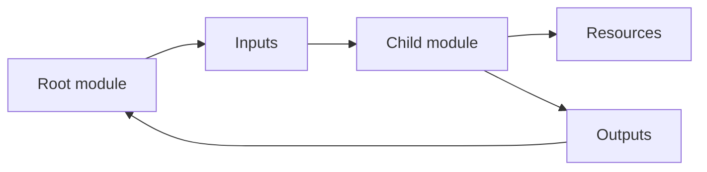

## Table of Contents

1. [The Problem](#the-problem)
2. [Root and Child Modules](#root-and-child-modules)
3. [Module Contract](#module-contract)
4. [Inputs](#inputs)
5. [Outputs](#outputs)
6. [Sources and Versions](#sources-and-versions)
7. [Reuse Judgment](#reuse-judgment)
8. [Refactors](#refactors)
9. [Putting It All Together](#putting-it-all-together)
10. [What's Next](#whats-next)

## The Problem

The orders team now has one private invoice bucket. A week later they need another private bucket for exports. A second service needs the same pattern for reports. Soon three directories contain nearly identical bucket resources, public access blocks, tags, lifecycle settings, and outputs.

Copy-paste feels fast until the differences matter.

- One bucket blocks public access and another forgot one setting.
- Tags drift because each copy has its own tag block.
- Versioning is enabled for invoices but nobody can tell whether exports need it too.
- A reviewer sees hundreds of repeated lines and misses the one risky change.

Modules exist for this kind of repeated infrastructure shape. A module can package a pattern once, then let callers choose the values that should differ. The trick is keeping the important decisions visible.

## Root and Child Modules

Every Terraform configuration has a root module. The root module is the directory where Terraform runs. A child module is a module called by another module with a `module` block.

The orders repository might look like this:

```text
infra/
  envs/
    prod/
      main.tf
      variables.tf
      outputs.tf
  modules/
    private-bucket/
      main.tf
      variables.tf
      outputs.tf
```

If the team runs Terraform from `infra/envs/prod`, that directory is the root module. The files under `modules/private-bucket` are ignored unless the root module calls them:

```hcl
module "invoice_bucket" {
  source = "../../modules/private-bucket"

  bucket_name        = "dp-orders-invoices-prod"
  environment        = "prod"
  owner              = "platform"
  versioning_enabled = true
}
```

The module label becomes part of addresses in plans and state. Inside the child module, a bucket resource might be named `aws_s3_bucket.this`. From the root module's plan, the full address becomes something like `module.invoice_bucket.aws_s3_bucket.this`.

That address matters. Moving a resource into a module is not only code organization. It changes the Terraform address unless you handle state movement.

## Module Contract

A module has a contract. Inputs are what callers provide. Resources and data sources are what the module manages or reads internally. Outputs are what the module returns.



The contract is the part reviewers should care about first. A good private-bucket module might promise:

| Contract part | Example |
| --- | --- |
| Inputs | `bucket_name`, `environment`, `owner`, `versioning_enabled` |
| Managed resources | Bucket, public access block, optional versioning |
| Outputs | Bucket name, bucket ARN |
| Invariant | Public access is blocked for every caller |

The caller chooses values that belong to the environment or service. The module enforces the pattern that should be consistent everywhere.

If a module hides every decision, callers cannot review risk. If it exposes every provider argument, it may be no better than copy-paste. The contract should make repeated policy easy while keeping business decisions visible.

## Inputs

Module inputs are variables in the child module. The parent module supplies them as arguments in the module block.

Inside `modules/private-bucket/variables.tf`:

```hcl
variable "bucket_name" {
  description = "Globally unique bucket name."
  type        = string
}

variable "versioning_enabled" {
  description = "Whether to keep prior object versions."
  type        = bool
  default     = false
}
```

From the root module:

```hcl
module "invoice_bucket" {
  source = "../../modules/private-bucket"

  bucket_name        = "dp-orders-invoices-prod"
  versioning_enabled = true
}
```

Inputs are where module design becomes visible. If `versioning_enabled` is an input, the caller must decide whether this data needs recovery from overwrites and deletes. If the module silently hardcodes it, the caller may never discuss the tradeoff.

Use validation for inputs that have a small safe set of values. Use descriptions so callers understand the contract without opening every resource file.

## Outputs

Outputs let the module return useful facts to the caller. For a private bucket, useful outputs are usually the name and ARN:

```hcl
output "bucket_name" {
  description = "Name of the private bucket."
  value       = aws_s3_bucket.this.bucket
}

output "bucket_arn" {
  description = "ARN of the private bucket."
  value       = aws_s3_bucket.this.arn
}
```

The root module can reference those outputs:

```hcl
resource "aws_iam_policy" "invoice_writer" {
  name = "orders-api-invoice-writer"

  policy = jsonencode({
    Version = "2012-10-17"
    Statement = [
      {
        Effect   = "Allow"
        Action   = ["s3:PutObject"]
        Resource = "${module.invoice_bucket.bucket_arn}/*"
      }
    ]
  })
}
```

This avoids guessing the ARN string. It also keeps the dependency visible: the policy depends on the bucket module output.

Outputs should be selective. A module that outputs every internal attribute is leaking its internals. A module that outputs nothing may force callers to rebuild details by hand. Output what the caller truly needs to connect the system.

## Sources and Versions

The `source` argument tells Terraform where to find a child module. A source can be a local path, a registry address, a Git URL, or another supported module source.

A local source is good when the module lives in the same repository:

```hcl
module "invoice_bucket" {
  source = "../../modules/private-bucket"
}
```

A registry or Git source is common when multiple repositories need the same module. Once a module source is remote, versioning becomes important. The caller should not accidentally pull a new module implementation that changes production behavior without review.

For registry modules, the module block can include a version constraint:

```hcl
module "network" {
  source  = "app.terraform.io/devpolaris/network/aws"
  version = "~> 2.3"
}
```

For Git sources, teams often pin tags or commits in the source string. The exact pattern depends on the source type, but the principle is stable: reusable infrastructure code is a dependency. Treat module upgrades like dependency upgrades.

After adding or changing module sources, run `terraform init` again. Terraform installs child modules during initialization.

## Reuse Judgment

Not every repeated block deserves a module. A module earns its place when it names a real pattern, reduces meaningful duplication, and makes review easier.

Use this table before creating a module:

| Situation | Module likely helps? | Reason |
| --- | --- | --- |
| Same private-bucket policy repeated across services | Yes | The pattern has shared safety behavior. |
| Two lines repeated once | Usually no | The abstraction may hide more than it helps. |
| Every caller needs a different shape | Usually no | The module contract will become confusing. |
| Platform team owns a standard service pattern | Yes | A module can encode the platform contract. |
| Module only wraps one provider resource with all arguments exposed | Maybe no | It may be a thin wrapper with little teaching value. |

The best modules raise the level of conversation. Reviewers discuss "private application bucket with versioning" instead of scanning the same public access block resources in every service. The worst modules hide provider behavior behind vague names and force everyone to open the module source during every review.

## Refactors

Module refactors can surprise Terraform because addresses change. Suppose a bucket starts as:

```text
aws_s3_bucket.orders_invoices
```

After moving it into a child module, the address may become:

```text
module.invoice_bucket.aws_s3_bucket.this
```

The real bucket did not change, but the Terraform address did. Without a state-aware move, Terraform may propose destroying the old address and creating the new one. For a bucket with production data, that is not a tidy refactor. It is risk.

Modern Terraform supports moved blocks for many address changes:

```hcl
moved {
  from = aws_s3_bucket.orders_invoices
  to   = module.invoice_bucket.aws_s3_bucket.this
}
```

Refactors should be reviewed with the plan open. The desired plan for a pure refactor is usually no infrastructure change, only state address movement. If a module refactor wants to replace a stateful resource, stop and find out why.

## Putting It All Together

The orders team had repeated private bucket code. Modules gave them a way to package the pattern without hiding the decisions.

- The root module is where Terraform runs.
- Child modules package reusable infrastructure shapes.
- Inputs form the caller contract.
- Outputs return selected facts without string guessing.
- Sources and versions make modules dependencies.
- Reuse is useful when it names a real pattern and improves review.
- Refactors can change Terraform addresses, so state-aware movement matters.

The goal is not to make every Terraform directory tiny. The goal is to make repeated infrastructure patterns clear, reviewable, and safe to evolve.

## What's Next

The next article explains root modules and environments. Once modules exist, the team still needs clear boundaries for development, staging, production, state, credentials, and review.

---

**References**

- [Terraform modules overview](https://developer.hashicorp.com/terraform/language/modules)
- [Terraform module sources and configuration](https://developer.hashicorp.com/terraform/language/modules/sources)
- [Terraform creating modules](https://developer.hashicorp.com/terraform/language/modules/develop)
- [Terraform moved blocks](https://developer.hashicorp.com/terraform/language/state/moved)
- [OpenTofu creating modules](https://opentofu.org/docs/language/modules/develop/)
