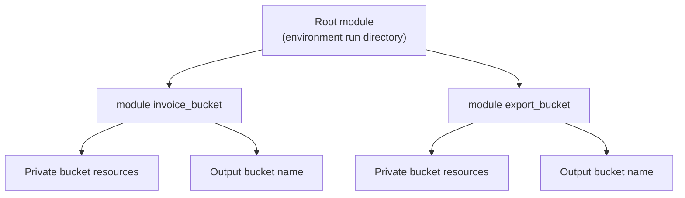

## Table of Contents

1. [The Copy-Paste Problem Modules Solve](#the-copy-paste-problem-modules-solve)
2. [Root Modules and Child Modules](#root-modules-and-child-modules)
3. [A Small devpolaris-orders Module](#a-small-devpolaris-orders-module)
4. [Inputs Are the Module Contract](#inputs-are-the-module-contract)
5. [Outputs Connect Modules Without Guessing](#outputs-connect-modules-without-guessing)
6. [Calling the Same Module More Than Once](#calling-the-same-module-more-than-once)
7. [When a Module Is Too Thin](#when-a-module-is-too-thin)
8. [Module Sources and Versions](#module-sources-and-versions)
9. [Module Refactors and Plan Surprises](#module-refactors-and-plan-surprises)
10. [A Review Checklist for Reuse](#a-review-checklist-for-reuse)

## The Copy-Paste Problem Modules Solve

Infrastructure code often starts small enough to fit in one file. The `devpolaris-orders` team creates a private S3 bucket for invoices, adds tags, blocks public access, and exports the bucket name for the API deployment. A week later the same team needs a bucket for order exports. Another service needs the same pattern for reports. Soon three directories contain almost the same Terraform blocks, with one name changed in each copy.

A module is a directory of Terraform or OpenTofu configuration files that are managed together. The directory where you run `terraform plan` or `tofu plan` is the root module. A module called from another module is a child module. The practical reason modules exist is reuse: they let a team package a repeated infrastructure pattern once, then call it with different values.

Reuse is useful only when it keeps the decision visible. A good module for `devpolaris-orders` might say, "create a private application bucket with public access blocked, versioning optional, and standard tags." That raises the conversation above individual S3 resource blocks. The caller still chooses the bucket name, environment, service tag, and whether versioning is needed.

Think of a module like a small function in application code. It has inputs, it creates or reads things, and it returns outputs. The difference is that a module manages real infrastructure, so changing the function body can change real buckets, roles, networks, or databases. That is why module design needs review, not only clever naming.

The running example in this article stays with `devpolaris-orders`. The team will turn one repeated storage pattern into a local child module, call it from a root module, read the plan, and inspect the failure mode that appears when existing resources move into a module without an address migration.



The diagram shows the main shape. The root module owns the run. Child modules package repeated resource groups. Outputs return useful facts back to the caller so other parts of the configuration do not need to guess names or rebuild strings.

## Root Modules and Child Modules

Terraform reads all top-level `.tf` files in one directory as one module. OpenTofu reads `.tf` and `.tofu` files in the same broad way. Nested directories are not included automatically. If you place files under `modules/private-bucket`, Terraform will ignore that directory until a `module` block calls it.

That detail prevents a lot of confusion. A directory tree may contain many Terraform files, but one run has one root module. The root module is the working directory for the run, the place where backend configuration, provider configuration, variable values, and module calls come together.

For a beginner-safe repository, the `devpolaris-orders` infrastructure might start like this:

```text
infra/
  envs/
    prod/
      main.tf
      providers.tf
      variables.tf
      outputs.tf
  modules/
    private-bucket/
      main.tf
      variables.tf
      outputs.tf
```

If you run Terraform from `infra/envs/prod`, that directory is the root module. The files in `infra/modules/private-bucket` are only source code for a child module. Terraform loads them because `prod/main.tf` points to them with a `module` block.

```hcl
module "invoice_bucket" {
  source = "../../modules/private-bucket"

  bucket_name = "dp-orders-invoices-prod"
  service     = "orders-api"
  environment = "prod"
}
```

The label `invoice_bucket` is local to this root module. It becomes part of the address Terraform uses in plans and state: `module.invoice_bucket.aws_s3_bucket.this`. The source path tells Terraform where to find the child module files. Because the source path changed the module tree, `terraform init` should run before planning.

OpenTofu uses the same idea:

```bash
$ tofu init
$ tofu plan
```

The command name changes, but the reading habit stays the same. Know which directory is the root module, which child modules it calls, and what values cross the boundary.

## A Small devpolaris-orders Module

Start with a concrete resource pattern. The orders API needs private buckets for service-owned files. Every bucket should have a service tag, an environment tag, an owner tag, and public access blocked. Some buckets should also keep old versions because exported files may need recovery after a bad deploy or accidental overwrite.

The module directory can use the same simple filenames you already saw in the workflow article:

```text
modules/private-bucket/
  main.tf
  variables.tf
  outputs.tf
```

These filenames help humans. Terraform treats all top-level files in the module directory as one configuration. A module with one file can work, but the three-file shape makes the contract easier to review: resources in `main.tf`, inputs in `variables.tf`, and returned values in `outputs.tf`.

Here is a small `main.tf` for the child module:

```hcl
resource "aws_s3_bucket" "this" {
  bucket = var.bucket_name

  tags = {
    service     = var.service
    environment = var.environment
    owner       = var.owner
  }
}

resource "aws_s3_bucket_public_access_block" "this" {
  bucket = aws_s3_bucket.this.id

  block_public_acls       = true
  block_public_policy     = true
  ignore_public_acls      = true
  restrict_public_buckets = true
}

resource "aws_s3_bucket_versioning" "this" {
  bucket = aws_s3_bucket.this.id

  versioning_configuration {
    status = var.versioning_enabled ? "Enabled" : "Suspended"
  }
}
```

The local resource name `this` is common inside small modules because the module label already gives the resource its outside meaning. In a plan, the full address becomes `module.invoice_bucket.aws_s3_bucket.this`, which is clear enough. Inside the module, `this` keeps repeated resource names from becoming long.

This module packages a policy choice, not only a resource. Public access blocking is part of the pattern. Standard tags are part of the pattern. Versioning is exposed as a choice because not every bucket needs the storage cost and operational behavior of retained object versions.

A root module call for production can now stay short:

```hcl
module "invoice_bucket" {
  source = "../../modules/private-bucket"

  bucket_name        = "dp-orders-invoices-prod"
  service            = "orders-api"
  environment        = "prod"
  owner              = "platform"
  versioning_enabled = true
}
```

The caller does not need to remember every public access flag. The caller still chooses values that are genuinely different for this instance. That split is the main design goal.

## Inputs Are the Module Contract

Input variables are the parameters of a module. They tell the caller what must be supplied and what can be changed safely. A module with vague inputs is hard to use because every caller has to inspect the internals before trusting it.

The private bucket module can start with a careful `variables.tf`:

```hcl
variable "bucket_name" {
  description = "Globally unique S3 bucket name for this application-owned bucket."
  type        = string
}

variable "service" {
  description = "Service name used in tags, such as orders-api."
  type        = string
}

variable "environment" {
  description = "Deployment environment, such as dev, staging, or prod."
  type        = string

  validation {
    condition     = contains(["dev", "staging", "prod"], var.environment)
    error_message = "environment must be one of dev, staging, or prod."
  }
}

variable "owner" {
  description = "Team or group responsible for this bucket."
  type        = string
  default     = "platform"
}

variable "versioning_enabled" {
  description = "Whether S3 object versioning should be enabled for recovery."
  type        = bool
  default     = false
}
```

Descriptions are not decoration. They are the first line of support for the next engineer who calls the module. Type constraints prevent a caller from passing a list where a string is expected. Defaults reduce repeated boilerplate only when the default is genuinely safe for most callers.

Validation is useful when the module knows a business rule. In this example, the environment tag should be one of three known values. If a caller types `production` instead of `prod`, Terraform can stop before creating a bucket with a tag that breaks cost reports or policy checks.

A bad variable design exposes implementation details instead of decisions. These inputs would make the caller do too much of the module author's job:

```hcl
variable "block_public_acls" {
  type = bool
}

variable "ignore_public_acls" {
  type = bool
}

variable "restrict_public_buckets" {
  type = bool
}
```

Those names mirror provider arguments. The caller has to understand the resource internals to use the module. If the pattern is "private application bucket", the module should enforce the privacy settings and expose the decisions that vary between buckets.

Use this review question for every input: "Does the caller need this choice, or am I leaking the inside of the module?" If the caller should never choose a different value, keep it inside the module. If environments or services really differ, expose the value with a clear name, type, default, and description.

## Outputs Connect Modules Without Guessing

Outputs are the return values of a module. They let the root module or another child module use values created inside the module without rebuilding those values by hand. This matters because many real provider values are not fully known until apply.

The private bucket module should return the values callers commonly need:

```hcl
output "bucket_name" {
  description = "Name of the created S3 bucket."
  value       = aws_s3_bucket.this.bucket
}

output "bucket_arn" {
  description = "ARN of the created S3 bucket for IAM policies."
  value       = aws_s3_bucket.this.arn
}
```

The root module can then connect the bucket to another resource:

```hcl
data "aws_iam_policy_document" "orders_invoice_writes" {
  statement {
    actions = ["s3:PutObject"]

    resources = [
      "${module.invoice_bucket.bucket_arn}/*",
    ]
  }
}
```

That reference is better than rebuilding the ARN from a string. It tells Terraform the dependency clearly, and it keeps the caller aligned with whatever the child module actually created. If the module later changes how it creates the bucket, the output stays the stable handoff point.

The plan shows module outputs through their effects. In this shortened plan, the IAM policy consumes the bucket ARN from the module:

```text
  # aws_iam_policy.orders_invoice_writes will be created
  + resource "aws_iam_policy" "orders_invoice_writes" {
      + name   = "dp-orders-invoice-writes-prod"
      + policy = jsonencode(
            {
              Statement = [
                {
                  Action   = "s3:PutObject"
                  Effect   = "Allow"
                  Resource = "arn:aws:s3:::dp-orders-invoices-prod/*"
                },
              ]
            }
        )
    }

Plan: 4 to add, 0 to change, 0 to destroy.
```

The reviewer should connect this output back to intent. The bucket module creates the bucket. The policy grants writes to objects inside that bucket. If the policy points at `*` or at a different service's bucket, the module did not save the team from a bad permission decision.

Outputs should be small and purposeful. Return values that other modules or operators need. Avoid exporting every internal resource attribute because that turns the module into a thin disguise over provider details.

## Calling the Same Module More Than Once

The same child module can be called multiple times in one root module. Each call gets a different label and different input values. Terraform treats each call as a separate module instance with separate resource addresses.

For `devpolaris-orders`, production may need one bucket for invoices and one bucket for exports:

```hcl
module "invoice_bucket" {
  source = "../../modules/private-bucket"

  bucket_name        = "dp-orders-invoices-prod"
  service            = "orders-api"
  environment        = "prod"
  owner              = "platform"
  versioning_enabled = true
}

module "export_bucket" {
  source = "../../modules/private-bucket"

  bucket_name        = "dp-orders-exports-prod"
  service            = "orders-api"
  environment        = "prod"
  owner              = "data"
  versioning_enabled = false
}
```

The repeated calls are readable because the module contract is small. You can see what differs: the bucket name, owner, and versioning choice. You do not need to scan repeated public access settings.

The plan summary should reflect the number of resources inside both calls:

```text
Terraform will perform the following actions:

  # module.invoice_bucket.aws_s3_bucket.this will be created
  # module.invoice_bucket.aws_s3_bucket_public_access_block.this will be created
  # module.invoice_bucket.aws_s3_bucket_versioning.this will be created
  # module.export_bucket.aws_s3_bucket.this will be created
  # module.export_bucket.aws_s3_bucket_public_access_block.this will be created
  # module.export_bucket.aws_s3_bucket_versioning.this will be created

Plan: 6 to add, 0 to change, 0 to destroy.
```

A reviewer who only expected one bucket should ask why six resources appear. The answer is reasonable here: each bucket pattern creates three provider resources, and there are two module calls. The pull request description should say that clearly so the plan does not surprise anyone.

For larger repeat sets, Terraform and OpenTofu also support `for_each` on module blocks. That lets a caller create similar module instances from a map. Use it when the input data is genuinely a collection and the keys are stable.

```hcl
module "service_buckets" {
  for_each = {
    invoices = {
      bucket_name        = "dp-orders-invoices-prod"
      owner              = "platform"
      versioning_enabled = true
    }
    exports = {
      bucket_name        = "dp-orders-exports-prod"
      owner              = "data"
      versioning_enabled = false
    }
  }

  source = "../../modules/private-bucket"

  bucket_name        = each.value.bucket_name
  service            = "orders-api"
  environment        = "prod"
  owner              = each.value.owner
  versioning_enabled = each.value.versioning_enabled
}
```

The address now includes the key, such as `module.service_buckets["invoices"].aws_s3_bucket.this`. Choose keys that will not change casually. Renaming `invoices` to `invoice_files` looks harmless in code, but Terraform sees a different address unless you add a move record.

## When a Module Is Too Thin

Not every repeated block deserves a module. A module adds an interface, a source path, an initialization step, and a layer of addresses in plans. That cost is worth paying when the module names a real architecture concept. Avoid paying it when the module only renames one resource.

This module is probably too thin:

```hcl
module "orders_bucket" {
  source = "../../modules/s3-bucket"

  bucket = "dp-orders-invoices-prod"
}
```

If the child module only contains one `aws_s3_bucket` resource and exposes every provider argument as a variable, the caller has gained very little. The module hides the resource block but does not encode a policy, a pattern, or a safer default.

A stronger module has a clear purpose:

| Module Shape | Usually Helpful? | Why |
|--------------|------------------|-----|
| `private-application-bucket` | Yes | Packages tags, public access blocking, optional versioning, and outputs. |
| `orders-service` | Yes | Represents the infrastructure needed by one service. |
| `s3-bucket-wrapper` | Often no | Usually repeats the provider resource with extra indirection. |
| `all-infra` | Often no | Hides too many unrelated decisions behind one call. |

The name is a useful test. If you cannot name the module without repeating the main resource type, the abstraction may be weak. A module called `private-application-bucket` says what policy it enforces. A module called `s3-bucket` often says only what provider resource it wraps.

Another warning sign is a long list of booleans. If the caller has to set fifteen switches to make the module safe, the module may not have a strong opinion. A reusable module should reduce repeated decisions while keeping meaningful differences explicit.

## Module Sources and Versions

A module source tells Terraform or OpenTofu where to load the child module code. In early learning and in a single repository, a local relative path is the easiest source to understand:

```hcl
module "invoice_bucket" {
  source = "../../modules/private-bucket"

  bucket_name = "dp-orders-invoices-prod"
  service     = "orders-api"
  environment = "prod"
}
```

Local paths are useful when the root modules and child modules are released together. A pull request can change the module and the callers in one review. That is often the right shape inside one application infrastructure repository.

When several repositories need the same module, teams often move the module into its own Git repository or publish it to a private registry. At that point, versioning becomes part of safety. A production root module should not silently consume whatever code happened to be on a branch today.

```hcl
module "invoice_bucket" {
  source = "git::https://github.com/devpolaris/terraform-aws-private-bucket.git?ref=v0.3.0"

  bucket_name = "dp-orders-invoices-prod"
  service     = "orders-api"
  environment = "prod"
}
```

The `ref` points at a tag in this example. A tag gives reviewers a stable module version to inspect. A branch can move after the plan was reviewed, which makes the apply harder to reason about. Registry modules support a separate `version` argument, while local paths do not because they are loaded directly from the same checkout.

After changing a module source or version, run initialization again:

```bash
$ terraform init
```

A healthy output should mention module installation or upgrade:

```text
Initializing modules...
- invoice_bucket in ../../modules/private-bucket

Initializing provider plugins...

Terraform has been successfully initialized!
```

If initialization downloads a different module than the pull request describes, stop and inspect the source address. Source addresses are part of the supply chain for infrastructure. The wrong module code can create the wrong resources just as surely as the wrong application dependency can run the wrong code.

## Module Refactors and Plan Surprises

The most important module failure mode appears during refactoring. Suppose the first `devpolaris-orders` bucket already exists as a direct resource in the root module:

```hcl
resource "aws_s3_bucket" "orders_invoices" {
  bucket = "dp-orders-invoices-prod"
}
```

Later, the team moves that bucket into `module "invoice_bucket"`. The real bucket name did not change, but the Terraform address changed from `aws_s3_bucket.orders_invoices` to `module.invoice_bucket.aws_s3_bucket.this`. Terraform state tracks addresses, so a plain move in code can look like a destroy and a create.

The plan may show this:

```text
  # aws_s3_bucket.orders_invoices will be destroyed
  - resource "aws_s3_bucket" "orders_invoices" {
      - bucket = "dp-orders-invoices-prod"
    }

  # module.invoice_bucket.aws_s3_bucket.this will be created
  + resource "aws_s3_bucket" "this" {
      + bucket = "dp-orders-invoices-prod"
    }

Plan: 1 to add, 0 to change, 1 to destroy.
```

That is the point where a reviewer earns their keep. The team intended to reorganize code, not delete invoice storage. The plan shows an address migration problem. Applying this blindly may fail because the bucket name already exists, or it may damage a replaceable resource in another context.

For Terraform configurations that support moved blocks, record the address change in configuration:

```hcl
moved {
  from = aws_s3_bucket.orders_invoices
  to   = module.invoice_bucket.aws_s3_bucket.this
}
```

A moved block tells Terraform that the existing object at the old address should now be understood at the new address. The next plan should stop showing a destroy and create for the same object. Older workflows may use state commands for similar migrations, but a checked-in move record is easier for teammates and CI to repeat.

The safer refactor routine is:

```text
1. Move the resource into the child module.
2. Add a moved block from the old address to the new address.
3. Run plan and confirm there is no destroy for the existing object.
4. Review any real setting changes separately from the address move.
```

Keep refactors small. Moving a resource into a module and changing its settings in the same pull request makes review harder. First preserve the object while changing the code shape. Then change behavior in a separate reviewed plan.

## A Review Checklist for Reuse

Module review should ask whether the abstraction helps the next person operate the system. The code may be valid HCL and still be the wrong module boundary.

For the `devpolaris-orders` private bucket module, a good pull request description might say:

```text
Change summary:
- Add reusable private-bucket child module.
- Call it for orders invoice storage in prod.
- Keep public access blocking inside the module.
- Expose bucket name and ARN as outputs.

Expected plan:
- Create bucket, public access block, and versioning resources.
- No existing resources destroyed.

Verification:
- terraform init
- terraform fmt
- terraform validate
- terraform plan
```

That summary gives the reviewer a path through the plan. They can check the module contract, the resource count, the output references, and the absence of unexpected destroys.

Use this checklist when reviewing a new module:

| Question | What Good Looks Like |
|----------|----------------------|
| What concept does the module name? | A real architecture pattern, not only a provider resource. |
| Which decisions stay with the caller? | Environment, names, sizes, ownership, and recovery choices that differ. |
| Which decisions stay inside the module? | Defaults and controls every caller should inherit. |
| Are inputs typed and described? | Variables have clear types, descriptions, defaults, and validation where useful. |
| Are outputs purposeful? | Callers receive only values they need to connect or verify. |
| Does the plan match the refactor story? | No surprise destroy or replacement caused only by address changes. |

The final check is operational. If production fails after the module change, can the team read the plan, identify which module instance changed, and verify the real resource? If the answer is yes, the module is helping. If the answer is no, the module may be hiding the system instead of making reuse safer.

---

**References**

- [Terraform modules overview](https://developer.hashicorp.com/terraform/language/modules) - Defines root modules, child modules, module sources, and the basic module workflow.
- [Terraform creating modules](https://developer.hashicorp.com/terraform/language/modules/develop) - Explains module structure, inputs, outputs, resources, and when a module should be written.
- [Terraform standard module structure](https://developer.hashicorp.com/terraform/language/modules/develop/structure) - Documents the recommended file layout for reusable modules.
- [Terraform module block reference](https://developer.hashicorp.com/terraform/language/block/module) - Describes `source`, `version`, `for_each`, `providers`, and other module block arguments.
- [Terraform moved block reference](https://developer.hashicorp.com/terraform/language/block/moved) - Shows how to record resource address moves during refactors.
- [OpenTofu modules](https://opentofu.org/docs/language/modules/) - Provides the OpenTofu terminology for root modules, child modules, published modules, and module calls.
