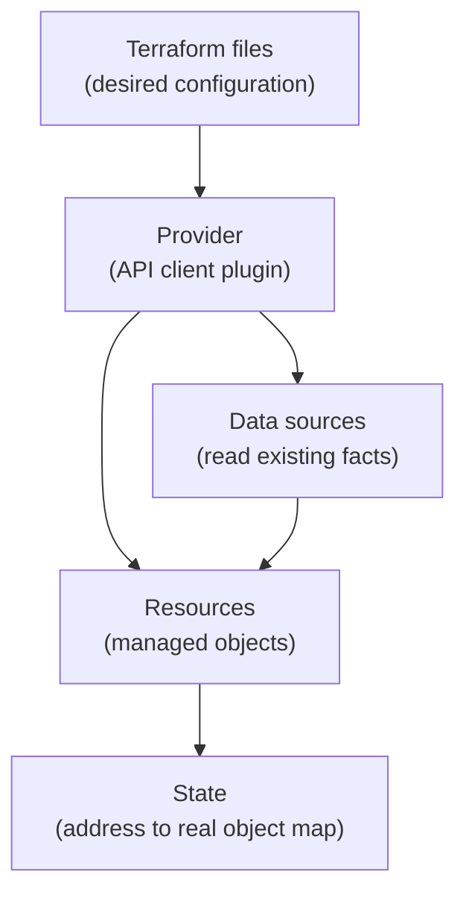
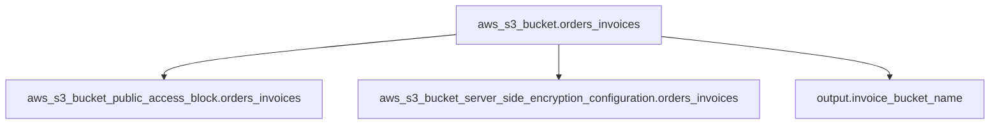

## Table of Contents

1. [The Three Jobs in a Terraform Directory](#the-three-jobs-in-a-terraform-directory)
2. [Providers Are the API Bridge](#providers-are-the-api-bridge)
3. [Provider Requirements and Provider Configuration](#provider-requirements-and-provider-configuration)
4. [Resources Are the Objects Terraform Owns](#resources-are-the-objects-terraform-owns)
5. [References Create the Dependency Graph](#references-create-the-dependency-graph)
6. [Data Sources Read Existing Information](#data-sources-read-existing-information)
7. [Resource or Data Source?](#resource-or-data-source)
8. [Reading a Plan That Uses All Three](#reading-a-plan-that-uses-all-three)
9. [Common First Failures](#common-first-failures)
10. [A Review Checklist for the Three Nouns](#a-review-checklist-for-the-three-nouns)

## The Three Jobs in a Terraform Directory

Every Terraform directory has to answer three practical questions before it can change anything. Which API should Terraform talk to? Which objects should Terraform create, update, or delete? Which existing objects does Terraform need to look up so it can connect the new work to the old system? Terraform gives these jobs three names: providers, resources, and data sources.

A provider is the plugin that knows how to talk to a platform API. The AWS provider knows how to call AWS APIs. The GitHub provider knows how to call GitHub APIs. The Kubernetes provider knows how to call the Kubernetes API server. Terraform itself does not contain the full AWS, Azure, GCP, GitHub, or Kubernetes API surface. It loads providers for that work.

A resource is an object Terraform manages. If a configuration contains an `aws_s3_bucket` resource, Terraform treats that bucket as part of its managed world. It plans changes for the bucket, stores its identity in state, and may update or destroy it later if the configuration says so. State is the file or backend record Terraform uses to remember which real object belongs to which resource address.

A data source is an object Terraform reads. Data sources are useful when something already exists and Terraform needs facts about it, but this configuration should not own its lifecycle. For example, the `devpolaris-orders` service may create its own invoice bucket, but read the current AWS account ID and region from the provider so names and tags are not hardcoded.

The three pieces fit together like this:



The diagram is small because the idea should stay small at first. A provider gives Terraform vocabulary and API access. A resource says "own this object." A data source says "read this object or fact." Most beginner Terraform confusion comes from mixing those jobs together.

OpenTofu uses the same broad language model. The command changes from `terraform` to `tofu`, but a provider still supplies resource types and data sources, a resource still describes something managed, and a data source still reads information for use elsewhere in the configuration.

## Providers Are the API Bridge

Before Terraform can create an S3 bucket, it needs the AWS provider. Before it can create a GitHub repository, it needs the GitHub provider. This design keeps Terraform smaller and lets each platform evolve its own provider without waiting for Terraform itself to release a new version for every cloud API change.

For `devpolaris-orders`, the team wants to manage AWS infrastructure for a small orders API. A first Terraform root module might contain a `versions.tf` file like this:

```hcl
terraform {
  required_providers {
    aws = {
      source = "hashicorp/aws"
    }
  }
}
```

The local name `aws` is how the rest of this Terraform directory refers to the provider. The `source` says where the provider comes from. In this example, `hashicorp/aws` points to the AWS provider in the Terraform Registry. A team should also choose a provider version constraint that matches the versions it has tested, then update that constraint deliberately through review.

The provider gives Terraform new block types. Without the AWS provider, `aws_s3_bucket` is just an unknown word in a file. With the provider installed, Terraform knows that `aws_s3_bucket` is a resource type, what arguments it accepts, and which API calls can create, read, update, or delete the real bucket.

That is why `terraform init` matters. Initialization reads the provider requirements, downloads the provider package, and writes provider selections into the dependency lock file. If someone adds a new provider requirement and you skip `init`, later commands may fail because the working directory does not have the plugin yet.

The same pattern exists in OpenTofu:

```bash
$ tofu init
```

The provider idea is not tied to one cloud. Terraform and OpenTofu both rely on external providers for most infrastructure types. Once you understand that, new platforms feel less mysterious. You are mostly learning a provider's resource types, data sources, authentication path, and API behavior.

## Provider Requirements and Provider Configuration

Provider requirements and provider configuration are related, but they are not the same thing. The requirement tells Terraform which provider package the directory needs. The provider block tells the provider how to operate for this run.

For AWS, the provider usually needs a region. The region is the physical cloud area where regional resources live, such as `eu-west-2` for London. Credentials are normally supplied outside the Terraform file through environment variables, local profiles, workload identity, or a CI identity. Do not paste long-lived access keys into Terraform files.

```hcl
provider "aws" {
  region = "eu-west-2"

  default_tags {
    tags = {
      project    = "devpolaris-orders"
      managed_by = "terraform"
    }
  }
}
```

This block configures the default AWS provider instance. The `region` setting tells the provider where to send regional API calls. The `default_tags` block asks the provider to add common tags to supported resources so cost reports and inventory views can group the objects later.

Some provider settings affect every resource that uses that provider instance. That is convenient, but it means a provider change can have a wider effect than a single resource block. If a pull request changes the provider region from `eu-west-2` to `eu-west-1`, read the plan carefully. The change may cause Terraform to look for resources in a different place.

Provider blocks can also use aliases. An alias is a second named configuration for the same provider. You use this when one root module must talk to two regions, two accounts, or two API endpoints in the same run.

```hcl
provider "aws" {
  region = "eu-west-2"
}

provider "aws" {
  alias  = "global"
  region = "us-east-1"
}
```

The first block is the default AWS provider. The second block is an aliased provider instance named `aws.global`. A resource can opt into that second provider with a `provider` meta-argument. This is useful, but it is also easy to overuse. A beginner-friendly rule is to start with one provider configuration per root module unless the infrastructure really has to cross a boundary in one plan.

The important review habit is to separate two questions. Did the directory require the provider package it needs? Did the provider block point that package at the right account, region, endpoint, and authentication path? A correct resource block can still create the wrong object if the provider is pointed at the wrong target.

## Resources Are the Objects Terraform Owns

A resource block tells Terraform to manage a real object through a provider. The block has a type, a local name, and a body of arguments.

```hcl
resource "aws_s3_bucket" "orders_invoices" {
  bucket = "dp-orders-invoices-prod"

  tags = {
    service     = "devpolaris-orders"
    environment = "prod"
    owner       = "platform"
  }
}
```

Read the first line slowly. `resource` means Terraform owns the lifecycle. `aws_s3_bucket` is the provider resource type. `orders_invoices` is the local name inside this root module. Together they form the resource address `aws_s3_bucket.orders_invoices`, which Terraform uses in plans, state, logs, imports, and commands.

The address matters more than beginners expect. If you rename only the local name from `orders_invoices` to `invoice_archive`, Terraform does not automatically know you meant the same bucket. From Terraform's point of view, the address changed. Unless you move state deliberately, the plan may show one resource destroyed and another created.

The body contains arguments for that resource type. In this example, `bucket` sets the real S3 bucket name, and `tags` sets metadata. Other resource types have different arguments because each provider type maps to a different API object. The provider documentation is where you check which arguments are required, which are optional, and which changes force replacement.

One resource often works with other resources. An S3 bucket should usually have public access settings, encryption, lifecycle rules, or policies. Terraform models those as separate resources because the provider API exposes them as separate managed objects.

```hcl
resource "aws_s3_bucket_public_access_block" "orders_invoices" {
  bucket = aws_s3_bucket.orders_invoices.id

  block_public_acls       = true
  block_public_policy     = true
  ignore_public_acls      = true
  restrict_public_buckets = true
}
```

The first line again gives the type and local name. The `bucket` argument is more interesting. It does not repeat the bucket name as a string. It references `aws_s3_bucket.orders_invoices.id`, which means "use the ID from the bucket resource managed in this same configuration."

That reference is safer than copying the string. If the bucket name changes in one place, the public access block follows the bucket resource. Terraform also learns from the reference that the bucket must exist before the public access block can be configured.

Resources are not only files with settings. They are ownership statements. When you add a resource, you are telling Terraform and your teammates that this root module is now responsible for that real object. That responsibility includes future updates, replacement risk, state storage, review, and eventual cleanup.

## References Create the Dependency Graph

Terraform builds a dependency graph from references between blocks. A dependency graph is a map of what must be read or created before something else can be planned or applied. You do not usually write the graph by hand. You create it by referencing one value from another block.

In the public access block, this expression creates a dependency:

```hcl
bucket = aws_s3_bucket.orders_invoices.id
```

Terraform sees that `aws_s3_bucket_public_access_block.orders_invoices` needs a value from `aws_s3_bucket.orders_invoices`. During apply, it creates the bucket first. During destroy, it removes dependent settings before removing the bucket. That ordering is one reason references are better than repeated strings.

Here is the small graph for the bucket and its public access block:



The graph shows the bucket as the object other blocks depend on. Outputs can depend on resources too, because an output may print an attribute such as a bucket name or ARN after apply.

Sometimes a block has an operational dependency that is not visible through an attribute reference. Terraform supports `depends_on` for those cases, but use it carefully. If a resource can reference the exact value it needs, prefer the reference. `depends_on` is useful when the order matters but there is no specific value to pass.

For beginners, the best habit is direct: do not copy values by hand when Terraform can reference them. A reference documents the relationship, prevents spelling drift, and helps Terraform choose a safe order.

The graph also explains why plans can show values as unknown. If a provider cannot know a resource ID until after creation, any dependent value may show as `(known after apply)`. That is normal when the value truly comes from the provider after creation. It is worth checking that the unknown value is not hiding a name or setting the team expected to choose directly.

## Data Sources Read Existing Information

A data source reads information for use in the configuration. It does not declare ownership of the object it reads. That distinction protects you from accidentally treating shared infrastructure as something this root module can delete.

For `devpolaris-orders`, the team wants resource names and tags to include the current AWS account ID and region. Those facts already exist. Terraform should read them, not manage them.

```hcl
data "aws_caller_identity" "current" {}

data "aws_region" "current" {}
```

The `data` keyword says this is a data source. The type `aws_caller_identity` comes from the AWS provider. The local name `current` gives the data source an address: `data.aws_caller_identity.current`. The empty body means the provider can answer the request from the current credentials without extra arguments.

Now a resource can use those read values:

```hcl
resource "aws_s3_bucket" "orders_invoices" {
  bucket = "dp-orders-${data.aws_caller_identity.current.account_id}-invoices"

  tags = {
    service     = "devpolaris-orders"
    environment = "prod"
    account_id  = data.aws_caller_identity.current.account_id
    region      = data.aws_region.current.name
  }
}
```

This example still creates one bucket, but it avoids hardcoding the account ID and region in multiple places. The account ID comes from the identity Terraform is already using. The region comes from the provider configuration. If a teammate runs a plan in the wrong account, the generated name and tags can make that mistake visible before apply.

Data sources can also look up existing shared infrastructure. Imagine the platform team owns a shared log bucket, and `devpolaris-orders` should write application logs there. The orders service should not create or destroy that shared bucket. It only needs to read the bucket's identity.

```hcl
data "aws_s3_bucket" "shared_logs" {
  bucket = "dp-platform-shared-logs-prod"
}
```

The rest of the configuration can reference `data.aws_s3_bucket.shared_logs.arn` or other attributes exposed by that data source. If the bucket does not exist, the plan should fail instead of quietly creating a new shared bucket in the wrong place.

That behavior is useful. A missing data source is often a configuration or environment problem. A missing resource is often an instruction to create something. Those are different meanings, and Terraform keeps them separate in the language.

## Resource or Data Source?

The choice between a resource and a data source is an ownership decision. Ask who should control the lifecycle of the object.

If the `devpolaris-orders` team is responsible for the invoice bucket and the bucket should be created, updated, and eventually deleted with this service, use a resource. The Terraform state should remember the real bucket ID. Pull requests in this root module should review changes to that bucket.

If the platform team owns a shared networking component, shared logging bucket, DNS zone, or organization policy, use a data source from the service root module. The service configuration can read the information it needs, but it should not claim ownership of the shared object.

| Situation | Use | Reason |
|-----------|-----|--------|
| Create the orders invoice bucket | Resource | The service owns the bucket lifecycle. |
| Read the current AWS account ID | Data source | The account already exists and is selected by credentials. |
| Attach public access settings to the invoice bucket | Resource | The service owns the setting for its bucket. |
| Read a shared platform log bucket | Data source | Another module or team owns the bucket. |
| Create an IAM role for the orders API | Resource | The service owns the role if it is service-specific. |
| Read an existing VPC created by the platform team | Data source | The service consumes the network but does not own it. |

The most expensive mistake is usually using a resource when you only meant to read. If Terraform manages an object, future plans may update or destroy it. That is correct for objects the root module owns. It is dangerous for shared objects that happen to be convenient to describe in the same file.

The opposite mistake is using a data source when you actually need ownership. If the invoice bucket must be created as part of the service environment, a data source only checks whether it already exists. It will not create the bucket. The plan fails until someone creates it elsewhere, which spreads the service setup across too many places.

The language can express either choice. The engineering judgment is deciding which root module should own which lifecycle.

## Reading a Plan That Uses All Three

When providers, resources, and data sources all appear in one configuration, the plan output tells you which job each block is doing. You do not need to understand every provider attribute on the first read. Start by noticing which data sources Terraform reads, then check the managed resource actions.

```text
data.aws_caller_identity.current: Reading...
data.aws_region.current: Reading...
data.aws_region.current: Read complete after 0s [id=eu-west-2]
data.aws_caller_identity.current: Read complete after 0s [id=123456789012]

Terraform will perform the following actions:

  # aws_s3_bucket.orders_invoices will be created
  + resource "aws_s3_bucket" "orders_invoices" {
      + bucket = "dp-orders-123456789012-invoices"
      + tags   = {
          + "account_id"   = "123456789012"
          + "environment" = "prod"
          + "region"      = "eu-west-2"
          + "service"     = "devpolaris-orders"
        }
    }

  # aws_s3_bucket_public_access_block.orders_invoices will be created
  + resource "aws_s3_bucket_public_access_block" "orders_invoices" {
      + block_public_acls       = true
      + block_public_policy     = true
      + ignore_public_acls      = true
      + restrict_public_buckets = true
    }

Plan: 2 to add, 0 to change, 0 to destroy.
```

The data source lines show Terraform reading facts before it finishes the plan. The resource lines say Terraform will create managed objects. The summary line says two managed objects will be added and nothing will be changed or destroyed. That matches a pull request whose intent is "create the orders invoice bucket and block public access."

If a data source depends on a value that will not exist until apply, Terraform may defer that read and show some values as `(known after apply)`. That timing is normal when the dependency is real. It deserves attention when the team expected the value, such as a name, region, or tag, to be visible before approval.

A plan with a shared bucket data source should look different:

```text
data.aws_s3_bucket.shared_logs: Reading...
data.aws_s3_bucket.shared_logs: Read complete after 0s [id=dp-platform-shared-logs-prod]

No changes. Your infrastructure matches the configuration.
```

There are no managed resource changes in the summary. That is what you want when a pull request only connects to existing platform infrastructure. The data source still matters because the configuration can use the shared bucket ARN, but this root module is not claiming ownership of the bucket.

If the same pull request unexpectedly shows a resource destroy, stop and inspect the address. The change may be caused by a renamed resource, a provider region change, a removed block, or state pointing at a different object than the author expected. The plan is the place to catch that before apply.

## Common First Failures

Provider failures usually appear during `init`, `plan`, or `apply`, depending on what Terraform needs at that moment. If the provider source is wrong or the registry cannot be reached, initialization may fail:

```text
Error: Failed to query available provider packages

Could not retrieve the list of available versions for provider hashicorp/awss.
```

The useful clue is the provider name. In this example, `hashicorp/awss` has an extra `s`. Fix the provider requirement and run `terraform init` again. Do not change resource blocks to work around a provider package that was never installed.

Authentication failures often appear when Terraform first needs the provider to call the real API:

```text
Error: No valid credential sources found
```

For AWS, check the local profile, environment variables, role assumption, or CI identity configured for the run. The fix belongs in the credential path, not in a hardcoded access key inside `provider "aws"`. Terraform files should describe infrastructure, not store long-lived secrets.

Resource ownership failures often appear when a resource already exists outside Terraform:

```text
Error: creating S3 Bucket (dp-orders-invoices-prod): BucketAlreadyOwnedByYou
```

That error is not only a naming problem. It asks an ownership question. Should this root module import the existing bucket into state, choose a different name, or read an externally owned bucket through a data source? Retrying the same apply will not answer that question.

Data source failures usually mean Terraform could not find something it was told to read:

```text
Error: reading S3 Bucket (dp-platform-shared-logs-prod): couldn't find resource
```

Check the account, region, name, and provider alias. If the bucket should exist, the run may be pointed at the wrong environment. If the bucket does not exist yet and this service should create it, the block should probably be a resource instead of a data source.

Reference failures happen before Terraform can build a correct graph:

```text
Error: Reference to undeclared resource

  on main.tf line 18, in resource "aws_s3_bucket_public_access_block" "orders_invoices":
  18:   bucket = aws_s3_bucket.order_invoices.id

A managed resource "aws_s3_bucket" "order_invoices" has not been declared.
```

Read these errors literally. Terraform is telling you the address does not exist in the configuration. In this case, the resource is named `orders_invoices`, but the reference says `order_invoices`. Fix the address instead of copying the bucket name string by hand.

## A Review Checklist for the Three Nouns

Terraform review gets easier when each block has a clear job. Before approving a pull request, scan the configuration and plan with these questions in mind.

| Check | Question |
|-------|----------|
| Provider requirement | Does the directory require the provider package it actually uses? |
| Provider configuration | Is the provider pointed at the right account, region, endpoint, and credential path? |
| Resource ownership | Should this root module own each resource it declares? |
| Data source ownership | Is each data source reading something that already exists outside this root module? |
| References | Do resources reference each other instead of copying names by hand? |
| Plan summary | Do add, change, and destroy counts match the pull request intent? |
| Unknown values | Are unknown values expected provider-computed fields rather than hidden surprises? |

For `devpolaris-orders`, a healthy first review might say: the AWS provider is configured for `eu-west-2`, the invoice bucket and its public access block are resources because the service owns them, the account and region are data sources because they already exist, and the plan shows only the two expected creates.

That review is small enough for a beginner to practice, but it contains the habit that scales. Terraform is not only asking "is the HCL valid?" It is asking "who owns this object, which API will change it, and what evidence does the plan show before we apply?"

---

**References**

- [Terraform Providers](https://developer.hashicorp.com/terraform/language/providers) - Explains how providers add resource types and data sources and how Terraform installs provider plugins.
- [Terraform Resources](https://developer.hashicorp.com/terraform/language/resources) - Documents how resource blocks declare infrastructure objects that Terraform manages.
- [Terraform Data Sources](https://developer.hashicorp.com/terraform/language/data-sources) - Describes data blocks for reading information from providers without managing the object lifecycle.
- [OpenTofu Providers](https://opentofu.org/docs/language/providers/) - Shows the equivalent provider model in OpenTofu.
- [OpenTofu Resources](https://opentofu.org/docs/language/resources/) - Documents OpenTofu resource blocks and their role in managing infrastructure objects.
- [OpenTofu Data Sources](https://opentofu.org/docs/language/data-sources/) - Explains how OpenTofu data sources read external information for use in configuration.
