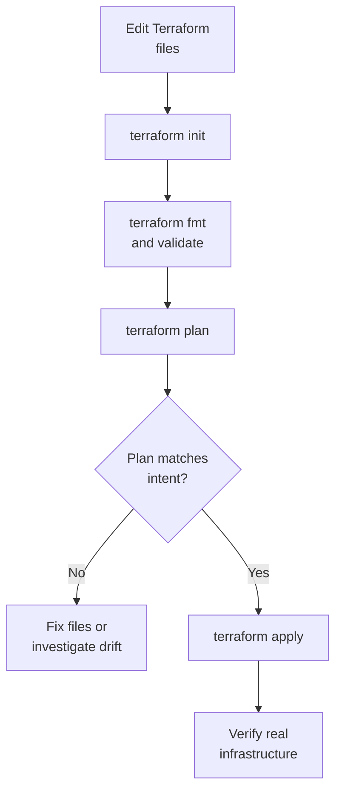
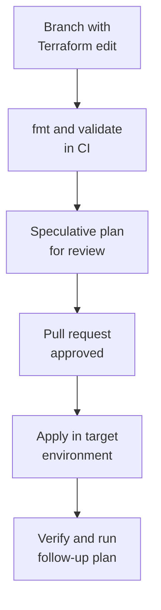

## Table of Contents

1. [What Terraform Does in the IaC Loop](#what-terraform-does-in-the-iac-loop)
2. [The Smallest Useful Working Directory](#the-smallest-useful-working-directory)
3. [init: Preparing the Directory](#init-preparing-the-directory)
4. [fmt and validate: Mechanical Checks](#fmt-and-validate-mechanical-checks)
5. [plan: Reading the Proposed Change](#plan-reading-the-proposed-change)
6. [apply: Changing Real Infrastructure](#apply-changing-real-infrastructure)
7. [The Files Terraform Leaves Behind](#the-files-terraform-leaves-behind)
8. [A First Pull Request Workflow](#a-first-pull-request-workflow)
9. [Common First Workflow Failures](#common-first-workflow-failures)
10. [The Loop You Should Practice](#the-loop-you-should-practice)

## What Terraform Does in the IaC Loop

The first time you create infrastructure by hand, the work feels direct. You open the cloud console, choose a region, create a bucket, attach a policy, and check whether the application can use it. The problem arrives later, when the same choices need to be reviewed, repeated in staging, rebuilt after a mistake, or explained to someone who was not there for the first setup.

Terraform is an Infrastructure as Code tool for provisioning resources. Provisioning means creating and changing infrastructure resources such as networks, storage buckets, virtual machines, databases, load balancers, DNS records, and IAM permissions. Terraform reads configuration files, compares them with the infrastructure it manages, shows a plan, and then applies the approved changes through provider APIs. A provider is the plugin that knows how to talk to a platform such as AWS, Azure, GCP, GitHub, Cloudflare, or Kubernetes.

OpenTofu uses the same broad workflow and a very similar configuration language. In this module, the examples use Terraform commands because Terraform is still the name most teams recognize first. When the workflow is the same, you can mentally translate `terraform init`, `terraform plan`, and `terraform apply` to `tofu init`, `tofu plan`, and `tofu apply`.

Terraform fits after the IaC Fundamentals articles because it makes those ideas concrete. Desired state becomes `.tf` files. Idempotency becomes a second run with no changes. Safe change review becomes a plan. Drift becomes a plan that shows reality no longer matches the files. The workflow is not only a command sequence; it is the operating habit that keeps infrastructure changes visible before they touch production.

We will use a small `devpolaris-orders` service as the running example. The team wants a private invoice bucket in AWS so the API can store generated invoice PDFs. Later articles will teach providers, resources, variables, data sources, state, modules, imports, and CI in more depth. The first workflow stays small: one directory, one resource, one plan, one apply, and one verification path.



The loop is intentionally plain. A beginner should not start by memorizing every flag. First learn the shape of the work: edit files, prepare the directory, check the files, preview the change, apply only after review, then verify what really happened.

## The Smallest Useful Working Directory

Terraform works inside a root module. A root module is the directory where you run Terraform and where Terraform reads the configuration for that run. The word "module" will matter more later. For now, read it as "the folder that contains the Terraform files for one infrastructure target."

A tiny starting directory for `devpolaris-orders` might look like this:

```text
infra/
  main.tf
  versions.tf
  variables.tf
  outputs.tf
```

Terraform reads all `.tf` files in the directory together. The filenames help humans, not Terraform. You could put everything in `main.tf`, but splitting files by purpose makes reviews easier as the directory grows. `versions.tf` usually declares Terraform and provider requirements. `main.tf` holds the first resources. `variables.tf` declares inputs. `outputs.tf` declares values the team wants Terraform to print after apply.

Here is a small `versions.tf`:

```hcl
terraform {
  required_providers {
    aws = {
      source = "hashicorp/aws"
    }
  }
}

provider "aws" {
  region = "eu-west-2"
}
```

This file says the configuration needs the AWS provider from the Terraform Registry and that the provider should operate in `eu-west-2`. In a production repository, your team should also choose an explicit provider version constraint and update it deliberately. The constraint keeps provider upgrades intentional instead of letting every machine silently choose a different provider release.

Here is the first `main.tf`:

```hcl
resource "aws_s3_bucket" "orders_invoices" {
  bucket = "dp-orders-invoices-prod"

  tags = {
    service     = "orders-api"
    environment = "prod"
    owner       = "platform"
  }
}
```

Read the resource block from left to right. `resource` means Terraform should manage a real object. `aws_s3_bucket` is the resource type, which comes from the AWS provider. `orders_invoices` is the local name inside this Terraform directory. Together, `aws_s3_bucket.orders_invoices` becomes the resource address, the stable name Terraform uses in plans and state.

The block body describes arguments for that resource. The `bucket` argument sets the real S3 bucket name. The `tags` argument attaches metadata so humans and automation can see which service, environment, and owner the resource belongs to. Later articles will explain resource types and arguments more carefully. For this workflow article, the important point is that the intended infrastructure is now visible in a file.

One warning belongs here: this exact bucket name must be globally unique in AWS S3. If someone else already owns `dp-orders-invoices-prod`, the apply will fail. In a real team, you would usually include an organization prefix, account hint, or naming convention that prevents collisions. We keep the example readable so the workflow stays in focus.

## init: Preparing the Directory

After writing or cloning Terraform configuration, the first command is `terraform init`. Initialization prepares the working directory so Terraform can run the rest of the workflow.

```bash
$ terraform init
```

The command looks at the configuration and downloads the provider plugins it needs. In our example, it downloads the AWS provider. If the directory uses a remote backend for state, `init` also prepares that backend connection. If the configuration references child modules, `init` downloads those too.

A shortened output might look like this:

```text
Initializing the backend...

Initializing provider plugins...
- Finding hashicorp/aws versions matching the configured constraint...
- Installing hashicorp/aws...
- Installed hashicorp/aws

Terraform has been successfully initialized!
```

Do not memorize the exact wording. The useful reading habit is to notice what Terraform prepared. Did it initialize the expected backend? Did it install the provider you expected? Did it create or update the lock file? If the output mentions a backend migration or provider upgrade you did not intend, stop and understand that before continuing.

`terraform init` is safe to run more than once. Re-running it can pick up newly added providers or modules. It should not delete your configuration or managed infrastructure. That makes it a good first response when Terraform says the directory is not initialized or a provider is missing.

Initialization creates a local `.terraform/` directory. That directory is working data, not source code. It can contain downloaded providers, module copies, and backend connection details. Do not commit `.terraform/` to Git. The team should commit the configuration files and the dependency lock file, not the local working directory Terraform builds for your machine.

OpenTofu uses the same shape:

```bash
$ tofu init
```

The command names differ, but the operational meaning is the same. Prepare the directory before planning or applying.

## fmt and validate: Mechanical Checks

Before asking a teammate to review a plan, clean up mechanical mistakes. Terraform gives you two basic commands for this: `fmt` and `validate`.

```bash
$ terraform fmt
$ terraform validate
```

`terraform fmt` rewrites Terraform files into the standard style. It handles indentation, alignment, and spacing. Formatting is about readable diffs rather than personal taste. Consistent formatting keeps pull request diffs focused on infrastructure decisions instead of whitespace.

For example, a cramped block like this:

```hcl
resource "aws_s3_bucket" "orders_invoices" {
bucket="dp-orders-invoices-prod"
tags={service="orders-api",environment="prod",owner="platform"}
}
```

becomes easier to scan after formatting:

```hcl
resource "aws_s3_bucket" "orders_invoices" {
  bucket = "dp-orders-invoices-prod"

  tags = {
    service     = "orders-api"
    environment = "prod"
    owner       = "platform"
  }
}
```

`terraform validate` checks whether the configuration is syntactically valid and internally consistent enough for Terraform to understand it. It can catch mistakes such as a missing quote, an invalid block shape, or a reference to a value that does not exist. It does not prove the cloud account will accept the change. It is a parser and configuration check, not a full deployment test.

A healthy validation result is short:

```text
Success! The configuration is valid.
```

An unhealthy result usually points at the file and line Terraform could not understand:

```text
Error: Missing newline after argument

  on main.tf line 2, in resource "aws_s3_bucket" "orders_invoices":
   2:   bucket = "dp-orders-invoices-prod" tags = {

An argument definition must end with a newline.
```

That error is mechanical. Fix it before plan review. A reviewer should spend attention on whether the bucket should exist and whether its access is safe, not on syntax that the tool can catch first.

OpenTofu again has the same routine:

```bash
$ tofu fmt
$ tofu validate
```

For a small local workflow, running these commands manually is enough. For a team workflow, CI should run them automatically on pull requests so broken formatting and invalid configuration never reach human review.

## plan: Reading the Proposed Change

`terraform plan` is the command that makes Terraform useful for team review. It compares the desired state in the files with the state and the real remote objects Terraform manages, then prints the actions it proposes.

```bash
$ terraform plan
```

For the first `devpolaris-orders` bucket, a simplified plan might look like this:

```text
Terraform will perform the following actions:

  # aws_s3_bucket.orders_invoices will be created
  + resource "aws_s3_bucket" "orders_invoices" {
      + bucket = "dp-orders-invoices-prod"
      + tags   = {
          + "environment" = "prod"
          + "owner"       = "platform"
          + "service"     = "orders-api"
        }
    }

Plan: 1 to add, 0 to change, 0 to destroy.
```

This plan matches the story. The pull request says "add invoice bucket." The plan says one bucket will be created. There are no changes and no destroys. A reviewer still needs to ask whether the bucket settings are complete enough, but the plan does not reveal a surprise outside the intended change.

Terraform uses action symbols throughout plans:

| Symbol | Meaning | Review Question |
|--------|---------|-----------------|
| `+` | Create | Is this new resource expected? |
| `~` | Update in place | Is this setting change safe for the environment? |
| `-` | Destroy | Is deletion expected and recoverable? |
| `-/+` or `+/-` | Replace | What downtime, data loss, or name change can happen? |
| `<=` | Read data | Is this reading an existing object rather than owning it? |

The summary line is your first guardrail:

```text
Plan: 1 to add, 0 to change, 0 to destroy.
```

If that line does not match the pull request description, stop. The mismatch may be harmless, but it needs an explanation. A plan that says `1 to destroy` is not automatically bad. It is automatically worth attention.

Some values in a plan are shown as "known after apply." That means Terraform cannot know the value until the provider creates or reads the real object. For example, the provider may assign an ARN, ID, hosted zone ID, or generated domain name after creation.

```text
+ arn = (known after apply)
```

That is normal for computed provider values. Still read the rest of the plan carefully. Review the values Terraform does know: names, regions, tags, access settings, lifecycle settings, and resource counts.

You may also see sensitive values hidden in output:

```text
+ secret_string = (sensitive value)
```

Hiding a value in the plan is helpful, but it does not automatically mean the value is stored safely. Terraform state can still contain sensitive data depending on the resource and provider. The State, Backends, and Locking article will cover that in detail. For this workflow, the practical rule is simple: do not put secrets directly into Terraform files, and do not treat plan redaction as your whole secrets strategy.

OpenTofu's `tofu plan` has the same job: preview the proposed changes and give the team evidence before apply.

## apply: Changing Real Infrastructure

`terraform apply` is the command that changes real infrastructure. This is the point where the workflow moves from proposal to action.

```bash
$ terraform apply
```

When you run `terraform apply` without a saved plan file, Terraform creates a plan and asks you to approve it. The prompt is deliberately explicit:

```text
Plan: 1 to add, 0 to change, 0 to destroy.

Do you want to perform these actions?
  Terraform will perform the actions described above.
  Only 'yes' will be accepted to approve.

  Enter a value:
```

For a personal learning environment, typing `yes` may be fine. For a team environment, the approval should follow review. The person applying should know which pull request produced the change, which environment is targeted, and which plan was reviewed.

After approval, the output shows progress:

```text
aws_s3_bucket.orders_invoices: Creating...
aws_s3_bucket.orders_invoices: Creation complete after 3s

Apply complete! Resources: 1 added, 0 changed, 0 destroyed.
```

That message means Terraform finished the provider operation it attempted. It does not prove the application is working. For the `devpolaris-orders` team, verification should check the real outcome:

```bash
$ aws s3api get-bucket-tagging --bucket dp-orders-invoices-prod
```

Expected evidence might look like this:

```json
{
  "TagSet": [
    { "Key": "service", "Value": "orders-api" },
    { "Key": "environment", "Value": "prod" },
    { "Key": "owner", "Value": "platform" }
  ]
}
```

That verifies the bucket exists and has the intended tags. In a fuller production change, the team would also verify public access settings, encryption, app role permissions, application upload behavior, logs, and a follow-up no-change plan.

The follow-up plan is a useful habit:

```bash
$ terraform plan
```

The best result after a successful apply is quiet:

```text
No changes. Your infrastructure matches the configuration.
```

That output means Terraform sees the managed real infrastructure matching the files and state. If Terraform immediately wants another change, investigate. It may be a provider default, a missing argument, a value changed by another automation, or a resource that cannot settle into the state your file describes.

OpenTofu's equivalent is:

```bash
$ tofu apply
```

The safety idea is the same. Apply only the change the team meant to apply, then verify the real system.

## The Files Terraform Leaves Behind

After the first workflow, your directory contains more than the files you wrote. Some generated files belong in Git. Some do not.

A local directory may now look like this:

```text
infra/
  .terraform/
  .terraform.lock.hcl
  main.tf
  terraform.tfstate
  versions.tf
```

The `.terraform/` directory is local working data. It should be ignored by Git. It may contain downloaded provider packages, module copies, and backend details. If your machine needs to rebuild it, run `terraform init` again.

The `.terraform.lock.hcl` file records selected provider versions and checksums. Commit this file. It helps the team use the same provider selections across machines and CI runs. Without it, two engineers with the same version constraint could initialize at different times and select different provider patch versions.

The `terraform.tfstate` file is state. State maps Terraform resource addresses to real infrastructure objects and stores metadata Terraform needs for future plans. With the default local backend, state is a local file in the working directory. That is acceptable for early learning, but risky for team work.

Do not casually commit state to Git. State can contain sensitive data. It also changes whenever infrastructure changes, which creates merge conflicts and makes collaboration unsafe. Team workflows usually move state to a remote backend with access control and locking. Locking prevents two applies from trying to change the same managed infrastructure at the same time.

Here is the practical version:

| Path | Commit It? | Reason |
|------|------------|--------|
| `*.tf` | Yes | These are the reviewed infrastructure files. |
| `.terraform.lock.hcl` | Yes | Keeps provider selections stable across machines. |
| `.terraform/` | No | Local working data created by init. |
| `terraform.tfstate` | Usually no | State is sensitive operational data and should move to a backend for teams. |
| `*.tfplan` | Usually no | Saved plans can include sensitive data and are tied to a specific context. |

This is one of the first places Terraform feels different from application code. The source files are not the whole system. Terraform also needs state, and state must be treated as operational data. You will learn the full model in the state article. For now, remember that source files go in Git, local working data does not, and state deserves deliberate storage.

## A First Pull Request Workflow

A good first team workflow is only a small expansion of the local workflow. The difference is that a pull request becomes the place where intent, plan evidence, and review meet.

For `devpolaris-orders`, the pull request description might say:

```text
Change summary:
- Add production invoice bucket for orders-api.
- Tag the bucket with service, environment, and owner.

Expected plan:
- 1 resource to add.
- 0 resources to change.
- 0 resources to destroy.

Verification:
- Confirm bucket tags after apply.
- Run a follow-up plan and expect no changes.
```

That description gives the reviewer a way to read the plan. If the posted plan shows `1 to add, 0 to change, 0 to destroy`, the evidence matches the intent. If it shows a security group update or a database replacement, the pull request needs more work before apply.

A simple pull request flow looks like this:



The word "speculative" means the plan is for review and does not itself reserve the future. The real environment can change after the plan is generated. Another teammate might apply a different change. Someone might change a resource manually. That is why production workflows often generate or re-check a final plan close to apply time.

For early learning, this may seem careful. For shared infrastructure, it saves time. The team spends attention before the change, when fixing the file is cheap, instead of after the apply, when a bad change may already be affecting users.

Do not make the first workflow too clever. Avoid auto-applying production from every merge until the team has strong guardrails. Start with formatting, validation, plan review, manual approval, apply, and verification. Automation can grow from there.

## Common First Workflow Failures

The first Terraform failures are usually understandable once you connect them to the workflow stage.

If `terraform init` fails, the directory may not be a Terraform root module, the provider source may be wrong, the network may not reach the registry, or backend credentials may be missing. The fix is not to skip initialization. The fix is to make sure the directory and backend configuration are correct.

```text
Error: Failed to query available provider packages

Could not retrieve the list of available versions for provider hashicorp/aws.
```

That error tells you Terraform could not find or download the provider. Check the provider source, version constraint, network access, and any registry mirror configuration your team uses.

If `terraform validate` fails, the configuration is not internally valid. Fix that before planning. A plan from invalid configuration does not exist, so review cannot continue.

If `terraform plan` fails with an authentication error, Terraform reached the stage where it needs to talk to the provider but your credentials are missing or wrong:

```text
Error: No valid credential sources found
```

For AWS, that usually means your environment, profile, role assumption, or CI identity is not set up for the target account. Do not solve this by pasting long-lived access keys into `.tf` files. Use the credential path your team has approved, such as local profiles for development and short-lived identity in CI.

If `terraform apply` fails because a resource already exists, Terraform may be trying to create something that was created manually or by another system:

```text
Error: creating S3 Bucket (dp-orders-invoices-prod): BucketAlreadyExists
```

Treat that as an ownership question, not only a naming problem. Should this configuration import the existing bucket, choose a different name, reference an externally owned bucket, or delete and recreate a disposable resource? The Importing Existing Resources article will cover that decision. For now, do not keep retrying the same apply and expect a different result.

If the follow-up plan still shows changes after a successful apply, read the diff carefully. Terraform may be fighting a provider default, another automation may be changing the resource, or the configuration may describe an unstable value. The right response is to understand why the plan is not quiet.

```text
Plan: 0 to add, 1 to change, 0 to destroy.
```

That line after a fresh apply is a clue. The managed state, provider view, and configuration still disagree about something, so the next step is to read the diff rather than assuming Terraform is broken.

## The Loop You Should Practice

The first Terraform habit to practice is a small, complete change on a disposable development target. Use one directory, one expected resource, and one verification step. Keep the pull request description close to the plan so the reviewer can compare intent with evidence.

For the invoice bucket example, the working loop should feel like this:

```text
Intent:
  Add one private invoice bucket for devpolaris-orders.

Local checks:
  terraform init
  terraform fmt
  terraform validate
  terraform plan

Review evidence:
  Plan: 1 to add, 0 to change, 0 to destroy.

Apply:
  terraform apply

Verification:
  Confirm tags and access settings.
  Run terraform plan again and expect no changes.
```

The same structure works when the resource is a queue, DNS record, log group, or IAM policy. The details change, but the review rhythm stays stable:

```text
Files describe the intended infrastructure.
init prepares the directory.
fmt and validate catch mechanical problems.
plan previews the proposed change.
apply changes real infrastructure after approval.
verification proves the service actually works.
```

That rhythm gives Terraform its practical value. The team sees the proposed change before apply, the apply changes only the approved target, and verification checks the real system rather than trusting a success message alone.

---

**References**

- [Terraform workflow for provisioning infrastructure](https://developer.hashicorp.com/terraform/cli/run) - Explains the standard Terraform workflow from configuration changes through plan and apply.
- [terraform init command](https://developer.hashicorp.com/terraform/cli/commands/init) - Documents what initialization prepares, including backends, modules, providers, and the dependency lock file.
- [terraform plan command](https://developer.hashicorp.com/terraform/cli/commands/plan) - Describes how Terraform creates an execution plan without changing infrastructure.
- [Terraform configuration language](https://developer.hashicorp.com/terraform/language) - Introduces the language used to describe infrastructure in Terraform files.
- [OpenTofu CLI commands](https://opentofu.org/docs/cli/commands/) - Shows the equivalent OpenTofu command-line workflow and command names.
