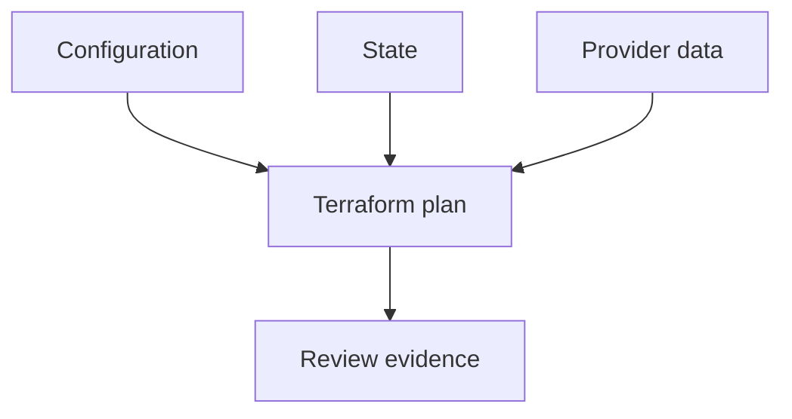

## Table of Contents

1. [The Problem](#the-problem)
2. [Plan Inputs](#plan-inputs)
3. [Summary](#summary)
4. [Adds and Changes](#adds-and-changes)
5. [Replacement](#replacement)
6. [Destroy](#destroy)
7. [Unknown Values](#unknown-values)
8. [Sensitive Values](#sensitive-values)
9. [Drift](#drift)
10. [Saved Plans](#saved-plans)
11. [Putting It All Together](#putting-it-all-together)
12. [What's Next](#whats-next)

## The Problem

The fundamentals module taught the generic idea of plans and drift. Terraform plans add their own details: action symbols, resource addresses, unknown values, sensitive redaction, replacement markers, saved plan files, and state refresh behavior.

The orders team opens a pull request that says:

```text
Add lifecycle rules to the invoice bucket so old generated invoices move to colder storage.
```

The plan summary says:

```text
Plan: 0 to add, 1 to change, 1 to destroy.
```

The change may be the lifecycle rule. The destroy is not explained by the story. A Terraform reviewer needs to know how to read from summary to resource detail without turning the review into guesswork.

## Plan Inputs

A Terraform plan is built from three main inputs: configuration files, state, and provider data.



Configuration says what should exist. State says what Terraform currently manages. Provider data says what exists right now. Terraform compares those inputs and proposes actions.

This means a plan can reveal more than the current pull request. If someone changed the invoice bucket in the console yesterday, a plan for today's lifecycle rule may also show that drift. If a provider default changed, the plan may show a field the author did not edit. If state points at an object that no longer exists, the plan may propose recreation.

That is why reviewers read the plan as evidence, not just as a command output blob.

## Summary

Start with the summary:

```text
Plan: 1 to add, 0 to change, 0 to destroy.
```

The summary answers the first question: does the action count match the pull request story?

| Story | Plausible summary | Suspicious summary |
| --- | --- | --- |
| Add one bucket | `1 to add` | Any destroy or replacement |
| Update tags | `1 to change` | Add a new unrelated resource |
| Rename resource address | No object change with moved block | Destroy and create without explanation |
| Remove obsolete rule | `1 to destroy` | Destroy a database or bucket |

A suspicious summary does not always mean the plan is wrong. It means the plan needs explanation before approval. Terraform is showing the reviewer where to slow down.

The summary is not enough by itself. A plan with `1 to add` can still add the wrong thing. A plan with `0 to destroy` can still make a risky in-place change. The summary tells you where to look next.

## Adds and Changes

Terraform plan output uses symbols to show action types. A create often appears with `+`. An in-place update often appears with `~`.

For the invoice bucket lifecycle change, a simplified update might look like this:

```text
  # aws_s3_bucket_lifecycle_configuration.invoices will be updated in-place
  ~ resource "aws_s3_bucket_lifecycle_configuration" "invoices" {
      ~ rule {
          id     = "archive-old-invoices"
          status = "Enabled"
        }
    }
```

The first line gives the resource address and the action. The inner lines show which fields change. Reviewers should read both. The resource address tells what object is affected. The field diff tells what behavior changes.

Adds deserve the same care:

```text
  # aws_s3_bucket_public_access_block.invoices will be created
  + resource "aws_s3_bucket_public_access_block" "invoices" {
      + block_public_acls       = true
      + block_public_policy     = true
      + ignore_public_acls      = true
      + restrict_public_buckets = true
    }
```

The plus signs are not enough. The reviewer asks whether the resource belongs to the story, whether the settings match the intended posture, and whether the provider target is correct.

## Replacement

Replacement is higher risk because Terraform destroys one object and creates another to reach the desired state. In plan output, replacement is often shown as a destroy and create action for the same resource address, with wording like "must be replaced."

Example:

```text
  # aws_db_instance.orders will be replaced
-/+ resource "aws_db_instance" "orders" {
      ~ identifier = "orders-prod" -> "orders-prod-2" # forces replacement
    }
```

The phrase `forces replacement` is the important clue. Some fields cannot be changed in place. Changing them means a new object must replace the old one.

Replacement is not always wrong. It may be exactly what a migration plan intends. But it needs more than a casual approval. Reviewers should ask:

| Replacement question | Why it matters |
| --- | --- |
| What data or traffic depends on the old object? | Replacement can break stateful systems. |
| Is there a migration or cutover plan? | Create-before-destroy may not solve app behavior. |
| Does the provider support safe replacement settings? | Some objects cannot overlap due to names or limits. |
| Is the replacement caused by a rename? | A moved block or import may be the right fix. |

If a tiny tag change causes a database replacement, stop. The plan and story disagree.

## Destroy

A destroy removes a managed object. Terraform usually shows it with `-`.

```text
  # aws_security_group_rule.old_admin_ssh will be destroyed
  - resource "aws_security_group_rule" "old_admin_ssh" {
      - cidr_blocks = ["0.0.0.0/0"]
      - from_port   = 22
      - to_port     = 22
    }
```

This destroy may be good. Removing public SSH access could be the whole point of a hardening change. The reviewer still needs the pull request story to say so.

Destroys are especially important for stateful resources: buckets, databases, disks, queues, DNS zones, and anything users or other systems depend on. A resource disappearing from configuration is enough for Terraform to propose deleting it if state says Terraform owns it.

The question is not "does Terraform know how to destroy this?" The question is "should this object be destroyed now, by this change, in this environment?"

## Unknown Values

Terraform sometimes cannot know a value until apply. Plan output often represents this as `(known after apply)`.

```text
  + arn = (known after apply)
```

Unknown values are normal for provider-generated attributes. A bucket ARN, generated ID, endpoint hostname, or creation timestamp may only be available after the provider creates or updates the object.

Unknown does not mean unsafe by itself. It means the reviewer cannot inspect that exact value before apply. The safe response depends on what the value controls.

| Unknown value | Typical posture |
| --- | --- |
| Provider-generated ID | Usually normal |
| Computed ARN from a new resource | Usually normal |
| Policy document with unknown broad resource | Needs careful review |
| Count or for_each keys unknown | Often a configuration design problem |

The review habit is to ask whether the unknown value hides a decision the team should make before apply. If it is just the provider returning an ID later, fine. If it hides access scope, routing, or count, slow down.

## Sensitive Values

Sensitive values are redacted in normal plan output:

```text
  ~ password = (sensitive value)
```

Redaction protects display. It does not automatically prove the secret is stored safely, rotated correctly, or absent from state. It also makes review harder because the exact value is intentionally hidden.

For sensitive values, reviewers should focus on flow and control:

- Where does the value come from?
- Does it enter through a secret manager or protected CI variable?
- Does Terraform store it in state?
- Which resource receives it?
- Is rotation handled outside the pull request?

Do not approve secret changes just because the plan hides the value. Redaction is a display feature, not a complete secrets strategy.

## Drift

Terraform plans refresh information about managed resources and can show when reality differs from the state and configuration. Drift often appears as changes Terraform plans to make even though the current pull request did not edit those fields.

Example:

```text
Note: Objects have changed outside of Terraform

  # aws_s3_bucket.orders_invoices has changed
  ~ tags = {
      + temporary = "debug"
    }
```

This is not automatically a disaster. Maybe an emergency tag was added during an incident. Maybe a console edit was accidental. Maybe another automation owns that tag and Terraform should ignore it. The plan is asking the team to decide.

The Terraform-specific habit is to locate the drift at the resource address and field, then decide whether to update code, restore reality, import ownership, adjust lifecycle behavior, or investigate state.

## Saved Plans

Terraform can save a plan file with `-out`:

```bash
$ terraform plan -out=tfplan
$ terraform apply tfplan
```

A saved plan connects review and apply more tightly because `apply tfplan` applies the exact planned actions in that file. In automation, saved plans need careful handling. HashiCorp documents that plan files can contain configuration, state-derived data, variable values, and backend configuration details. Treat them as sensitive artifacts.

For pull request review, many teams use throwaway plans without `-out`. The plan helps review the proposed branch but is not applied later. After merge, the apply workflow creates a fresh plan against the latest main branch and current state.

The right pattern depends on the automation model, but the review rule is stable: know whether the plan being approved is the plan being applied.

## Putting It All Together

The orders team saw a lifecycle-rule pull request with an unexplained destroy. Reading the Terraform plan gave them a path.

- Plan inputs are configuration, state, and provider data.
- The summary shows whether counts match the story.
- Adds and changes need resource-address and field-level review.
- Replacement deserves migration-level attention.
- Destroy needs a clear reason, especially for stateful resources.
- Unknown values are normal only when they do not hide important decisions.
- Sensitive values reduce display but still require state and secret controls.
- Drift turns unexpected reality into an explicit decision.
- Saved plans can connect review to apply but must be protected.

Terraform plan reading is not a separate skill from engineering judgment. It is how the judgment gets evidence.

## What's Next

The next article turns repeated Terraform shapes into modules. You will see when reuse makes infrastructure clearer, and when a module hides too much.

---

**References**

- [Terraform plan command](https://developer.hashicorp.com/terraform/cli/commands/plan)
- [Terraform apply command](https://developer.hashicorp.com/terraform/cli/commands/apply)
- [Terraform state](https://developer.hashicorp.com/terraform/language/state)
- [Terraform automation guide](https://developer.hashicorp.com/terraform/tutorials/automation/automate-terraform)
