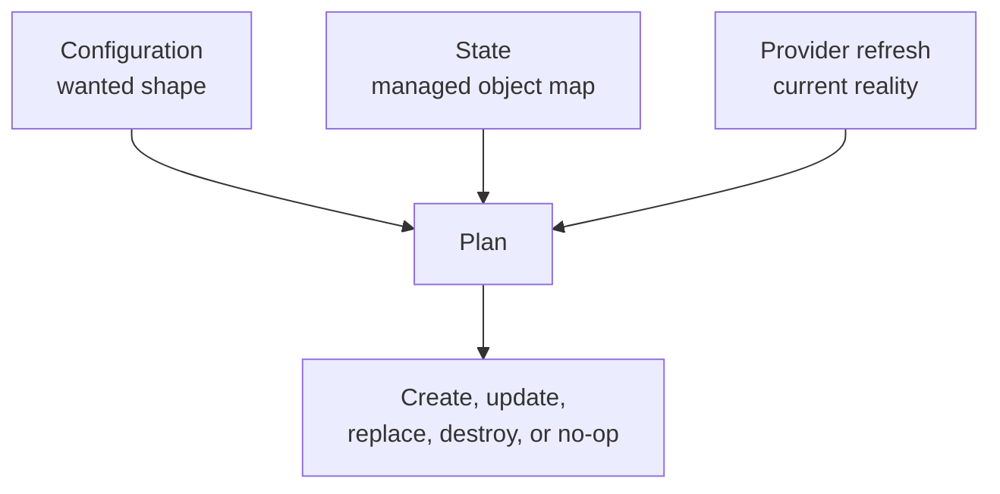

## Table of Contents

1. [The Review Before the API Call](#the-review-before-the-api-call)
2. [The Three Inputs Behind a Plan](#the-three-inputs-behind-a-plan)
3. [Start With the Summary](#start-with-the-summary)
4. [Read Resource Actions in Context](#read-resource-actions-in-context)
5. [Replacement Deserves Extra Attention](#replacement-deserves-extra-attention)
6. [Unknown Values and Sensitive Values](#unknown-values-and-sensitive-values)
7. [Drift in a Normal Plan](#drift-in-a-normal-plan)
8. [Saved Plans and JSON Evidence](#saved-plans-and-json-evidence)
9. [Plan Failures and Diagnostic Clues](#plan-failures-and-diagnostic-clues)
10. [A Reviewer Checklist for devpolaris-orders](#a-reviewer-checklist-for-devpolaris-orders)

## The Review Before the API Call

Infrastructure changes should be reviewed while they are still proposals. Once the provider API creates a
bucket, replaces a queue, removes a firewall rule, or edits an IAM policy, the team is already in cleanup
mode if the change was wrong. A Terraform plan gives you the proposal before that API call happens.

A plan is Terraform's description of the actions it intends to take. OpenTofu plans serve the same purpose.
The plan compares your configuration, the stored state, and the provider's view of real infrastructure. The
output shows resource creations, in-place updates, replacements, deletions, data reads, and values that will
only be known after apply.

The running example is the `devpolaris-orders` service. The team already has an invoice bucket. A new pull
request adds S3 versioning, tightens public access settings, and gives the orders API permission to write
invoice PDFs. The reviewer needs to answer a practical question: does the plan match that story?

```text
Pull request intent:
  Add versioning for invoice storage.
  Enforce public access blocking on the invoice bucket.
  Attach write permission for the orders API role.

Reviewer question:
  Does the plan show only those changes, and are the risky fields acceptable?
```

That small question is enough to prevent many mistakes. The plan is not only output from a tool. It is the
shared evidence that lets the author, reviewer, and operator agree on what will happen.

## The Three Inputs Behind a Plan

Terraform does not produce a plan by reading only your `.tf` files. It uses three inputs: configuration,
state, and provider refresh data. Understanding those inputs helps you diagnose confusing output.

Configuration is the desired shape in files. For the orders service, the file may say the bucket should have
versioning enabled:

```hcl
resource "aws_s3_bucket_versioning" "orders_invoices" {
  bucket = aws_s3_bucket.orders_invoices.id

  versioning_configuration {
    status = "Enabled"
  }
}
```

State is Terraform's memory of managed objects. It says which real bucket belongs to
`aws_s3_bucket.orders_invoices` and whether Terraform already knows about a versioning resource at
`aws_s3_bucket_versioning.orders_invoices`.

Provider refresh data is what Terraform learns by asking the provider about current reality. The provider
may report that public access settings were changed manually, that a queue exists, or that a generated ARN
has a specific value.



If the plan surprises you, locate which input caused the surprise. A change in the `.tf` file is expected
when the pull request edited that resource. A change from provider refresh may be drift. A missing state
record may make Terraform think it needs to create something that already exists.

This is why a reviewer should ask for both the Terraform diff and the plan. The code diff shows what the
author changed. The plan shows how Terraform interprets the change against real managed infrastructure.

## Start With the Summary

The summary line is the fastest way to see whether the plan matches the pull request. It appears near the
end of the plan:

```text
Plan: 3 to add, 1 to change, 0 to destroy.
```

For the orders pull request, that may be reasonable. The three additions could be bucket versioning, public
access blocking, and an IAM policy. The one change could be adding tags to the existing bucket. The summary
does not approve the plan by itself, but it gives the reviewer a first expectation.

Now compare this summary:

```text
Plan: 3 to add, 1 to change, 1 to destroy.
```

The destroy needs an explanation. It may be a cleanup of an old test policy. It may be a dangerous deletion.
The review should not continue as if the extra action is invisible. The author should name why that resource
is being destroyed and what depends on it.

Use the pull request description to create a small expected count before reading the plan:

```text
Expected:
  Add 3 resources:
    - bucket versioning
    - public access block
    - write policy
  Change 0 or 1 existing resources:
    - bucket tags if missing
  Destroy 0 resources:
    - no deletes expected
```

Then compare it with the plan summary. If the numbers differ, the plan may still be valid, but the pull
request needs more explanation. A good reviewer does not require every plan to be tiny. A good reviewer
requires the plan to match the stated intent.

Terraform also supports a detailed exit code for automation. With `-detailed-exitcode`, exit code `0` means
no changes, `2` means the plan has changes, and `1` means an error. This is useful in CI because the job can
distinguish "no infrastructure diff" from "plan failed."

```bash
$ terraform plan -detailed-exitcode
```

CI should still publish readable plan evidence for humans. An exit code can tell a workflow what happened,
but a reviewer still needs to read the proposed actions.

## Read Resource Actions in Context

After the summary, read the resource actions. Terraform uses symbols to show what will happen to each resource.
The same symbols appear in many OpenTofu plans.

| Symbol | Meaning | Review Question |
|--------|---------|-----------------|
| `+` | Create | Is this new object expected? |
| `~` | Update in place | Is this setting safe to change on the existing object? |
| `-` | Destroy | Is deletion expected, recoverable, and approved? |
| `-/+` | Destroy then create replacement | What downtime or data loss can happen? |
| `+/-` | Create replacement then destroy old | Can both objects exist at once safely? |
| `<=` | Read data source | Is Terraform reading an external object rather than owning it? |

Here is a plan excerpt that fits the orders pull request:

```text
Terraform will perform the following actions:

  # aws_s3_bucket_versioning.orders_invoices will be created
  + resource "aws_s3_bucket_versioning" "orders_invoices" {
      + bucket = "dp-orders-invoices-prod"
      + id     = (known after apply)

      + versioning_configuration {
          + status = "Enabled"
        }
    }

  # aws_s3_bucket_public_access_block.orders_invoices will be created
  + resource "aws_s3_bucket_public_access_block" "orders_invoices" {
      + block_public_acls       = true
      + block_public_policy     = true
      + ignore_public_acls      = true
      + restrict_public_buckets = true
    }

Plan: 2 to add, 0 to change, 0 to destroy.
```

The reviewer should connect each resource to intent. Versioning protects invoice history. Public access
blocking prevents accidental public bucket policies or ACLs from exposing invoice files. The plan does not
show unexpected destroys, replacements, or broad access changes.

An in-place update uses `~`. For example, the team may add a missing `cost-center` tag to the existing bucket:

```text
  # aws_s3_bucket.orders_invoices will be updated in-place
  ~ resource "aws_s3_bucket" "orders_invoices" {
        bucket = "dp-orders-invoices-prod"
      ~ tags   = {
          + "cost-center" = "orders"
            "environment" = "prod"
            "owner"       = "platform"
            "service"     = "orders-api"
        }
    }
```

That update is probably low risk. It changes metadata on the existing bucket. The reviewer still checks that
the environment and service tags are not being removed or changed to the wrong values.

The `<=` marker appears for data sources. A data source reads something Terraform does not own in this root
module. For example, the orders module may read the existing application role instead of creating it:

```text
  # data.aws_iam_role.orders_api will be read during apply
  <= data "aws_iam_role" "orders_api" {
      + arn  = (known after apply)
      + name = "orders-api-prod"
    }
```

That line says Terraform is reading a role named `orders-api-prod`. The reviewer should ask whether that is
the intended external role. A typo in a data source can attach permissions to the wrong identity or fail only
when the provider cannot find it.

## Replacement Deserves Extra Attention

Replacement means the existing remote object cannot be updated in place for the requested change. Terraform
must create a new object, destroy the old object, or do both in the order allowed by the provider and lifecycle
settings. Replacement is where small-looking file edits can become service-impacting changes.

For example, suppose someone changes the bucket name:

```hcl
resource "aws_s3_bucket" "orders_invoices" {
  bucket = "dp-orders-invoice-archive-prod"
}
```

The plan may show a replacement because an S3 bucket name is part of the resource identity:

```text
  # aws_s3_bucket.orders_invoices must be replaced
-/+ resource "aws_s3_bucket" "orders_invoices" {
      ~ bucket = "dp-orders-invoices-prod" -> "dp-orders-invoice-archive-prod"
      ~ id     = "dp-orders-invoices-prod" -> (known after apply)
        tags   = {
            "environment" = "prod"
            "owner"       = "platform"
            "service"     = "orders-api"
        }
    }

Plan: 1 to add, 0 to change, 1 to destroy.
```

That may look like a rename, but for the provider it is a different bucket. The reviewer should ask what
happens to existing invoice objects, application configuration, IAM policies, replication, lifecycle rules,
alerts, and backups. A name edit in HCL can turn into a migration project.

Replacement can be safe for disposable resources. A generated test queue in a development account may be
fine to replace. A production bucket, database, load balancer, or DNS zone needs a migration plan. The plan
shows the mechanical action. The team supplies the operational judgment.

Look for fields that force replacement. Terraform often marks them with text like "forces replacement":

```text
  # aws_sqs_queue.invoice_jobs must be replaced
-/+ resource "aws_sqs_queue" "invoice_jobs" {
      ~ fifo_queue = false -> true
      ~ name       = "orders-invoice-jobs-prod" -> "orders-invoice-jobs-prod.fifo"
        visibility_timeout_seconds = 30
    }
```

Changing a standard SQS queue into a FIFO queue is not an in-place tweak. The new queue has different delivery
semantics and a different name. The orders workers, retry behavior, monitoring, and dead-letter setup may all
need review. The plan is the first clue that the change is larger than one argument.

When replacement is expected, the pull request should say so plainly:

```text
Expected replacement:
  Replace development invoice queue to test FIFO ordering.
  No production queue replacement.
  No data migration needed because dev queue is disposable.
```

That explanation gives reviewers something concrete to verify. If production appears in the plan, or if the
replacement affects a non-disposable resource, the plan does not match the stated risk.

## Unknown Values and Sensitive Values

Plans often contain values shown as `(known after apply)`. This means Terraform cannot know the value until
the provider creates or reads the remote object. Generated IDs, ARNs, timestamps, hosted zone IDs, and URLs
often appear this way.

```text
  + arn = (known after apply)
  + id  = (known after apply)
```

Unknown values are normal. They do not mean the plan is incomplete. The reviewer should focus on the values
that are known before apply: names, regions, account IDs, public access settings, IAM actions, tags, retention
periods, and replacement markers.

Unknown values can still hide dependency effects. If a generated queue ARN flows into an IAM policy, the
policy document may also include unknown values until apply. Review the surrounding known fields to confirm
the policy is attached to the intended role and contains the intended actions.

Sensitive values are different. Terraform can mark values as sensitive so they are hidden in CLI output:

```text
  + password = (sensitive value)
```

That redaction protects the terminal display, not every storage location. State and saved plan files may
still contain sensitive data needed for future operations. A reviewer should treat plan files and state like
operational secrets, even when the terminal output hides the value.

For the orders service, a plan that adds a secret directly to Terraform deserves scrutiny:

```text
  # aws_secretsmanager_secret_version.orders_db will be created
  + resource "aws_secretsmanager_secret_version" "orders_db" {
      + secret_id     = "orders-db-prod"
      + secret_string = (sensitive value)
    }
```

This may be acceptable in some workflows, but it should be intentional. Ask where the value comes from, who
can read state, how rotation works, and whether a dedicated secret creation path would reduce exposure. Do
not approve sensitive changes because the value is hidden in the plan output.

## Drift in a Normal Plan

A normal plan refreshes state by default before proposing changes. That refresh can reveal drift, which means
real infrastructure changed outside the current Terraform configuration. Drift often appears as an in-place
update that the pull request did not directly edit.

Suppose someone temporarily disabled public access blocking in the AWS console while testing invoice downloads
and forgot to restore it. The next plan may show this:

```text
  # aws_s3_bucket_public_access_block.orders_invoices will be updated in-place
  ~ resource "aws_s3_bucket_public_access_block" "orders_invoices" {
      ~ block_public_acls       = false -> true
      ~ block_public_policy     = false -> true
      ~ ignore_public_acls      = false -> true
      ~ restrict_public_buckets = false -> true
    }

Plan: 0 to add, 1 to change, 0 to destroy.
```

The file did not necessarily change. Terraform is proposing to return reality to the file. That may be exactly
what the team wants. The reviewer should still record the drift and, if needed, ask why production was changed
outside Terraform.

Drift can also mean the code needs to change. If an emergency console change fixed a real production issue,
the team may decide to update the `.tf` files to match the new intended state. The wrong response is to leave
the console change undocumented while Terraform keeps trying to undo it.

There is also a refresh-only planning mode for inspecting drift without proposing normal configuration changes:

```bash
$ terraform plan -refresh-only
```

A refresh-only plan can be useful before a larger refactor or during an investigation. It asks, "what does
Terraform's state learn if it refreshes from the provider?" It does not replace a normal plan for a pull
request, but it can separate drift discovery from intended code changes.

Use this drift reading pattern:

| Plan Shape | Likely Meaning | Review Response |
|------------|----------------|-----------------|
| File changed and plan follows it | Intended change | Review risk and correctness. |
| File did not change but plan updates reality | Drift correction | Confirm whether to revert reality or update code. |
| Plan wants to create known existing object | State gap or wrong backend | Inspect state and backend before apply. |
| Plan wants replacement after a rename | Address or identity change | Use moved block, import, or migration plan if needed. |

The plan does not know the social reason for drift. It only reports the difference. The team has to decide
whether the file or the real system is the source of truth for the next change.

## Saved Plans and JSON Evidence

For team workflows, a saved plan can connect review and apply more tightly. The `-out` flag writes the plan
to a file:

```bash
$ terraform plan -out=tfplan
```

Applying that saved plan tells Terraform to apply the exact actions captured in the file, rather than creating
a fresh plan at apply time:

```bash
$ terraform apply tfplan
```

This can be useful in CI/CD because the reviewed plan and applied plan are the same artifact. It also has
limits. A saved plan is tied to the configuration, state, provider selections, and environment at the time it
was created. If the world changes after the plan was saved, the apply may fail or no longer represent the
latest desired decision.

Saved plans can contain sensitive data. Do not commit them, attach them casually to tickets, or keep them
as permanent build artifacts without access controls and retention rules. Treat `tfplan` files with the same
care as state.

Terraform can also show a saved plan in human-readable form:

```bash
$ terraform show tfplan
```

For automation and policy tools, Terraform can show JSON:

```bash
$ terraform show -json tfplan > tfplan.json
```

A small JSON excerpt might include planned actions like this:

```json
{
  "resource_changes": [
    {
      "address": "aws_s3_bucket_versioning.orders_invoices",
      "type": "aws_s3_bucket_versioning",
      "change": {
        "actions": ["create"]
      }
    },
    {
      "address": "aws_s3_bucket.orders_invoices",
      "type": "aws_s3_bucket",
      "change": {
        "actions": ["update"]
      }
    }
  ]
}
```

The JSON form is not easier for humans to read than the normal plan. It is useful when automation needs to
count actions, block risky patterns, or produce a compact pull request comment. A simple policy might fail
the build if any production plan contains a delete action:

```text
Policy check:
  environment: prod
  delete actions: 0
  replacement actions: 0
  public CIDR additions: 0
  result: pass
```

Policy output should support human review, not replace it. A policy can catch known risky shapes. A reviewer
still checks whether the plan matches the service, environment, and intent.

OpenTofu has the same working pattern with `tofu plan -out`, `tofu apply`, and `tofu show`. The exact JSON
details should be checked against the version your team uses before building long-lived automation around it.

## Plan Failures and Diagnostic Clues

Sometimes the plan does not produce a plan at all. The failure still teaches you where Terraform got stuck.
Read the error by workflow stage: initialization, configuration validation, backend access, provider
authentication, provider lookup, or remote API permissions.

A backend error happens before Terraform can safely compare managed resources:

```text
Error: Failed to load state

Error loading state:
  AccessDenied: Access Denied
  status code: 403
```

That points at state access. Check the backend bucket, key, credentials, IAM permissions, encryption key
access, and whether the job is using the intended environment identity. Do not "fix" this by switching to a
new empty backend key unless you mean to start a new state.

A provider credential error means Terraform reached the provider step but cannot authenticate:

```text
Error: configuring Terraform AWS Provider: no valid credential sources for Terraform AWS Provider found
```

For the orders service, that usually means the developer shell, CI role, AWS profile, or role assumption is
not set for the target account. The fix belongs in the credential path, not in hardcoded access keys inside
Terraform files.

A data source error can mean the plan is looking for an external object that does not exist or cannot be read:

```text
Error: reading IAM Role (orders-api-prod): NoSuchEntity:
  The role with name orders-api-prod cannot be found.

  with data.aws_iam_role.orders_api,
  on iam.tf line 1, in data "aws_iam_role" "orders_api":
   1: data "aws_iam_role" "orders_api" {
```

That error includes the address and file location. Check the role name, target account, region if relevant,
and whether this root module should create the role instead of reading it.

A planning error can also reveal invalid configuration:

```text
Error: Reference to undeclared resource

  on iam.tf line 14, in resource "aws_iam_policy" "orders_invoice_writer":
  14: Resource = "${aws_s3_bucket.order_invoices.arn}/*"

A managed resource "aws_s3_bucket" "order_invoices" has not been declared.
```

Here the resource address is misspelled. The configuration says `order_invoices`, but the real block is
`orders_invoices`. Fix the file and rerun `terraform validate` and `terraform plan`.

Use failures as routing information:

| Error Area | What To Inspect First |
|------------|-----------------------|
| Backend access | State bucket, key, credentials, encryption, network path |
| Provider credentials | Profile, role, environment variables, CI identity |
| Data source lookup | Name, account, region, ownership boundary |
| Undeclared reference | Resource address spelling and module outputs |
| Lock acquisition | Active apply, stale lock, CI concurrency |

The goal is not to memorize every error string. The goal is to ask which system Terraform was talking to
when it failed. That points you toward the right owner and the right fix.

## A Reviewer Checklist for devpolaris-orders

When reviewing a plan, keep the checklist small enough to actually use. The orders team can start with the
summary, destructive actions, sensitive fields, environment identity, and verification path.

```text
Plan review checklist:
  1. Does the summary match the pull request intent?
  2. Are all creates expected and named in the review?
  3. Are all updates safe for the existing resource?
  4. Are there any destroys or replacements?
  5. Do IAM actions, public access flags, and CIDR blocks look intentional?
  6. Are sensitive values handled through the approved path?
  7. Is the plan using the correct backend, account, region, and environment?
  8. Is there a verification step after apply?
```

Now apply it to a compact orders plan:

```text
Plan summary:
  Plan: 3 to add, 1 to change, 0 to destroy.

Creates:
  aws_s3_bucket_versioning.orders_invoices
  aws_s3_bucket_public_access_block.orders_invoices
  aws_iam_policy.orders_invoice_writer

Update:
  aws_s3_bucket.orders_invoices tags add cost-center = orders

Sensitive:
  no secret values introduced

Environment:
  backend key devpolaris-orders/prod/terraform.tfstate
  provider region eu-west-2
```

That plan matches the stated change if the pull request promised exactly those actions. It still needs normal
review of the IAM policy document and bucket settings, but the shape is coherent: no delete, no replacement,
no unexpected environment.

Here is a plan that should stop the review:

```text
Plan summary:
  Plan: 3 to add, 1 to change, 1 to destroy.

Destroy:
  aws_sqs_queue.invoice_jobs

Replacement:
  none shown

Pull request intent:
  Add bucket versioning and public access block.
```

The queue destroy is unrelated to the stated intent. It might have a valid reason, but the current review
does not explain it. Ask for the reason, inspect the code diff and state, and confirm whether the queue is
still used by invoice workers before approving any apply.

The final habit is to read the plan after apply as well. A follow-up plan should usually be quiet:

```text
No changes. Your infrastructure matches the configuration.
```

If the follow-up plan immediately shows changes, the apply did not settle into the state described by the
files. That may be provider behavior, drift from another automation, a missing argument, or a real failed
change. Read the new plan before starting another apply.

---

**References**

- [terraform plan command](https://developer.hashicorp.com/terraform/cli/commands/plan) - Documents plan modes, planning options, saved plans, and detailed exit codes.
- [terraform show command](https://developer.hashicorp.com/terraform/cli/commands/show) - Explains how to inspect state or saved plan files, including JSON output.
- [Terraform JSON Output Format](https://developer.hashicorp.com/terraform/internals/json-format) - Describes the machine-readable plan and state representation used by automation.
- [Terraform Manage Sensitive Data](https://developer.hashicorp.com/terraform/language/manage-sensitive-data) - Explains how sensitive values behave in configuration, plans, and state.
- [OpenTofu plan command](https://opentofu.org/docs/cli/commands/plan/) - Provides the OpenTofu reference for planning modes and options.
- [OpenTofu show command](https://opentofu.org/docs/cli/commands/show/) - Documents OpenTofu inspection of state and saved plan files.
