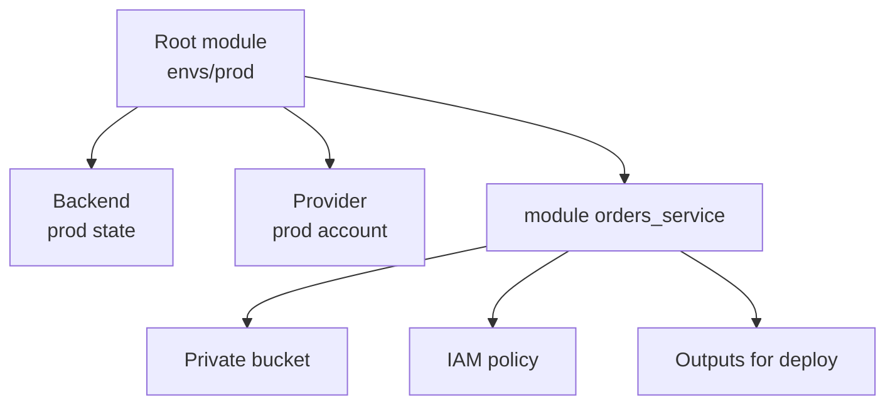

## Table of Contents

1. [Why the Run Directory Matters](#why-the-run-directory-matters)
2. [One Root Module Means One Change Boundary](#one-root-module-means-one-change-boundary)
3. [A devpolaris-orders Environment Layout](#a-devpolaris-orders-environment-layout)
4. [What Belongs in the Root Module](#what-belongs-in-the-root-module)
5. [Separate State Before You Separate Names](#separate-state-before-you-separate-names)
6. [Variables That Differ by Environment](#variables-that-differ-by-environment)
7. [CLI Workspaces: Useful but Easy to Overuse](#cli-workspaces-useful-but-easy-to-overuse)
8. [HCP Terraform Workspaces Are Different](#hcp-terraform-workspaces-are-different)
9. [Failure Modes in Environment Layouts](#failure-modes-in-environment-layouts)
10. [Reviewing an Environment Change](#reviewing-an-environment-change)

## Why the Run Directory Matters

Every Terraform or OpenTofu run starts from a directory. That directory decides which files are read, which backend is used, which providers are configured, which child modules are called, and which state is compared with real infrastructure. If you run from the wrong directory, you are not doing the same operation with a different view. You are asking the tool to manage a different collection of infrastructure.

A root module is the module Terraform or OpenTofu runs directly. In Terraform CLI, it is usually the current working directory. In HCP Terraform, the workspace settings decide which directory in the uploaded or connected configuration acts as the root module. In OpenTofu CLI, the same beginner mental model works: the root module is the main working directory for the run.

The root module exists because the tool needs one entrypoint. Child modules can package reusable infrastructure, but something still has to connect those modules to a target environment. The root module is where the team says, "for production, use this state, these provider credentials, these names, these sizes, and these module calls."

For `devpolaris-orders`, the reusable child module might know how to create a private application bucket. The production root module decides that production needs `dp-orders-invoices-prod`, versioning enabled, production tags, and production state. The development root module may call the same child module with a smaller or cheaper shape.



The diagram is intentionally centered on the root module. A child module can make reuse cleaner, but the root module is the operational boundary. It is the place a reviewer checks before asking whether the plan is safe for the target environment.

## One Root Module Means One Change Boundary

An environment is a separately operated copy or stage of a system. Development, staging, and production are common names, but the important part is not the label. The important part is that each environment has a different risk profile. A bad development change may waste time. A bad production change may affect users, data, and recovery work.

A root module should usually line up with a change boundary: the smallest collection of infrastructure that should be planned, reviewed, applied, and rolled back together. For `devpolaris-orders`, the application root module might own the orders API bucket, queue, service role, and app-specific alarms. It should not also own the shared organization network unless that network changes on the same review path and by the same team.

This boundary gives the plan a readable scope. A pull request that says "change production invoice bucket retention" should produce a plan in the production orders root module. It should not include unrelated development resources, shared DNS zones, or the platform account's state bucket.

Here is the kind of plan summary a reviewer can reason about:

```text
Target:
  devpolaris-orders production app root module

Expected:
  update invoice bucket lifecycle rule
  no database change
  no shared network change

Plan:
  0 to add, 1 to change, 0 to destroy
```

The target line matters. Without it, `Plan: 0 to add, 1 to change, 0 to destroy` is incomplete evidence. One changed resource in development and one changed resource in production do not carry the same risk.

Boundaries also reduce noisy reviews. If one giant root module contains every environment, every shared service, and every application, a tiny change may force the reviewer to scan a huge plan. Smaller root modules let the reviewer spend attention on the resources that can actually change in this run.

## A devpolaris-orders Environment Layout

A practical repository layout separates reusable modules from environment root modules. The reusable modules live under one directory. Each environment has its own run directory with its own backend, provider setup, variables, and module calls.

One beginner-friendly shape looks like this:

```text
infra/
  modules/
    orders-service/
      main.tf
      variables.tf
      outputs.tf
    private-bucket/
      main.tf
      variables.tf
      outputs.tf
  envs/
    dev/
      backend.tf
      providers.tf
      main.tf
      variables.tf
      outputs.tf
      terraform.tfvars
    staging/
      backend.tf
      providers.tf
      main.tf
      variables.tf
      outputs.tf
      terraform.tfvars
    prod/
      backend.tf
      providers.tf
      main.tf
      variables.tf
      outputs.tf
      terraform.tfvars
```

If you run from `infra/envs/prod`, Terraform reads only the top-level files in that directory as the root module. It does not automatically read the staging files. It does not automatically read the child module files. It reads child modules only when `main.tf` calls them.

The production root module can call a reusable service module:

```hcl
module "orders_service" {
  source = "../../modules/orders-service"

  service_name        = "orders-api"
  environment         = "prod"
  invoice_bucket_name = "dp-orders-invoices-prod"
  export_bucket_name  = "dp-orders-exports-prod"
  deletion_protection = true
  replica_count       = 3
}
```

The staging root module can call the same child module with staging values:

```hcl
module "orders_service" {
  source = "../../modules/orders-service"

  service_name        = "orders-api"
  environment         = "staging"
  invoice_bucket_name = "dp-orders-invoices-staging"
  export_bucket_name  = "dp-orders-exports-staging"
  deletion_protection = false
  replica_count       = 1
}
```

The child module gives both environments the same basic shape. The root modules keep the differences visible. That visibility is the reason to use separate environment directories instead of one file full of conditional expressions.

## What Belongs in the Root Module

The root module should mostly describe how this environment connects reusable pieces together. Avoid using it as a dumping ground for every resource. It is the entrypoint that chooses provider settings, backend settings, child module calls, environment-specific variables, and outputs that other systems need.

A small production root module often has these responsibilities:

| Root Module File | Typical Job |
|------------------|-------------|
| `backend.tf` | Select where this environment stores state. |
| `providers.tf` | Configure provider region, account, subscription, or project. |
| `variables.tf` | Declare environment inputs used by this root module. |
| `terraform.tfvars` | Set values for this environment. |
| `main.tf` | Call child modules and connect outputs between them. |
| `outputs.tf` | Expose values needed by deployment, observability, or other root modules. |

The provider configuration is an environment decision because it decides where API calls go. For AWS examples, that often means a region and an identity path:

```hcl
provider "aws" {
  region = var.aws_region

  default_tags {
    tags = {
      service     = "orders-api"
      environment = var.environment
      managed_by  = "terraform"
    }
  }
}
```

The module should not quietly choose production credentials for the caller. Credentials are part of the run context. In local development, they may come from an AWS profile or environment variables. In CI, they may come from a short-lived role. The exact setup differs by team, but the boundary is stable: the root module and run environment decide provider identity.

Outputs from the root module should be values other systems need to consume. For example, the deployment pipeline may need the invoice bucket name to configure the orders API:

```hcl
output "invoice_bucket_name" {
  description = "S3 bucket used by orders-api for generated invoice files."
  value       = module.orders_service.invoice_bucket_name
}
```

Do not expose every child module output automatically. A root output is a public handoff from this root module to another system or person. Keep it intentional so other configurations do not couple themselves to internals that may change.

## Separate State Before You Separate Names

State is Terraform's record of which real objects belong to which resource addresses. If development and production share state by accident, the tool can no longer keep those worlds cleanly separated. Different names help humans, but separate state is what gives Terraform separate managed inventories.

For a remote backend, each environment should have its own state location. With an S3 backend, that usually means a different key per environment:

```hcl
terraform {
  backend "s3" {
    bucket = "dp-terraform-state"
    key    = "devpolaris-orders/prod/terraform.tfstate"
    region = "eu-west-2"
  }
}
```

The staging backend should not use the same key:

```hcl
terraform {
  backend "s3" {
    bucket = "dp-terraform-state"
    key    = "devpolaris-orders/staging/terraform.tfstate"
    region = "eu-west-2"
  }
}
```

The bucket can be shared if your team has designed access and locking carefully. The state object key should be different. The production run should read production state. The staging run should read staging state.

A healthy plan should show resources from the environment you intended:

```text
  # module.orders_service.module.invoice_bucket.aws_s3_bucket.this will be updated in-place
  ~ resource "aws_s3_bucket" "this" {
      bucket = "dp-orders-invoices-prod"
      tags   = {
        "environment" = "prod"
        "service"     = "orders-api"
      }
    }

Plan: 0 to add, 1 to change, 0 to destroy.
```

If you are in the production root module and the plan shows `dp-orders-invoices-staging`, the state or variables are wrong. Do not apply and hope the name saves you. Stop at the plan and inspect the working directory, backend configuration, selected workspace, and variable files.

One more detail matters in Terraform: backend configuration is resolved during initialization. Terraform backend blocks cannot refer to normal input variables or locals. Teams handle this by keeping separate backend files per environment, by using partial backend configuration with `terraform init -backend-config=...`, or by letting HCP Terraform manage state for the workspace. Choose one approach and make it boring enough that CI can repeat it.

## Variables That Differ by Environment

Environment differences should be easy to read. If production has three replicas and staging has one, the reviewer should see that difference as data, not as a hidden expression buried inside a child module.

A root module can declare the values it expects:

```hcl
variable "environment" {
  description = "Deployment environment for this root module."
  type        = string
}

variable "aws_region" {
  description = "AWS region where this environment is deployed."
  type        = string
}

variable "replica_count" {
  description = "Number of application replicas for this environment."
  type        = number
}

variable "deletion_protection" {
  description = "Whether data-bearing resources should reject accidental deletion."
  type        = bool
}
```

Then each environment sets its own values. Production might use:

```hcl
environment         = "prod"
aws_region          = "eu-west-2"
replica_count       = 3
deletion_protection = true
```

Development might use:

```hcl
environment         = "dev"
aws_region          = "eu-west-2"
replica_count       = 1
deletion_protection = false
```

The values differ because the environments do different jobs. Production needs more capacity and stronger protection. Development needs lower cost and easier cleanup. The root module makes those tradeoffs explicit.

Avoid using one root module with many environment conditionals when the environments need separate credentials, state, and review. A few conditional values are normal. A file full of `var.environment == "prod" ? ... : ...` often means the root module is carrying too many environments at once.

This table is a useful split:

| Difference | Good Place |
|------------|------------|
| Bucket name, replica count, deletion protection | Environment root module or tfvars. |
| Public access should always be blocked | Child module default or fixed setting. |
| Provider account, subscription, project, or region | Root module and run environment. |
| State location | Root backend or workspace settings. |
| Shared resource pattern | Child module. |

The goal is not to remove all repetition. Some repetition is evidence. Seeing `environment = "prod"` in the production root module and `environment = "staging"` in the staging root module helps humans verify the target.

## CLI Workspaces: Useful but Easy to Overuse

Terraform CLI workspaces and OpenTofu CLI workspaces are separate instances of state data inside the same working directory. Every initialized working directory starts with a `default` workspace. You can create and select others with workspace commands.

```bash
$ terraform workspace list
* default
  pr-184

$ terraform workspace new pr-185
Created and switched to workspace "pr-185"!
```

Workspaces can be useful for temporary copies. A developer working on `devpolaris-orders` might create a workspace for a feature branch, deploy a short-lived test copy, run checks, then destroy it and delete the workspace after the pull request merges.

The problem is using CLI workspaces as the main isolation mechanism for serious environments. CLI workspaces use the same working directory and the same backend configuration. That can be convenient, but it does not give separate credentials, separate access controls, or a separate root module design by itself.

This pattern is risky for production:

```hcl
resource "aws_s3_bucket" "orders_invoices" {
  bucket = "dp-orders-invoices-${terraform.workspace}"
}
```

The bucket name changes with the selected workspace, but the run still depends on the operator selecting the right workspace before planning or applying. If someone thinks they are in `staging` but the selected workspace is `prod`, the plan target changes.

The first diagnostic command is cheap:

```bash
$ terraform workspace show
prod
```

Run it when a repository uses CLI workspaces. Put the workspace name in CI logs. Make the plan summary name the workspace. Do not rely on memory.

For `devpolaris-orders`, separate root directories are usually easier for development, staging, and production. CLI workspaces can still help with temporary preview environments, where the team accepts that the copies share a configuration and backend pattern.

## HCP Terraform Workspaces Are Different

HCP Terraform also uses the word workspace, but it does not mean the same thing as a Terraform CLI workspace. An HCP Terraform workspace is a managed unit that can have its own configuration, variables, state, run history, settings, and permissions. It is closer to a managed run boundary than to a selected state name inside one local directory.

That distinction matters when reading team documentation. A sentence like "apply production from the prod workspace" is incomplete until you know which workspace type the team means. In CLI Terraform, it might mean a selected workspace inside one working directory. In HCP Terraform, it might mean a separate managed workspace with its own variables and state.

A reasonable HCP Terraform layout might look like this:

```text
Project: devpolaris-orders
  Workspace: orders-dev
    root module: infra/envs/dev
    variables: dev values
    state: dev state
  Workspace: orders-staging
    root module: infra/envs/staging
    variables: staging values
    state: staging state
  Workspace: orders-prod
    root module: infra/envs/prod
    variables: prod values
    state: prod state
```

This shape keeps the environment boundary visible in the platform as well as in the repository. Production can have stricter permissions and review settings than development. Staging can run after development. The root module directory and workspace name both point at the same target.

The same idea applies if your team uses another Terraform or OpenTofu automation platform. Look for the actual boundary: which configuration directory runs, where state lives, which variables are injected, which identity makes provider calls, and who can approve the run.

Avoid arguing from the word workspace alone. Ask what the workspace contains and what it isolates.

## Failure Modes in Environment Layouts

Environment mistakes usually show up as a mismatch between intent, directory, state, variables, and plan output. The good news is that the mismatch is often visible before apply if you look for it.

The first failure mode is running from the wrong directory:

```bash
$ pwd
/Users/senlin/devpolaris/infra/envs/prod

$ terraform plan
```

If the intended change was for development, this command is already wrong. The plan may still be valid Terraform. It is valid for the wrong target. A safe CI job prints the working directory and environment name before running plan so reviewers do not have to infer the target from resource names.

The second failure mode is shared backend state. Two root modules may look separate in Git but point at the same backend key:

```hcl
key = "devpolaris-orders/prod/terraform.tfstate"
```

If staging accidentally uses that production key, staging plans can read production state. The plan output may mention production resource names even though you are in the staging directory:

```text
  # module.orders_service.aws_s3_bucket.orders_invoices will be updated in-place
  ~ resource "aws_s3_bucket" "orders_invoices" {
      bucket = "dp-orders-invoices-prod"
    }
```

Fix the backend before applying. Changing names in variables does not repair a state collision. Reinitialize with the correct backend configuration and verify that the plan now shows the expected environment's resources.

The third failure mode is copying production values into a lower environment. A staging variable file might accidentally keep the production bucket name:

```hcl
environment         = "staging"
invoice_bucket_name = "dp-orders-invoices-prod"
```

The plan may propose a staging resource with a production name, or apply may fail when the provider rejects the duplicate bucket:

```text
Error: creating S3 Bucket (dp-orders-invoices-prod): BucketAlreadyOwnedByYou

  with module.orders_service.module.invoice_bucket.aws_s3_bucket.this,
  on ../../modules/private-bucket/main.tf line 1, in resource "aws_s3_bucket" "this":
   1: resource "aws_s3_bucket" "this" {
```

The fix is not to retry. Inspect the root module values. The error tells you the provider refused the name. The real mistake is that staging tried to claim a production identity.

The fourth failure mode is a hidden workspace selection. If a repository uses CLI workspaces, include the selected workspace in every plan record:

```text
Run target:
  directory: infra/envs/orders
  workspace: prod
  backend: s3://dp-terraform-state/devpolaris-orders
```

That small record helps reviewers catch the wrong target before apply. The more similar environments look, the more valuable explicit target evidence becomes.

## Reviewing an Environment Change

An environment pull request should make the target obvious before the reviewer opens the plan. The description should say which root module changed, which environment is targeted, which state boundary is used, and which child module calls are affected.

For `devpolaris-orders`, a useful review note might look like this:

```text
Change summary:
- Update production orders-service root module.
- Enable versioning for invoice bucket through the private-bucket child module.
- Keep replica count and provider region unchanged.

Target:
- Root module: infra/envs/prod
- State key: devpolaris-orders/prod/terraform.tfstate
- Provider region: eu-west-2

Expected plan:
- 0 to add
- 1 to change
- 0 to destroy

Verification:
- terraform init
- terraform fmt
- terraform validate
- terraform plan
```

The reviewer can compare the note with the real evidence. If the plan includes staging names, the target is wrong. If the plan includes a database replacement, the change is larger than the summary. If the state key is not production, the run boundary is wrong even if the files look right.

Use this checklist before applying an environment change:

| Check | Evidence |
|-------|----------|
| Correct root module | `pwd` or CI working directory shows the intended environment directory. |
| Correct state | Backend key, HCP workspace, or automation workspace matches the environment. |
| Correct provider identity | Account, subscription, project, and region match the target. |
| Correct variables | Names, sizes, protection settings, and tags match the environment. |
| Correct plan scope | Plan summary and resource addresses match the pull request story. |
| Correct verification | The team knows what command, dashboard, or service check proves the result. |

The root module is the place those checks come together. A well-shaped environment layout makes the target visible in paths, state, variables, and plan output. That visibility lets a junior engineer review an infrastructure change with evidence instead of relying on guesswork.

---

**References**

- [Terraform files and configuration structure](https://developer.hashicorp.com/terraform/language/files) - Defines modules as configuration files in a directory and explains the root module in Terraform CLI and HCP Terraform.
- [Terraform modules overview](https://developer.hashicorp.com/terraform/language/modules) - Explains root modules, child modules, and how module calls form a complete configuration.
- [Terraform backend block configuration](https://developer.hashicorp.com/terraform/language/settings/backends/configuration) - Documents backend configuration, state storage, and Terraform backend block limitations.
- [Terraform CLI workspaces](https://developer.hashicorp.com/terraform/cli/workspaces) - Describes CLI workspaces, their use cases, and why they are not a full isolation mechanism for complex deployments.
- [HCP Terraform workspaces](https://developer.hashicorp.com/terraform/cloud-docs/workspaces) - Explains how HCP Terraform workspaces differ from CLI workspaces and how they organize state, variables, and runs.
- [OpenTofu managing workspaces](https://opentofu.org/docs/cli/workspaces/) - Documents OpenTofu CLI workspaces and their role as separate state instances in one working directory.
