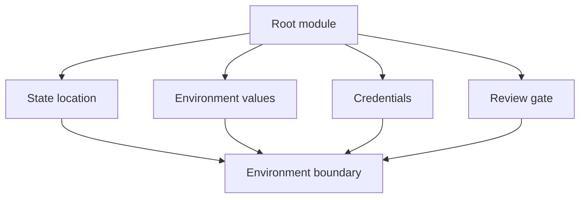

## Table of Contents

1. [The Problem](#the-problem)
2. [Root Modules](#root-modules)
3. [Environment Layout](#environment-layout)
4. [Separate State](#separate-state)
5. [Environment Values](#environment-values)
6. [Workspaces](#workspaces)
7. [Credentials](#credentials)
8. [Boundaries](#boundaries)
9. [Putting It All Together](#putting-it-all-together)
10. [What's Next](#whats-next)

## The Problem

The orders team has reusable modules now. They can call a private bucket module from a root module. The next question is where development, staging, and production should live.

At first, the team tries one directory with a variable:

```hcl
variable "environment" {
  type = string
}
```

That variable changes names and tags, but it does not solve the whole environment problem.

- The same state file might remember dev and prod resources together.
- The same credentials might be able to change every environment.
- A plan for a tiny dev change might include production resources.
- A directory named `prod` might still use a dev backend if the backend is misconfigured.

Environment boundaries are not created by names alone. They come from root module layout, state, variables, credentials, and review process working together.

## Root Modules

A root module is the directory Terraform runs from. It is the configuration boundary for a run. Terraform reads the top-level files in that directory, loads called child modules, uses the backend configured there, and writes state for the resources managed by that root module.

For the orders service, one root module might represent one environment:

```text
infra/orders/prod/
  backend.tf
  providers.tf
  main.tf
  variables.tf
  outputs.tf
  terraform.tfvars
```

If you run from this directory, this directory owns the run. Child modules may live elsewhere, but the root module decides which modules to call and which values to pass.

This matters because Terraform plans are scoped by root module and state. A clean root module should have an explainable job: "manage the production infrastructure for orders" or "manage the development infrastructure for orders." If the root module manages unrelated systems, every plan becomes harder to review.

## Environment Layout

A beginner-friendly layout makes the environment boundary visible on disk:

```text
infra/
  orders/
    dev/
      backend.tf
      main.tf
      terraform.tfvars
    staging/
      backend.tf
      main.tf
      terraform.tfvars
    prod/
      backend.tf
      main.tf
      terraform.tfvars
  modules/
    orders-service/
      main.tf
      variables.tf
      outputs.tf
```

Each environment directory is a root module. Each can call the same `orders-service` child module with different values:

```hcl
module "orders_service" {
  source = "../../modules/orders-service"

  environment           = "prod"
  invoice_bucket_name   = "dp-orders-invoices-prod"
  replica_count         = 3
  deletion_protection   = true
}
```

Development might pass `replica_count = 1` and `deletion_protection = false`. Production might pass stronger settings. The module pattern is shared, but the environment choices are explicit.

This layout is not the only valid one. Some teams split by account, platform layer, application, or region. The healthy property is that a reviewer can tell which real environment a root module can change.

## Separate State

Names and variables are not enough. The state boundary must also be separate.

If dev and prod share one state file, a plan for dev can still carry prod objects in the same managed map. That makes review harder and blast radius larger. A cleaner pattern gives each environment its own backend key, workspace, or remote state location.

For an S3 backend, the environment can be visible in the key:

```hcl
terraform {
  backend "s3" {
    bucket = "dp-terraform-state-prod"
    key    = "orders/prod/terraform.tfstate"
    region = "eu-west-2"
  }
}
```

The exact backend depends on your organization. The review question is stable: does this root module write to the state location intended for this environment?

State separation also helps with locks. A production apply should not wait for an unrelated development apply if they manage different infrastructure. At the same time, two production applies for the same root module should not race.

## Environment Values

Environment values should be visible and boring. A `terraform.tfvars` file can carry the choices for a root module:

```hcl
environment         = "prod"
aws_region          = "eu-west-2"
replica_count       = 3
deletion_protection = true
```

The key is not the filename. The key is reviewability. Production values should be easy to inspect in code review or controlled automation. Hidden shell variables can be useful for secrets or one-off overrides, but they are weak evidence for ordinary environment settings.

Use defaults carefully. A child module can default a safe setting. A production root module should not rely on accidental defaults for critical environment behavior. If production deletion protection matters, make it visible in the production root module or its values.

## Workspaces

Terraform CLI workspaces let one configuration use multiple state instances. They can be useful, especially for copies of the same configuration where the backend design supports that model.

The beginner trap is treating workspaces as a complete environment strategy. A workspace changes state selection. It does not automatically change credentials, provider account, backend bucket, variable values, approvals, or blast radius.

| Workspace use | Healthy? | Reason |
| --- | --- | --- |
| Temporary preview copies with clear automation | Often | The same shape can use separate state instances. |
| Dev and staging with strict variable and credential controls | Sometimes | The team must make all boundaries explicit. |
| Production hidden behind a local workspace switch | Risky | One forgotten selection can target the wrong state. |
| Separate accounts with different backend needs | Usually weak | Separate root modules are easier to review. |

Workspaces are a tool for multiple state instances. They are not a substitute for naming, credentials, values, backend design, and approval boundaries.

## Credentials

Environment separation also needs credential separation. A CI job for development should not casually have permission to change production. A local user planning staging should not accidentally apply production because one profile was set in a shell.

Provider credentials can come from environment variables, profiles, workload identity, OIDC, or platform-specific mechanisms. The exact mechanism depends on the provider and automation system. The healthy property is narrow authority.

Ask these questions during review:

| Credential question | Why it matters |
| --- | --- |
| Which account or project can this root module change? | It defines real blast radius. |
| Can this CI job write production? | Pull request checks often need less power than apply. |
| Are credentials stored outside `.tf` files? | Hardcoded secrets leak easily. |
| Is apply protected separately from plan? | Read evidence should not imply write access. |

Credentials are part of the environment boundary. If every root module uses the same broad admin credential, the directory structure is mostly decoration.

## Boundaries

A good environment boundary is made of several layers:



Names help humans. State stores managed memory. Values select environment behavior. Credentials decide what can really change. Review gates decide who approves.

For the orders service, production should be obvious from every layer: the path, backend key, variable values, credentials, CI workflow, and approval process. If any layer points somewhere else, the plan needs investigation.

## Putting It All Together

The orders team started with a variable named `environment`. That was not enough.

- A root module is the directory Terraform runs from.
- Environment layouts should make the change boundary visible.
- Each environment needs a clear state location.
- Environment values should be reviewable, not hidden in one laptop.
- Workspaces are state instances, not complete environment boundaries.
- Credentials define real authority.
- Healthy boundaries combine root module, state, values, credentials, and review.

Once those boundaries are clear, Terraform plans become easier to trust. A production plan should be production by path, state, values, credentials, and approval, not only by a string in a tag.

## What's Next

The next article covers importing existing resources. Many teams adopt Terraform after infrastructure already exists, so the question becomes how to bring real objects under management without recreating them.

---

**References**

- [Terraform files and configuration structure](https://developer.hashicorp.com/terraform/language/files)
- [Terraform backends](https://developer.hashicorp.com/terraform/language/backend)
- [Terraform workspace command](https://developer.hashicorp.com/terraform/cli/commands/workspace)
- [Terraform variables](https://developer.hashicorp.com/terraform/language/values/variables)
