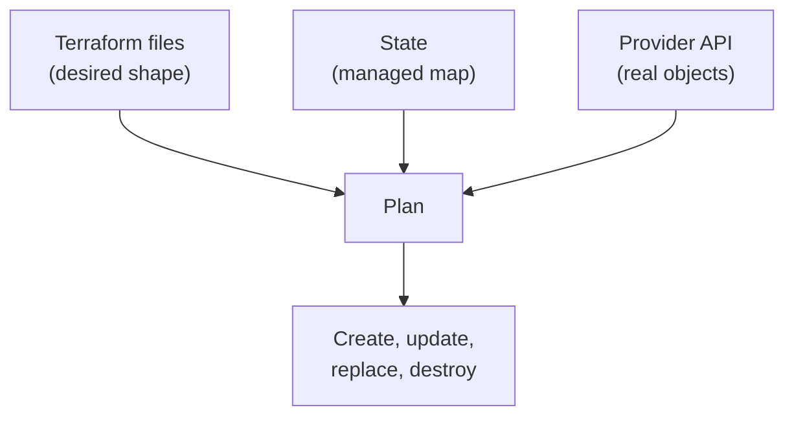
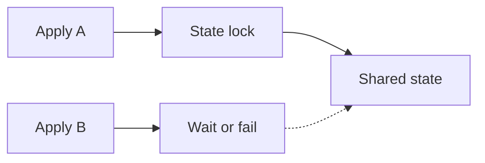

## Table of Contents

1. [The Problem](#the-problem)
2. [State](#state)
3. [Resource Addresses](#resource-addresses)
4. [Local State](#local-state)
5. [Backends](#backends)
6. [Locking](#locking)
7. [Sensitive State](#sensitive-state)
8. [Moving State](#moving-state)
9. [Putting It All Together](#putting-it-all-together)
10. [What's Next](#whats-next)

## The Problem

The orders team can now create an invoice bucket and control values cleanly. A new engineer clones the repository, runs `terraform plan`, and expects Terraform to know the bucket already exists.

That expectation is only partly right. The files describe the desired bucket. The provider can show real buckets. Terraform still needs its own memory that says, "this resource address in the files corresponds to this real bucket in AWS."

Without shared state, the team gets strange problems:

- One laptop thinks it created the bucket, but another laptop has no record of it.
- A resource is renamed in code and Terraform proposes a replacement.
- Two engineers run applies at the same time.
- A plan output hides a password, but the state file still stores sensitive values.

State, backends, and locking are Terraform's answer to those problems. State maps code to reality. A backend stores that map where the team can share it. Locking keeps two writers from editing the same managed infrastructure at once.

## State

Terraform state is the persisted record of the objects Terraform manages. It stores resource addresses, provider information, remote object IDs, attribute values, dependencies, outputs, and metadata Terraform uses for future plans.

The state is not the desired configuration. The `.tf` files describe the desired shape. State is the record that connects that desired shape to real provider objects.



For the invoice bucket, state might remember that `aws_s3_bucket.orders_invoices` points to the real bucket named `dp-orders-invoices-prod`. The next plan can then read the file, read the state, ask AWS about the bucket, and decide whether anything needs to change.

This is one of Terraform's most important hidden mechanics. The file alone does not tell Terraform which real object it already manages. State carries that relationship.

## Resource Addresses

A resource address is Terraform's name for a managed object. In this resource:

```hcl
resource "aws_s3_bucket" "orders_invoices" {
  bucket = "dp-orders-invoices-prod"
}
```

The address is `aws_s3_bucket.orders_invoices`. The real bucket name is `dp-orders-invoices-prod`. The address lives in Terraform configuration and state. The bucket name lives in AWS.

That distinction explains a common surprise. If a developer renames the resource to `aws_s3_bucket.invoice_documents`, Terraform may not understand that this is the same bucket with a nicer local name. From Terraform's point of view, one address disappeared and another appeared.

Modern Terraform and OpenTofu support moved blocks for many refactor cases. A moved block tells the tool that an address changed while the real object should remain the same:

```hcl
moved {
  from = aws_s3_bucket.orders_invoices
  to   = aws_s3_bucket.invoice_documents
}
```

The lesson is not "never rename." The lesson is that Terraform names are part of Terraform memory. Renames need state-aware migration, not casual text editing.

## Local State

Local state is the default beginner experience. Terraform writes a `terraform.tfstate` file in the working directory. That is useful for learning because everything is visible and local.

Local state becomes risky for team-owned infrastructure.

| Local state risk | Why it matters |
| --- | --- |
| Split memory | Two engineers can have different state files for the same environment. |
| Accidental commit | State can contain sensitive values and real infrastructure details. |
| No shared lock | Two applies can race if state is only local. |
| Laptop loss | The map between code and real objects can disappear with one machine. |

Local state is fine for a throwaway learning project. It is not a healthy home for production state. When infrastructure belongs to a team, the state should live in a backend designed for shared access, protection, and locking.

## Backends

A backend tells Terraform where to store state. The local backend stores state on disk. Remote backends store state in a service such as HCP Terraform, S3, GCS, Azure Blob Storage, Consul, or another supported backend.

A backend block sits inside the top-level `terraform` block:

```hcl
terraform {
  backend "s3" {
    bucket = "dp-terraform-state-prod"
    key    = "orders/prod/terraform.tfstate"
    region = "eu-west-2"
  }
}
```

The backend is part of the root module setup. When backend configuration changes, Terraform needs `init` again so the working directory knows where state lives.

Backends have a few non-obvious rules. A configuration can have only one backend block. Backend blocks cannot use normal input variables or local values. Backend credentials should not be hardcoded into configuration. HashiCorp also warns that backend configuration can be written into local metadata and plan files, so secrets in backend config are a leak risk.

For the orders team, the backend decision is an ownership decision. Production state should live where the platform team can protect it, back it up, restrict access, and audit use.

## Locking

Locking prevents two Terraform operations from writing the same state at the same time. Without locking, two engineers or CI jobs could both read the same old state, both plan changes, and both try to apply. The second writer may overwrite assumptions from the first.

The safe mental model is one writer at a time:



Different backends support locking differently. The important review habit is to know whether your backend protects state during apply and how operators should respond to lock conflicts.

A lock conflict is not usually an error to bulldoze through. It may mean another apply is active. The safe first response is to find the owner of the lock and understand whether work is still running. Force-unlocking is a recovery action for stale locks, not a normal workflow shortcut.

## Sensitive State

State can contain sensitive data. Marking a Terraform variable or output as sensitive can reduce display in CLI output, but state may still contain the underlying value or enough operational detail to be sensitive.

Examples include:

- Generated passwords or connection strings.
- Provider-returned secrets.
- Resource IDs and ARNs that reveal account structure.
- Backend configuration details.
- Output values used by downstream systems.

The practical rule is simple: protect state like production operational data. Restrict who can read it. Do not commit it. Do not paste it casually into tickets. Encrypt and back it up according to the backend's capabilities and the team's data policy.

Plan files also deserve care. Saved plans can contain configuration, variable values, state-derived data, and backend details. A plan artifact used for review should be stored with the same seriousness as other deployment evidence.

## Moving State

State movement happens when the team changes backends, renames resources, splits modules, imports existing objects, or removes objects from Terraform management.

The safest state movement is deliberate and reviewable:

| Change | Safer mechanism |
| --- | --- |
| Move local state to backend | Reinitialize and migrate state carefully |
| Rename resource address | Use moved blocks where appropriate |
| Adopt existing resource | Use import workflow and first-plan review |
| Stop managing a resource | Remove from state only when ownership is clear |
| Split a root module | Plan state boundaries before moving addresses |

Do not edit state by hand as a normal fix. Terraform provides state and import commands because the state format and provider relationships are easy to damage manually. If state work feels scary, that is a healthy signal. It is the map to real infrastructure.

## Putting It All Together

The orders team learned that Terraform needs more than files.

- State maps resource addresses to real provider objects.
- Resource addresses are part of Terraform memory, so renames need migration.
- Local state is fine for learning but weak for shared production infrastructure.
- Backends give the team a shared, protected home for state.
- Locking keeps overlapping applies from racing.
- State and saved plans can contain sensitive operational data.
- State movement should be planned, reviewed, and verified.

Once state makes sense, Terraform plans become easier to trust. The plan is not comparing files with vague reality. It is comparing files, state, and provider data through a managed map.

## What's Next

The next article focuses on reading Terraform plans in detail. You already know that plans are review evidence; now we will inspect Terraform-specific symbols, unknown values, replacements, destroys, and drift messages.

---

**References**

- [Terraform state](https://developer.hashicorp.com/terraform/language/state)
- [Terraform backends](https://developer.hashicorp.com/terraform/language/backend)
- [Terraform state locking](https://developer.hashicorp.com/terraform/language/state/locking)
- [Terraform moved blocks](https://developer.hashicorp.com/terraform/language/state/moved)
- [OpenTofu state](https://opentofu.org/docs/language/state/)
