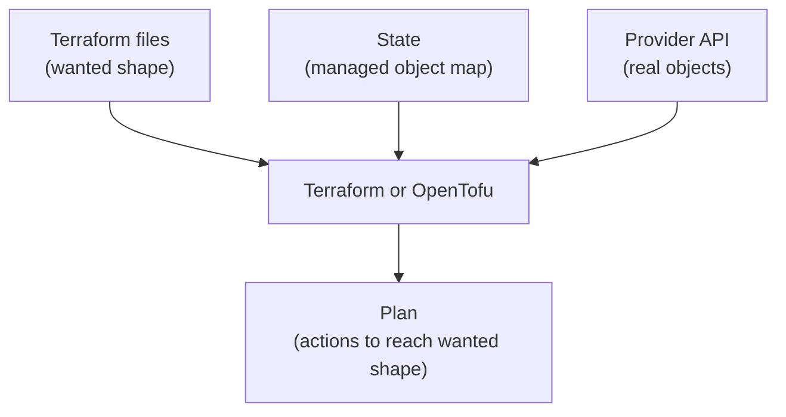

## Table of Contents

1. [Why Terraform Needs State](#why-terraform-needs-state)
2. [What State Connects Together](#what-state-connects-together)
3. [Local State Is a Learning Tool](#local-state-is-a-learning-tool)
4. [Backends: Where Team State Lives](#backends-where-team-state-lives)
5. [A Backend for devpolaris-orders](#a-backend-for-devpolaris-orders)
6. [Locking: One Writer at a Time](#locking-one-writer-at-a-time)
7. [Moving State Without Losing Ownership](#moving-state-without-losing-ownership)
8. [Sensitive Data in State](#sensitive-data-in-state)
9. [State Failure Modes and Repairs](#state-failure-modes-and-repairs)
10. [A State Routine for Small Teams](#a-state-routine-for-small-teams)

## Why Terraform Needs State

Infrastructure code gives the team a clear wanted shape, but the files are not enough on their own.
If `devpolaris-orders` has a bucket block called `aws_s3_bucket.orders_invoices`, Terraform also needs
to know which real bucket in AWS belongs to that block. The bucket name helps, but the provider may also
track an internal ID, region, ARN, default settings, dependency order, and values returned after creation.

State is Terraform's record of that mapping. It connects a resource address in your configuration to a
real object managed through a provider API. OpenTofu uses the same broad state model. Without state,
the tool can read the files, but it cannot reliably answer the question "is this object already the one
I manage, or should I create a new one?"

You already know a similar idea from application development. A database table may store an order ID,
customer ID, status, and timestamps. The API code knows what an order should look like, but the database
records which specific orders already exist. Terraform configuration is the code. Terraform state is
the operational record that says which remote objects are already under management.

For `devpolaris-orders`, the team starts with one invoice bucket. Later they add bucket versioning,
public access blocking, an IAM policy for the API, and a queue for invoice generation. State lets Terraform
keep those objects connected to their resource addresses across many plans and applies.



The important relationship is the triangle. Files alone do not prove reality. The provider alone does not
know your naming and ownership choices. State is the record that lets Terraform compare the two.

## What State Connects Together

Open a state file from a small learning project and it looks like JSON. You should not edit it by hand,
but it is useful to understand the kind of information it carries. The state file stores resource addresses,
provider information, remote object IDs, attribute values, dependencies, outputs, and metadata Terraform
uses during future plans.

A simplified state entry for the first bucket might look like this:

```json
{
  "resources": [
    {
      "type": "aws_s3_bucket",
      "name": "orders_invoices",
      "provider": "provider[\"registry.terraform.io/hashicorp/aws\"]",
      "instances": [
        {
          "attributes": {
            "bucket": "dp-orders-invoices-prod",
            "arn": "arn:aws:s3:::dp-orders-invoices-prod",
            "id": "dp-orders-invoices-prod",
            "tags": {
              "environment": "prod",
              "owner": "platform",
              "service": "orders-api"
            }
          }
        }
      ]
    }
  ]
}
```

The exact format can change between Terraform versions, and real state files contain more detail. The useful
point is the address-to-object link. `aws_s3_bucket.orders_invoices` is the address in the configuration.
`dp-orders-invoices-prod` is the remote object ID the provider uses. The next plan depends on that link.

That link is why simple renames are not always simple. If you rename the local resource from
`orders_invoices` to `invoice_documents`, Terraform may read that as one resource disappearing and another
appearing. The bucket in AWS did not vanish, but the address in state no longer matches the address in code.
Modern Terraform and OpenTofu support moved blocks for many rename cases, and import workflows help when
an existing object needs to come under management. The lesson for state is that names in code become part
of Terraform's memory.

State also carries dependency information. If the orders API role policy depends on the bucket ARN, Terraform
can use state and configuration to plan the policy after the bucket exists. The plan does not only ask
"what objects exist?" It asks "what is the safe order for the changes I need?"

```hcl
resource "aws_s3_bucket" "orders_invoices" {
  bucket = "dp-orders-invoices-prod"
}

resource "aws_iam_policy" "orders_invoice_writer" {
  name = "orders-api-write-invoices"

  policy = jsonencode({
    Version = "2012-10-17"
    Statement = [
      {
        Effect = "Allow"
        Action = ["s3:PutObject"]
        Resource = "${aws_s3_bucket.orders_invoices.arn}/*"
      }
    ]
  })
}
```

The policy resource references the bucket ARN. Terraform can see that reference and order the work. State
helps future runs remember which bucket ARN was created and which policy is already attached to the address
in the files.

## Local State Is a Learning Tool

When you run Terraform in a new directory without configuring a backend, Terraform uses the local backend.
That usually creates a `terraform.tfstate` file in the working directory. For one person learning on a
disposable account, local state is convenient because there is no storage system to set up first.

A learning directory might look like this after the first apply:

```text
infra/
  .terraform/
  .terraform.lock.hcl
  main.tf
  outputs.tf
  terraform.tfstate
  versions.tf
```

The `.terraform.lock.hcl` file belongs in Git because it records provider selections and checksums. The
`.terraform/` directory does not belong in Git because it is local working data. The `terraform.tfstate`
file deserves more care. Treat it as operational data rather than source code.

Local state becomes a problem the moment two people need to work on the same infrastructure. Imagine that
Mira adds bucket versioning from her laptop while Jamal adds an IAM policy from his laptop. If each person
has a different local state file, each plan is based on an incomplete memory of the real system.

```text
Mira's laptop:
  state knows about bucket only
  plan adds versioning

Jamal's laptop:
  state knows about bucket only
  plan adds IAM policy

Shared AWS account:
  bucket, versioning, and policy must become one managed system
```

If they both apply from separate local state files, the state records can diverge. One file may know about
versioning but not the policy. Another may know about the policy but not versioning. The cloud account may
contain both. Future plans become harder to trust because the tool's memory is split across laptops.

Local state also creates backup and security concerns. A laptop can be lost. A file can be deleted. State
can include sensitive values depending on the provider and resource. Git is not a good fix because state
changes often and can expose data that should not be in repository history.

For practice, local state is fine. For a team target, move state to a backend before the infrastructure
matters.

## Backends: Where Team State Lives

A backend tells Terraform where state is stored and how Terraform should access it. The local backend stores
state on disk. Remote backends store state somewhere shared, such as object storage or a Terraform service.
OpenTofu uses similar backend concepts.

Backends solve three practical team problems:

| Problem | Backend Benefit |
|---------|-----------------|
| State only exists on one laptop | State lives in shared storage. |
| Two people apply at the same time | Locking can allow one writer at a time. |
| State contains operational data | Access can follow cloud IAM, encryption, and audit logs. |

The backend is configured in the `terraform` block. Backend configuration is intentionally separate from
normal input variables because Terraform needs backend information before it can load the rest of the working
directory. That can surprise beginners who expect to use ordinary variables inside backend blocks.

The most common beginner-friendly backend pattern in AWS is S3 for storage plus a locking mechanism supported
by the backend. Azure teams often use the `azurerm` backend with Azure Blob Storage. GCP teams often use the
`gcs` backend with Cloud Storage. The specific backend should match the platform your team already operates.

```text
Platform team choice:
  AWS account for devpolaris infrastructure
  S3 bucket stores state objects
  State key per environment
  Locking enabled by the backend
  IAM restricts who can read and write state
```

The backend should be boring and protected. It is the place Terraform depends on before it can safely manage
anything else. Do not put state storage in a disposable sandbox unless the infrastructure it manages is also
disposable.

There is one practical ordering issue: the backend storage usually has to exist before Terraform can use it.
Many teams create the state bucket through a small bootstrap process, a separate root module, or a platform
foundation stack. Avoid a circular setup where the state bucket for a root module is managed only by the
same state file that needs that bucket to exist first.

## A Backend for devpolaris-orders

For `devpolaris-orders`, suppose the platform team has already created a protected S3 bucket for Terraform
state in the production AWS account. The orders Terraform root module can then store its state under a key
that names the service and environment.

```hcl
terraform {
  backend "s3" {
    bucket = "dp-terraform-state-prod"
    key    = "devpolaris-orders/prod/terraform.tfstate"
    region = "eu-west-2"
  }
}
```

The `bucket` is where state is stored. The `key` is the object path inside that bucket. The `region` tells
Terraform where to find the bucket. Real teams often pass some backend values through `-backend-config`
files or CLI arguments so the same root module can be initialized for different environments without copying
the entire configuration.

For example, a development backend config file might contain:

```hcl
bucket = "dp-terraform-state-dev"
key    = "devpolaris-orders/dev/terraform.tfstate"
region = "eu-west-2"
```

Then initialization can load that file:

```bash
$ terraform init -backend-config=backend.dev.hcl
```

The production equivalent would use a production state bucket and production key. That separation matters
because development state should not know about production resources. A plan from the development root module
should not be able to destroy the production invoice bucket by accident.

The backend key should be stable and specific. A key like `terraform.tfstate` is too broad when many services
share one state bucket. A key like `devpolaris-orders/prod/terraform.tfstate` tells a future operator which
service and environment the state belongs to.

```text
Good state object layout:
  devpolaris-orders/dev/terraform.tfstate
  devpolaris-orders/staging/terraform.tfstate
  devpolaris-orders/prod/terraform.tfstate
  devpolaris-billing/prod/terraform.tfstate

Risky state object layout:
  terraform.tfstate
  prod.tfstate
  latest.tfstate
```

The risky names are not wrong because Terraform rejects them. They are risky because humans need to operate
this system during reviews, incidents, and cleanup. Names that hide service and environment increase the
chance of pointing a command at the wrong state.

OpenTofu has the same general idea:

```bash
$ tofu init -backend-config=backend.dev.hcl
```

The command initializes the working directory against the selected backend. After initialization, future
plans and applies read and write state through that backend instead of a local `terraform.tfstate` file.

## Locking: One Writer at a Time

Locking protects state during operations that write to it. A lock says, in effect, "one Terraform or OpenTofu
run is currently changing this state, so another writer must wait or fail." The lock does not make the cloud
change risk-free, but it prevents two applies from updating the same state record at the same time.

The race condition is easy to picture. Two engineers plan against the same current state. One adds bucket
versioning. The other changes the bucket tags. Both applies start within seconds.

```text
10:00:00  Mira starts terraform apply for versioning
10:00:03  Jamal starts terraform apply for tag changes
10:00:06  Mira writes updated state
10:00:08  Jamal writes updated state from an older view
```

Without locking, the last writer can overwrite state with a view that misses the other change. The real cloud
objects may still have both updates, but Terraform's state may not describe them correctly. Future plans then
start from an unreliable record.

With locking, Jamal's run should wait or fail while Mira's apply holds the lock:

```text
Error: Error acquiring the state lock

Lock Info:
  ID:        5f3b65a1-89c1-6d57-7bb1-0a9f4fb8ad5b
  Path:      dp-terraform-state-prod/devpolaris-orders/prod/terraform.tfstate
  Operation: OperationTypeApply
  Who:       mira@example.com
```

The useful details are the operation, the state path, and who appears to hold the lock. Before doing anything
else, check whether that run is still active. A lock during an apply is normal. A lock left behind after a
crashed process is a cleanup task.

Some commands expose lock-related options such as lock timeout. A timeout lets a run wait for the lock instead
of failing immediately:

```bash
$ terraform apply -lock-timeout=5m
```

That flag is helpful in CI where two pull requests may queue close together for the same environment. It is
not a permission slip to ignore why a lock exists. If production applies are regularly waiting on each other,
the team may need clearer apply scheduling or smaller state boundaries.

Terraform also has a force-unlock command for cases where a lock is truly stale. Use it only after confirming
that no run is still active. Forcing a lock away while another apply is running brings back the same race the
lock was preventing.

```bash
$ terraform force-unlock 5f3b65a1-89c1-6d57-7bb1-0a9f4fb8ad5b
```

Treat that command like editing a production database row. It can be correct, but the operator should know
why it is safe at that moment.

## Moving State Without Losing Ownership

Moving from local state to a backend is a normal step when a project becomes shared. Terraform handles the
migration during initialization when the backend configuration changes. The command will ask whether to copy
existing local state to the new backend.

Suppose the local `devpolaris-orders` directory already manages the invoice bucket. The team adds the S3
backend block and runs:

```bash
$ terraform init -migrate-state
```

Terraform should detect that the backend changed and ask to migrate the existing state. The exact wording
depends on version and backend, but the decision is important: you want to copy the current state record to
the backend so Terraform keeps ownership of the already managed bucket.

A careful migration routine looks like this:

```text
Before migration:
  1. Confirm no one else is applying this root module.
  2. Back up the local terraform.tfstate file.
  3. Add backend configuration.
  4. Run terraform init -migrate-state.
  5. Run terraform plan and expect no unexpected changes.
```

The follow-up plan is the proof. If the state moved correctly and the configuration did not change, Terraform
should not suddenly want to recreate the bucket. If the plan wants to create resources that already exist,
stop and inspect the state/backend setup before applying.

```text
Expected after state migration:
  No changes. Your infrastructure matches the configuration.

Suspicious after state migration:
  Plan: 3 to add, 0 to change, 0 to destroy.
```

The suspicious plan means Terraform may not be reading the state that already knows about the real objects.
Applying at that point can produce duplicate resources, name collisions, or confusing import work. Fix the
state connection first.

State movement can also happen inside a root module when resource addresses change. For example, moving a
bucket into a child module changes the address from `aws_s3_bucket.orders_invoices` to something like
`module.storage.aws_s3_bucket.orders_invoices`. Use a moved block when the object is the same and only the
address changes.

```hcl
moved {
  from = aws_s3_bucket.orders_invoices
  to   = module.storage.aws_s3_bucket.orders_invoices
}
```

That tells Terraform the existing object should follow the address change instead of being destroyed and
recreated. The plan should then show the move rather than a delete and create. This is a state-aware refactor,
not just a file reorganization.

## Sensitive Data in State

State can contain sensitive data. The exact contents depend on the resource and provider, but you should
assume state may include secrets, generated passwords, private connection strings, access tokens, or sensitive
configuration values returned by provider APIs.

This surprises many beginners because Terraform plan output can hide sensitive values:

```text
  + password = (sensitive value)
```

Plan redaction protects the terminal output. It does not mean the value can never appear in state. Terraform
often needs the real value in state so it can compare future changes or update the remote object correctly.

For `devpolaris-orders`, imagine an early database experiment:

```hcl
resource "aws_db_instance" "orders" {
  identifier = "devpolaris-orders-prod"
  username   = "orders_admin"
  password   = var.database_password
}
```

Even if `var.database_password` is marked sensitive, the provider may store enough information in state that
the state backend must be protected like a secret store. The better habit is to avoid managing raw long-lived
secrets in Terraform when a dedicated secrets manager or generated secret workflow is a better fit. When
Terraform must touch sensitive values, protect the state backend accordingly.

State protection usually includes these controls:

| Control | Why It Matters |
|---------|----------------|
| Restricted read access | Reading state can reveal sensitive attributes. |
| Restricted write access | Writing state can change Terraform's view of ownership. |
| Encryption at rest | Stored state should not be plain data on an unprotected disk. |
| Audit logs | The team should know who accessed or changed state. |
| Versioning or backups | Accidental state damage needs a recovery path. |

Do not email state files, paste them into chat, attach them to tickets, or commit them to Git to "share the
latest copy." If someone needs state access, give them access through the backend with the same identity and
audit model the team uses for other production data.

Saved plan files deserve similar care. A plan file can contain values Terraform needs for apply, and those
values may include sensitive data. Keep saved plans short-lived and out of source control.

## State Failure Modes and Repairs

State problems usually show up as confusing plans. The plan wants to create an object that already exists,
destroy something the team still uses, or change resources that the pull request did not touch. The response
is to find which of the three views is wrong: configuration, state, or provider reality.

Here is a common local-state mistake:

```text
Error: creating S3 Bucket (dp-orders-invoices-prod): BucketAlreadyOwnedByYou
```

The bucket exists in the AWS account, but Terraform is trying to create it. That often means the current
state does not know it manages the bucket. Maybe the wrong backend key is selected. Maybe the local state file
was deleted. Maybe the bucket was created manually and never imported.

Start with low-risk inspection:

```bash
$ terraform state list
```

Expected output for the orders bucket might include:

```text
aws_s3_bucket.orders_invoices
aws_s3_bucket_public_access_block.orders_invoices
aws_s3_bucket_versioning.orders_invoices
```

If the bucket address is missing, Terraform does not currently have that object in state. The fix may be to
switch to the correct backend, restore state from a backup, or import the existing bucket into the intended
address. Do not apply a create plan until you understand why state does not show the object.

Another failure shape is a backend mismatch. A CI job may accidentally initialize production code against a
development backend key. The plan then looks like Terraform has never seen production resources before.

```text
Initializing the backend...

Successfully configured the backend "s3"!

Plan: 12 to add, 0 to change, 0 to destroy.
```

If the production root module has existed for months, `12 to add` should look suspicious. Check the backend
bucket, key, workspace, credentials, and environment variables before applying. A wrong backend can make a
valid configuration look empty.

State can also be damaged by manual edits. Editing the JSON file directly may seem tempting during an outage,
but it bypasses Terraform's safety checks and format expectations. Prefer Terraform state commands, import,
moved blocks, backend backups, and provider-supported recovery paths.

Use this quick diagnosis map:

| Symptom | Likely Area | First Inspection |
|---------|-------------|------------------|
| Create fails because object already exists | State missing ownership | `terraform state list` and backend config |
| Plan wants many unexpected additions | Wrong backend or empty state | Backend bucket, key, workspace, credentials |
| Plan wants replacement after a rename | Address changed | Moved block or state move review |
| Lock error remains after crash | Stale lock | Confirm no active run, then force unlock if safe |
| Sensitive value appears in copied state | State handling mistake | Rotate exposed value and restrict backend access |

The best repair is usually the one that preserves the true ownership relationship. If Terraform already owns
the real bucket, reconnect state to that fact. If Terraform never owned the bucket, decide whether import is
appropriate. If another team owns the bucket, reference it as external data instead of quietly adopting it.

## A State Routine for Small Teams

A small team does not need an elaborate process to handle state well. It needs a few reliable habits that
make the safe path the normal path.

For `devpolaris-orders`, a practical routine could look like this:

```text
State storage:
  Remote backend per environment.
  State key includes service and environment.
  Backend storage has encryption, versioning, and restricted access.

Apply behavior:
  CI and humans use the same backend config for the target environment.
  Locking is enabled where the backend supports it.
  Production applies do not run in parallel for the same state.

Change review:
  Pull request explains expected plan counts.
  Reviewer checks state-sensitive actions such as moves, imports, and replacements.
  Follow-up plan after apply should be quiet or explained.

Recovery:
  State backend has backups or object versioning.
  Force unlock requires proof that no active run still owns the lock.
  State files and saved plans are never committed, emailed, or pasted into tickets.
```

This routine keeps the state problem small enough to operate. The team knows where state lives, who can touch
it, how concurrent applies are prevented, and what evidence proves a migration or apply finished cleanly.

When the root module grows too large, state boundaries may need to change. A single state file for every
resource in every environment creates a wide blast radius. A separate state file for every tiny resource
creates dependency overhead. The useful middle ground is ownership-based: group resources that change
together, are reviewed by the same team, and can be safely planned together.

For the orders service, one state per environment is a good early shape:

```text
devpolaris-orders/dev
devpolaris-orders/staging
devpolaris-orders/prod
```

Shared networking, shared identity, and organization-level logging may belong in separate platform state
because they affect more than one service. The boundary should match operational responsibility, not only
directory preference.

The final check before applying any shared Terraform change is simple to say and serious to follow: make
sure you are using the right backend, the right state key, the right credentials, and the right environment.
Many Terraform mistakes begin before the plan, with a working directory pointed at the wrong memory.

---

**References**

- [Terraform State](https://developer.hashicorp.com/terraform/language/state) - Explains why Terraform stores state and how it maps configuration to remote objects.
- [Terraform Backends](https://developer.hashicorp.com/terraform/language/backend) - Documents backend configuration and why state storage is selected during initialization.
- [Terraform S3 Backend](https://developer.hashicorp.com/terraform/language/backend/s3) - Shows the S3 backend configuration options used by many AWS teams.
- [Terraform State Locking](https://developer.hashicorp.com/terraform/language/state/locking) - Describes how locking prevents concurrent state writes during operations.
- [OpenTofu State](https://opentofu.org/docs/language/state/) - Provides the OpenTofu view of state, storage, and collaboration.
- [OpenTofu Backend Configuration](https://opentofu.org/docs/language/settings/backends/configuration/) - Explains how OpenTofu backend blocks store state and support team collaboration.
