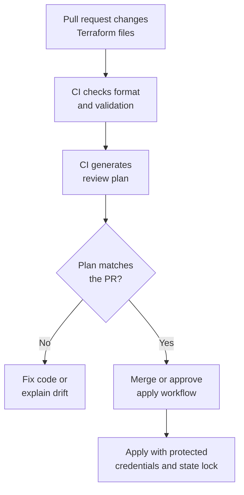

## Table of Contents

1. [Why Terraform Belongs in CI](#why-terraform-belongs-in-ci)
2. [The CI Runner Is Another Operator](#the-ci-runner-is-another-operator)
3. [Pull Request Checks](#pull-request-checks)
4. [Plans, Saved Plans, and Apply](#plans-saved-plans-and-apply)
5. [Credentials, Backends, and Locks](#credentials-backends-and-locks)
6. [A Beginner-Safe GitHub Actions Workflow](#a-beginner-safe-github-actions-workflow)
7. [Reading CI Output Like a Reviewer](#reading-ci-output-like-a-reviewer)
8. [Common Terraform CI Failures](#common-terraform-ci-failures)
9. [Choosing Automation Boundaries](#choosing-automation-boundaries)

## Why Terraform Belongs in CI

Infrastructure pull requests are hard to review from file diffs alone. A small change to one variable can create a database replacement. A provider upgrade can change a default. A new module input can affect more resources than the author expected. The reviewer needs tool evidence, not only a description from the author.

Terraform in CI means a repeatable runner checks the Terraform directory whenever a pull request changes it. The runner formats, validates, initializes providers, and generates a plan for review. In OpenTofu repositories, the same idea uses `tofu` commands instead of `terraform` commands.

This workflow exists because one person's laptop is a weak place to hold infrastructure truth. A laptop may have old providers, stale credentials, a different workspace, or an uncommitted file. CI gives the team one repeatable place to ask, "What would this change do if we ran it against the target environment?"

CI fits between code review and apply. It does not replace human judgment. It gives the reviewer plan evidence, command output, and status checks so the review can focus on risk: what changes, what could be damaged, and whether the proposed change matches the pull request.

The running example is `devpolaris-orders`. The service has a Terraform root module at `infra/orders/prod`. A pull request adds lifecycle rules to the production invoice bucket, so old generated invoice PDFs move to colder storage after the team's retention window. The team wants CI to prove the Terraform files are valid and show the plan before anyone applies the change.



That diagram shows the boundary clearly. CI does not make the change safe by existing. CI produces evidence. The team still reads the evidence.

## The CI Runner Is Another Operator

When CI runs Terraform, the runner is acting like an operator. It has a working directory, environment variables, provider plugins, credentials, network access, and a backend connection. If any of those differ from the real apply environment, the plan may mislead the reviewer.

Start with the working directory. Terraform runs in a root module, which is the directory containing the `.tf` files for that target. If the repository has multiple environments, CI must run the command in the right directory:

```text
devpolaris-orders/
  src/
  infra/
    orders/
      dev/
        main.tf
      staging/
        main.tf
      prod/
        main.tf
```

A pull request for production should not accidentally run a development plan. The path matters because each root module may use a different backend, variables file, and provider configuration.

The runner also needs the same dependency discipline as a laptop. `terraform init` downloads providers and reads the dependency lock file. The `.terraform.lock.hcl` file should be committed so CI and developers use the same provider selections unless the pull request intentionally updates them.

Here is a normal CI setup sequence:

```bash
$ terraform -chdir=infra/orders/prod init -input=false
$ terraform -chdir=infra/orders/prod fmt -check
$ terraform -chdir=infra/orders/prod validate
$ terraform -chdir=infra/orders/prod plan -input=false
```

The `-chdir` flag tells Terraform which root module to use. The `-input=false` flag prevents Terraform from waiting for interactive input that a CI runner cannot provide. In a CI job, a prompt is not a friendly pause. It is a stuck job.

OpenTofu follows the same shape:

```bash
$ tofu -chdir=infra/orders/prod init -input=false
$ tofu -chdir=infra/orders/prod fmt -check
$ tofu -chdir=infra/orders/prod validate
$ tofu -chdir=infra/orders/prod plan -input=false
```

Treat the runner as a real participant in the workflow. Give it only the permissions it needs, make its target directory explicit, and make every command non-interactive.

## Pull Request Checks

A good Terraform pull request job starts with mechanical checks. Mechanical checks are valuable because they keep humans focused on infrastructure judgment instead of syntax and formatting.

The first check is formatting:

```bash
$ terraform -chdir=infra/orders/prod fmt -check
```

In CI, `fmt -check` does not rewrite files. It fails if a file needs formatting. That is the right behavior for a pull request because the branch should contain the formatted source.

A formatting failure looks like this:

```text
main.tf

Error: Terraform exited with code 3.
```

The fix is not an infrastructure decision. Run `terraform fmt`, commit the result, and let CI focus on the next check.

The second check is validation:

```bash
$ terraform -chdir=infra/orders/prod validate
Success! The configuration is valid.
```

Validation checks whether Terraform can understand the configuration after initialization. It catches missing arguments, invalid references, wrong block shapes, and other configuration problems. It does not prove the cloud provider will accept the plan. It is still worth running because invalid configuration cannot produce a useful review plan.

The third check is the plan:

```bash
$ terraform -chdir=infra/orders/prod plan -input=false
```

For the lifecycle rule change, the plan might show:

```text
  # aws_s3_bucket_lifecycle_configuration.orders_invoices will be created
  + resource "aws_s3_bucket_lifecycle_configuration" "orders_invoices" {
      + bucket = "dp-orders-invoices-prod"

      + rule {
          + id     = "archive-old-invoices"
          + status = "Enabled"
        }
    }

Plan: 1 to add, 0 to change, 0 to destroy.
```

That is useful review evidence. The pull request says "add lifecycle configuration." The plan says one lifecycle configuration will be created and no existing resources will be destroyed. A reviewer still needs to check whether the lifecycle rule is correct, but the plan shape matches the intent.

Many teams add policy checks, security scans, or cost estimation around the plan. Those can be helpful, but they should not hide the basic Terraform loop. A beginner-friendly first version is format, init, validate, plan, then human review.

## Plans, Saved Plans, and Apply

Plans in CI come in two common forms. A speculative plan is a preview for review. It answers, "What does Terraform think this pull request would do right now?" A saved plan is written to a file and can later be passed to apply so Terraform applies exactly the actions captured in that file.

A speculative plan is enough for many pull requests:

```bash
$ terraform -chdir=infra/orders/prod plan -input=false
```

The word speculative matters because the world can change after the plan runs. Another teammate may apply a different change. Someone may edit a resource manually. The provider may return updated remote data. A green plan on Monday morning does not guarantee the same apply is safe on Tuesday afternoon.

A saved plan uses `-out`:

```bash
$ terraform -chdir=infra/orders/prod plan -input=false -out=tfplan
```

The apply step can then use that exact plan file:

```bash
$ terraform -chdir=infra/orders/prod apply -input=false tfplan
```

Saved plans are useful when the plan and apply happen close together in a controlled workflow. They are not ordinary build artifacts to share casually. Plan files can contain sensitive data and are tied to the configuration, state, provider selections, and environment used when they were created.

If the team wants machine-readable plan output, Terraform can render a saved plan as JSON:

```bash
$ terraform -chdir=infra/orders/prod show -json tfplan
```

Policy tools and custom checks often read that JSON. A human reviewer usually needs a readable summary too. Do not replace the plan explanation with a huge JSON blob in the pull request.

The safest early team boundary is:

```text
Pull request:
  fmt, validate, speculative plan, review

Protected apply workflow:
  checkout reviewed commit, init, final plan, approval, apply, verify
```

That separation keeps pull requests useful without giving every branch the ability to change production. It also lets the final apply re-check reality close to the moment of change.

OpenTofu supports the same practical split: plan for review, saved plan when needed, and apply only in the protected context your team chooses.

## Credentials, Backends, and Locks

Terraform CI touches real infrastructure data even when it only runs a plan. The runner may need permission to read resources, read and lock state, and sometimes read secrets from the provider. Treat those permissions as production access, not as a harmless build token.

The backend is where state lives. In team workflows, state should usually live in a remote backend with access control and locking. A lock prevents two Terraform runs from writing the same state at the same time. Without locking, two applies can race and leave the state file out of sync with reality.

The failure shape is easy to imagine:

```text
10:00 CI apply starts for invoice lifecycle rule.
10:01 Engineer runs local apply for bucket tags.
10:02 Both runs read old state.
10:03 Both runs write different updates.
10:04 The state no longer tells a clean story.
```

Locking turns that race into a wait or failure:

```text
Error: Error acquiring the state lock

Lock Info:
  ID:        9d8f7d4c-2a40-4c7e-96b2-0a2c2b25c111
  Operation: OperationTypeApply
  Who:       github-actions@devpolaris-orders
```

That error is protective. It says another run is already operating on the same state. The right response is to identify the active run, wait for it to finish, or follow the team's lock recovery runbook if a run died while holding the lock.

Credentials deserve the same care. Avoid long-lived cloud access keys stored as plain repository secrets when a short-lived identity option is available. Many CI platforms can request temporary credentials from a cloud provider based on repository, branch, workflow, or environment rules. The exact setup is provider-specific, but the goal is simple: the runner gets a short-lived identity for the exact job it needs to perform.

For `devpolaris-orders`, a pull request plan identity might be allowed to read state and describe resources, but not apply changes. A production apply identity might be available only in a protected workflow after approval.

| Identity | Allowed Work | Reason |
|----------|--------------|--------|
| PR plan | Init, validate, read state, read resources, create plan | Gives reviewers evidence without changing infrastructure. |
| Prod apply | Final plan, apply, read verification data | Changes production only in a protected workflow. |
| Local developer | Dev environment work and read-only prod checks | Keeps production changes out of casual laptop commands. |

The exact permissions depend on your provider and backend. The shape should stay small: give CI enough access to do the job, and no more.

## A Beginner-Safe GitHub Actions Workflow

GitHub Actions is a common place to run Terraform checks because many teams already review pull requests there. The same structure can be translated to GitLab CI, Jenkins, Buildkite, Azure Pipelines, or another CI system.

Here is a compact pull request workflow for `devpolaris-orders`. It runs checks only for the production Terraform root module:

```yaml
name: terraform-prod-checks

on:
  pull_request:
    paths:
      - "infra/orders/prod/**"

permissions:
  contents: read

jobs:
  terraform:
    runs-on: ubuntu-latest
    defaults:
      run:
        shell: bash

    steps:
      - name: Checkout
        uses: actions/checkout@v6

      - name: Set up Terraform
        uses: hashicorp/setup-terraform@v4

      - name: Init
        run: terraform -chdir=infra/orders/prod init -input=false

      - name: Format check
        run: terraform -chdir=infra/orders/prod fmt -check

      - name: Validate
        run: terraform -chdir=infra/orders/prod validate

      - name: Plan
        run: terraform -chdir=infra/orders/prod plan -input=false
```

This workflow is intentionally modest. It checks one directory. It does not auto-apply. It does not post a giant plan comment. It does not try to solve every policy problem on day one. A team can add those pieces after the basic workflow is understood and trusted.

The `uses` lines are pinned to major versions so the workflow does not float silently from one action generation to another. In a real repository, your team should review those pins and update them deliberately. The `paths` filter keeps the job focused on Terraform changes. The `permissions` block limits the default GitHub token to reading repository contents. Cloud credentials are not shown here because each team should wire them through its chosen provider identity method rather than copying static keys into the example.

If the repository uses OpenTofu, the same idea can use a setup action chosen by the team and `tofu` commands:

```yaml
      - name: Init
        run: tofu -chdir=infra/orders/prod init -input=false

      - name: Format check
        run: tofu -chdir=infra/orders/prod fmt -check

      - name: Validate
        run: tofu -chdir=infra/orders/prod validate

      - name: Plan
        run: tofu -chdir=infra/orders/prod plan -input=false
```

The exact CI syntax matters less than the operating rule: every pull request should produce the same checks from a clean runner, with explicit target directory and non-interactive commands.

## Reading CI Output Like a Reviewer

A Terraform CI job is only useful if people read the output. A green checkmark means the commands exited successfully. It does not mean the change is wise.

Start with the job list:

```text
terraform-prod-checks
  Init          passed
  Format check  passed
  Validate      passed
  Plan          passed
```

That tells you the workflow completed. It does not tell you what the plan proposed. Open the plan step and look for the summary:

```text
Plan: 1 to add, 0 to change, 0 to destroy.
```

Compare that with the pull request description. If the description says "add lifecycle rule for old invoices", one addition may fit. If the plan says `0 to add, 4 to change, 1 to destroy`, the author needs to explain the extra work.

A useful pull request comment from the author might be:

```text
Expected:
- Add lifecycle configuration for dp-orders-invoices-prod.
- No bucket replacement.
- No IAM changes.

CI plan:
- 1 to add: aws_s3_bucket_lifecycle_configuration.orders_invoices.
- 0 to change.
- 0 to destroy.
```

That summary is not ceremony. It helps the reviewer compare intent with evidence quickly. It also gives future maintainers context when they look back at why the change was approved.

Scan for hidden risk in the plan body. Pay extra attention to:

| Plan Area | Review Question |
|-----------|-----------------|
| Destroy or replace actions | Is data, DNS, networking, or identity affected? |
| IAM changes | Does the permission widen beyond the service need? |
| Public access fields | Does a private service become reachable from the internet? |
| Provider or module upgrades | Did dependency changes bring unrelated infrastructure changes? |
| Unknown values | Are the unknown values normal provider-computed fields or risky missing inputs? |

If the plan fails, read the first meaningful error, not only the final exit code. Terraform errors usually name the stage: init, validate, plan, state lock, provider authentication, or provider API call. That stage tells you where to look next.

## Common Terraform CI Failures

The first common failure is an interactive prompt. CI jobs cannot answer questions:

```text
var.environment
  Enter a value:
```

The fix is to pass required variables through files, environment variables, or the CI platform's secure inputs, and to use `-input=false` so missing values fail clearly instead of hanging.

The second common failure is missing backend configuration:

```text
Error: Backend initialization required, please run "terraform init"
```

In CI, every job starts on a clean runner. It does not remember that you ran `init` on your laptop. Add an init step before validate and plan. If the backend needs configuration, provide it through the repository's normal environment-specific path.

The third common failure is provider dependency drift:

```text
Error: Inconsistent dependency lock file

The following dependency selections recorded in the lock file are inconsistent
with the current configuration.
```

This usually means the provider constraints changed but the lock file was not updated, or the lock file changed without the configuration explaining why. Run init in the right directory, review the lock file diff, and commit it if the provider selection change is intentional.

The fourth common failure is missing cloud credentials:

```text
Error: No valid credential sources found
```

The runner reached a stage where the provider needed authentication. Check whether the job has the right identity for the target environment. Do not fix this by pasting personal credentials into the Terraform files. The CI identity should be deliberate and limited.

The fifth common failure is a state lock conflict:

```text
Error: Error acquiring the state lock
```

Find the active Terraform run before doing anything else. A lock conflict often means another CI job or engineer is already planning or applying against the same state. Waiting is safer than forcing unlock without understanding the active operation.

The sixth common failure is an unsafe plan:

```text
Plan: 0 to add, 2 to change, 1 to destroy.
```

That is not a tool failure, but it should block review if the pull request did not explain it. The author should either change the Terraform files, split the pull request, or explain why the destroy is expected and how the team will verify recovery.

## Choosing Automation Boundaries

The hardest Terraform CI decision is how far automation should go. A plan on every pull request is usually helpful. Automatic production apply on every merge is a bigger decision because the runner can change real infrastructure without a person reading the final plan at the moment of apply.

For a small team learning Terraform, a safer first boundary is manual apply from a protected workflow. The workflow runs only from the main branch, targets one environment, uses a restricted identity, acquires the state lock, generates a final plan, waits for approval, applies, and runs verification commands.

For `devpolaris-orders`, the protected apply checklist might be:

```text
Before apply:
- Pull request merged into main.
- CI plan matched the reviewed change.
- Final plan generated from the merged commit.
- State lock acquired.
- Production apply approval recorded.

After apply:
- Terraform reports expected resource counts.
- Invoice bucket lifecycle configuration is visible through provider read command.
- Follow-up plan shows no unexpected changes.
```

Teams with stronger guardrails may automate more. They might auto-apply development after merge, require approval for staging, and require a separate production release workflow. Teams with strict change windows may generate plans in CI but apply only during scheduled operations.

The tradeoff is speed versus control:

| Boundary | What You Gain | What You Give Up |
|----------|---------------|------------------|
| PR plan only | Review evidence with low change risk | A person or workflow still performs apply later. |
| Auto-apply dev | Fast feedback on disposable infrastructure | Bad changes can still break shared dev resources. |
| Manual prod apply | Human check close to production change | Slower releases and more coordination. |
| Auto-apply prod | Fastest path from merge to infrastructure change | Requires strong policy, testing, rollback, and trust in the workflow. |

Pick the smallest boundary that your team can operate well. Terraform in CI is successful when the team can answer the same questions every time: which directory ran, which identity ran it, which state was used, what the plan proposed, who approved apply, and what verification proved afterward.

---

**References**

- [Terraform running in automation](https://developer.hashicorp.com/terraform/tutorials/automation/automate-terraform) - Explains how Terraform behaves in automated workflows and why non-interactive execution matters.
- [Terraform plan command](https://developer.hashicorp.com/terraform/cli/commands/plan) - Documents plan behavior, saved plans, `-input=false`, `-out`, and related review options.
- [Terraform apply command](https://developer.hashicorp.com/terraform/cli/commands/apply) - Describes how apply uses automatic or saved plans and how approval works.
- [Terraform show command](https://developer.hashicorp.com/terraform/cli/commands/show) - Covers readable and JSON output for Terraform state and saved plan files.
- [OpenTofu CLI commands](https://opentofu.org/docs/cli/commands/) - Provides the equivalent OpenTofu command reference for init, fmt, validate, plan, and apply.
