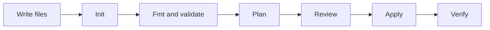

## Table of Contents

1. [The Problem](#the-problem)
2. [Terraform Workflow](#terraform-workflow)
3. [Working Directory](#working-directory)
4. [Init](#init)
5. [Format and Validate](#format-and-validate)
6. [Plan](#plan)
7. [Apply](#apply)
8. [Verify](#verify)
9. [Putting It All Together](#putting-it-all-together)
10. [What's Next](#whats-next)

## The Problem

The IaC fundamentals module ended with a habit: write infrastructure intent in files, compare those files with reality, and review the proposed change before applying it. Terraform is one common tool for making that habit concrete.

The orders team wants to add one production bucket for invoice exports. The request sounds small, but the team needs a workflow that answers a few basic questions before anything changes:

- Which directory is Terraform reading?
- Which provider plugin will talk to AWS?
- Are the files shaped correctly enough to produce a plan?
- Does the plan only create the expected bucket?
- After apply, can the application actually write invoices through its normal identity?

Terraform workflow is the loop that answers those questions. The commands are simple. The operating habit behind them is the important part: prepare the directory, check the files, preview the change, apply only after review, then verify the system behavior.

## Terraform Workflow

Terraform reads configuration files, loads provider plugins, compares desired state with managed reality, shows a plan, and applies the approved change through provider APIs. OpenTofu follows the same broad workflow with `tofu` commands instead of `terraform` commands.

For a beginner, the workflow can be read as one path:



Each step has a different job. `init` prepares the working directory. `fmt` makes formatting consistent. `validate` checks that Terraform can understand the configuration. `plan` previews the proposed provider changes. `apply` changes real infrastructure. Verification proves the application still works after the infrastructure change.

This matters because Terraform is not only a file parser. It is an operator that can create, update, replace, and destroy real resources. The workflow gives the team places to stop before the risky step.

## Working Directory

Terraform runs from a working directory. That directory is the root module for the run. Terraform reads the top-level `.tf` files in that directory together as one configuration.

For the orders service, the first useful directory can be small:

```text
infra/orders/prod/
  main.tf
  providers.tf
  outputs.tf
```

The filenames help humans, but Terraform reads them as one module. A resource in `main.tf` can reference a provider configured in `providers.tf` because both files belong to the same root module. A nested directory is different. Terraform will not automatically read files under `modules/private-bucket` unless a module block calls that directory.

That working-directory detail prevents a common first mistake. Running Terraform from the repository root may produce "no configuration files" or target the wrong environment. Running from `infra/orders/dev` when you meant production can be worse. Before reading any plan, confirm the directory.

| Directory question | Why it matters |
| --- | --- |
| Which root module am I in? | It decides which files Terraform reads. |
| Which environment is this? | It decides which state, variables, and credentials are in play. |
| Which backend is configured? | It decides where Terraform remembers managed objects. |
| Which provider settings are here? | It decides which account, subscription, project, region, or API endpoint may change. |

The directory is not just a folder. It is the change boundary.

## Init

`terraform init` initializes the working directory. It downloads provider plugins, installs child modules, reads backend configuration, and creates local metadata under `.terraform/`. HashiCorp documents `init` as safe to run multiple times, which is useful because changes to providers, modules, or backends often require another initialization.

For the first orders bucket, the command is plain:

```bash
$ cd infra/orders/prod
$ terraform init
```

If the configuration requires the AWS provider, init resolves and installs that provider. If the configuration calls child modules, init downloads or copies the module source. If a backend is configured, init prepares the backend connection.

This is why `init` comes before `validate` and `plan`. Terraform cannot fully understand a configuration that depends on providers and modules until those dependencies are installed.

There are two beginner gotchas here. First, commit the dependency lock file when Terraform creates or updates `.terraform.lock.hcl`; it records selected provider versions for consistent future runs. Second, do not commit `.terraform/`; that directory is local working data and can contain backend configuration details.

OpenTofu uses the same idea:

```bash
$ tofu init
```

The command name changes. The workflow job does not.

## Format and Validate

Formatting is the easiest check to understand. `terraform fmt` rewrites Terraform files into the canonical style. In a pull request, teams often run `terraform fmt -check` so CI reports formatting drift without rewriting the branch.

```bash
$ terraform fmt -check
```

Formatting is not infrastructure safety by itself. It removes noise so reviewers can focus on the resource change instead of spacing and alignment.

Validation is the next mechanical check:

```bash
$ terraform validate
```

Validation checks whether Terraform can understand the configuration after initialization. It can catch invalid references, missing required arguments, wrong block shapes, and other local configuration problems. It does not prove that the provider will accept every change. It does not prove the plan is safe. It only says the configuration is coherent enough for Terraform to keep working.

That distinction matters. A valid configuration can still be dangerous. A valid configuration might open a public bucket, target the wrong region, or replace a database. Validation is a gate before planning, not a substitute for plan review.

## Plan

`terraform plan` is the preview. Terraform compares the configuration, state, and provider view, then proposes actions to make reality match the files.

For the invoice bucket, a first good summary might look like this:

```text
Plan: 1 to add, 0 to change, 0 to destroy.
```

That summary matches the story: add one bucket. A reviewer still reads the resource detail, but the count does not conflict with the request.

This summary asks for a different conversation:

```text
Plan: 1 to add, 0 to change, 1 to destroy.
```

The add may be the bucket. The destroy may be a cleanup the team expects. It may also be an unrelated mistake. Terraform is showing evidence, not giving approval. The team reads the plan against the pull request story before applying it.

Plans also have limits. A plan can include values that are unknown until apply. Reality can change after the plan is generated. Provider behavior can still fail during apply. That does not make plans optional. It means a plan is review evidence, not a guarantee.

## Apply

`terraform apply` is the step that changes real infrastructure. If you run it without a saved plan, Terraform shows a plan and asks for confirmation before proceeding. In automation, teams often separate plan and apply more carefully so the reviewed plan and the applied change are connected.

For a beginner local run, the important habit is simple:

```bash
$ terraform apply
```

Read the final plan. Confirm the target environment. Then approve only when the proposed changes match the story.

The word "apply" can make this step sound mechanical, but it is the moment Terraform calls provider APIs to create, update, replace, or delete resources. If the plan includes a replacement, apply performs that replacement. If credentials point to the wrong account, apply uses those credentials. If the state lock is held, apply should stop instead of racing another operator.

Treat apply as production work, even when the resource looks small.

## Verify

Terraform can report that a provider accepted the change. That is not the same as proving the application works.

If the orders team adds an invoice bucket, verification should use the normal application path where possible. The application should write a test invoice object using its production role. Logs should show the expected write. Monitoring should remain healthy. The bucket should have the expected tags and access posture.

| Change | Terraform evidence | Service evidence |
| --- | --- | --- |
| Create bucket | Resource added in state | App can write through normal identity |
| Update IAM policy | Policy changed | App succeeds and unrelated actions remain denied |
| Change routing | Plan and apply succeed | Real request reaches the intended service |
| Add output | Output printed | Downstream config uses the output safely |

Verification closes the loop. Terraform changed infrastructure. The system now needs to prove the change served the application.

## Putting It All Together

The orders team started with one bucket request. Terraform workflow turned it into a reviewable path.

- The working directory told Terraform which root module and environment to use.
- `init` installed providers, modules, and backend setup.
- `fmt` and `validate` removed mechanical problems before review.
- `plan` showed what Terraform proposed to change.
- `apply` made the reviewed change real.
- Verification proved the orders app could use the new bucket.

The commands are easy to memorize. The habit is what matters: every infrastructure change gets prepared, checked, previewed, applied deliberately, and verified afterward.

## What's Next

The next article opens the Terraform directory and names the three jobs inside it: providers talk to APIs, resources are objects Terraform owns, and data sources read facts from existing systems.

---

**References**

- [Terraform init command](https://developer.hashicorp.com/terraform/cli/commands/init)
- [Terraform fmt command](https://developer.hashicorp.com/terraform/cli/commands/fmt)
- [Terraform validate command](https://developer.hashicorp.com/terraform/cli/commands/validate)
- [Terraform plan command](https://developer.hashicorp.com/terraform/cli/commands/plan)
- [Terraform apply command](https://developer.hashicorp.com/terraform/cli/commands/apply)
- [OpenTofu core workflow](https://opentofu.org/docs/intro/core-workflow/)
