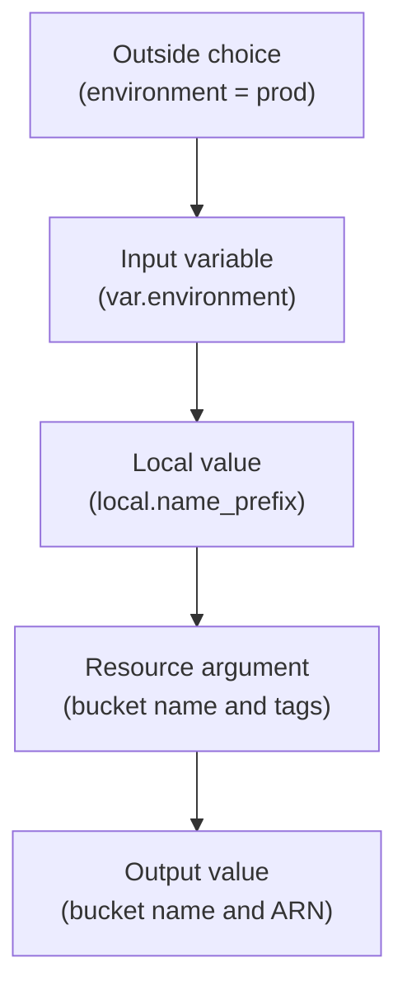

## Table of Contents

1. [Values Need Clear Boundaries](#values-need-clear-boundaries)
2. [Input Variables Bring Choices In](#input-variables-bring-choices-in)
3. [Types, Defaults, and Validation](#types-defaults-and-validation)
4. [Supplying Values During a Run](#supplying-values-during-a-run)
5. [Locals Name Decisions Inside the Module](#locals-name-decisions-inside-the-module)
6. [Outputs Expose Selected Results](#outputs-expose-selected-results)
7. [Sensitive Values Still Need Care](#sensitive-values-still-need-care)
8. [How Values Show Up in a Plan](#how-values-show-up-in-a-plan)
9. [Common First Value Mistakes](#common-first-value-mistakes)
10. [A Review Checklist for Module Values](#a-review-checklist-for-module-values)

## Values Need Clear Boundaries

The first Terraform file often starts with literal strings. A bucket name goes directly in `main.tf`. A region goes directly in the provider block. Tags are copied into each resource. That is fine for the first learning exercise, but it becomes painful when the same service needs a development environment, a staging environment, and a production environment.

Terraform gives you three value tools so the configuration can grow without turning into a copy-paste project. Input variables bring choices into the module from the outside. Local values give names to repeated expressions and decisions inside the module. Outputs expose selected results after Terraform has planned or applied the configuration.

For `devpolaris-orders`, the team wants one Terraform shape that can describe the invoice bucket for `dev`, `staging`, and `prod`. The environment name should be supplied from outside. The naming convention and shared tags should be calculated once inside the root module. After apply, Terraform should print the bucket name and ARN so the application team can wire the service to the right storage target.

The flow looks like this:



This is the same idea you already know from application code. A function takes arguments, uses local variables while it works, and returns selected values. Terraform modules are not functions in a normal programming language, but the mental model helps: inputs come in, internal decisions stay inside, useful results come out.

OpenTofu uses the same concepts and almost the same syntax. In this article, the examples use Terraform command names, but the value model applies to OpenTofu too.

## Input Variables Bring Choices In

An input variable declares a value the module expects from the outside. The value might come from a `.tfvars` file, an environment variable, a command-line flag, a default, or a parent module. The variable block gives the value a name, description, type, and optional rules.

Here is a small `variables.tf` for the `devpolaris-orders` invoice bucket:

```hcl
variable "environment" {
  description = "Deployment environment for the orders service."
  type        = string
}

variable "aws_region" {
  description = "AWS region where regional orders resources are created."
  type        = string
  default     = "eu-west-2"
}

variable "service_name" {
  description = "Short service name used in tags and resource names."
  type        = string
  default     = "devpolaris-orders"
}
```

The `environment` variable has no default. That means the caller must provide it. This is useful for values that should never be guessed. Accidentally applying production with a default environment is exactly the kind of mistake a variable can prevent.

The `aws_region` variable has a default because the team usually deploys this service in `eu-west-2`. A caller can still override it when needed. Defaults are best for normal, safe choices. They are not a place to hide environment-specific surprises.

The `service_name` variable also has a default because this root module is for one service. If the module later becomes a reusable child module for many services, that default may stop making sense. Variables should match the module's actual audience.

You reference input variables with the `var.` prefix:

```hcl
provider "aws" {
  region = var.aws_region
}
```

That line means the provider region comes from the variable value. The provider block no longer contains a literal region string. A reviewer can now look at the variable value supplied for a run and know which region Terraform will target.

## Types, Defaults, and Validation

Types tell Terraform what kind of value a variable expects. A type catches mistakes early, before a provider API receives a value that makes no sense. If a variable should be a number, say so. If it should be a map of strings, say so. Terraform can then reject a bad value during planning instead of letting the mistake travel further.

Common beginner-friendly types include:

| Type | Use It For | Example |
|------|------------|---------|
| `string` | One text value | `"prod"` |
| `number` | A numeric setting | `365` |
| `bool` | A true or false switch | `true` |
| `list(string)` | Ordered text values | `["orders", "billing"]` |
| `map(string)` | String keys and string values | `{ owner = "platform" }` |
| `object({...})` | A named shape with multiple fields | `{ enabled = true, days = 365 }` |

For `devpolaris-orders`, tags are a good place for a map. The module can define required tags itself and allow the caller to add extra tags when a team or environment needs them.

```hcl
variable "extra_tags" {
  description = "Additional tags to add to orders resources."
  type        = map(string)
  default     = {}
}
```

Validation rules are useful when a value can technically be a string but only a few strings are safe. The environment is a good example. Terraform cannot know what your team means by environment names unless you tell it.

```hcl
variable "environment" {
  description = "Deployment environment for the orders service."
  type        = string

  validation {
    condition     = contains(["dev", "staging", "prod"], var.environment)
    error_message = "environment must be one of dev, staging, or prod."
  }
}
```

The condition returns true for allowed values and false for rejected values. The error message should tell the caller how to fix the value, not only that it is wrong. A good validation message saves time in CI because the failed plan already points at the correction.

Here is the shape of the error when someone supplies `production` instead of `prod`:

```text
Error: Invalid value for variable

  on variables.tf line 1:
   1: variable "environment" {

environment must be one of dev, staging, or prod.
```

That failure is cheaper than creating resources with an unexpected tag, name, or policy condition. Validation is not a replacement for code review, but it catches common wrong values before the provider gets involved.

Defaults need the same care. A default should be safe, ordinary, and easy to explain. A default production database size, a default admin password, or a default public exposure setting deserves suspicion. If the caller must think before choosing the value, leave out the default and make Terraform ask for it or fail in automation.

## Supplying Values During a Run

Terraform can receive variable values in several ways. A beginner does not need to memorize every precedence rule on day one, but you should know the common paths so you can read a repository without guessing where a value came from.

For local development, a `terraform.tfvars` file is easy to understand:

```hcl
environment = "dev"
aws_region  = "eu-west-2"

extra_tags = {
  cost_center = "learning"
  owner       = "platform"
}
```

Terraform automatically loads `terraform.tfvars` when it runs in the same directory. This is convenient for a local learning environment. In a team repository, decide carefully which `.tfvars` files are committed. Environment-specific non-secret values are often reviewable. Secrets should not be committed.

A team may keep separate files for each environment:

```text
infra/
  main.tf
  outputs.tf
  variables.tf
  envs/
    dev.tfvars
    staging.tfvars
    prod.tfvars
```

Then the run chooses the file explicitly:

```bash
$ terraform plan -var-file="envs/staging.tfvars"
```

The explicit file path makes the target environment visible in the command and in CI logs. It also prevents a local `terraform.tfvars` file from silently controlling a shared run.

For one-off values, Terraform supports `-var`:

```bash
$ terraform plan -var="environment=dev"
```

This is fine for small experiments and quick checks. It becomes hard to review when many values are passed this way because the command line becomes the real configuration. Prefer `.tfvars` files or CI variables for environment definitions that matter.

Terraform can also read environment variables with the `TF_VAR_` prefix:

```bash
$ export TF_VAR_environment=staging
$ terraform plan
```

This is useful in CI systems where the pipeline injects values. It can also hide values from the repository, so the pipeline should print enough non-secret context for reviewers to know what environment and account are being targeted.

When Terraform has no default and no supplied value, an interactive local run may prompt:

```text
var.environment
  Deployment environment for the orders service.

  Enter a value:
```

Prompts are fine while learning locally. Automation should not depend on prompts. CI jobs should pass required values explicitly so the run either has everything it needs or fails with a clear error.

## Locals Name Decisions Inside the Module

A local value is a named expression inside a module. The caller does not supply it. Terraform calculates it from variables, resource attributes, data sources, functions, or other expressions in the same module. Locals are useful when the module needs to make one decision once and reuse it consistently.

For `devpolaris-orders`, the naming convention and shared tags should live in one place:

```hcl
locals {
  name_prefix = "${var.service_name}-${var.environment}"

  common_tags = merge(
    {
      service     = var.service_name
      environment = var.environment
      managed_by  = "terraform"
    },
    var.extra_tags
  )

  invoice_bucket_name = "dp-${local.name_prefix}-invoices"
}
```

The `name_prefix` local combines the service and environment. The `common_tags` local builds a tag map and merges in caller-supplied extra tags. The `invoice_bucket_name` local applies the team's bucket naming convention.

Now the resource can use the locals instead of repeating expressions:

```hcl
resource "aws_s3_bucket" "orders_invoices" {
  bucket = local.invoice_bucket_name
  tags   = local.common_tags
}
```

This keeps the resource block focused on the resource. The resource does not need to explain how names are built or how tags are merged. Those decisions have names. A reviewer can inspect `locals.tf` once and then read every resource with less noise.

Locals are not inputs. If a teammate needs to choose a value from outside the module, use a variable. If the module needs to calculate a value from choices it already has, use a local. This boundary keeps modules understandable.

Here is a useful comparison:

| Question | Use |
|----------|-----|
| Should the caller choose this value? | Variable |
| Is this a repeated expression inside the module? | Local |
| Does this name a team convention derived from inputs? | Local |
| Does this value need validation from the caller? | Variable |
| Should another module or human see this after apply? | Output |

Avoid creating locals for every tiny value. `local.true_value = true` does not help anyone. A local earns its place when it gives a meaningful name to a decision, removes repeated expressions, or makes a resource block easier to review.

Locals also help when a conditional expression would otherwise distract from the resource. Suppose the team wants shorter retention in development but longer retention in production. The decision can be named once:

```hcl
locals {
  invoice_retention_days = var.environment == "prod" ? 365 : 30
}
```

The lifecycle configuration can then use `local.invoice_retention_days`. A reviewer sees the policy decision in one place and the resource implementation somewhere else. That separation is useful as long as the local name is honest and the expression stays readable.

## Outputs Expose Selected Results

An output value is something the module chooses to expose after Terraform finishes. In a root module, outputs appear in the CLI after apply and can be read with `terraform output`. In a child module, outputs are how the parent module reads selected values from the child.

For the orders invoice bucket, the application team may need the bucket name and ARN. ARN means Amazon Resource Name, a globally structured identifier AWS uses in policies and API responses.

```hcl
output "invoice_bucket_name" {
  description = "Name of the S3 bucket that stores generated order invoices."
  value       = aws_s3_bucket.orders_invoices.bucket
}

output "invoice_bucket_arn" {
  description = "ARN of the S3 bucket that stores generated order invoices."
  value       = aws_s3_bucket.orders_invoices.arn
}
```

After apply, Terraform can print those values:

```text
Outputs:

invoice_bucket_arn = "arn:aws:s3:::dp-devpolaris-orders-prod-invoices"
invoice_bucket_name = "dp-devpolaris-orders-prod-invoices"
```

That output is useful evidence. A deployment script, a teammate, or a later module can use it to connect the application to the bucket that was actually created. Outputs also make review easier because they show which values the module treats as part of its public surface.

You can read outputs after the run:

```bash
$ terraform output invoice_bucket_name
"dp-devpolaris-orders-prod-invoices"
```

For scripts, JSON output is often easier to parse:

```bash
$ terraform output -json
```

The result is machine-readable:

```json
{
  "invoice_bucket_name": {
    "sensitive": false,
    "type": "string",
    "value": "dp-devpolaris-orders-prod-invoices"
  }
}
```

Outputs should be selective. Do not output every resource attribute just because Terraform can. Output the values someone has a real reason to consume: endpoint URLs, bucket names, role ARNs, database hostnames, or IDs needed by another module.

Output names become a small contract. If a CI job reads `invoice_bucket_name`, renaming that output can break the job even if the infrastructure itself does not change. Treat output renames like API changes. Search for consumers and change them deliberately.

## Sensitive Values Still Need Care

Terraform variables and outputs can be marked as sensitive. Sensitive means Terraform hides the value in normal CLI output. It does not mean the value never exists in memory, state, plans, provider requests, or logs produced by other tools.

Here is a sensitive variable shape:

```hcl
variable "database_password" {
  description = "Password for the orders database user."
  type        = string
  sensitive   = true
}
```

And here is a sensitive output shape:

```hcl
output "database_password" {
  description = "Generated database password for the orders database user."
  value       = var.database_password
  sensitive   = true
}
```

Terraform hides the value in normal output:

```text
database_password = <sensitive>
```

That redaction is helpful because it prevents casual terminal logs from exposing the value. Treat it as one layer of a secrets strategy, not the whole strategy. Depending on the provider and resource, sensitive values can still be stored in Terraform state. State must be protected with access control, encryption where available, and a backend strategy that matches your team's risk.

For a beginner-safe service like `devpolaris-orders`, start with a stricter rule: do not put secrets directly into committed `.tfvars` files, and do not output secrets unless a consuming system truly needs that value. Many teams prefer to create secret containers, permissions, or references with Terraform while the secret material itself comes from a dedicated secrets manager.

Sensitive also has a review cost. If a plan hides a value, the reviewer cannot inspect the exact string. That is the point for secrets, but it means the surrounding validation and naming need to be clear. A sensitive database password is reasonable. A sensitive environment name is usually unhelpful because it hides operational context the reviewer should see.

OpenTofu follows the same general idea: sensitivity affects display, not every storage and access concern around the value. Treat redaction as one layer, not the whole defense.

## How Values Show Up in a Plan

Values become real during planning. Terraform evaluates variables, locals, data sources it can read, and resource expressions to produce the proposed change. The plan is where you verify that the values combined the way you expected.

For `devpolaris-orders`, a staging plan might show:

```text
  # aws_s3_bucket.orders_invoices will be created
  + resource "aws_s3_bucket" "orders_invoices" {
      + bucket = "dp-devpolaris-orders-staging-invoices"
      + tags   = {
          + "environment" = "staging"
          + "managed_by"  = "terraform"
          + "owner"       = "platform"
          + "service"     = "devpolaris-orders"
        }
    }

Plan: 1 to add, 0 to change, 0 to destroy.
```

This plan proves several value decisions at once. `var.environment` became `staging`. `local.invoice_bucket_name` produced the expected bucket name. `local.common_tags` merged the module tags with the extra owner tag. The plan summary matches a first create.

If the plan instead shows `prod` while the pull request says staging, do not apply. Check the `-var-file`, CI variables, workspace conventions, or environment variables that supplied the value. Terraform can only evaluate the values it receives. It cannot know that a human meant a different target.

Unknown values can appear in plans:

```text
+ arn = (known after apply)
```

That is normal when the provider assigns the value during creation. An S3 bucket ARN can often be inferred from the name, but many provider attributes cannot be known until the API returns them. The review question is whether the unknown value is expected. Names, environment tags, and safety settings should usually be visible before apply.

Outputs also appear in plans when they will change:

```text
Changes to Outputs:
  + invoice_bucket_name = "dp-devpolaris-orders-staging-invoices"
```

Read output changes as part of the contract. If an output consumed by a deployment pipeline changes, the pipeline may need an update. If an output disappears, search for anything that reads it with `terraform output`, remote state, or a parent module reference.

The plan is the best place to catch value drift. A wrong variable value can create infrastructure in the wrong environment. A wrong local can spread a naming bug across many resources. A wrong output can break the next system that depends on this module.

## Common First Value Mistakes

The first mistake is using a variable for a value nobody should choose. If every caller must use the same `managed_by = "terraform"` tag, a variable adds noise and creates room for inconsistent values. Put that in a local instead.

The second mistake is using a local for a value the caller really does need to choose. If `environment` is hardcoded in a local, every environment needs a file edit. That makes review noisy and increases the chance that a production run uses a development name.

The third mistake is leaving an important variable untyped. Without a type, Terraform will infer what it can, but the module contract is less clear to humans. Types are documentation and validation at the same time.

Here is a confusing variable:

```hcl
variable "extra_tags" {}
```

Here is the same idea with a clearer contract:

```hcl
variable "extra_tags" {
  description = "Additional tags to add to orders resources."
  type        = map(string)
  default     = {}
}
```

The second block tells the caller what shape to pass and what happens if they pass nothing. It also helps Terraform catch values that are not a map of strings.

The fourth mistake is committing secret values in `.tfvars` files. A sensitive variable only affects Terraform display. If the secret text is committed to Git, the damage has already happened. Use your team's approved secret delivery path instead.

The fifth mistake is outputting too much. Outputs are easy to add, but they become dependencies. If a root module outputs every internal ID, other scripts may start depending on details the module owner wanted to keep private. Output values that are genuinely useful, and keep internal wiring inside the module.

The sixth mistake is renaming variables, locals, or outputs casually. Renaming a local is usually internal if all references are updated. Renaming a variable changes how callers supply values. Renaming an output changes how callers read results. Those are different levels of risk.

Terraform errors usually point at the category of mistake. A missing required variable looks like this in automation:

```text
Error: No value for required variable

  on variables.tf line 1:
   1: variable "environment" {

The root module input variable "environment" is not set, and has no default value.
```

An unsupported attribute often means the expression references a value that does not exist on that object:

```text
Error: Unsupported attribute

  on outputs.tf line 3, in output "invoice_bucket_name":
   3:   value = aws_s3_bucket.orders_invoices.name

This object has no argument, nested block, or exported attribute named "name".
```

The fix is to check the provider documentation or existing resource attributes and use the correct attribute, such as `bucket` for this example. Do not guess attribute names because they look natural in English. Providers define their own schema.

## A Review Checklist for Module Values

A good values review asks whether each value crosses the right boundary. The goal is not to turn every literal into a variable. The goal is to make environment choices explicit, internal decisions readable, and public results intentional.

| Check | Question |
|-------|----------|
| Required variables | Are values without safe defaults required from the caller? |
| Defaults | Are defaults ordinary and safe for this module's audience? |
| Types | Does each variable declare the shape it expects? |
| Validation | Are risky strings constrained to allowed values? |
| Locals | Do locals name repeated decisions rather than hiding caller choices? |
| Resources | Do resource arguments use variables and locals instead of copied strings? |
| Outputs | Are outputs limited to values people or other modules need? |
| Sensitive values | Are secrets kept out of committed files and protected beyond CLI redaction? |
| Plan evidence | Do names, tags, regions, and output changes match the intended environment? |

For `devpolaris-orders`, the healthy shape is clear. The caller supplies `environment` and optional extra tags. The module calculates `local.name_prefix`, `local.common_tags`, and `local.invoice_bucket_name`. The bucket resource consumes those locals. The outputs expose the bucket name and ARN because the application and later automation may need them.

That shape keeps the root module easier to operate. A teammate can read the variable file to see the environment, read locals to understand the naming and tagging decisions, read resources to see what Terraform manages, and read outputs to see what the module promises to others.

---

**References**

- [Terraform Input Variables](https://developer.hashicorp.com/terraform/language/values/variables) - Documents variable blocks, types, defaults, validation, and ways to assign values.
- [Terraform Local Values](https://developer.hashicorp.com/terraform/language/values/locals) - Explains local values for naming and reusing expressions inside a module.
- [Terraform Output Values](https://developer.hashicorp.com/terraform/language/values/outputs) - Describes output blocks and how modules expose selected values.
- [OpenTofu Input Variables](https://opentofu.org/docs/language/values/variables/) - Shows the OpenTofu version of input variable syntax and assignment behavior.
- [OpenTofu Local Values](https://opentofu.org/docs/language/values/locals/) - Documents local values in OpenTofu modules.
- [OpenTofu Output Values](https://opentofu.org/docs/language/values/outputs/) - Explains output values and sensitive output handling in OpenTofu.
