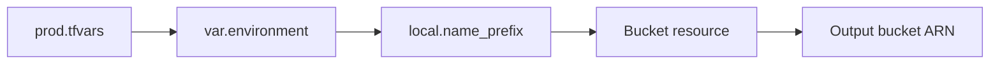

## Table of Contents

1. [The Problem](#the-problem)
2. [Input Variables](#input-variables)
3. [Types and Validation](#types-and-validation)
4. [Supplying Values](#supplying-values)
5. [Locals](#locals)
6. [Outputs](#outputs)
7. [Sensitive Values](#sensitive-values)
8. [Value Flow](#value-flow)
9. [Putting It All Together](#putting-it-all-together)
10. [What's Next](#whats-next)

## The Problem

The orders team can now read provider, resource, and data source blocks. Their first bucket resource still has literal values everywhere:

```hcl
resource "aws_s3_bucket" "orders_invoices" {
  bucket = "dp-orders-invoices-prod"

  tags = {
    service     = "orders-api"
    environment = "prod"
    owner       = "platform"
  }
}
```

That is understandable for one resource in one environment. It gets messy when the team adds development, staging, production, standard tags, and another bucket for exports.

- The word `prod` appears in several places.
- Bucket names are rebuilt by hand.
- Tags drift between resources.
- Reviewers cannot tell which values are environment choices and which values are internal naming rules.
- The application team needs the bucket ARN after apply, but nobody wants to copy it from the console.

Terraform uses three value tools to keep this readable. Variables bring values in. Locals name decisions inside. Outputs send selected values out.

## Input Variables

An input variable declares a value the module expects from outside. The outside may be a human running Terraform, a `.tfvars` file, a CI job, or a parent module calling a child module.

For the orders root module, environment is an outside choice:

```hcl
variable "environment" {
  description = "Deployment environment for the orders service."
  type        = string
}
```

The resource can now use `var.environment`:

```hcl
resource "aws_s3_bucket" "orders_invoices" {
  bucket = "dp-orders-invoices-${var.environment}"

  tags = {
    service     = "orders-api"
    environment = var.environment
  }
}
```

This does not make the module fancy. It makes the boundary visible. The environment comes from outside the module. The module uses that value to name and tag resources.

Variables are best for choices that should differ by caller or environment: region, environment name, replica count, retention days, feature switches, owner tags, and IDs of shared resources. They are not a dumping ground for every expression. If a value is a decision the module can calculate from other inputs, a local value may be clearer.

## Types and Validation

Types tell Terraform what shape a variable should have. Without types, a misshaped value can travel further than it should before failing.

Common beginner types are enough for many modules:

| Type | Use it for | Example |
| --- | --- | --- |
| `string` | One text value | `"prod"` |
| `number` | A numeric setting | `90` |
| `bool` | A true or false choice | `true` |
| `list(string)` | Ordered text values | `["api", "worker"]` |
| `map(string)` | Tags or named text values | `{ owner = "platform" }` |
| `object({...})` | A small structured contract | `{ days = 90, enabled = true }` |

Validation is useful when the type is correct but only some values are allowed. `environment` is a string, but the team only wants `dev`, `staging`, or `prod`:

```hcl
variable "environment" {
  description = "Deployment environment for the orders service."
  type        = string

  validation {
    condition     = contains(["dev", "staging", "prod"], var.environment)
    error_message = "environment must be dev, staging, or prod."
  }
}
```

Validation catches a typo before it becomes an accidental bucket name, tag value, or state path. This is a small guardrail, but it pays off because Terraform values often influence resource identity.

Defaults also deserve care. A default is useful for a normal safe value. It is dangerous when it hides an environment choice. A production root module should not silently default to `dev` because someone forgot to pass a variable.

## Supplying Values

Terraform can receive root module variable values in several ways. The cleanest beginner pattern is an environment-specific `.tfvars` file:

```hcl
# prod.tfvars
environment = "prod"
aws_region  = "eu-west-2"
owner       = "platform"
```

Then the run can use:

```bash
$ terraform plan -var-file=prod.tfvars
```

Terraform also loads files named `terraform.tfvars`, `terraform.tfvars.json`, and files ending in `.auto.tfvars` automatically. Environment variables with the `TF_VAR_` prefix and command-line `-var` flags are also supported.

The practical review question is where the value came from. If a plan targets production, reviewers should be able to see the production values or trust the controlled automation that supplied them. A hidden shell variable on one laptop is weaker evidence than a reviewed values file or CI environment configuration.

Sensitive values need extra caution. Do not commit secret values just because Terraform can accept them. Prefer provider-native secret stores, CI secrets, or other controlled secret flows. Terraform sensitivity can hide display output, but it is not a complete secret management strategy.

## Locals

Local values name expressions inside a module. They do not come from outside. They are the module's own internal decisions.

The orders module can use locals for names and shared tags:

```hcl
locals {
  name_prefix = "dp-orders-${var.environment}"

  common_tags = merge(
    {
      service     = "orders-api"
      environment = var.environment
      managed_by  = "terraform"
    },
    var.extra_tags
  )
}
```

The bucket becomes easier to read:

```hcl
resource "aws_s3_bucket" "orders_invoices" {
  bucket = "${local.name_prefix}-invoices"
  tags   = local.common_tags
}
```

Locals are useful when a repeated expression has meaning. `local.common_tags` tells reviewers this is the module's standard tag set. `local.name_prefix` tells reviewers how names are formed. That is better than rebuilding the same string in every resource.

The gotcha is overuse. A local value that only renames a variable can make code harder to trace. Use locals to name decisions, not to hide every line behind another name.

## Outputs

Outputs expose selected values after a plan or apply. Humans can read them, parent modules can consume them, and automation can collect them.

For the invoice bucket, two outputs are useful:

```hcl
output "invoice_bucket_name" {
  description = "Name of the orders invoice bucket."
  value       = aws_s3_bucket.orders_invoices.bucket
}

output "invoice_bucket_arn" {
  description = "ARN of the orders invoice bucket."
  value       = aws_s3_bucket.orders_invoices.arn
}
```

Outputs should be a small public surface, not a dump of every attribute. Expose values another person, module, or system actually needs. If the application deployment needs the bucket name, output it. If nobody needs an internal provider-specific detail, keep it inside the module.

Descriptions matter here. Output names become part of the module contract. A reviewer should be able to read an output block and know why it exists.

## Sensitive Values

Terraform supports marking input variables and outputs as sensitive. Sensitive display behavior helps prevent accidental exposure in CLI output, but it does not remove all risk.

For example:

```hcl
variable "database_password" {
  description = "Password used by the orders database."
  type        = string
  sensitive   = true
}
```

Sensitive means Terraform avoids showing the value in normal output. It does not mean the value is safe to commit in a `.tfvars` file. It also does not mean the value never appears in state or plan files. HashiCorp documents that sensitive values can still be stored in state, and state must be protected accordingly.

The beginner habit is simple: do not treat Terraform as a password vault. Use secret managers and controlled CI secret injection for secret material. Use Terraform sensitivity to reduce accidental display, not as the only protection.

## Value Flow

Put the value tools together and Terraform reads like a small data flow:



The outside file supplies the environment. The variable receives it. The local combines it into a naming decision. The resource uses it. The output exposes the resulting bucket ARN.

That flow gives reviewers a path to follow. If a plan creates `dp-orders-prod-invoices`, the reviewer can trace where `prod` entered and how the final name was built. If the wrong value appears, the team knows where to look.

## Putting It All Together

The orders team started with hardcoded values in a bucket resource. Variables, locals, and outputs gave those values clear boundaries.

- Input variables brought environment choices into the module.
- Types and validation caught wrong-shaped or disallowed values early.
- `.tfvars`, environment variables, and CI settings supplied values for a run.
- Locals named internal decisions such as standard tags and name prefixes.
- Outputs exposed selected results after Terraform planned or applied.
- Sensitive values reduced display exposure but still required state and secret handling discipline.

The goal is not abstraction for its own sake. The goal is traceable value flow. Reviewers should know where a value entered, how the module transformed it, and why any result was exposed.

## What's Next

The next article covers state, backends, and locking. Once Terraform creates real objects, it needs a memory that maps resource addresses in code to real objects in the provider.

---

**References**

- [Terraform input variables](https://developer.hashicorp.com/terraform/language/values/variables)
- [Terraform local values](https://developer.hashicorp.com/terraform/language/values/locals)
- [Terraform output values](https://developer.hashicorp.com/terraform/language/values/outputs)
- [Terraform sensitive data](https://developer.hashicorp.com/terraform/language/manage-sensitive-data)
