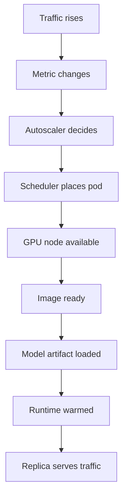

## Table of Contents

1. [Scaling After Traffic Arrives Can Be Too Late](#scaling-after-traffic-arrives-can-be-too-late)
2. [The Scale-Out Delay Budget](#the-scale-out-delay-budget)
3. [Scale On Waiting, Not Only CPU](#scale-on-waiting-not-only-cpu)
4. [Reservations And Autoscaling Must Agree](#reservations-and-autoscaling-must-agree)
5. [Scheduled Scaling Is Not A Hack](#scheduled-scaling-is-not-a-hack)
6. [Backfill Makes Idle Capacity Useful](#backfill-makes-idle-capacity-useful)
7. [Scale Down Is A Customer Decision](#scale-down-is-a-customer-decision)
8. [Autoscaling Incident Walkthrough](#autoscaling-incident-walkthrough)
9. [Tradeoffs](#tradeoffs)
10. [Review Standard](#review-standard)

## Scaling After Traffic Arrives Can Be Too Late

Autoscaling changes capacity when
demand changes. For model serving,
the hard part is that new capacity
may not be useful for several
minutes. A new replica may need a
GPU node, image pull, model
artifact download, checksum
verification, runtime load, and
warm-up before it can serve a
customer. If Northstar waits for
Atlas Retail's first slow requests
before scaling, the customer has
already felt the failure.

This is why autoscaling for hosted
inference is not the same as
autoscaling a small web API. The
autoscaler should not be judged
only by whether it eventually
created pods. It should be judged
by whether customer endpoints had
useful ready capacity when traffic
arrived.

Northstar's design combines four
ideas: minimum warm capacity for
paid endpoints, reactive scale-out
from queue pressure, scheduled
scale changes for predictable
customer traffic, and
opportunistic batch backfill that
leaves when production needs the
pool.

## The Scale-Out Delay Budget

A scale-out delay budget lists the
stages between demand and a ready
model replica. This budget is one
of the most important artifacts in
a model-serving autoscaling
review.



For `atlas-chat-prod`, the budget
might say that an existing node
can produce a ready replica in
three minutes, while a new node
takes eight minutes. If the
customer's traffic spike reaches
peak in two minutes, reactive
scaling cannot be the only
protection.

This does not mean autoscaling is
useless. It means autoscaling must
be paired with warm capacity and
predictive signals. The platform
should know which part of the
delay budget is dominant before
changing thresholds.

## Scale On Waiting, Not Only CPU

CPU is often a weak signal for
model-serving autoscaling. A model
endpoint can have low CPU while
requests wait in the model queue.
GPU utilization can also mislead
because high utilization may be
acceptable for batch and dangerous
for interactive chat. The best
signal depends on workload shape,
but interactive endpoints usually
need queue time, ongoing requests,
and first-token latency.

Ray Serve documents autoscaling
around ongoing request pressure.
Northstar can use the same idea
even when the runtime differs:
scale when each ready replica is
carrying too much active or
waiting work.

A review record might say:

```yaml
endpoint: atlas-chat-prod
scale_signal: model_queue_ms_p95
scale_out_threshold: 220
scale_out_window: 3m
min_ready_replicas_business_hours: 6
max_ready_replicas: 18
downscale_delay: 30m
```

The explanation matters more than
the YAML. Northstar scales on
queue time because queue time is
the wait the customer feels before
the model begins useful work.
Downscale is slow because model
load is expensive and customer
traffic arrives in bursts.

## Reservations And Autoscaling Must Agree

Autoscaling cannot create capacity
that the customer is not allowed
to use. Atlas Retail may have a
reservation for 24 H100 GPUs in
the chat pool. The autoscaler
should scale within that
reservation first, then follow a
clear policy for overflow. If
overflow uses shared capacity, the
customer should know whether that
capacity is best effort or
guaranteed.

Without that agreement,
autoscaling becomes confusing. The
endpoint asks for more replicas,
but the scheduler cannot place
them because reserved capacity is
full. Support sees desired
replicas rise and assumes the
platform is fixing the problem.
The customer still waits.

A good autoscaling view shows both
desired replicas and reservation
state. Desired replicas say what
the endpoint wants. Reservation
state says what the customer has
paid or been approved to use.
Scheduler state says what the
cluster can place right now. All
three are needed for an honest
answer.

## Scheduled Scaling Is Not A Hack

Many inference traffic patterns
are predictable. Customer support
teams start work in the morning.
Retail traffic rises during
campaigns. Batch jobs arrive after
a warehouse export. Scheduled
scaling means the platform warms
capacity before the predictable
load arrives.

For Northstar, scheduled scaling
might keep `atlas-chat-prod` at
two ready replicas overnight, warm
six replicas at 07:45, and allow
reactive scaling above six during
the workday. The schedule narrows
the control loop: the autoscaler
still reacts to surprises, but it
no longer treats a known launch as
an unknown spike.

The schedule should still use live
signals. If traffic is lower than
expected for several days, the
platform can adjust. If a special
customer event is scheduled,
product and support can request
temporary warm capacity. The point
is to move slow startup work
before the customer request, not
after it.

## Backfill Makes Idle Capacity Useful

Inference providers hate idle
GPUs, and for good reason. Idle
reserved capacity can hurt margin.
But removing all idle capacity can
hurt latency. Backfill is the
compromise: run lower-priority
work on spare capacity, but make
it leave quickly when production
endpoints need the pool.

Northstar can backfill overnight
with batch embedding jobs or
evaluation runs. Those jobs must
checkpoint by partition, run at
lower priority, and stop before
business-hour warm-up. If they
cannot stop safely, they should
not borrow production pools.

The backfill policy is part of
autoscaling because it decides
whether scale-out can reclaim
GPUs. A production endpoint that
scales from six to ten replicas
must be able to evict backfill
work. If backfill is not
reclaimable, it is not spare
capacity. It is competing
capacity.

## Scale Down Is A Customer Decision

Scale-down saves money, but it can
create the next cold start. For an
interactive endpoint, downscale
delay should reflect customer
traffic rhythm and model load
time. A quiet five minutes during
lunch may not mean the endpoint
should drop warm replicas.

Northstar should explain
scale-down in customer terms. A
premium endpoint may hold warm
capacity longer. A shared endpoint
may scale down faster to control
price. A batch endpoint may scale
to zero between jobs. None of
these choices is universally
correct.

The problem is hidden scale-down.
If a customer pays for predictable
latency and the platform removes
warm replicas during normal quiet
gaps, the customer experiences
surprise delays. The policy should
be visible and tied to the
endpoint tier.

## Autoscaling Incident Walkthrough

Atlas Retail reports slow first
tokens at 09:05. The autoscaling
timeline says traffic rose at
08:58, queue time crossed
threshold at 09:00, desired
replicas rose from six to ten at
09:01, two pods scheduled on
existing nodes, two waited for new
nodes, and the new nodes became
ready at 09:09. The incident
window lasted nine minutes.

The right fix is not only to lower
the threshold. Lowering the
threshold may help a little, but
the main issue is that new-node
capacity arrives after the spike.
Better fixes include warming more
replicas at 08:45, keeping a
larger buffer during campaign
days, pre-pulling artifacts, or
improving node provisioning time.

This walkthrough is the standard
for autoscaling review. It
connects the customer symptom to
the scale-out delay budget.
Without the timeline, teams tend
to tune thresholds blindly.

## Tradeoffs

More warm capacity protects
latency and raises cost. Faster
scale-out thresholds protect
spikes and may overreact to short
bursts. Longer downscale delay
protects the next request and
keeps GPUs idle longer. Backfill
improves utilization and adds
eviction complexity. Scheduled
scaling prevents predictable cold
starts and requires
product/customer coordination.

A provider should choose these
tradeoffs by endpoint tier.
Dedicated production endpoints get
stronger warm guarantees. Shared
endpoints get lower cost and more
variability. Batch jobs get
cheaper capacity and weaker
start-time guarantees. The
autoscaling system should encode
the product promise instead of
pretending every endpoint is the
same.

## Review Standard

An autoscaling design passes
review when the team can answer
five questions. What customer
signal triggers scale-out? How
long does a useful replica take to
arrive on existing and new nodes?
How much warm capacity is
guaranteed before traffic? What
lower-priority work can be
reclaimed? What does scale-down do
to the next customer request?

If those answers are missing, the
design may create more pods but
not more customer confidence.
Northstar's autoscaling goal is
ready model capacity at the right
time, not an impressive desired
replica number.

---
**References**

- [Ray Serve Autoscaling](https://docs.ray.io/en/latest/serve/autoscaling-guide.html) - Explains autoscaling based on queue and replica behavior for model serving.
- [Kubernetes Horizontal Pod Autoscaling](https://kubernetes.io/docs/concepts/workloads/autoscaling/horizontal-pod-autoscale/) - Documents the controller model behind workload replica scaling.
- [Kubernetes Node Autoscaling](https://kubernetes.io/docs/concepts/cluster-administration/cluster-autoscaling/) - Explains node provisioning and consolidation for unschedulable pods.
- [OpenAI Scaling Kubernetes to 7,500 Nodes](https://openai.com/index/scaling-kubernetes-to-7500-nodes/) - Includes production notes on autoscaling pressure, quota, and capacity balloons.
