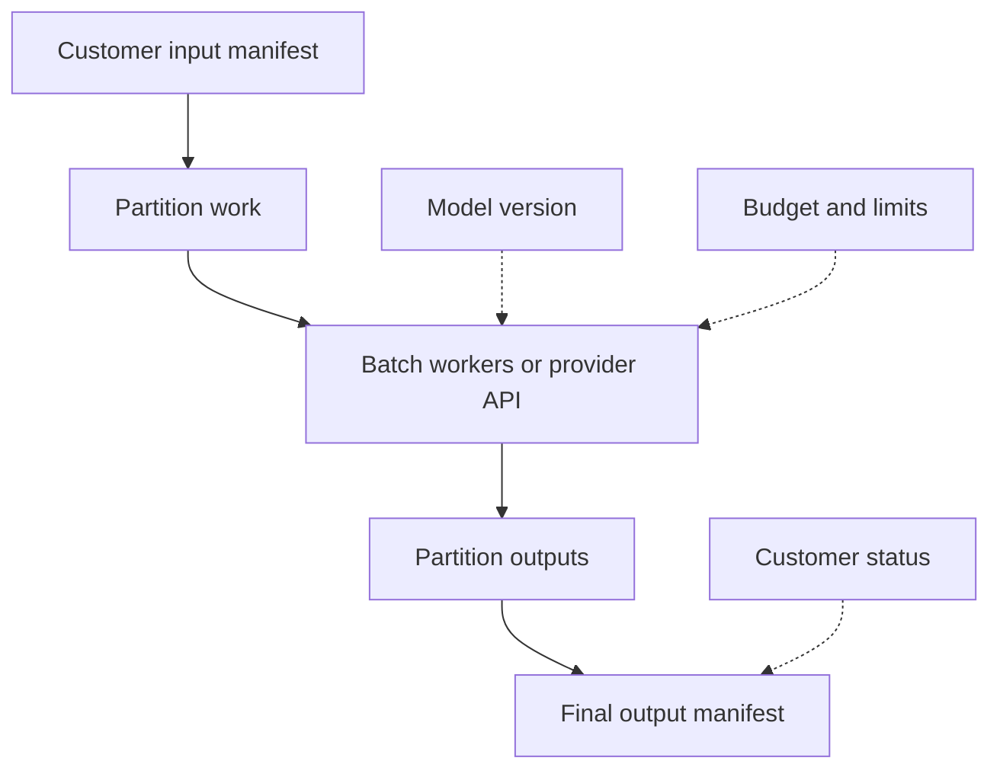

## Table of Contents

1. [Batch Is Still A Customer Product](#batch-is-still-a-customer-product)
2. [The Batch Flow](#the-batch-flow)
3. [Input Manifests Prevent Moving Targets](#input-manifests-prevent-moving-targets)
4. [Partitions Make Retries Safe](#partitions-make-retries-safe)
5. [Idempotent Output Protects Customers](#idempotent-output-protects-customers)
6. [Budgets And Quotas Bound The Blast Radius](#budgets-and-quotas-bound-the-blast-radius)
7. [Customer Status Should Be Honest](#customer-status-should-be-honest)
8. [The Final Manifest Is The Contract](#the-final-manifest-is-the-contract)
9. [Failure Modes](#failure-modes)
10. [Review Standard](#review-standard)

## Batch Is Still A Customer Product

Batch inference processes many
model requests asynchronously. No
person is waiting for one
streaming response, but the result
still affects a customer's
business. A nightly classification
job may decide which support
tickets get reviewed first. A
batch embedding job may refresh
search quality. A summarization
batch may feed a dashboard used by
executives.

Northstar offers batch inference
for customers who need volume more
than interactivity. A media
customer submits five million
image descriptions overnight.
Atlas Retail submits a daily
support-ticket summarization job.
Finch Finance submits a document
reranking evaluation batch. Each
job can wait, retry, and run on
cheaper capacity, but the output
must be correct and traceable.

The provider should not treat
batch as a pile of background
scripts. It needs product
boundaries: input contracts,
output manifests, cost controls,
retry behavior, result retention,
and customer-visible status.

## The Batch Flow

A batch flow starts with an input
manifest, splits work into
partitions, processes each
partition, writes outputs
idempotently, and publishes a
final manifest. The model version
and prompt version travel with the
job.



This flow is useful whether
Northstar runs self-hosted workers
or submits to a managed batch API.
OpenAI and Anthropic provide
managed batch paths. A self-hosted
provider path may use Kubernetes
Jobs or another queue. The
operating ideas stay the same:
fixed input, restartable
partitions, clear output, bounded
cost.

## Input Manifests Prevent Moving Targets

The input manifest tells Northstar
exactly what the customer wants
processed. It should include the
input location, row count or
object count, schema version,
model endpoint, prompt template,
and customer id. Without a
manifest, the job may read from a
live bucket or database that
changes while processing runs.

A useful manifest looks like this:

```yaml
job_id: atlas-ticket-summary-2026-05-08
customer: atlas-retail
input_uri: s3://northstar-customer-input/atlas/tickets/2026-05-08/
input_rows: 2400184
model: atlas-chat
model_version: v12
prompt_template: ticket-summary-v4
output_uri: s3://northstar-results/atlas/ticket-summary/2026-05-08/
max_output_tokens_per_row: 400
```

Every field supports a later
question. If counts differ,
compare with `input_rows`. If
answers look different from
yesterday, check model and prompt
version. If output is missing,
check the output path and
partition status.

## Partitions Make Retries Safe

A partition is a retryable slice
of the batch. The job should not
be one giant task that restarts
from zero after one worker fails.
Each partition should have a
stable id, input range, output
path, and status.

Partition size is an engineering
tradeoff. Tiny partitions create
scheduling and metadata overhead.
Huge partitions make retries
expensive and delay visibility.
Northstar should choose a size
that matches model latency,
provider rate limits, and customer
deadline.

The main rule is that a partition
can be run again without
duplicating final output. That
requires deterministic output
paths or idempotency keys. Batch
systems fail in ordinary ways:
workers time out, network calls
retry, provider APIs return
temporary errors, and output
writes partially succeed. The
design should expect those
failures.

## Idempotent Output Protects Customers

Idempotent output means rerunning
work leaves one correct result,
not duplicates. For Northstar,
this is non-negotiable because
customers often feed batch outputs
into downstream systems.

A safe output layout might
separate partition results and
status:

```text
results/atlas-ticket-summary-2026-05-08/partition=000183/results.jsonl
results/atlas-ticket-summary-2026-05-08/partition=000183/status.json
results/atlas-ticket-summary-2026-05-08/_manifest.json
```

The worker can write to a
temporary object, verify row
count, then promote to the final
partition path. If the worker
retries, it overwrites or confirms
the same partition path instead of
appending duplicate rows to a
shared file.

This is where batch inference
differs from a quick script. A
script might work in the happy
path. A provider pipeline must
behave correctly when it retries.

## Budgets And Quotas Bound The Blast Radius

Batch jobs can spend money quickly
because they run without a human
watching each request. A bad input
filter can process ten times more
rows. A prompt change can double
output tokens. A retry loop can
repeat expensive calls. Northstar
should attach budgets and stop
conditions to every customer batch
job.

A batch control record might say:

```yaml
max_input_rows: 2500000
max_total_input_tokens: 12000000000
max_total_output_tokens: 900000000
retry_limit_per_partition: 3
stop_if_error_rate_over: 2_percent
notify_customer_at_budget: 70_percent
```

The goal is not to block
legitimate work. The goal is to
stop surprises while the customer
can still choose. If Atlas really
wants to process more rows, the
budget can be raised deliberately.
If the job suddenly expands by
mistake, Northstar catches it
before the bill becomes the first
alert.

## Customer Status Should Be Honest

Batch jobs need customer-visible
status. "Running" is too vague for
a four-hour job. The customer
should see partitions complete,
partitions failed, error classes,
expected completion range, and
whether any budget threshold has
been reached.

Northstar should avoid false
precision. If queue capacity is
tight, say the job is waiting for
batch capacity. If provider API
rate limits are slowing work, say
throughput is rate-limited. If bad
inputs are being written to a
dead-letter file, say how many and
where the customer can review
them.

Honest status reduces support
load. It also builds trust because
the customer can distinguish a
slow but healthy job from a job
that needs action.

## The Final Manifest Is The Contract

The final manifest is the record
downstream systems should trust.
It says what input was processed,
which model and prompt were used,
how many rows succeeded, how many
failed, where outputs live, and
when results expire.

A final manifest might say:

```yaml
job_id: atlas-ticket-summary-2026-05-08
model: atlas-chat
model_version: v12
prompt_template: ticket-summary-v4
partitions_total: 481
partitions_complete: 481
rows_input: 2400184
rows_output: 2399840
rows_failed: 344
completed_at: 2026-05-08T03:18:00Z
result_expires_at: 2026-06-07T03:18:00Z
```

If the customer's downstream
system reads the manifest first,
it can reject incomplete output
instead of silently using partial
data. The manifest is the batch
version of request identity.

## Failure Modes

Moving input is the first failure
mode. The job reads from a
changing source and nobody can
reproduce counts. The fix
direction is a fixed input
manifest.

Duplicate output is the second
failure mode. Retries append rows
twice. The fix direction is
deterministic partition output and
idempotency keys.

Runaway cost is the third failure
mode. Bad filters or prompt
changes multiply tokens. The fix
direction is budgets, token
limits, and stop conditions.

Silent partial completion is the
fourth failure mode. The job
writes some outputs and reports
success. The fix direction is a
final manifest with partition
counts and failure rows.

## Review Standard

A batch inference pipeline passes
review when a customer can answer:
what input was processed, which
model version ran, how progress is
tracked, how retries avoid
duplicates, what budget limits
apply, where failures went, and
which manifest proves completion.

If those answers are missing, the
pipeline may be fast, but it is
not a provider-grade batch
product.

---
**References**

- [OpenAI Batch API](https://platform.openai.com/docs/guides/batch) - Documents asynchronous request batches, separate limits, and result files.
- [Anthropic Message Batches API](https://docs.anthropic.com/en/api/creating-message-batches) - Documents provider batch requests and result retrieval.
- [Ray Data Batch Inference](https://docs.ray.io/en/latest/data/batch_inference.html) - Shows a distributed batch inference pattern for deep learning workloads.
- [Ray Data LLM Workloads](https://docs.ray.io/en/latest/data/working-with-llms.html) - Documents large language model batch workflows on Ray Data.
- [Kubernetes Jobs](https://kubernetes.io/docs/concepts/workloads/controllers/job/) - Explains completion-oriented workloads with retry and status behavior.
