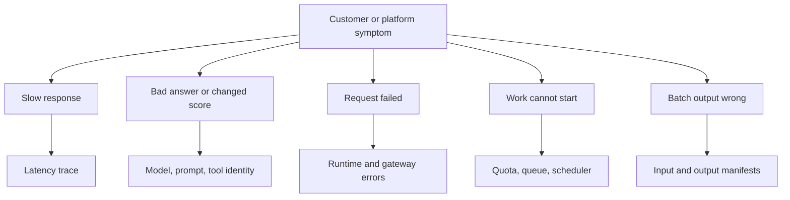

## Table of Contents

1. [Start With The Customer Symptom](#start-with-the-customer-symptom)
2. [The Failure Map](#the-failure-map)
3. [Slow First Token](#slow-first-token)
4. [Bad Answer Or Changed Score](#bad-answer-or-changed-score)
5. [Runtime OOM And Load Failure](#runtime-oom-and-load-failure)
6. [Routing And Queue Failures](#routing-and-queue-failures)
7. [Hardware Faults](#hardware-faults)
8. [Batch Output Failures](#batch-output-failures)
9. [An Incident Table](#an-incident-table)
10. [Review Standard](#review-standard)

## Start With The Customer Symptom

An AI incident should start with
what the customer observed. Atlas
Retail may report slow first
tokens. Finch Finance may report
different reranking scores. A
batch customer may report missing
rows. A platform alert may report
GPU errors before any customer
complains. These symptoms point to
different first checks.

A provider can waste a lot of time
by calling everything "the model
is broken." Hosted inference has
many layers: gateway, router,
quota, queue, runtime, artifact,
prompt, tokenizer, tool, cache,
GPU, and output pipeline. The
model may be innocent. The model
may also be the cause. The
incident process should gather
evidence before choosing a story.

Northstar's failure map exists to
keep responders from guessing. It
names symptom, likely layer, first
evidence, and first safe action.

## The Failure Map

A simple decision tree is enough
to start. It should not replace
investigation, but it should
prevent random debugging.



The first evidence should match
the symptom. For slow response,
inspect a trace. For bad answer,
inspect model and prompt identity.
For waiting work, inspect quota
and queue state. For batch output,
inspect manifests and partition
status.

## Slow First Token

Slow first token is one of the
most common customer-visible
failures for chat endpoints. The
first question is where the time
went. A trace should separate
gateway, route, queue, prefill,
first token, and decode.

A slow Atlas request might show:

```text
trace=trc-91be endpoint=atlas-chat-prod model=v13
router_ms=9 queue_ms=680 prefill_ms=740 first_token_ms=1480
gpu_memory_pct=88 cache_read_tokens=0 input_tokens=18200
```

The trace points to queue and
prefill. That suggests long
prompts, cache misses, too few
warm replicas, or routing
imbalance. It does not suggest a
gateway capacity fix. The safe
first action may be reducing
canary traffic, adding warm
replicas, or moving long prompts
to a separate route while the
customer stabilizes prompt
caching.

The failure mode is fixed only
when the trace changes, not when a
pod restarts.

## Bad Answer Or Changed Score

A bad answer can come from model
weights, prompt template,
retrieval data, tool output,
tokenizer, or customer
expectations. For reranking and
classification, the symptom may be
changed scores rather than
natural-language bad answers.

Northstar should collect safe
identifiers: customer, endpoint,
model version, prompt version,
retrieval index, tool result
version, and rollout state. If bad
answers cluster on v13 canary,
pause v13. If they cluster on one
retrieval index, inspect that
index. If both stable and canary
models repeat stale invoice
status, inspect the invoice tool.

The provider should avoid logging
raw prompts by default.
Customer-provided examples,
redacted samples, and trace ids
are safer starting points. Quality
debugging needs privacy discipline
because the fastest shortcut is
often the riskiest one.

## Runtime OOM And Load Failure

Runtime failures often happen when
a model is too large for the
chosen pool, the context limit
changed, a tokenizer is missing,
or the runtime image is
incompatible. These failures may
appear as pod restarts, readiness
failures, or 5xx errors.

A load log should name the phase:

```text
endpoint=atlas-chat-prod model=v13 phase=load_gpu status=failed
error=cuda_oom requested_gb=82 available_gb=78 pool=chat-h100-eu
```

This evidence points to model
profile or placement. Restarting
the same pod on the same pool will
likely fail again. Better fix
directions include rolling back,
using a larger profile, reducing
context, changing tensor parallel
settings, or rejecting the
artifact until it fits a supported
tier.

A provider should catch many load
failures during staging, but
production can still expose edge
cases. The response should protect
traffic first, then update intake
checks.

## Routing And Queue Failures

Routing failures happen when
traffic goes to the wrong region,
wrong pool, overloaded replica,
stale version, or incompatible
runtime. Queue failures happen
when the router chooses a valid
endpoint but the model server
cannot admit work fast enough.

The evidence is route decision
plus queue metrics. If all slow
traces use `replica atlas-0` while
`atlas-1` and `atlas-2` are
healthy, the router may be
imbalanced. If every replica has
high queue time, the endpoint
needs more warm capacity or a
different workload split.

The first safe action depends on
scope. A single bad replica can be
drained. A bad route can be
disabled. A whole pool under
pressure may require traffic
shaping, customer communication,
or temporary capacity expansion.

## Hardware Faults

AI hardware can fail in ways that
normal application health checks
miss. GPU errors, memory faults,
driver issues, and network
instability can cause slowdowns or
failed model execution. Meta's
hardware reliability writing is
useful because it shows that AI
systems need hardware-aware
detection, not only HTTP checks.

A GPU alert should connect
hardware to endpoint impact:

```text
alert=gpu_xid_error node=gpu-chat-h100-17 gpu=3
endpoint=atlas-chat-prod replicas_affected=1 action=drain
```

If the endpoint mapping is
missing, hardware alerts become
infrastructure noise. If the
action is missing, engineers may
leave customer traffic on
suspicious hardware. Northstar's
standard is to quarantine first
when hardware evidence is strong,
then repair or return the node
after diagnostics.

## Batch Output Failures

Batch failures look different from
live endpoint failures. The
customer may report missing rows,
duplicate rows, unexpected cost,
or a job that never finishes. The
first evidence is the input
manifest, partition status, output
manifest, and error classes.

If the output has duplicates,
inspect idempotency. If rows are
missing, compare input row count
with final manifest. If cost is
too high, inspect token budgets
and retry counts. If the job is
slow, inspect queue wait, rate
limits, and partition throughput.

The mistake is to debug batch
through live-serving dashboards
alone. Batch work uses models, but
its correctness depends on
pipeline contracts.

## An Incident Table

During an incident, Northstar can
keep a simple table:

| Symptom | First evidence | Likely layer | Safe first action |
|---------|----------------|--------------|-------------------|
| Slow first token | trace breakdown | queue or prefill | reduce canary or add warm replicas |
| Bad answer | model and prompt id | rollout or data | pause candidate or inspect tool |
| Load OOM | model load phase | runtime profile | rollback or move profile |
| Pending endpoint | queue and scheduler reason | capacity shape | reclaim or add pool capacity |
| Batch duplicates | output manifest | idempotency | stop job and repair partition writes |

The table should evolve as
evidence arrives. It prevents the
incident from collapsing into one
vague AI problem.

### Practice The Fixes

Provider-grade incidents require
practiced actions. Drain a GPU
node. Pause a canary. Move route
weight to zero. Restore a registry
alias. Rebuild a prompt cache.
Retry a batch partition. Reject an
artifact that fails staging.
Confirm no requests hit the bad
version after rollback.

Practice matters because the
systems are layered. The person
responding at 09:00 should not
discover during the incident that
they lack permission to change
route weights or that traces do
not include model version.

A good drill has a symptom,
evidence, action, and
verification. Verification is
important. A rollback is not done
when a command succeeds. It is
done when new traces prove traffic
stopped hitting the bad path.

## Review Standard

A failure-modes article passes
when a junior engineer can pick
the first evidence for a customer
symptom. Slow response needs a
trace. Bad answer needs identity
and rollout context. Load failure
needs runtime phase logs. Waiting
work needs queue and scheduler
reasons. Batch issues need
manifests.

Northstar's operating standard is
not to know every answer
immediately. It is to make the
first investigation step obvious
and evidence-based.

---
**References**

- [OpenTelemetry GenAI Semantic Conventions](https://opentelemetry.io/docs/specs/semconv/gen-ai/) - Defines telemetry fields that help identify model, provider, and request failure context.
- [vLLM Production Metrics](https://docs.vllm.ai/en/latest/usage/metrics.html) - Shows runtime metrics useful for debugging queue, cache, and serving behavior.
- [NVIDIA DCGM-Exporter](https://docs.nvidia.com/datacenter/dcgm/latest/gpu-telemetry/dcgm-exporter.html) - Documents GPU health signals such as XID errors and utilization metrics.
- [OpenAI API Errors and Latency Troubleshooting](https://help.openai.com/en/articles/1000499-troubleshooting-api-errors-and-latency) - Shows the kind of request details support teams need during API latency and error incidents.
- [Anthropic Rate Limits](https://docs.anthropic.com/en/api/rate-limits) - Documents provider-side rate-limit concepts that affect incident diagnosis.
