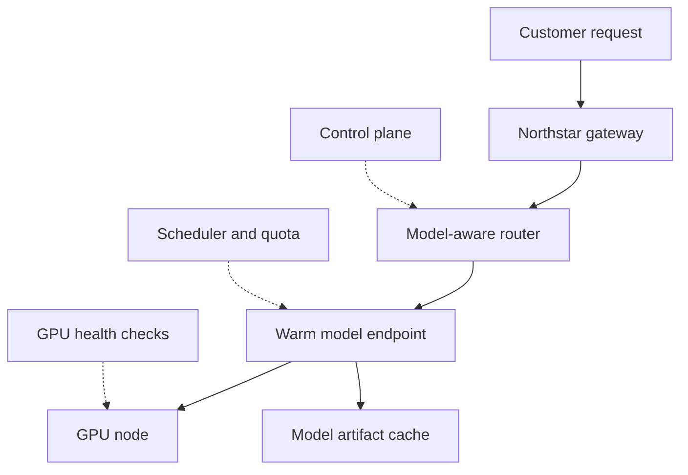

## Table of Contents

1. [The Cluster Starts With A Customer Promise](#the-cluster-starts-with-a-customer-promise)
2. [The Capacity Chain](#the-capacity-chain)
3. [Endpoint Capacity Is Shaped Capacity](#endpoint-capacity-is-shaped-capacity)
4. [Where Kubernetes Fits](#where-kubernetes-fits)
5. [Warm Endpoints Are Part Of The Product](#warm-endpoints-are-part-of-the-product)
6. [Health Checks Protect Other Customers](#health-checks-protect-other-customers)
7. [A Good Cluster Review](#a-good-cluster-review)
8. [Failure Shapes To Recognize](#failure-shapes-to-recognize)

## The Cluster Starts With A Customer Promise

A model inference company does not
sell a raw GPU to most customers.
It sells a promise: your model
endpoint will be reachable, it
will start responding within an
agreed latency range, it will not
be starved by another customer's
workload, and the provider can
explain what happened if the
endpoint gets slower. The GPU
cluster is the machinery that
makes that promise true.

In this module, use a fictional
provider called Northstar
Inference. Northstar hosts
customer models for chat,
embeddings, reranking, image
generation, and offline batch
jobs. A customer named Atlas
Retail has a chat model called
`atlas-chat-prod`. Another
customer named Finch Finance runs
a reranking model called
`finch-rerank-prod`. Northstar
also has internal control-plane
services that decide where
requests go, which model version
is active, and which GPU pools are
allowed to serve each customer.

That setting changes the mental
model. A GPU is not just a faster
CPU. It is scarce capacity tied to
customer contracts, regional
demand, model artifacts, routing
decisions, and health checks. A
junior engineer joining Northstar
should not begin by memorizing
every accelerator type. They
should first understand the chain
that turns a customer request into
a model response.

## The Capacity Chain

The capacity chain is the set of
things that must all be true
before a request can use a GPU.
The customer endpoint must be
enabled. The router must know
which model version should answer.
The model artifact must be stored
and verified. A compatible runtime
must be available. A GPU node must
have the right driver and enough
memory. The scheduler must be
allowed to place the work. The
endpoint must be warm enough that
the first customer request does
not pay the full model load cost.

A short diagram is more useful
than a giant platform map:



The solid path is the request
path. The dotted links are the
systems that decide whether the
path is safe. If Atlas Retail
reports slow first tokens, the
answer might be in any of those
boxes. A gateway problem, a bad
route, a cold endpoint, a missing
artifact cache, a full queue, or
an unhealthy GPU can all feel like
"the model is slow" to the
customer.

This is why a provider's cluster
dashboard should not begin with
total GPU count. Total count hides
the real question: how much
usable, compatible, healthy, warm
capacity exists for each class of
customer endpoint right now?

## Endpoint Capacity Is Shaped Capacity

Northstar might have hundreds of
GPUs in a region and still fail to
place one customer endpoint. The
reason is shape. `atlas-chat-prod`
may require GPUs with enough
memory for long prompts.
`finch-rerank-prod` may need lower
latency but less memory. A media
generation customer may need a
different runtime and a larger
batch window. Free capacity in the
wrong pool is not capacity for the
endpoint that needs help.

A provider keeps a capacity ledger
so support, platform, and sales
have the same vocabulary. A
simplified ledger might look like
this:

| Pool | Main use | Healthy GPUs | Warm endpoints | Risk |
|------|----------|--------------|----------------|------|
| chat-h100-eu | Large chat models | 88 | 41 | prompt spikes |
| rerank-l40s-eu | Reranking and embeddings | 132 | 77 | noisy batch work |
| batch-a10-eu | Offline jobs | 64 | 0 | deadline pressure |
| quarantine | Failed preflight | 5 | 0 | hardware repair |

This table is not a replacement
for live metrics. It is the mental
model. Northstar wants every
engineer to ask, "which pool,
which customer promise, and which
risk?" before they touch
scheduling policy.

When a pool is tight, the correct
action depends on the promise
attached to that pool. For a paid
chat endpoint, keeping warm
headroom may be more important
than squeezing every last percent
of utilization. For offline batch
jobs, high utilization may be
acceptable because no human is
waiting for the first token.

## Where Kubernetes Fits

Kubernetes can schedule pods onto
nodes, but it does not understand
customer contracts by itself. It
sees resources, labels, taints,
priorities, and pods. Northstar's
control plane translates customer
intent into those primitives. For
example, Atlas Retail's production
endpoint might be allowed only on
the `chat-h100-eu` pool, while a
trial endpoint can run on a
smaller shared pool.

Kubernetes sees GPUs through
device plugins. A node must report
an extended resource such as
`nvidia.com/gpu` before a pod can
request it. If the driver is
missing or the device plugin is
unhealthy, the cloud console may
show an expensive machine, but
Kubernetes cannot hand that GPU to
a model server.

A useful node check is short:

```text
$ kubectl describe node gpu-chat-h100-17 | sed -n '/Allocatable:/,/Events:/p'
Allocatable:
  cpu:                188
  memory:             1440Gi
  nvidia.com/gpu:     8
  pods:               110
```

This proves only one thing:
Kubernetes can see eight
schedulable GPUs on that node. It
does not prove the node is safe
for Atlas Retail. The node still
needs the right labels, the right
runtime, no active quarantine
taint, enough model cache space,
and passing GPU diagnostics.

## Warm Endpoints Are Part Of The Product

A model endpoint is not ready just
because a pod exists. The runtime
may still be pulling a large
image. The model weights may still
be downloading from object
storage. The tokenizer may not be
loaded. The first prefill path may
not be warmed. A provider that
waits until the first customer
request to do all of that will
create an obvious delay.

Northstar treats warm endpoints as
inventory. For Atlas Retail, a
product commitment might say that
at least six replicas must be
ready during European business
hours and at least two must stay
warm overnight. That looks like
idle capacity on a utilization
chart, but it is not accidental
waste. It is the purchased buffer
that keeps the first customer
request from becoming a cold-start
test.

A startup record should explain
the warm-up path:

```text
endpoint=atlas-chat-prod replica=chat-h100-eu-17-3
artifact=atlas-chat:v12 sha=8d91a3 cache=hit
runtime=vllm-serve-2026-04-29 load_ms=41200
warmup_prompt_ms=620 ready=true
```

Each field has a reason. The
artifact and checksum prove what
loaded. The cache result explains
whether storage was part of
startup time. The runtime version
connects behavior to the serving
engine. The warmup measurement
tells the platform whether this
replica can enter the ready pool.

## Health Checks Protect Other Customers

A GPU node can be healthy enough
for the operating system and still
unsafe for customer inference. The
driver can report errors. Memory
can be unreliable. A fabric or
network issue can cause
intermittent latency. A provider
must remove suspicious hardware
before it becomes a customer
incident.

Northstar uses preflight and
continuous health checks. New
nodes enter with a taint that
blocks customer work. A health job
checks driver visibility, GPU
diagnostics, runtime container
access, artifact cache mount, and
a tiny model load. Only then does
automation remove the taint.
During the node's life, DCGM and
platform tests keep watching for
faults.

The important part is customer
isolation. If `gpu-chat-h100-17`
starts reporting GPU errors,
Northstar should not wait for
Atlas Retail to complain. It
should drain the node, move warm
replicas elsewhere, mark the node
quarantined, and attach evidence
to the hardware ticket. That turns
a possible customer outage into a
platform repair event.

## A Good Cluster Review

A cluster review for an inference
provider should sound different
from a generic Kubernetes review.
The reviewer should ask which
customer promises depend on the
pool, which model classes fit
there, how warm capacity is
measured, which jobs may borrow
idle capacity, and how unhealthy
devices leave service.

A small review checklist is
enough:

| Question | Evidence |
|----------|----------|
| Which customers depend on this pool? | endpoint inventory and contracts |
| What model shapes fit here? | memory profile and runtime compatibility |
| How much capacity is warm? | ready replicas by endpoint and region |
| Why is work waiting? | queue reason, quota state, scheduler events |
| How is hardware removed? | preflight, DCGM alerts, drain records |
| How is customer impact proven? | request traces and endpoint SLOs |

SLO means service level objective,
the target behavior the provider
promises to operate toward. For an
inference company, a GPU pool
exists to satisfy those
objectives. The pool is not
healthy only because nodes are
Ready. It is healthy when the
customer endpoints depending on it
can meet their objectives with
evidence.

## Failure Shapes To Recognize

Invisible capacity happens when
hardware exists but the scheduler
cannot use it. The fix direction
is driver, device plugin, labels,
or preflight repair. Wrong-shape
capacity happens when free GPUs
exist in a pool that cannot serve
the customer model. The fix
direction is pool design, customer
placement policy, or a different
model profile.

Cold capacity happens when pods
eventually become ready but too
late for the customer request. The
fix direction is warm replicas,
artifact cache, scheduled scaling,
or a smaller fallback model.
Contended capacity happens when
trial, batch, or experimental work
interferes with paid production
endpoints. The fix direction is
priority, quota, and borrowing
policy.

Untrusted capacity happens when a
GPU reports errors or a node fails
diagnostics. The fix direction is
quarantine and replacement, not
another retry on the same machine.
These shapes are more useful than
a single red "GPU problem" label
because each one points to a
different owner and a different
recovery path.

---
**References**

- [Kubernetes Device Plugins](https://kubernetes.io/docs/concepts/extend-kubernetes/compute-storage-net/device-plugins/) - Explains how Kubernetes advertises specialized hardware such as GPUs to the kubelet.
- [Kubernetes Schedule GPUs](https://kubernetes.io/docs/tasks/manage-gpus/scheduling-gpus) - Shows how GPU resources are requested and scheduled as extended resources.
- [NVIDIA DCGM-Exporter](https://docs.nvidia.com/datacenter/dcgm/latest/gpu-telemetry/dcgm-exporter.html) - Documents GPU telemetry that platform teams use to detect hardware and workload issues.
- [OpenAI Scaling Kubernetes to 7,500 Nodes](https://openai.com/index/scaling-kubernetes-to-7500-nodes/) - Gives a production-scale example of quotas, health checks, gang scheduling, and large cluster operations.
