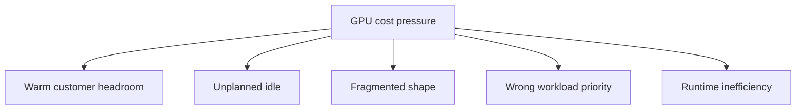

## Table of Contents

1. [Utilization Is A Business Signal](#utilization-is-a-business-signal)
2. [The Cost Map](#the-cost-map)
3. [Warm Capacity Has A Reason](#warm-capacity-has-a-reason)
4. [Fragmentation Hides Behind Averages](#fragmentation-hides-behind-averages)
5. [Backfill Improves Margin Carefully](#backfill-improves-margin-carefully)
6. [Runtime Efficiency Is Not Only Utilization](#runtime-efficiency-is-not-only-utilization)
7. [Customer Unit Economics](#customer-unit-economics)
8. [A Cost Review Scenario](#a-cost-review-scenario)
9. [Failure Modes](#failure-modes)
10. [Review Standard](#review-standard)

## Utilization Is A Business Signal

GPU utilization measures how much
accelerator compute is being used.
Cost measures what Northstar pays
to hold and operate that capacity.
Margin depends on the gap between
what customers pay and what it
costs to serve them. That makes
utilization important, but not
simple.

A provider can make utilization
high and still hurt the business.
If every GPU is packed to 95
percent, interactive endpoints may
have no headroom and first-token
latency may rise. A provider can
also make utilization low and
still make the right decision if
the idle capacity is paid warm
capacity for a premium customer.

The useful question is not "is the
GPU busy?" The useful question is
"is this GPU being used in a way
that matches the customer promise
and the product margin?"

## The Cost Map

Northstar's GPU cost problem has
several shapes. Warm idle capacity
protects latency. True idle
capacity may be waste. Fragmented
capacity cannot serve the job that
is waiting. Wrong-work capacity
means low-priority work is
blocking higher-value endpoints.
Inefficient runtime capacity means
the GPU is busy but not producing
enough customer value.



Each branch has a different fix.
Removing warm headroom may improve
utilization and violate latency
objectives. Fixing unplanned idle
may require batch backfill. Fixing
fragmentation may require pool
design. Fixing runtime
inefficiency may require batching,
quantization, or a different model
profile.

A cost review that treats all idle
time as waste will make bad
product decisions.

## Warm Capacity Has A Reason

Atlas Retail's premium endpoint
may keep six replicas warm during
business hours. Those GPUs may
look underused between customer
bursts. That does not mean they
are wasted. They are part of the
purchased latency promise.

The provider should still measure
warm capacity. If Atlas
consistently uses only two
replicas and has no bursts, the
plan may be oversized. If Atlas
uses all six replicas every
morning and queue time still
rises, the plan may be undersized.
The point is to connect idle time
to the reason it exists.

A cost report should show warm
hours separately from unplanned
idle hours. This lets finance and
platform discuss the right thing.
Warm capacity is a product cost.
Unplanned idle is an efficiency
opportunity.

## Fragmentation Hides Behind Averages

Fragmentation means capacity
exists but not in a useful shape.
Northstar may have many free L40S
GPUs while Atlas needs H100
memory. It may have scattered
single GPUs while a sharded model
needs four on the same node or
pool. Average utilization hides
this.

A capacity view should show
largest admissible workload, not
only free GPUs:

| Pool | Free GPUs | Largest useful placement | Main blocker |
|------|-----------|--------------------------|--------------|
| chat-h100-eu | 9 | 4 | reserved headroom |
| rerank-l40s-eu | 41 | 8 | no chat runtime |
| batch-a10-eu | 72 | 16 | lower memory |

If Atlas needs six H100 GPUs for a
new endpoint, the first row says
it cannot start safely even though
the table has 122 free GPUs total.
That is a shape problem, not a
utilization problem.

## Backfill Improves Margin Carefully

Backfill uses spare capacity for
lower-priority work. For
Northstar, batch embedding jobs,
customer evaluations, and internal
benchmarks can backfill idle
windows. This improves margin
because paid hardware produces
more billable or useful work.

Backfill is safe only when it is
reclaimable. The backfill job must
checkpoint, obey priority, and
leave before customer traffic
needs the pool. If a backfill job
cannot stop without losing hours
of work, it should not borrow
production chat capacity.

The best backfill policies are
boring. They name allowed windows,
priority, checkpoint rules, and
reclaim behavior. They also show
customers that their premium
endpoints remain protected.

## Runtime Efficiency Is Not Only Utilization

A GPU can be busy and still
inefficient. Large batches may
improve tokens per second while
hurting first-token latency. A
larger model may improve answer
quality but reduce how many
customers fit in a pool.
Quantization may reduce memory and
cost but change output behavior.
Prompt caching may reduce
repeated-prefix work but only when
prompt structure is stable.

The provider should review
efficiency with customer outcomes
beside it:

| Change | Efficiency gain | Customer risk |
|--------|-----------------|---------------|
| Larger batch window | more throughput | slower first token |
| Smaller model | lower cost | lower quality on hard prompts |
| Quantization | lower memory | possible behavior drift |
| Prompt caching | less repeated prefill | cache misses if prompts vary |
| Backfill | higher utilization | reclaim complexity |

This table prevents a narrow
utilization win from becoming a
product regression. The provider's
job is to improve cost per useful
response, not cost per busy GPU
second.

## Customer Unit Economics

Unit economics connect
infrastructure to the product.
Northstar needs to know the cost
per million input tokens, output
tokens, batch rows, or endpoint
hour. It also needs to know
whether the customer tier covers
warm capacity and support risk.

A useful monthly view might show
Atlas like this:

```yaml
customer: atlas-retail
endpoint: atlas-chat-prod
reserved_gpu_hours: 4320
active_gpu_hours: 2480
warm_headroom_hours: 1280
batch_backfill_hours_reclaimed: 390
p95_first_token_ms: 610
revenue_tier: premium-dedicated
margin_status: acceptable
```

This internal view connects cost
to the service promise. It says
latency is within target and warm
headroom is intentional. It also
shows whether backfill recovered
some cost.

## A Cost Review Scenario

Finance asks why chat-h100-eu
averages only 52 percent
utilization. Platform shows that
the pool carries three premium
endpoints with morning traffic
spikes, and the unused capacity is
mostly warm headroom. They also
show that batch backfill already
recovers part of the overnight
idle window, but stops at 07:30 to
protect customer warm-up.

The decision becomes specific.
Northstar can offer Atlas a
lower-cost shared tier with more
latency variance, keep the premium
plan as-is, or add more
reclaimable batch work overnight.
The decision is not "raise
utilization at any cost." It is
"choose the product promise and
margin together."

## Failure Modes

The first failure mode is
utilization tunnel vision. The
platform packs GPUs and hurts
first-token latency. The fix
direction is to pair utilization
with queue time and customer SLOs.

The second failure mode is warm
capacity shame. Finance sees idle
GPUs and cuts them without
understanding the customer
promise. The fix direction is cost
reports that separate warm
headroom from unplanned idle.

The third failure mode is unsafe
backfill. Batch work improves
utilization but blocks production
scale-out. The fix direction is
reclaimable priority and
checkpoint rules.

The fourth failure mode is
fragmentation blindness. Total
free GPUs look high, but no
compatible pool can host the
waiting endpoint. The fix
direction is shaped capacity
reporting.

## Review Standard

A GPU cost review passes when it
can explain utilization by
workload class, customer promise,
pool shape, and margin. If the
only number is average GPU
utilization, the review is too
shallow for an inference provider.

---
**References**

- [NVIDIA DCGM-Exporter](https://docs.nvidia.com/datacenter/dcgm/latest/gpu-telemetry/dcgm-exporter.html) - Documents utilization, memory, and error metrics used for GPU fleet accounting.
- [NVIDIA Triton Model Analyzer](https://docs.nvidia.com/deeplearning/triton-inference-server/user-guide/docs/model_analyzer/README.html) - Shows how model-server configurations can be profiled against hardware.
- [vLLM Production Metrics](https://docs.vllm.ai/en/latest/usage/metrics.html) - Lists serving-side metrics that help connect GPU use to request behavior.
- [Kubernetes Resource Quotas](https://kubernetes.io/docs/concepts/policy/resource-quotas/) - Documents quota controls for shared cluster resources.
- [OpenAI Scaling Kubernetes to 7,500 Nodes](https://openai.com/index/scaling-kubernetes-to-7500-nodes/) - Gives production examples of quota, borrowing, and capacity tradeoffs.
