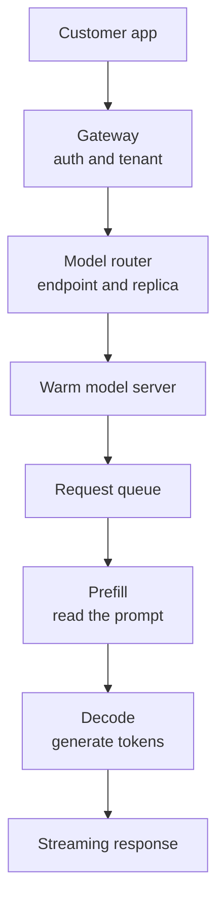

## Table of Contents

1. [Latency Is A Product Promise](#latency-is-a-product-promise)
2. [The Request Path](#the-request-path)
3. [Prefill And Decode Shape The Wait](#prefill-and-decode-shape-the-wait)
4. [Routing Must Understand Live Work](#routing-must-understand-live-work)
5. [Prompt Caching Is A Latency Tool With Conditions](#prompt-caching-is-a-latency-tool-with-conditions)
6. [Warm Capacity Beats Reactive Scaling For First Requests](#warm-capacity-beats-reactive-scaling-for-first-requests)
7. [Long Prompts Need Product Rules](#long-prompts-need-product-rules)
8. [A Customer Latency Investigation](#a-customer-latency-investigation)
9. [Tradeoffs](#tradeoffs)
10. [Review Standard](#review-standard)

## Latency Is A Product Promise

Low-latency inference means a
customer gets a useful response
quickly enough for the product
they are building. For an
inference provider, latency is not
an internal benchmark. It is part
of the commercial promise. If
Atlas Retail builds a live support
assistant on Northstar, its users
feel every slow first token as a
product delay.

The most important beginner
distinction is time to first token
versus total response time. Time
to first token is the delay before
a streaming model begins
answering. Total response time is
the time until the answer
finishes. A long but streaming
answer can feel usable if the
first token arrives quickly. A
short answer can feel broken if
the first token takes several
seconds.

Northstar should measure both. A
customer does not care that the
GPU was busy in a technically
efficient way if their support
agent waits through silence. The
platform must explain where the
wait happened and what decision
will reduce it.

## The Request Path

A low-latency design starts by
following one request. Atlas
Retail sends a chat request to
`atlas-chat-prod`. The request
passes through the gateway, tenant
policy, model-aware router, a
selected warm endpoint, the model
server queue, prefill, decode, and
streaming back to the customer.



The path gives the debugging
order. If the gateway adds 20 ms,
it matters less than a 900 ms
model queue. If routing sends long
prompts to a busy replica, adding
another gateway instance will not
help. If prefill dominates, prompt
length, caching, or model choice
may matter more than replica
count.

Low latency is a chain of small
delays. The provider improves it
by finding the largest delay that
can be changed without breaking
quality, cost, or isolation.

## Prefill And Decode Shape The Wait

LLM serving has two phases that
matter for latency. Prefill
processes the input prompt and
builds internal state. Decode
generates output tokens. Long
prompts make prefill heavier. Long
answers make decode longer. The
first token appears only after
enough prefill work is complete
and the decode loop begins.

A customer may say, "our model got
slower," but the trace should be
more specific:

```text
endpoint=atlas-chat-prod model=v13 route=eu-primary
input_tokens=18200 output_tokens=420
router_ms=8 queue_ms=540 prefill_ms=710 first_token_ms=1290
decode_ms=3880 total_ms=5170 cache_read_tokens=0
```

This trace says the first-token
problem is mostly queue plus
prefill. The total response is
long too, but the first wait comes
before the user sees anything. The
fix direction might be a separate
route for long prompts, prompt
caching, more warm replicas, or a
lower maximum context for this
endpoint tier.

Without the breakdown, an engineer
may optimize decode throughput and
leave the customer-facing pause
mostly unchanged.

## Routing Must Understand Live Work

A generic load balancer can spread
requests evenly and still make bad
choices. LLM replicas are not
equal just because they are Ready.
One may be processing long
prompts, another may have high KV
cache pressure, and a third may be
mostly idle. Model-aware routing
uses live serving signals to
choose a better replica.

Northstar's router should consider
queue depth, queue time, inflight
requests, prompt length class, GPU
memory pressure, and customer
placement rules. It should not
route Atlas Retail to a replica
borrowed by batch work or to a
region that violates the
customer's data policy.

A routing snapshot might look like
this:

| Replica | Inflight | Queue ms p95 | KV cache | Route decision |
|---------|----------|--------------|----------|----------------|
| atlas-0 | 6 | 720 | 91% | avoid |
| atlas-1 | 2 | 90 | 48% | prefer |
| atlas-2 | 3 | 140 | 55% | ok |

The table is small, but it teaches
the key decision. Latency-aware
routing is not "send traffic to
any healthy pod." It is "send this
request to the compatible replica
least likely to delay its first
token." AI inference routing needs
AI-specific load signals because a
replica can be healthy while its
KV cache, queue, or decode slots
make it a poor target.

## Prompt Caching Is A Latency Tool With Conditions

Prompt caching helps when many
requests share a stable prompt
prefix. OpenAI and Anthropic both
document prompt caching for
repeated context. For Northstar,
caching may apply to
customer system instructions, tool
definitions, long policy context,
or repeated examples. It usually
does not apply to the unique user
request.

The provider should explain cache
eligibility to customers. If Atlas
Retail sends a different system
prompt on every request, cache hit
rate will be poor. If it keeps a
stable policy block and changes
only the ticket text, cache hits
can reduce prefill work for that
stable prefix.

A cache review might use a table:

| Prompt part | Cacheable? | Reason |
|-------------|------------|--------|
| Atlas system policy | yes | stable across requests |
| Tool definitions | yes | changes only on deploy |
| Current customer ticket | no | unique per request |
| User follow-up | no | changes each turn |

Caching is not a free win. It adds
rules about prompt structure,
cache lifetime, invalidation, and
metrics. The provider should
expose cache read tokens, cache
write tokens, and cache hit rate
so customers understand whether
the feature is helping.

## Warm Capacity Beats Reactive Scaling For First Requests

Reactive autoscaling often arrives
after the customer already felt
the slow request. A new model
replica may need a node, image
pull, artifact download, checksum
verification, runtime load, and
warm-up. That can take minutes.
Low-latency endpoints need enough
warm capacity before traffic
arrives.

Northstar should treat warm
capacity as part of the customer's
plan. Atlas Retail may need six
warm replicas from 08:00 to 20:00
and two warm replicas overnight.
The cost is visible. The benefit
is visible too: first-token
latency stays stable when agents
start work.

A warm-capacity decision should
mention the measured cold path:

```text
endpoint=atlas-chat-prod
existing_node_to_ready=2m40s
new_node_to_ready=7m30s
business_hours_min_ready=6
after_hours_min_ready=2
scale_signal=model_queue_ms_p95
```

This artifact is more useful than
a generic max replica count. It
says why reactive scaling alone is
not enough and which signal should
trigger more capacity.

## Long Prompts Need Product Rules

Long prompts are a latency and
capacity problem, not only a model
feature. A customer may want large
context windows because they
simplify application code. The
provider must show the cost:
longer prefill, more memory
pressure, different routing
choices, and higher risk of
queueing behind other long
prompts.

Northstar can offer tiers.
Standard chat might allow moderate
prompt lengths with lower latency
targets. Large-context chat might
allow much longer prompts with a
different price and latency
objective. Batch summarization
might accept long prompts but no
interactive target.

The product rule matters because
platform engineers cannot fix
every long-prompt latency problem
with more GPUs. Sometimes the
correct answer is a different
endpoint tier, prompt caching,
retrieval that sends less context,
or a customer application change.

## A Customer Latency Investigation

Atlas Retail reports that first
tokens became slow after a weekend
migration. Northstar should be
able to show the path without
asking the customer to guess. The
trace says queue time rose from 80
ms to 640 ms. Input tokens also
rose because the customer's new
prompt includes a longer policy
section. Cache read tokens are
zero because the policy block
changes order on every request.

The diagnosis is not "the GPU is
slow." The request shape changed,
cache stopped helping, and
replicas are now holding longer
prefill work. Northstar can
recommend a stable cached policy
prefix, a separate route for long
prompts, and a temporary increase
in warm replicas while the
customer changes prompt
construction.

The important teaching point is
that latency fixes are often
cross-boundary. The provider owns
routing, warm capacity, and
serving metrics. The customer owns
some prompt shape. The trace gives
both sides a shared fact base.

## Tradeoffs

Lower latency usually costs
something. More warm replicas cost
money. Smaller batches can reduce
throughput. Smarter routing needs
more live metrics. Prompt caching
needs stable prompt structure.
Shorter prompts may require better
retrieval or product changes.
Larger GPUs may reduce latency but
raise the customer's price.

A provider should not hide these
tradeoffs. It should price and
document them. Premium endpoints
buy more predictable warm
capacity. Shared endpoints buy
lower cost with more queue
variance. Batch jobs buy cheaper
completion without interactive
latency. Clear product boundaries
make the engineering boundaries
easier to operate.

## Review Standard

A low-latency inference design is
ready when an engineer can explain
one slow request. The explanation
should include route, model
version, input tokens, queue time,
prefill time, first-token time,
decode time, cache behavior,
replica state, and customer tier.

If any of those are invisible, the
platform cannot reliably improve
latency. It can only add capacity
and hope. Northstar's standard is
higher: every customer latency
complaint should produce a
trace-backed story and a fix
direction.

---
**References**

- [vLLM Optimization and Tuning](https://docs.vllm.ai/en/latest/configuration/optimization.html) - Explains serving knobs that affect latency, throughput, and CPU coordination.
- [vLLM Automatic Prefix Caching](https://docs.vllm.ai/en/v0.10.1/features/automatic_prefix_caching.html) - Documents KV-cache reuse for requests that share a prompt prefix.
- [NVIDIA Triton Optimization](https://docs.nvidia.com/deeplearning/triton-inference-server/user-guide/docs/user_guide/optimization.html) - Explains dynamic batching and concurrency tradeoffs for inference latency.
- [TensorFlow Serving Performance Guide](https://www.tensorflow.org/tfx/serving/performance) - Documents batching and performance choices in an established serving stack.
- [Anthropic Prompt Caching](https://docs.anthropic.com/en/docs/build-with-claude/prompt-caching) - Shows provider-facing caching behavior for long-context requests.
- [OpenAI Prompt Caching](https://platform.openai.com/docs/guides/prompt-caching) - Documents prompt reuse behavior, latency impact, and cache monitoring for API requests.
