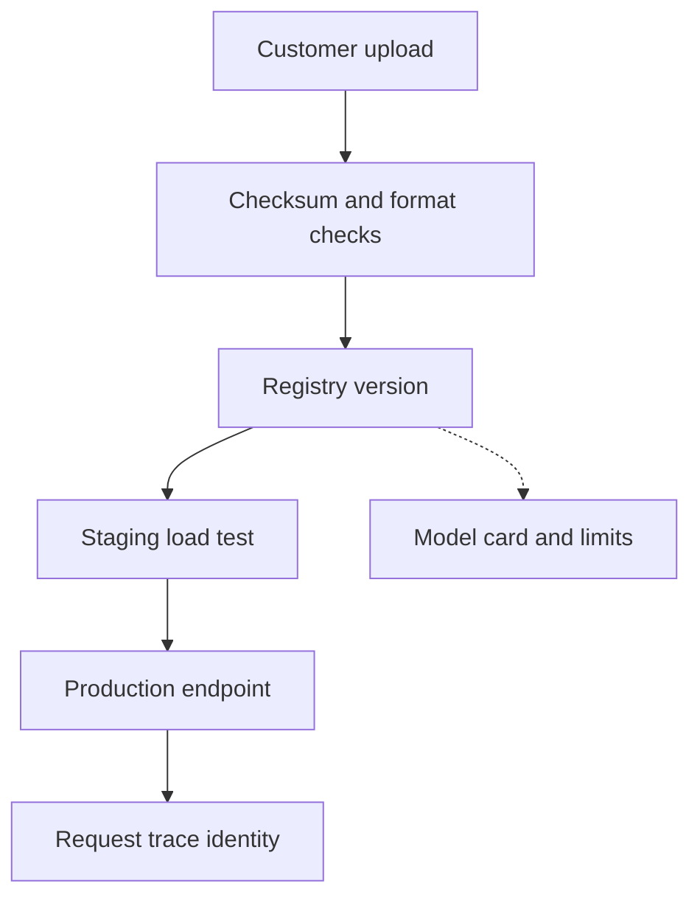

## Table of Contents

1. [The Registry Is Artifact Custody](#the-registry-is-artifact-custody)
2. [The Artifact Flow](#the-artifact-flow)
3. [Intake Checks Prevent Later Mysteries](#intake-checks-prevent-later-mysteries)
4. [Aliases Are Human Names For Versions](#aliases-are-human-names-for-versions)
5. [Model Cards Capture Customer Intent](#model-cards-capture-customer-intent)
6. [Runtime Compatibility Is Registry Data](#runtime-compatibility-is-registry-data)
7. [Request Traces Close The Loop](#request-traces-close-the-loop)
8. [A Custody Incident](#a-custody-incident)
9. [Failure Modes](#failure-modes)
10. [Review Standard](#review-standard)

## The Registry Is Artifact Custody

A model registry is not just a
list of model names. For Northstar
Inference, it is the custody
system for customer artifacts. It
records what the customer
submitted, what Northstar
verified, which runtime can load
it, which endpoint served it, and
which requests used it.

Atlas Retail uploads
`atlas-chat-v13`. If an incident
happens later, Northstar must
prove whether production served
v12 or v13, whether the artifact
bytes changed, whether the runtime
was compatible, and whether the
customer approved the version. A
storage path alone cannot answer
those questions.

Registry quality shows up during
stressful moments. When a customer
asks "which model answered this
request?" the provider should not
search old deployment messages.
The answer should be in the trace,
backed by registry metadata and
artifact checksum.

## The Artifact Flow

A healthy artifact flow has clear
handoffs. The customer submits an
artifact. Intake verifies it. The
registry records it. Staging loads
it. Production serves it.
Observability records the resolved
version per request.



The trace at the end is important.
Many teams stop at
registry-to-deployment. A provider
has to carry the identity one step
further, into each request.
Otherwise the registry can be
correct while production remains
hard to prove.

## Intake Checks Prevent Later Mysteries

Intake is where Northstar confirms
that a customer artifact is
hostable. It should verify
checksum, file layout, tokenizer
presence, declared runtime,
license or allowed use fields if
required, maximum context,
expected memory, and a small smoke
test. Intake should also reject
ambiguous artifacts such as
mutable `latest` paths.

A concise intake record might look
like this:

```yaml
customer: atlas-retail
model: atlas-chat
version: v13
artifact_sha256: 8d91a3
format: safetensors
runtime_profile: vllm-chat-h100
max_context_tokens: 32000
smoke_test: passed
memory_profile_gb: 71
status: accepted_for_staging
```

The record is not busywork. It
keeps later incidents from
becoming archaeology. If v13 fails
to load in production, the team
can compare production behavior
with the intake smoke test and
memory profile. If a checksum
mismatch appears, the artifact
changed or the wrong path was
loaded.

## Aliases Are Human Names For Versions

Aliases such as `staging`,
`candidate`, and `production` help
humans talk about versions. They
are pointers, not artifacts.
Moving an alias changes what
future deployments may load, so
alias moves need audit records.

A safe alias event says who moved
the pointer and why:

```text
model=atlas-chat alias=production old=v12 new=v13
changed_by=northstar-release-bot approved_by=atlas-admin-17
change_request=rel-2026-05-08-44
```

The serving system should resolve
the alias at load time and record
the resolved version. If a request
trace only says `production`, it
becomes ambiguous after the alias
moves again. If it says
`production resolved to v13`, the
future investigation is clear.

## Model Cards Capture Customer Intent

A model card is the human
explanation that travels with the
model. It describes intended use,
known limits, evaluation context,
and warnings. For public
repositories, Hugging Face model
cards are a familiar pattern. For
Northstar, the same idea can be
private and customer-specific.

Atlas's model card might say that
v13 is intended for English retail
support chats, not legal advice,
refund approval, or fully
automated customer responses. It
might note that the evaluation set
has limited coverage for
mixed-language tickets.

This matters during rollout and
support. If Atlas starts using v13
for automatic refund decisions,
Northstar can point to the model
card and require a new review. If
bad answers cluster around
mixed-language tickets, the known
limits become part of the incident
explanation.

## Runtime Compatibility Is Registry Data

A model version is not only
weights. It has runtime needs:
server type, tokenizer, tensor
parallel settings, maximum
context, memory profile, and
supported GPU class. If that
information lives only in
deployment YAML, the registry is
incomplete.

Northstar should store runtime
compatibility with the model
version so scheduling and serving
can make correct decisions.
`atlas-chat-v13` may require the
chat H100 pool. `finch-rerank-v8`
may fit on L40S with Triton. A
batch embedding model may run on
A10.

This metadata prevents wrong-shape
deployment. The control plane can
reject a request to serve v13 on a
pool where it will OOM before the
customer sees a failed rollout.

## Request Traces Close The Loop

The artifact flow is incomplete
until request traces record the
version that served. A startup log
proves a pod loaded v13. A request
trace proves a particular customer
call hit v13. Both are needed.

A good request identity includes
customer, endpoint, resolved model
version, artifact checksum, prompt
version if relevant, runtime, and
route. That lets Northstar answer
customer questions like: did any
production request use the
candidate after rollback? Did the
slow requests all hit the new
artifact? Did a region serve the
wrong version?

Registry, deployment, and
observability must agree. If the
registry says production is v12
but traces show v13, the system
has a serious control-plane bug.
The provider should alert on that
mismatch.

## A Custody Incident

Atlas reports that some answers
use older product names. Northstar
checks traces and finds that the
affected requests all came from
one region. The registry alias
says production is v13 everywhere,
but the region's startup logs show
one replica loaded v12 from a
stale local cache.

The registry did its job by naming
the expected version. The runtime
logs did their job by recording
the loaded version. The trace did
its job by proving which requests
hit the stale replica. The fix is
to evict the stale cache, restart
the replica, and add a
control-plane check that compares
loaded version with desired alias
before routing traffic.

Without artifact identity in all
three places, this incident would
look like random model behavior.

## Failure Modes

Mutable paths are the first
failure mode. A deployment reads
`latest` and the artifact changes.
The fix direction is immutable
artifact URIs and checksum
verification.

Alias moves without audit are the
second failure mode. Nobody knows
who changed production. The fix
direction is registry events tied
to change requests and customer
approval.

Runtime metadata drift is the
third failure mode. The registry
says a model is approved, but the
deployment uses a different
tokenizer or runtime flag. The fix
direction is storing runtime
compatibility as part of the model
contract.

Trace identity gaps are the fourth
failure mode. The registry knows
the version, but request evidence
does not. The fix direction is
resolved model version and
artifact hash on every served
request.

## Review Standard

A registry design passes review
when Northstar can prove five
things: what the customer
submitted, what bytes were
verified, what runtime can host
it, what version production
resolved, and which requests
served it. If any proof is
missing, the artifact flow is not
ready for a provider business.

---
**References**

- [MLflow Model Registry Workflows](https://mlflow.org/docs/latest/ml/model-registry/workflow/) - Documents model versions, aliases, tags, and promotion workflows.
- [Hugging Face Model Cards](https://huggingface.co/docs/hub/en/model-cards) - Explains metadata that helps users understand model lineage, limits, and intended use.
- [TensorFlow SavedModel Guide](https://www.tensorflow.org/guide/saved_model) - Explains the portable artifact format used by TensorFlow serving tools.
- [OCI Image Specification](https://github.com/opencontainers/image-spec/blob/main/spec.md) - Defines content-addressed image metadata that inspires artifact digest practices.
