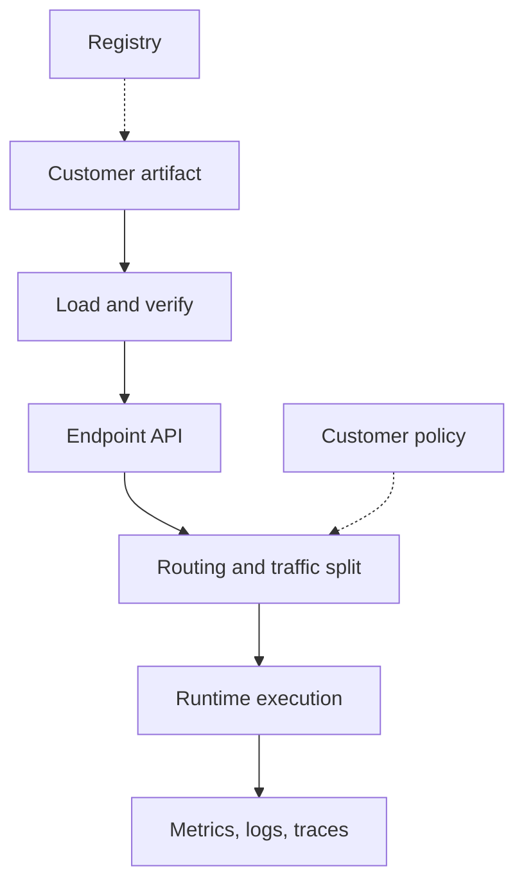

## Table of Contents

1. [The Platform Choice Is A Contract](#the-platform-choice-is-a-contract)
2. [The Serving Responsibilities](#the-serving-responsibilities)
3. [LLM Serving Needs A Chat Contract](#llm-serving-needs-a-chat-contract)
4. [Triton Fits Runtime-Controlled Models](#triton-fits-runtime-controlled-models)
5. [KServe Fits Kubernetes-Native Control](#kserve-fits-kubernetes-native-control)
6. [Ray Serve Fits Python Service Graphs](#ray-serve-fits-python-service-graphs)
7. [The Gateway Is Also A Serving Layer](#the-gateway-is-also-a-serving-layer)
8. [A Platform Decision Record](#a-platform-decision-record)
9. [Failure Modes](#failure-modes)
10. [Review Standard](#review-standard)

## The Platform Choice Is A Contract

A model serving platform is the
layer that turns model artifacts
into endpoints customers can call.
For Northstar Inference, the
platform choice is a contract. It
says which API the customer sees,
how the model loads, how replicas
scale, how traffic moves during
rollout, which metrics are
emitted, and who owns failures.

A provider should not choose a
serving tool because it is
fashionable. It should choose a
serving contract that matches the
workload. Atlas Retail wants an
OpenAI-compatible chat endpoint
with streaming and low first-token
latency. Finch Finance wants a
reranker with predictable p95
latency and high throughput. A
media customer wants batch image
generation where completion by
morning matters more than
interactive response.

Those customers may all use GPUs,
but they do not need the same
serving layer. The platform must
be able to explain why one
customer uses an LLM runtime,
another uses a Triton-style
runtime, and another uses batch
workers behind a job API.

## The Serving Responsibilities

Every serving platform owns some
subset of the same
responsibilities: loading
artifacts, exposing an API,
managing readiness, routing
requests, batching work, reporting
metrics, and rolling versions. A
custom service can own all of
these manually. A platform layer
can own many of them consistently.



The diagram helps reviewers ask
what is missing. If a team
proposes a plain container
deployment, who verifies the
artifact? Who exposes model
identity in traces? Who handles
canary traffic? Who knows when the
model is loaded? There are valid
answers, but they must be
explicit.

A provider can have several
serving layers. The danger is not
variety. The danger is unclear
ownership between the gateway,
control plane, runtime, scheduler,
and customer support path.

## LLM Serving Needs A Chat Contract

Large language model endpoints
often need chat-style APIs,
streaming, tokenizer handling,
prompt length controls, and
scheduling that understands
prefill and decode. vLLM is a
common open-source runtime for
serving LLMs with an
OpenAI-compatible server. That
compatibility matters because many
customers already have clients
that expect familiar chat
completion routes.

For Atlas Retail, the contract
might say: the endpoint accepts
chat requests, streams tokens,
records input and output token
counts, supports a maximum context
length, and exposes time to first
token. A one-line command can
start a server in a lab, but the
provider contract is larger than
that command.

Northstar should explain the
contract in prose before showing
any runtime option:

```text
endpoint=atlas-chat-prod
api=chat-completions-compatible
streaming=true
runtime=vllm
primary_signal=first_token_ms
risk=long_prompt_queueing
```

This artifact is small because the
lesson is not command syntax. The
lesson is that chat serving needs
a runtime and operating model that
understand token-shaped work. If
Northstar hides that behind a
generic HTTP service, it will
struggle to explain long-prompt
latency and queue behavior.

## Triton Fits Runtime-Controlled Models

Some customer models need tight
control over model repository
layout, framework runtime,
batching, and GPU metrics. NVIDIA
Triton is designed for serving
models from multiple frameworks
and gives explicit controls for
batching and version handling.
That makes it a good fit when the
provider needs runtime control
more than a chat-specific API.

Finch Finance's reranker is a good
example. The model receives many
small requests, and throughput
matters. Dynamic batching may
improve GPU use, but only if the
added queue delay stays under the
customer's p95 target. Triton
makes that tradeoff visible
through configuration and metrics.

The provider's explanation should
be practical: Finch uses Triton
because reranking traffic can be
batched safely within a tight
delay budget, the model artifact
has a stable repository shape, and
the customer cares about
predictable p95 latency. If those
facts change, the platform choice
may change.

## KServe Fits Kubernetes-Native Control

KServe is useful when the provider
wants model endpoints represented
as Kubernetes-native resources. It
can give a control-plane object
for deployment, autoscaling, and
rollout behavior. For Northstar,
KServe might sit above runtimes
such as vLLM or Triton, giving the
platform a standard way to manage
model endpoints.

The value is not that customers
read the KServe YAML. Most
customers never should. The value
is that Northstar engineers can
manage endpoint lifecycle
consistently: create an inference
service, observe readiness, shift
canary traffic, and connect model
metadata to runtime pods.

The tradeoff is operational depth.
KServe does not remove Kubernetes
complexity. It gives a
model-serving abstraction on top
of it. Northstar still needs to
understand GPU scheduling,
ingress, storage credentials,
runtime images, and autoscaling
delays. A provider should adopt
KServe only if it is ready to
operate the layers underneath.

## Ray Serve Fits Python Service Graphs

Some inference products are not
one model call. A customer may
need preprocessing, retrieval, one
model for classification, another
model for generation, and
post-processing before the
response. Ray Serve is useful when
the serving application is a
Python graph with independently
scalable pieces.

For example, a customer support
automation endpoint might run
language detection, choose a
model, call a policy classifier,
then call a generation model.
Scaling only the generation step
may be enough during traffic
spikes. Scaling every part equally
may waste capacity.

Ray Serve can represent that
graph, but the provider must then
observe Ray application health,
queue sizes, replica state, and
underlying GPU placement. It is a
good fit when the application
graph is real. It is unnecessary
machinery when the customer only
needs a single model endpoint.

## The Gateway Is Also A Serving Layer

Northstar's customer-facing
gateway is part of the serving
platform even if it does not run
the model. It handles
authentication, tenant routing,
quotas, request limits, streaming
behavior, error shape, and
sometimes prompt caching or policy
checks. Customers experience the
gateway as the product.

This matters because many
incidents happen before the model
runtime. A customer may be
throttled by tenant quota, routed
to a cold region, blocked by
request size, or affected by a
gateway streaming bug. If the
serving platform discussion
ignores the gateway, it ignores
the first part of the request
path.

The gateway should record which
endpoint, model version, route,
runtime, and tenant handled each
request. That identity lets
support explain incidents without
exposing internal pod names to
customers.

## A Platform Decision Record

A serving platform decision should
fit on one page. It should name
the customer workload, primary
user experience, runtime contract,
rollout needs, and evidence. Long
comparison matrices often hide the
decision instead of clarifying it.

A good record for Finch might say:

```yaml
customer: finch-finance
endpoint: finch-rerank-prod
workload_shape: high-throughput reranking
latency_target: p95 under 80 ms
chosen_runtime: triton
control_plane: kserve
why: dynamic batching with visible queue delay and model metrics
not_chosen: vllm, because workload is not chat generation
rollback_signal: p95 latency, error rate, output score drift
```

This record is useful because it
connects tool choice to workload
shape. Six months later, an
engineer can revisit the decision
when Finch adds longer inputs or a
new model family. The record also
helps customer support explain why
a platform migration is being
proposed.

## Failure Modes

The first failure mode is choosing
a runtime by brand rather than
contract. A chat workload lands on
a generic service and lacks
token-level metrics. The fix
direction is a serving contract
that names streaming, TTFT, prompt
length, and token counts.

The second failure mode is burying
rollout behavior in custom
scripts. The model can deploy, but
nobody knows how canary traffic
works or how rollback is verified.
The fix direction is a
control-plane object or release
record that exposes traffic state.

The third failure mode is
splitting ownership too thinly.
The gateway, KServe object,
runtime, scheduler, and registry
each work alone, but no team owns
the full endpoint. The fix
direction is an endpoint owner and
trace path from customer request
to model runtime.

The fourth failure mode is using a
graph platform for a single-model
problem. The provider gains
operational complexity without a
serving benefit. The fix direction
is to match platform complexity to
workload complexity.

## Review Standard

A model serving platform article
should help a junior engineer
explain why a customer endpoint
runs where it runs. The right
answer should mention workload
shape, API contract, runtime
behavior, rollout needs,
autoscaling signal, and
observability.

For Northstar, a serving platform
is approved when a customer
artifact can be loaded, served,
measured, rolled forward, rolled
back, and explained. If a tool
choice leaves one of those verbs
unanswered, the design is not
done.

---
**References**

- [KServe Introduction](https://kserve.github.io/website/docs/intro) - Introduces the Kubernetes-native serving abstraction used for inference services.
- [NVIDIA Triton Optimization](https://docs.nvidia.com/deeplearning/triton-inference-server/user-guide/docs/user_guide/optimization.html) - Explains batching, concurrency, and model-server tuning for GPU inference.
- [TensorFlow Serving Architecture](https://www.tensorflow.org/tfx/serving/architecture) - Shows how a mature serving system separates sources, loaders, managers, and servables.
- [Ray Serve on Kubernetes](https://docs.ray.io/en/latest/serve/production-guide/kubernetes.html) - Documents deployment concerns when Ray Serve runs on Kubernetes.
- [vLLM Production Metrics](https://docs.vllm.ai/en/latest/usage/metrics.html) - Lists serving metrics that a platform can expose for LLM inference.
