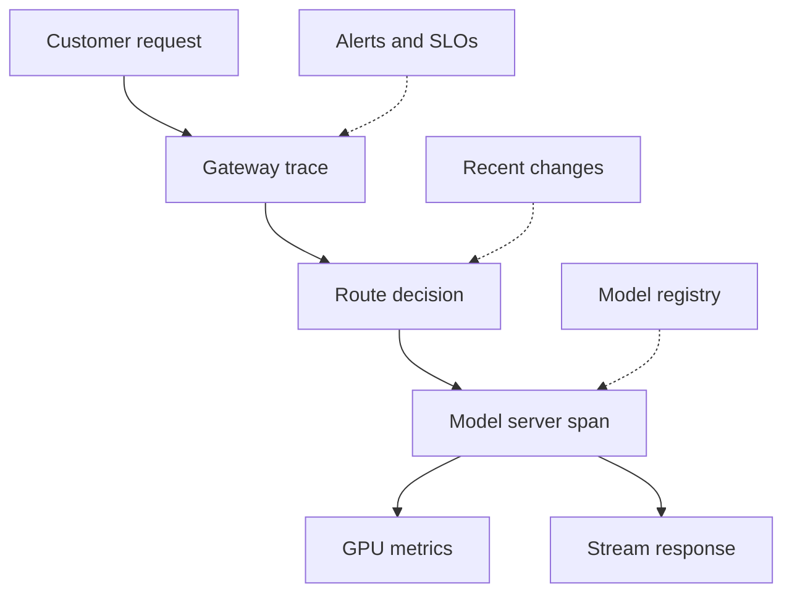

## Table of Contents

1. [The Customer Wants Proof](#the-customer-wants-proof)
2. [The Evidence Path](#the-evidence-path)
3. [Request Identity Is The Spine](#request-identity-is-the-spine)
4. [Metrics Need Customer And Model Labels](#metrics-need-customer-and-model-labels)
5. [Logs Explain Phases, Not Essays](#logs-explain-phases-not-essays)
6. [Rollout Context Belongs On The Dashboard](#rollout-context-belongs-on-the-dashboard)
7. [A Customer Ticket Walkthrough](#a-customer-ticket-walkthrough)
8. [Failure Modes](#failure-modes)
9. [Review Standard](#review-standard)

## The Customer Wants Proof

Observability is the ability to
understand a running system from
the evidence it emits: traces,
metrics, logs, events, and status
records. For Northstar Inference,
observability also has a
customer-facing job. When Atlas
Retail says, "our endpoint got
slower after your migration,"
Northstar must show a trace-backed
answer, not a dashboard screenshot
with a vague green check.

A hosted inference provider needs
the usual service signals, but
those signals must include
model-serving identity. A request
should say which customer,
endpoint, model version, prompt
version, route, runtime, replica,
and region served it. Without that
identity, Northstar can know that
latency rose but still fail to
explain which customer workload
changed.

The running example is a ticket
from Atlas Retail. Their
`atlas-chat-prod` endpoint has
higher first-token latency this
morning. Northstar's support
engineer needs to determine
whether the cause is a model
version rollout, longer prompts,
cache misses, queue pressure, GPU
memory pressure, or a routing
change.

## The Evidence Path

A useful observability design
follows the request path. The
customer call reaches the gateway,
the gateway resolves tenant and
endpoint, the router picks a
replica, the model server queues
and runs the request, the GPU does
work, and the response streams
back. Each step should leave a
small piece of evidence.



The dotted systems explain
context. A route decision makes
more sense when you know a rollout
started. A model-server span makes
more sense when you can join it to
the registry version. A GPU metric
makes more sense when you can
connect the node to the customer
endpoint running there.

A provider should make these joins
easy because customer incidents
are time-sensitive. The first
useful click from an alert should
lead to example traces, model
versions, and recent changes.

## Request Identity Is The Spine

Request identity is the set of
fields that lets Northstar join
evidence across systems. It is
tempting to log only request id
and HTTP status. That is not
enough for model serving. A
request can return 200 and still
be slow, expensive, or wrong.

A safe request record might
include this shape:

```json
{
  "trace_id": "trc-91be",
  "customer": "atlas-retail",
  "endpoint": "atlas-chat-prod",
  "model_version": "v13",
  "artifact_sha": "8d91a3",
  "route": "eu-primary",
  "runtime": "vllm-2026-04-29",
  "input_tokens": 18200,
  "first_token_ms": 1290,
  "queue_ms": 540,
  "cache_read_tokens": 0
}
```

This record does not include
private prompt text. It gives
enough identity to debug the
system while reducing privacy
risk. For deeper quality
investigations, Northstar can use
approved sampling or
customer-provided examples, but
the default observability path
should not depend on storing raw
prompts.

The model version and artifact
hash matter because customers
often roll models forward while
platform teams roll runtimes
forward. If both change in the
same week, request identity is the
only way to separate them.

## Metrics Need Customer And Model Labels

Metrics turn many requests into
time series. For a provider, those
series must be label-rich enough
to support customer operations
without creating unsafe
cardinality. The core dimensions
are customer, endpoint, model
version, region, route, and error
class. The core signals are
first-token latency, total
latency, queue time, input tokens,
output tokens, cache behavior,
request errors, GPU memory, GPU
utilization, and hardware errors.

The customer-facing dashboard
should answer three questions
quickly. Are users waiting? Which
endpoints or versions are
affected? Is the bottleneck before
the GPU, inside the model server,
or on the hardware? A GPU-only
dashboard cannot answer those
questions. An HTTP-only dashboard
cannot answer them either.

For example, high GPU utilization
with low queue time may be fine.
High GPU utilization with rising
queue time is customer risk. Low
GPU utilization with high queue
time suggests requests are stuck
before useful GPU work, perhaps in
routing, admission, or a
dependency. The labels and panels
must help an engineer tell those
cases apart.

## Logs Explain Phases, Not Essays

Logs should not become the main
observability system, but they are
still useful when they describe
phases. A model-serving request
moves through admit, queue,
prefill, first token, decode,
complete, or fail. Those phase
names make startup and latency
problems readable.

A phase log for Atlas might say:

```text
09:14:12 trace=trc-91be endpoint=atlas-chat-prod phase=admit queue_ms=540
09:14:13 trace=trc-91be endpoint=atlas-chat-prod phase=prefill input_tokens=18200
09:14:14 trace=trc-91be endpoint=atlas-chat-prod phase=first_token first_token_ms=1290
09:14:18 trace=trc-91be endpoint=atlas-chat-prod phase=complete output_tokens=420
```

The log does not teach the whole
system by itself. It supports the
trace. A responder can see where
the request waited and then
inspect route, cache, and GPU
metrics for the same trace.

Logs should also classify errors.
`runtime_oom`,
`artifact_verify_failed`,
`quota_exceeded`, and
`dependency_timeout` send
engineers to different owners. One
error bucket named
`inference_failed` is too vague
for a provider.

## Rollout Context Belongs On The Dashboard

Many model incidents happen near
changes. A customer uploads a new
artifact. Northstar updates a
runtime image. A route weight
changes. A prompt caching policy
changes. If the dashboard does not
show those events, responders
waste time comparing memory and
latency graphs without knowing
what changed.

Northstar should annotate latency
dashboards with rollout events and
registry changes. When Atlas
reports a latency jump at 09:00,
the dashboard should show that
`atlas-chat-prod` moved five
percent of traffic to v13 at
08:45, or that the router changed
long-prompt routing at 08:50.

This is the difference between
observability and monitoring.
Monitoring says a number is bad.
Observability gives enough context
to ask why the number changed.

## A Customer Ticket Walkthrough

Atlas Retail opens a ticket:
"first token latency doubled after
the migration." Northstar starts
with the customer endpoint
dashboard and clicks into slow
traces. The slow traces all use
model v13, route `eu-primary`,
runtime `vllm-2026-04-29`, and
cache read tokens equal zero. The
prompt length is also higher than
last week.

The route dashboard shows no
cross-region issue. GPU metrics
show memory pressure but no
hardware errors. The rollout panel
shows that Atlas changed its
system prompt template during the
migration and reordered the stable
policy block on every request.
That explains the cache misses.
Queue time rose because long
prefill work increased on each
replica.

The provider response can now be
specific. Northstar recommends
stabilizing the cacheable prompt
prefix, temporarily increasing
warm replicas, and routing long
prompts separately until the
prompt change is fixed. The answer
is not "the platform is healthy."
It is an explanation with evidence
and a customer action.

## Failure Modes

The first failure mode is missing
model identity. Northstar sees
latency, but cannot prove which
model version served the slow
requests. The fix direction is
model version, artifact hash,
runtime, and route fields in
traces and logs.

The second failure mode is
hardware-only visibility. GPU
dashboards look detailed, but
customer endpoints are not
connected to nodes. The fix
direction is endpoint-to-node
mapping and customer labels on
service metrics.

The third failure mode is
privacy-unsafe logging. Engineers
log raw prompts to debug quality.
The fix direction is safe
identifiers, approved sampling,
redaction, and customer-controlled
reproduction paths.

The fourth failure mode is alert
label poverty. A page says "first
token high" but not customer,
endpoint, model version, or
region. The fix direction is alert
labels that match the first debug
decision.

## Review Standard

Observability passes review when a
support engineer can explain one
customer complaint without asking
five teams for screenshots. The
trace should identify customer,
endpoint, model, route, runtime,
latency phases, token counts,
cache behavior, and error class.
The dashboard should show recent
changes. The hardware view should
connect nodes to affected
endpoints.

If the system cannot produce that
evidence, Northstar is operating
by inference about its inference
platform. That is not good enough
for a company selling model
endpoints.

---
**References**

- [OpenTelemetry GenAI Semantic Conventions](https://opentelemetry.io/docs/specs/semconv/gen-ai/) - Defines common telemetry attributes for generative AI requests, metrics, and spans.
- [OpenTelemetry Semantic Conventions](https://opentelemetry.io/docs/concepts/semantic-conventions/) - Explains why shared names make telemetry easier to correlate across tools.
- [vLLM Production Metrics](https://docs.vllm.ai/en/latest/usage/metrics.html) - Lists model-serving metrics exposed by vLLM for production monitoring.
- [NVIDIA DCGM-Exporter](https://docs.nvidia.com/datacenter/dcgm/latest/gpu-telemetry/dcgm-exporter.html) - Documents GPU telemetry for Prometheus-style monitoring.
- [OpenAI Scaling Kubernetes to 7,500 Nodes](https://openai.com/index/scaling-kubernetes-to-7500-nodes/) - Shows how large AI clusters use metrics, dashboards, and health checks.
