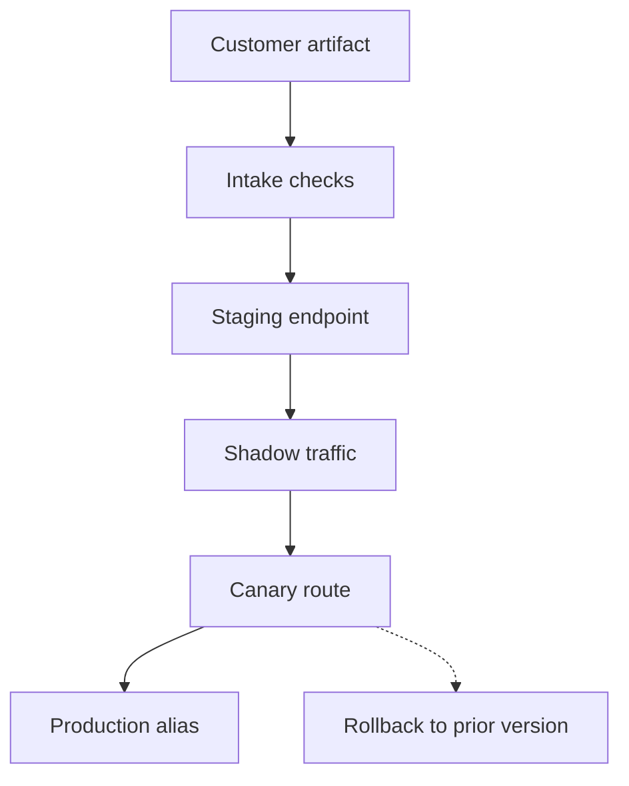

## Table of Contents

1. [A Model Rollout Is A Customer Event](#a-model-rollout-is-a-customer-event)
2. [The Rollout Path](#the-rollout-path)
3. [Offline Evaluation Is Necessary But Narrow](#offline-evaluation-is-necessary-but-narrow)
4. [Shadow Traffic Reduces Customer Risk](#shadow-traffic-reduces-customer-risk)
5. [Canary Traffic Tests The Whole Path](#canary-traffic-tests-the-whole-path)
6. [Rollback Restores More Than Weights](#rollback-restores-more-than-weights)
7. [Customer Approval Should See Evidence](#customer-approval-should-see-evidence)
8. [A Rollout Incident](#a-rollout-incident)
9. [Failure Modes](#failure-modes)
10. [Review Standard](#review-standard)

## A Model Rollout Is A Customer Event

A model rollout moves customer
traffic from one model version to
another. At Northstar, that
rollout may be requested by a
customer, approved by a customer,
or driven by Northstar's own
runtime migration. Either way, it
can change answer quality,
latency, token use, cost, and
support volume.

Atlas Retail wants to promote
`atlas-chat-v13` after internal
evaluation. The model appears
better on refund conversations,
but Northstar has never served it
under real Atlas traffic. The
provider's job is to move traffic
gradually, collect evidence, and
keep a rollback path ready.

A rollout is not safe because the
container starts. It is safe only
when the platform can prove which
model served which requests, which
traffic percentage moved, which
signals stayed healthy, and how to
return to the previous version.

## The Rollout Path

A provider rollout should have
gates. The artifact enters the
registry. Intake checks confirm
runtime compatibility. Staging
proves the model can load. Shadow
traffic compares behavior without
serving the result. Canary traffic
exposes a small percentage of
users. Promotion moves the
production alias only after
evidence is reviewed.



The rollback branch is shown
before production because rollback
is not an afterthought. If
Northstar cannot name the previous
model, prompt template, tokenizer,
runtime, and route state, it is
not ready to canary the new
version.

## Offline Evaluation Is Necessary But Narrow

Offline evaluation checks a model
before live traffic. Atlas Retail
may provide labeled examples,
policy checks, and internal
quality scores. Northstar may add
hosting-specific checks such as
latency benchmarks, maximum
context behavior, and runtime
compatibility.

Offline evaluation is necessary
because it catches obvious
problems cheaply. It is narrow
because it cannot perfectly
represent live prompt shape,
customer traffic bursts, tool
calls, and routing behavior. A
model can pass offline tests and
still hurt first-token latency or
cost under production traffic.

A good evaluation record says what
was tested and what was not
tested. That honesty matters
later. If v13 fails on a ticket
type absent from the test set, the
post-incident fix is not only
rollback. It is improving the
evaluation set before the next
candidate.

## Shadow Traffic Reduces Customer Risk

Shadow traffic copies live
requests to the candidate model
but does not return the candidate
response to the customer.
Northstar can compare latency,
token use, tool calls, and answer
differences while the stable model
continues serving users.

Shadow traffic must avoid side
effects. A shadowed tool call
should not send emails, update
orders, or charge accounts. A
candidate response should be
stored only under approved data
rules. The provider must treat
shadow outputs as sensitive
customer data.

The value of shadowing is
evidence. Northstar can tell
Atlas: v13 is 18 percent slower on
long refund prompts, uses 11
percent more output tokens, but
scores better on sampled answer
quality. That gives the customer a
decision instead of a surprise.

## Canary Traffic Tests The Whole Path

A canary sends a small percentage
of real traffic to the candidate.
This tests the whole production
path: gateway, route, runtime, GPU
pool, cache behavior, and customer
prompt shape. KServe and other
serving control planes can
represent canary traffic
explicitly, but the same concept
applies even when Northstar uses a
custom router.

The canary rule should be written
before traffic moves. For Atlas,
Northstar might start at five
percent, hold for one hour, and
promote only if first-token p95
stays under the tier target, error
rate does not rise, output token
cost stays within the agreed band,
and sampled support feedback does
not regress.

The stop rule matters as much as
the promote rule. If v13 causes
runtime OOM, cache miss storms, or
bad-answer reports, the route
should return to v12 quickly. A
canary without a stop rule is just
a slower full rollout.

## Rollback Restores More Than Weights

A model rollback may involve model
weights, tokenizer, prompt
template, runtime flags, route
weights, artifact cache, and
registry alias. If only one part
rolls back, the endpoint can enter
a mixed state that is harder to
debug than the original issue.

A rollback scope for Atlas should
name each piece:

```yaml
endpoint: atlas-chat-prod
rollback_from: atlas-chat-v13
rollback_to: atlas-chat-v12
restore:
  model_alias: production -> v12
  tokenizer: atlas-tokenizer-v12
  prompt_template: atlas-system-2026-04-11
  route_weight_v13: 0
  route_weight_v12: 100
verify:
  no_v13_requests_after: 10m
  first_token_p95_under_ms: 750
```

The verification step is what
makes rollback complete. Northstar
should prove that new requests
stopped hitting v13 and that v12
is healthy. Without request-level
model identity, that proof is
impossible.

## Customer Approval Should See Evidence

Customers should not approve
production promotion from a vague
green status. Northstar should
show the customer the evidence
relevant to their endpoint: shadow
comparison, canary latency, error
rate, token cost, quality samples,
and known gaps.

The approval does not need to
expose internal infrastructure
details. Atlas does not need pod
names. It needs to know whether
v13 met the agreed behavior and
what rollback will do. This keeps
the customer decision focused on
product impact rather than
platform internals.

For regulated or high-value
customers, approval may also
include data-region confirmation,
artifact checksum, and a signed
release record. The point is the
same: a model rollout changes
customer behavior, so the evidence
should be customer-readable.

## A Rollout Incident

At 09:00, Northstar moves five
percent of Atlas traffic to v13.
At 09:12, first-token p95 for v13
rises above the target while v12
stays healthy. At 09:16, support
tickets mention slower responses
only from a small set of accounts.
The trace shows those accounts
send very long prompts and v13
misses prompt cache because the
tokenizer package changed.

Northstar pauses the canary at
09:18, returns traffic to v12,
confirms no v13 requests after
09:28, and sends Atlas a report.
The report says v13 is not
rejected for quality, but the
rollout needs a tokenizer/cache
review before another canary.

This incident is a success if the
canary limited customer impact and
produced a clear next action. The
goal of rollout design is not to
guarantee every candidate
succeeds. It is to make failure
small, explained, and reversible.

## Failure Modes

The first failure mode is mutable
version names. The endpoint loads
`latest` and nobody can prove
which model served traffic. The
fix direction is immutable
versions and resolved aliases in
request traces.

The second failure mode is
offline-only confidence. The
candidate passes static tests but
fails under live prompt shape. The
fix direction is shadow traffic
and canary gates.

The third failure mode is partial
rollback. The route returns to
v12, but the v13 tokenizer or
prompt template remains. The fix
direction is a rollback scope that
names all model contract pieces.

The fourth failure mode is
customer-blind approval. The
platform promotes because internal
metrics are green, but the
customer never sees behavior
evidence. The fix direction is a
release report tied to the
customer's endpoint objectives.

## Review Standard

A rollout passes review when the
team can answer: what artifact is
moving, who approved it, what
offline tests covered, how shadow
or canary traffic will work, which
signals stop the rollout, what
rollback restores, and how
Northstar proves rollback
completed.

If any answer is missing, the
model may still be interesting,
but it is not ready for
provider-managed production
traffic.

---
**References**

- [KServe Canary Rollout Example](https://kserve.github.io/website/docs/model-serving/predictive-inference/rollout-strategies/canary-example) - Shows how inference traffic can be split between old and new revisions.
- [TensorFlow Serving Configuration](https://www.tensorflow.org/tfx/serving/serving_config) - Documents serving multiple versions and using version policies.
- [MLflow Model Registry Workflows](https://mlflow.org/docs/latest/ml/model-registry/workflow/) - Shows model aliases and registry workflows for promotion decisions.
- [Kubernetes Deployments](https://kubernetes.io/docs/concepts/workloads/controllers/deployment/) - Explains rollout status, rolling updates, and rollback behavior for workloads.
