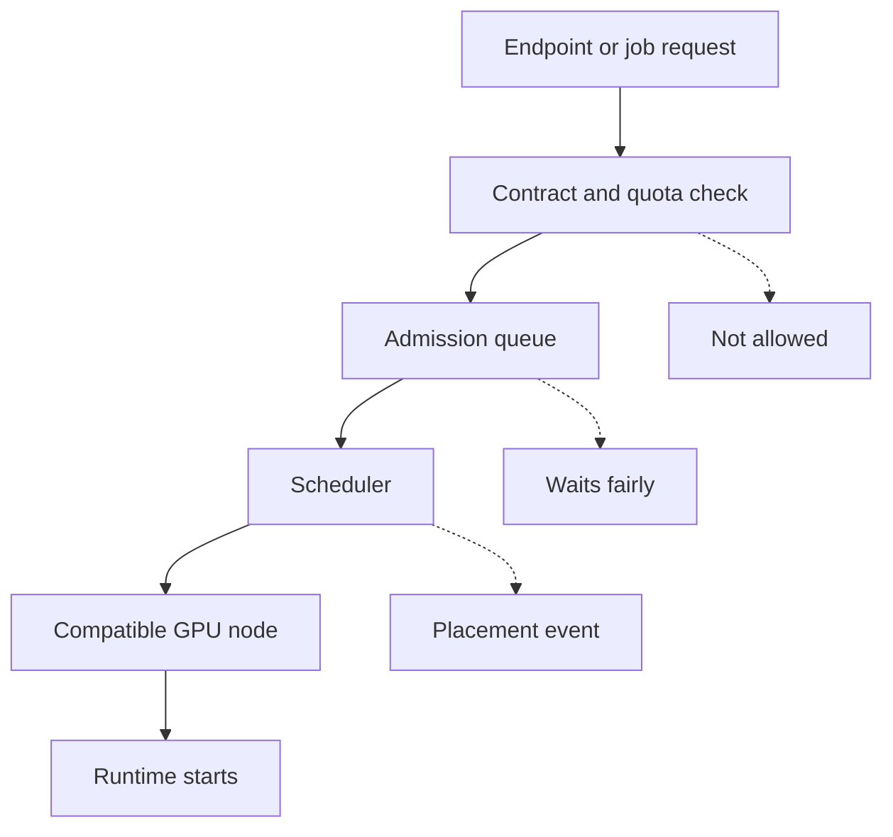

## Table of Contents

1. [Scheduling Is A Fairness System](#scheduling-is-a-fairness-system)
2. [The Scheduling Path](#the-scheduling-path)
3. [Reservations Are Customer Promises](#reservations-are-customer-promises)
4. [Total Free GPUs Can Mislead](#total-free-gpus-can-mislead)
5. [Queue Admission Prevents Half-Useful Work](#queue-admission-prevents-half-useful-work)
6. [Noisy Neighbors Are A Scheduling Problem](#noisy-neighbors-are-a-scheduling-problem)
7. [Priority Needs A Recovery Story](#priority-needs-a-recovery-story)
8. [Debugging Waiting Work](#debugging-waiting-work)
9. [Scheduling Tradeoffs](#scheduling-tradeoffs)
10. [Review Standard](#review-standard)

## Scheduling Is A Fairness System

GPU scheduling decides which
workload gets scarce accelerator
capacity. For Northstar Inference,
scheduling is also a fairness
system. It protects paid
production endpoints from trial
workloads, keeps batch jobs from
blocking chat endpoints, and gives
support engineers a clear answer
when a customer asks why an
endpoint is waiting.

Imagine three workloads in the
same European region. Atlas Retail
pays for a production chat
endpoint. Finch Finance runs a
reranker with strict p95 latency.
A media company submits an
overnight image-captioning batch
job. All three use GPUs, but they
should not have equal scheduling
rights at every moment.

A beginner often sees scheduling
as "find any free GPU." A provider
has to ask better questions. Is
the GPU in the right pool? Is it
reserved for a customer? Is the
model compatible with that
runtime? Will placing this job
break another endpoint's latency?
Can the waiting job make partial
progress, or does it need several
GPUs at once?

## The Scheduling Path

A provider should make the
scheduling path explainable. A
customer request or deployment
change enters the control plane.
The control plane checks contract,
quota, and placement rules. A
queue decides whether work may be
admitted. Kubernetes or another
scheduler then places pods on
compatible nodes. If the work
waits, each layer should leave a
reason.



This diagram matters during
incidents. If `atlas-chat-prod` is
waiting, support should not have
to ask three teams in three chat
rooms. The system should say
whether the customer exceeded
quota, the queue is waiting for
capacity, the scheduler cannot
find a compatible node, or the
runtime is still loading.

The reason does not have to be a
long essay. It must be precise
enough to choose the next action.

## Reservations Are Customer Promises

A reservation is capacity set
aside for a customer, workload
class, or product tier. It exists
because some customers are not
buying best-effort access. They
are buying confidence that
capacity will be there when
traffic arrives.

A simple reservation ledger might
look like this:

| Customer | Workload | Pool | Reserved GPUs | Borrowable? |
|----------|----------|------|---------------|-------------|
| Atlas Retail | chat production | chat-h100-eu | 24 | no |
| Finch Finance | rerank production | rerank-l40s-eu | 12 | no |
| Trial tier | small chat | shared-l40s-eu | 20 | yes |
| Batch customers | offline jobs | batch-a10-eu | 48 | yes |

The word borrowable is important.
Trial and batch work may use spare
capacity, but they must leave when
a protected endpoint needs it. If
the platform cannot reclaim
borrowed capacity, the reservation
is only a spreadsheet.

Scheduling policy should reflect
this ledger. Atlas Retail's
production replicas should not
wait behind an overnight batch
job. The batch job can run hard
when the pool is quiet, but it
must checkpoint and tolerate
eviction.

## Total Free GPUs Can Mislead

A status page that says "42 GPUs
free" can still be misleading.
Free GPUs might be scattered
across pools, reserved for other
customers, missing the right
runtime, or too small for the
model. The scheduler needs shaped
capacity, not just count.

A real placement summary should
include shape:

```text
workload=atlas-chat-prod required_pool=chat-h100-eu required_gpus=6
pool=chat-h100-eu free_gpus=4 reserved_free=2 borrowed_by=batch-captioning=2
pool=shared-l40s-eu free_gpus=38 compatible=false reason=model_memory
placement=waiting reason=reservation_reclaim_in_progress
```

This output teaches more than a
red Pending status. It says the
model needs H100 chat capacity.
Only four are immediately free.
Two more exist but are borrowed by
a batch job that should be
reclaimed. The correct action is
to reclaim borrowed capacity or
add H100 chat nodes, not to place
the model on the L40S shared pool.

The support answer becomes honest:
the endpoint is waiting while
borrowed capacity is reclaimed,
with an expected ready time. That
is much better than "the cluster
is busy."

## Queue Admission Prevents Half-Useful Work

Some work should not start unless
enough capacity is available. A
batch job with independent
partitions can make progress on
one GPU. A multi-replica endpoint
rollout might be useful with one
canary replica. A distributed
training job or large model shard
may need a full group. Queue
admission prevents half-useful
work from occupying GPUs without
producing value.

Kueue and similar queueing systems
give Kubernetes clusters a way to
manage resource pools and
admission. Northstar can use a
queue-like policy even if its
control plane is custom. The
important idea is the same: the
platform admits work when it can
make useful progress under the
current policy.

For production inference, queue
admission also protects existing
traffic. A new customer endpoint
should not consume all warm
headroom in a pool unless the
control plane knows how existing
customers will stay within their
latency objectives.

The queue should expose two
numbers: how much capacity the
workload needs, and why it has not
been admitted yet. Without those
numbers, waiting feels arbitrary.

## Noisy Neighbors Are A Scheduling Problem

A noisy neighbor is a workload
that harms another workload
sharing the same infrastructure.
In GPU inference, the neighbor may
not share the same GPU. It may
share image pull bandwidth,
artifact cache space, node-local
disk, network paths, or a
model-server queue. Scheduling
policy should account for those
shared resources.

For example, a batch customer
might submit thousands of small
embedding requests at midnight. If
those workers pull images and
artifacts across the same network
path used by production chat
replicas, chat startup and
scale-out can slow down. The batch
job did not steal a production
GPU, but it still harmed
production readiness.

This is why provider scheduling
needs more than GPU requests. It
needs workload class, customer
tier, runtime type, artifact size,
expected request pattern, and
whether the job can pause. A
low-priority batch job should not
share critical startup paths with
a high-priority chat endpoint
unless the platform has throttles
and evidence.

## Priority Needs A Recovery Story

Priority tells the platform which
work wins when capacity is tight.
It is a sharp tool because the
losing work may be evicted,
delayed, or moved. A priority
policy without a recovery story
creates hidden damage.

Northstar might use three broad
priority classes. Production
interactive endpoints win first.
Customer batch jobs run next,
especially when they have
deadlines. Trial endpoints and
internal experiments borrow
whatever remains. That policy is
easy to say, but it works only if
the lower-priority work can
recover.

A batch job should checkpoint by
partition. A trial endpoint should
be allowed to show a capacity
message or run on smaller
hardware. An internal experiment
should be disposable. If a
workload cannot recover,
preempting it may waste more GPU
time than it saves.

Priority should also be auditable.
If every team can mark its
workload as production critical,
priority stops protecting
customers.

## Debugging Waiting Work

When a workload waits, the first
job is to preserve the reason. A
useful debug path starts with the
provider control plane, then the
queue, then the scheduler, then
runtime startup. Jumping straight
to node commands misses contract
and quota decisions.

A good waiting record looks like
this:

```text
endpoint=finch-rerank-prod region=eu-west pool=rerank-l40s-eu
state=waiting
contract=production reservation=12 requested=4 available_reserved=0
borrowed_capacity=3 reclaiming=true
scheduler_candidates=9 compatible_nodes=9 free_gpu_now=1
next_action=wait_for_reclaim estimated_ready_seconds=140
```

This record is not only for
platform engineers. Customer
support can use it. Product
managers can use it. Finance can
use it when asking whether the
customer needs a larger
reservation. The system should
make the wait understandable
without leaking another customer's
private details.

If the record says compatible
nodes are zero, the fix is
placement or pool design. If
compatible nodes exist but
reserved capacity is zero, the fix
is capacity planning or
reservation policy. If capacity
exists but runtime startup is
slow, the fix may be artifact
cache or warm-up, not scheduling.

## Scheduling Tradeoffs

Strict reservations protect paying
customers, but they can leave GPUs
idle. Borrowing improves
utilization, but it requires fast
and safe reclaim. Queue admission
prevents half-useful work, but it
can make jobs wait longer. High
priority protects production, but
it can damage lower-priority work
if that work cannot checkpoint.

A provider chooses these tradeoffs
by product tier. A premium
dedicated endpoint may trade
utilization for predictability. A
shared trial endpoint may trade
predictability for lower cost. A
batch job may trade start time for
cheaper hardware. The scheduler
should encode those choices so
engineers do not re-litigate them
during every incident.

The review standard is simple:
every waiting workload needs an
honest reason, and every admitted
workload needs a reason it is safe
to run now.

## Review Standard

A scheduling article is good only
if it teaches what decision to
make. For Northstar, the decision
is never "schedule anywhere." The
decision is whether the workload
is allowed, whether capacity is
shaped correctly, whether it can
make useful progress, whether it
can be preempted, and whether
existing customers remain
protected.

Before approving a new workload
class, reviewers should ask who it
can block, which pool it can use,
which labels make it compatible,
which quota controls it, which
priority it receives, how it
recovers, and which
customer-facing message appears
when it waits.

Those questions prevent the common
failure where a provider has
plenty of hardware but no
trustworthy placement policy.
Hardware without scheduling policy
becomes a queue of surprises.

---
**References**

- [Kubernetes Schedule GPUs](https://kubernetes.io/docs/tasks/manage-gpus/scheduling-gpus) - Defines the base Kubernetes model for requesting and placing GPU workloads.
- [Kubernetes Pod Priority and Preemption](https://kubernetes.io/docs/concepts/scheduling-eviction/pod-priority-preemption/) - Explains the priority tools used when urgent work must displace lower-priority pods.
- [Kubernetes Resource Quotas](https://kubernetes.io/docs/concepts/policy/resource-quotas/) - Shows how namespace limits prevent one team from consuming shared cluster capacity.
- [OpenAI Scaling Kubernetes to 7,500 Nodes](https://openai.com/index/scaling-kubernetes-to-7500-nodes/) - Describes real scheduling pressure from quotas, borrowing, and gang-style workloads.
