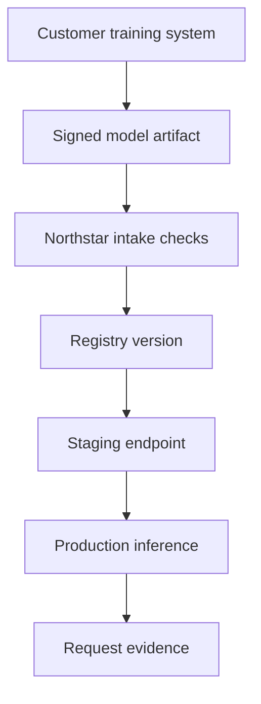

## Table of Contents

1. [The Provider Operates The Serving Side](#the-provider-operates-the-serving-side)
2. [The Handoff Is The Boundary](#the-handoff-is-the-boundary)
3. [Training Optimizes For Progress Over Time](#training-optimizes-for-progress-over-time)
4. [Inference Optimizes For A Request Path](#inference-optimizes-for-a-request-path)
5. [What Northstar Must Verify](#what-northstar-must-verify)
6. [Batch Inference Sits Between The Worlds](#batch-inference-sits-between-the-worlds)
7. [The Boundary During Incidents](#the-boundary-during-incidents)
8. [Design Tradeoffs](#design-tradeoffs)
9. [Review Standard](#review-standard)

## The Provider Operates The Serving Side

Training creates or adapts a
model. Inference uses a model to
answer requests. Northstar
Inference mostly operates the
inference side: customers bring a
model artifact or choose a
supported base model, and
Northstar turns that artifact into
an endpoint with latency, cost,
rollout, and observability
expectations.

That boundary matters. A training
team can tolerate long-running
jobs, checkpoint recovery, and
delayed completion. A customer
inference endpoint cannot treat
every request like a research run.
The endpoint needs warm capacity,
predictable routing, model
identity, and a rollback path. The
same model file can live in both
worlds, but the operating rules
are different.

The running example is Atlas
Retail. Atlas fine-tunes a chat
model in its own environment, then
sends Northstar a signed artifact
for hosted production inference.
Northstar does not need to know
every training experiment Atlas
tried. It does need enough
evidence to load the artifact
safely, size the endpoint, monitor
behavior, and prove which version
served each request.

## The Handoff Is The Boundary

The handoff from training to
inference should be an artifact
contract, not a folder named
`final`. The contract tells
Northstar what the artifact is,
which runtime it needs, how it was
evaluated, what limitations
matter, and what customer approval
allows.



The point of the diagram is
ownership. Before intake, Atlas
owns training and model quality
evidence. During intake, Northstar
verifies that the artifact can be
hosted safely. After production,
Northstar owns serving behavior:
latency, availability, routing,
warm capacity, and request-level
identity.

If that boundary is vague,
incidents become messy. A slow
response might be blamed on the
model, the runtime, the router, or
a training decision. A clear
handoff does not eliminate debate,
but it gives each team evidence.

## Training Optimizes For Progress Over Time

Training infrastructure cares
about useful progress over a long
run. It wants data pipelines, many
accelerators working together,
checkpoint writes, restart
behavior, and repeatable runs. A
training job may wait in a queue
for hours if that gives it the
right hardware shape. Once it
starts, a node failure may force a
restart from checkpoint.

That is why training signals look
like throughput, checkpoint age,
data input rate, failed workers,
and evaluation result. If a
training run slows down, the team
asks whether GPUs are waiting on
data, whether communication is
slow, whether a node is unhealthy,
or whether checkpointing is too
expensive.

An inference provider still cares
about those concepts when it
receives a model, but it does not
operate the customer's training
loop. Northstar cares that the
final artifact is reproducible
enough to trust and sized well
enough to serve.

## Inference Optimizes For A Request Path

Inference infrastructure cares
about the path of one request and
the aggregate behavior of many
requests. A customer request
enters the gateway, reaches a
router, lands on a model server,
waits in a queue, runs prefill and
decode, then streams or returns a
response. The endpoint may serve
thousands of customers while a
training job is still writing its
next checkpoint.

Inference signals look different:
time to first token, total
latency, queue time, request rate,
token rate, cache hit rate, error
class, GPU memory pressure, and
model version. These signals must
be tied to the customer endpoint,
not only to the node.

A production inference endpoint is
also rollback-sensitive. If Atlas
Retail's v13 model answers badly,
Northstar must restore v12 or
route traffic away quickly. That
rollback may involve a registry
alias, prompt template, tokenizer,
runtime flag, and artifact cache.
Training rollback usually means
restarting or choosing a previous
checkpoint. Inference rollback
means protecting live requests.

## What Northstar Must Verify

Northstar does not need to repeat
the customer's full training
process, but it must verify
hosting requirements. The artifact
must be readable. The checksum
must match. The tokenizer and
runtime must be compatible. The
model must fit the selected GPU
profile. A smoke test must prove
the server can produce output. A
latency benchmark must be good
enough to choose a tier.

A practical intake record is
short:

```yaml
customer: atlas-retail
model: atlas-chat
candidate_version: v13
artifact_uri: s3://northstar-intake/atlas/chat/v13/
artifact_sha256: 8d91a3
runtime_profile: vllm-chat-h100
max_context_tokens: 32000
smoke_test: passed
p95_first_token_benchmark_ms: 620
recommended_pool: chat-h100-eu
approved_for: staging
```

This record is not a training
report. It is an inference
readiness record. It answers the
questions a platform engineer
needs before putting customer
traffic near the artifact.

If the benchmark is too slow,
Northstar can discuss smaller
context, more replicas, different
hardware, prompt caching, or a
different tier. The key is to
discover that before production
traffic moves.

## Batch Inference Sits Between The Worlds

Batch inference uses a trained
model, but it behaves more like a
job than a live endpoint. A
customer may upload millions of
rows for overnight classification,
summarization, or embedding. No
person waits for one response, but
the output still matters.

Northstar can run batch inference
on cheaper or more opportunistic
capacity if the job has clear
deadlines and retry behavior. It
should not let batch work silently
consume warm capacity reserved for
chat endpoints. Batch belongs in
the inference platform because it
uses serving runtimes and model
versions, but its scheduling
policy should be closer to queued
jobs than live endpoints.

This is one reason the
training-versus-inference boundary
should not become a slogan. The
real distinction is operating
shape. Live inference optimizes
for request latency. Batch
inference optimizes for correct
completion by a deadline. Training
optimizes for learning progress
and checkpoint recovery.

## The Boundary During Incidents

When an incident happens, the
boundary tells responders where to
look first. If Atlas Retail
reports slow responses, Northstar
starts with serving traces, queue
time, route decisions, GPU
pressure, and model load state. If
Atlas reports that v13 is less
accurate than v12, Northstar can
show which version served the bad
requests, then Atlas may need to
inspect training data or
evaluation coverage.

A good incident note separates
these layers:

| Symptom | First Northstar check | Possible customer check |
|---------|-----------------------|-------------------------|
| Slow first token | route, queue, prefill, GPU pressure | prompt length change |
| Wrong answer | served model, prompt, retrieval tool | training/eval gap |
| Runtime OOM | model size, context, GPU memory | model packaging choice |
| Batch duplicate output | partition idempotency | input manifest correctness |

The table prevents blame-driven
debugging. Each side knows which
evidence it owns. That is
especially important for a
provider because the customer may
not see the platform internals,
and the provider may not see the
customer's training history.

## Design Tradeoffs

A provider can offer to host
customer fine-tuning, but then it
owns more of the training side:
data handling, training job
scheduling, checkpoint storage,
and evaluation workflow. That can
be valuable, but it is a different
product. A provider focused on
inference can keep the boundary
narrower and invest deeper in
serving latency, routing, artifact
custody, and rollback.

Managed APIs change the boundary
again. A customer using Anthropic
or OpenAI batch features
may not operate GPUs directly, but
they still need input manifests,
model choice, output handling, and
cost controls. A customer using
Northstar dedicated endpoints buys
more control over placement and
latency, but also more decisions
about artifacts and capacity.

The right design depends on what
the provider promises. Northstar's
promise is hosted inference, so
its architecture should make the
handoff from trained artifact to
served endpoint boring,
reviewable, and reversible.

## Review Standard

A good training-versus-inference
article should leave the reader
able to draw the boundary. Before
a model enters Northstar
production, the reviewer should
know who trained it, which
artifact was submitted, which
runtime profile it needs, which
pool can serve it, which latency
benchmark it achieved, how traffic
will move, and how rollback works.

If those answers are missing, the
problem is not solved by adding
more GPU nodes. The handoff is
incomplete. Inference
infrastructure begins when a model
must answer real requests under a
promise. The artifact, runtime,
capacity, and evidence have to
line up before that promise is
safe.

---
**References**

- [OpenAI Infrastructure for Deep Learning](https://openai.com/index/infrastructure-for-deep-learning) - Shows why large training systems need batch-oriented scaling, storage, and job recovery.
- [OpenAI Scaling Kubernetes to 7,500 Nodes](https://openai.com/index/scaling-kubernetes-to-7500-nodes/) - Contrasts large research workloads with service traffic and explains cluster-level tradeoffs.
- [Ray Data Batch Inference](https://docs.ray.io/en/latest/data/batch_inference.html) - Documents a batch inference model where throughput and retry boundaries matter more than instant response.
- [Ray Serve Autoscaling](https://docs.ray.io/en/latest/serve/autoscaling-guide.html) - Explains request-serving scaling signals such as queue size and replica count.
- [Anthropic Engineering Challenges of Scaling Interpretability](https://www.anthropic.com/research/engineering-challenges-interpretability) - Gives an official example of engineering constraints around large AI research workloads.
