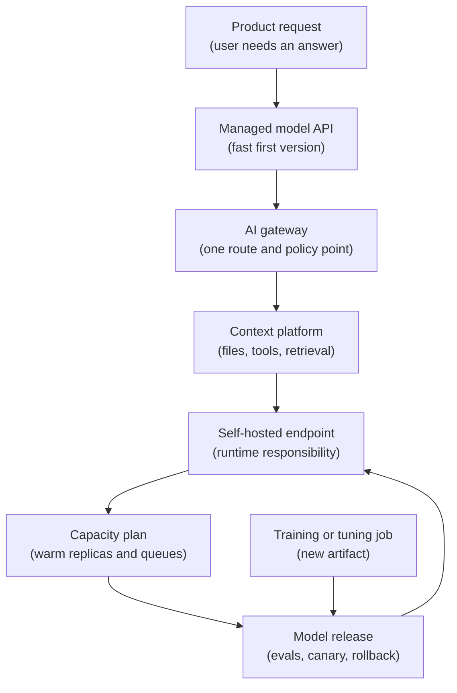

## Table of Contents

1. [The Roadmap Is A Build Order](#the-roadmap-is-a-build-order)
2. [Stage 1: Call A Managed Model API](#stage-1-call-a-managed-model-api)
3. [Stage 2: Add A Gateway When Rules Drift](#stage-2-add-a-gateway-when-rules-drift)
4. [Stage 3: Add Context When The Model Needs Outside Facts](#stage-3-add-context-when-the-model-needs-outside-facts)
5. [Stage 4: Self-Host When You Need Runtime Control](#stage-4-self-host-when-you-need-runtime-control)
6. [Stage 5: Protect Live Capacity](#stage-5-protect-live-capacity)
7. [Stage 6: Release Models With Evals](#stage-6-release-models-with-evals)
8. [Stage 7: Feed Serving From Training And Customisation](#stage-7-feed-serving-from-training-and-customisation)
9. [How The Later Submodules Fit](#how-the-later-submodules-fit)
10. [Practice The Build Order](#practice-the-build-order)

## The Roadmap Is A Build Order

Start with one product action: a customer asks an artificial intelligence (AI) assistant a question, and the product needs an answer. That is enough to begin. You do not need to start with graphics processing unit (GPU) clusters, Kubernetes schedulers, model registries, tool sandboxes, or training jobs.

This roadmap is a build order. It shows what a team adds after the previous version stops being enough. The order matters because it keeps the learning path simple. First you learn how one request works. Then you learn why the team needs one shared route. Then you learn why the model needs extra context. Later you learn what changes when the team runs a model itself.

Here is the roadmap as a simple flow:



Read this as a learning path, not a rule for every company. Some teams stay on managed APIs for years. Some teams start by self-hosting an open model. Some teams buy dedicated inference from a provider. The roadmap still helps because the jobs are the same: call the model, route the request, prepare context, serve the model, protect capacity, release safely, and connect training output to serving.

The important question is:

> What did the team add because the previous version was no longer enough?

That question keeps the roadmap practical. You add a gateway when route rules drift. You add a context platform when the model needs approved facts or tools. You self-host when runtime control matters. You add evals when a healthy model can still answer badly.

## Stage 1: Call A Managed Model API

A managed model API is the easiest first version. API means application programming interface, a service your code calls over the network. Managed means the provider runs the model fleet. The product team sends a request, receives output, and focuses on the product workflow around it.

Imagine **AI Support Chat** inside a shopping product. The backend receives a customer question, adds the order status and support policy, calls a managed model API, and streams the answer back.

```text
customer asks a question
  -> support-chat-api builds the model request
  -> managed provider returns text
  -> product streams the answer to the customer
```

This first version is useful because it teaches the customer-facing behaviour without making the team operate a model server. The team can learn whether customers use the feature, whether answers are helpful, and what the cost looks like.

Even this small version needs a request record:

```json
{
  "request_id": "req_support_1001",
  "feature": "ai-support-chat",
  "tenant": "demo-retail",
  "model_alias": "support-assistant",
  "provider_route": "managed-primary",
  "status": 200,
  "first_token_ms": 720,
  "total_ms": 3100,
  "input_tokens": 3800,
  "output_tokens": 220,
  "prompt_logging": "disabled"
}
```

This record is a receipt for the model call. It tells the team who called, which feature called, which logical model name the product used, which route answered, how long the customer waited, how many tokens were used, and whether prompt logging was disabled.

OpenAI's production guidance is useful here because it frames the move from prototype to production: secure access, traffic handling, billing limits, API key safety, and safety review. Anthropic's API overview is useful as a second provider anchor because it shows that a managed API can include messages, batches, token counting, files, skills, agents, and sessions.

First-line debugging should work from IDs, versions, timings, token counts, route decisions, and redacted traces, not raw prompt dumps. That habit matters from the first managed API call because privacy and evidence become harder to fix later.

The first tradeoff is speed versus control:

| Choice | What You Gain | What You Give Up |
|--------|---------------|------------------|
| Managed API | Fast product learning and no model fleet to operate. | Less control over runtime, placement, and provider behaviour. |
| Self-host immediately | Runtime and placement control from day one. | More operational work before the feature proves value. |

For a first product feature, speed is often the right choice. The team should still keep good records because those records become the evidence for every later stage.

Some inference is not live. Eval runs, embedding refreshes, document classification, and nightly labelling jobs use a model but do not update weights. They are batch inference, not training. Treat them as inference work with batch-style evidence: batch status, queue age, completion count, result file, and error file. OpenAI's Batch API is a useful anchor here because it supports asynchronous model requests with a 24-hour completion window.

You are ready for Stage 2 when two or more apps have copied provider-call rules and nobody can explain the route, retry, budget, or logging policy from one place.

## Stage 2: Add A Gateway When Rules Drift

The next problem is usually not the model. It is copy-paste policy.

One product calls a provider. Then another product calls a provider. Then a batch job calls a provider. Each team writes a small wrapper around the provider SDK. SDK means software development kit, the provider library the app imports.

At first the wrappers look similar:

```text
support-chat-api
  timeout: 30s
  retry_count: 2
  prompt_logging: disabled
  logs: request_id, model_alias, provider_request_id, tokens

catalog-enrichment-api
  timeout: 12s
  retry_count: 5
  prompt_logging: enabled
  logs: http_status

feedback-summary-job
  timeout: 60s
  retry_count: 0
  prompt_logging: disabled
  logs: request_id, estimated_cost
```

Each local choice has a reason. Chat cares about user wait time. Catalog enrichment cares about throughput. Feedback summaries care about cost. The problem is that shared rules are now hidden in different services.

A gateway is one entry point for model calls. The app sends a model request to the gateway. The gateway checks identity, policy, budget, data handling, and route choice. Then it forwards the request to a managed provider, a self-hosted runtime, or a dedicated endpoint.

```text
product service
  -> AI gateway checks tenant, budget, route, logging policy
  -> gateway forwards to the selected model backend
```

The gateway creates a route record:

```yaml
route_id: support-assistant-v1
tenant: demo-retail
accepted_model_alias: support-assistant
primary_target: managed-primary
fallback_target: managed-secondary
timeout_seconds: 30
max_input_tokens: 8000
max_output_tokens: 500
prompt_logging: disabled
monthly_budget_usd: 12000
trace_required: true
```

OpenRouter is a useful comparison anchor because its routing docs show provider order, fallbacks, parameter requirements, data-collection controls, and provider selection behind one API surface. Your internal gateway may be much smaller, but the plain idea is the same: the route decision becomes one inspectable record.

The gateway helps when the team asks:

| Question | Gateway Evidence |
|----------|------------------|
| Which model route answered? | `accepted_model_alias` and `primary_target`. |
| Was fallback allowed? | `fallback_target` and route outcome. |
| Did the request obey tenant budget? | Token counters and monthly budget. |
| Was prompt logging allowed? | Data policy on the route. |
| Can support trace the request? | `request_id` and trace ID. |

The tradeoff is shared control versus shared dependency. The gateway removes duplicated rules, but the gateway itself becomes a production service. If its route config is wrong, many features can be wrong at once.

You are ready for Stage 3 when the answer depends on documents, tools, files, or session state that must be controlled and audited.

## Stage 3: Add Context When The Model Needs Outside Facts

The model often needs information that is not inside the user message. It may need a policy document, an uploaded file, an order record, a search result, or a tool result. That work belongs to the context platform.

Context means the extra information placed around the user question. Retrieval means fetching relevant documents before the model answers. A tool is an action the model can ask the system to run, such as looking up an order, searching a knowledge base, or creating a support handoff.

For AI Support Chat, the context platform may do this:

```text
support chat request
  -> gateway accepts the request
  -> context platform fetches approved shipping policy
  -> context platform calls order-status tool
  -> model receives the question plus approved context
  -> answer streams to the customer
```

OpenAI's tools documentation is useful because it shows built-in tools, function calling, file search, web search, and remote Model Context Protocol (MCP) servers as part of the request surface. MCP is a standard way for AI apps to connect to outside tools and data sources. This is platform work because it affects permissions, network boundaries, tool approval, audit records, and blast radius.

A context record might look like this:

```yaml
trace_id: trace_support_2104
feature: ai-support-chat
tenant: demo-retail
retrieval_index: support-policy-v8
documents_used:
  - policy/shipping-delays.md@2026-05-01
  - policy/order-changes.md@2026-04-22
tool_calls:
  - tool: order_status.lookup
    permission: read_order_status
    approval: automatic_read_only
    result_status: ok
```

The context platform helps the team answer questions that a plain provider call cannot answer:

| Symptom | First Check |
|---------|-------------|
| The model used stale policy. | Retrieval index and document version. |
| The model called the wrong tool. | Tool schema and permission record. |
| The model used too much context. | Retrieved document size and token count. |
| A tool should have required approval. | Approval policy and audit record. |
| A prompt injection changed behaviour. | Tool boundary and retrieved text handling. |

The tradeoff is usefulness versus blast radius. Context and tools make the feature more useful, but they also give the model access to more information and actions. The platform must keep permissions and evidence close to every request.

You are ready for Stage 4 when managed routes no longer satisfy custom model, data boundary, latency, runtime setting, or unit-cost needs.

## Stage 4: Self-Host When You Need Runtime Control

Self-hosting starts when the team runs the model server itself. A model server loads model files and produces output tokens. A token is a chunk of text as the model sees it.

The team may self-host because it needs a custom open model, stronger placement control, a specific data boundary, a lower cost at high traffic, or runtime settings the managed route does not expose. Do not self-host just because it sounds more serious. Self-host when the product need is clear.

The serving endpoint record should be small enough for a reviewer to understand:

```yaml
endpoint: support-open-v14
model_artifact: registry://support/support-assistant-open:v14
tokenizer: registry://support/chat-tokenizer:v14
runtime: vllm
api_shape: openai-compatible
traffic_state: shadow
min_replicas: 2
gpu_profile: 2xh100-80gb
rollback_target: support-open-v13
```

Define the key words before they pile up:

| Term | Plain Meaning |
|------|---------------|
| Artifact | The saved model files and metadata. |
| Tokenizer | The component that turns text into tokens and tokens back into text. |
| Runtime | The server program that loads the model and handles requests. |
| Replica | One running copy of the model server. |
| Shadow traffic | Real requests copied to a candidate endpoint, without showing those answers to users. |

vLLM is a useful anchor because its OpenAI-compatible server can expose a familiar API shape while the team owns the runtime. KServe is useful because it shows Kubernetes treating inference as a platform concern, including model serving, routing, GPU use, and serving revisions.

The first serving check should connect runtime health to product behaviour:

```text
endpoint: support-open-v14
state: healthy
shadow_requests: 25000
load_errors: 0
p95_first_token_latency_ms: 940
p95_total_ms: 4100
gpu_memory_pressure: normal
artifact: support-assistant-open:v14
```

This status is more useful than "pod is running." It says the endpoint loaded the artifact, answered real-shaped requests, and stayed inside early latency and memory targets.

The tradeoff is control versus ownership:

| Self-Hosting Gives | Self-Hosting Adds |
|--------------------|-------------------|
| Custom artifacts. | Packaging and artifact checks. |
| Runtime settings. | GPU memory and queue debugging. |
| Placement control. | Capacity planning. |
| Possible cost control at scale. | On-call responsibility for serving failures. |

Self-hosting is not the end of the roadmap. It creates the next question: can the platform keep the endpoint ready when real users arrive?

You are ready for Stage 5 when users depend on the endpoint and cold starts, queue time, or regional capacity can break the product experience.

## Stage 5: Protect Live Capacity

Capacity is not just the number of GPUs. Capacity means the right model can run in the right region, on the right accelerator type, with enough memory, at the moment the request arrives.

For a live AI assistant, the customer is waiting. A server that starts five minutes later is not useful for a chat request. That is why live inference usually needs warm replicas. A warm replica is a model server that has already loaded the model and can start work quickly.

Here is a plain capacity target:

```yaml
customer: demo-retail
endpoint: support-chat-prod
region: eu-west
business_hours: "08:00-18:00 Europe/London"
warm_replicas: 4
target: p95 first-token latency under 900 ms
batch_borrowing: disabled_during_business_hours
```

CoreWeave is a useful comparison anchor for dedicated inference because its Inference API docs describe gateways, model deployments, and capacity claims. The docs also mark that API as `v1alpha1`, so treat it as a learning anchor rather than a stable contract to copy. The important point is that a customer-facing inference endpoint needs capacity evidence, not just a running container.

Capacity incidents should be written in customer language:

```text
incident: inc-inference-4412
customer: demo-retail
endpoint: support-chat-prod
impact: p95 first-token latency above target for 18 minutes
cause: batch workload borrowed one warm replica from the reserved pool
fix: disabled batch borrowing for support-chat-prod during business hours
proof: p95 first-token latency returned below target at 09:42
```

The capacity tradeoff is cost versus protection:

| Policy | Helps | Costs |
|--------|-------|-------|
| Keep more warm replicas. | Lower user wait time. | Higher idle cost. |
| Let batch borrow spare replicas. | Better hardware use. | Live requests may wait if borrowing is too loose. |
| Reserve capacity per customer. | Stronger isolation. | Less sharing across tenants. |
| Scale only after queue grows. | Lower idle spend. | Cold starts may hit users first. |

Cheap capacity that cannot answer when users arrive is not cheap from the product point of view.

You are ready for Stage 6 when the platform can keep an endpoint available, but the next risk is whether a new model version behaves well enough for users.

## Stage 6: Release Models With Evals

A model release is different from a normal server deploy. A normal server can pass health checks and still have a bug, but the bug often shows as an error, timeout, or bad response field. A model can return `200`, answer quickly, and still write a worse answer.

That is why release needs evals. An eval is a structured test for model behaviour. It gives the model examples and scores the output against criteria. OpenAI's evaluation best-practices docs are useful because they explain that generative AI is variable, so traditional software tests are not enough by themselves.

A release record can stay small:

```yaml
candidate_route: support-open-v15
previous_route: support-open-v14
candidate_artifact: registry://support/support-assistant-open:v15
previous_artifact: registry://support/support-assistant-open:v14
eval_set: support-chat-v6
eval_pass_rate: 0.94
human_review_sample: pass
shadow_latency_p95_ms: 860
cost_change: "+6%"
decision: canary_5_percent
rollback: support-open-v14
```

A canary is a small rollout. Instead of sending all traffic to the candidate, the gateway sends a small slice, such as 5 percent. That gives the team real evidence while limiting customer impact.

The release function watches several signals:

| Signal | Why It Matters |
|--------|----------------|
| Error rate | The endpoint may fail requests. |
| First-token latency | Users may wait too long. |
| Output token count | Cost and total latency may rise. |
| Eval pass rate | Answer quality may regress. |
| Tool-call success | Agent workflows may break. |
| User feedback sample | Real users may spot gaps the eval missed. |

The tradeoff is speed versus evidence. Faster release means less waiting for the team. Better evidence means fewer surprises for users.

You are ready for Stage 7 when model release needs a repeatable supply of candidate artifacts from fine-tuning, adapters, distillation, or other customisation jobs.

## Stage 7: Feed Serving From Training And Customisation

Training and customisation produce artifacts for serving. Most product teams will not train a foundation model from zero. They may fine-tune, train an adapter, run distillation, rebuild embeddings, or prepare a smaller model for cheaper serving.

The key handoff is:

```text
training output becomes serving input
```

If the training platform produces files that the serving platform cannot load, the training job is not really done from the product point of view. A useful artifact record includes the model files, tokenizer, runtime target, checksum, context length, and eval status.

```yaml
artifact: registry://support/support-assistant-open:v15-candidate
created_by_job: ft-support-2026-05-09
base_model: open-support-70b
tokenizer: chat-tokenizer:v15
runtime_target: vllm
context_window: 32768
checksum: sha256:4fd2...
latest_checkpoint: step-24000
eval_status: pending
```

The training platform also needs recovery evidence. A checkpoint is a saved restart point. If one worker fails, the job can restart from the latest complete checkpoint instead of starting from the beginning.

```text
job: ft-support-2026-05-09
state: worker_failed
failed_worker: rank-17
latest_complete_checkpoint: step-24000
incomplete_checkpoint: step-24500
replay_estimate: 22 minutes
next_action: restart_from_step_24000
```

The training tradeoff is throughput versus waiting. Training platforms try to keep expensive accelerators busy, but jobs may wait for quota, priority, or the right accelerator shape. Live inference cannot usually wait the same way because a user is watching the response.

You are ready for deeper training articles when a failed worker, old checkpoint, missing tokenizer, or slow data path can block model delivery.

## How The Later Submodules Fit

The rest of the AI infrastructure root module should follow this roadmap, not a flat list of tools.

Managed API platform articles should deepen the first stage: provider credentials, rate limits, prompt caching, data controls, batches, token counting, and cost attribution. These articles teach what the product team owns when the provider runs the model.

Gateway and routing articles should deepen the second stage: model aliases, fallback, budgets, provider ordering, route records, data policy, and tenant limits. These articles teach how one route decision becomes inspectable.

Agent and context articles should deepen the third stage: retrieval, file search, vector stores, tool calling, Model Context Protocol servers, session state, permission boundaries, and tool audit records. These articles teach how outside data and actions enter the model request.

Inference runtime articles should deepen the fourth stage: vLLM, KServe, model artifacts, tokenizers, replicas, queue time, first-token latency, prompt processing, token generation, and runtime metrics. NVIDIA Dynamo's disaggregated serving docs belong later because they describe splitting prompt processing and token generation into separate worker pools.

Capacity articles should deepen the fifth stage: warm replicas, reserved capacity, GPU memory, queue-aware autoscaling, batch borrowing, regional placement, and failure domains. Learn the plain capacity problem before learning the scheduler names.

Delivery and eval articles should deepen the sixth stage: eval sets, canaries, shadow traffic, rollback, model aliases, user feedback, and deprecation. These articles teach why model health is not the same as answer quality.

Training articles should deepen the seventh stage: queues, workers, checkpoints, distributed communication, storage throughput, artifact manifests, and model registry handoff. These articles teach why long training jobs and live inference endpoints have different operating goals.

## Practice The Build Order

You can practice the roadmap without running a large AI platform. Pick one stage, write the smallest evidence record, and answer one question: why is the next stage needed?

| Stage | Practice Check |
|-------|----------------|
| Managed API | Write one request record with request ID, route, latency, token count, and logging policy. |
| Gateway | Write one route record with alias, primary target, fallback, budget, and data policy. |
| Context | Write one trace record with document versions, tool permission, and context token count. |
| Self-hosted endpoint | Write one endpoint status with artifact, tokenizer, runtime, traffic state, and rollback target. |
| Capacity | Write one sentence that says which users need warm capacity and when batch work may borrow it. |
| Model release | Write one canary decision with eval, latency, cost, and rollback evidence. |
| Training handoff | Write one artifact handoff with checkpoint, checksum, tokenizer, runtime target, and eval status. |

For example, a self-hosted endpoint practice record can stay small:

```yaml
endpoint: support-open-v14
artifact: registry://support/support-assistant-open:v14
runtime: vllm
traffic_state: shadow
min_replicas: 2
rollback_target: support-open-v13
```

The important part is not the YAML shape. The important part is the decision it supports. If this endpoint misses p95 first-token latency under 900 ms, the team knows which artifact was loaded, which route was tested, and where rollback should go.

Use the roadmap as a sequence of readiness questions. Do not add a gateway, context layer, self-hosted runtime, capacity pool, eval process, or training platform because it sounds mature. Add the next stage when the current stage can no longer answer a real product or operations question.

---

**References**

- [OpenAI Production Best Practices](https://developers.openai.com/api/docs/guides/production-best-practices), [OpenAI Batch API](https://developers.openai.com/api/docs/guides/batch), and [Anthropic API Overview](https://platform.claude.com/docs/en/api/overview) - Use them for managed API production concerns, batch inference, messages, token counting, files, skills, agents, and sessions.
- [OpenRouter Provider Routing](https://openrouter.ai/docs/guides/routing/provider-selection) - Use it as a comparison point for provider routing, fallbacks, ordering, and data-collection controls.
- [OpenAI Tools Guide](https://developers.openai.com/api/docs/guides/tools) and [Model Context Protocol Introduction](https://modelcontextprotocol.io/introduction) - Use them for the context and tool stage, where retrieval, tools, and MCP servers become platform concerns.
- [CoreWeave Inference API Reference](https://docs.coreweave.com/products/inference/reference/api-overview) - Use it as a comparison point for inference gateways, deployments, capacity claims, and customer-facing endpoint evidence.
- [KServe LLMInferenceService Overview](https://kserve.github.io/website/docs/model-serving/generative-inference/llmisvc/llmisvc-overview) and [NVIDIA Dynamo Introduction](https://docs.nvidia.com/dynamo/getting-started/introduction) - Use them as current anchors for LLM-specific Kubernetes serving, routing, disaggregated serving, KV-cache-aware routing, and runtime control-plane trends.
- [OpenAI Evaluation Best Practices](https://developers.openai.com/api/docs/guides/evaluation-best-practices) - Use it for model release thinking, where output quality needs eval evidence before rollout.
