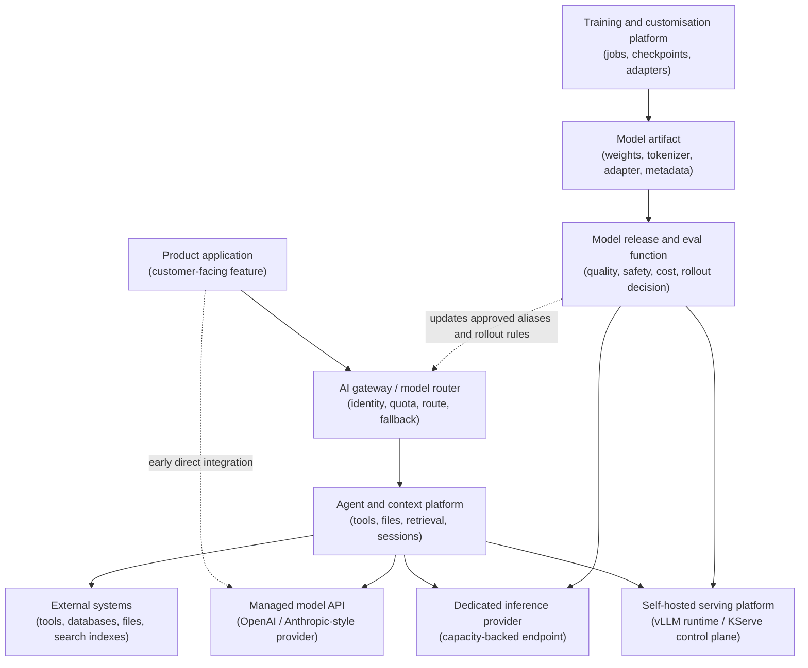

## Table of Contents

1. [What Operating Modes Mean](#what-operating-modes-mean)
2. [The Two Paths: Request Path And Model Path](#the-two-paths-request-path-and-model-path)
3. [Mode 1: Product Team Using Managed APIs](#mode-1-product-team-using-managed-apis)
4. [Mode 2: AI Gateway Or Model Router](#mode-2-ai-gateway-or-model-router)
5. [Mode 3: Agent And Context Platform](#mode-3-agent-and-context-platform)
6. [Mode 4: Self-Hosted Serving Platform](#mode-4-self-hosted-serving-platform)
7. [Mode 5: Dedicated Inference Provider](#mode-5-dedicated-inference-provider)
8. [Mode 6: Training And Customisation Platform](#mode-6-training-and-customisation-platform)
9. [Mode 7: Model Release And Eval Function](#mode-7-model-release-and-eval-function)
10. [Evidence Cuts Across Every Mode](#evidence-cuts-across-every-mode)
11. [How To Use This Map](#how-to-use-this-map)

## What Operating Modes Mean

A model request can belong to different infrastructure jobs. Sometimes a product team is calling a managed API (application programming interface), which means a hosted model service the app calls over the network. Sometimes a gateway is choosing between providers. Sometimes a context platform is collecting files, tool results, or retrieved documents. Sometimes a serving platform is running model weights on graphics processing units (GPUs). Sometimes a provider is offering a warm endpoint with reserved capacity. Sometimes a training platform is producing the next artifact. Sometimes a release function is deciding whether that artifact is ready for users.

Those jobs are the operating modes in this article. A mode is an ownership boundary. It tells you which team owns the first diagnosis, which evidence matters first, and what kind of failure you are probably looking at.

Treat a mode as an ownership boundary, not as a maturity level. A small team can use several modes on day one. A large AI company can contain all of them. A product app may call a managed API, send the request through an internal gateway, use a retrieval system, and later test a self-hosted open model. Those are different modes inside one product path.

Here is the plain map:

| Operating Mode | Comparison Anchor | What This Mode Owns | First Evidence To Inspect |
|----------------|-------------------|---------------------|---------------------------|
| Product team using managed APIs | Product app calling OpenAI or Anthropic | Product integration, provider credentials, retries, timeouts, cost, data controls. | App request log, provider request ID, token usage. |
| AI gateway or model router | OpenRouter-style routing | Routing, aliases, fallback, quota, budgets, tenant policy. | Route decision record. |
| Agent and context platform | Tools and retrieval-style platforms | Retrieval, files, vector stores, tool permissions, sessions, audit. | Tool, retrieval, and permission trace. |
| Self-hosted serving platform | vLLM-style runtime with KServe or Ray Serve-style serving control plane | Runtime, artifacts, tokenizers, replicas, GPU memory, rollout state. | Endpoint status and runtime metrics. |
| Dedicated inference provider | CoreWeave-style dedicated inference | Customer endpoint, warm capacity, gateway, deployment, capacity claim. | Endpoint target and capacity status. |
| Training and customisation platform | Kueue, Slurm, or Kubeflow-style batch platform | Jobs, queues, workers, checkpoints, adapters, artifact handoff. | Job status and checkpoint age. |
| Model release and eval function | Model lab release process | Behavioural evals, approval, canary, rollback, deprecation. | Eval result and release record. |

The same words appear in every mode. Everyone says model, endpoint, latency, cost, rollout, and eval. The work behind those words changes. A product team and an inference provider can both talk about latency, but the product team may inspect app logs and provider responses while the inference provider inspects warm replicas, queues, and GPU placement.

Use this article as the first map for the AI infrastructure module. When a later article says gateway, serving platform, inference provider, training platform, context platform, or release function, you should know which job we mean.

## The Two Paths: Request Path And Model Path

There are two paths to keep in your head.

The request path starts with a user-facing product and ends at a model endpoint. The product may call a managed provider directly. It may go through an AI gateway. It may fetch context from a retrieval system or call tools. Then the request reaches a managed API, a self-hosted serving platform, or a dedicated inference endpoint.

The model path starts with training or customisation work. A job produces an artifact, such as model weights, a tokenizer, an adapter, or metadata. A release process checks that artifact with evals and rollout rules. Only then should the serving layer load it for real traffic.

Here is the map:



The gateway can route to a managed provider, a self-hosted runtime, or a dedicated inference endpoint. In the simple first version, the product may call the managed provider directly. As the platform grows, the gateway usually makes the route decision before the context platform retrieves documents, manages tool permissions, or keeps session state.

The two paths meet at deployment time. The gateway can only route to a model version after a serving platform or dedicated endpoint has loaded it, and after a release process has approved it for traffic. The release process may also update approved aliases and rollout rules in the gateway.

Company names are comparison anchors in this article. OpenRouter is a useful public anchor for the gateway or router shape. CoreWeave is a useful public anchor for dedicated inference as a customer-facing GPU-backed service. OpenAI and Anthropic are useful anchors for managed APIs and model-release thinking. Those comparisons help you learn the shape of the work. They are not claims about private architecture, ownership, partnership, or endorsement.

## Mode 1: Product Team Using Managed APIs

This is the mode many teams start with. A software-as-a-service (SaaS) product team builds **AI Support Chat**. A customer asks, "Where is my order?" The backend sends the question, order status, and support policy to a managed model API, then streams the answer back into the chat product.

The product team is not operating the model fleet. It is still operating an AI product surface. That surface includes provider credentials, request shape, retries, rate limits, token costs, data handling, user-visible errors, and provider-specific features such as tools, files, batches, or token counting.

The first working version may look like this:

```text
customer opens AI Support Chat
  -> chat-api builds the request
  -> managed provider streams tokens back
  -> customer sees the answer
```

A beginner might ask, "If the provider runs the model, what does the engineering team still operate?" The engineering team helps the product team make the provider call safe enough for production. That means the team can rotate keys, explain cost, set timeouts, respect data-handling rules, and show a useful fallback if the AI feature fails.

The first request record can be small:

```json
{
  "request_id": "req_demo_0914",
  "feature": "support-chat",
  "tenant": "demo-retail",
  "model_alias": "support-assistant",
  "provider": "managed-primary",
  "provider_request_id": "prov_7782",
  "http_status": 200,
  "first_token_ms": 690,
  "input_tokens": 3200,
  "output_tokens": 210,
  "prompt_logging": "disabled"
}
```

This proves the feature, tenant, route, provider request, status, visible wait time, token count, and logging choice. That is enough to answer many first production questions.

The product team checks product-shaped evidence first:

| Symptom | First Check |
|---------|-------------|
| Users see slow support chat answers. | Provider status, timeout, first-token latency, prompt size. |
| Token cost jumps. | Feature usage, input size, output length, model choice. |
| A request should stay out of logs. | Prompt logging flag, provider data controls, app logs. |
| One customer exceeds quota. | Tenant limits and request counters. |
| A provider key leaks. | Secret rotation and blast radius. |

OpenAI's production guidance is useful for this mode because it covers the move from prototype calls to production concerns such as access, traffic, cost, security, and launch readiness. Anthropic's API overview is also useful because it shows that a managed API surface can include more than a simple message endpoint, such as batches, token counting, files, skills, agents, sessions, and environments.

The tradeoff is speed versus control. Managed APIs let the product team learn quickly because the provider runs the model fleet. The team gives up low-level control over runtime, capacity, and some provider behaviour. When that tradeoff becomes too limiting, the next mode often appears.

## Mode 2: AI Gateway Or Model Router

The gateway mode appears when several apps call models and the rules start to drift.

Support chat has one provider wrapper. Catalog enrichment has another. A nightly analytics job has a third. Each wrapper handles retries, logging, cost, and model names slightly differently.

```text
chat-api
  retry_count: 2
  logs: model_alias, provider_request_id, token_count

catalog-enrichment-api
  retry_count: 5
  logs: http_status only

analytics-summary-job
  retry_count: 0
  logs: request_id, cost_usd
```

Each team made a local decision. The issue is drift. Drift means shared rules slowly become different copies in different places. After drift, an incident takes longer because every service records different evidence.

The gateway fixes one specific problem: all model calls pass through one entry point before reaching providers or self-hosted runtimes. A gateway accepts a request from an app, checks policy, chooses a route, records the decision, and forwards the request.

The app request can stay simple:

```json
{
  "tenant": "demo-retail",
  "feature": "support-chat",
  "model": "support-assistant",
  "messages": [
    { "role": "system", "content": "Follow the support policy and answer only from approved context." },
    { "role": "user", "content": "Customer asks: where is order 7842?" }
  ]
}
```

The gateway adds a route decision:

```yaml
route_id: support-assistant-v1
tenant: demo-retail
accepted_model_alias: support-assistant
target: managed-primary
fallback: managed-secondary
max_input_tokens: 8000
max_output_tokens: 500
prompt_logging: disabled
trace_required: true
monthly_budget_usd: 12000
```

OpenRouter is a useful comparison anchor because its API docs describe one normalised API shape across models and providers, plus model and provider routing ideas. In your own platform, the generic noun is still gateway or model router. Use the company comparison once, then keep the article focused on the ownership boundary.

The gateway checks gateway-shaped evidence first:

| Symptom | First Check |
|---------|-------------|
| Wrong model answered. | Alias mapping and route history. |
| One tenant spent too much. | Budget counter and token limits. |
| Fallback changed answer style. | Approved fallback route and route event. |
| Audit log is missing. | Gateway trace creation and log delivery. |
| Provider is healthy but traffic fails. | Gateway auth, route config, timeout, and provider key. |

The tradeoff is shared control versus shared dependency. A gateway reduces duplicated policy, but every model request now depends on the gateway. The gateway needs production ownership, deploy safety, observability, and rollback like any other critical service.

## Mode 3: Agent And Context Platform

Modern AI apps often need more than one model call. The model may need a product manual, a customer policy, a file, a vector search result, a tool call, or a session history. That work belongs to the agent and context platform mode.

Plain English first: this mode owns what the model is allowed to see and what the model is allowed to do.

For AI Support Chat, the context platform might fetch the latest shipping policy, retrieve similar support cases, call an order-status tool, and keep an audit record of which tool returned which result. The model still writes the answer, but the context platform decides which outside facts and actions are safe to bring into the request.

```text
support chat request
  -> gateway checks tenant and route
  -> context platform retrieves approved policy docs
  -> context platform calls order-status tool
  -> model receives question plus approved context
  -> answer streams to customer
```

OpenAI's tools documentation is useful here because the Responses API tool surface includes built-in tools, function calling, and remote Model Context Protocol (MCP) servers. MCP is a way for AI apps to connect to outside tools and data sources through a standard interface. Anthropic's API surface is also a useful anchor because it includes APIs around files, skills, agents, sessions, and environments. The exact provider features will change over time, but the platform job is stable: control context, tools, permissions, and evidence.

A context record might look like this:

```yaml
trace_id: trace_7f12
feature: support-chat
retrieval_index: support-policy-v8
documents_used:
  - policy/shipping-delays.md@2026-05-01
  - policy/order-changes.md@2026-04-22
tool_calls:
  - tool: order_status.lookup
    input_policy: tenant_scoped
    approval: automatic_read_only
    result_status: ok
session_id: sess_demo_552
```

The agent and context platform checks context-shaped evidence first:

| Symptom | First Check |
|---------|-------------|
| Model cites stale data. | Retrieval index, file version, chunking, reranking, cache. |
| Tool call did the wrong thing. | Tool schema, permission policy, approval step, audit record. |
| Prompt injection changes behaviour. | Tool boundary, instruction hierarchy, retrieval sanitisation. |
| Agent session loses state. | Session store, trace, tool outputs, context window. |
| Cost jumps. | Retrieved context size, tool loop count, long session history. |

The tradeoff is usefulness versus blast radius. Tools and retrieval make the AI feature more useful, but they also give the model access to more data and actions. This mode must be strict about permissions, tool contracts, audit records, and context size.

## Mode 4: Self-Hosted Serving Platform

Self-hosted serving starts when the team runs the model server itself. The team may want a custom open model, a stronger data boundary, lower unit cost at high traffic, or runtime settings the managed provider does not expose.

This mode is about operating the model server. The serving platform owns model files, tokenizer versions, runtime configuration, replicas, GPU memory, request queues, health checks, rollout state, and request metrics.

A small endpoint record might look like this:

```yaml
endpoint: support-open-v14
model_artifact: registry://support/support-assistant-open:v14
tokenizer: registry://support/chat-tokenizer:v14
runtime: vllm
api_shape: openai-compatible
gpu_profile: 2xh100-80gb
min_replicas: 2
traffic_state: shadow
rollback_target: support-open-v13
```

The words in that record are practical. `model_artifact` is the saved model files and metadata. `tokenizer` is the component that turns text into model tokens and tokens back into text. `runtime` is the server program that loads the model and produces tokens. `shadow` means the endpoint receives copied traffic for testing, but users do not see its answers yet.

vLLM's OpenAI-compatible server docs are useful because they show how a self-hosted runtime can expose an API shape that applications already know. KServe's LLMInferenceService docs are useful because they show Kubernetes treating LLM serving as specialised work, with model configuration, workload patterns, routing, scheduling, and distributed inference concerns.

The self-hosted serving platform checks runtime-shaped evidence first:

| Symptom | First Check |
|---------|-------------|
| Endpoint is healthy but first token is slow. | Queue time, prompt size, runtime batching, GPU memory. |
| Model answers differently after deploy. | Artifact version, tokenizer, prompt template, rollout route. |
| Server fails to load model. | Artifact path, checksum, GPU memory, runtime version. |
| Traffic split sends users to old behaviour. | Canary route and alias mapping. |
| GPU memory is full. | Context length, batch size, model size, replica placement. |

The tradeoff is control for responsibility. The serving platform can tune runtime behaviour and serve custom artifacts, but now the team owns failures that a managed provider used to hide.

## Mode 5: Dedicated Inference Provider

Dedicated inference provider mode can use similar technical pieces to self-hosted serving, but the ownership boundary is different.

Self-hosted serving is about operating the model server. Dedicated inference is about providing that model server as a capacity-backed customer endpoint. The customer expects the endpoint to be warm, isolated, measurable, and supportable.

In this example, the SaaS team pays for a production endpoint:

```text
customer: demo-retail
endpoint: chat-prod
region: eu-west
target: p95 first-token latency under 900 ms during business hours
capacity: four warm replicas
isolation: no shared batch jobs on the same reserved pool
```

The provider is responsible for the customer-facing endpoint. That can include a gateway, model deployment, capacity claim, endpoint status, error format, OpenAI-compatible API shape, incident evidence, and support communication.

CoreWeave's Inference API docs are a useful comparison anchor because they show an API surface for inference gateways, model deployments, and capacity claims. The docs mark the API as `v1alpha1`, so this article treats the shape as a learning anchor rather than a settled interface contract.

The dedicated inference provider checks provider-shaped evidence first:

| Symptom | First Check |
|---------|-------------|
| Latency target is missed for one customer. | Endpoint queue, replica health, region capacity, rollout state. |
| Autoscaling is too slow. | Warm pool size, model load time, scale signal, max replicas. |
| One customer affects another. | Isolation boundary and shared-pool policy. |
| Canary affects paid traffic. | Traffic split and rollback target. |
| Capacity exists but in wrong region. | Placement, quota, and reservation inventory. |

A useful customer note is plain:

```text
The SaaS endpoint chat-prod missed the 900 ms first-token target for 18 minutes.
The endpoint stayed available.
The queue grew because batch traffic borrowed one warm replica during business hours.
Batch borrowing is now disabled for the production reserved pool.
```

That note tells the customer what happened, what remained available, and what changed. The service target lives at the endpoint level, not at the raw GPU level.

## Mode 6: Training And Customisation Platform

Most product teams do not train foundation models from scratch. They may fine-tune, train adapters, run distillation jobs, rebuild embeddings, generate synthetic data, or prepare a smaller model for cheaper serving. That is why this mode is called training and customisation.

This platform runs long jobs that create or adapt model artifacts. It does not answer live support requests. The main user is not waiting for one HTTP response. The main questions are:

- Did the job start?
- Did all workers get the resources they need?
- Is the job making progress?
- What is the latest complete checkpoint?
- Can the output be handed to serving safely?

Here is a small job status:

```text
job: ft-support-2026-05-09
queue: gpu-training
state: running
workers: 32/32 ready
current_step: 18420
latest_complete_checkpoint: step-18000
estimated_replay_if_failed: 18 minutes
artifact_target: registry://support/support-assistant-open:v15-candidate
```

The word checkpoint means a saved restart point. If a worker fails, the training job should usually restart from the latest complete checkpoint instead of starting from zero.

Kueue is useful in this mode because it is a Kubernetes-native queueing project for batch, high-performance computing (HPC), and AI and machine learning work. In plain terms, training jobs wait for quota and matching resources before they run.

The training and customisation platform checks job-shaped evidence first:

| Symptom | First Check |
|---------|-------------|
| Job waits for hours. | Queue quota, priority, requested GPU shape. |
| GPU usage is low. | Data loader, storage throughput, worker waits. |
| One worker crashes. | Rank health, logs, restart policy, checkpoint age. |
| Output cannot be served. | Artifact metadata, tokenizer, runtime compatibility, eval result. |
| Experiment uses too much capacity. | Tenant quota and job priority. |

The tradeoff is throughput for delayed feedback. The platform can pack large jobs onto expensive accelerators, but users must accept queueing, checkpoints, and delayed results. That is fine for training work. It would be unacceptable for a live support chat endpoint.

## Mode 7: Model Release And Eval Function

A model version should not receive production traffic only because the server starts. A new model can be healthy, fast, and still give worse answers. It can call tools incorrectly. It can become more expensive by writing longer outputs. It can behave differently for safety-sensitive prompts.

The model release and eval function owns that decision. It asks whether a candidate model should receive traffic, which users should see it first, what canary signals matter, and how to roll back.

OpenAI's evaluation guidance is useful here because it treats evals as structured tests for model output quality. The important platform idea is simple: model release needs behaviour evidence, not only process health.

A release record might look like this:

```yaml
candidate_route: support-open-v15
previous_route: support-open-v14
candidate_artifact: registry://support/support-assistant-open:v15
previous_artifact: registry://support/support-assistant-open:v14
eval_set: support-chat-v6
pass_rate: 0.94
latency_gate: p95_first_token_latency_ms <= 900
output_token_gate: avg_output_tokens <= previous + 10%
max_cost_increase: 0.08
tool_call_errors: 3
decision: canary_5_percent
rollback: support-open-v14
```

This record says the team has enough evidence to start with a small canary. A canary is a limited rollout where a small slice of traffic uses the candidate before the whole customer base does.

In practice, the release function may approve a model, prompt template, retrieval index, tool schema, or a bundle of those artifacts. Any one of those pieces can change behaviour, latency, cost, or tool safety.

The release and eval function checks release-shaped evidence first:

| Symptom | First Check |
|---------|-------------|
| Candidate is fast but less helpful. | Eval set, human review samples, regression categories. |
| Tool calls fail more often. | Tool schema, prompt instructions, agent trace. |
| Cost rises after model change. | Output tokens, reasoning effort, prompt size, route choice. |
| Customers see behaviour drift. | Release notes, model alias history, canary sample. |
| Old model is deprecated. | Migration plan and customer timeline. |

The tradeoff is speed for evidence. The release function can slow down a model rollout, but that delay protects users from behaviour regressions that server health checks cannot see.

## Evidence Cuts Across Every Mode

Evidence is not a separate mode. Evidence is the thread that connects every mode.

A product team needs provider request IDs and token usage. A gateway needs route decisions. An agent and context platform needs retrieval and tool traces. A serving platform needs runtime and queue metrics. A dedicated inference provider needs endpoint target evidence. A training platform needs checkpoint and worker status. A release function needs eval results.

First-line debugging should work from IDs, versions, timings, token counts, route decisions, and redacted traces, not raw prompt dumps.

OpenTelemetry's generative AI (GenAI) semantic conventions are useful to study later because they define shared telemetry ideas for model calls and generative AI metrics, including token usage and timing signals. The conventions can evolve, so learn the evidence shape before memorising field names.

Here is the short evidence table:

| Operating Mode | First Evidence |
|----------------|----------------|
| Product team using managed APIs | App request log and provider request ID. |
| AI gateway or model router | Route decision record. |
| Agent and context platform | Retrieval, tool, and session trace. |
| Self-hosted serving platform | Endpoint status and runtime metrics. |
| Dedicated inference provider | Endpoint target and capacity status. |
| Training and customisation platform | Job status and checkpoint age. |
| Model release and eval function | Eval result and release record. |

The mode tells you which evidence matters first. That is why this article starts with ownership boundaries instead of tools.

## How To Use This Map

When you read the rest of the module, pause at the first example and ask which mode it follows.

If the article says product team using managed APIs, expect provider keys, request shape, retries, user-facing errors, token costs, and provider request IDs. If it says AI gateway or model router, expect aliases, route decisions, budgets, fallback, and audit logs. If it says agent and context platform, expect retrieval, files, tools, permissions, sessions, and traces.

If it says self-hosted serving platform, expect artifacts, tokenizers, runtimes, replicas, GPU memory, queues, and rollout state. If it says dedicated inference provider, expect customer-facing endpoint targets, warm capacity, isolation, capacity claims, and support evidence. If it says training and customisation platform, expect jobs, queues, workers, checkpoints, adapters, and artifact handoff. If it says model release and eval function, expect evals, canaries, behaviour regressions, and deprecation planning.

Use this small review table before debugging:

| Question | Plain Meaning |
|----------|---------------|
| Who owns the customer-facing feature? | Start with the product team users complain to. |
| Who chose the model route? | Find the gateway or app config that made the choice. |
| Who prepared context or tools? | Find the retrieval, tool, session, and permission records. |
| Who ran the model server? | Find the runtime and endpoint owner. |
| Who provided capacity? | Find the quota, reservation, warm pool, or capacity claim. |
| Who produced the artifact? | Find the training, fine-tuning, adapter, or distillation job. |
| Who approved the model version? | Find the eval and release record. |

A slow managed API call, a bad gateway fallback, a stale retrieval result, a cold model server, a full GPU pool, a failed checkpoint, and a weak eval result are different problems. They deserve different evidence and different fixes.

---

**References**

- [OpenAI Production Best Practices](https://developers.openai.com/api/docs/guides/production-best-practices) and [Anthropic API Overview](https://platform.claude.com/docs/en/api/overview) - Use them for managed API production concerns and for seeing that provider APIs can include batches, files, skills, agents, sessions, and environments.
- [OpenRouter Provider Routing](https://openrouter.ai/docs/guides/routing/provider-selection), [OpenAI Tools Guide](https://developers.openai.com/api/docs/guides/tools), and [Model Context Protocol Introduction](https://modelcontextprotocol.io/introduction) - Use them for gateway routing, provider selection, tools, function calls, file search, web search, and MCP as a standard for connecting AI apps to external systems.
- [vLLM OpenAI-Compatible Server](https://docs.vllm.ai/en/latest/serving/openai_compatible_server/) and [KServe LLMInferenceService Overview](https://kserve.github.io/website/docs/model-serving/generative-inference/llmisvc/llmisvc-overview) - Use them for self-hosted serving concepts such as familiar API shapes, model configuration, routing, scheduling, and distributed inference.
- [CoreWeave Inference API Reference](https://docs.coreweave.com/products/inference/reference/api-overview) - Use it as a comparison point for dedicated inference concepts such as gateways, model deployments, and capacity claims.
- [Kueue](https://kueue.sigs.k8s.io/) - Use it for the training and customisation platform mode, where batch and AI and machine learning jobs wait for quota and matching resources.
- [OpenAI Evaluation Best Practices](https://developers.openai.com/api/docs/guides/evaluation-best-practices) and [OpenTelemetry GenAI Metrics](https://opentelemetry.io/docs/specs/semconv/gen-ai/gen-ai-metrics/) - Use them for model-release evidence and shared telemetry ideas around generative AI metrics.
