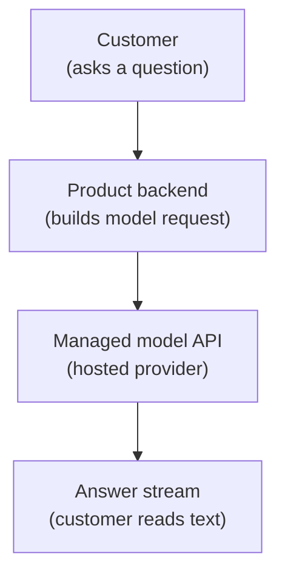
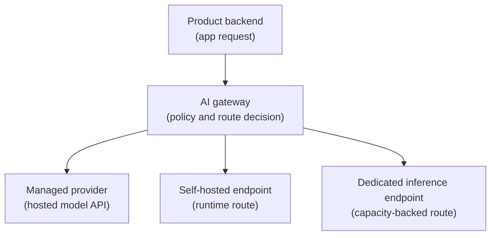

## Table of Contents

1. [Start With One Request](#start-with-one-request)
2. [The Direct Version Works First](#the-direct-version-works-first)
3. [The Gateway Adds One Decision Point](#the-gateway-adds-one-decision-point)
4. [Context Adds Outside Facts And Tools](#context-adds-outside-facts-and-tools)
5. [Self-Hosted Serving Adds Runtime Responsibility](#self-hosted-serving-adds-runtime-responsibility)
6. [A Healthy Server Can Still Be Slow](#a-healthy-server-can-still-be-slow)
7. [Canary Release Sends A Small Slice First](#canary-release-sends-a-small-slice-first)
8. [Rollback Needs A Known Good Route](#rollback-needs-a-known-good-route)
9. [Who Owns Each Part](#who-owns-each-part)
10. [Failure Cards To Recognize](#failure-cards-to-recognize)

## Start With One Request

LLM serving means getting a large language model response back to a user or system. LLM means large language model, the kind of model that reads text and produces text. Serving is the production path around that model call: the request, the route, the endpoint, the stream, the trace, and the rollback path.

Follow one request. A customer opens **Artificial Intelligence (AI) Support Chat** and asks where an order is. The product service builds the model request, sends it to a model backend, and streams the answer back.

The same names will appear through the article so the path is easy to follow:

```yaml
tenant: demo-retail
feature: ai-support-chat
model_alias: support-assistant
managed_route: managed-primary
self_hosted_route: support-open-v14
candidate_route: support-open-v15
production_endpoint: support-chat-prod
request_id: req_support_3101
trace_id: trace_7f12
```

API means application programming interface, a service your code calls over the network. The first version is short:



This short path is a good first version because the product team can learn without running model servers. The serving lifecycle begins when this simple path needs stronger routing, context, runtime control, release safety, or rollback.

The first request record looks like this:

```json
{
  "request_id": "req_support_3101",
  "feature": "ai-support-chat",
  "tenant": "demo-retail",
  "provider": "managed-primary",
  "model_alias": "support-assistant",
  "status": 200,
  "first_token_ms": 710,
  "total_ms": 2900,
  "input_tokens": 3900,
  "output_tokens": 230
}
```

The key field is `first_token_ms`. A token is a chunk of text as the model sees it. First-token latency is how long the user waits before the first visible text appears. For chat-style products, first-token latency often matters more than total time because the user can start reading while the rest of the answer streams.

OpenAI's latency guidance is useful here because it explains user-visible ideas such as streaming, chunking, request shape, and token count. The same ideas matter whether the team calls a managed API or runs a self-hosted endpoint.

## The Direct Version Works First

The direct version has three jobs:

1. Build the request.
2. Call the provider.
3. Stream the answer.

The product backend can stay simple:

```text
POST /support/chat/respond
  -> load customer question
  -> load order status
  -> load support policy
  -> call managed model API
  -> stream answer to customer
```

If the model call fails, the product should still give the user a useful path:

```text
AI Support Chat is unavailable right now.
You can still contact human support from this screen.
```

That fallback matters because the user still needs help. AI should not block the normal support path.

At this stage, the product team should keep the evidence simple:

| Evidence | Why It Matters |
|----------|----------------|
| Request ID | Support and engineering can discuss one request. |
| Feature name | The team can separate chat traffic from other AI work. |
| Model alias | The product uses a stable name instead of hardcoding a provider model everywhere. |
| Provider route | The team knows which upstream handled the request. |
| Token counts | Cost and prompt growth become visible. |
| First-token latency | User wait time becomes visible. |
| Prompt logging choice | Data handling is explicit. |

OpenAI's production guidance belongs in this phase because it covers access control, API keys, production traffic, limits, billing, and safety. A managed model call is still production software once real users depend on it.

First-line debugging should work from IDs, versions, timings, token counts, route decisions, and redacted traces, not raw prompt dumps. The request record should prove what happened without exposing customer data unnecessarily.

The direct version becomes difficult when the same rules spread into many apps.

## The Gateway Adds One Decision Point

The first serving problem is often policy drift. Policy drift means rules that should be shared slowly become different copies.

Three teams write provider wrappers:

```text
support-chat-api
  timeout: 30s
  retries: 2
  logs: request_id, model_alias, provider_request_id, tokens
  prompt_logging: disabled

catalog-api
  timeout: 12s
  retries: 5
  logs: http_status
  prompt_logging: enabled

feedback-summary-job
  timeout: 60s
  retries: 0
  logs: request_id, estimated_cost
  prompt_logging: disabled
```

Each wrapper makes sense locally. The issue is shared production behaviour. One feature logs prompt text, another does not. One feature retries five times, another does not retry at all. During an incident, the team has to inspect several codebases before it even knows which rules applied.

A gateway fixes this by adding one decision point. Apps call the gateway. The gateway checks identity, budget, data policy, model alias, route, and fallback. Then it forwards the request.



The app request can stay familiar:

```json
{
  "tenant": "demo-retail",
  "feature": "ai-support-chat",
  "model": "support-assistant",
  "stream": true,
  "messages": [
    { "role": "system", "content": "Follow the support policy and answer only from approved context." },
    { "role": "user", "content": "Customer asks: where is order 7842?" }
  ]
}
```

The gateway adds the platform decision:

```yaml
request_id: req_support_3101
tenant: demo-retail
model_alias: support-assistant
chosen_route: managed-primary
fallback_route: managed-secondary
timeout_seconds: 30
max_input_tokens: 8000
max_output_tokens: 500
prompt_logging: disabled
trace_id: trace_7f12
```

OpenRouter is a useful comparison anchor because its routing docs show provider ordering, fallbacks, parameter requirements, and data-collection controls. The internal gateway does not need to copy every feature. The useful idea is that the route decision becomes explicit evidence.

The gateway adds a new tradeoff. The team gets shared policy and better evidence, but the gateway becomes a critical service. If the gateway is down, model calls are down. If its route config is wrong, many products can be wrong at once.

## Context Adds Outside Facts And Tools

The next serving problem is missing context. A model cannot answer a customer question correctly if it does not have the latest policy, the order status, or the right tool result.

Context is the extra information added around the user question. A tool is an outside action the system can run for the model, such as `order_status.lookup`. Retrieval means searching approved documents before the model answers.

The request now has another step:

```text
customer asks question
  -> product backend sends request to gateway
  -> context platform retrieves approved policy docs
  -> context platform calls read-only order-status tool
  -> gateway sends model request with approved context
  -> answer streams to customer
```

The context platform writes a trace record:

```yaml
trace_id: trace_7f12
retrieval_index: support-policy-v8
documents_used:
  - policy/shipping-delays.md@2026-05-01
  - policy/order-changes.md@2026-04-22
tool_calls:
  - tool: order_status.lookup
    permission: read_order_status
    approval: automatic_read_only
    result_status: ok
context_tokens: 2100
```

OpenAI's tools guide is useful here because it shows model requests that can include tools, file search, web search, function calling, and remote Model Context Protocol (MCP) servers. MCP is a standard interface for connecting AI apps to outside tools and data. This is serving work because a tool result can change the final answer, cost, latency, and security boundary.

Context adds another failure class:

| Symptom | First Check |
|---------|-------------|
| The model cites old policy. | Document version and retrieval index. |
| The model calls the wrong tool. | Tool schema and permission record. |
| The request becomes expensive. | Context token count and retrieved document size. |
| The answer ignores order status. | Tool result status and prompt assembly. |
| Prompt injection changes tool behaviour. | Tool boundary and retrieved content handling. |

The tradeoff is better answers versus a wider blast radius. Context and tools make the feature useful, but they also add more things to audit.

## Self-Hosted Serving Adds Runtime Responsibility

The next problem is runtime control. Runtime means the program that loads the model and produces tokens. A managed provider owns that runtime. A self-hosted serving platform owns it directly.

The team may self-host for a custom open model, stronger data placement, lower cost at high volume, or settings the managed route does not expose. The product request may still ask for the same model alias:

```json
{
  "model": "support-assistant",
  "feature": "ai-support-chat"
}
```

The gateway can map that alias to a new self-hosted endpoint:

```yaml
model_alias: support-assistant
stable_route: managed-primary
self_hosted_route: support-open-v14
self_hosted_state: shadow
release_owner: model-release
```

Shadow means the self-hosted endpoint receives copied real requests, but users still see the stable answer. Shadow traffic is a safe way to test runtime behaviour before customers depend on it.

The self-hosted endpoint needs an endpoint record:

```yaml
endpoint: support-open-v14
model_artifact: registry://support/support-assistant-open:v14
tokenizer: registry://support/chat-tokenizer:v14
runtime: vllm
api_shape: openai-compatible
traffic_state: shadow
min_replicas: 2
gpu_profile: 2xh100-80gb
rollback_target: support-open-v13
```

vLLM is a good anchor because its OpenAI-compatible server can expose familiar API endpoints, including Chat Completions and Responses, while the team owns the hosted model runtime. The familiar API shape helps product integration, but it does not remove runtime responsibility. The platform now owns artifacts, tokenizers, graphics processing unit (GPU) memory, queues, replicas, and endpoint health.

The first endpoint check should prove more than "process is alive":

```text
endpoint: support-open-v14
traffic_state: shadow
shadow_requests: 25000
load_errors: 0
p95_first_token_latency_ms: 940
p95_total_ms: 4100
output_token_p95: 310
gpu_memory_pressure: normal
```

That status says the endpoint loaded, answered real-shaped requests, and stayed inside early latency and memory targets during shadow testing.

## A Healthy Server Can Still Be Slow

LLM serving has a special trap: the server can be healthy while users still wait.

A normal web service often fails because the process is down, the database is slow, or central processing unit (CPU) use is high. A model endpoint can have healthy pods and still have long queue time, large prompts, slow prompt processing, or slow token generation.

The pod status may look fine:

```text
pod/support-open-v14-7d6f9
  ready: true
  restarts: 0
  cpu: 42%
  gpu_memory_used: 74%
```

That output is useful, but it does not explain the user wait. The team needs a request trace:

```json
{
  "trace_id": "trace_7f12",
  "model": "support-assistant-open:v14",
  "route": "support-open-v14",
  "queue_ms": 880,
  "prompt_processing_ms": 640,
  "first_token_ms": 1650,
  "token_generation_ms": 2100,
  "input_tokens": 7200,
  "output_tokens": 340,
  "finish_reason": "stop"
}
```

Prompt processing means the runtime reads and prepares the input before it can generate the first answer token. Token generation means the model produces the output tokens. Later runtime articles may use the terms prefill and decode. Here the plain meaning is enough: input tokens and output tokens stress the server differently.

This trace is deliberately metadata-heavy. First-line debugging should work from IDs, versions, timings, token counts, route decisions, and redacted traces, not raw prompt dumps.

vLLM's metrics docs are useful because they list serving signals such as time to first token, inter-token latency, end-to-end latency, prompt tokens, generation tokens, queue time, prefill time, decode time, running requests, waiting requests, and key-value cache usage. Key-value cache, often shortened to KV cache, is memory the runtime uses to keep previous token context available.

The trace points to the fix direction:

| Evidence | Possible Fix Direction |
|----------|------------------------|
| High queue time | Add capacity, change routing, reduce burst, or shed low-priority traffic. |
| Long input tokens | Trim context, improve retrieval, cache shared prefix, or split workflow. |
| Long generation time | Reduce max output, choose a faster model, tune runtime, or stream earlier. |
| Candidate route only | Reduce canary traffic or roll back. |
| One tenant only | Inspect tenant prompt shape and reserved capacity. |

For serving, restart is rarely the first idea. First find where the request waited.

## Canary Release Sends A Small Slice First

A canary is a limited rollout. Instead of sending every request to the candidate model, the gateway sends a small percentage first.

For models, canary is not only a server-health check. A candidate can be fast and still write worse answers. It can be cheaper but call tools incorrectly. It can pass a simple smoke test and fail policy examples.

The release function gives the gateway a release decision:

```yaml
candidate_route: support-open-v15
previous_route: support-open-v14
candidate_artifact: registry://support/support-assistant-open:v15
previous_artifact: registry://support/support-assistant-open:v14
decision: canary_5_percent
watch:
  - p95_first_token_latency_ms
  - error_rate
  - output_tokens_per_request
  - support_policy_eval_pass_rate
  - tool_call_success
rollback_if:
  - p95_first_token_latency_above_target_for_10m
  - eval_regression_above_threshold
  - tool_call_errors_above_threshold
```

The route change is small:

```yaml
before:
  support-open-v14: 100
  support-open-v15: 0

after:
  support-open-v14: 95
  support-open-v15: 5
```

CoreWeave's gateway docs are useful as a comparison anchor because they describe traffic splitting across deployments by weight. KServe's LLMInferenceService docs are useful in the Kubernetes serving world because they show why LLM endpoints need specialised serving objects, routing, and deployment state instead of only a generic web deployment. KServe's canary rollout example is also useful because it shows traffic split, promotion, and rollback in a serving control plane.

The canary tradeoff is speed versus blast radius:

| Rollout Choice | Good For | Risk |
|----------------|----------|------|
| 100 percent at once | Fast switch. | Every user sees a bad candidate. |
| 5 percent canary | Small blast radius and real evidence. | Slower promotion and more route state. |
| Shadow only | No user impact. | It does not prove users like the answer. |
| Internal users first | Safer behaviour review. | Internal traffic may not match real customer traffic. |

For LLM serving, canary protects both the system and answer quality.

## Rollback Needs A Known Good Route

Rollback means moving traffic back to a known good version. A rollback is only useful if the team already knows which version is safe, how to route to it, and what state must follow the route.

The rollback record should be boring:

```yaml
rollback_plan:
  model_alias: support-assistant
  known_good_route: support-open-v14
  candidate_route: support-open-v15
  action: route_100_percent_to_known_good
  keep_candidate_warm: true
  keep_candidate_logs: true
  notify:
    - product-owner
    - platform-oncall
    - support-lead
```

Keep the candidate warm after rollback when you need evidence. If the team shuts everything down immediately, it may lose the logs and traces needed to understand what happened. Keeping it warm does cost capacity, so the rollback plan should say how long to keep it.

The rollback trigger should be clear:

```text
Roll back if p95 first-token latency stays above 1200 ms for 10 minutes.
Roll back if support-policy eval pass rate drops below 0.90.
Roll back if tool-call error rate is 2x higher than the stable route.
```

OpenAI's evaluation best-practices docs are useful here because they explain that model output needs task-specific evaluation, not only uptime. A rollback trigger can include both runtime signals and behaviour signals.

## Who Owns Each Part

The serving lifecycle is easier when the owner is clear. The product team owns the user experience. The gateway owner owns route decisions. The context platform owns retrieval and tools. The serving platform owns the self-hosted runtime. The release function owns the canary decision.

Here is the same request with owners:

```text
Customer opens AI Support Chat
  -> product team owns user route and fallback
  -> gateway owns policy, route choice, budget, trace
  -> context platform owns retrieval, tools, session evidence
  -> serving platform owns runtime if route is self-hosted
  -> capacity provider owns warm capacity if dedicated endpoint is used
  -> release function owns eval and rollout evidence
```

Ownership helps during incidents:

| Symptom | First Owner To Inspect |
|---------|------------------------|
| User sees an app error before the model call. | Product team. |
| Request is rejected for budget. | Gateway owner. |
| Retrieved policy is stale. | Context platform owner. |
| Self-hosted endpoint is slow. | Serving platform owner. |
| Dedicated endpoint misses latency target. | Capacity provider owner. |
| Candidate answer quality drops. | Release and eval owner. |

Avoid making one team own every part of the request. Clear ownership prevents long incident meetings where every person is looking at a different dashboard.

## Failure Cards To Recognize

Use these failure cards when reading later serving articles. Each card starts from what the user or operator sees, then points to the first layer to inspect.

| Failure | What It Looks Like | First Check | Likely Fix Direction |
|---------|--------------------|-------------|----------------------|
| Provider wrapper drift | Different apps retry and log differently. | Compare wrapper settings. | Move shared rules to the gateway. |
| Bad route decision | Request used unexpected model or provider. | Gateway route history. | Fix alias mapping or rollout config. |
| Budget reject | One customer cannot call the model. | Tenant budget and token counters. | Adjust quota or reduce prompt size. |
| Stale context | Answer cites old policy. | Retrieval index and document version. | Rebuild index or fix context selection. |
| Endpoint load failure | Self-hosted model never becomes ready. | Artifact path, tokenizer, runtime logs. | Fix artifact metadata or memory request. |
| Healthy but slow | Pod is ready, users wait. | Queue, prompt length, first-token trace. | Add capacity, adjust routing, reduce prompt size. |
| Bad canary | Server is healthy, answer quality drops. | Eval result and sample review. | Roll back route and fix candidate. |

The serving lifecycle adds one platform piece after the failure proves why it belongs. A direct managed API call is a good first version. A gateway appears after policy drifts. Context appears when the model needs approved facts or tools. A self-hosted runtime appears when the product needs runtime control. Request traces appear when process health stops explaining user wait. Canary and rollback appear when model changes need safer release.

---

**References**

- [OpenAI Latency Optimization](https://developers.openai.com/api/docs/guides/latency-optimization) - Use it for user-visible serving ideas such as streaming, chunking, request shape, and token counts.
- [OpenAI Production Best Practices](https://developers.openai.com/api/docs/guides/production-best-practices) - Use it for production concerns that appear even before self-hosting, such as keys, limits, billing, and safety.
- [OpenRouter Provider Routing](https://openrouter.ai/docs/guides/routing/provider-selection) and [CoreWeave Gateways](https://docs.coreweave.com/products/inference/gateways) - Use them as comparison anchors for route layers, provider selection, fallback, and traffic splitting across inference deployments.
- [vLLM OpenAI-Compatible Server](https://docs.vllm.ai/en/latest/serving/openai_compatible_server/) - Use it to understand how a self-hosted runtime can expose familiar web API shapes.
- [vLLM Metrics](https://docs.vllm.ai/en/latest/design/metrics/) - Use it for serving signals such as time to first token, queue time, prompt tokens, generation tokens, and KV cache usage.
- [KServe LLMInferenceService Overview](https://kserve.github.io/website/docs/model-serving/generative-inference/llmisvc/llmisvc-overview) and [KServe Canary Rollout Example](https://kserve.github.io/website/docs/model-serving/predictive-inference/rollout-strategies/canary-example) - Use them to understand specialised LLM serving objects plus traffic split, promotion, and rollback examples.
