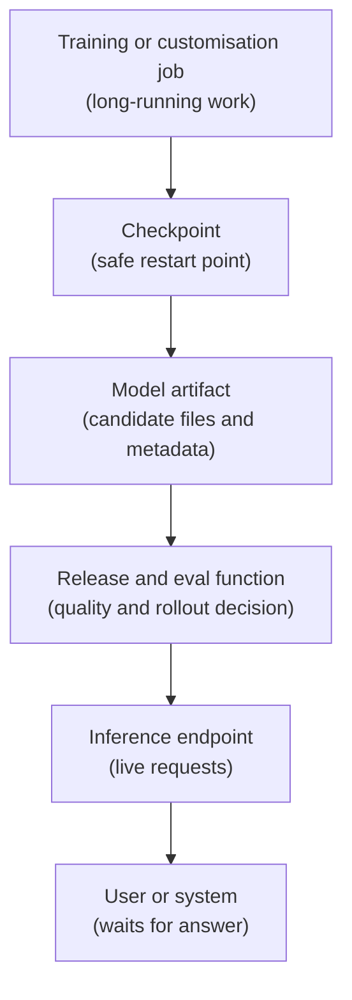

## Table of Contents

1. [One Model, Two Different Jobs](#one-model-two-different-jobs)
2. [Training Watches Long-Running Progress](#training-watches-long-running-progress)
3. [Checkpoints Make Training Recoverable](#checkpoints-make-training-recoverable)
4. [Inference Watches Waiting Users](#inference-watches-waiting-users)
5. [Batch Inference Is Still Inference](#batch-inference-is-still-inference)
6. [The Same GPU Signal Can Mean Different Things](#the-same-gpu-signal-can-mean-different-things)
7. [The Handoff Turns Training Output Into Serving Input](#the-handoff-turns-training-output-into-serving-input)
8. [Sharing Accelerators Needs Explicit Rules](#sharing-accelerators-needs-explicit-rules)
9. [Ask The Right Team First](#ask-the-right-team-first)
10. [Practice The Difference](#practice-the-difference)

## One Model, Two Different Jobs

Training and inference both use models. They may both use graphics processing units (GPUs), which are accelerator chips used for heavy model computation. From far away, they can look like one AI infrastructure problem. Up close, they are two different operating jobs.

Training creates or adapts a model. A training or fine-tuning job reads data, updates model weights, writes checkpoints, and eventually produces a candidate artifact. A checkpoint is a saved restart point. An artifact is the model output that later serving systems try to load.

Inference uses a trained model to answer a request. A customer asks a question, the endpoint runs the model, and the customer waits for text. The model is already built. The operating question is whether the endpoint can answer quickly and safely.

Here is the first split:

| Work Type | Plain Goal | Who Is Waiting? |
|-----------|------------|-----------------|
| Training or fine-tuning | Keep a long job making progress and recover from interruption. | Usually no one waiting on one live request. |
| Inference | Answer live requests within the product target. | A user or system may be waiting right now. |

The goal changes the first check. A training operator asks, "Is the job still making progress, and what checkpoint can restart safely?" An inference operator asks, "Are users getting answers quickly, and can we roll back if the model or route changed?"

The model lifecycle connects the two jobs:



During training, the important word is progress. During inference, the important word is waiting.

## Training Watches Long-Running Progress

The training platform starts a fine-tuning job named `ft-support-2026-05-09`. Fine-tuning means taking an existing model and training it further on approved examples. In this story, the product team wants better support answers for the AI Support Chat feature.

The job may use many workers. A worker is one process doing part of the training work. Distributed training often calls each worker a rank. You do not need the full math yet. The operating idea is simple: if one worker gets stuck, the whole job may slow down or stop.

The first question is whether the job has been admitted. Admitted means the scheduler has given the job the resources it asked for. If a job is not admitted, it cannot train yet.

```text
$ kubectl get workloads -n training
NAME                         QUEUE          ADMITTED   FINISHED   AGE
ft-support-2026-05-09        gpu-training   True       False      4h12m
eval-support-v15             gpu-training   False      False      38m
dataset-scan-support         cpu-batch      True       True       5h01m
```

The fine-tuning job is admitted and running. The eval job is waiting. That may be normal if the queue is protecting GPU quota.

Kueue is useful here because its docs describe Kubernetes-native queueing for batch, high-performance computing (HPC), and AI and machine learning workloads. In plain terms, queueing decides which jobs start when there is not enough capacity for all of them.

After admission, the training platform checks progress:

```text
job: ft-support-2026-05-09
state: running
workers_ready: 32/32
current_step: 18420
steps_per_minute: 8.7
gpu_utilisation_avg: 91%
data_wait_ms_p95: 42
latest_complete_checkpoint: step-18000
```

This status tells a good training story. All workers are alive. Step count is increasing. GPUs are busy. Data loading is not causing long waits. A complete checkpoint exists at step 18000.

Training operations care about steady progress. One customer is not waiting on step 18420. The team may care that the job finishes by tomorrow, but a short interruption is manageable if checkpoints are healthy.

PyTorch Fully Sharded Data Parallel (FSDP) is a useful official anchor because it shows how distributed training spreads model and optimiser state across workers. NVIDIA Collective Communications Library (NCCL) is another useful anchor because distributed GPU jobs often need collective operations where every rank participates. The first operating lesson is simple: distributed training has many cooperating workers, so progress depends on the group.

## Checkpoints Make Training Recoverable

The first training failure is a worker failure:

```text
time: 2026-05-09T13:42:11Z
job: ft-support-2026-05-09
event: worker_failed
worker: rank-17
node: gpu-train-22
current_step: 18530
latest_complete_checkpoint: step-18000
incomplete_checkpoint: step-18500
```

The important line is `latest_complete_checkpoint: step-18000`. The job can restart from step 18000. It may replay some work, but it does not lose the entire run.

The incomplete checkpoint is ignored because partial saved state can be unsafe. A clean restart point is better than a half-written one.

The training platform writes the recovery note:

```text
Restart from checkpoint step-18000.
Replay estimate: about 61 minutes.
Ignore checkpoint step-18500 because it did not finish writing.
Move rank-17 away from node gpu-train-22.
```

That note is plain on purpose. It says where to restart, how much work is lost, which checkpoint is unsafe, and what placement change to make.

Training failures often look like this:

| Failure | What You See | First Fix Direction |
|---------|--------------|---------------------|
| Job waits in queue. | `ADMITTED=False`. | Check quota, priority, and requested GPU shape. |
| One worker dies. | One rank exits, others wait. | Restart from checkpoint and avoid the bad node. |
| Data loader is slow. | GPU use drops while data wait rises. | Improve storage path, caching, or preprocessing. |
| Checkpoint is too old. | Restart would replay too much work. | Check checkpoint interval and storage speed. |
| Artifact is incomplete. | Serving cannot load output. | Require artifact manifest and checksum before handoff. |

The recovery goal is progress. The job can wait, restart, replay, and continue. That is very different from a live inference endpoint.

## Inference Watches Waiting Users

Now switch to inference. The endpoint `support-chat-prod` serves the current approved model to customers. A live user is waiting for answer text.

The endpoint status may look healthy:

```text
endpoint: support-chat-prod
state: ready
model: support-assistant-open:v14
region: eu-west
warm_replicas: 4
ready_replicas: 4
error_rate_5m: 0.2%
```

That status matters, but it does not show the full user experience. The user does not see `ready_replicas`. The user sees whether the answer starts quickly and finishes in a useful time.

The inference operator checks request metrics:

```text
endpoint: support-chat-prod
requests_per_minute: 420
p95_queue_ms: 180
p95_first_token_latency_ms: 820
p95_total_ms: 3600
output_tokens_per_second: 13800
latency_state: healthy
```

First-token latency is the time until the first visible output token. Total latency is the time until the full answer completes. Queue time is how long the request waited before the model started work.

OpenAI's latency guidance is useful for the managed application programming interface (API) version of this problem because it explains streaming, chunking, request shape, and token count. vLLM's metrics docs are useful for the self-hosted version because they list serving signals such as time to first token, queue time, prompt tokens, generation tokens, running requests, waiting requests, and key-value cache usage.

Key-value cache, often shortened to KV cache, is memory the runtime uses to keep previous token context available. You do not need to tune it here. You only need to know that model servers have model-specific bottlenecks beyond central processing unit (CPU) use and web status.

Inference reports often start from user language:

| User Report | Platform Translation |
|-------------|----------------------|
| "The chat starts slowly." | First-token latency is high. |
| "The answer takes forever to finish." | Output length or generation speed changed. |
| "It worked five minutes ago." | Recent rollout, route change, or traffic spike. |
| "Only one customer is affected." | Tenant route, reserved capacity, or prompt shape. |
| "The answer style changed." | Model version, prompt template, or fallback route changed. |

The inference operator turns the user report into a measurable request story.

## Batch Inference Is Still Inference

Not every inference request has a user waiting on the next token. A nightly eval run, document classification job, embedding refresh, report summary, or support-ticket labelling job uses a trained model to produce outputs, but it can wait in a queue.

Batch inference is not training because it does not update model weights. It is not live inference because one user is not waiting for the next answer. It sits between the two operating styles: the work is inference, but the scheduling feels more like batch work.

OpenAI's Batch API is a useful managed-provider anchor because the docs describe asynchronous groups of requests for jobs that do not need immediate responses, with a clear 24-hour turnaround window. Anthropic's API overview is useful as a second anchor because it lists Message Batches as an asynchronous API surface for processing large volumes of Messages requests.

| Work | Updates Weights? | User Waiting Now? | First Evidence |
|------|------------------|-------------------|----------------|
| Training | Yes | Usually no | Job progress and checkpoint |
| Live inference | No | Yes | Request trace and latency |
| Batch inference | No | No | Batch status, queue age, completion count, error file |

A batch inference record can look like this:

```yaml
batch: support-policy-eval-2026-05-09
work_type: batch_inference
model_alias: support-assistant
input_file: s3://ai-batches/support/eval-2026-05-09.jsonl
state: running
submitted_at: 2026-05-09T09:00:00Z
completion_window: 24h
completed_requests: 42000
failed_requests: 17
error_file: s3://ai-batches/support/eval-2026-05-09-errors.jsonl
```

The first check is not first-token latency because nobody is watching one response stream. The first check is whether the batch is moving, whether errors are explainable, and whether the result will arrive before the downstream team needs it.

## The Same GPU Signal Can Mean Different Things

Training and inference can both show "GPU problem" in a dashboard. The same number can mean different things because the operating goal is different.

Suppose GPU utilisation is low.

For training, low utilisation may mean the job is waiting for data:

```text
job: ft-support-2026-05-09
gpu_utilisation_avg: 38%
data_wait_ms_p95: 920
steps_per_minute: 2.1
```

The fix direction is storage and input pipeline work. Maybe examples are reading from a slow object-storage path. Maybe preprocessing should happen before training. Adding more GPUs may make the problem worse because more workers will wait on the same slow data path.

For inference, low utilisation may mean the endpoint is underloaded but still slow:

```text
endpoint: support-chat-prod
gpu_utilisation_avg: 38%
p95_queue_ms: 0
p95_first_token_latency_ms: 1800
input_tokens_p95: 120000
```

The fix direction is request shape and runtime behaviour. The requests may have very large prompts. The model may spend a long time processing context before it can stream the first token. Adding generic replicas may help bursts, but it may not fix one long-context request class.

Now suppose GPU utilisation is high.

For training, high utilisation can be good if step time is stable. It means expensive accelerators are doing useful work. For inference, high utilisation can be risky if queue time rises and live requests miss the latency target.

Here is the comparison:

| Signal | Training Meaning | Inference Meaning |
|--------|------------------|-------------------|
| Queue is long. | Jobs wait for fair resource admission. | Users may be waiting too long. |
| One worker fails. | Restart from checkpoint. | Remove bad replica and protect traffic. |
| GPU use is high. | Good if step time is stable. | Risky if queue and latency rise. |
| GPU use is low. | May be data or communication wait. | May be prompt shape, routing, or underload. |
| Token count grows. | Maybe larger sequence length or dataset choice. | Cost and latency may rise per request. |

The fix starts with the operating goal. Training protects long-running progress. Inference protects waiting users.

## The Handoff Turns Training Output Into Serving Input

Training completion does not automatically mean production readiness. The training platform may finish and write an artifact:

```yaml
artifact: registry://support/support-assistant-open:v15-candidate
job: ft-support-2026-05-09
base_model: open-support-70b
tokenizer: chat-tokenizer:v15
runtime_target: vllm
context_window: 32768
checksum: sha256:4fd2...
training_status: completed
latest_checkpoint: step-24000
tokenizer_compatibility: pass
serving_smoke_test: pending
```

That record proves the job produced files. It does not prove the model should answer customers. The release function still needs evals. The serving platform still needs to load the artifact. The gateway still needs a route. The capacity owner still needs enough warm replicas.

A release record might say:

```yaml
candidate_route: support-open-v15
previous_route: support-open-v14
candidate_artifact: registry://support/support-assistant-open:v15
previous_artifact: registry://support/support-assistant-open:v14
eval_set: support-chat-v6
pass_rate: 0.94
tokenizer_compatibility: pass
serving_smoke_test: pass
shadow_latency_p95_ms: 870
cost_change: "+5%"
decision: canary_5_percent
rollback: support-open-v14
```

Now inference serves two versions:

```text
stable: support-open-v14, 95 percent traffic
candidate: support-open-v15, 5 percent traffic
rollback: route 100 percent to support-open-v14
```

The canary may fail in different ways:

| Canary Signal | What It Means | First Action |
|---------------|---------------|--------------|
| Error rate rises. | Endpoint or runtime has a serving issue. | Reduce candidate traffic or roll back. |
| First-token latency rises. | Candidate is slower or capacity is too small. | Check trace and capacity before promoting. |
| Output tokens rise. | Cost and total latency increase. | Adjust prompt, max output, or candidate. |
| Eval sample gets worse. | Model behaviour regressed. | Hold release and return to the release owner. |
| Tool calls fail. | The candidate does not follow the tool contract. | Fix schema, prompt, or model before more traffic. |

Training output becomes serving input only after packaging, eval, serving load checks, and rollout rules agree.

## Sharing Accelerators Needs Explicit Rules

Training and inference often want the same scarce hardware. That creates a platform tradeoff.

The training platform wants large groups of GPUs for long jobs. It can tolerate queueing if the job eventually runs and checkpoints protect progress. The inference endpoint wants warm capacity for live requests. It cannot wait until a long training job finishes before answering a customer.

If the platform treats all GPU work as one identical pool, live traffic can be delayed:

```text
09:00 customer chat traffic rises
09:05 batch training job borrows warm inference capacity
09:07 support-chat-prod queue grows
09:10 p95 first-token latency misses target
09:12 customers report slow chat answers
```

The fix is not to ban sharing. Sharing can save money. The fix is to make sharing rules explicit.

```yaml
capacity_policy:
  inference_pool:
    endpoint: support-chat-prod
    warm_replicas_business_hours: 4
    batch_borrowing: false
  training_pool:
    queue: gpu-training
    can_borrow_after_hours: true
    preemptible_jobs:
      - eval
      - dataset-scan
```

SageMaker HyperPod is a useful managed-cluster anchor because its docs frame large machine learning workloads around resilient accelerator clusters, Slurm, Amazon EKS, automatic replacement of faulty hardware, and topology-aware placement. Kueue is useful in Kubernetes-native environments because it gives batch jobs quota, admission, borrowing, and queueing rules.

The tradeoffs are practical:

| Decision | Helps | Costs |
|----------|-------|-------|
| Reserve inference capacity. | Live requests stay predictable. | More idle cost. |
| Let training borrow spare capacity. | Better utilisation. | Risk if borrowing touches live endpoints. |
| Checkpoint more often. | Less replay after failure. | More storage writes and possible slowdown. |
| Run larger training jobs. | Faster completion after admission. | Harder scheduling and larger failure blast. |
| Keep more model versions warm. | Faster rollback and testing. | More memory and capacity use. |

Capacity policy is product policy. It decides who waits when there is not enough room.

## Ask The Right Team First

When a model-related incident arrives, first decide whether it is a training problem, an inference problem, or a handoff problem.

Ask training questions for long jobs:

| Question | Evidence |
|----------|----------|
| Is the job admitted? | Scheduler workload status. |
| Are all workers alive? | Worker or rank health. |
| Is training making progress? | Step count and step time. |
| Are GPUs waiting on data? | Data wait and utilisation. |
| What checkpoint can restart safely? | Latest complete checkpoint. |
| Can serving load the artifact? | Artifact manifest, checksum, tokenizer, runtime target. |

Ask inference questions for live endpoints:

| Question | Evidence |
|----------|----------|
| Which endpoint missed the target? | Endpoint latency and request trace. |
| Which model version answered? | Route and model identity. |
| Where did the request wait? | Queue, prompt processing, generation, network. |
| Did rollout change traffic? | Canary route history. |
| Did prompt shape change? | Input token count and request class. |
| Can we roll back safely? | Previous version and route config. |

Ask release questions for model behaviour:

| Question | Evidence |
|----------|----------|
| Did behaviour improve? | Eval result and sample review. |
| Did safety or tool use regress? | Eval categories and agent traces. |
| Did cost change? | Input and output token comparison. |
| Is migration clear? | Release notes and model alias plan. |

The right first question saves time. A failed checkpoint is not fixed by changing a gateway route. A slow first token is not fixed by rerunning training. A worse answer is not fixed by adding warm replicas.

## Practice The Difference

Use these three short prompts to test your mental model.

First, classify the problem:

```text
Job ft-support-2026-05-09 has ADMITTED=False for 3 hours.
No customers are waiting on this job directly.
The requested GPU shape is h100-80gb x 64.
```

This is a training scheduling problem. Start with quota, priority, requested GPU shape, and queue policy.

Second, classify the problem:

```text
Endpoint support-chat-prod is ready.
p95 first-token latency rose from 820 ms to 2100 ms.
Queue time rose to 1300 ms.
The latest route change sent 10 percent traffic to v15.
```

This is an inference and rollout problem. Start with route history, candidate metrics, queue time, and rollback plan.

Third, classify the problem:

```text
Training job completed.
Artifact support-assistant-open:v15-candidate exists.
Serving load test fails because tokenizer metadata is missing.
```

This is a handoff problem. Start with artifact manifest, tokenizer, checksum, runtime target, and packaging checks.

Keep the short version in your head:

```text
Training question:
  Can the long job keep making progress and recover from interruption?

Inference question:
  Can live users get the right answer within the target?

Release question:
  Should this model version receive more traffic?
```

Those questions separate the operating goals before the tools appear.

---

**References**

- [Kueue ClusterQueue](https://kueue.sigs.k8s.io/docs/concepts/cluster_queue/) - Use it for Kubernetes-native batch admission, queueing strategy, quota, resource flavours, borrowing, and cohorts.
- [PyTorch FullyShardedDataParallel](https://docs.pytorch.org/docs/2.11/fsdp.html) - Use it as an official anchor for distributed training state, sharded optimiser state, and checkpoint-related loading patterns.
- [NVIDIA NCCL Collective Operations](https://docs.nvidia.com/deeplearning/nccl/user-guide/docs/usage/collectives.html) - Use it to understand why distributed GPU workers must participate together in collective communication.
- [vLLM Metrics](https://docs.vllm.ai/en/latest/design/metrics/) - Use it for inference signals such as time to first token, queue time, prompt tokens, generation tokens, running requests, and KV cache usage.
- [OpenAI Latency Optimization](https://developers.openai.com/api/docs/guides/latency-optimization), [OpenAI Batch API](https://developers.openai.com/api/docs/guides/batch), and [Anthropic API Overview](https://platform.claude.com/docs/en/api/overview) - Use them for live latency concepts and asynchronous inference jobs that do not need an immediate response.
- [Amazon SageMaker HyperPod](https://docs.aws.amazon.com/sagemaker/latest/dg/sagemaker-hyperpod.html) - Use it as a managed-cluster anchor for resilient accelerator clusters, Slurm, Amazon EKS, hardware replacement, and topology-aware placement.
