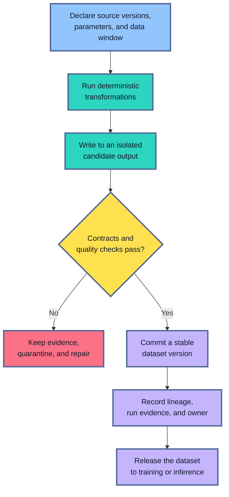
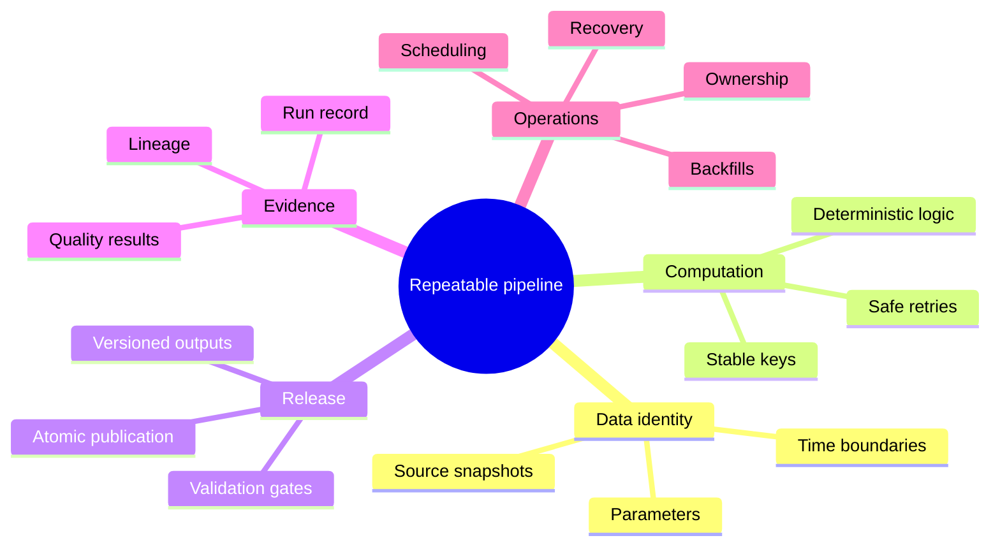
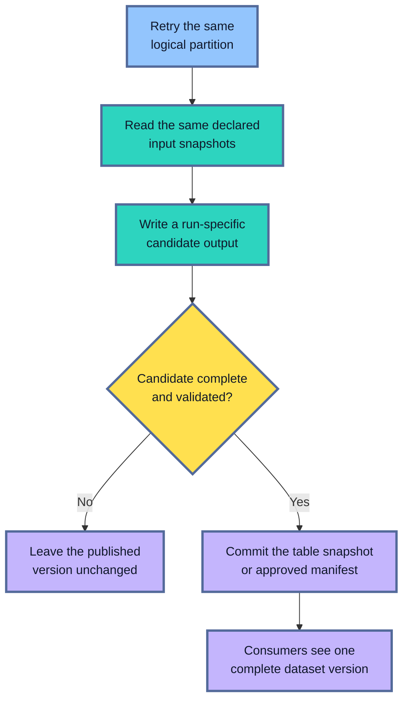
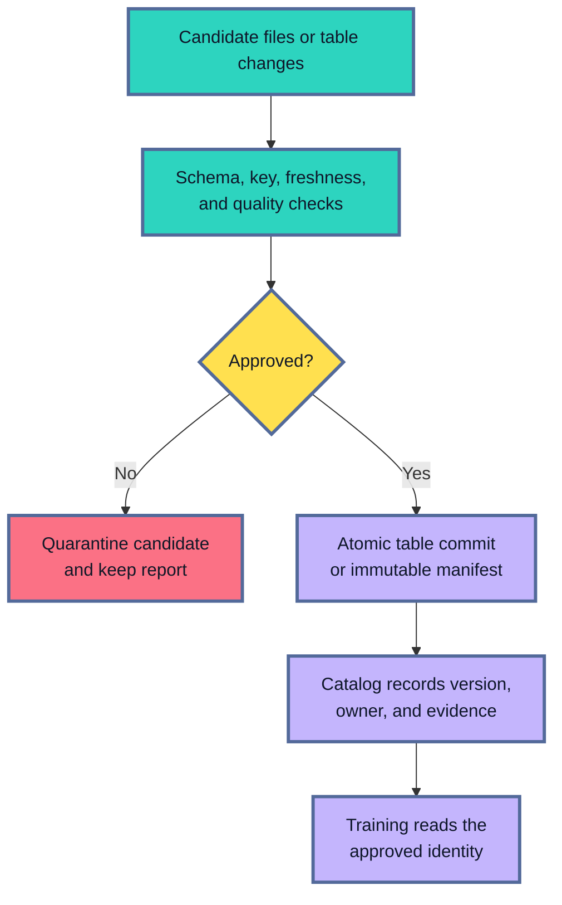
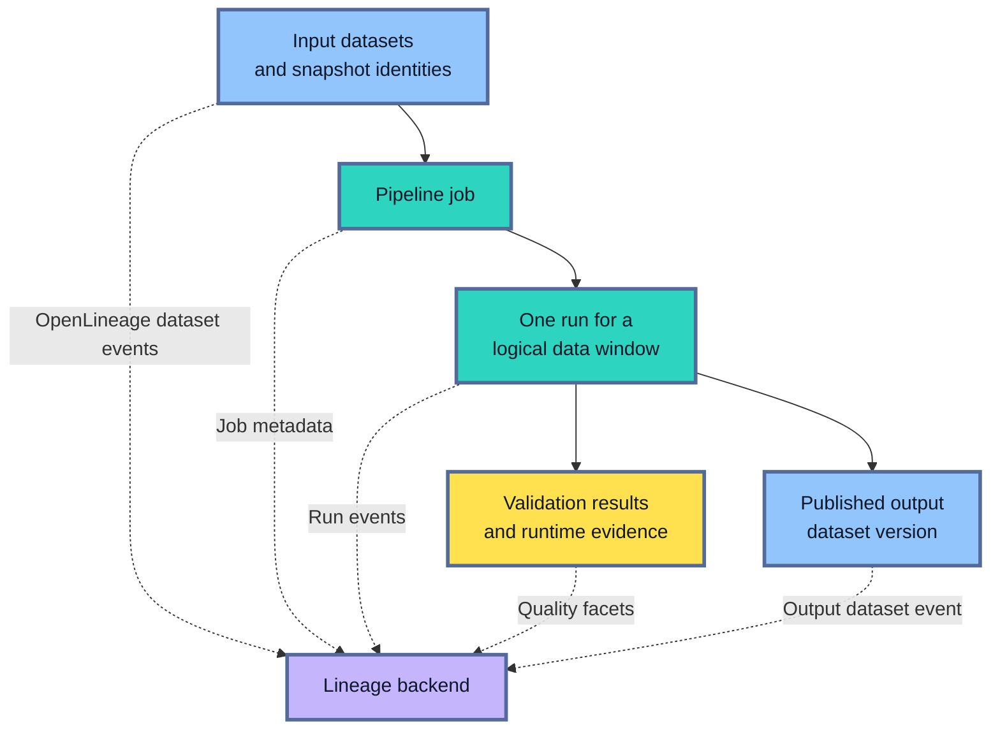
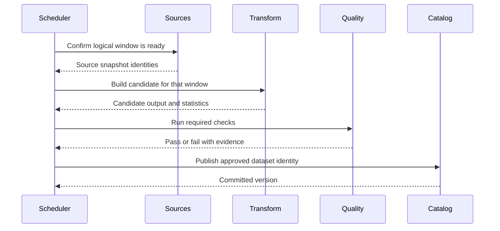
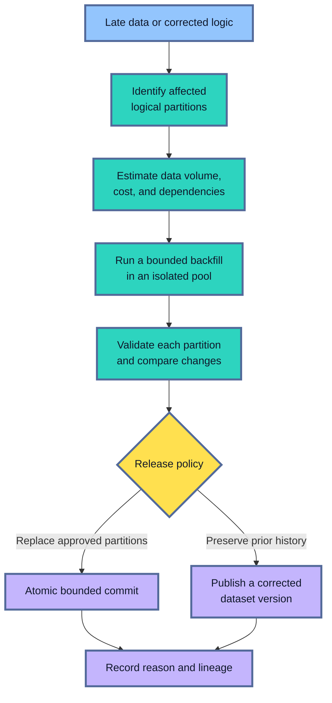
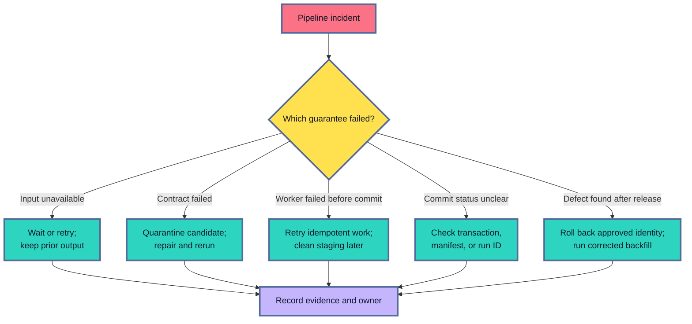
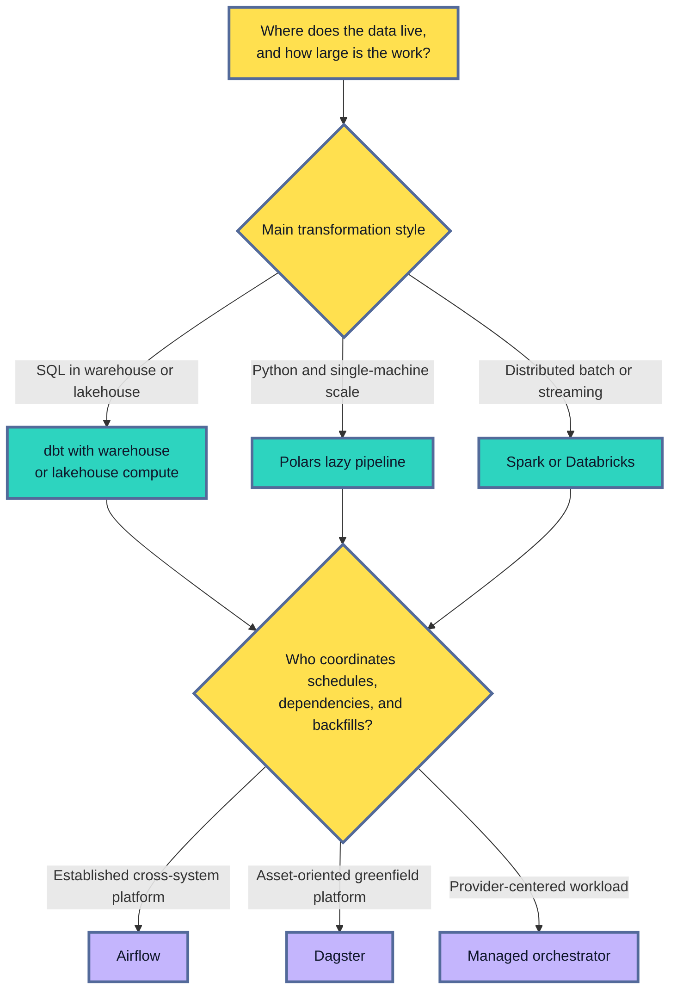

## Table of Contents

1. [What Makes A Data Pipeline Repeatable?](#what-makes-a-data-pipeline-repeatable)
2. [The Repeatability Framework](#the-repeatability-framework)
3. [1. Declare The Inputs And Their Time](#1-declare-the-inputs-and-their-time)
4. [2. Make Transformations Deterministic](#2-make-transformations-deterministic)
5. [3. Make Every Run Safe To Retry](#3-make-every-run-safe-to-retry)
6. [4. Treat Validation As A Publication Gate](#4-treat-validation-as-a-publication-gate)
7. [5. Publish A Stable Materialized Output](#5-publish-a-stable-materialized-output)
8. [6. Record Lineage And Run Evidence](#6-record-lineage-and-run-evidence)
9. [7. Schedule By Logical Data Windows](#7-schedule-by-logical-data-windows)
10. [8. Plan Backfills Before You Need Them](#8-plan-backfills-before-you-need-them)
11. [9. Recover Without Hiding The Failure](#9-recover-without-hiding-the-failure)
12. [Choosing The Processing And Orchestration Layers](#choosing-the-processing-and-orchestration-layers)
13. [Operational Ownership](#operational-ownership)
14. [A Practical Industrial Baseline](#a-practical-industrial-baseline)
15. [The Main Idea](#the-main-idea)
16. [References](#references)

## What Makes A Data Pipeline Repeatable?
<!-- section-summary: A repeatable data pipeline can rebuild the same logical dataset from declared source versions, code, configuration, and time boundaries. -->

Suppose a daily pipeline builds features for a payment-risk model. It reads transactions, joins the current account profile, calculates recent spending totals, and appends the result to a training table.

The first run fails after writing half of the output. An operator retries it. During the gap, late transactions arrive and several account profiles change. The retry reads this newer state and appends a second set of rows. The job eventually reports success. The training table now contains duplicated keys, mixed source versions, and different profile values for the same logical day.

Every command worked as written. The production failure came from missing rules around the commands.

A **repeatable data pipeline** can rebuild a trustworthy dataset from a declared set of source versions, transformation code, configuration, and time boundaries. In essence, the team should be able to answer:

- What exact data did this run read?
- Which logic and parameters transformed it?
- Could the same work run again safely?
- Which checks approved the result?
- What durable output did consumers receive?
- Which evidence connects the output to the run?

Repeatability has two useful levels. **Logical repeatability** means the same declared inputs and logic produce the same rows and values according to the dataset contract. **Byte-for-byte repeatability** also requires identical file order, compression, and serialization. Most distributed ML pipelines need logical repeatability. Spark may write a different set of Parquet file names on two runs while preserving the same keys, values, and table snapshot.



The transformation code is one part of this path. A production pipeline also defines the identity of its inputs, safe write behaviour, release gates, output identity, scheduling semantics, recovery rules, and ownership.

## The Repeatability Framework
<!-- section-summary: Nine connected responsibilities turn transformation code into a production dataset-building system. -->

It is useful to think of a pipeline as a small production system with nine connected responsibilities. Each responsibility answers a question that transformation code leaves open. Together, they keep one successful run from being mistaken for a reliable data product.

**Declared inputs and snapshots** give the run a fixed starting point. A warehouse table name identifies a location; a table snapshot, source watermark, object version, or extraction manifest identifies the data the run actually used.

**Deterministic transformations** keep hidden state out of the calculation. Current wall-clock time, unstable row ordering, mutable lookup tables, unseeded randomness, and implicit time zones can all change an output without a code change.

**Idempotent and restartable execution** makes retries safe. Idempotent means that applying the same logical operation again leaves the published state in the same condition. A partition replacement or key-based merge can provide that property. Blind append usually cannot.

**Contracts and validation** define which outputs are acceptable. Schema, unique keys, null rules, freshness, label maturity, ranges, and cross-table relationships belong here.

**Materialized outputs** give downstream training jobs a durable dataset to read. A materialized output may be a warehouse table, a Delta Lake or Apache Iceberg snapshot, or a set of Parquet files with a manifest.

**Lineage and run evidence** explain how the output was produced. They connect source datasets, the pipeline job, one execution, its code and configuration, validation results, and the published output.

**Scheduling and backfills** map executions to logical data windows. A scheduler needs to know which partition a run owns and how historical partitions can be rebuilt with bounded concurrency.

**Failure recovery** defines the response to missing sources, failed validation, worker crashes, partial writes, and defects discovered after publication.

**Operational ownership** assigns the people responsible for source contracts, pipeline behaviour, platform reliability, and consumer acceptance.



These responsibilities stay useful across technology choices. One team may use a SQL warehouse and dbt, while another uses object storage and Polars. Large lakehouse workloads may use Spark on Databricks, and provider-centered teams may prefer managed pipelines. The architecture remains understandable because each product has a defined job.

## 1. Declare The Inputs And Their Time
<!-- section-summary: A repeatable run identifies source data through snapshots, versions, watermarks, and logical time boundaries. -->

At a high level, input declaration answers, “Which facts were available to this build?” A source path gives an incomplete answer because production data keeps changing.

Consider a feature called `spend_last_30_days`. The pipeline may run after midnight, yet the feature belongs to the data interval that just closed. Transactions arriving after the interval must stay outside that run. Corrections arriving later need an explicit late-data or backfill policy. Reading every row currently visible would allow execution time to change the feature value.

Three kinds of time commonly appear:

- **Event time** describes when the real-world event happened, such as the transaction timestamp.
- **Processing time** describes when the platform received or processed the event.
- **Effective time** describes when a reference value applied, such as the period during which an account tier was valid.

ML labels introduce another boundary. If a return, chargeback, or customer outcome can arrive several days after the original event, the pipeline needs a **label cutoff**. Training should only include examples whose outcome window has matured according to the policy.

A run specification can make those decisions explicit:

```yaml
run:
  pipeline: payment_risk_features
  logical_window:
    start: "<window_start>"
    end: "<window_end>"
  label_cutoff: "<label_cutoff>"
  code_commit: "<git_commit>"
  config_version: "risk-features-v4"

inputs:
  transactions:
    table: "analytics.transactions"
    snapshot_id: "<catalog_snapshot_id>"
  accounts:
    table: "analytics.account_history"
    snapshot_id: "<catalog_snapshot_id>"
  merchant_categories:
    object_manifest: "s3://ml-data/manifests/<manifest_id>.json"

output:
  dataset: "ml.payment_risk_features"
  partition: "<logical_partition>"
```

Different storage systems express input identity differently. An object-store pipeline can record object version IDs or write an immutable manifest containing every object path and checksum. Delta Lake and Apache Iceberg expose table versions or snapshots. A warehouse may provide time travel, snapshots, or a controlled extraction table. A streaming pipeline often combines a source offset or checkpoint with an event-time watermark.

The important distinction is between **where the data lives** and **which state of that data belongs to the run**. The first supports access. The second supports reconstruction.

## 2. Make Transformations Deterministic
<!-- section-summary: Deterministic transformation logic produces the same logical rows and values from the same declared inputs and configuration. -->

A deterministic transformation produces the same logical result from the same declared inputs and configuration. You can think of it as a pure calculation at pipeline scale: every value that can influence the output enters through a reviewed input.

Several common SQL and dataframe habits break this property:

- Calling `current_timestamp` inside feature logic lets the execution clock change the result.
- Selecting one duplicate row without a complete ordering lets the engine choose a different winner.
- Joining a mutable “current customer” table changes historical examples after customer attributes change.
- Sampling without a fixed seed changes the selected rows.
- Relying on a machine's local time zone changes date boundaries.
- Reading files through an unordered wildcard can alter downstream logic that depends on row order.

Suppose multiple profile updates exist for one account. A stable transformation uses the run's cutoff time and a complete tie-break rule:

```sql
with eligible_profiles as (
    select
        account_id,
        risk_tier,
        effective_at,
        profile_version,
        row_number() over (
            partition by account_id
            order by effective_at desc, profile_version desc
        ) as row_rank
    from analytics.account_history
    where effective_at < :window_end
)
select account_id, risk_tier
from eligible_profiles
where row_rank = 1;
```

The parameter `:window_end` represents logical data time. The second ordering field resolves updates that share the same effective timestamp. Without that tie-breaker, two valid rows could compete for first place.

Determinism also requires stable business definitions. If missing merchant categories map to `"unknown"`, that rule belongs in reviewed code or configuration. A manual spreadsheet on one developer's laptop would introduce hidden state.

Distributed engines add one nuance. Spark can schedule partitions differently across runs, so file names and row order may vary. Tests should compare the dataset's keys, values, schema, and relevant aggregate invariants. Byte order matters only for consumers whose contract explicitly requires it.

### Match the transformation engine to the workload

dbt fits transformations expressed mainly as SQL inside a warehouse or lakehouse. It builds a dependency graph from model references, materializes models, and keeps tests beside those models. Incremental models can process new or updated rows, provided the filter and unique-key policy capture late changes correctly.

Polars fits Python data pipelines that can run efficiently on one machine. Its lazy API lets the optimizer inspect the whole query. The engine can push filters and projections toward the scan, check schemas before full execution, and stream supported operations. A typical pipeline starts with `scan_parquet` and can stream the result through `sink_parquet`:

```python
(
    pl.scan_parquet(input_paths)
    .filter(pl.col("event_time") < window_end)
    .group_by(["account_id", "feature_date"])
    .agg(pl.col("amount").sum().alias("daily_spend"))
    .sink_parquet(candidate_output)
)
```

Spark fits data that needs distributed scans, wide joins, large shuffles, or shared batch and streaming processing.

On Databricks, **Lakeflow pipelines** manage dependencies among streaming tables, materialized views, and flows. Lakeflow pipelines extend **Apache Spark Declarative Pipelines (SDP)**, the underlying open framework for declarative batch and streaming pipelines. Lakeflow Jobs coordinates cross-system work, conditional branches, and broader retry policy.

## 3. Make Every Run Safe To Retry
<!-- section-summary: Idempotent writes and isolated candidate outputs let workers restart without duplicating or exposing partial data. -->

Production workers fail. A cluster may disappear or a network call may time out. A scheduler may also lose contact after the compute job has committed its result. The pipeline therefore needs a safe answer to a simple question: “What happens if the same logical partition runs twice?”

An **idempotent** operation reaches the same visible state after repeated application. Replacing the output for one declared partition is idempotent if every retry computes that partition from the same inputs. Merging rows by a stable unique key can also be idempotent if matched rows receive the same values. Appending the same rows again creates duplicates.

For a Delta table, a bounded partition replacement can use `replaceWhere`. Here, `window_start` and `window_end` are already-resolved `date` or `datetime` values:

```python
if window_start >= window_end:
    raise ValueError("window_start must be earlier than window_end")

start_iso = window_start.isoformat()
end_iso = window_end.isoformat()
partition_predicate = (
    f"feature_date >= '{start_iso}' "
    f"AND feature_date < '{end_iso}'"
)

(
    features.write
    .format("delta")
    .mode("overwrite")
    .option("replaceWhere", partition_predicate)
    .saveAsTable("ml.payment_risk_features")
)
```

The production implementation should validate the window before constructing the predicate. A broad or empty predicate could replace unintended data. Key-based updates need similar safeguards around the merge key and duplicate source rows.

Delta Lake and Apache Iceberg use atomic table commits, so readers see a complete committed table state. Iceberg records each committed change as a snapshot. Delta supports transaction identifiers for applications that need duplicate-write protection. Streaming jobs also require idempotent logic around each micro-batch because a restart may present a batch again.

Plain object storage needs a publication convention. A strong pattern writes files under a run-specific staging prefix and validates them there. It then produces a manifest with paths and checksums before updating a small catalog record or approved-manifest pointer. Consumers read only approved manifests. An abandoned staging prefix stays invisible and can be removed later by a lifecycle job.



Restartability also applies inside the run. Expensive extraction or feature stages may checkpoint intermediate results under the run ID. Those checkpoints are execution aids. The published dataset identity still comes from the final commit and run record.

## 4. Treat Validation As A Publication Gate
<!-- section-summary: Validation checks decide whether a candidate dataset is safe for downstream training or inference. -->

Validation is the release review for data. It asks whether the candidate output still satisfies the assumptions used by training, evaluation, and serving.

A practical pipeline checks several layers. Source checks confirm expected schema, freshness, and coverage before expensive processing begins. Transformation checks protect join cardinality, unique keys, and row-level invariants. Final checks cover null rates, accepted ranges, label maturity, segment coverage, and changes in important distributions.

For a SQL-centric pipeline, dbt data tests place common assertions beside the model. The current configuration key is `data_tests`:

```yaml
models:
  - name: payment_risk_features
    columns:
      - name: training_example_id
        data_tests:
          - not_null
          - unique
      - name: risk_tier
        data_tests:
          - accepted_values:
              arguments:
                values: ["low", "medium", "high", "unknown"]
```

dbt treats each data test as a query for failing rows. Zero returned rows means the assertion passed. Singular SQL tests can express domain-specific rules, such as ensuring that every matured transaction has exactly one label.

**GX Core (Great Expectations)** is the current Python validation library for defining expectations, validating dataframe or SQL-backed data, and producing machine-readable results. Soda and dataframe-native checks provide similar coverage where SQL-model tests are a poor fit. The team should select the smallest set that integrates with its execution path. Running several overlapping frameworks often creates inconsistent ownership.

Threshold checks need an explicit response. A small change in row count may pass. A missing key column should block publication. A distribution shift may require review because it could reflect a genuine business event or a broken join.


*A candidate dataset reaches training only after the checks covering its structure, timing, keys, and important values have passed.*

If validation fails, the candidate output and report stay available for investigation while the previous approved version remains active. This separation prevents a failed daily build from replacing a healthy training input.

## 5. Publish A Stable Materialized Output
<!-- section-summary: Publication turns a validated candidate into a durable dataset version that consumers can reference. -->

A transformation result has limited production value until consumers can identify and read it consistently. **Materialization** means writing the computed result to durable storage. **Publication** means marking one materialized result as approved for downstream use.

The published dataset should expose:

- a stable dataset name and version or snapshot;
- its schema and primary or natural key;
- partition boundaries;
- the input window and label cutoff;
- row counts and important statistics;
- validation status;
- the pipeline run that created it;
- the owner and retention policy.

For lakehouse workloads, Delta Lake and Apache Iceberg provide transactional table commits and historical snapshots. A training job can read a specific table version instead of whatever data happens to be current. A warehouse table can use native time travel or a versioned table/view convention. A Parquet-based object-store pipeline can publish an immutable manifest whose entries point to complete files.



Storage maintenance belongs to the operating design. Delta and Iceberg snapshots require retention and cleanup policies. Object-store staging prefixes need lifecycle rules. Retention should preserve the versions required for investigations, model reproducibility, audit, and rollback.

## 6. Record Lineage And Run Evidence
<!-- section-summary: Run evidence connects a published dataset to its source versions, transformation job, execution, checks, and owner. -->

Lineage explains how data moved and changed. Run evidence explains what happened during one execution. Together they give an operator a route from a questionable model result back to the dataset build.

Three terms form a useful foundation:

- A **dataset** is an input or output such as a table, object collection, or feature dataset.
- A **job** is the durable pipeline definition, such as `build_payment_risk_features`.
- A **run** is one execution of that job for a particular logical window.

OpenLineage provides a standard model for these concepts. A run event can report that one job run started or completed and which datasets it read and wrote. Additional facets can carry schema, version, partitions, quality assertions, or output statistics. Airflow, Spark, and dbt integrations can emit compatible lineage events into a lineage backend.

OpenLineage carries metadata about the work. The object store or lakehouse table still holds the data, the scheduler runs the job, and the validation engine evaluates quality. OpenLineage gives those tools a shared vocabulary.



A useful run record identifies the pipeline, run, logical interval, code commit, and configuration version. It also records input and output snapshot IDs, engine version, row counts, test results, timing, retries, and owner. Secrets and sensitive record values stay out of the metadata.


*The run record acts as a receipt for the published dataset, while lineage connects that receipt to upstream and downstream systems.*

## 7. Schedule By Logical Data Windows
<!-- section-summary: A scheduler maps each run to a logical data interval and coordinates dependencies, retries, and publication. -->

A schedule says more than “start at midnight.” It maps an execution to the data interval that the execution owns.

Suppose a daily run starts after the source warehouse closes its prior interval. The scheduler may launch the job later because of queue pressure, yet the job still processes the same declared logical window. This separation between **execution time** and **logical time** keeps delays from changing the data.

Airflow models workflows as DAGs and creates runs for scheduled logical intervals. It is widely used in established environments where teams need cross-system tasks, retries, sensors, pools, and controlled backfills.

Dagster models data products as assets. Partitioned assets give teams a direct vocabulary for materialization, asset checks, dependencies, and backfills.

Managed services reduce platform operation for provider-centered workloads. Common choices include Databricks Lakeflow Jobs, SageMaker Pipelines, Vertex AI Pipelines, and Azure Machine Learning pipelines.

The scheduler coordinates work. The transformation engine still owns the SQL or dataframe calculation, and the table format still owns atomic storage commits. Keeping those roles separate prevents workflow code from accumulating transformation logic.



Freshness expectations should account for upstream availability, normal runtime, validation time, and publication. An alert such as “dataset has missed its expected publication time” gives the owner more context than a generic task-failed notification.

## 8. Plan Backfills Before You Need Them
<!-- section-summary: Backfills rebuild bounded historical partitions after late data, corrected sources, or transformation changes. -->

A **backfill** runs pipeline logic for historical partitions. Teams use backfills after late source data arrives or a source correction changes old records. A feature-definition change and a new pipeline with missing history are two other common reasons.

The safest backfill unit is usually a declared partition or range of partitions. The pipeline calculates which outputs are affected, rebuilds them from controlled inputs, validates the candidate, and publishes according to the dataset's versioning policy.

Airflow can create runs across a past logical-date range and control reprocessing behaviour and backfill concurrency. Dagster can materialize a selection of missing or changed asset partitions. A distributed engine such as Spark may process a partition range in one compute job. The orchestrator records which logical partitions that run covered.

Backfills need limits because they compete with scheduled production runs. A practical policy defines maximum concurrent runs, compute pools or quotas, run ordering, pause and cancel controls, and validation comparisons against the prior version.



For example, a source team repairs account status history across twelve daily partitions. The pipeline owner first runs the corrected logic in an isolated environment. The review compares key counts and feature distributions with the published partitions, then examines downstream model impact. After approval, the platform publishes corrected partitions atomically or creates a new dataset version according to governance policy. The run record keeps the correction reason and affected range.

## 9. Recover Without Hiding The Failure
<!-- section-summary: Recovery actions preserve the last approved dataset, retain evidence, and match the actual failure class. -->

Recovery is the process of returning the pipeline to a trustworthy state while protecting the last approved dataset. The right action depends on where the run stopped and whether any output reached consumers. Recovery therefore starts by identifying which guarantee failed.

A missing source snapshot means the run lacks a valid starting point. The scheduler should wait or retry within a bounded window and leave the previous output active. Publishing an incomplete substitute would convert an availability incident into a data-quality incident.

A validation failure means the candidate violates its contract. The team keeps the candidate and report for investigation, repairs the source or transformation, and runs the same logical window again.

A worker crash before commit is an execution failure. Isolated staging and idempotent writes allow a clean retry. Unreferenced staging files can be removed later.

A timeout after commit is ambiguous because the orchestrator may have missed the success response. The retry path should query the table transaction, manifest, or run ID before writing again.

A defect discovered after publication requires a controlled rollback or correction. Delta and Iceberg snapshots can support rollback to an earlier table state. Manifest-based datasets can move the approved catalog pointer back to a previous manifest. The corrected pipeline then backfills affected partitions and produces fresh evidence.



Retries should remain bounded. Permanent schema changes, permission errors, and failed contracts need human attention; repeated automatic execution only adds cost and noise.

## Choosing The Processing And Orchestration Layers
<!-- section-summary: The best pipeline stack follows the location, scale, transformation language, and operational ownership of the data. -->

Tool selection can feel confusing because several products describe themselves as pipeline platforms. The clearer starting point is to separate data transformation from workflow coordination. First choose the engine that can process the data where it lives; then choose the orchestrator that can schedule, retry, and backfill that work.

If the source data already lives in a warehouse and most transformations are relational, dbt is a strong default. Analysts and engineers can express the logic in SQL, review a model dependency graph, run data tests, and use incremental materializations. The warehouse supplies compute and storage semantics.

If Parquet or similar files fit on a strong single machine, Polars offers a compact Python path with a lazy query engine. It works well for feature calculations, extraction utilities, and controlled batch jobs that have outgrown pandas. These workloads can stay on one machine instead of adopting a distributed cluster.

If the workload needs distributed joins, large shuffles, high-volume streaming, or a shared lakehouse engine, Spark is the common choice.

Databricks adds managed Spark compute and Delta Lake integration. Unity Catalog supplies governed identities and access controls for data assets. Lakeflow pipelines manage table and flow dependencies as the Databricks product built on Apache Spark Declarative Pipelines (SDP). Lakeflow Jobs coordinates broader workflows. Teams still define input identity, validation, publication, and recovery policy for those managed components.

Airflow and Dagster sit above these transformation engines. Airflow is a practical fit for established enterprises coordinating many systems through time-based workflows. Dagster is attractive for greenfield platforms that want data assets, partitions, checks, and backfills to be first-class concepts. A managed provider orchestrator is often the simplest operational choice for a provider-centered stack.



Scale is only one factor. Team skills, data locality, governance, operational maturity, and existing platform commitments also matter. A small, well-owned pipeline on existing warehouse infrastructure can be more reliable than a new distributed platform carrying little data.

## Operational Ownership
<!-- section-summary: Clear ownership connects source contracts, pipeline operation, platform reliability, and downstream model use. -->

Repeatability depends on people as much as code. A pipeline can produce perfect run metadata and still remain unreliable if nobody owns a broken source contract or approves a corrective backfill. Ownership tells the team who has authority to diagnose, repair, and release each part of the data path.

The source owner maintains schema, freshness, and correction policies. The pipeline owner maintains transformations, contracts, runbooks, and backfill decisions. The platform owner maintains compute, orchestration, storage, catalog, permissions, and observability. The dataset consumer owns acceptance criteria for training, evaluation, or inference.

A mature pipeline also has service expectations. Useful measures include source readiness, successful publication time, end-to-end runtime, validation pass rate, retry count, backfill age, and the number of unpublished candidate partitions. Alerts should point to an action and owner.

For example, an alert that says “the feature dataset missed its publication target because the transaction source is two intervals behind” gives the pipeline owner a concrete investigation path. A generic “task failed” alert forces the operator to rediscover the dependency chain during the incident.

Ownership also governs changes. A new column may be backward compatible for one consumer and dangerous for another. Schema changes, key changes, partition changes, and altered label cutoffs need review from both the pipeline owner and affected consumers.

## A Practical Industrial Baseline
<!-- section-summary: A common production baseline combines governed storage, an appropriate transformation engine, orchestration, validation, lineage, and platform observability. -->

A practical production baseline starts with durable data in object storage, a warehouse, or a governed lakehouse. Delta Lake or Apache Iceberg adds transactional table commits and snapshots to object storage. Plain Parquet remains useful when an immutable manifest supplies identity and publication control.

The transformation layer follows data location and scale. dbt fits SQL-centric models, Polars covers efficient single-node Python work, and Spark or Databricks handles distributed data. Airflow, Dagster, or a managed pipeline service coordinates schedules, dependencies, retries, and backfills. dbt tests or a focused dataframe-quality framework enforce contracts. OpenLineage connects compatible jobs, runs, and datasets across tools. Cloud monitoring, logs, and alerts expose operational health.

An established warehouse team might use dbt, native warehouse tables, Airflow, dbt data tests, and OpenLineage. A greenfield lakehouse team might use object storage, Iceberg, Spark, Dagster, asset checks, and OpenLineage. A Databricks-centered team might use Delta tables and Lakeflow pipelines for managed table dependencies; Lakeflow pipelines extend the open Apache Spark Declarative Pipelines (SDP) framework. Lakeflow Jobs can coordinate broader workflows, while Unity Catalog supplies governed identities.

The guarantees remain consistent across these stacks. Inputs need durable identities. Logic needs deterministic behaviour. Retries need safe write semantics. Contracts control publication, while run evidence, bounded backfills, recovery rules, and ownership support production operation.

## The Main Idea
<!-- section-summary: Repeatability comes from explicit data identity and operating guarantees around transformation code. -->

A repeatable data pipeline gives every dataset build a fixed starting point and reviewed logic. It adds safe execution semantics, a release gate, a durable output, and an evidence trail.

The most important design question is broader than “Can the transformation run?” Ask whether the team can rerun the same logical work after a failure and explain any changed result. The design should also protect consumers from partial output, support safe historical rebuilds, and identify the owner during an incident.

With those guarantees explicit, dbt, Polars, Spark, Databricks, Airflow, Dagster, Delta Lake, Iceberg, object storage, and OpenLineage fit into understandable roles. The tools implement the system; the repeatability framework defines what the system must guarantee.

## References

- [dbt documentation: Data tests](https://docs.getdbt.com/docs/build/data-tests)
- [dbt documentation: Incremental models](https://docs.getdbt.com/docs/build/incremental-models)
- [Polars documentation: Using the lazy API](https://docs.pola.rs/user-guide/lazy/using/)
- [Polars documentation: Lazy sources and sinks](https://docs.pola.rs/user-guide/lazy/sources_sinks/)
- [Apache Spark documentation: Spark SQL and DataFrames](https://spark.apache.org/docs/latest/sql-programming-guide.html)
- [Databricks documentation: Spark Declarative Pipelines and Lakeflow pipelines](https://docs.databricks.com/aws/en/ldp/)
- [Databricks documentation: Run pipelines in a workflow](https://docs.databricks.com/aws/en/ldp/workflows)
- [Delta Lake documentation: Batch reads and writes](https://docs.delta.io/delta-batch/)
- [Delta Lake documentation: Table updates and merge](https://docs.delta.io/delta-update/)
- [Great Expectations documentation: GX Core overview](https://docs.greatexpectations.io/docs/core/introduction/gx_overview/)
- [Apache Iceberg documentation](https://iceberg.apache.org/docs/latest/)
- [Apache Iceberg documentation: Maintenance](https://iceberg.apache.org/docs/latest/maintenance/)
- [Apache Airflow documentation: Backfill](https://airflow.apache.org/docs/apache-airflow/stable/core-concepts/backfill.html)
- [Dagster documentation: Backfilling data](https://docs.dagster.io/guides/build/partitions-and-backfills/backfilling-data)
- [OpenLineage specification: Object model](https://openlineage.io/docs/spec/object-model/)
