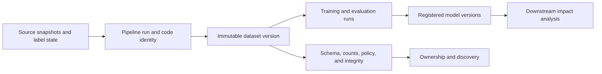

## A Dataset Version Is The Dataset's Release Label
<!-- section-summary: Dataset versioning gives one ML dataset output a stable identity, and lineage explains how that output was created and used. -->

The previous article showed how a repeatable pipeline gives a dataset build a recipe. That recipe is only half of the day-to-day production story. After the pipeline writes a dataset, the team needs a stable name for the exact output it produced. They also need a way to trace where that output came from and which models used it.

**Dataset versioning** is the practice of giving a dataset a durable identity. A version can be a DVC Git commit plus tracked data files, a lakeFS commit, a Delta Lake table version, an Apache Iceberg snapshot ID, a warehouse snapshot table, a manifest hash, or a catalog record. The exact tool can vary. The goal stays practical: when model `v12` says it trained on `inspection_defects:2026-06-30-r2`, the team can find the same rows, files, labels, and validation report later.

**Lineage** explains provenance and downstream use. Upstream lineage says which source systems, tables, object prefixes, jobs, code commits, and validation checks created the dataset. Downstream lineage says which training runs, model versions, batch scoring jobs, or reports consumed it. Versioning answers, "Which dataset?" Lineage answers, "Where did it come from, and where did it go?"

The framework has six parts. Version semantics define what changed and which identity is immutable. A snapshot or commit preserves retrievable content. A manifest records schema, counts, integrity, and policy. Upstream lineage connects sources and jobs. Downstream lineage connects training, models, reports, and releases. Retention, access, and rebuild policy keep the version usable over time.

Those parts organize the article. The factory inspection data, lakehouse snapshots, and object commits provide one concrete implementation.



Version identity anchors the graph. Upstream edges explain how the content was produced. Downstream edges show which runs and models depend on it. The manifest describes the version itself, while catalog records help people discover the owner and policy. This separation lets a team replace one storage tool without losing the lineage responsibilities.

## A Supporting Example: Factory Inspection Model
<!-- section-summary: A supporting example follows a factory inspection team that needs traceable image metadata and labels for defect detection. -->

Imagine **ForgeVision Components**, a company that manufactures small metal housings for industrial sensors. Each housing passes under a camera before packaging. A computer vision model flags cracks, burrs, missing screw holes, and coating defects. The quality team reviews flagged items, and the production line uses the result to decide whether to send a housing to rework.

The ML dataset has two parts. The images live in object storage because the files are large. The labels and metadata live in a lakehouse table because reviewers need to query defect type, camera station, part family, shift, plant, and review status. The training dataset is a point-in-time export of approved labels plus image URIs. The data team uses a table format such as Delta Lake or Apache Iceberg for metadata, and object storage versioning or lakeFS for image object changes.

Here is a small slice of the metadata table:

| Column | Example | Why it matters |
|---|---|---|
| `image_id` | `cam4-20260630-004912` | Stable image key |
| `image_uri` | `s3://forgevision-inspection/raw/plant-a/cam4/...jpg` | Location of the image file |
| `captured_at` | `2026-06-30T14:32:11Z` | Point-in-time cutoff and drift analysis |
| `plant_id` | `plant-a` | Segment metrics by facility |
| `part_family` | `housing-x7` | Segment metrics by product |
| `label_status` | `approved` | Exclude draft labels from training |
| `defect_type` | `burr` | Target label |
| `reviewed_at` | `2026-07-01T09:12:43Z` | Label maturity and audit trail |

This dataset changes for normal reasons. Reviewers correct labels. A camera station receives a new lens. A plant adds a new part family. A labeling vendor sends late reviews. A versioned dataset lets the team compare model candidates against a stable training and evaluation set even while production data keeps moving.

## Choose The Version Identity
<!-- section-summary: A practical version identity can come from DVC, lakeFS, table snapshots, object-store versions, or a catalog manifest. -->

The first design choice is the identity itself. A dataset version needs enough precision for retrieval. A human-friendly date alone can help people talk, but the system should also record an immutable pointer such as a commit, snapshot, manifest checksum, or table version.

ForgeVision chooses two identities. The metadata table uses Apache Iceberg snapshots in the lakehouse. Iceberg supports time travel by snapshot ID, timestamp, branch, or tag in Spark SQL, and its procedures can roll a table back to a snapshot when needed. The image object lake uses lakeFS, where a repository groups objects, branches point to commits, and a commit represents a reproducible point in time. lakeFS branch creation is zero-copy, so the team can create dataset preparation branches without duplicating every image file.

The dataset catalog record ties those tool-specific identities together:

```yaml
dataset_version:
  name: inspection_defect_examples
  version: "2026-06-30-r2"
  owner: quality-ml@forgevision.example
  task: multiclass_defect_detection
  metadata_table:
    format: iceberg
    table: lakehouse.quality.inspection_labels
    snapshot_id: 849302774128115002
  image_repository:
    system: lakefs
    repository: inspection-images
    commit: "8f12c0ecff4a0c7a2f4d"
  manifest_sha256: "f6c0af1dd1e5d9d78e8e3bdcc2a93c4b5b3b8a0a32a38ce6c2c4508c75d2a411"
```

This record gives people and systems one friendly version string, `2026-06-30-r2`, plus exact tool pointers. If ForgeVision used Delta Lake, the table identity might be `VERSION AS OF 91`. Delta Lake time travel depends on retained log and data files, so retention settings need to match the audit window. If ForgeVision used DVC, the version identity might be the Git commit that references the `.dvc` files and `dvc.lock` state. DVC's official versioning workflow links data and model contents to Git commits while the large files live in remote storage.

The beginner takeaway is straightforward: a version string that humans can read should point to an immutable technical identity that systems can retrieve.


*A good version label gives people a simple name while the manifest keeps exact technical pointers for retrieval and review.*

## Record Dataset Identity And Lineage
<!-- section-summary: A dataset manifest records content, source identities, schema, validation results, ownership, and intended use. -->

A **dataset manifest** is a structured receipt for one dataset version. It should travel with the dataset and appear in the catalog. The manifest is useful because it puts the most important facts in one place instead of spreading them across object storage, warehouse history, job logs, and chat threads.

ForgeVision writes this manifest after the pipeline exports training examples:

```yaml
dataset:
  name: inspection_defect_examples
  version: "2026-06-30-r2"
  description: "Approved camera inspection images and labels for housing defect detection."
  created_at_utc: "2026-07-02T04:18:51Z"
  created_by_run: build-inspection-dataset-2026-07-02-0410

inputs:
  label_table: lakehouse.quality.inspection_labels
  label_snapshot_id: 849302774128115002
  image_lakefs_commit: "8f12c0ecff4a0c7a2f4d"
  pipeline_commit: "761be72af33a"

contents:
  image_count: 2841290
  labeled_image_count: 2841290
  plant_count: 4
  part_families:
    - housing-x7
    - housing-k2
    - bracket-m4
  defect_classes:
    crack: 48211
    burr: 126044
    coating_defect: 69302
    missing_hole: 11382
    clean: 2586351

schema:
  primary_key: image_id
  required_columns:
    - image_id
    - image_uri
    - captured_at
    - plant_id
    - part_family
    - label_status
    - defect_type
    - reviewed_at

validation:
  status: passed
  report_uri: s3://forgevision-ml/reports/inspection/2026-06-30-r2/validation.json
  duplicate_image_ids: 0
  missing_image_files: 0
  draft_labels: 0
  max_review_lag_days: 2
```

The manifest also needs intended use. If a dataset is approved for training the defect classifier, that approval should say which task and which limitations apply. A dataset used for training may need a separate evaluation split held stable across several model candidates. A dataset used for audit may have stricter retention and access controls. Those facts belong near the version identity because they shape how the dataset should be consumed.

The catalog table can store one row per manifest:

```sql
create table if not exists ml_catalog.dataset_versions (
  dataset_name string,
  dataset_version string,
  created_at_utc timestamp,
  owner string,
  manifest_uri string,
  manifest_sha256 string,
  source_snapshot string,
  validation_status string,
  intended_use string
);

insert into ml_catalog.dataset_versions values (
  'inspection_defect_examples',
  '2026-06-30-r2',
  timestamp '2026-07-02 04:18:51',
  'quality-ml@forgevision.example',
  's3://forgevision-ml/manifests/inspection_defect_examples/2026-06-30-r2.yaml',
  'f6c0af1dd1e5d9d78e8e3bdcc2a93c4b5b3b8a0a32a38ce6c2c4508c75d2a411',
  'iceberg:849302774128115002;lakefs:8f12c0ecff4a0c7a2f4d',
  'passed',
  'training and validation for housing defect classifier'
);
```

This row gives model training, dashboards, and release review a stable lookup point.


*The manifest card keeps the facts reviewers need in one place: what the dataset contains, which schema it follows, who owns it, and whether validation passed.*

## Connect Versioning To Lineage
<!-- section-summary: Lineage links source data, pipeline jobs, validation reports, dataset versions, training runs, and model releases. -->

Versioning identifies the dataset. Lineage connects the dataset to the work around it. In production, lineage is useful during three common moments: model review, source-data incident response, and audit. The team needs to move both directions. From a model version, it should find the dataset. From a source table, it should find affected datasets and models.

OpenLineage is an open standard for lineage metadata. Its object model centers on jobs, runs, and datasets. A job is a defined process, a run is one execution of that job, and datasets are the inputs and outputs. Events can add facets for extra metadata such as source code location, schema, owners, or custom details.

ForgeVision can emit a lineage event when the dataset pipeline completes. The event below is shortened, but it shows the shape of the evidence:

```json
{
  "eventType": "COMPLETE",
  "eventTime": "2026-07-02T04:18:51Z",
  "producer": "https://git.forgevision.example/ml/dataset-pipelines",
  "run": {
    "runId": "018ffc61-5156-7a91-9b71-5d0973a8c724"
  },
  "job": {
    "namespace": "forgevision-airflow",
    "name": "quality.build_inspection_dataset"
  },
  "inputs": [
    {
      "namespace": "iceberg://lakehouse",
      "name": "quality.inspection_labels",
      "facets": {
        "version": {
          "snapshot_id": "849302774128115002"
        }
      }
    },
    {
      "namespace": "lakefs://inspection-images",
      "name": "main",
      "facets": {
        "version": {
          "commit": "8f12c0ecff4a0c7a2f4d"
        }
      }
    }
  ],
  "outputs": [
    {
      "namespace": "s3://forgevision-ml",
      "name": "datasets/inspection_defect_examples/2026-06-30-r2",
      "facets": {
        "schema": {
          "fields": [
            {"name": "image_id", "type": "string"},
            {"name": "image_uri", "type": "string"},
            {"name": "defect_type", "type": "string"}
          ]
        }
      }
    }
  ]
}
```

The lineage backend can now connect source snapshots to the dataset output. When training starts, the training job can emit another event that lists `inspection_defect_examples/2026-06-30-r2` as an input and the model artifact as an output. A graph appears over time: source tables to dataset pipeline, dataset pipeline to dataset version, dataset version to training run, training run to model version.

You can do a simpler version with a database table if OpenLineage feels heavy for a small team. The important part is that the relationship is captured at run time, while the job knows its actual inputs and outputs.

## Use Versions During Model Review
<!-- section-summary: Model review needs dataset identity, validation status, segment coverage, and links from the model candidate back to the data. -->

Dataset versions matter most when someone makes a decision. For ForgeVision, the review board checks a candidate called `housing-defect-detector:v12`. The model improves recall for burr defects, but it slightly lowers precision on coating defects. Reviewers need to know whether the comparison used the same evaluation data as the previous candidate, and whether the new training data added a plant or camera station that could explain the shift.

The review packet should include a dataset section:

```yaml
model_candidate: housing-defect-detector:v12
training_run: train-housing-detector-2026-07-03-0930
training_dataset:
  name: inspection_defect_examples
  version: "2026-06-30-r2"
  manifest: s3://forgevision-ml/manifests/inspection_defect_examples/2026-06-30-r2.yaml
  validation_status: passed
evaluation_dataset:
  name: inspection_defect_holdout
  version: "2026-q2-frozen-v3"
  validation_status: passed
data_changes_since_last_candidate:
  added_images: 182934
  added_part_family: bracket-m4
  label_policy_change: "none"
  camera_station_change: "plant-c cam2 lens replacement recorded on 2026-06-18"
```

This section stops the review from turning into guesswork. If recall improved because the training dataset added more burr examples from `bracket-m4`, the team can say that. If the evaluation set stayed frozen, the team can trust the comparison more. If a source table correction changed labels, the team can rerun the old model against the updated evaluation version and measure the real effect.

Versions also help with access and privacy review. Image datasets may include supplier-specific part numbers, worker-shift metadata, or plant details. The dataset manifest should point to the access policy and retention class so the model artifact has a clear data-governance trail beside it.

## Operate Versions Over Time
<!-- section-summary: Teams need retention, version naming, correction, deprecation, and rollback rules for dataset versions. -->

Versioning creates a small operating system around data. A team needs rules for naming, retention, corrections, deprecation, and rollback. Without rules, the catalog fills with unclear versions such as `final`, `final2`, and `really_final`.

ForgeVision uses a version naming policy:

| Version kind | Example | Use |
|---|---|---|
| Training release | `2026-06-30-r2` | Approved dataset for model training |
| Frozen holdout | `2026-q2-frozen-v3` | Stable evaluation set for candidate comparison |
| Incident rebuild | `2026-06-30-r2-corrected-labels` | Investigation dataset after a source correction |
| Development sample | `dev-2026-07-03-maya` | Short-lived exploration dataset |

Retention should match risk. A frozen holdout and any dataset used for a released model deserve longer retention. Development samples can expire quickly. Delta Lake and Iceberg both support table history concepts, but history depends on snapshot and file retention. Delta Lake's docs explain that time travel requires retaining both log and data files, and time travel to older versions can disappear after cleanup such as `VACUUM`. Iceberg snapshots also need lifecycle management because expired snapshots remove old table states. A version policy should coordinate storage cleanup with audit requirements.

Correction policy also matters. If reviewers correct 4,000 labels, the team should publish a new version and link it to the old one. They should avoid silently changing an existing version. A correction record can be simple:

```yaml
correction:
  previous_version: "2026-06-30-r2"
  new_version: "2026-06-30-r3"
  reason: "Label vendor corrected coating_defect labels for plant-b images captured 2026-06-11..2026-06-15."
  source_ticket: QLTY-4821
  expected_impact:
    affected_images: 4128
    affected_class: coating_defect
  required_actions:
    - rerun validation
    - replay v11 and v12 evaluation on frozen holdout
    - update model review notes
```

Rollback is a separate operation. If a bad data publish makes the latest training version unusable, the team can mark the version as rejected and point training back to the last approved version. If the underlying table needs rollback, the team uses the storage system's procedure, such as Iceberg rollback to a snapshot or Delta restore/time-travel workflows where supported. The dataset catalog should record that operational action because it explains why later builds used an older source state.

## Putting It Together
<!-- section-summary: Dataset versioning and lineage turn data outputs into traceable evidence for model review, debugging, and audit. -->

Dataset versioning gives an ML dataset a stable identity. Lineage connects that identity to sources, pipeline runs, validation checks, training runs, and model releases. Together they let a team answer practical questions: which dataset trained this model, which source snapshots created it, which validation report approved it, and which models may be affected by a source-data correction?

ForgeVision uses lakehouse table snapshots, lakeFS commits, dataset manifests, catalog rows, and lineage events to make those answers available. A smaller team can start with DVC commits and manifest files. A larger team can connect OpenLineage, a catalog, and managed lakehouse history. The important habit is the same: every important dataset output receives an identity that can be found again.


*The lineage graph shows the evidence chain reviewers need when they move from a model release back to the data and jobs that created it.*

## What's Next
<!-- section-summary: The next article uses these version and lineage records to rebuild old datasets during audits, incidents, and fair model comparisons. -->

The next article takes the versioning idea one step further. Once a model has shipped, the team may need to rebuild the exact dataset behind an older release or build a corrected version for an incident. That requires version records, source retention, pipeline code, and a careful choice between snapshots and recompute.

## References

- [DVC documentation: Versioning Data and Models](https://doc.dvc.org/example-scenarios/versioning-data-and-models)
- [lakeFS documentation: Concepts and Model](https://docs.lakefs.io/understand/model/)
- [Delta Lake documentation: Table batch reads and writes](https://docs.delta.io/delta-batch/)
- [Apache Iceberg documentation: Spark time travel queries](https://iceberg.apache.org/docs/latest/spark-queries/)
- [Apache Iceberg documentation: Spark snapshot rollback procedures](https://iceberg.apache.org/docs/nightly/spark-procedures/)
- [OpenLineage documentation: Object Model](https://openlineage.io/docs/spec/object-model/)
