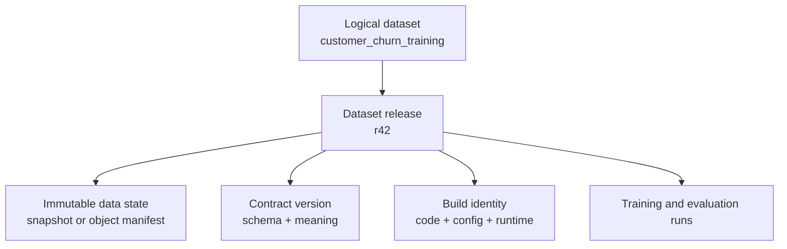
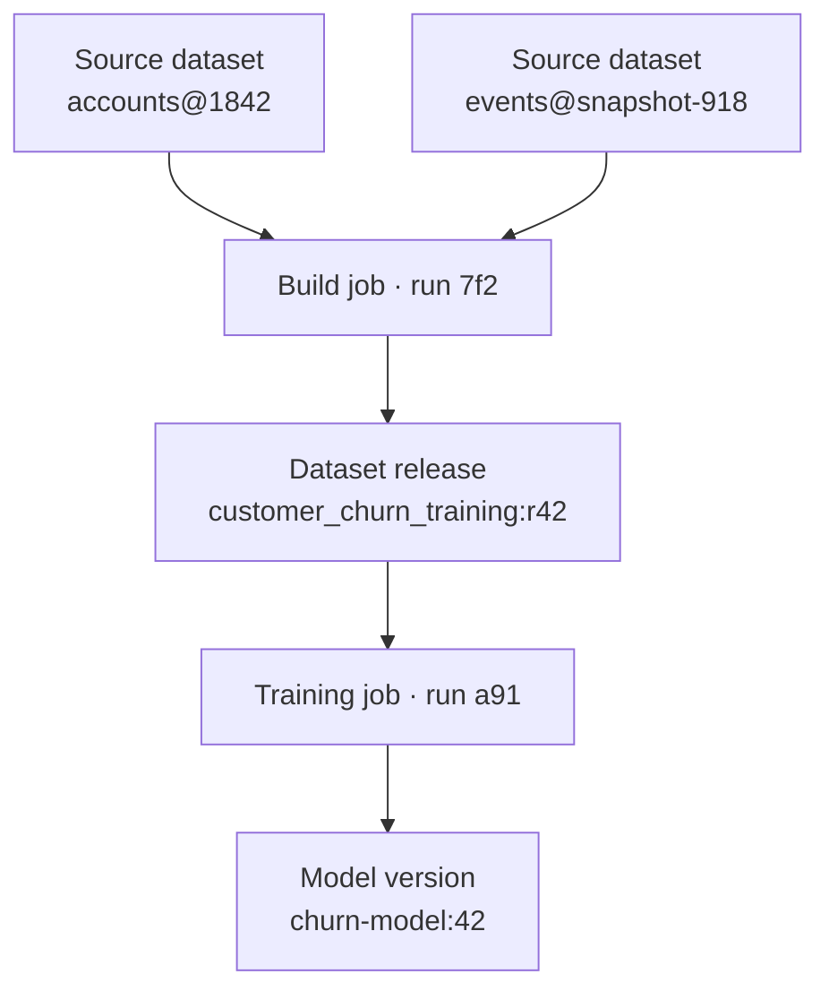
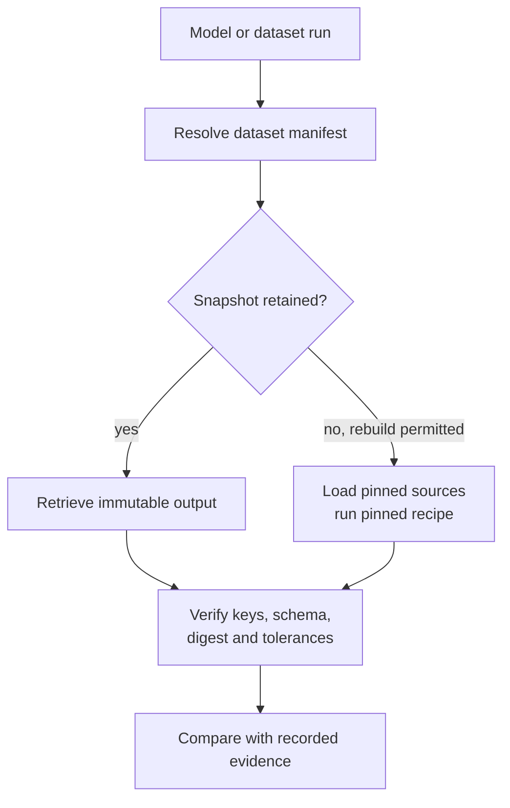

## Table of Contents

1. [A Dataset Name Cannot Tell You Which Data Was Used](#a-dataset-name-cannot-tell-you-which-data-was-used)
2. [Record Enough Detail To Identify One Exact Dataset](#record-enough-detail-to-identify-one-exact-dataset)
3. [Keep The Exact Rows And Files Used For Training](#keep-the-exact-rows-and-files-used-for-training)
4. [Record The Code And Parameters That Produced The Dataset](#record-the-code-and-parameters-that-produced-the-dataset)
5. [Record What Each Column Means And Which Changes Are Allowed](#record-what-each-column-means-and-which-changes-are-allowed)
6. [Record How Data Moved From Sources To The Dataset](#record-how-data-moved-from-sources-to-the-dataset)
7. [Connect Each Dataset Version To The Training Job That Used It](#connect-each-dataset-version-to-the-training-job-that-used-it)
8. [Know The Difference Between Rebuilding Data And Explaining Its History](#know-the-difference-between-rebuilding-data-and-explaining-its-history)
9. [Keep Historical Data Long Enough And Restrict Who Can Read It](#keep-historical-data-long-enough-and-restrict-who-can-read-it)
10. [Prove That A Rebuilt Dataset Matches The Original](#prove-that-a-rebuilt-dataset-matches-the-original)
11. [Avoid The Common Versioning Traps](#avoid-the-common-versioning-traps)
12. [What To Record For Every Dataset Version](#what-to-record-for-every-dataset-version)
13. [References](#references)

## A Dataset Name Cannot Tell You Which Data Was Used
<!-- section-summary: A table or storage path can keep the same name while its rows change, so a training run needs an immutable data identity. -->

A data scientist trains a model from `analytics.customer_features`. The run looks promising, and the team records the table name beside the metrics. Several weeks later, another engineer loads the same table to investigate the result. New customers have arrived, corrected labels have replaced old labels, and one transformation now fills missing income values differently. The table name stayed the same while the dataset changed underneath it.

This is the ordinary problem that dataset versioning solves. A logical name such as `customer_features` tells people which kind of data they are discussing. It cannot identify the exact rows and files seen by one model run.

**Dataset versioning** gives one published data state a durable identity. That identity should lead to the same stored snapshot or to enough pinned evidence for a controlled rebuild. **Lineage** records how that version was produced and where it was used. It connects sources, transformation runs, dataset outputs, training runs, and model versions.

The distinction matters during every serious comparison. If model `v42` outperforms `v41`, the team first checks whether both candidates used the same evaluation data. If a source correction affects one feature, lineage locates the dataset and model versions that consumed it. If an auditor asks how a released model was trained, the dataset record provides evidence that survives beyond the current table contents.

Production dataset identity therefore covers more than storage history. It connects the data state, transformation, contract, run evidence, retention policy, and downstream use. Tools implement pieces of that framework; the framework explains how those pieces fit together.

## Record Enough Detail To Identify One Exact Dataset
<!-- section-summary: A dependable dataset identity combines a logical name, an immutable storage reference, a contract version, and a manifest that connects them. -->

People need a short name they can discuss. Systems need exact references they can resolve. A production dataset version supplies both.

The **logical name** describes the dataset's purpose, such as `customer_churn_training`. The **immutable state** identifies the exact table snapshot or exact collection of objects. The **contract version** identifies the schema and business meaning expected by consumers. A **manifest** gathers those references into one signed or checksummed record.

You can think of the manifest as a release record for data. It states which data state was approved, which recipe created it, and which rules describe its use. A friendly release label such as `r42` points to the manifest; the manifest carries the technical identities.


```mermaid

flowchart TB
    Name["Logical dataset<br/>customer_churn_training"] --> Release["Dataset release<br/>r42"]
    Release --> State["Immutable data state<br/>snapshot or object manifest"] & Contract["Contract version<br/>schema + meaning"]
    Release --> Build["Build identity<br/>code + config + runtime"] & Use["Training and evaluation runs"]

    class Name,Release identity
    class State,Contract,Build,Use evidence
```

Each layer answers a different question. The logical name answers “What kind of dataset is this?” The release answers “Which approved publication?” The immutable state answers “Which bytes or table snapshot?” The contract answers “What do these fields mean?” The build identity answers “Which transformation produced them?” Downstream links answer “Which runs relied on this evidence?”

A digest adds an integrity check. A **digest** is a fingerprint calculated from content or metadata. The digest of a canonical manifest can prove that the manifest stayed unchanged. A full content digest can prove that the dataset bytes stayed unchanged. Those are different promises, so the record should state what was hashed and which algorithm was used.

## Keep The Exact Rows And Files Used For Training
<!-- section-summary: Table snapshots, object manifests, and warehouse materializations preserve data in different ways and require explicit retention. -->

The first job is to keep the exact data state used for training. The method depends on where the data lives. Lakehouse tables already maintain snapshots. Object storage needs an explicit file list or version IDs. Warehouses can publish a physical table or a read-only snapshot under a release-specific name.

### Use Table Versions For Lakehouse Data

Delta Lake commits every successful table change as a numbered table version. A training query can pin that version:

```sql
SELECT * FROM delta.`s3://ml-data/customer_features` VERSION AS OF 1842;
```

Apache Iceberg also records table snapshots. Spark can select an exact snapshot ID:

```python
training_df = (spark.read.format("iceberg")
    .option("snapshot-id", "918273645012")
    .load("prod.ml.customer_features"))
```

Both formats give readers a consistent table state. A timestamp-based query can be convenient for exploration, while the resolved version or snapshot ID is the stronger run record. It remains unambiguous even if clocks, commit timing, or later maintenance complicate the original timestamp.

A table snapshot covers one table. A dataset assembled from three tables needs three pinned source identities, plus the transformation that joined them. The final published dataset may also receive its own snapshot. This is why a manifest remains useful in a lakehouse: it groups several storage-level identities into one ML release.

### List Every File In Object-Storage Datasets

A prefix such as `s3://ml-data/images/train/` is a moving location. New files can arrive and old files can be replaced without changing the prefix. An object manifest records every member of the dataset.

```yaml
objects:
  - key: images/part-00001.parquet
    version_id: 3Lg...K9
    size_bytes: 18423911
    checksum:
      algorithm: SHA256
      value: 5f70bf18a086...
```

The object key locates the file. A storage version ID selects one generation if bucket versioning is enabled. The size and checksum verify the expected content. The canonical manifest can then receive its own SHA-256 digest.

Amazon S3 ETags require care. Only specific single-part uploads under supported encryption produce MD5 ETags. Multipart uploads and several other encryption modes produce different values. S3 supports stored checksums such as SHA-256 and CRC algorithms, so an integrity policy should use a documented checksum field.

### Copy Warehouse Data Into A Fixed Snapshot

A warehouse transformation often writes a release-specific table such as `ml_snapshots.customer_features_r42`. The table name is immutable by policy, and permissions block updates after publication. Some warehouses also provide native read-only snapshots. BigQuery, for example, supports:

```sql
CREATE SNAPSHOT TABLE `ml_snapshots.customer_features_r42`
CLONE `analytics.customer_features`;
```

The snapshot preserves the base table contents at creation time and remains queryable like a table. Its expiration and access policy still need explicit configuration. Native time-travel windows are operational recovery features; long-lived ML evidence usually needs a retained snapshot or materialized release.

Across all three patterns, storage supplies a retrievable state. Feature definitions, filtering logic, label cutoffs, and transformation code belong to the build identity described next.

## Record The Code And Parameters That Produced The Dataset
<!-- section-summary: A dataset release must pin source states, transformation code, parameters, runtime, and the run that published the output. -->

Two pipelines can read the same source snapshot and produce different training rows. One may exclude refunded orders, another may keep them. One may join the latest account state, another may use a point-in-time join. Storage identity alone cannot explain that difference.

The **build identity** records the recipe and the execution. The recipe includes reviewed code, SQL, configuration, dependency locks, and a container or managed-runtime version. The execution includes a run ID, actual source snapshots, resolved parameters, validation results, and the published output.

```yaml
dataset_release:
  name: customer_churn_training
  release: r42
  manifest_digest: sha256:2c26b46b68ff...

sources:
  accounts: {format: delta, table: prod.crm.accounts, version: 1842}
  events: {format: iceberg, table: prod.product.customer_events, snapshot_id: 918273645012}

build:
  run_id: build-customer-churn-r42
  git_commit: 7d83a14
  config_digest: sha256:ad7f6b12...
  image: ghcr.io/example/ml-data@sha256:91bc...
  contract: customer_churn_training.v4

output:
  table: prod.ml.customer_churn_training
  delta_version: 227
  validation_report: reports/customer-churn-r42.json
```

The Git commit identifies transformation code. The config digest protects parameters that may live outside the code. The image digest pins the runtime more precisely than a mutable tag such as `latest`. The source references state what the run actually read, which may differ from the defaults written in config. The output version states what the run actually published.

This separation also handles reruns. The same recipe can execute twice because an earlier run failed after writing temporary files. Each execution receives its own run ID. If both runs publish identical canonical manifests, the release process can recognize the same result. If their manifests differ, the evidence reveals a source, parameter, runtime, or nondeterminism change.

**Nondeterminism** means the same declared inputs can produce small or large differences across executions. Distributed row ordering, random sampling without a fixed seed, unstable tie-breaking, and floating-point reductions are common causes. A production build should remove avoidable nondeterminism and define tolerances for the remaining differences.

## Record What Each Column Means And Which Changes Are Allowed
<!-- section-summary: A physical schema describes fields and types, while a versioned data contract also defines meaning, timing, quality, and compatibility. -->

A snapshot can preserve every row and still leave a future reader confused. A field named `account_age` might mean days since signup in one release and months since first purchase in another. Both values may use the same integer type. The physical schema stayed compatible while the feature meaning changed.

A **schema** describes structure: field names, data types, nullability, and nested shape. A **data contract** adds the meaning required by consumers. For ML data, that often includes entity keys, event-time meaning, label definition, cutoff rules, units, allowed values, null policy, and quality thresholds.

```yaml
contract: customer_churn_training.v4
entity_key: customer_id
prediction_time: scoring_cutoff_ts
label:
  field: churned_within_window
  definition: no qualifying activity during the reviewed outcome window
fields:
  account_age_days:
    type: integer
    unit: days
    rule: scoring_cutoff_ts - signup_ts
  support_contacts_30d:
    type: integer
    rule: contacts created before scoring_cutoff_ts
quality:
  unique_entity_time_key: true
  maximum_missing_region_rate: 0.005
```

The contract version changes if a consumer must reinterpret or modify its use of the data. Adding an optional descriptive field may remain compatible. Changing a unit, label window, entity key, or time cutoff is a breaking change even if the storage engine accepts the write.

Table formats help enforce structural evolution. Iceberg tracks fields with persistent IDs, which protects values across safe renames and reordering. Delta Lake enforces compatible writes and supports explicit schema evolution. Those mechanisms guard table structure. The contract still owns semantic compatibility because a storage engine cannot infer whether a renamed label or new business rule changes the model task.

Contract history should link each release to the exact version it passed. If `r42` used contract `v4`, a later edit to the contract document must create `v5`. Rewriting `v4` in place would make old approvals ambiguous.

## Record How Data Moved From Sources To The Dataset
<!-- section-summary: Runtime lineage connects datasets through the jobs and executions that actually read and wrote them. -->

After the data state is fixed, the team still needs to know how source data moved through transformations into that state. This recorded path is **lineage**. Useful lineage comes from actual pipeline executions and also identifies the jobs and models that later consumed the dataset.

OpenLineage provides a provider-neutral model for that graph. A **Dataset** represents a collection of data. A **Job** represents a defined transformation, such as `build_customer_churn_training`. A **Run** represents one execution of that job. Runtime events list the input and output datasets observed during the run, and facets attach details such as schema or source-code location.


```mermaid

flowchart TB
    SourceA["Source dataset<br/>accounts@1842"] & SourceB["Source dataset<br/>events@snapshot-918"] --> Build["Build job · run 7f2"]
    Build --> Release["Dataset release<br/>customer_churn_training:r42"] --> Train["Training job · run a91"] --> Model["Model version<br/>churn-model:42"]

    class SourceA,SourceB,Release,Model data
    class Build,Train run
```

The run is the important bridge. A design document may say that a job reads two tables. Runtime lineage records which executions completed and which dataset identities they reported. The publisher should emit a successful output edge only after validation and atomic publication have succeeded.

Unity Catalog automatically captures lineage for many operations executed on Databricks and connects tables, views, file paths, jobs, notebooks, dashboards, and ML model versions. Its visibility follows permissions, so one user may see a masked node where another sees full details. Unity Catalog also supports external lineage for work outside Databricks. OpenLineage serves a similar responsibility across heterogeneous engines through emitted events and integrations.

A catalog makes lineage discoverable and applies governance. Data preservation remains the responsibility of table snapshots, object versions, and retained evidence. Runtime capture may also have gaps for unsupported operations or external tools. The manifest remains the durable release record, while the lineage backend supplies navigation and impact analysis.

## Connect Each Dataset Version To The Training Job That Used It
<!-- section-summary: Experiment tracking should log the dataset identity as a first-class model input with its source, digest, schema, and usage context. -->

The training run closes the evidence chain. Its input should point to the dataset release, storage source, digest, schema, and usage context. MLflow supports first-class dataset inputs for training, validation, and evaluation.

The training job has already loaded Delta version `227` into `training_df`. `mlflow.data.from_spark` records that path and version beside the DataFrame metadata, and `mlflow.log_input` attaches the resulting dataset record to the active run:

```python
import mlflow
import mlflow.data

training_data = mlflow.data.from_spark(training_df,
    path="s3://ml-data/customer_churn_training",
    version="227",
    name="customer_churn_training_r42")

with mlflow.start_run():
    mlflow.log_input(training_data, context="training")
    mlflow.set_tag("dataset_manifest", "manifests/customer-churn/r42.yaml")
```

MLflow records a dataset name, source, digest, and any available schema or profile. The run UI can then group model results by dataset input. Separate `context` values distinguish training data from validation or test data.

The responsibility boundary matters here. MLflow tracks the dataset reference used by the experiment. Its own API notes that a source may fail to reproduce data transformed before logging. The MLflow digest is also dataset-type specific. A durable release should therefore point MLflow at a pinned source and store the canonical manifest beside the run. MLflow links training evidence; the table format or object manifest preserves content.

In a managed platform, the registry and catalog may add automatic connections from runs to models and data. Keep the same release identifier across those systems. A model review should move from model version to MLflow run, then to dataset release, contract, build run, and source snapshots without relying on a human-written note.

## Know The Difference Between Rebuilding Data And Explaining Its History
<!-- section-summary: Reproducibility concerns retrieving or rebuilding the data, while auditability concerns explaining the decisions and actors around it. -->

Teams often use “reproducible” and “auditable” as if they promise the same result. One concerns reconstructing the data; the other concerns explaining the decisions and people around it.

**Reproducibility** asks whether the team can retrieve the same dataset or rebuild an equivalent one from pinned inputs and code. Exact retrieval is the strongest form: the snapshot still exists and its digest matches. A deterministic rebuild is useful if the original output expired but all source states and runtime dependencies remain available. An equivalent rebuild uses agreed tolerances because some distributed calculations cannot guarantee identical bytes.

The team should define which level it promises. A compliance-critical holdout set may require exact retrieval. A large derived feature table may permit a rebuild with identical entity keys and labels plus numeric tolerances for aggregates. The manifest records the verification rules.

**Auditability** asks who created and approved the release, which intended use applied, which checks ran, which access policy governed it, and which models consumed it. An audit record can survive after privacy or retention policy requires deletion of the underlying rows. It can explain that deletion and identify the approval evidence that remains.

A retained snapshot with no owner or intended-use record offers reproducible bytes and weak accountability. A complete approval record can remain auditable after the data expires, although exact reproduction has ended. The dataset policy should state both promises clearly.

This distinction also prevents false confidence from lineage graphs. A graph may prove that job `A` wrote dataset `B`. Reproduction still depends on retained source states, code, configuration, runtime, and deterministic behavior. Auditability still depends on human decisions and access history.

## Keep Historical Data Long Enough And Restrict Who Can Read It
<!-- section-summary: A version remains reproducible only while its snapshots, files, metadata, and permissions survive for the required period. -->

Every versioning system eventually cleans up history. A manifest can live much longer than the snapshots and files it names, so the retention policy determines how long the technical identity remains usable.

Delta Lake time travel relies on retained transaction-log entries and data files. `VACUUM` removes old files outside the configured retention window, and older table versions lose retrievability after the required files disappear. Apache Iceberg keeps old snapshots until snapshot-expiration procedures remove them and their unreferenced files. Iceberg tags can retain selected snapshots under a separate lifecycle. BigQuery table snapshots can carry an expiration time. Object-store lifecycle policies can delete old object versions even though a manifest still lists their version IDs.

The team should set the retention window from the product promise. If a released model must remain reproducible for its service life plus an investigation period, every dataset dependency needs compatible retention. Keeping the manifest for three years while source snapshots expire after one month creates a durable explanation and a short-lived rebuild path.

Retention also includes code repositories, package locks, container images, validation reports, and contract history. Deleting any one of these may weaken a future rebuild. The release policy should treat them as one evidence bundle.

Access policy is equally important. A dataset snapshot can preserve personal, confidential, or licensed data. The dataset release should inherit suitable classification, encryption, and least-privilege controls. Catalog visibility and physical read access are separate concerns. Physical rows remain protected by their own read permissions.

Privacy deletion, contractual limits, or regulation may require the organization to remove data before the desired reproduction window ends. The approved policy should describe that tradeoff in advance. The team can retain permitted metadata, aggregate validation evidence, and deletion records while acknowledging that exact reconstruction is no longer available.

## Prove That A Rebuilt Dataset Matches The Original
<!-- section-summary: Run comparison starts from manifests, isolates the changed identities, and validates any retrieved or rebuilt dataset against the recorded release. -->

A rebuild should first prove that it recovered the same dataset state, code, parameters, and schema as the original run. Only then can a model comparison isolate model code, parameters, or runtime as the likely source of a metric difference. Different dataset identities introduce a data change that reviewers must examine.

A useful comparison reads both manifests and reports changes across five areas: storage states, contract versions, source snapshots, build identity, and output validation. The result can stay compact:

```yaml
comparison:
  run_a: model-run-a91
  run_b: model-run-b07
  training_dataset: {release_a: r41, release_b: r42}
  changed_evidence:
    source_snapshot: events 917 -> 918
    contract: unchanged
    build_commit: unchanged
    added_rows: 18420
    changed_segment: newly_launched_region
  evaluation_dataset: identical
```

This record tells reviewers that the evaluation basis stayed fixed while training data gained examples from one segment. They can inspect segment metrics instead of attributing the entire change to the model algorithm.

Rebuilding follows the same identities in reverse:


```mermaid

flowchart TB
    Run["Model or dataset run"] --> Manifest["Resolve dataset manifest"] --> Content{"Snapshot retained?"}
    Content -->|"yes"| Retrieve["Retrieve immutable output"] --> Verify["Verify keys, schema,<br/>digest and tolerances"]
    Content -->|"no, rebuild permitted"| Rebuild["Load pinned sources<br/>run pinned recipe"] --> Verify
    Verify --> Compare["Compare with recorded evidence"]

    class Run,Manifest,Retrieve,Rebuild,Verify,Compare step
    class Content choice
```

Retrieval verifies the manifest and content digests. A rebuild checks out the pinned code, loads the recorded source states, applies the contract and configuration, and writes a new investigation output. Verification compares entity keys, label windows, schema, row counts, segment counts, and approved numeric tolerances.

The rebuilt output receives a new run identity. It should never overwrite the historical release record. A successful match confirms the original evidence; a mismatch starts an investigation into missing inputs, nondeterminism, retention loss, or an incomplete manifest.

## Avoid The Common Versioning Traps
<!-- section-summary: Weak implementations confuse locations, timestamps, hashes, catalogs, and lineage records with complete dataset identity. -->

The most common trap is recording a mutable table name or storage prefix. It locates current data and says nothing about the state consumed by an older run. Pin the table snapshot or every object generation.

A timestamp alone is also fragile. Time travel can resolve a table state from a timestamp, but maintenance and retention determine whether that state remains available. Record the resolved version or snapshot ID after the read.

A checksum can create false confidence if its scope is unclear. A manifest digest protects the manifest. It proves full dataset content only if the manifest itself includes verified content identities for every member. S3 ETags have upload- and encryption-dependent semantics, so use documented object checksums for byte integrity.

Catalogs and lineage backends solve discovery and impact analysis. Data files, code, and validation reports require separate retention. Runtime capture can also miss unsupported operations. Critical releases need an explicit manifest even in a platform with automatic lineage.

Schema compatibility is another incomplete signal. A unit change from dollars to cents can preserve the numeric type and still break every model feature. Version semantic contracts alongside physical schemas.

Finally, retention must cover the whole evidence chain. A retained output with expired source snapshots supports retrieval and blocks full rebuild. Retained source snapshots with a deleted container image may reproduce different results. Review the bundle as one policy.

## What To Record For Every Dataset Version
<!-- section-summary: A complete dataset release connects its purpose, exact data state, contract, build run, lineage, consumers, retention, and access policy. -->

Every published dataset version needs enough detail to recover and explain it. Its logical name tells people what it represents. Its snapshot or object manifest pins the data state. Its contract defines structure and meaning. Its build record pins code, configuration, runtime, and actual source states. Runtime lineage connects the release to the jobs that created and consumed it. MLflow attaches that identity to model training and evaluation.

Retention determines how long the team can retrieve or rebuild the release. Access policy controls who can inspect its contents. Audit records preserve the people, purpose, checks, and approvals around it.

With those parts connected, a model metric has a defensible data story. The team can compare runs on equal terms, find downstream impact after a source correction, retrieve a historical snapshot, or rebuild from pinned evidence under a declared tolerance. The dataset name then serves as a stable part of the model release record.

## References

- [Delta Lake: Table batch reads and writes](https://docs.delta.io/delta-batch/) - Documents table versions, time travel, schema enforcement, and operation-scoped schema evolution.
- [Delta Lake: Table utility commands](https://docs.delta.io/delta-utility/) - Documents `VACUUM`, retention behavior, and the loss of older time-travel states after file cleanup.
- [Apache Iceberg: Spark queries](https://iceberg.apache.org/docs/latest/spark-queries/) - Documents snapshot IDs, time-travel reads, and metadata tables.
- [Apache Iceberg: Branching and tagging](https://iceberg.apache.org/docs/latest/branching/) - Explains snapshot references and independent retention policies.
- [Apache Iceberg: Evolution](https://iceberg.apache.org/docs/latest/evolution/) - Documents schema evolution and persistent field identity.
- [Amazon S3: Checking object integrity for uploads](https://docs.aws.amazon.com/AmazonS3/latest/userguide/checking-object-integrity-upload.html) - Documents stored checksums and the limits of interpreting ETags as content hashes.
- [BigQuery: Introduction to table snapshots](https://docs.cloud.google.com/bigquery/docs/table-snapshots-intro) - Explains read-only table snapshots, expiration, access, and time-travel boundaries.
- [MLflow: ML Dataset Tracking](https://mlflow.org/docs/latest/dataset/) - Documents dataset names, sources, digests, schemas, profiles, contexts, and `mlflow.log_input`.
- [MLflow REST API](https://mlflow.org/docs/latest/api_reference/rest-api.html) - States the boundary between a logged dataset source and exact reproduction of transformed data.
- [OpenLineage: Object Model](https://openlineage.io/docs/spec/object-model) - Defines datasets, jobs, runs, runtime events, and lineage facets.
- [Databricks: Lineage in Unity Catalog](https://docs.databricks.com/aws/en/data-governance/unity-catalog/data-lineage) - Documents automatically captured lineage, governed visibility, supported asset types, and retention considerations.
