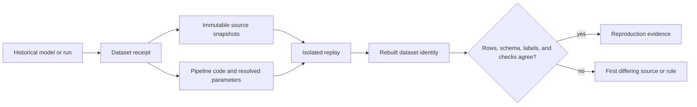

## Why Rebuilds Exist
<!-- section-summary: Rebuilding a past dataset gives a team the exact evidence needed to debug an older model, compare a fix, or answer an audit question. -->

Rebuilding a past dataset means recreating the training data for an older model version from recorded evidence. The rebuild should produce the same rows, labels, feature values, time boundaries, and validation result that the old training run used. When the team fixes a bug, the same rebuild process can also produce a corrected dataset for comparison.

Picture a company called RouteLoop Logistics. RouteLoop predicts delivery ETA for grocery orders. The model sees order events, driver GPS pings, store pickup times, weather, and the final delivery timestamp. A release called `eta-v42` shipped on July 1, 2026. Two weeks later, support tickets spike because the model underestimates delivery time during heavy rain in Manchester.

The incident starts with a simple question: what data trained `eta-v42`? The answer cannot rely on a Slack message or a notebook name. The team needs the source table snapshots, the pipeline commit, the label delay rule, the feature definitions, the validation report, and the output dataset identity. Without those pieces, the team can still investigate, yet it cannot prove whether the old model learned from broken weather data or whether the live service drifted after release.

A supporting example follows that incident from evidence to replay. The main idea is plain: **a dataset rebuild is a production operation, so every training dataset needs a receipt**. The receipt records which source data existed, which code transformed it, which time window it covered, which checks passed, and where the output landed.



The receipt provides the connection between the historical decision and the replay inputs. The comparison checks the dataset itself and its validation evidence. A mismatch stays useful because it points investigators toward the first source snapshot, transformation, or policy that differs.

## Connect Evidence To The Decision
<!-- section-summary: A rebuild evidence packet connects the model version to source versions, code, parameters, validation, ownership, and approved replay commands. -->

The first piece is the **evidence packet**. An evidence packet is a small metadata record created during the original dataset build. It travels with the training run and later gives incident responders a starting point. The packet can live in a model registry, experiment tracker, data catalog, or a version-controlled artifact folder. The storage location matters less than the habit: the packet must be created while the run is fresh.

For RouteLoop, the packet records a dataset called `eta_training_examples_2026_06`. The dataset trains on orders created in June 2026 and waits seven days for delivery labels to settle. It uses raw object data versioned in lakeFS, curated tables stored as Delta or Iceberg tables, and a DVC pipeline that turns training code plus parameters into a repeatable output.

```yaml
dataset_rebuild_packet:
  dataset_id: eta_training_examples_2026_06
  model_release: eta-v42
  owner: ml-platform-eta
  incident_channel: eta-oncall
  training_window:
    start: "2026-06-01T00:00:00Z"
    end: "2026-07-01T00:00:00Z"
  label_ready_at: "2026-07-08T00:00:00Z"
  source_versions:
    raw_lakefs_commit: "lakefs://routeloop-ml/9d4b1c6"
    delta_orders_version: 1842
    iceberg_gps_snapshot_id: 719433852901020312
    weather_export_tag: "weather-hourly-2026-07-08"
  pipeline:
    git_commit: "6f2a9d3c"
    dvc_lock_hash: "sha256:6a74f6d9"
    container_image: "ghcr.io/routeloop/eta-features@sha256:91bc..."
    params_file: "params/eta_june_2026.yaml"
  output:
    storage_uri: "s3://routeloop-ml-datasets/eta/2026-06/release/"
    row_count: 18439221
    schema_version: "eta_training_examples.v5"
    validation_report: "s3://routeloop-ml-reports/eta-v42/data-validation.json"
```

Every field has a job. The time window says which orders belong in the training set. `label_ready_at` says when the labels had enough time to arrive. The source versions point to immutable or versioned data states. The pipeline section pins code, parameters, dependencies, and runtime. The output section gives reviewers the expected row count and validation report.

This packet also protects the team from a common rebuild trap. The model version alone is too vague. A model file can tell you which weights were deployed, yet the data story sits outside the model file. The packet connects the model to the rows that shaped it.


*The rebuild timeline shows why the packet matters: it turns an old model release into concrete source versions, code, and a dataset output.*

## Schemas That Support Rebuilds
<!-- section-summary: Rebuildable datasets need schemas with event time, ingestion time, entity keys, label time, source identity, and stable data types. -->

Before the team can replay anything, the source tables need schemas that support time-aware reconstruction. A schema is the contract for the rows. It names the fields, their types, and the time semantics. For ML rebuilds, the most important fields usually answer five questions: which entity is this row about, when did the event happen, when did the system receive it, when did the label mature, and which upstream version produced it?

RouteLoop uses an order-level training example, so `order_id` is the row identity. The model predicts ETA at dispatch time, so `dispatch_ts` is the cutoff time. Features may use events before that cutoff. Labels arrive after delivery, so `delivered_ts` and `label_ready_ts` stay separate from feature time.

| Table | Field | Type | Why it matters |
|---|---|---|---|
| `curated.delivery_orders` | `order_id` | `STRING` | Stable row identity for the training example |
| `curated.delivery_orders` | `customer_zone_id` | `STRING` | Join key for regional traffic and weather features |
| `curated.delivery_orders` | `store_id` | `STRING` | Store-level pickup history |
| `curated.delivery_orders` | `created_ts` | `TIMESTAMP` | Product event time |
| `curated.delivery_orders` | `dispatch_ts` | `TIMESTAMP` | Prediction cutoff time |
| `curated.delivery_orders` | `delivered_ts` | `TIMESTAMP` | Label source for actual delivery duration |
| `curated.delivery_orders` | `label_ready_ts` | `TIMESTAMP` | Time when the label is safe to train on |
| `curated.delivery_orders` | `source_commit` | `STRING` | Raw data version that produced the row |

The feature table also needs time fields. RouteLoop stores hourly weather and traffic aggregates. Each row says which zone it describes, when the aggregate window ended, and when the row landed. The model can use a weather row only when `feature_ts <= dispatch_ts` and the row was available by the training cutoff.

```sql
CREATE TABLE ml_features.zone_weather_hourly (
  zone_id STRING,
  feature_ts TIMESTAMP,
  ingestion_ts TIMESTAMP,
  rain_mm_1h DOUBLE,
  wind_speed_kph DOUBLE,
  road_closure_count INT,
  source_provider STRING,
  source_commit STRING
)
USING delta
PARTITIONED BY (DATE(feature_ts));
```

The table design gives rebuilds a fighting chance. `feature_ts` supports point-in-time joins. `ingestion_ts` helps the team see late data. `source_commit` connects the curated row back to raw files. Partitioning by feature date keeps incident queries practical when the team only needs one month.

## Version The Sources
<!-- section-summary: Source versioning lets a rebuild query the same raw objects or table snapshots that existed during the original dataset build. -->

The next piece is source versioning. Source versioning means the team can ask for data as it existed at a specific commit, tag, table version, or snapshot ID. For ML teams, this usually spans several layers. Raw object data may use lakeFS. Project datasets and pipeline outputs may use DVC. Lakehouse tables may use Delta Lake or Apache Iceberg. The exact stack varies, yet the rule stays steady: **the rebuild packet needs a stable reference for each source**.

lakeFS gives data lakes Git-like operations such as branches, commits, tags, merges, and reverts. Its docs describe branches as zero-copy pointers to commits plus uncommitted changes, which is useful when a data engineering team wants isolated repair work without duplicating the whole lake. RouteLoop uses lakeFS for raw order, GPS, and weather files that land in object storage.

```bash
lakectl branch create lakefs://routeloop-ml/rebuild-eta-v42 \
  --source lakefs://routeloop-ml/9d4b1c6

lakectl commit lakefs://routeloop-ml/rebuild-eta-v42 \
  -m "Pin raw sources for eta-v42 rebuild investigation"
```

The branch gives the incident team a place to inspect and repair raw data without changing the main data branch. The commit records the investigation state. In a regulated or high-risk model, the team may also create a tag such as `eta-v42-original-sources` so the rebuild packet has a human-readable name.

Delta Lake and Apache Iceberg solve a related problem at the table layer. Delta Lake time travel lets a team query an older table snapshot, and Delta `RESTORE` can move a table back to an older version when the files still exist. Apache Iceberg supports time-travel queries with `TIMESTAMP AS OF` or `VERSION AS OF`, and its Spark procedures include rollback by snapshot ID or timestamp.

```sql
SELECT
  order_id,
  dispatch_ts,
  delivered_ts
FROM delta.`s3://routeloop-curated/delivery_orders`
VERSION AS OF 1842
WHERE created_ts >= TIMESTAMP '2026-06-01 00:00:00 UTC'
  AND created_ts < TIMESTAMP '2026-07-01 00:00:00 UTC';
```

```sql
SELECT
  driver_id,
  ping_ts,
  zone_id,
  speed_kph
FROM prod.ml.gps_pings
FOR VERSION AS OF 719433852901020312
WHERE ping_ts >= TIMESTAMP '2026-06-01 00:00:00 UTC'
  AND ping_ts < TIMESTAMP '2026-07-01 00:00:00 UTC';
```

Those SQL examples show the operational difference between a vague dataset name and a rebuildable dataset. A vague name says "June ETA data." A rebuildable reference says "Delta version 1842 for delivery orders and Iceberg snapshot 719433852901020312 for GPS pings."

## Replay The Pipeline
<!-- section-summary: Replaying the pipeline requires code, parameters, dependencies, container image, and tracked data outputs, not only old source rows. -->

Source versions give the team the input rows. The pipeline replay turns those rows into a training dataset. A pipeline replay runs the same transformation code with pinned parameters and records the output. DVC fits smaller Git-centered ML projects because it tracks data files through lightweight pointers and can regenerate pipeline results from `dvc.yaml` and `dvc.lock`.

RouteLoop keeps the ETA feature pipeline in Git. The raw and curated data live outside the repo, but the pipeline config, feature SQL, validation scripts, and expected outputs stay versioned with code. The DVC stage names the command, dependencies, outputs, and metrics.

```yaml
stages:
  build_eta_training_examples:
    cmd: python pipelines/build_eta_dataset.py --params params/eta_june_2026.yaml
    deps:
      - pipelines/build_eta_dataset.py
      - sql/eta_point_in_time_features.sql
      - params/eta_june_2026.yaml
    outs:
      - data/eta_training_examples_2026_06.parquet
    metrics:
      - reports/eta_training_examples_2026_06.metrics.json
```

During the original release, the team should commit the DVC metadata and push the data artifacts to remote storage. During the rebuild, the responder checks out the recorded Git commit, pulls the tracked data dependencies, and asks DVC to reproduce the stage.

```bash
git checkout 6f2a9d3c
dvc pull
dvc repro build_eta_training_examples
dvc data status
```

The important part is the dependency graph. `dvc repro` reads the stages from `dvc.yaml`, checks which dependencies changed, and runs the needed commands. That gives the responder a repeatable path instead of a notebook with cells that may have run in a different order.

The container image in the evidence packet closes another gap. Python, Spark, warehouse connectors, and serialization libraries can change query behavior. A serious rebuild should record the image digest, dependency lockfile, and Spark or warehouse runtime. Exact byte-for-byte reproducibility can still be difficult across distributed systems, so the team should define a tolerance: exact row identity, exact labels, and distribution differences within approved limits for floating-point aggregates.


*Replay proves the old dataset can be reproduced; the corrected backfill creates a new version that still has to pass review.*

## Point-In-Time Joins
<!-- section-summary: Point-in-time joins make each training row use only feature values available at that row's cutoff time. -->

Now the team has versioned sources and replayable code. The next danger is time leakage. A **point-in-time join** builds each training row using feature values that were available at the prediction cutoff time. For RouteLoop, the cutoff is `dispatch_ts`, because the model scores the order when a driver is dispatched.

The join has to respect two clocks. `feature_ts` says when the real-world event happened. `ingestion_ts` says when the pipeline received the row. Both clocks matter during rebuilds. A weather provider may publish a corrected rain measurement after the delivery. That corrected row may help analysis, yet the original model could only learn from the value available during the original dataset build.

```sql
WITH training_spine AS (
  SELECT
    order_id,
    customer_zone_id AS zone_id,
    store_id,
    dispatch_ts,
    TIMESTAMP_DIFF(delivered_ts, dispatch_ts, MINUTE) AS label_delivery_minutes
  FROM delta.`s3://routeloop-curated/delivery_orders`
  VERSION AS OF 1842
  WHERE created_ts >= TIMESTAMP '2026-06-01 00:00:00 UTC'
    AND created_ts < TIMESTAMP '2026-07-01 00:00:00 UTC'
    AND label_ready_ts <= TIMESTAMP '2026-07-08 00:00:00 UTC'
),
weather_candidates AS (
  SELECT
    zone_id,
    feature_ts,
    ingestion_ts,
    rain_mm_1h,
    wind_speed_kph,
    road_closure_count
  FROM ml_features.zone_weather_hourly
  WHERE feature_ts >= TIMESTAMP '2026-05-31 00:00:00 UTC'
    AND feature_ts < TIMESTAMP '2026-07-01 00:00:00 UTC'
    AND ingestion_ts <= TIMESTAMP '2026-07-08 00:00:00 UTC'
),
ranked_weather AS (
  SELECT
    s.order_id,
    w.rain_mm_1h,
    w.wind_speed_kph,
    w.road_closure_count,
    ROW_NUMBER() OVER (
      PARTITION BY s.order_id
      ORDER BY w.feature_ts DESC, w.ingestion_ts DESC
    ) AS weather_rank
  FROM training_spine s
  LEFT JOIN weather_candidates w
    ON s.zone_id = w.zone_id
   AND w.feature_ts <= s.dispatch_ts
)
SELECT
  s.order_id,
  s.store_id,
  s.zone_id,
  s.dispatch_ts,
  s.label_delivery_minutes,
  COALESCE(w.rain_mm_1h, 0.0) AS rain_mm_1h,
  COALESCE(w.wind_speed_kph, 0.0) AS wind_speed_kph,
  COALESCE(w.road_closure_count, 0) AS road_closure_count
FROM training_spine s
LEFT JOIN ranked_weather w
  ON s.order_id = w.order_id
 AND w.weather_rank = 1;
```

The `training_spine` is the list of examples the model can train on. The weather join chooses the latest weather row at or before dispatch time. The label rule waits until July 8 so June deliveries have time to finish. The `COALESCE` defaults are intentional and should appear in the feature definition, because a missing value policy can change model behavior.

This point-in-time query also gives the incident a clean comparison path. The team can run the same query against the original weather source version and then against a corrected source version. If the corrected dataset changes the rainy-day feature distribution or model metrics, the team has evidence for retraining and release review.

## Validation And Comparison
<!-- section-summary: Rebuild validation compares schema, row identity, label windows, feature distributions, and segment metrics before the team trusts the replay. -->

A rebuild only helps when the team can trust it. Validation turns the replay into evidence. The checks should compare the rebuilt dataset against the recorded original output and then compare the corrected dataset against the original. The first comparison answers "did we reproduce the old dataset?" The second answers "what changed after the fix?"

RouteLoop stores a small metrics file beside every dataset. The file records data evidence: row counts, null rates, timestamp ranges, label percentiles, feature ranges, and segment counts.

```json
{
  "dataset_id": "eta_training_examples_2026_06",
  "row_count": 18439221,
  "unique_order_id_count": 18439221,
  "label_delivery_minutes_p50": 38.4,
  "label_delivery_minutes_p95": 91.7,
  "rain_mm_1h_null_rate": 0.0,
  "rain_mm_1h_p95": 8.2,
  "manchester_rainy_order_count": 184220,
  "validation_status": "passed"
}
```

The incident team can turn those numbers into SQL checks. The query below compares the original release dataset and the rebuilt dataset by row count, label range, and rainy Manchester examples.

```sql
WITH original AS (
  SELECT
    'original' AS dataset_name,
    COUNT(*) AS rows,
    COUNT(DISTINCT order_id) AS unique_orders,
    APPROX_PERCENTILE(label_delivery_minutes, 0.95) AS label_p95,
    SUM(CASE WHEN zone_id = 'manchester' AND rain_mm_1h >= 5 THEN 1 ELSE 0 END) AS rainy_manchester_rows
  FROM ml_datasets.eta_training_examples_2026_06_release
),
rebuilt AS (
  SELECT
    'rebuilt' AS dataset_name,
    COUNT(*) AS rows,
    COUNT(DISTINCT order_id) AS unique_orders,
    APPROX_PERCENTILE(label_delivery_minutes, 0.95) AS label_p95,
    SUM(CASE WHEN zone_id = 'manchester' AND rain_mm_1h >= 5 THEN 1 ELSE 0 END) AS rainy_manchester_rows
  FROM ml_datasets.eta_training_examples_2026_06_rebuild
)
SELECT * FROM original
UNION ALL
SELECT * FROM rebuilt;
```

The team expects the original and rebuilt datasets to match on row identity and key metrics. Small differences in floating-point calculations need an approved tolerance. Differences in row count, timestamp boundaries, entity IDs, or label maturity need investigation before anyone trains a candidate model on the rebuilt data.

After the exact rebuild passes, the corrected rebuild gets a second report. That report explains what changed: perhaps 42,000 weather rows arrived late, Manchester rainy deliveries had higher actual duration, and `eta-v42` underpredicted by 11 minutes in that segment. This comparison gives the release meeting a concrete story.

## Incident Runbook
<!-- section-summary: A rebuild runbook gives owners a clear path from model version to evidence, replay, corrected dataset, rollback, and release decision. -->

A rebuild runbook should be calm and boring. During an incident, the team already has enough stress. The runbook names the owner, inputs, commands, checks, and decision points. RouteLoop uses a small table in its on-call guide.

| Step | Owner | Evidence | Exit condition |
|---|---|---|---|
| Identify model release | ML on-call | Registry entry for `eta-v42` | Training run and dataset packet found |
| Freeze source references | Data platform | lakeFS commit, Delta version, Iceberg snapshot | Source versions copied into incident doc |
| Replay original dataset | ML platform | Git commit, DVC lockfile, container digest | Rebuild validation matches original packet |
| Build corrected dataset | Data engineering | Weather repair branch and validation report | Changed rows and segments summarized |
| Compare model behavior | Data science | Segment metrics and error report | Release, rollback, or retrain recommendation |
| Archive packet | ML platform | Final dataset IDs and signed report | Audit folder complete |

The rollback decision depends on business impact. If the live model is harming customers, the serving owner can roll back to the previous approved model while the data team finishes the corrected rebuild. If the issue affects only one segment, the product team may use a rule-based fallback for that segment and keep the model for the rest of traffic. The runbook should name these options before the incident happens.

For RouteLoop, the final incident packet might say:

```yaml
incident_result:
  issue: "Late weather rows reduced rainy-day ETA accuracy in Manchester."
  original_dataset_rebuild: "passed"
  corrected_dataset: "eta_training_examples_2026_06_weather_fix"
  affected_segment:
    zone_id: "manchester"
    rainy_order_count: 184220
    p95_underprediction_minutes: 11.2
  action:
    serving: "rolled back eta-v42 to eta-v41 for Manchester rainy requests"
    training: "started eta-v43 retraining on corrected dataset"
    data: "added weather freshness check and lakeFS tag requirement"
```

That packet gives engineering, product, and audit reviewers the same facts. The team can see the source bug, the dataset impact, the model impact, and the production response.

## Putting It Together
<!-- section-summary: A rebuildable ML dataset combines source versions, replayable code, point-in-time joins, validation evidence, and an incident runbook. -->

Rebuilding past datasets is the habit of giving every important training dataset a receipt. The receipt records source snapshots, pipeline code, parameters, runtime, output identity, validation results, and ownership. When a model incident arrives months later, the team can answer with evidence instead of memory.

RouteLoop's ETA incident shows the full path. lakeFS pins raw object data. Delta Lake and Apache Iceberg pin table snapshots. DVC pins the pipeline graph and tracked outputs. SQL point-in-time joins protect training rows from future information. Validation compares the rebuilt dataset with the original and then compares the corrected dataset with the old one. The runbook turns all of that into an incident workflow that real people can follow.

The practical standard is simple: if the model is important enough to deploy, the dataset is important enough to rebuild.


*Verification evidence keeps the rebuild honest by comparing the original and rebuilt data before the team trusts a release or incident decision.*

## References

- [lakeFS Docs: Concepts and model](https://docs.lakefs.io/understand/model/) - Explains branches, commits, tags, and zero-copy branching for data lake versioning.
- [lakeFS Docs: Commit and merge](https://docs.lakefs.io/quickstart/commit-and-merge/) - Shows `lakectl commit` and the commit hash workflow.
- [DVC Docs: Data and model versioning tutorial](https://doc.dvc.org/example-scenarios/versioning-data-and-models/tutorial) - Covers `dvc add`, `dvc checkout`, `dvc stage add`, and `dvc repro` for versioned ML workflows.
- [DVC Docs: `dvc repro`](https://doc.dvc.org/command-reference/repro) - Documents replaying pipeline stages from `dvc.yaml`.
- [Delta Lake Docs: Time travel](https://docs.delta.io/delta-batch/#query-an-older-snapshot-of-a-table-time-travel) - Documents querying older Delta table snapshots.
- [Delta Lake Docs: Restore](https://docs.delta.io/delta-utility/#restore-a-delta-table-to-an-earlier-state) - Documents restoring a table to an older version or timestamp.
- [Apache Iceberg Docs: Spark time travel queries](https://iceberg.apache.org/docs/latest/spark-queries/#time-travel-queries-with-sql) - Documents `TIMESTAMP AS OF` and `VERSION AS OF` queries.
- [Apache Iceberg Docs: Spark snapshot procedures](https://iceberg.apache.org/docs/nightly/spark-procedures/#snapshot-management) - Documents rollback and snapshot management procedures.
