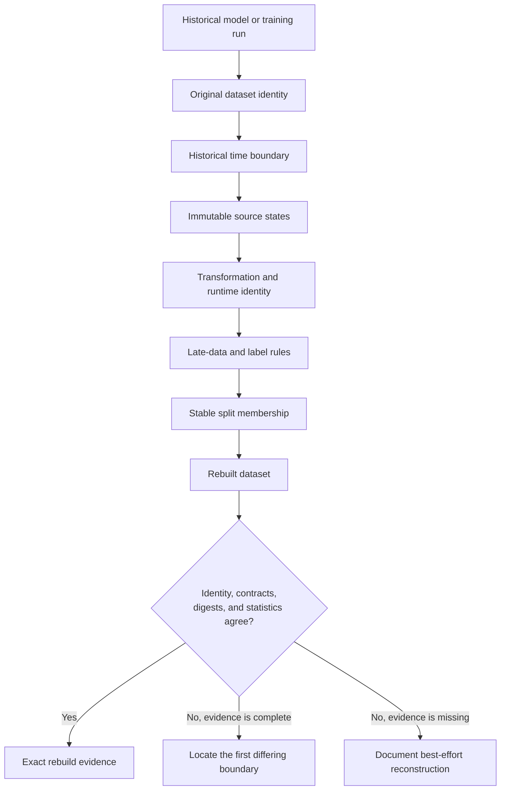
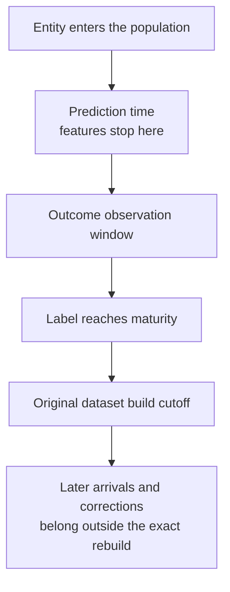
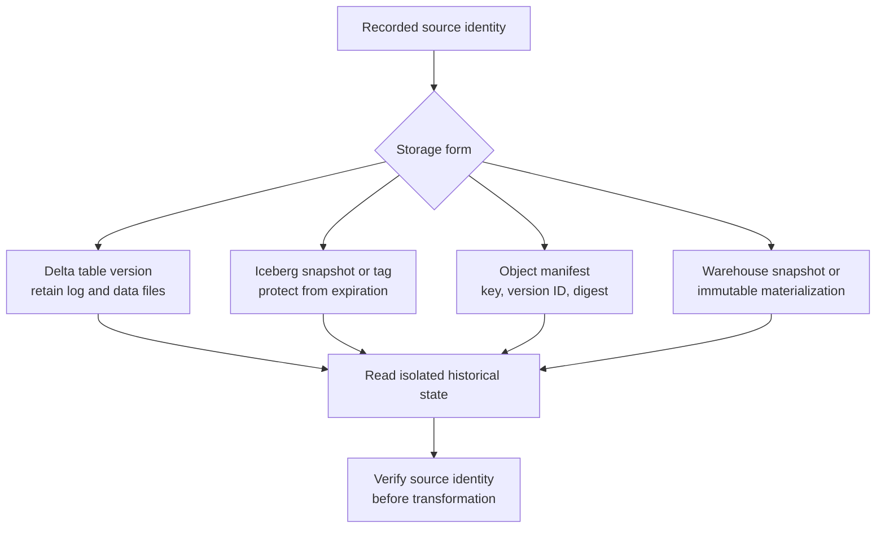
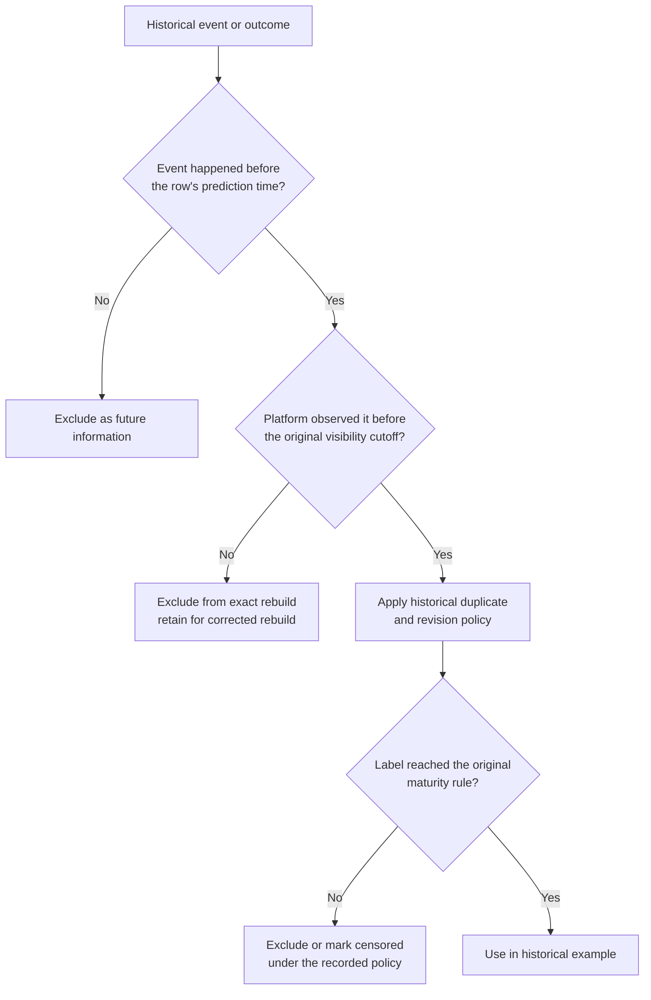
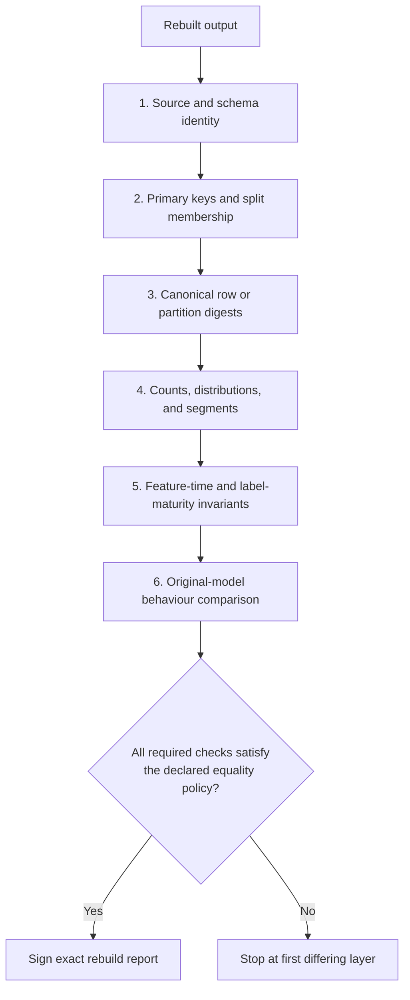
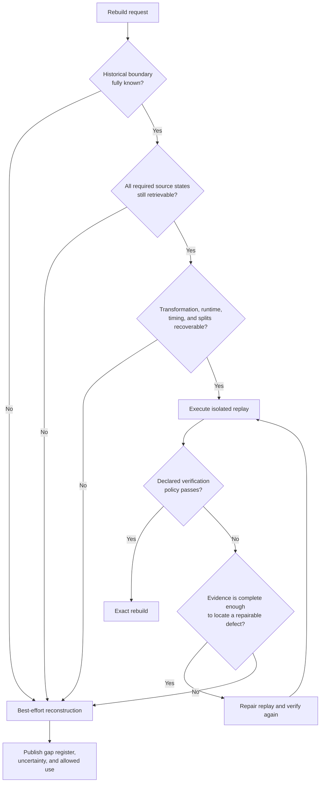

## Table of Contents

1. [Why Rerunning An Old Query Produces New Data](#why-rerunning-an-old-query-produces-new-data)
2. [What You Need To Rebuild A Past Dataset](#what-you-need-to-rebuild-a-past-dataset)
3. [Choose The Exact Past Moment To Rebuild](#choose-the-exact-past-moment-to-rebuild)
4. [Find The Exact Input Versions](#find-the-exact-input-versions)
5. [Recover The Code, Parameters, And Environment](#recover-the-code-parameters-and-environment)
6. [Reproduce Late Arrivals And Delayed Labels](#reproduce-late-arrivals-and-delayed-labels)
7. [Rebuild The Same Train And Test Rows, Then Compare Results](#rebuild-the-same-train-and-test-rows-then-compare-results)
8. [Decide Whether An Exact Rebuild Is Possible](#decide-whether-an-exact-rebuild-is-possible)
9. [Plan For Data That Has Expired Or Must Be Deleted](#plan-for-data-that-has-expired-or-must-be-deleted)
10. [The Main Idea](#the-main-idea)
11. [References](#references)

## Why Rerunning An Old Query Produces New Data
<!-- section-summary: Rebuilding a past dataset requires the historical data state and timing rules behind the old query, because today's sources contain later arrivals, corrections, and deletions. -->

Imagine a team investigating a model released several months ago. The training run points to a SQL file and records that the dataset contained 11.8 million examples. An engineer checks out the old Git commit, runs the SQL again, and receives 12.4 million rows.

Nothing crashed. The query is valid. The extra rows appeared because the sources continued changing after the original build. Some events arrived late. Several labels reached maturity. Incorrect transactions were corrected. A customer dimension gained new attributes. Privacy requests removed other records. The SQL describes how to transform data, while the sources decide which historical facts enter that transformation.

At a high level, **rebuilding a past dataset means recreating the data state that an earlier training or evaluation run actually used.** The work has to recover both the recipe and the world seen by that recipe.

This distinction matters during several ordinary situations:

- an incident team needs to find whether a data defect affected a released model;
- reviewers need a fair comparison between an old model and a corrected candidate;
- an audit asks which examples and labels supported a decision;
- a feature change needs a historical backfill under the old rules;
- a research team needs to reproduce a published experiment.

A rerun can be useful without being a reconstruction. It may answer, “What would the old logic produce from today's corrected data?” An exact rebuild answers a different question: “What did the old logic produce from the evidence available at the original boundary?”


```mermaid
flowchart TD
    A["Historical model or training run"] --> B["Original dataset identity"]
    B --> C["Historical time boundary"]
    C --> D["Immutable source states"]
    D --> E["Transformation and runtime identity"]
    E --> F["Late-data and label rules"]
    F --> G["Stable split membership"]
    G --> H["Rebuilt dataset"]
    H --> I{"Identity, contracts,<br/>digests, and statistics agree?"}
    I -- "Yes" --> J["Exact rebuild evidence"]
    I -- "No, evidence is complete" --> K["Locate the first differing boundary"]
    I -- "No, evidence is missing" --> L["Document best-effort reconstruction"]

    class A,B,C,D,E,F,G evidence
    class H,I replay
    class J exact
    class K,L investigate
```

The final comparison is part of the reconstruction. A successful pipeline run proves that the replay finished. It says nothing about whether the replay produced the historical rows. The team needs expected identities and validation evidence from the original build.

## What You Need To Rebuild A Past Dataset
<!-- section-summary: Seven connected records prove what the old dataset contained, how it was produced, and whether the rebuilt output matches it. -->

An exact rebuild rests on a **proof chain**. In plain language, each link answers one question that the next link depends on.

The **historical boundary** says which population and knowledge state the dataset represented. **Immutable inputs** point to the raw objects, lakehouse snapshots, or warehouse materializations available at that boundary. **Transformation identity** names the SQL, Python, feature definitions, and resolved configuration. **Runtime identity** names the dependency lock, container, engine, and relevant execution settings.

The **timing policy** explains late arrivals, duplicate resolution, point-in-time features, and label maturity. **Split identity** records which examples belonged to training, validation, and test. **Verification evidence** records schema, primary keys, row counts, content digests, statistics, and temporal checks.

All seven links belong in a compact rebuild manifest created during the original build:

```yaml
rebuild:
  dataset_id: payment_risk_examples_v18
  original_run_id: run_01J7R5
  requested_mode: exact

boundary:
  population_window: "${TRAINING_WINDOW}"
  source_visibility_cutoff: "${ORIGINAL_BUILD_CUTOFF}"
  prediction_time_column: decision_at
  label_policy: chargeback_final_v4
  label_maturity_days: 45

sources:
  payments:
    format: delta
    table: governed.risk.payment_events
    version: 842
  device_signals:
    format: iceberg
    table: governed.risk.device_signals
    snapshot_id: 638491772
  disputes:
    format: object_manifest
    uri: s3://ml-manifests/risk/disputes-91c7.json
    sha256: "91c7..."

transformation:
  git_commit: "8a41c9e"
  dbt_manifest_sha256: "7b2d..."
  resolved_config_sha256: "62aa..."
  image_digest: "sha256:da91..."

splits:
  method: grouped_time_split_v3
  training_ids: s3://ml-manifests/risk/train-3c81.parquet
  validation_ids: s3://ml-manifests/risk/validation-82f1.parquet
  test_ids: s3://ml-manifests/risk/test-4a09.parquet

expected:
  schema_sha256: "2bd4..."
  canonical_rows_sha256: "c813..."
  row_count: 11820431
  statistics_uri: s3://ml-evidence/risk/v18/statistics.json
```

The manifest stores references and hashes instead of copying the underlying data into an experiment tracker. Large or restricted datasets stay in governed storage. Training and incident systems receive just enough information to retrieve them under existing access policy.

One manifest cannot create evidence after it has disappeared. A Delta version number loses value after required files are vacuumed. An S3 key without its version ID resolves to the latest object. A Git commit without the dependency lock may recreate the source code under a different runtime. Reconstruction therefore has to influence retention and run-record design before the incident arrives.

MLflow dataset tracking can preserve a dataset source, digest, schema, and profile beside the training run. OpenLineage can connect input datasets, the transformation job, its run, and the output dataset. These systems strengthen discovery and provenance. The storage platform still owns the historical bytes, and the build manifest still owns reconstruction-specific timing and split rules.

## Choose The Exact Past Moment To Rebuild
<!-- section-summary: The historical boundary separates which entities belonged in the dataset, what facts were visible, and which labels were mature enough to use. -->

The first reconstruction decision is the point in history the team wants to recover. “The June dataset” sounds precise in conversation, yet it leaves several clocks unresolved.

An ML example usually has a **prediction time**. This is the moment the model would have produced its output. Features must represent information available by that moment. A fraud model may score a payment at authorization. A readmission model may score a patient at discharge. A recommendation model may score a session after the latest click.

The dataset build also has a **source-visibility cutoff**. This is the latest arrival or correction the original build was allowed to see. A transaction that happened before the prediction time can still arrive after the build cutoff. Exact reconstruction must exclude it if the original pipeline never saw it.

Labels add a third boundary. **Label maturity** describes the delay required before an outcome is considered stable enough for training. A chargeback label may need weeks. A delivery outcome may need days. A click may arrive quickly, while a purchase or return takes longer.


```mermaid
flowchart TD
    A["Entity enters the population"] --> B["Prediction time<br/>features stop here"]
    B --> C["Outcome observation window"]
    C --> D["Label reaches maturity"]
    D --> E["Original dataset build cutoff"]
    E --> F["Later arrivals and corrections<br/>belong outside the exact rebuild"]

    class A,C event
    class B,E decision
    class D mature
    class F later
```

The order above can vary by task. A dataset may be built only after every included label matures, which places the build after label maturity. Another pipeline may build incremental partitions and later finalize them. The manifest should store the actual policy instead of relying on one universal timeline.

### Separate When An Event Happened From When The Team Learned About It

Suppose a payment happened before the end of the training window. Its dispute record reached the warehouse several days after the original build. Population time says the payment belongs to the period. Knowledge time says the original dataset could not have included its dispute label.

This is a **bitemporal** problem: the system cares about when the real-world event was effective and when the data system learned about it. Source tables that preserve `event_at`, `ingested_at`, and revision validity give reconstruction a reliable path. A mutable table that overwrites the latest value destroys the earlier knowledge state unless snapshots or change history preserve it elsewhere.

### Start With The Training Job And Trace Its Inputs

The safest boundary comes from the training run or released model, not from a guessed calendar window. Resolve the model to its run, the run to its dataset identity, and the dataset identity to the original build record. Then confirm:

- inclusion and exclusion rules for the population;
- prediction-time column and timezone;
- source-visibility cutoff;
- label definition, maturity delay, and revision policy;
- feature lookback windows;
- policy or product version that shaped the action.

A missing boundary is an evidence gap. The team should record that gap before reading current data because a convenient current timestamp can quietly turn a reconstruction into a new build.

## Find The Exact Input Versions
<!-- section-summary: Exact reconstruction reads preserved source states through table versions, snapshot IDs, object version manifests, or immutable warehouse outputs. -->

After the boundary is known, the team needs the actual data state. Industrial platforms solve this at different layers, but they share one rule: the rebuild must name an immutable source identity and retain the bytes behind it.

### Keep Delta Lake Logs And Data Files For Old Versions

Each Delta Lake commit creates a numbered table version. A rebuild should prefer the recorded version because it identifies one committed state directly:

```sql
SELECT *
FROM governed.risk.payment_events VERSION AS OF 842;
```

Delta time travel depends on both the transaction-log history and the data files referenced by that version. `VACUUM` removes old unreferenced files after the configured retention threshold, and old versions eventually lose their reconstruction value. A run manifest should therefore record the table version, while the table retention policy should cover the approved investigation and audit window.

Copying a Delta table to a new location can also disturb timestamp-based travel because version timestamps depend on log-file timestamps. A recorded version number is a stronger reconstruction identity than “the state from roughly this time.”

### Use Iceberg Snapshots Or Tags For Long-Lived References

Apache Iceberg records each table state as a snapshot. Spark can read a recorded snapshot directly:

```sql
SELECT *
FROM governed.risk.device_signals VERSION AS OF 638491772;
```

Iceberg snapshots remain available until snapshot expiration removes them from table metadata and releases unneeded files for deletion. A historical tag can retain an important snapshot under its own lifecycle policy. This works well for datasets behind production releases, provided the tag is created before normal snapshot maintenance expires the state.

Retention still needs active ownership. A snapshot ID written into MLflow cannot override `expire_snapshots`. The data platform should treat production-dataset references as inputs to its snapshot-retention job.

### Record Object Versions Or List Every File

Object versioning preserves multiple variants under one key. Amazon S3 assigns a version ID to each new object in a versioning-enabled bucket. The pair of bucket, key, and version ID identifies one object.

A dataset usually contains thousands or millions of objects, so recording each version inside the training run is impractical. A content manifest can list them:

```json
{
  "prefix": "s3://risk-raw/disputes/",
  "objects": [
    {
      "key": "partition=part-a/records-0001.parquet",
      "version_id": "3Lg...7J",
      "sha256": "c17a..."
    },
    {
      "key": "partition=part-b/records-0002.parquet",
      "version_id": "Vn8...pQ",
      "sha256": "91e4..."
    }
  ]
}
```

The manifest itself needs immutable storage and a digest. Bucket versioning alone cannot protect historical access if lifecycle rules delete noncurrent versions. The rebuild policy must align object lifecycle with the model investigation window.

GCS and Azure Blob Storage offer comparable object-version concepts. The provider changes the identifier and lifecycle configuration; the reconstruction responsibility remains the same.

### Copy Warehouse Data Before Recovery History Expires

Warehouse time travel is useful for recent operational recovery. Its window may be much shorter than the life of a production model. BigQuery, for example, supports a configurable time-travel window from two to seven days and recommends table snapshots for longer preservation.

A durable ML pattern materializes the approved training spine or source extract into an immutable table, table snapshot, or versioned export. The build record stores its fully qualified name, creation job, schema, row count, and digest. Teams using Snowflake or another warehouse should make the same distinction between short operational recovery and long-lived model evidence.

Avoid materializing every intermediate table forever. Preserve the source states or approved training spine needed to satisfy the reconstruction objective. Retention costs should follow model risk, audit requirements, and the value of future incident analysis.


```mermaid
flowchart TD
    A["Recorded source identity"] --> B{"Storage form"}
    B --> C["Delta table version<br/>retain log and data files"]
    B --> D["Iceberg snapshot or tag<br/>protect from expiration"]
    B --> E["Object manifest<br/>key, version ID, digest"]
    B --> F["Warehouse snapshot or<br/>immutable materialization"]
    C --> G["Read isolated historical state"]
    D --> G
    E --> G
    F --> G
    G --> H["Verify source identity<br/>before transformation"]

    class A,B choice
    class C,D,E,F,G source
    class H verify
```

Source verification should fail fast. Confirm that every version or snapshot resolves, object digests match, expected partitions exist, and access is authorized. Starting a costly pipeline after one input silently fell back to “latest” creates a convincing wrong result.

## Recover The Code, Parameters, And Environment
<!-- section-summary: Source code, compiled transformations, resolved configuration, dependencies, and engine settings together define the historical dataset recipe. -->

Exact inputs recover the old facts, although they cannot show how those facts became model-ready rows. The rebuild also needs the code, resolved parameters, and execution environment used by the original pipeline. These records cover SQL, Python, macros, feature definitions, library versions, engine versions, container image, and behaviour-changing settings. Old source code can produce a different result under a new runtime or a new set of variables.

A Git commit identifies version-controlled SQL and Python. It may also identify dbt models, macros, tests, and package declarations. Git alone misses values supplied at runtime: dbt variables, environment-dependent configuration, orchestration parameters, secrets references, warehouse target, and dynamically selected models.

### Recover The Exact Code That Ran

dbt generates `manifest.json` during project parsing. The artifact contains a representation of project resources, their configuration, sources, macros, and graph relationships. Executed nodes may also contain compiled SQL. Saving the original artifact alongside `run_results.json` is stronger than compiling today's interpretation of an old source file.

The build should preserve:

- Git commit and repository;
- dbt manifest and run-result digests;
- package lock and macro versions;
- resolved non-secret variables;
- selected nodes and target profile identity;
- compiled SQL or equivalent execution plan where available.

Keep the saved dbt state outside the active `target/` directory. dbt commands overwrite `target/manifest.json`, so using that same path for historical state can erase the evidence before the comparison runs.

Python or Spark pipelines need similar evidence. A `uv.lock`, Poetry lock file, or Conda lock preserves resolved packages. The container image digest preserves the packaged operating environment.

Record the Python and JVM versions beside the Spark and connector versions. Native libraries can also affect serialization or numerical behaviour. Engine settings deserve their own resolved record if they change timestamps, decimal handling, case sensitivity, ordering, or floating-point aggregation.

A focused replay setup might look like this:

```bash
git checkout 8a41c9e
uv sync --frozen
dbt deps
resolved_vars="$(cat evidence/resolved-vars.yml)"
dbt build \
  --select path:models/risk_training \
  --vars "$resolved_vars" \
  --target rebuild
```

`evidence/resolved-vars.yml` is the archived set of reviewed non-secret variables; dbt receives the file's YAML contents, not its filename. The command is only safe after the rebuild target points to isolated historical sources. A source alias that still resolves to production “latest” defeats the earlier work.

### Trace The Data Path, Then Recover The Actual Files

Lineage points from a training run back through the dataset build and its sources. It helps the team locate those records, while the retained table versions, object versions, or snapshots supply the actual historical data. MLflow can log dataset inputs and preserve the source, digest, schema, and profile beside the run.

OpenLineage models a defined **Job**, one execution as a **Run**, and data inputs or outputs as **Datasets**. Its source-code and dataset-version facets can carry Git and storage identities. A lineage backend can then answer which job and run produced a dataset and which model training consumed it.

Lineage tells the team where to look. The container registry, Git server, lakehouse, warehouse, and object store still need to retain the evidence. A lineage edge pointing to a deleted image or expired snapshot proves provenance but cannot execute the rebuild.

### Decide How Closely The Old Environment Must Be Recreated

Distributed engines may write different Parquet file boundaries or aggregate floating-point values in a different order even under equivalent logic. The team should decide which equality matters:

- **Byte equality** requires identical serialized files and is the strictest target.
- **Row equality** requires the same canonical rows and values.
- **Semantic equality** permits approved numeric tolerances or equivalent encodings while preserving model meaning.

Most tabular ML rebuilds need exact row identity, exact labels and categories, and declared tolerances for floating-point features. The manifest should state this policy before comparison so the team cannot weaken it after seeing a mismatch.

## Reproduce Late Arrivals And Delayed Labels
<!-- section-summary: Historical replay uses event time and knowledge time to reproduce late arrivals, duplicate resolution, point-in-time features, and labels available at the original build. -->

Late data is ordinary in production. Mobile devices reconnect, partner files arrive after a deadline, streaming jobs retry, and human reviewers revise outcomes. An exact rebuild has to reproduce how the original pipeline handled those events.

The core rule uses two clocks:

1. `event_at` says when the event happened in the real world.
2. `observed_at` or `ingested_at` says when the data platform learned about it.

For a row scored at `prediction_at`, an event feature usually needs `event_at <= prediction_at`. For exact reconstruction, it may also need `observed_at <= source_visibility_cutoff`. The first condition prevents future leakage. The second prevents the rebuild from seeing a historical event that arrived after the original build.

```sql
WITH eligible_events AS (
  SELECT *
  FROM historical_events
  WHERE event_at <= :prediction_at
    AND observed_at <= :source_visibility_cutoff
),
deduplicated AS (
  SELECT *,
    ROW_NUMBER() OVER (
      PARTITION BY event_id
      ORDER BY observed_at DESC, source_sequence DESC
    ) AS event_rank
  FROM eligible_events
)
SELECT *
FROM deduplicated
WHERE event_rank = 1;
```

The ordering rule is part of the data contract. Another pipeline may keep the first observation, the highest source sequence, or a revision valid at the cutoff. The historical code and manifest must identify that choice.

### Reproduce Which Late Records Were Included

The original pipeline may have accepted events only up to a defined lateness threshold. A streaming **watermark** represents that rule. Events beyond it may be dropped, quarantined, or sent through a later historical rebuild. Running a batch query over every preserved event can accidentally include records the original streaming job discarded.

An exact rebuild should replay the same acceptance rule or read a snapshot of the accepted-event table produced by that rule. A corrected rebuild can deliberately include later events, but it needs a new dataset identity and a written explanation of the change.

### Use Only Labels Available At The Original Cutoff

Outcome records also need system time. A current `chargeback_status = final` row says little about what the original build knew. The label system should preserve revisions through an append-only event log, valid-time columns, a slowly changing table, or immutable snapshots.

A maturity rule might require:

- the outcome window to finish;
- the label to hold an approved status;
- the last revision to be older than a stability delay;
- required review or adjudication to finish;
- the label-policy version to match the original run.

Suppose a model predicts subscription cancellation within 30 days. A dataset built 10 days after prediction cannot use that outcome as a mature negative. Treating “no cancellation yet” as “will not cancel” biases the training data. Reconstruction must recover the original maturity rule, including any right-censoring policy.


```mermaid
flowchart TD
    A["Historical event or outcome"] --> B{"Event happened before<br/>the row's prediction time?"}
    B -- "No" --> C["Exclude as future information"]
    B -- "Yes" --> D{"Platform observed it before<br/>the original visibility cutoff?"}
    D -- "No" --> E["Exclude from exact rebuild<br/>retain for corrected rebuild"]
    D -- "Yes" --> F["Apply historical duplicate<br/>and revision policy"]
    F --> G{"Label reached the original<br/>maturity rule?"}
    G -- "No" --> H["Exclude or mark censored<br/>under the recorded policy"]
    G -- "Yes" --> I["Use in historical example"]

    class A,F process
    class B,D,G gate
    class C,E,H exclude
    class I include
```

A point-in-time feature store can automate parts of historical feature retrieval. Feast, for example, selects feature states relative to entity timestamps.

The rebuild still needs the correct offline source snapshot and feature definitions. It also needs the original entity dataframe and late-data policy. Point-in-time joining protects the feature clock; it cannot recover source history that storage already removed.

## Rebuild The Same Train And Test Rows, Then Compare Results
<!-- section-summary: Stable split manifests preserve evaluation membership, while layered verification proves schema, rows, values, timing, and statistical evidence. -->

The transformed examples are only part of the historical dataset. Training, validation, and test membership can change model metrics even if every row is present.

Re-running `train_test_split(..., random_state=42)` may still produce a different split after row order changes, duplicates are corrected, or library behaviour changes. Entity leakage can also occur if repeated customers, patients, devices, or products land on both sides of the split.

### Record Exactly Which Rows Belonged To Each Split

The durable approach stores stable example or entity IDs for each split. A grouped split may store customer IDs. A time split may store explicit time boundaries plus exception lists. A frozen evaluation set should have its own dataset identity and manifest.

The replay performs these checks before training:

- every rebuilt example belongs to exactly one allowed split;
- all original split IDs are present unless the expected dataset excludes them;
- group-level isolation still holds;
- time boundaries match the recorded policy;
- holdout membership stayed unchanged.

The split algorithm remains valuable because it explains how new versions should be created. The membership manifests prove how the historical version was actually partitioned.

### Check Identities First, Then Data And Model Results

Verification starts with exact identities, then moves through row-level comparisons, dataset statistics, and model results. This order catches a wrong snapshot or split before broad averages hide the difference.

**Source identity** confirms every snapshot, object manifest, and warehouse materialization. **Schema identity** compares column names, logical types, nullability, units, and category contracts. **Row identity** compares primary keys and split membership. **Content identity** compares canonical values or partition-level digests.

After identity checks pass, **statistical evidence** compares counts, null rates, quantiles, category frequencies, label balance, time ranges, and important segments. **Temporal checks** prove that features respect prediction time and labels respect maturity. A final **behaviour check** can score the original model against both datasets and compare outputs.


```mermaid
flowchart TD
    A["Rebuilt output"] --> B["1. Source and schema identity"]
    B --> C["2. Primary keys and split membership"]
    C --> D["3. Canonical row or partition digests"]
    D --> E["4. Counts, distributions, and segments"]
    E --> F["5. Feature-time and label-maturity invariants"]
    F --> G["6. Original-model behaviour comparison"]
    G --> H{"All required checks satisfy<br/>the declared equality policy?"}
    H -- "Yes" --> I["Sign exact rebuild report"]
    H -- "No" --> J["Stop at first differing layer"]

    class A,B,C,D,E,F,G check
    class H gate
    class I pass
    class J fail
```

A single dataset checksum only works after canonicalization. File order, row order, Parquet writer version, compression, and file sizing can change bytes without changing the logical table. Useful strategies include:

- sort by a stable primary key and hash canonical field encodings;
- compute per-partition digests and combine them in a fixed order;
- preserve a row-level digest for focused mismatch analysis;
- keep file hashes as an additional byte-level check where required.

The first differing verification layer guides the investigation. A source digest mismatch points toward retention or retrieval. Matching sources with a schema mismatch points toward transformation or runtime. Matching canonical rows with different model outputs points toward model runtime or input serialization.

### Compare The Exact Rebuild Before The Corrected Rebuild

An incident often needs two outputs. The **exact rebuild** reproduces the flawed historical dataset and proves the evidence path. The **corrected rebuild** changes one or more source states or rules and receives a new identity.

Compare those outputs by changed keys, changed labels, affected features, segments, and model behaviour. This order separates “we successfully reconstructed history” from “we believe this change repairs the historical defect.”

## Decide Whether An Exact Rebuild Is Possible
<!-- section-summary: Exact rebuilds satisfy declared equality checks, while best-effort reconstructions disclose missing evidence, substitutions, uncertainty, and permitted use. -->

Some historical datasets cannot be recreated exactly. A snapshot may have expired. Raw objects may have been lifecycle-deleted. A vendor may expose only current data. Personal records may have been lawfully erased. A proprietary runtime may no longer exist.

The team still needs a useful and honest result.

An **exact rebuild** satisfies the declared equality policy for the evidence that shaped model meaning. It recovers the original boundary, source state, transformations, runtime requirements, timing rules, split membership, and required verification results.

A **best-effort reconstruction** recreates as much as the preserved evidence allows and records every gap. It can support debugging, impact estimation, or hypothesis testing. It cannot carry the same audit or comparison claim as an exact rebuild.


```mermaid
flowchart TD
    A["Rebuild request"] --> B{"Historical boundary<br/>fully known?"}
    B -- "No" --> H["Best-effort reconstruction"]
    B -- "Yes" --> C{"All required source states<br/>still retrievable?"}
    C -- "No" --> H
    C -- "Yes" --> D{"Transformation, runtime,<br/>timing, and splits recoverable?"}
    D -- "No" --> H
    D -- "Yes" --> E["Execute isolated replay"]
    E --> F{"Declared verification<br/>policy passes?"}
    F -- "Yes" --> G["Exact rebuild"]
    F -- "No" --> I{"Evidence is complete enough<br/>to locate a repairable defect?"}
    I -- "Yes" --> J["Repair replay and verify again"]
    J --> E
    I -- "No" --> H
    H --> K["Publish gap register,<br/>uncertainty, and allowed use"]

    class A,E,J process
    class B,C,D,F,I gate
    class G exact
    class H,K partial
```

A gap register should identify:

- the missing or unusable evidence;
- why it is unavailable;
- the substitute data, code, or assumption;
- rows, time periods, features, labels, and segments affected;
- expected direction and scale of uncertainty;
- checks that still passed;
- decisions the reconstruction may support;
- decisions that require stronger evidence.

Suppose a weather provider retained only corrected observations. The team can rebuild the rest of a demand dataset exactly and substitute the corrected weather values. The result may help estimate whether weather was relevant to an incident. It cannot prove the weather values used by the old model.

Names matter. Publishing a best-effort output under the old dataset ID hides uncertainty from future users. Give it a new identity, link it to the historical target, and store the reconstruction status in the catalog and run record.

## Plan For Data That Has Expired Or Must Be Deleted
<!-- section-summary: Rebuild policy balances investigation needs with storage cost, access control, privacy, legal deletion, encryption, and safe isolated execution. -->

Keeping every source forever would simplify reconstruction and create serious cost, security, and privacy problems. A mature rebuild policy defines which historical evidence deserves retention and which constraints can make exact recovery impossible.

### Keep Evidence For As Long As The Model Risk Requires

Production models need a declared reconstruction window. A low-risk weekly forecast may keep approved training outputs and manifests for a modest period. A safety-critical or regulated decision system may need longer evidence retention under its governing policy.

The storage settings have to agree:

- Delta log and deleted-file retention must protect required versions.
- Iceberg snapshot or tag retention must survive normal expiration.
- object lifecycle must retain required noncurrent versions and manifests;
- warehouse snapshots or materialized tables must outlive short time-travel windows;
- container images, dependency locks, dbt artifacts, and split manifests need equivalent retention.

Treat a released model as a downstream reference. The cleanup system should check active model and audit obligations before expiring the dataset evidence behind it.

### Keep Sensitive Source Data Out Of General Evidence Stores

Personal, health, financial, or commercially restricted data should stay in governed storage with least-privilege access and audit logging. A rebuild manifest can preserve opaque identities, versions, digests, schemas, and statistics without copying sensitive rows into MLflow, Git, or an incident document.

Retention has limits. Privacy and records-management policies may require deletion after a purpose expires or after a valid request. The NIST Privacy Framework treats retention, alteration, and deletion as parts of the data-processing lifecycle. The applicable legal and organisational rules decide what can be kept.

Exact reconstruction can therefore become impossible by design. A deletion tombstone may prove that specific records were removed without retaining their content. The rebuild report should state that limitation instead of restoring data from an unauthorized backup or bypassing the deletion policy.

Encryption adds another boundary. Historical objects are unreadable after their encryption keys are destroyed. The evidence record should include the key-management class and rebuild eligibility, without storing secret material.

### Use An Isolated, Read-Only Rebuild Environment

A rebuild should never overwrite the historical source or current production tables. Use read-only credentials for preserved inputs and write the output under a new reconstruction identity. Network controls, access logging, and approved export locations matter for restricted datasets.

The operator should stop if:

- a source reference resolves to current data instead of its recorded version;
- a required snapshot, object version, image, or key is unavailable;
- the runtime asks for undeclared credentials or dependencies;
- row-level access prevents an authorized historical read;
- the output would copy restricted fields into an unapproved location;
- verification cannot distinguish the result from a partial reconstruction.

### Practice Rebuilding Data Before An Incident

A periodic drill can select one released model, resolve its dataset manifest, verify every source reference, rebuild a small partition, and compare the recorded evidence. The exercise exposes expired snapshots, deleted images, stale credentials, missing dbt artifacts, and unreadable split manifests while the original owners still remember the system.

Reconstruction readiness is measurable. Track the share of released models with complete manifests, retrievable inputs, preserved runtimes, stable split identities, and a recently tested rebuild path. Storage cost belongs beside those measures so the policy can protect valuable evidence without retaining data blindly.

## The Main Idea
<!-- section-summary: Historical reconstruction succeeds through a complete proof chain and an honest declaration of the equality that the recovered evidence can support. -->

Rerunning old code against current data creates a new answer. A historical reconstruction first recovers the old population and knowledge boundary. It then resolves immutable inputs and the executed transformation environment.

The replay applies the original late-data and label rules. Stable split manifests restore training and evaluation membership. Layered verification decides whether the output truly matches.

Delta Lake versions, Iceberg snapshots and tags, object version manifests, and warehouse materializations preserve different forms of source history. Git, dbt artifacts, dependency locks, and container digests preserve the recipe. MLflow and OpenLineage connect the evidence to training runs and downstream models.

The final claim must match the preserved evidence. A result that satisfies the declared identity and equality checks is an exact rebuild. A result with missing snapshots, deleted records, substituted sources, or unrecoverable runtime behaviour is a best-effort reconstruction with a gap register and limited permitted use.

## References

- [Delta Lake: Table utility commands](https://docs.delta.io/delta-utility/) - Documents `VACUUM`, transaction history, and the retention boundary for historical table versions.
- [Delta Lake: Table batch reads and writes](https://docs.delta.io/delta-batch/) - Documents version-based time travel and the requirement to retain log and data files.
- [Apache Iceberg: Spark queries](https://iceberg.apache.org/docs/latest/spark-queries/) - Documents time travel by snapshot ID, timestamp, branch, or tag.
- [Apache Iceberg: Maintenance](https://iceberg.apache.org/docs/latest/maintenance/) - Explains snapshot expiration and the loss of time-travel access after old snapshots are expired.
- [Apache Iceberg: Branching and tagging](https://iceberg.apache.org/docs/latest/branching/) - Documents historical tags and independent snapshot-reference retention policies.
- [Amazon S3: Retaining multiple versions of objects](https://docs.aws.amazon.com/AmazonS3/latest/userguide/Versioning.html) - Documents object version IDs, recovery from overwrite or deletion, and lifecycle considerations.
- [Google Cloud: BigQuery time travel and data retention](https://docs.cloud.google.com/bigquery/docs/time-travel) - Documents the short configurable recovery window and recommends table snapshots for longer preservation.
- [dbt Developer Hub: Manifest JSON file](https://docs.getdbt.com/reference/artifacts/manifest-json) - Describes the project resources, configurations, graph relationships, and compiled details stored in `manifest.json`.
- [dbt Developer Hub: Caveats to state comparison](https://docs.getdbt.com/reference/node-selection/state-comparison-caveats) - Explains why saved state should stay outside the active target path.
- [MLflow: Dataset tracking](https://mlflow.org/docs/latest/dataset/) - Documents dataset source, digest, schema, profile, and lineage metadata.
- [OpenLineage: Object model](https://openlineage.io/docs/spec/object-model/) - Defines jobs, runs, datasets, source-code facets, and dataset-version facets.
- [NIST: Privacy Framework](https://www.nist.gov/privacy-framework) - Provides a risk-management framework covering data processing, retention, alteration, and deletion.
