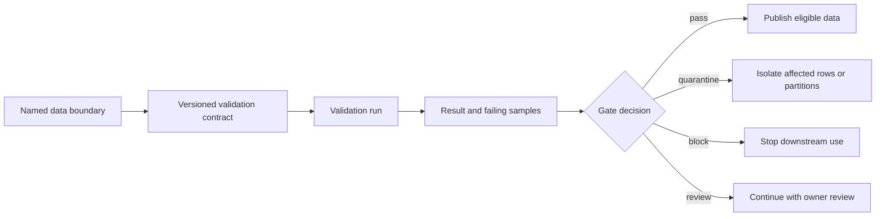

## Data Validation Is A Decision System
<!-- section-summary: Data validation applies reviewed contracts at data boundaries and turns check results into block, quarantine, review, or fallback decisions. -->

**Data validation** checks whether data is eligible for a specific use such as training, evaluation, feature publication, or inference. A production validation system includes the checks, their location, severity, owner, evidence, and response. A list of assertions alone cannot explain whether a failed row should stop training or route one request to a fallback.

The next article implements common checks for schema, missing values, ranges, joins, and labels. This article owns the system around those checks. Its core workflow is:



Every arrow needs an identity. The result should name the dataset version, contract version, pipeline run, check implementation, observed value, owner, and decision. That record lets model reviewers prove which data gates approved a candidate.

The framework has five responsibilities. A **contract** defines what eligible data means for one use. **Boundary placement** decides where invalid data can first be stopped. **Disposition** maps a failed rule to block, quarantine, review, or fallback. **Evidence** records exactly what was checked and observed. **Response** restores a trusted path and prevents the same defect from silently returning. A validation library may execute assertions, while this wider decision system makes the assertions operationally meaningful.

The responsibilities interact. A severe rule placed after dataset publication is too late. Teams often ignore a warning that has no owner. A block without failing samples is difficult to diagnose. A successful result without dataset and contract identities cannot support a release audit. The later sections deepen each responsibility and show how they combine at different boundaries.

## A Delivery ETA Pipeline As A Supporting Example
<!-- section-summary: An ETA pipeline shows why source, curated, training, and serving boundaries need different validation decisions and owners. -->

Imagine **SwiftDrop**, a food-delivery company that predicts arrival time when a driver accepts an order. Historical training data joins orders, restaurants, drivers, traffic, weather, and completed-delivery labels. Live inference reads a request plus recent operational features.

SwiftDrop has four important boundaries:

| Boundary | Data entering | Consumer | Main risk | Owner |
|---|---|---|---|---|
| Source ingestion | Traffic, weather, order, and driver events | Curated transformations | Missing or stale upstream feed | Data platform |
| Curated examples | Joined historical rows | Dataset builder | Broken keys, units, timing, or labels | Analytics engineering |
| Training release | Versioned train, validation, and test data | Training pipeline | Leakage, immature labels, weak segment coverage | ML data owner |
| Serving input | Request and online features | ETA endpoint | Wrong type, stale feature, unknown category | Serving team |

One rule should not control every boundary. A stale traffic feed can block online feature publication while the historical training release remains valid. One malformed serving request can receive a controlled client error without stopping all traffic. A broken label join should block a new training release because every candidate would learn from damaged targets.

## Write The Validation Contract
<!-- section-summary: A validation contract defines the boundary, rule, threshold, severity, owner, response, and evidence required for each check. -->

A **validation contract** is the versioned policy for one boundary. It connects a check to the operational decision it protects.

```yaml
contract: delivery-eta-training-v6
boundary: training_dataset_release
checks:
  - id: required-columns
    severity: block
    owner: delivery-data-engineering
    response: stop_dataset_publish
  - id: feature-availability-time-integrity
    threshold: "feature_available_at_after_prediction_rows == 0"
    severity: block
    owner: delivery-analytics-engineering
    response: stop_dataset_publish
  - id: new-city-distribution-change
    threshold: "population_share_delta <= 0.08"
    severity: review
    owner: eta-model-owner
    response: require_city_launch_evidence
evidence:
  retain_failing_samples: 100
  result_uri_required: true
```

The contract separates a failed observation from a failed system. A distribution shift can describe a real city launch. The check opens a review because an owner must interpret it. A missing prediction timestamp breaks the dataset's time boundary and blocks publication immediately.

Thresholds should come from the product and historical evidence. A copied percentage creates noisy alerts or accepts harmful data. The contract review should record why the threshold exists and when the team will revisit it.

The contract also needs a small execution interface. Each check implementation returns the same fields, even when one check runs in SQL and another runs in Python. This keeps the gate independent from the library that calculated the observation.

```python
from dataclasses import dataclass
from collections import Counter
from typing import Literal

Severity = Literal["block", "quarantine", "review"]
ExecutionStatus = Literal["completed", "execution_error", "skipped"]


@dataclass(frozen=True)
class CheckResult:
    check_id: str
    passed: bool
    observed: float | int | str | None
    expected: str
    severity: Severity
    owner: str
    response: str
    execution_status: ExecutionStatus = "completed"
    sample_uri: str | None = None
    error: str | None = None


@dataclass(frozen=True)
class GateDecision:
    status: Literal["pass", "block", "quarantine", "review"]
    action: str
    failed_checks: tuple[str, ...]
    owners: tuple[str, ...]
    evidence_uris: tuple[str, ...]
    execution_status: Literal["complete", "incomplete"]


def decide_gate(
    results: list[CheckResult],
    expected_check_ids: set[str],
) -> GateDecision:
    result_counts = Counter(result.check_id for result in results)
    result_ids = set(result_counts)
    missing = expected_check_ids - result_ids
    unexpected = result_ids - expected_check_ids
    duplicated = {check_id for check_id, count in result_counts.items() if count > 1}
    empty_contract = not expected_check_ids
    contract_execution_failed = bool(
        missing or unexpected or duplicated or empty_contract
    )

    incomplete = [r for r in results if r.execution_status != "completed"]
    failures = [r for r in results if not r.passed]
    affected_by_id = {result.check_id: result for result in failures}
    affected_by_id.update({result.check_id: result for result in incomplete})
    affected = [affected_by_id[key] for key in sorted(affected_by_id)]

    if incomplete or contract_execution_failed:
        status = "block"
        action = "withhold_training_ready"
        selected = incomplete
    else:
        priority = {"block": 0, "quarantine": 1, "review": 2}
        selected = sorted(
            failures,
            key=lambda r: (priority[r.severity], r.check_id),
        )
        status = selected[0].severity if selected else "pass"
        action = selected[0].response if selected else "publish_training_ready"

    failed_check_ids = {r.check_id for r in affected} | missing | unexpected | duplicated
    if empty_contract:
        failed_check_ids.add("validation-contract-empty")
    decision_owners = {r.owner for r in affected}
    if contract_execution_failed:
        decision_owners.add("validation-platform")

    return GateDecision(
        status=status,
        action=action,
        failed_checks=tuple(sorted(failed_check_ids)),
        owners=tuple(sorted(decision_owners)),
        evidence_uris=tuple(
            r.sample_uri for r in affected if r.sample_uri is not None
        ),
        execution_status=(
            "incomplete" if incomplete or contract_execution_failed else "complete"
        ),
    )
```

This function contains policy rather than check logic. The mature-label SQL job can report `observed=0.931`, while a Pandera schema check can report `observed="missing: prediction_at"`. Both results reach the same decision boundary. The configured `response` supplies the action for the highest-severity failed rule. A crashed, skipped, duplicated, missing, or unexpected validator produces an incomplete decision and withholds publication, even when every returned rule passed. Passing an empty result list for a contract with three expected IDs therefore blocks all three missing checks. This fail-closed behavior prevents validator infrastructure failure from bypassing a training-release contract.

The contract loader should reject incomplete policy before any data job starts. A useful unit test checks that every rule has an owner and a response, every blocking rule retains diagnostic evidence, and every referenced check implementation exists. This catches a misspelled check ID during review instead of discovering it after the scheduled dataset build.

## Place Gates At Data Boundaries
<!-- section-summary: Validation runs where data changes ownership or meaning so failures stop close to their source and downstream evidence stays traceable. -->

Checks belong close to the boundary they protect. Warehouse tests can guard joins and labels before export. Dataframe schemas can guard the exact table passed to training. Feature publication gates can check freshness before values enter an online store. Request validation can reject malformed live payloads before prediction.

The same rule may need two implementations when two systems own the boundary. SwiftDrop can check `driver_distance_meters` in the warehouse and in the serving request. The contract should keep the meaning and limits aligned, while each runtime uses an appropriate implementation.

Validation also needs a stable execution order. Structural checks run before expensive statistical reports. Label maturity runs before training. A serving endpoint validates required fields before contacting feature services. This order reduces wasted work and produces clearer failure messages.

For SwiftDrop, the training release gate runs in four phases. It first validates the Parquet schema and required columns. It then checks key uniqueness and join coverage. Next it measures label maturity and segment coverage. Distribution reports run last because they need a structurally valid table. Each phase writes a result even when a later phase never runs, so a reviewer can distinguish “distribution passed” from “distribution was skipped after a schema failure.”

```yaml
phases:
  - name: structure
    checks: [required-columns, compatible-types]
  - name: joins
    checks: [unique-example-key, driver-join-coverage]
  - name: labels
    checks: [mature-label-rate, label-policy-version]
  - name: distributions
    checks: [city-coverage, target-rate-change]
```

Boundary placement also changes recovery. A source-ingestion failure should retry or quarantine the source partition. A training-release failure should preserve the rejected dataset and stop candidate creation. A request-boundary failure should return a stable client error or use a reviewed fallback. Reusing one global `raise Exception` path would erase these different product consequences.

## Choose Block, Quarantine, Or Review
<!-- section-summary: Severity follows product impact and recovery options, with block, quarantine, and review paths defined before incidents. -->

**Block** stops the downstream operation. Use it when continuing can create a misleading model or unsafe decision, such as missing labels, duplicate example keys, or an incompatible serving schema.

**Quarantine** isolates affected rows, partitions, stores, or cities while healthy data continues. It fits failures with a safe scope and explicit fallback. SwiftDrop can quarantine one city's weather partition and use a reviewed default or previous snapshot for that city.

**Review** records the change and asks an owner to interpret it. It fits shifts that may reflect a real product event, such as a launch in a new region. A review needs a deadline and decision owner so it cannot remain unresolved while releases continue. The contract uses `review` consistently as the severity name; alerting systems may display it as a warning without creating a second policy state.

Severity should avoid silent row dropping. Removing invalid rows can change class balance or segment coverage. The validation report must show what was removed, why, and whether the resulting dataset still supports the product claim.

A quarantine decision needs an eligibility calculation after isolation. Suppose 18,420 rows from city `EDI` have a broken weather join. The gate records the rejected predicate, writes those rows to an access-controlled location, and recalculates the remaining dataset's label rate and city coverage. Training may continue only if the contract allows that city to be absent for this release. Quarantine is therefore a new dataset decision, rather than a shortcut around a failed check.

## Publish Validation Evidence
<!-- section-summary: A validation result records contract identity, dataset identity, observations, samples, decision, owner, and downstream release links. -->

Each run publishes a machine-readable result plus a summary a reviewer can read. A useful record includes:

```yaml
validation_run: eta-data-2026-07-12-0200
contract: delivery-eta-training-v6
dataset_version: delivery-eta-examples-2026-07-11-r1
status: blocked
failed_checks:
  - id: mature-label-rate
    expected: ">= 0.995"
    observed: 0.931
    samples_uri: s3://swiftdrop-ml/validation/eta-data-2026-07-12-0200/labels.parquet
decision:
  action: stop_dataset_publish
  owner: delivery-analytics
  ticket: DATA-4821
```

The training run should reference the successful validation result by ID. A model review can then trace the candidate to the dataset and the exact contract that approved it. Retention and access controls apply to failing samples because they can contain customer or operational data.

The gate publishes one marker only after a complete passing decision. Downstream training resolves that marker instead of discovering datasets by a mutable `latest` path.

```python
import json
from pathlib import Path


def publish_training_ready(
    decision: GateDecision,
    dataset_version: str,
    validation_run: str,
    marker: Path,
) -> None:
    if decision.status != "pass" or decision.execution_status != "complete":
        raise RuntimeError(
            f"training_ready withheld: {decision.status}; {decision.failed_checks}"
        )

    marker.parent.mkdir(parents=True, exist_ok=True)
    staged_marker = marker.with_suffix(f"{marker.suffix}.tmp")
    staged_marker.write_text(json.dumps({
        "dataset_version": dataset_version,
        "validation_run": validation_run,
        "decision": "pass",
    }))
    staged_marker.replace(marker)
```

Teams should test the evidence path as well as the data rule. This integration test sends an immature-label result through the real decision and publication functions. It proves the damaged fixture cannot create the marker that training consumes.

```python
import pytest


def test_damaged_label_fixture_withholds_training_ready(tmp_path):
    result = CheckResult(
        check_id="mature-label-rate",
        passed=False,
        observed=0.931,
        expected=">= 0.995",
        severity="block",
        owner="delivery-analytics",
        response="stop_dataset_publish",
        sample_uri="s3://swiftdrop-ml/validation/run-4821/labels.parquet",
    )
    decision = decide_gate([result], expected_check_ids={"mature-label-rate"})
    marker = tmp_path / "training_ready.json"

    with pytest.raises(RuntimeError, match="mature-label-rate"):
        publish_training_ready(
            decision,
            dataset_version="delivery-eta-examples-damaged-r1",
            validation_run="run-4821",
            marker=marker,
        )

    assert decision.action == "stop_dataset_publish"
    assert decision.owners == ("delivery-analytics",)
    assert decision.evidence_uris == (
        "s3://swiftdrop-ml/validation/run-4821/labels.parquet",
    )
    assert not marker.exists()


def test_missing_validator_result_blocks_release():
    decision = decide_gate([], expected_check_ids={"required-columns"})

    assert decision.status == "block"
    assert decision.action == "withhold_training_ready"
    assert decision.failed_checks == ("required-columns",)
    assert decision.owners == ("validation-platform",)
    assert decision.execution_status == "incomplete"
```

A companion success test passes only completed successful results and checks the marker's dataset and validation identities. An execution-error test sets `execution_status="execution_error"`, confirms `execution_status="incomplete"` on the decision, and verifies the marker remains absent. Together these tests distinguish a data failure, validator failure, and approved dataset release.

## Respond To Failed Validation
<!-- section-summary: The runbook identifies the failed boundary, limits impact, inspects evidence, repairs the source, reruns checks, and records the final decision. -->

SwiftDrop uses one response sequence:

1. Stop or isolate the consumer named in the contract.
2. Confirm the boundary, dataset version, contract, and failing observation.
3. Check recent source, schema, join, deployment, and backfill changes.
4. Choose repair, fallback, quarantine, or approved contract change.
5. Rerun the same validation contract on a new immutable dataset version.
6. Link the incident and decision to the replacement result.

Changing a threshold counts as a policy change. The owner records the reason and creates a new contract version. Editing the threshold until a damaged dataset passes destroys the evidence that the gate exists to protect.

## Putting It Together
<!-- section-summary: Data validation protects ML data through owned contracts, boundary-specific gates, explicit severity, durable evidence, and tested response paths. -->

SwiftDrop treats validation as a decision system. Contracts define rules and owners. Gates run at source, curated, training, and serving boundaries. Severity chooses block, quarantine, or review. Results travel with dataset and model evidence. Runbooks connect failures to repair and safe fallback.

The next article owns the implementation layer. It shows the concrete schema, missing-value, range, join, and label checks that these contracts invoke.

## References

- [TensorFlow Data Validation guide](https://www.tensorflow.org/tfx/data_validation/get_started)
- [Great Expectations GX Core overview](https://docs.greatexpectations.io/docs/core/introduction/gx_overview/)
- [Great Expectations Validation Definitions](https://docs.greatexpectations.io/docs/core/define_expectations/organize_expectation_suites/)
- [Pandera DataFrameModel documentation](https://pandera.readthedocs.io/en/latest/dataframe_models.html)
- [dbt data tests documentation](https://docs.getdbt.com/docs/build/data-tests)
