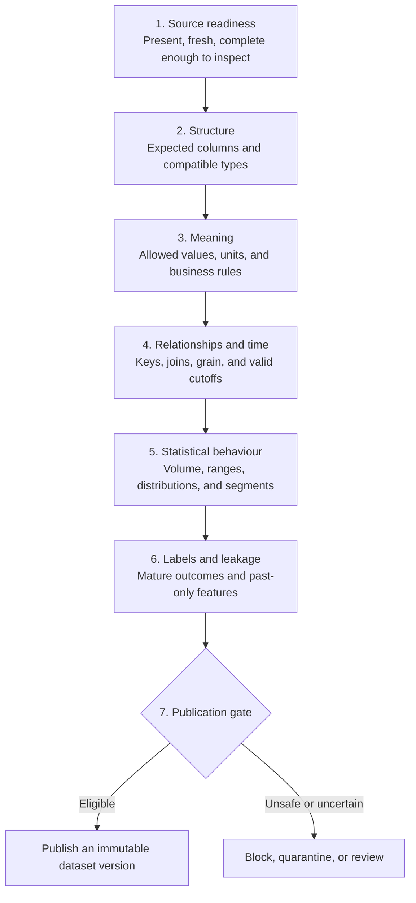
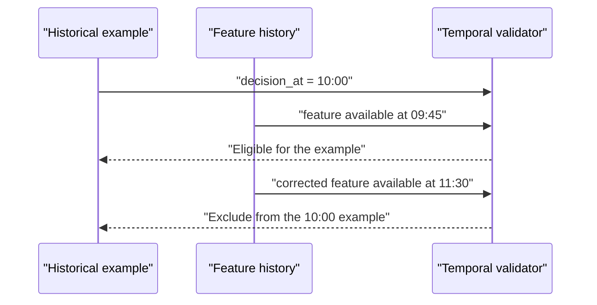
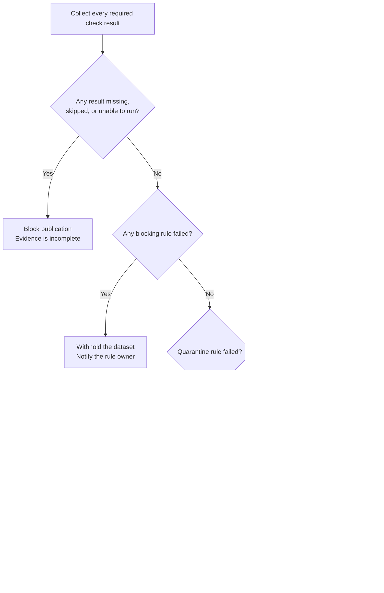

## Table of Contents

1. [When a Successful Run Still Produces Unsafe Data](#when-a-successful-run-still-produces-unsafe-data)
2. [Check Data In Several Layers Before Publishing It](#check-data-in-several-layers-before-publishing-it)
3. [Confirm the Source Is Ready](#confirm-the-source-is-ready)
4. [Check Both Data Shape And Real-World Meaning](#check-both-data-shape-and-real-world-meaning)
5. [Check How Rows Relate And Which Time They Represent](#check-how-rows-relate-and-which-time-they-represent)
6. [Check Whether The Data Population Has Changed](#check-whether-the-data-population-has-changed)
7. [Validate Labels And Prevent Leakage](#validate-labels-and-prevent-leakage)
8. [Decide Whether The Dataset Is Safe To Publish](#decide-whether-the-dataset-is-safe-to-publish)
9. [Keep Bad Data Out, Repair It, And Rebuild Affected Outputs](#keep-bad-data-out-repair-it-and-rebuild-affected-outputs)
10. [Record The Checks, Results, And Responsible Owner](#record-the-checks-results-and-responsible-owner)
11. [Make Sure The Validation Job Itself Still Runs](#make-sure-the-validation-job-itself-still-runs)
12. [Choose Validation Tools That Fit Where The Data Runs](#choose-validation-tools-that-fit-where-the-data-runs)
13. [How A Validation Run Decides What Gets Published](#how-a-validation-run-decides-what-gets-published)
14. [References](#references)

## When a Successful Run Still Produces Unsafe Data
<!-- section-summary: A pipeline can finish every technical step while producing data that is unsuitable for training, evaluation, or prediction. -->

A nightly pipeline reads the expected files, finishes every transformation, and writes a training table. The scheduler marks the run as successful. A training job then reads the table and produces a model without raising an exception.

The run can still be unsafe.

Suppose an upstream identifier changed from an integer to a prefixed string. The transformation accepted both types after converting them to text, so the job stayed green. The label join, however, matched only 62 percent of examples instead of its usual 96 percent. The final table contains valid columns and readable rows, yet more than one third of the outcomes are missing. A model trained on that table would learn from a distorted view of reality.

This is the problem that **data validation** solves. At a high level, data validation asks whether a particular set of data is fit for a particular use. “The file exists” and “the SQL finished” are operational facts. “This dataset is safe to train on” is a stronger claim that needs evidence about the data itself.

The intended use matters. A delayed outcome table may be acceptable for a monthly report and unusable for a training run scheduled this morning. One malformed online request can receive a client error while other requests continue. A broken label join across an entire training release should stop every new candidate model.

In practical terms, validation is a controlled path from observations to a decision:

1. identify the data boundary and intended consumer;
2. run checks in an order that exposes fundamental failures first;
3. compare each observation with a reviewed rule;
4. decide whether to publish, warn, quarantine, request review, or stop;
5. preserve enough evidence to investigate and reproduce that decision.

The check itself is only one part. A rule such as “label coverage must be at least 95 percent” needs the dataset identity and the observed coverage. Its owner, severity, and response determine what happens after a failure. Without those surrounding controls, the rule can fail loudly while damaged data continues downstream.

## Check Data In Several Layers Before Publishing It
<!-- section-summary: A layered validation path moves from basic source readiness to ML-specific label and leakage checks before making a publication decision. -->

One giant “data quality” check would mix unrelated failures. A missing source partition, an unexpected column, a broken join, and a shifted category distribution require different owners and different repairs. Production systems separate them into layers.

You can think of the layers as a sequence of increasingly contextual questions. Early layers ask whether the data is present and readable. Middle layers ask whether rows still carry the intended meaning and relationships. Later layers ask whether the dataset still represents the modelling task.


```mermaid

flowchart TD
    A["1. Source readiness<br/>Present, fresh, complete enough to inspect"] --> B["2. Structure<br/>Expected columns and compatible types"]
    B --> C["3. Meaning<br/>Allowed values, units, and business rules"]
    C --> D["4. Relationships and time<br/>Keys, joins, grain, and valid cutoffs"]
    D --> E["5. Statistical behaviour<br/>Volume, ranges, distributions, and segments"]
    E --> F["6. Labels and leakage<br/>Mature outcomes and past-only features"]
    F --> G{"7. Publication gate"}
    G -->|Eligible| H["Publish an immutable dataset version"]
    G -->|Unsafe or uncertain| I["Block, quarantine, or review"]

    class A ready
    class B,C,D contract
    class E,F ml
    class G,H,I decision
```

This order protects both correctness and diagnosis. Distribution statistics computed from a half-loaded partition have little value. A label-rate alert is difficult to interpret before join coverage is known. Running cheaper structural checks first also prevents a large statistical scan from consuming compute after a basic schema failure.

The layers remain separate even if one tool executes several of them. A dbt job can check source freshness, key relationships, and label coverage in the same warehouse. Their results still need distinct names and severities because they protect different assumptions.

Three controls cross every layer:

- **A validation contract** records the rule, threshold, boundary, severity, owner, and expected response.
- **Validation evidence** records what ran, against which data version, and what it observed.
- **A publication gate** interprets the complete result set and controls whether a consumer can discover the dataset.

These controls turn individual assertions into a dependable production system.

## Confirm the Source Is Ready
<!-- section-summary: Readiness checks stop a pipeline from interpreting missing, stale, partial, or unreadable input as real business behaviour. -->

Before inspecting individual values, the pipeline needs to confirm that the expected input actually arrived. This first layer is **source readiness**.

Imagine a daily transaction partition that normally contains between 8 million and 11 million rows. Today it contains 40,000 because an upstream export stopped after two minutes. Every one of those rows may follow the schema perfectly. Treating the partial partition as a complete day would make transaction volume, customer activity, and label rates appear to collapse.

Readiness checks usually cover:

- the expected file, table, stream offset, or partition exists;
- the latest event or load timestamp is recent enough;
- the source contains a plausible amount of data;
- an upstream completion marker or manifest is present;
- the validation identity can read the source;
- required upstream jobs reached a successful terminal state.

Freshness deserves a precise clock. **Event time** records when the business event occurred. **Ingestion time** records when the platform received it. A source can have a recent ingestion timestamp while carrying old events after a replay. Teams often measure both for feeds where late or replayed data changes the model.

For warehouse pipelines, dbt source freshness can compare the most recent load timestamp with warning and error thresholds. The freshness command should run as an explicit blocking job step if stale data must stop downstream models. In dbt's managed job settings, the convenience “Run source freshness” option records the check and allows later steps to continue after a failure.

```yaml
sources:
  - name: product_events
    config:
      loaded_at_field: ingested_at
      freshness:
        warn_after: {count: 2, period: hour}
        error_after: {count: 6, period: hour}
    tables:
      - name: completed_sessions
```

A six-hour error threshold has meaning only if the product and source schedule support it. An hourly feed with a six-hour tolerance may hide several missed deliveries. A weekly reference table may be healthy at the same age.

Readiness failures also need two different diagnoses. A **data failure** means the source was available to inspect and violated a rule. An **execution failure** means the checker could not reach a conclusion because credentials expired, the query timed out, or the validation process crashed. Production gates should treat an execution failure as incomplete evidence and withhold publication. Otherwise a broken validator creates the same outcome as a passing validator.

## Check Both Data Shape And Real-World Meaning
<!-- section-summary: Structural rules keep data machine-readable, while semantic rules protect the real-world meaning carried by valid-looking values. -->

After the source is ready, the next question is whether the records still have the shape and meaning expected by their consumer. These are separate responsibilities because a row can be structurally valid and semantically wrong.

### Check Columns, Types, And Required Fields

A **schema** describes fields and their data types. A training table might require `account_id` as text and `balance` as a decimal. It might also require `country_code` as text and `decision_at` as a timestamp. Structural validation checks the presence and type of those fields. It can also protect nested shapes and column order where a file format depends on them.

Suppose `balance` changes from a decimal to a string containing values such as `"1,240.50 GBP"`. The feature calculation can no longer treat it as a number. A schema gate should stop that change close to the source and identify the producer responsible for the field.

Schema evolution is legitimate, so the contract also describes compatibility. Adding an optional field may be safe. Removing a required field or changing its meaning usually requires coordinated producer and consumer releases. Automatically accepting every new field can preserve a typo as production data.

Warehouse-native types and enforced constraints provide the closest protection to the stored table. dbt data tests add reusable assertions to sources and models. Great Expectations (GX) adds explicit Expectations around batches read through Python. The implementation can vary; the structural claim should remain the same across systems.

### Check Whether Values Make Sense For The Domain

**Semantic validation** checks what a value means in the real world. An age of `900`, a probability of `1.7`, and a country code of `"UNKNOWN_NEW"` can all have valid data types. Domain rules decide whether those values are acceptable.

Domain rules cover allowed categories, valid units, ranges, conditional requirements, and cross-field logic. For example:

- `currency` must identify the unit used by `amount`;
- `end_at` must follow `start_at`;
- a completed order must have a completion timestamp;
- a probability must remain between zero and one;
- a fallback category must be explicit instead of silently mapped to a common class.

A threshold often needs more nuance than “any bad row fails.” Five malformed rows in a raw landing table may enter quarantine. The remaining data can continue only after validation confirms that it still represents the intended population. One impossible label value in a regulated decision dataset may block the entire release. The contract connects the same observation to the appropriate product consequence.

dbt's generic data tests cover common rules such as `not_null`, `unique`, `accepted_values`, and `relationships`. A custom singular test is a SQL query that returns the failing rows, which fits conditional domain logic:

```sql
select account_id, status, closed_at
from {{ ref('training_accounts') }}
where status = 'closed'
  and closed_at is null
```

Zero returned rows means the assertion passed. Storing failures can speed investigation, although those records need access controls and retention because they may contain sensitive fields.

## Check How Rows Relate And Which Time They Represent
<!-- section-summary: Relational checks preserve row identity and join coverage, while temporal checks stop future information from entering historical examples. -->

Most ML datasets are assembled from several tables. Each source can pass its own checks while the final join quietly changes the population. This layer protects how records connect and which historical information each example is allowed to see.

### Check Keys, Duplicates, And Joins

Every dataset has a **grain**: what one row represents. One row might represent an account, a transaction, or an account at one decision time. The key must identify that grain.

Suppose a feature table accidentally contains two rows for each account after a regional migration. Joining it to examples doubles those accounts. Row count grows, the model overweights the affected region, and no field needs to contain an invalid value.

Relational validation therefore measures:

- uniqueness at the intended grain;
- duplicate rates and unexpected many-to-many joins;
- referential integrity between keys;
- join coverage for the whole dataset and important segments;
- row counts before and after transformations;
- unmatched keys preserved for diagnosis.

Join coverage is the share of expected rows that found a match. An overall result can hide a local failure. Coverage may remain at 98 percent while one new region drops to 35 percent. Production checks calculate the overall value and the values for segments tied to product risk, geography, acquisition path, device type, or model route.

### Keep Future Information Out Of Historical Rows

Training examples should contain only information that would have been available at the moment of prediction. Using information from later in time is **data leakage**. Leakage can create excellent offline metrics and poor production results because those future facts are unavailable to the live system.

Three timestamps help expose the boundary:

- the event time says when a fact occurred;
- the availability time says when the feature pipeline could use it;
- the decision time says when the model would have predicted.

For each historical example, feature availability should be at or before decision time. A refund may have an event date attached to the original purchase, yet the refund record only arrived ten days later. Joining by event date alone would leak that later knowledge into the earlier decision.


```mermaid

sequenceDiagram
    participant E as "Historical example"
    participant F as "Feature history"
    participant V as "Temporal validator"

    E->>V: "decision_at = 10:00"
    F->>V: "feature available at 09:45"
    V-->>E: "Eligible for the example"
    F->>V: "corrected feature available at 11:30"
    V-->>E: "Exclude from the 10:00 example"
```

Point-in-time joins implement this rule by selecting the latest eligible feature value for each decision. Validation then checks for future availability timestamps, missing historical matches, and unexpected changes in match coverage after late data or a backfill.

## Check Whether The Data Population Has Changed
<!-- section-summary: Statistical checks reveal population and pipeline changes that valid rows and schemas cannot expose. -->

By this stage, the data is present, readable, meaningful, joinable, and time-correct. It can still describe a very different population from the one the model or pipeline expects. **Statistical validation** measures that broader behaviour.

Useful observations include row count, null rate, distinct-key count, category shares, quantiles, class rate, and segment coverage. Teams compare the new data with a relevant baseline. That baseline may be a previous approved dataset, the same weekday over recent weeks, or the reference used by the current model.

Consider an income feature. Its minimum and maximum remain valid, yet the median rises by 40 percent in one day. That can indicate a new customer population, a currency conversion error, or a change in how missing values were filled. The statistic identifies a difference; investigation identifies the cause.

This is why distribution checks often warn or request review before they block. Real product launches, holidays, weather events, and policy changes all move distributions. A rigid threshold can reject healthy data during the exact period the model needs to learn.

The contract should define:

- the baseline dataset and its version;
- the comparison window;
- the statistic or distance measure;
- the important segments;
- the minimum sample size;
- the action at warning and blocking thresholds.

Metrics such as the Kolmogorov–Smirnov statistic, population stability index, or Jensen–Shannon divergence summarize different kinds of distribution change. Their names matter less than their assumptions. A large sample can make a tiny difference statistically significant, while a small sample can hide an important segment shift. Keep interpretable measures such as quantiles and category shares beside a distance score so an investigator can see what moved.

Statistical checks also need seasonality. Comparing Monday morning traffic with Sunday night traffic may create a permanent false alarm. A useful baseline follows the product's known cycle and stays pinned to an approved data version. Updating it automatically after every run can teach the validator to accept a slowly deteriorating pipeline.

## Validate Labels And Prevent Leakage
<!-- section-summary: ML-specific validation confirms that outcomes are mature, joined correctly, policy-consistent, and separated from future information. -->

Labels tell the model what happened. A label may be a purchase, a repayment, a defect, a cancellation, or a human review decision. Damage here changes the task the model learns, even if every feature remains healthy.

Many labels arrive late. A chargeback can appear weeks after a transaction. A customer may count as retained only after a fixed observation window. Data collected yesterday can therefore contain plenty of features and very few mature outcomes.

**Label maturity** means that an example has waited long enough for the outcome definition to be applied fairly. The validator should separate “label still pending” from “label join failed.” Treating both as `NULL` hides two different problems.

A training release commonly checks:

- the share of examples whose outcome window has closed;
- label join coverage after that maturity cutoff;
- positive and negative class rates overall and by important segment;
- allowed label values;
- agreement with the approved policy version;
- duplicate or contradictory labels for one example;
- label timestamps after the decision time;
- feature columns derived from the outcome or later actions.

Suppose a repayment model requires a 60-day outcome window. Yesterday's applications are expected to have pending labels and stay outside supervised training. Applications from six months ago should be mature. If 30 percent of that older group still lacks labels, the team investigates the join, outcome feed, or eligibility rule before training.

Leakage checks need domain knowledge as well as SQL. A column named `case_closed_reason` clearly arrives after a decision. A less obvious feature such as “number of support calls in the next seven days” may look like an ordinary count. Feature reviews, timestamp checks, and an allowlist of approved feature definitions work together to catch it.

The release binds `:label_cutoff` to a fixed timestamp. It also reads an immutable approved label snapshot whose uniqueness and final-state checks allow at most one mature final label for each `example_id`.

```sql
with eligible_examples as (
  select example_id, region
  from training_examples_v317
  where decision_at <= :label_cutoff - interval '60 day'
),
mature_final_labels as (
  select example_id, label
  from approved_final_labels_v42
  where finalized_at <= :label_cutoff
)
select
  e.region,
  count(*) as eligible_examples,
  count(l.example_id) as joined_labels,
  count(l.example_id) * 1.0 / nullif(count(*), 0) as label_coverage
from eligible_examples e
left join mature_final_labels l using (example_id)
group by e.region
```

Examples whose 60-day window remains open never enter `eligible_examples`, so pending outcomes stay outside the denominator. Every eligible example remains after the left join. A missing match therefore lowers coverage and reveals a mature outcome that the approved label snapshot failed to supply.

This grouped result measures every required region. The gate runs the same aggregation without `region` and `group by` for overall coverage. It compares both views with their reviewed thresholds, and a failed required region blocks the release even if the overall percentage passes.

## Decide Whether The Dataset Is Safe To Publish
<!-- section-summary: A publication gate reads the complete validation result set and decides whether a named dataset version can reach its consumer. -->

A validator can report that label coverage is 93 percent. A gate also needs the label policy, the dataset boundary, the affected population, and the fallback available to the product. Those details determine whether training continues.

A **publication gate** combines results with that policy. It runs after every required layer has produced a result, then assigns one of four practical outcomes:

- **publish** exposes the immutable dataset version to its consumer;
- **warn or review** preserves the observation and requires a named owner to accept or reject the change;
- **quarantine** isolates an eligible scope and revalidates the remainder;
- **block** withholds the dataset from training, evaluation, feature publication, or serving.


```mermaid

flowchart TD
    A["Collect every required check result"] --> B{"Any result missing,<br/>skipped, or unable to run?"}
    B -->|Yes| C["Block publication<br/>Evidence is incomplete"]
    B -->|No| D{"Any blocking rule failed?"}
    D -->|Yes| E["Withhold the dataset<br/>Notify the rule owner"]
    D -->|No| F{"Quarantine rule failed?"}
    F -->|Yes| G["Isolate affected scope<br/>Revalidate the remainder"]
    F -->|No| H{"Review threshold crossed?"}
    H -->|Yes| I["Require an owned decision<br/>before the deadline"]
    H -->|No| J["Publish immutable version<br/>with validation result ID"]

    class A,J healthy
    class B,D,F,H choice
    class C,E stop
    class G,I work
```

Missing evidence should fail closed at important boundaries. If a contract expects 24 results and receives 23, the gate treats the missing check as incomplete. The validation system records an execution failure and blocks publication until the evidence is complete.

Severity comes from product impact. An incompatible serving schema usually blocks because safe interpretation of the request is impossible. A distribution shift may request review because it could reflect a legitimate launch. A few malformed raw records may enter quarantine if their removal leaves a complete and representative dataset.

Row-level and dataset-level decisions also differ. After dropping one invalid record, the gate rechecks the remaining dataset. It must recompute row count, class balance, segment coverage, and any other assumptions affected by the removal.

Publication should create a new immutable identity or move an atomic “approved” reference only after the decision passes. Training jobs consume that approved identity. Searching a mutable folder for the newest files could expose an unvalidated dataset.

## Keep Bad Data Out, Repair It, And Rebuild Affected Outputs
<!-- section-summary: Recovery preserves the rejected data, fixes the responsible boundary, rebuilds a new version, and proves that the original contract passes. -->

When a check fails, the candidate dataset stays out of training and production use. The response preserves the failed data for diagnosis, limits the impact, corrects the responsible source or transformation, rebuilds affected outputs, and proves recovery before publication resumes.

**Quarantine** moves or marks the affected rows, files, partitions, or keys and keeps them unavailable to normal consumers. A useful quarantine record keeps the source identity, failed rule, contract version, failure time, and restricted pointer to diagnostic samples. An owner and retention deadline prevent the quarantine area from accumulating forgotten data.

Suppose one region loses 70 percent of label matches after an identifier migration. The team withholds the training release and quarantines that region's candidate rows. The data producer fixes the identifier mapping, then rebuilds the affected dates into a new dataset version. The original failed version stays addressable for investigation.

A **backfill** recomputes historical data after code, source data, or policy changes. A safe backfill follows these steps:

1. identify the affected time range, keys, and downstream versions;
2. fix and review the producer or transformation logic;
3. write corrected output to a new immutable version;
4. run the same validation contract, including segment and label checks;
5. compare corrected and rejected versions to explain every material change;
6. publish the replacement and update downstream references;
7. retire quarantine data according to the retention policy.

Changing a threshold until the old dataset passes creates a policy change. A repair corrects the source data or transformation. If evidence supports a new threshold, the owner records the reason and reviews the downstream risk. The change creates a new contract version that is tested against recent healthy data and known failures. That process protects the team from weakening a rule during incident pressure.

Fallbacks also need explicit limits. A serving pipeline may use the previous approved feature snapshot for a short outage. The response records its maximum age, affected routes, alert, and exit condition. A training pipeline can usually wait for corrected data. Silently substituting a stale dataset may produce a model whose evidence no longer matches the release request.

Recovery requires three pieces of proof. The new dataset passes the original or deliberately revised contract. Downstream jobs consume the replacement identity. Monitoring confirms that the failing observation returned to its expected range.

## Record The Checks, Results, And Responsible Owner
<!-- section-summary: Validation evidence connects a result to its data, policy, owner, action, and downstream release. -->

Six months after a model release, the statement “the data tests passed” omits the evidence an investigator needs. The record must identify the tests, dataset, thresholds, and observations.

Each validation run should preserve:

- dataset and partition versions;
- contract and check implementation versions;
- pipeline run and code revision;
- start time, end time, and execution status;
- expected and observed values;
- segment or scope;
- severity and final gate decision;
- owner and response;
- controlled references to failing samples;
- downstream training, model, or feature-release identities.

```yaml
validation_run: customer-risk-data-1842
dataset_version: customer-risk-examples-v317
contract_version: training-data-v9
execution_status: complete
decision: blocked
failed_check:
  id: mature-label-coverage
  expected: ">= 0.97"
  observed: 0.81
  segment: region_eu
owner: risk-data
samples_uri: governed://validation/customer-risk-data-1842
```

The result store can be a warehouse table, an object in governed storage, a validation platform, or a provider-native result service. The important property is traceability. A training run should reference the successful validation run that approved its dataset. A release reviewer can then follow the chain from model to training run, dataset version, contract, and observations.

Failing samples need stronger protection than aggregate metrics. They can expose personal, health, financial, or commercially sensitive data. Keep a small approved sample or governed row references in restricted storage. Apply retention and deletion rules there, while alerts carry only safe summaries and the evidence reference.

Ownership belongs to the boundary that can correct the issue. A data producer owns a missing source partition. An analytics or data engineering team may own a broken transformation. An ML team owns label eligibility and feature leakage rules. The validation platform team owns missing results, timeouts, and result-publication failures. Alerts should route to that owner with the dataset, rule, observation, and immediate containment action already attached.

## Make Sure The Validation Job Itself Still Runs
<!-- section-summary: Validator health metrics reveal silent gaps where checks stopped running, scanned the wrong scope, or failed to publish evidence. -->

A validation system can fail silently too. The scheduler may skip the job, credentials may expire, a filter may scan zero partitions, or the result writer may stop updating. If nobody monitors the validator, the absence of failures can look like healthy data.

The system therefore needs operational signals of its own:

- expected check count compared with returned results;
- last successful validation time for every protected boundary;
- execution duration and timeout count;
- rows, bytes, partitions, or stream offsets scanned;
- data version and contract version used;
- result-write success;
- warning, failure, quarantine, and review counts;
- age of unresolved reviews and quarantined data.

Consider a validator that usually scans 80 million rows and finishes in 14 minutes. Today's run reports every rule as passing after scanning zero rows in 20 seconds. Check-result status alone says “pass.” Scope telemetry says the validation never inspected the intended dataset.

The orchestrator should treat missing results, zero unexpected scope, and result-publication errors as failed tasks. It should also alert before the validation service-level objective expires. A six-hour freshness rule provides little protection if the validation job has not run for two days.

Monitoring can use the organization's normal stack. Emit structured run metrics to cloud monitoring or Prometheus, trace long queries with OpenTelemetry where useful, and alert through the existing incident system. Keep dataset IDs, contract versions, and bounded status values as dimensions. Governed evidence storage holds raw failing rows; metric labels and traces carry safe summaries.

Teams should test this control path. A scheduled test can disable one expected rule, force a query timeout, or make the result store unavailable in a non-production environment. The gate should withhold publication, the correct owner should receive an alert, and the run should expose the missing evidence. This proves that validator failure cannot quietly approve data.

## Choose Validation Tools That Fit Where The Data Runs
<!-- section-summary: The right validation tool follows the data location, execution engine, ownership model, and response required at the boundary. -->

The tool choice comes after the validation responsibilities are clear. Most teams need a small combination because warehouse tables, Python dataframes, distributed Spark pipelines, and managed cloud services expose different control points.

### Start With SQL And Warehouse-Native Controls

Use database types and enforced constraints for rules the storage engine can guarantee at write time. Use SQL assertions for aggregate, relational, temporal, and business rules. These checks run close to the data and avoid exporting large tables into a separate service.

dbt fits teams whose transformations already live in warehouse SQL. Generic data tests cover repeated rules, while singular tests express one-off business logic as queries that return failing rows. `severity`, `error_if`, and `warn_if` map a failure count to job behavior, and `store_failures` can preserve records for investigation. dbt owns SQL-model validation; the scheduler or deployment job still owns whether a failed test blocks publication.

### When A Dedicated Validation Framework Helps

GX Core fits Python teams that validate batches across files, dataframes, and databases. An Expectation expresses one assertion. An Expectation Suite groups related assertions. A Validation Definition connects a data batch definition with a suite. A Checkpoint runs one or more Validation Definitions, returns Validation Results, and can trigger actions such as notifications or updated Data Docs.

Those objects help a team reuse the same policy across environments while keeping results addressable. The publication decision should still verify that every required Validation Definition ran. A notification action delivers evidence, while a separate gate controls publication.

Soda fits teams that want shared data contracts, testing, and production observability around warehouse or database sources. Soda 4 separates execution choices: Soda Core runs contracts inside custom pipelines, while hosted or self-hosted Agents execute managed scans connected to Soda Cloud. Its current platform adds contract collaboration and observability beyond the older CLI-centric v3 workflow.

Choose GX for code-controlled Python validation and custom batch integration. Choose Soda when cross-team contract workflows, managed observation, and a shared investigation surface justify the platform. A warehouse-only team may need neither if dbt and native monitoring already cover its boundaries.

### When Validation Runs On Spark

Deequ is an open-source library built on Apache Spark. Its `VerificationSuite` runs `Check` constraints and computes metrics through Spark jobs, which suits large tabular datasets already processed on Spark. It is a library, so the team owns scheduling, result storage, alerting, upgrades, and publication decisions.

On Databricks, Lakeflow Declarative Pipelines expectations apply SQL Boolean rules to records moving through streaming tables and materialized views. The current actions are:

- `expect` retains invalid records and records metrics;
- `expect_or_drop` removes invalid records and records the dropped count;
- `expect_or_fail` stops and rolls back the offending flow update.

```python
from pyspark import pipelines as dp

@dp.table
@dp.expect_or_fail("account_id_required", "account_id IS NOT NULL")
@dp.expect("known_region", "region IN ('EU', 'US', 'APAC')")
def validated_accounts():
    return spark.readStream.table("raw.accounts")
```

The first rule protects a required key. The second keeps unexpected regions for inspection and records their count. A triggered Lakeflow pipeline can continue parallel flows after one flow fails. A release-wide gate should therefore place validation and downstream publication in separate pipeline tasks. An explicit job dependency allows publication to start only after validation succeeds.

Open-source Spark Declarative Pipelines provides the pipeline framework, while these expectation APIs are a Databricks Lakeflow capability. Portable Spark teams can keep their validation in Deequ, SQL, or another engine-independent contract layer.

### When To Use A Cloud Provider's Quality Service

AWS Glue Data Quality provides a managed serverless layer built on Deequ. Teams write rules in Data Quality Definition Language (DQDL) and can evaluate cataloged data or data moving through Glue ETL. Row-level failed-record identification is available in the ETL path, while catalog evaluation focuses on dataset results. It fits an AWS data platform that already uses Glue, S3, Redshift, JDBC sources, and EventBridge or CloudWatch.

On Google Cloud, Knowledge Catalog automatic data quality runs `DataScan` jobs against BigQuery and supported Iceberg REST Catalog tables. It provides built-in row and aggregate rules, custom SQL, result export to BigQuery, metadata publication, and Cloud Logging signals. Use automatic data quality for new managed implementations; the older open-source-based data quality tasks are documented as a legacy offering.

Managed services remove infrastructure work and integrate with provider monitoring. The team still defines label maturity, point-in-time, segment, leakage, ownership, and publication policies.

## How A Validation Run Decides What Gets Published
<!-- section-summary: Reliable validation connects ordered checks to an explicit release decision, durable evidence, owned recovery, and monitoring of the validator. -->

A production validation run starts by confirming that the intended sources arrived and that the checker can read them. It protects schema and domain meaning before evaluating joins, row grain, and time boundaries. Statistical checks then compare the eligible population with a relevant baseline. Label and leakage checks confirm that the dataset represents the task the model will face.

The publication gate waits for every required result. A complete pass exposes a named immutable dataset version. A block withholds it. Quarantine creates a smaller candidate that must pass the affected checks again. Review routes an uncertain change to an owner with a deadline and preserved evidence.

If a rule fails, the response fixes the responsible boundary and writes corrected data to a new version. The same contract validates that replacement. Evidence connects the final decision to the dataset, code, policy, owner, and downstream model. Operational monitoring confirms that the validation job itself continues to run over the intended scope.

This full path is what turns data checks into an MLOps control. The model receives data whose structure, meaning, history, population, and outcomes were all evaluated for the use that follows.

## References

- [dbt data tests](https://docs.getdbt.com/docs/build/data-tests)
- [dbt source freshness](https://docs.getdbt.com/docs/deploy/source-freshness)
- [dbt severity, error_if, and warn_if](https://docs.getdbt.com/reference/resource-configs/severity)
- [Great Expectations: define Expectations](https://docs.greatexpectations.io/docs/core/define_expectations/)
- [Great Expectations: create a Checkpoint with Actions](https://docs.greatexpectations.io/docs/core/trigger_actions_based_on_results/create_a_checkpoint_with_actions/)
- [Soda 4 overview](https://docs.soda.io/)
- [Deequ](https://github.com/awslabs/deequ)
- [Databricks Lakeflow pipeline expectations](https://docs.databricks.com/aws/en/ldp/expectations)
- [Databricks expectation recommendations and advanced patterns](https://docs.databricks.com/aws/en/ldp/expectation-patterns)
- [Apache Spark Declarative Pipelines](https://spark.apache.org/docs/latest/declarative-pipelines-programming-guide.html)
- [AWS Glue Data Quality](https://docs.aws.amazon.com/glue/latest/dg/glue-data-quality.html)
- [Google Cloud Knowledge Catalog automatic data quality](https://docs.cloud.google.com/dataplex/docs/auto-data-quality-overview)
